# AST Parsing and Code Chunking

<cite>
**Referenced Files in This Document**
- [tree_sitter.py](file://src/ws_ctx_engine/chunker/tree_sitter.py)
- [base.py](file://src/ws_ctx_engine/chunker/base.py)
- [regex.py](file://src/ws_ctx_engine/chunker/regex.py)
- [markdown.py](file://src/ws_ctx_engine/chunker/markdown.py)
- [__init__.py](file://src/ws_ctx_engine/chunker/__init__.py)
- [base.py](file://src/ws_ctx_engine/chunker/resolvers/base.py)
- [python.py](file://src/ws_ctx_engine/chunker/resolvers/python.py)
- [javascript.py](file://src/ws_ctx_engine/chunker/resolvers/javascript.py)
- [typescript.py](file://src/ws_ctx_engine/chunker/resolvers/typescript.py)
- [rust.py](file://src/ws_ctx_engine/chunker/resolvers/rust.py)
- [__init__.py](file://src/ws_ctx_engine/chunker/resolvers/__init__.py)
- [models.py](file://src/ws_ctx_engine/models/models.py)
- [budget.py](file://src/ws_ctx_engine/budget/budget.py)
- [config.py](file://src/ws_ctx_engine/config/config.py)
</cite>

## Table of Contents
1. [Introduction](#introduction)
2. [Project Structure](#project-structure)
3. [Core Components](#core-components)
4. [Architecture Overview](#architecture-overview)
5. [Detailed Component Analysis](#detailed-component-analysis)
6. [Dependency Analysis](#dependency-analysis)
7. [Performance Considerations](#performance-considerations)
8. [Troubleshooting Guide](#troubleshooting-guide)
9. [Conclusion](#conclusion)
10. [Appendices](#appendices)

## Introduction
This document explains the AST parsing and code chunking system used by ws-ctx-engine. It focuses on how tree-sitter integration enables precise, syntax-aware parsing across multiple programming languages, how the resolver pattern selects language-specific strategies based on file extensions and language detection, and how language-specific chunking extracts symbols and boundaries for Python, JavaScript, TypeScript, and Rust. It also documents the fallback mechanism when tree-sitter is unavailable, using regex-based parsing, and outlines chunk size optimization, overlapping windows for context preservation, and edge-case handling for malformed code. Finally, it provides examples of how different language constructs are parsed and chunked for optimal consumption by downstream systems such as LLMs.

## Project Structure
The chunking subsystem is organized around:
- A base AST chunker interface and shared utilities for file inclusion/exclusion and ignore-spec handling
- A tree-sitter-based chunker that leverages language-specific resolvers
- A regex-based fallback chunker for environments without tree-sitter
- A markdown chunker for documentation files
- Resolvers per language that define target AST node types, symbol extraction, and references
- Models for standardized code chunks and metadata
- Configuration and budget management for token-aware selection

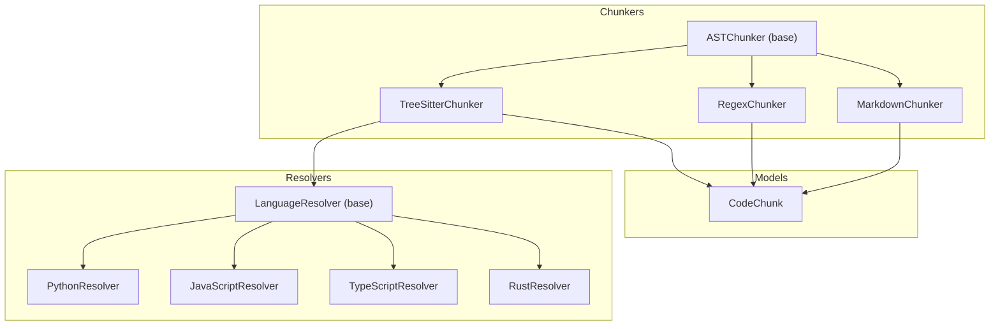

**Diagram sources**
- [tree_sitter.py:15-160](file://src/ws_ctx_engine/chunker/tree_sitter.py#L15-L160)
- [regex.py:15-219](file://src/ws_ctx_engine/chunker/regex.py#L15-L219)
- [markdown.py:13-100](file://src/ws_ctx_engine/chunker/markdown.py#L13-L100)
- [base.py:41-176](file://src/ws_ctx_engine/chunker/base.py#L41-L176)
- [base.py:7-70](file://src/ws_ctx_engine/chunker/resolvers/base.py#L7-L70)
- [python.py:6-61](file://src/ws_ctx_engine/chunker/resolvers/python.py#L6-L61)
- [javascript.py:6-85](file://src/ws_ctx_engine/chunker/resolvers/javascript.py#L6-L85)
- [typescript.py:6-103](file://src/ws_ctx_engine/chunker/resolvers/typescript.py#L6-L103)
- [rust.py:6-55](file://src/ws_ctx_engine/chunker/resolvers/rust.py#L6-L55)
- [models.py:10-152](file://src/ws_ctx_engine/models/models.py#L10-L152)

**Section sources**
- [tree_sitter.py:15-160](file://src/ws_ctx_engine/chunker/tree_sitter.py#L15-L160)
- [regex.py:15-219](file://src/ws_ctx_engine/chunker/regex.py#L15-L219)
- [markdown.py:13-100](file://src/ws_ctx_engine/chunker/markdown.py#L13-L100)
- [base.py:41-176](file://src/ws_ctx_engine/chunker/base.py#L41-L176)
- [models.py:10-152](file://src/ws_ctx_engine/models/models.py#L10-L152)

## Core Components
- ASTChunker: Abstract base defining the parse contract and shared utilities for file filtering and ignore-spec handling.
- TreeSitterChunker: Uses py-tree-sitter to parse supported languages, resolve AST nodes via resolvers, and extract imports and symbols.
- RegexChunker: Fallback parser using language-specific regex patterns to detect definitions and blocks.
- MarkdownChunker: Splits Markdown files into chunks based on headings.
- LanguageResolver family: Encapsulates language-specific logic for target AST node types, symbol extraction, and references.
- CodeChunk: Standardized data model for chunk metadata and content.

Key responsibilities:
- Language detection by file extension
- AST traversal and symbol extraction
- Import statement collection
- Boundary detection for function/class/method blocks
- Token-aware selection and budget management

**Section sources**
- [base.py:41-176](file://src/ws_ctx_engine/chunker/base.py#L41-L176)
- [tree_sitter.py:15-160](file://src/ws_ctx_engine/chunker/tree_sitter.py#L15-L160)
- [regex.py:15-219](file://src/ws_ctx_engine/chunker/regex.py#L15-L219)
- [markdown.py:13-100](file://src/ws_ctx_engine/chunker/markdown.py#L13-L100)
- [base.py:7-70](file://src/ws_ctx_engine/chunker/resolvers/base.py#L7-L70)
- [models.py:10-152](file://src/ws_ctx_engine/models/models.py#L10-L152)

## Architecture Overview
The system integrates tree-sitter for precise parsing and falls back to regex-based parsing when tree-sitter is unavailable. The resolver pattern selects language-specific strategies based on file extensions. Markdown files are handled separately. Chunks are emitted as standardized CodeChunk objects enriched with symbols defined and referenced.

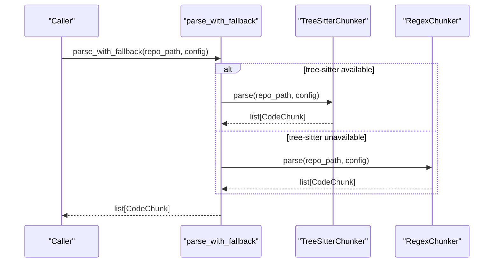

**Diagram sources**
- [__init__.py:17-38](file://src/ws_ctx_engine/chunker/__init__.py#L17-L38)
- [tree_sitter.py:57-89](file://src/ws_ctx_engine/chunker/tree_sitter.py#L57-L89)
- [regex.py:75-105](file://src/ws_ctx_engine/chunker/regex.py#L75-L105)

**Section sources**
- [__init__.py:17-38](file://src/ws_ctx_engine/chunker/__init__.py#L17-L38)
- [tree_sitter.py:57-89](file://src/ws_ctx_engine/chunker/tree_sitter.py#L57-L89)
- [regex.py:75-105](file://src/ws_ctx_engine/chunker/regex.py#L75-L105)

## Detailed Component Analysis

### Tree-Sitter Integration and Resolver Pattern
TreeSitterChunker initializes language parsers and maps file extensions to languages. It traverses the AST using resolvers to extract definitions and imports, then enriches chunks with referenced symbols.

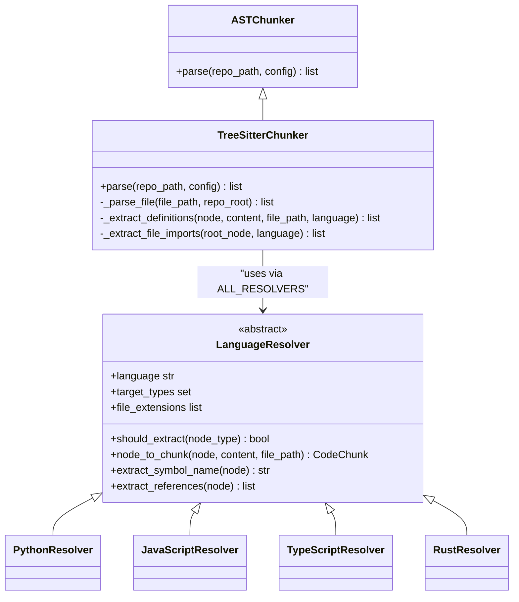

**Diagram sources**
- [tree_sitter.py:15-160](file://src/ws_ctx_engine/chunker/tree_sitter.py#L15-L160)
- [base.py:7-70](file://src/ws_ctx_engine/chunker/resolvers/base.py#L7-L70)
- [python.py:6-61](file://src/ws_ctx_engine/chunker/resolvers/python.py#L6-L61)
- [javascript.py:6-85](file://src/ws_ctx_engine/chunker/resolvers/javascript.py#L6-L85)
- [typescript.py:6-103](file://src/ws_ctx_engine/chunker/resolvers/typescript.py#L6-L103)
- [rust.py:6-55](file://src/ws_ctx_engine/chunker/resolvers/rust.py#L6-L55)

Key behaviors:
- Extension-to-language mapping drives parser selection
- Resolver checks node type against target_types and converts nodes to CodeChunk
- Import extraction aggregates identifiers and dotted names from import statements
- Markdown files are parsed first and combined with language chunks

**Section sources**
- [tree_sitter.py:46-55](file://src/ws_ctx_engine/chunker/tree_sitter.py#L46-L55)
- [tree_sitter.py:116-144](file://src/ws_ctx_engine/chunker/tree_sitter.py#L116-L144)
- [tree_sitter.py:145-160](file://src/ws_ctx_engine/chunker/tree_sitter.py#L145-L160)
- [base.py:48-70](file://src/ws_ctx_engine/chunker/resolvers/base.py#L48-L70)

### Language-Specific Chunking Approaches

#### Python
- Target AST nodes: function_definition, class_definition, decorated_definition, type_alias_statement
- Symbol extraction: identifier children of function/class/decorated/type alias
- References: all identifiers under the node subtree
- Import extraction: import_statement and import_from_statement node types

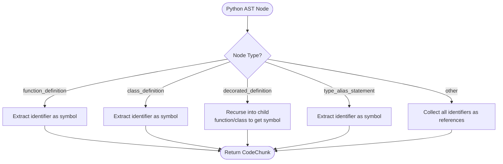

**Diagram sources**
- [python.py:14-49](file://src/ws_ctx_engine/chunker/resolvers/python.py#L14-L49)
- [tree_sitter.py:18-23](file://src/ws_ctx_engine/chunker/tree_sitter.py#L18-L23)

**Section sources**
- [python.py:6-61](file://src/ws_ctx_engine/chunker/resolvers/python.py#L6-L61)
- [tree_sitter.py:18-23](file://src/ws_ctx_engine/chunker/tree_sitter.py#L18-L23)

#### JavaScript
- Target AST nodes: function_declaration, class_declaration, method_definition, lexical_declaration, jsx_element, jsx_self_closing_element, export_statement, generator_function_declaration
- Symbol extraction: identifier or property_identifier depending on node type; special handling for arrow functions in lexical_declaration
- References: all identifiers under the node subtree

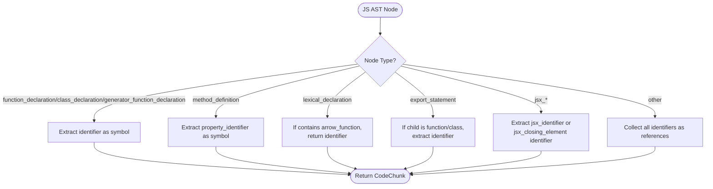

**Diagram sources**
- [javascript.py:14-73](file://src/ws_ctx_engine/chunker/resolvers/javascript.py#L14-L73)
- [tree_sitter.py:18-21](file://src/ws_ctx_engine/chunker/tree_sitter.py#L18-L21)

**Section sources**
- [javascript.py:6-85](file://src/ws_ctx_engine/chunker/resolvers/javascript.py#L6-L85)
- [tree_sitter.py:18-21](file://src/ws_ctx_engine/chunker/tree_sitter.py#L18-L21)

#### TypeScript
- Target AST nodes: function_declaration, class_declaration, method_definition, interface_declaration, type_alias_declaration, enum_declaration, abstract_class_declaration, lexical_declaration, jsx_element, jsx_self_closing_element, export_statement, internal_module
- Symbol extraction: supports both identifier and type_identifier for type-related declarations
- References: all identifiers under the node subtree

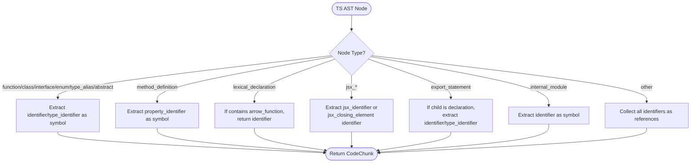

**Diagram sources**
- [typescript.py:14-77](file://src/ws_ctx_engine/chunker/resolvers/typescript.py#L14-L77)
- [tree_sitter.py:18-22](file://src/ws_ctx_engine/chunker/tree_sitter.py#L18-L22)

**Section sources**
- [typescript.py:6-103](file://src/ws_ctx_engine/chunker/resolvers/typescript.py#L6-L103)
- [tree_sitter.py:18-22](file://src/ws_ctx_engine/chunker/tree_sitter.py#L18-L22)

#### Rust
- Target AST nodes: function_item, struct_item, trait_item, impl_item, enum_item, const_item, type_item, static_item, mod_item, macro_definition, union_item, function_signature_item
- Symbol extraction: identifier for most items; for impl_item, prefers type_identifier or identifier
- References: all identifiers under the node subtree

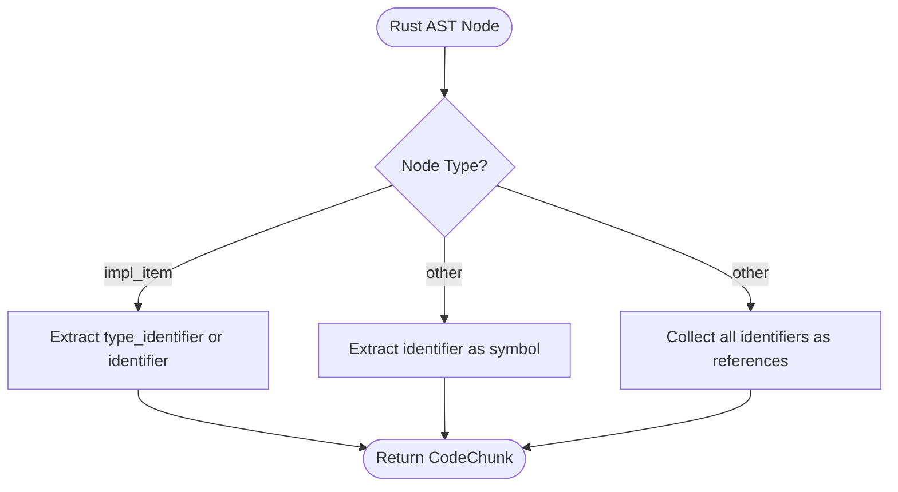

**Diagram sources**
- [rust.py:14-43](file://src/ws_ctx_engine/chunker/resolvers/rust.py#L14-L43)
- [tree_sitter.py:18-23](file://src/ws_ctx_engine/chunker/tree_sitter.py#L18-L23)

**Section sources**
- [rust.py:6-55](file://src/ws_ctx_engine/chunker/resolvers/rust.py#L6-L55)
- [tree_sitter.py:18-23](file://src/ws_ctx_engine/chunker/tree_sitter.py#L18-L23)

### Fallback Mechanism: Regex-Based Parsing
When tree-sitter is unavailable, RegexChunker scans files using language-specific patterns to detect definitions and imports, then determines block boundaries using indentation (Python) or brace matching (JS/TS/Rust).

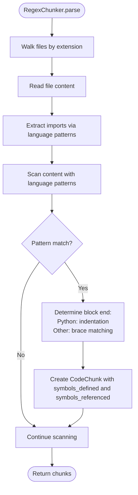

**Diagram sources**
- [regex.py:75-143](file://src/ws_ctx_engine/chunker/regex.py#L75-L143)
- [regex.py:145-219](file://src/ws_ctx_engine/chunker/regex.py#L145-L219)

**Section sources**
- [regex.py:15-219](file://src/ws_ctx_engine/chunker/regex.py#L15-L219)

### Markdown Chunking
MarkdownChunker splits Markdown files into chunks based on ATX headings. If no headings are present, the entire file becomes a single chunk.

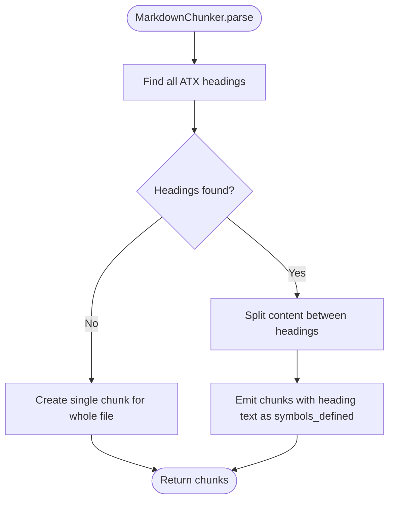

**Diagram sources**
- [markdown.py:23-99](file://src/ws_ctx_engine/chunker/markdown.py#L23-L99)

**Section sources**
- [markdown.py:13-100](file://src/ws_ctx_engine/chunker/markdown.py#L13-L100)

### Code Chunk Model and Token Counting
CodeChunk encapsulates path, line range, content, symbols defined and referenced, and language. It provides token_count using a tiktoken encoding for budget-aware selection.

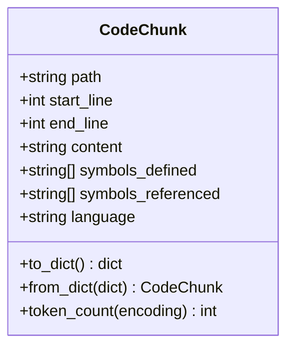

**Diagram sources**
- [models.py:10-84](file://src/ws_ctx_engine/models/models.py#L10-L84)

**Section sources**
- [models.py:10-152](file://src/ws_ctx_engine/models/models.py#L10-L152)

## Dependency Analysis
The chunking subsystem composes several modules with clear separation of concerns:
- TreeSitterChunker depends on resolvers and imports the ALL_RESOLVERS mapping
- RegexChunker and MarkdownChunker depend on shared filtering utilities
- CodeChunk is a shared model consumed by downstream components

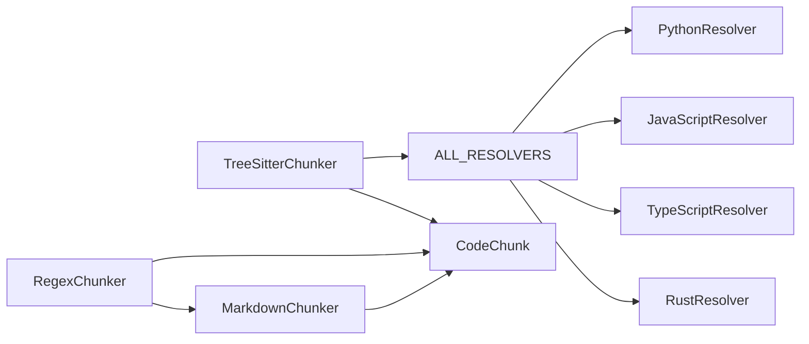

**Diagram sources**
- [tree_sitter.py:54-55](file://src/ws_ctx_engine/chunker/tree_sitter.py#L54-L55)
- [__init__.py:9-16](file://src/ws_ctx_engine/chunker/resolvers/__init__.py#L9-L16)
- [regex.py:73-74](file://src/ws_ctx_engine/chunker/regex.py#L73-L74)
- [markdown.py:20-21](file://src/ws_ctx_engine/chunker/markdown.py#L20-L21)
- [models.py:10-34](file://src/ws_ctx_engine/models/models.py#L10-L34)

**Section sources**
- [tree_sitter.py:54-55](file://src/ws_ctx_engine/chunker/tree_sitter.py#L54-L55)
- [__init__.py:9-16](file://src/ws_ctx_engine/chunker/resolvers/__init__.py#L9-L16)
- [regex.py:73-74](file://src/ws_ctx_engine/chunker/regex.py#L73-L74)
- [markdown.py:20-21](file://src/ws_ctx_engine/chunker/markdown.py#L20-L21)
- [models.py:10-34](file://src/ws_ctx_engine/models/models.py#L10-L34)

## Performance Considerations
- Token-aware selection: BudgetManager reserves a percentage of the token budget for metadata and greedily selects files up to the content budget using tiktoken encoding.
- File filtering: _should_include_file applies include/exclude patterns and optional gitignore spec to reduce I/O.
- Rust acceleration: The base module attempts to load a Rust-based file walker for improved performance where available.

Practical tips:
- Tune token_budget and encoding to match downstream model constraints
- Narrow include_patterns and exclude_patterns to reduce scan volume
- Prefer tree-sitter for accuracy; regex fallback is less precise but broadly compatible

**Section sources**
- [budget.py:8-105](file://src/ws_ctx_engine/budget/budget.py#L8-L105)
- [base.py:118-176](file://src/ws_ctx_engine/chunker/base.py#L118-L176)
- [base.py:14-25](file://src/ws_ctx_engine/chunker/base.py#L14-L25)

## Troubleshooting Guide
Common issues and resolutions:
- Missing tree-sitter dependencies: ImportError raised during TreeSitterChunker initialization; switch to RegexChunker via parse_with_fallback
- Unreadable files: Exceptions caught and logged as warnings; affected files are skipped
- Unsupported extensions: warn_non_indexed_extension logs a warning and treats the file as plain text
- Malformed code: RegexChunker uses robust patterns and block boundary heuristics; tree-sitter relies on parser resilience but may miss malformed constructs

Operational guidance:
- Verify installation of py-tree-sitter and language bindings
- Review logs for warnings about unsupported extensions or parsing failures
- Adjust include/exclude patterns to focus on relevant files

**Section sources**
- [tree_sitter.py:26-37](file://src/ws_ctx_engine/chunker/tree_sitter.py#L26-L37)
- [tree_sitter.py:98-100](file://src/ws_ctx_engine/chunker/tree_sitter.py#L98-L100)
- [base.py:106-116](file://src/ws_ctx_engine/chunker/base.py#L106-L116)
- [regex.py:102-104](file://src/ws_ctx_engine/chunker/regex.py#L102-L104)

## Conclusion
The ws-ctx-engine AST parsing and code chunking system combines precise tree-sitter-based parsing with a robust regex fallback, enabling accurate extraction of symbols and boundaries across Python, JavaScript, TypeScript, and Rust. The resolver pattern cleanly separates language-specific logic, while Markdown chunking ensures documentation is preserved. Shared models and configuration enable token-aware selection and efficient indexing for downstream LLM workflows.

## Appendices

### Chunk Size Optimization and Overlapping Windows
- Chunk boundaries are derived from language-specific rules: Python indentation, brace-matching for JS/TS/Rust, and heading-based splitting for Markdown.
- Overlapping windows can be introduced by adjusting start/end lines around symbol boundaries to preserve context when needed.
- Token-aware selection via BudgetManager ensures total content tokens stay within budget while maximizing relevance.

**Section sources**
- [regex.py:145-219](file://src/ws_ctx_engine/chunker/regex.py#L145-L219)
- [markdown.py:60-98](file://src/ws_ctx_engine/chunker/markdown.py#L60-L98)
- [budget.py:50-105](file://src/ws_ctx_engine/budget/budget.py#L50-L105)

### Edge Cases and Malformed Code Handling
- Tree-sitter: AST traversal continues even if individual nodes are malformed; resolvers only process recognized target types.
- Regex: Patterns are designed to handle common variants; block detection uses indentation or brace depth to approximate boundaries.
- Import extraction: Dotted names and scoped identifiers are unwrapped to capture top-level module names.

**Section sources**
- [tree_sitter.py:122-144](file://src/ws_ctx_engine/chunker/tree_sitter.py#L122-L144)
- [regex.py:145-219](file://src/ws_ctx_engine/chunker/regex.py#L145-L219)

### Examples of Language Constructs Parsed and Chunked
- Python: function_definition, class_definition, import statements
- JavaScript: function_declaration, class_declaration, method_definition, JSX elements
- TypeScript: function_declaration, class_declaration, interface_declaration, enum_declaration, JSX elements
- Rust: function_item, struct_item, trait_item, impl_item, enum_item

Each construct is converted to a CodeChunk with accurate line ranges, symbols_defined, and symbols_referenced for optimal LLM consumption.

**Section sources**
- [python.py:14-49](file://src/ws_ctx_engine/chunker/resolvers/python.py#L14-L49)
- [javascript.py:14-73](file://src/ws_ctx_engine/chunker/resolvers/javascript.py#L14-L73)
- [typescript.py:14-77](file://src/ws_ctx_engine/chunker/resolvers/typescript.py#L14-L77)
- [rust.py:14-43](file://src/ws_ctx_engine/chunker/resolvers/rust.py#L14-L43)
- [models.py:10-84](file://src/ws_ctx_engine/models/models.py#L10-L84)