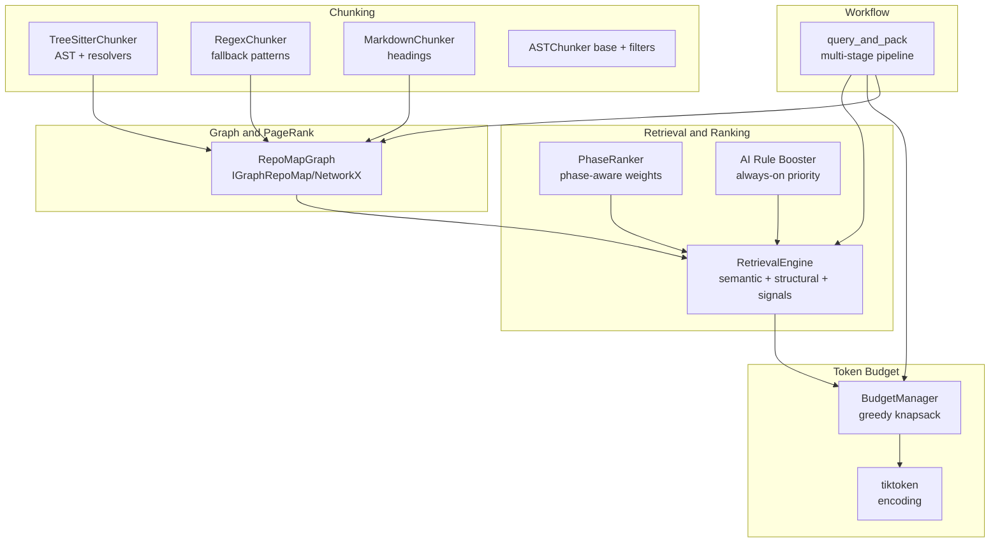
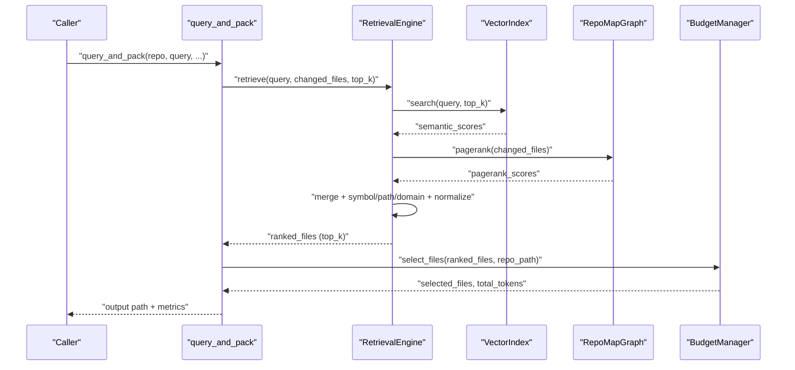
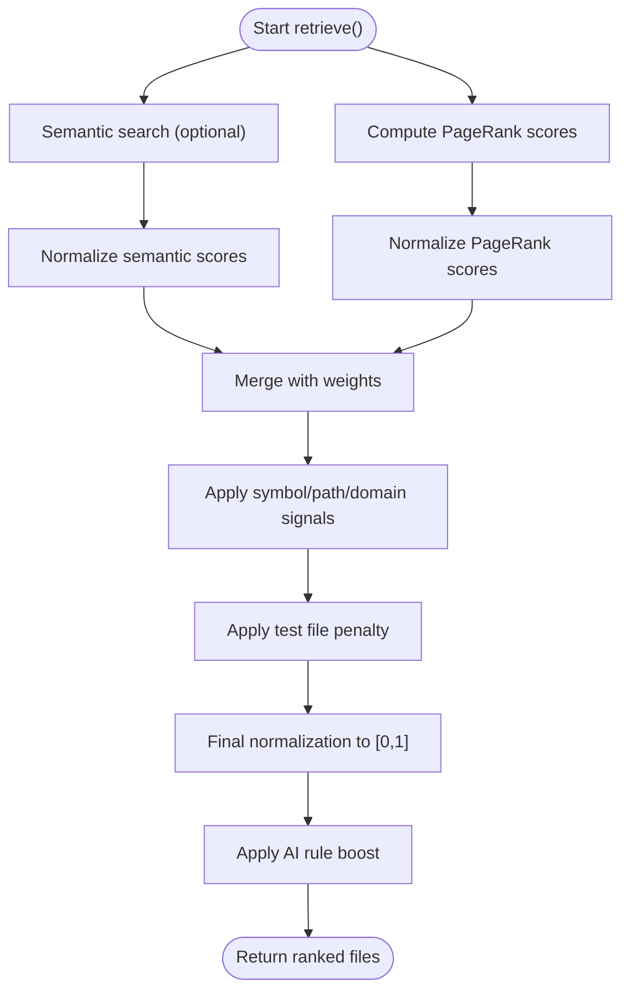
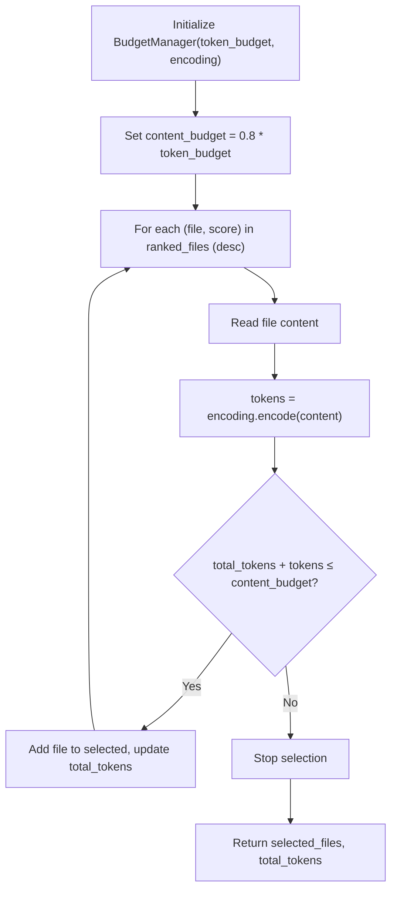
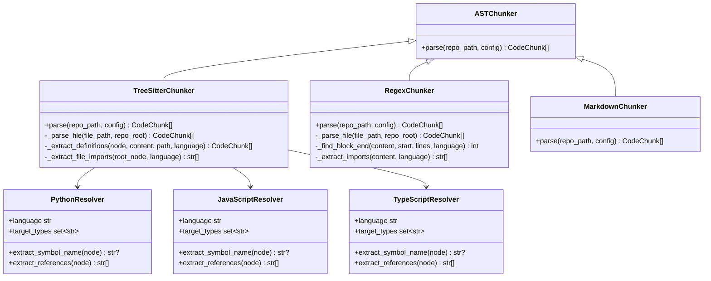
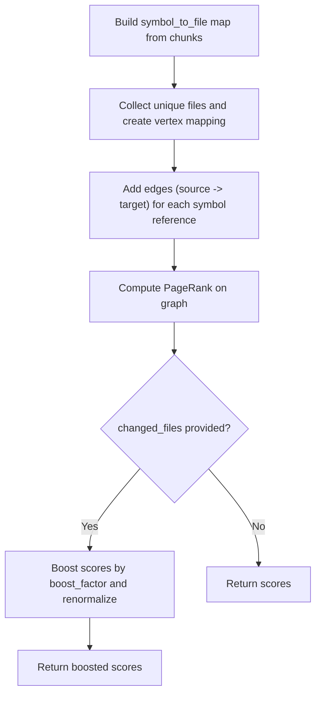
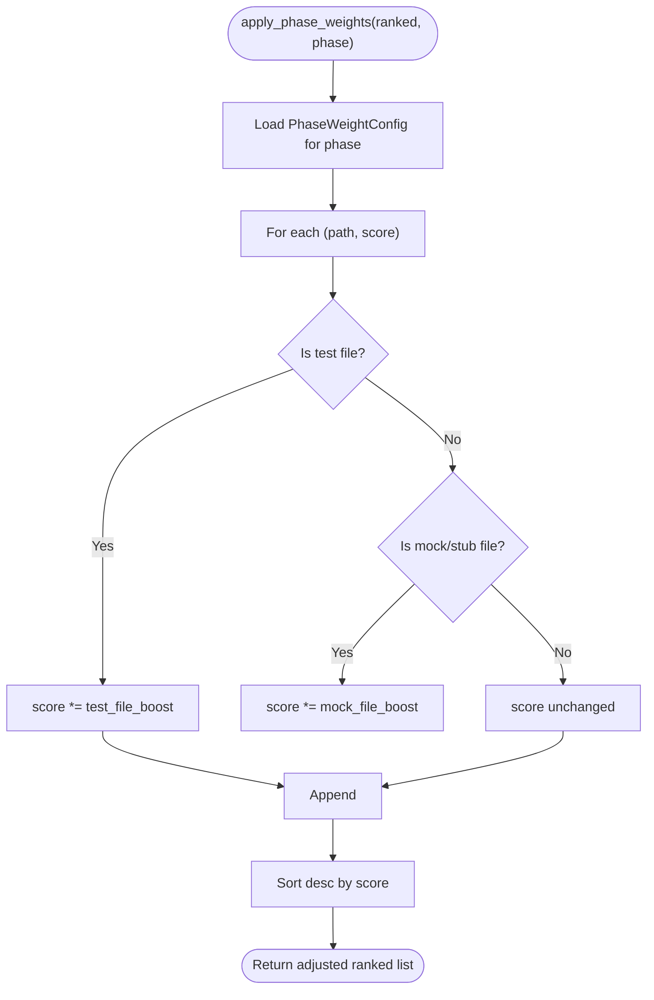
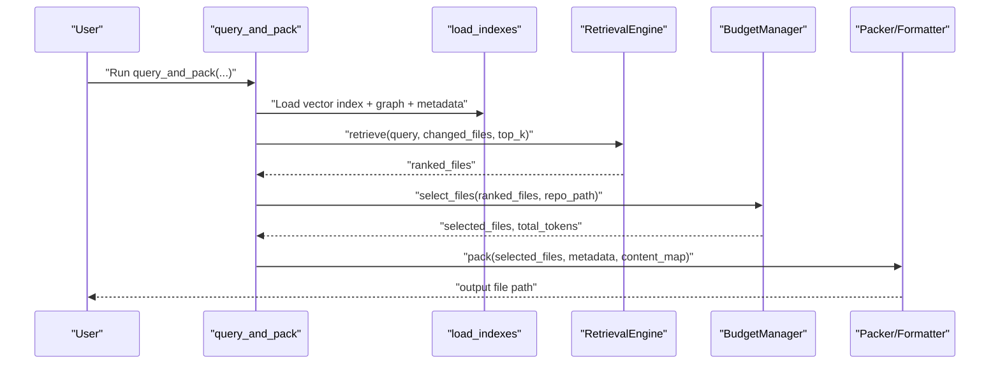
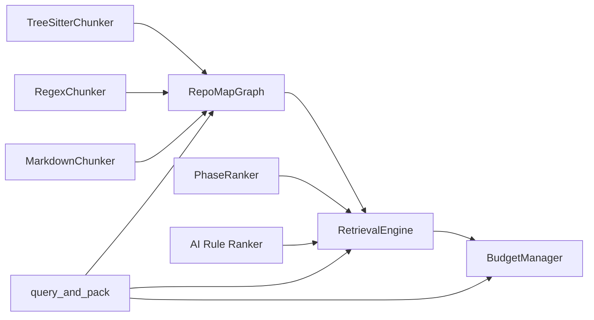

# Core Concepts

<cite>
**Referenced Files in This Document**
- [ranker.py](file://src/ws_ctx_engine/ranking/ranker.py)
- [phase_ranker.py](file://src/ws_ctx_engine/ranking/phase_ranker.py)
- [budget.py](file://src/ws_ctx_engine/budget/budget.py)
- [models.py](file://src/ws_ctx_engine/models/models.py)
- [tree_sitter.py](file://src/ws_ctx_engine/chunker/tree_sitter.py)
- [regex.py](file://src/ws_ctx_engine/chunker/regex.py)
- [base.py](file://src/ws_ctx_engine/chunker/base.py)
- [markdown.py](file://src/ws_ctx_engine/chunker/markdown.py)
- [python.py](file://src/ws_ctx_engine/chunker/resolvers/python.py)
- [javascript.py](file://src/ws_ctx_engine/chunker/resolvers/javascript.py)
- [typescript.py](file://src/ws_ctx_engine/chunker/resolvers/typescript.py)
- [graph.py](file://src/ws_ctx_engine/graph/graph.py)
- [retrieval.py](file://src/ws_ctx_engine/retrieval/retrieval.py)
- [query.py](file://src/ws_ctx_engine/workflow/query.py)
</cite>

## Table of Contents
1. [Introduction](#introduction)
2. [Project Structure](#project-structure)
3. [Core Components](#core-components)
4. [Architecture Overview](#architecture-overview)
5. [Detailed Component Analysis](#detailed-component-analysis)
6. [Dependency Analysis](#dependency-analysis)
7. [Performance Considerations](#performance-considerations)
8. [Troubleshooting Guide](#troubleshooting-guide)
9. [Conclusion](#conclusion)

## Introduction
This document explains the core concepts behind the ws-ctx-engine hybrid ranking methodology, token budget management, AST parsing with tree-sitter and regex fallbacks, PageRank-based structural ranking, and the multi-stage pipeline that produces optimized code context for AI assistants. It synthesizes how semantic search, structural importance, and precise token accounting work together to maximize the quality and relevance of retrieved context.

## Project Structure
The core capabilities are organized around:
- Retrieval and ranking: semantic + structural signals, plus phase-aware weighting and AI rule prioritization
- Token budget management: greedy knapsack selection constrained by tiktoken token counts
- Code chunking: AST parsing with tree-sitter and regex fallbacks for language-specific definitions and imports
- Structural graph and PageRank: dependency graph construction and scoring
- Workflow orchestration: multi-stage pipeline from indexing through output packing

**Diagram sources**
- [retrieval.py:140-368](file://src/ws_ctx_engine/retrieval/retrieval.py#L140-L368)
- [phase_ranker.py:96-127](file://src/ws_ctx_engine/ranking/phase_ranker.py#L96-L127)
- [ranker.py:28-85](file://src/ws_ctx_engine/ranking/ranker.py#L28-L85)
- [budget.py:50-104](file://src/ws_ctx_engine/budget/budget.py#L50-L104)
- [tree_sitter.py:57-114](file://src/ws_ctx_engine/chunker/tree_sitter.py#L57-L114)
- [regex.py:75-143](file://src/ws_ctx_engine/chunker/regex.py#L75-L143)
- [markdown.py:23-99](file://src/ws_ctx_engine/chunker/markdown.py#L23-L99)
- [base.py:118-175](file://src/ws_ctx_engine/chunker/base.py#L118-L175)
- [graph.py:97-231](file://src/ws_ctx_engine/graph/graph.py#L97-L231)
- [query.py:230-616](file://src/ws_ctx_engine/workflow/query.py#L230-L616)

**Section sources**
- [retrieval.py:140-368](file://src/ws_ctx_engine/retrieval/retrieval.py#L140-L368)
- [budget.py:8-49](file://src/ws_ctx_engine/budget/budget.py#L8-L49)
- [tree_sitter.py:15-56](file://src/ws_ctx_engine/chunker/tree_sitter.py#L15-L56)
- [regex.py:15-74](file://src/ws_ctx_engine/chunker/regex.py#L15-L74)
- [markdown.py:13-48](file://src/ws_ctx_engine/chunker/markdown.py#L13-L48)
- [base.py:41-75](file://src/ws_ctx_engine/chunker/base.py#L41-L75)
- [graph.py:19-94](file://src/ws_ctx_engine/graph/graph.py#L19-L94)
- [query.py:230-616](file://src/ws_ctx_engine/workflow/query.py#L230-L616)

## Core Components
- Hybrid ranking: merges semantic similarity and structural PageRank scores, then applies symbol/path/domain signals and test penalties, finally normalizing to [0, 1].
- Token budget management: uses tiktoken to count tokens per file and greedily selects files up to an 80% content budget, reserving 20% for metadata.
- AST parsing: tree-sitter parsers with language-specific resolvers extract definitions and imports; regex fallbacks handle languages without dedicated parsers.
- PageRank algorithm: constructs a directed dependency graph from symbol references and computes structural importance, optionally boosting recently changed files.
- Multi-stage pipeline: load indexes → hybrid retrieval → budget selection → pack output.

**Section sources**
- [retrieval.py:250-368](file://src/ws_ctx_engine/retrieval/retrieval.py#L250-L368)
- [budget.py:50-104](file://src/ws_ctx_engine/budget/budget.py#L50-L104)
- [tree_sitter.py:57-114](file://src/ws_ctx_engine/chunker/tree_sitter.py#L57-L114)
- [regex.py:75-143](file://src/ws_ctx_engine/chunker/regex.py#L75-L143)
- [graph.py:129-231](file://src/ws_ctx_engine/graph/graph.py#L129-L231)
- [query.py:230-616](file://src/ws_ctx_engine/workflow/query.py#L230-L616)

## Architecture Overview
The hybrid ranking pipeline integrates semantic and structural signals, then enforces a strict token budget to ensure model context fits within constraints.

**Diagram sources**
- [query.py:324-411](file://src/ws_ctx_engine/workflow/query.py#L324-L411)
- [retrieval.py:250-368](file://src/ws_ctx_engine/retrieval/retrieval.py#L250-L368)
- [graph.py:188-228](file://src/ws_ctx_engine/graph/graph.py#L188-L228)
- [budget.py:50-104](file://src/ws_ctx_engine/budget/budget.py#L50-L104)

## Detailed Component Analysis

### Hybrid Ranking Methodology
Hybrid ranking combines semantic similarity and structural PageRank, then enriches with symbol, path, and domain signals, and penalizes likely test files. Scores are normalized to [0, 1].

Key behaviors:
- Semantic scores from vector search are normalized and combined with PageRank scores using configured weights.
- Symbol boost: exact overlap between query tokens and symbols defined in files.
- Path boost: query tokens appearing in file paths (exact, substring, or 5-char prefix).
- Domain boost: files under directories mapped to domain keywords.
- Test penalty: multiplicative reduction for files detected as tests.
- AI rule boost: always pushes canonical AI rule files to the top.

**Diagram sources**
- [retrieval.py:290-368](file://src/ws_ctx_engine/retrieval/retrieval.py#L290-L368)
- [ranker.py:28-85](file://src/ws_ctx_engine/ranking/ranker.py#L28-L85)

**Section sources**
- [retrieval.py:140-368](file://src/ws_ctx_engine/retrieval/retrieval.py#L140-L368)
- [ranker.py:28-85](file://src/ws_ctx_engine/ranking/ranker.py#L28-L85)

### Token Budget Management with Greedy Knapsack
BudgetManager reserves 20% of the token budget for metadata and manifests, using 80% for file content. It greedily selects files in descending order of importance score until the content budget is exhausted. tiktoken is used to count tokens per file.

**Diagram sources**
- [budget.py:50-104](file://src/ws_ctx_engine/budget/budget.py#L50-L104)
- [models.py:60-84](file://src/ws_ctx_engine/models/models.py#L60-L84)

**Section sources**
- [budget.py:8-49](file://src/ws_ctx_engine/budget/budget.py#L8-L49)
- [models.py:60-84](file://src/ws_ctx_engine/models/models.py#L60-L84)

### AST Parsing with Tree-Sitter and Regex Fallbacks
TreeSitterChunker builds language-specific parsers and uses resolvers to extract definitions and imports. MarkdownChunker splits Markdown by headings. RegexChunker provides fallback patterns for imports and function/class boundaries. A base ASTChunker defines include/exclude filtering and gitignore-aware traversal.

**Diagram sources**
- [tree_sitter.py:15-160](file://src/ws_ctx_engine/chunker/tree_sitter.py#L15-L160)
- [regex.py:15-219](file://src/ws_ctx_engine/chunker/regex.py#L15-L219)
- [markdown.py:13-100](file://src/ws_ctx_engine/chunker/markdown.py#L13-L100)
- [base.py:41-75](file://src/ws_ctx_engine/chunker/base.py#L41-L75)
- [python.py:6-61](file://src/ws_ctx_engine/chunker/resolvers/python.py#L6-L61)
- [javascript.py:6-85](file://src/ws_ctx_engine/chucker/resolvers/javascript.py#L6-L85)
- [typescript.py:6-103](file://src/ws_ctx_engine/chunker/resolvers/typescript.py#L6-L103)

**Section sources**
- [tree_sitter.py:15-160](file://src/ws_ctx_engine/chunker/tree_sitter.py#L15-L160)
- [regex.py:15-219](file://src/ws_ctx_engine/chunker/regex.py#L15-L219)
- [markdown.py:13-100](file://src/ws_ctx_engine/chunker/markdown.py#L13-L100)
- [base.py:41-75](file://src/ws_ctx_engine/chunker/base.py#L41-L75)
- [python.py:6-61](file://src/ws_ctx_engine/chunker/resolvers/python.py#L6-L61)
- [javascript.py:6-85](file://src/ws_ctx_engine/chunker/resolvers/javascript.py#L6-L85)
- [typescript.py:6-103](file://src/ws_ctx_engine/chunker/resolvers/typescript.py#L6-L103)

### PageRank Algorithm on Code Dependencies
RepoMapGraph builds a directed graph from symbol references: an edge from file A to file B indicates A depends on symbols defined in B. PageRank scores reflect structural importance; optionally, scores for changed files are boosted and renormalized.

**Diagram sources**
- [graph.py:129-231](file://src/ws_ctx_engine/graph/graph.py#L129-L231)

**Section sources**
- [graph.py:19-94](file://src/ws_ctx_engine/graph/graph.py#L19-L94)
- [graph.py:129-231](file://src/ws_ctx_engine/graph/graph.py#L129-L231)

### Phase-Aware Ranking for Agent Workflows
PhaseRanker adjusts ranking weights depending on the agent’s current phase (Discovery, Edit, Test), influencing token density, inclusion of directory trees, and boosting of test/mock files.

**Diagram sources**
- [phase_ranker.py:96-127](file://src/ws_ctx_engine/ranking/phase_ranker.py#L96-L127)

**Section sources**
- [phase_ranker.py:25-127](file://src/ws_ctx_engine/ranking/phase_ranker.py#L25-L127)

### Multi-Stage Pipeline from AST Parsing to Output Generation
The pipeline stages:
1. Load indexes (vector index and graph) with auto-rebuild and health reporting.
2. Hybrid retrieval: semantic + structural ranking, optional phase-aware re-weighting.
3. Budget selection: greedy knapsack within token budget.
4. Packing: deduplication, optional compression, and output in XML/ZIP/JSON/YAML/TOON/Markdown.

**Diagram sources**
- [query.py:230-616](file://src/ws_ctx_engine/workflow/query.py#L230-L616)

**Section sources**
- [query.py:230-616](file://src/ws_ctx_engine/workflow/query.py#L230-L616)

## Dependency Analysis
- RetrievalEngine depends on a vector index for semantic similarity and a RepoMapGraph for PageRank.
- TreeSitterChunker and RegexChunker feed symbol definitions and references into the graph.
- BudgetManager depends on tiktoken for token counting and operates on ranked files from retrieval.
- PhaseRanker and AI Rule Booster operate on the ranked list prior to budget selection.
- query_and_pack orchestrates all components and tracks performance.

**Diagram sources**
- [tree_sitter.py:57-114](file://src/ws_ctx_engine/chunker/tree_sitter.py#L57-L114)
- [regex.py:75-143](file://src/ws_ctx_engine/chunker/regex.py#L75-L143)
- [markdown.py:23-99](file://src/ws_ctx_engine/chunker/markdown.py#L23-L99)
- [graph.py:129-231](file://src/ws_ctx_engine/graph/graph.py#L129-L231)
- [retrieval.py:250-368](file://src/ws_ctx_engine/retrieval/retrieval.py#L250-L368)
- [budget.py:50-104](file://src/ws_ctx_engine/budget/budget.py#L50-L104)
- [phase_ranker.py:96-127](file://src/ws_ctx_engine/ranking/phase_ranker.py#L96-L127)
- [ranker.py:64-85](file://src/ws_ctx_engine/ranking/ranker.py#L64-L85)
- [query.py:230-616](file://src/ws_ctx_engine/workflow/query.py#L230-L616)

**Section sources**
- [retrieval.py:140-368](file://src/ws_ctx_engine/retrieval/retrieval.py#L140-L368)
- [graph.py:129-231](file://src/ws_ctx_engine/graph/graph.py#L129-L231)
- [budget.py:50-104](file://src/ws_ctx_engine/budget/budget.py#L50-L104)
- [phase_ranker.py:96-127](file://src/ws_ctx_engine/ranking/phase_ranker.py#L96-L127)
- [ranker.py:28-85](file://src/ws_ctx_engine/ranking/ranker.py#L28-L85)
- [query.py:230-616](file://src/ws_ctx_engine/workflow/query.py#L230-L616)

## Performance Considerations
- Use the igraph backend for RepoMapGraph when available; it provides fast PageRank computation and graceful fallback to NetworkX.
- Prefer tree-sitter parsers for languages with resolvers to improve chunking accuracy; regex fallbacks remain useful for broader coverage.
- Tune semantic_weight and pagerank_weight to balance recall vs. structural importance for your corpus.
- Adjust token_budget and encoding to match the target model’s context window.
- Consider enabling compression and session deduplication to reduce token usage without losing key content.

[No sources needed since this section provides general guidance]

## Troubleshooting Guide
Common issues and remedies:
- Missing tree-sitter dependencies: Install the required language packages for tree-sitter support.
- Missing igraph or networkx: Install the preferred backend for RepoMapGraph.
- Empty or stale indexes: Run the indexing command to rebuild indexes; the query phase attempts auto-rebuild but may require manual intervention.
- Unexpected test file inclusion: Adjust test_penalty or filter test files via domain or path signals.
- Excessive token usage: Reduce token_budget or enable compression and deduplication.

**Section sources**
- [tree_sitter.py:25-45](file://src/ws_ctx_engine/chunker/tree_sitter.py#L25-L45)
- [graph.py:115-122](file://src/ws_ctx_engine/graph/graph.py#L115-L122)
- [query.py:316-322](file://src/ws_ctx_engine/workflow/query.py#L316-L322)

## Conclusion
The ws-ctx-engine achieves high-quality code context by combining semantic and structural signals, rigorously managing token budgets, and using robust AST parsing with fallbacks. The multi-stage pipeline ensures that the most relevant files are selected within strict context window constraints, while optional phase-aware weighting and AI rule prioritization tailor results to agent workflows.