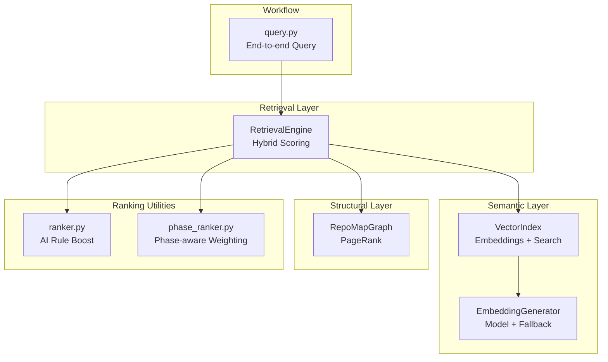
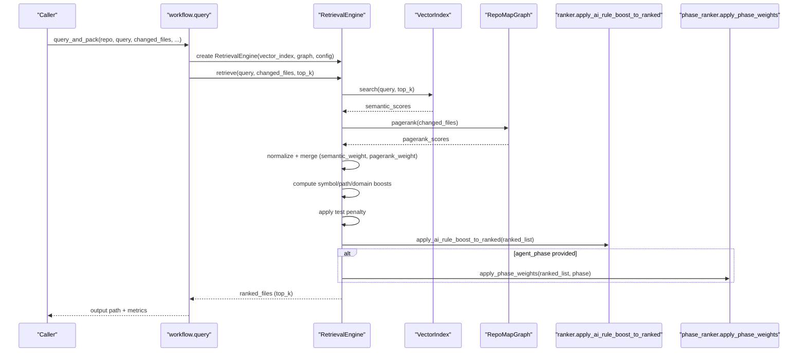
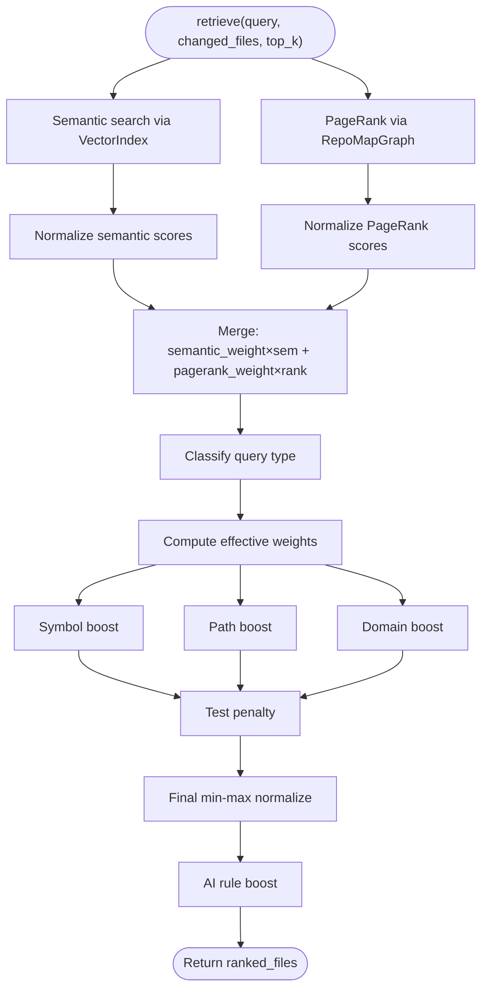
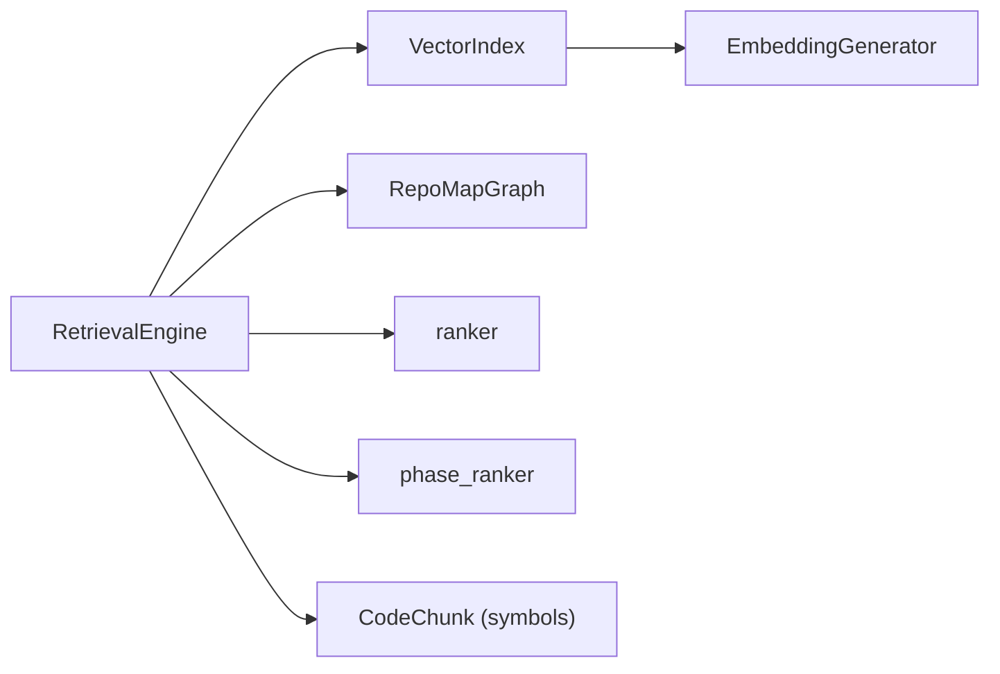

# Hybrid Ranking Methodology

<cite>
**Referenced Files in This Document**
- [retrieval.py](file://src/ws_ctx_engine/retrieval/retrieval.py)
- [vector_index.py](file://src/ws_ctx_engine/vector_index/vector_index.py)
- [graph.py](file://src/ws_ctx_engine/graph/graph.py)
- [ranker.py](file://src/ws_ctx_engine/ranking/ranker.py)
- [phase_ranker.py](file://src/ws_ctx_engine/ranking/phase_ranker.py)
- [models.py](file://src/ws_ctx_engine/models/models.py)
- [config.py](file://src/ws_ctx_engine/config/config.py)
- [query.py](file://src/ws_ctx_engine/workflow/query.py)
- [retrieval.md](file://docs/reference/retrieval.md)
- [architecture.md](file://docs/reference/architecture.md)
</cite>

## Table of Contents
1. [Introduction](#introduction)
2. [Project Structure](#project-structure)
3. [Core Components](#core-components)
4. [Architecture Overview](#architecture-overview)
5. [Detailed Component Analysis](#detailed-component-analysis)
6. [Dependency Analysis](#dependency-analysis)
7. [Performance Considerations](#performance-considerations)
8. [Troubleshooting Guide](#troubleshooting-guide)
9. [Conclusion](#conclusion)
10. [Appendices](#appendices)

## Introduction
This document explains the ws-ctx-engine hybrid ranking methodology that combines multiple ranking signals to produce context-aware file importance scores. The system integrates:
- Semantic similarity via sentence-transformers embeddings
- Structural importance via PageRank over a dependency graph
- Symbol matching for exact identifier coverage
- Path keyword matching for directory and file-path relevance
- Domain classification for domain-aware boosting
- Test file penalty to deprioritize test artifacts
- AI rule persistence to ensure essential agent rule files are always included

It documents the mathematical formulas, configurable weights, and adaptive boosting strategies, and provides practical examples of how different query types influence ranking outcomes.

## Project Structure
The hybrid ranking spans several modules:
- Retrieval engine orchestrating semantic and structural signals
- Vector index providing semantic search with embeddings
- Graph computing PageRank over symbol dependencies
- Ranking utilities for AI rule boost and phase-aware weighting
- Workflow integration for end-to-end query processing

**Diagram sources**
- [retrieval.py:140-368](file://src/ws_ctx_engine/retrieval/retrieval.py#L140-L368)
- [vector_index.py:21-84](file://src/ws_ctx_engine/vector_index/vector_index.py#L21-L84)
- [graph.py:19-94](file://src/ws_ctx_engine/graph/graph.py#L19-L94)
- [ranker.py:28-85](file://src/ws_ctx_engine/ranking/ranker.py#L28-L85)
- [phase_ranker.py:96-122](file://src/ws_ctx_engine/ranking/phase_ranker.py#L96-L122)
- [query.py:158-227](file://src/ws_ctx_engine/workflow/query.py#L158-L227)

**Section sources**
- [retrieval.py:1-627](file://src/ws_ctx_engine/retrieval/retrieval.py#L1-L627)
- [vector_index.py:1-1120](file://src/ws_ctx_engine/vector_index/vector_index.py#L1-L1120)
- [graph.py:1-667](file://src/ws_ctx_engine/graph/graph.py#L1-L667)
- [ranker.py:1-86](file://src/ws_ctx_engine/ranking/ranker.py#L1-L86)
- [phase_ranker.py:1-138](file://src/ws_ctx_engine/ranking/phase_ranker.py#L1-L138)
- [query.py:1-617](file://src/ws_ctx_engine/workflow/query.py#L1-L617)

## Core Components
- RetrievalEngine: Orchestrates semantic and structural scores, applies adaptive boosting, and produces normalized final scores.
- VectorIndex: Provides semantic similarity search using sentence-transformers embeddings.
- RepoMapGraph: Builds a dependency graph and computes PageRank scores.
- ranker: Applies AI rule boost to ensure essential rule files are always included.
- phase_ranker: Adjusts scores based on agent phase (discovery/edit/test) with phase-specific multipliers.
- models: Defines CodeChunk with symbol metadata used by symbol matching.
- config: Exposes semantic_weight and pagerank_weight for base hybrid blending.
- workflow.query: Integrates retrieval into the end-to-end query-and-pack pipeline.

**Section sources**
- [retrieval.py:140-368](file://src/ws_ctx_engine/retrieval/retrieval.py#L140-L368)
- [vector_index.py:21-84](file://src/ws_ctx_engine/vector_index/vector_index.py#L21-L84)
- [graph.py:19-94](file://src/ws_ctx_engine/graph/graph.py#L19-L94)
- [ranker.py:28-85](file://src/ws_ctx_engine/ranking/ranker.py#L28-L85)
- [phase_ranker.py:96-122](file://src/ws_ctx_engine/ranking/phase_ranker.py#L96-L122)
- [models.py:10-58](file://src/ws_ctx_engine/models/models.py#L10-L58)
- [config.py:33-35](file://src/ws_ctx_engine/config/config.py#L33-L35)
- [query.py:158-227](file://src/ws_ctx_engine/workflow/query.py#L158-L227)

## Architecture Overview
The hybrid ranking pipeline blends semantic and structural signals, then enriches with query-driven signals and penalties.

**Diagram sources**
- [query.py:230-376](file://src/ws_ctx_engine/workflow/query.py#L230-L376)
- [retrieval.py:250-368](file://src/ws_ctx_engine/retrieval/retrieval.py#L250-L368)
- [ranker.py:64-85](file://src/ws_ctx_engine/ranking/ranker.py#L64-L85)
- [phase_ranker.py:96-122](file://src/ws_ctx_engine/ranking/phase_ranker.py#L96-L122)

## Detailed Component Analysis

### RetrievalEngine: Hybrid Scoring and Adaptive Boosting
RetrievalEngine performs:
- Semantic search: vector_index.search(query, top_k)
- Structural ranking: graph.pagerank(changed_files)
- Normalization and blending: min-max normalize both score sets, then weighted sum
- Query-driven signals:
  - Symbol boost: files defining symbols matching query tokens
  - Path boost: files whose paths contain query keywords
  - Domain boost: files under directories matching domain keywords
- Test penalty: multiplicative reduction for test-like files
- Final normalization to [0, 1]
- AI rule boost: ensures canonical rule files are always included

Key formulas:
- Base hybrid score: base_score = semantic_weight × semantic + pagerank_weight × pagerank
- Full score: final_score = normalize(base_score + symbol_boost + path_boost + domain_boost) × (1 - test_penalty) if test file
- Effective weights by query type:
  - symbol: symbol*=1.5, path*=0.5, domain*=0.3
  - path-dominant: symbol*=0.5, path*=1.5, domain*=0.5
  - semantic-dominant: symbol*=0.2, path*=0.2, domain*=0.2

**Diagram sources**
- [retrieval.py:250-368](file://src/ws_ctx_engine/retrieval/retrieval.py#L250-L368)
- [retrieval.py:467-521](file://src/ws_ctx_engine/retrieval/retrieval.py#L467-L521)

**Section sources**
- [retrieval.py:140-368](file://src/ws_ctx_engine/retrieval/retrieval.py#L140-L368)
- [retrieval.py:467-521](file://src/ws_ctx_engine/retrieval/retrieval.py#L467-L521)
- [retrieval.md:261-281](file://docs/reference/retrieval.md#L261-L281)

### Semantic Similarity: VectorIndex and EmbeddingGenerator
- VectorIndex provides semantic search over code chunks using embeddings.
- EmbeddingGenerator:
  - Uses sentence-transformers locally when available and memory permits
  - Falls back to OpenAI API embeddings on out-of-memory or import errors
  - Supports batch encoding and runtime memory checks

Implementation highlights:
- Local model initialization and memory safety checks
- API fallback with environment-based API key handling
- Encoding with robust error handling and graceful degradation

**Section sources**
- [vector_index.py:96-280](file://src/ws_ctx_engine/vector_index/vector_index.py#L96-L280)
- [vector_index.py:282-504](file://src/ws_ctx_engine/vector_index/vector_index.py#L282-L504)
- [vector_index.py:506-800](file://src/ws_ctx_engine/vector_index/vector_index.py#L506-L800)

### Structural Importance: RepoMapGraph and PageRank
- RepoMapGraph builds a directed dependency graph from symbol definitions and references.
- Two implementations:
  - IGraphRepoMap: fast C++ backend via python-igraph
  - NetworkXRepoMap: pure Python fallback
- PageRank computation with optional boost for changed_files, followed by renormalization

**Section sources**
- [graph.py:97-314](file://src/ws_ctx_engine/graph/graph.py#L97-L314)
- [graph.py:317-509](file://src/ws_ctx_engine/graph/graph.py#L317-L509)
- [graph.py:572-621](file://src/ws_ctx_engine/graph/graph.py#L572-L621)

### Symbol Matching and Path Keyword Matching
- Symbol boost:
  - Extract tokens from query (identifier-like, length ≥ 3, not stop words)
  - Match against symbols defined in each file
  - Score = fraction of matched tokens over total tokens
- Path boost:
  - Split path on separators (/, _, -, .)
  - Match tokens via exact match, substring, or shared prefix ≥ 5
  - Score = fraction of matched tokens over total tokens

**Section sources**
- [retrieval.py:374-466](file://src/ws_ctx_engine/retrieval/retrieval.py#L374-L466)
- [retrieval.py:389-414](file://src/ws_ctx_engine/retrieval/retrieval.py#L389-L414)
- [retrieval.py:415-466](file://src/ws_ctx_engine/retrieval/retrieval.py#L415-L466)

### Domain Classification and Boosting
- DomainKeywordMap maps domain keywords to directories.
- During retrieval:
  - Query tokens matched against domain keywords (exact or prefix ≥ 4)
  - Files under matched directories receive domain boost (score 1.0)
- Query type classification prioritizes path-dominant when domain keywords are present.

**Section sources**
- [retrieval.py:25-56](file://src/ws_ctx_engine/retrieval/retrieval.py#L25-L56)
- [retrieval.py:467-496](file://src/ws_ctx_engine/retrieval/retrieval.py#L467-L496)
- [retrieval.py:523-554](file://src/ws_ctx_engine/retrieval/retrieval.py#L523-L554)

### Test File Penalty and Changed File Boost
- Test penalty scales down scores for files matching test patterns (tests/, test_, *_test.*, *.spec.*).
- Changed files receive an additional boost via PageRank computation and renormalization.

**Section sources**
- [retrieval.py:131-138](file://src/ws_ctx_engine/retrieval/retrieval.py#L131-L138)
- [retrieval.py:555-558](file://src/ws_ctx_engine/retrieval/retrieval.py#L555-L558)
- [graph.py:188-229](file://src/ws_ctx_engine/graph/graph.py#L188-L229)

### AI Rule Persistence
- Canonical AI rule files (e.g., .cursorrules, AGENTS.md, CLAUDE.md) are always included with a large score boost.
- Applied after final normalization to guarantee top rank regardless of query.

**Section sources**
- [ranker.py:28-85](file://src/ws_ctx_engine/ranking/ranker.py#L28-L85)

### Phase-Aware Weighting
- Agent phases adjust emphasis on semantic vs. symbol signals:
  - DISCOVERY: low semantic, high signature-only compression, include directory trees
  - EDIT: moderate emphasis on both semantic and symbols
  - TEST: higher test_file_boost and mock_file_boost
- Also adjusts token density budgets and signature-only compression.

**Section sources**
- [phase_ranker.py:25-72](file://src/ws_ctx_engine/ranking/phase_ranker.py#L25-L72)
- [phase_ranker.py:96-122](file://src/ws_ctx_engine/ranking/phase_ranker.py#L96-L122)

## Dependency Analysis
The retrieval pipeline depends on:
- VectorIndex for semantic similarity
- RepoMapGraph for PageRank
- ranker for AI rule boost
- phase_ranker for phase-aware adjustments
- models for symbol metadata used by symbol matching

**Diagram sources**
- [retrieval.py:19-21](file://src/ws_ctx_engine/retrieval/retrieval.py#L19-L21)
- [vector_index.py:96-124](file://src/ws_ctx_engine/vector_index/vector_index.py#L96-L124)
- [models.py:10-58](file://src/ws_ctx_engine/models/models.py#L10-L58)
- [ranker.py:64-85](file://src/ws_ctx_engine/ranking/ranker.py#L64-L85)
- [phase_ranker.py:96-122](file://src/ws_ctx_engine/ranking/phase_ranker.py#L96-L122)

**Section sources**
- [retrieval.py:19-21](file://src/ws_ctx_engine/retrieval/retrieval.py#L19-L21)
- [vector_index.py:96-124](file://src/ws_ctx_engine/vector_index/vector_index.py#L96-L124)
- [models.py:10-58](file://src/ws_ctx_engine/models/models.py#L10-L58)
- [ranker.py:64-85](file://src/ws_ctx_engine/ranking/ranker.py#L64-L85)
- [phase_ranker.py:96-122](file://src/ws_ctx_engine/ranking/phase_ranker.py#L96-L122)

## Performance Considerations
- Semantic search complexity: O(n × d) where n is documents and d is embedding dimension.
- PageRank complexity: O(V + E) where V is vertices and E is edges.
- Symbol/path/domain boosts: O(t × s) for symbols, O(t × f) for paths and domains.
- Normalization: O(f) per step.
- Typical latency ranges are documented in the retrieval reference.

[No sources needed since this section provides general guidance]

## Troubleshooting Guide
Common issues and resolutions:
- Out-of-memory during embedding: EmbeddingGenerator automatically falls back to API embeddings.
- Missing python-igraph: RepoMapGraph falls back to NetworkX; install python-igraph for speed.
- Weights not summing to 1.0: Validation raises ValueError; ensure semantic_weight + pagerank_weight = 1.0.
- No results: Verify indexes exist and are not stale; rebuild using the indexing workflow.
- Unexpected test file inclusion: Adjust test_penalty or use domain filters.

**Section sources**
- [vector_index.py:130-251](file://src/ws_ctx_engine/vector_index/vector_index.py#L130-L251)
- [graph.py:572-621](file://src/ws_ctx_engine/graph/graph.py#L572-L621)
- [retrieval.py:219-227](file://src/ws_ctx_engine/retrieval/retrieval.py#L219-L227)
- [query.py:316-322](file://src/ws_ctx_engine/workflow/query.py#L316-L322)

## Conclusion
The ws-ctx-engine hybrid ranking methodology blends semantic and structural signals with query-driven boosts and penalties to produce robust, context-aware file rankings. Configurable weights and adaptive strategies ensure relevance across diverse query types and agent phases, while safeguards like AI rule persistence and test penalties improve practical usability.

[No sources needed since this section summarizes without analyzing specific files]

## Appendices

### Mathematical Formulas and Configurable Weights
- Base hybrid score: base_score = semantic_weight × semantic + pagerank_weight × pagerank
- Full score: final_score = normalize(base_score + symbol_boost + path_boost + domain_boost) × (1 - test_penalty) if test file
- Effective weights by query type:
  - symbol: symbol*=1.5, path*=0.5, domain*=0.3
  - path-dominant: symbol*=0.5, path*=1.5, domain*=0.5
  - semantic-dominant: symbol*=0.2, path*=0.2, domain*=0.2
- Default weights:
  - semantic_weight = 0.6
  - pagerank_weight = 0.4
  - symbol_boost = 0.3
  - path_boost = 0.2
  - domain_boost = 0.25
  - test_penalty = 0.5

**Section sources**
- [retrieval.py:191-237](file://src/ws_ctx_engine/retrieval/retrieval.py#L191-L237)
- [retrieval.py:497-521](file://src/ws_ctx_engine/retrieval/retrieval.py#L497-L521)
- [retrieval.md:261-281](file://docs/reference/retrieval.md#L261-L281)
- [config.py:33-35](file://src/ws_ctx_engine/config/config.py#L33-L35)

### Practical Examples: How Different Query Types Influence Ranking
- Symbol-heavy query (e.g., “UserSession”):
  - Query type: symbol
  - Effective weights: symbol*=1.5, path*=0.5, domain*=0.3
  - Outcome: strong symbol boost, moderate path/domain boost
- Path-dominant query (e.g., “chunker implementation”):
  - Query type: path-dominant
  - Effective weights: symbol*=0.5, path*=1.5, domain*=0.5
  - Outcome: strong path boost, domain boost if domain keywords match
- Semantic-dominant query (e.g., “authentication logic”):
  - Query type: semantic-dominant
  - Effective weights: symbol*=0.2, path*=0.2, domain*=0.2
  - Outcome: balanced symbol/path/domain boost based on query tokens

**Section sources**
- [retrieval.py:467-496](file://src/ws_ctx_engine/retrieval/retrieval.py#L467-L496)
- [retrieval.py:497-521](file://src/ws_ctx_engine/retrieval/retrieval.py#L497-L521)
- [retrieval.md:283-318](file://docs/reference/retrieval.md#L283-L318)

### End-to-End Workflow Integration
- The workflow loads indexes, creates RetrievalEngine with configured weights, retrieves ranked files, applies optional phase-aware weighting, selects within budget, and packs output.

**Section sources**
- [query.py:158-227](file://src/ws_ctx_engine/workflow/query.py#L158-L227)
- [query.py:230-376](file://src/ws_ctx_engine/workflow/query.py#L230-L376)