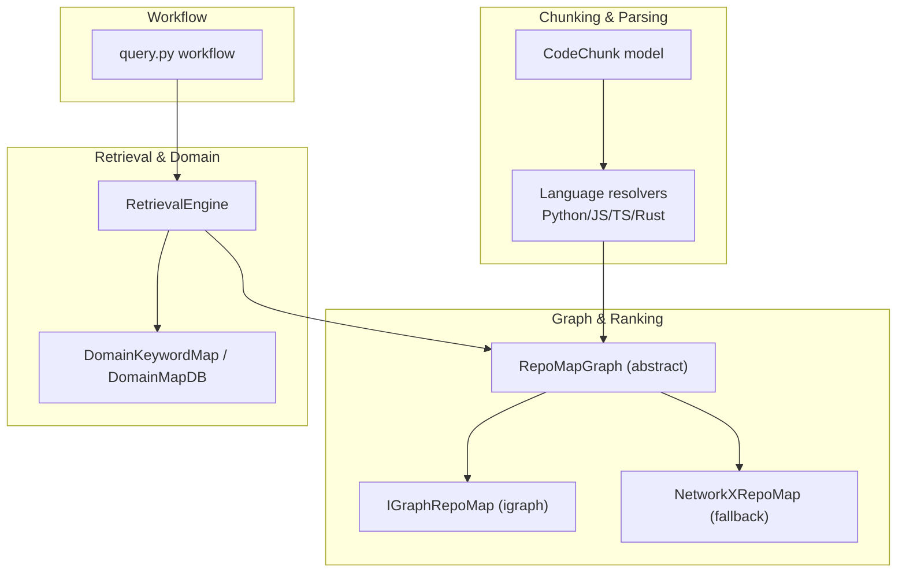
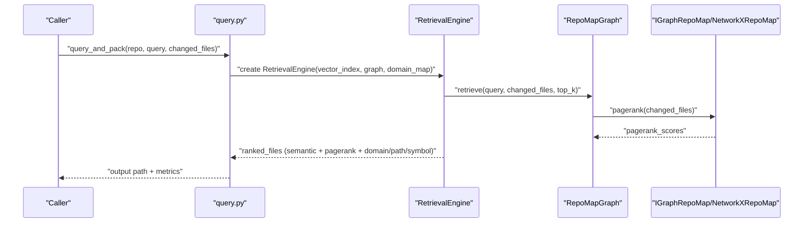
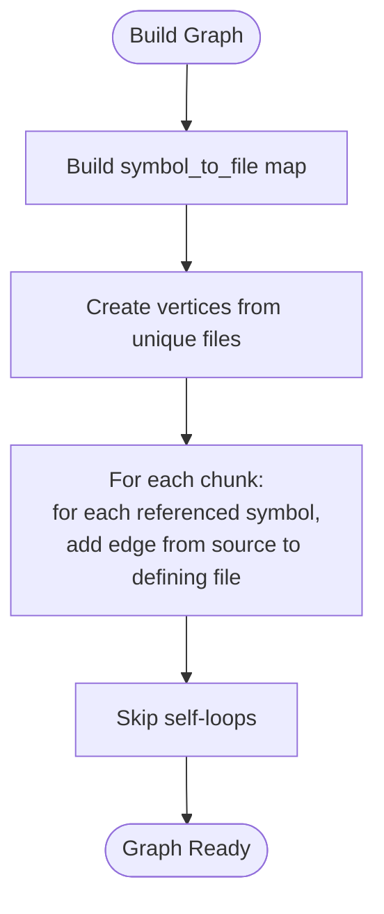
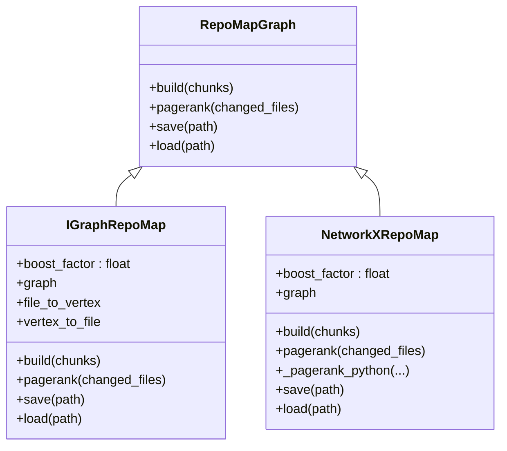
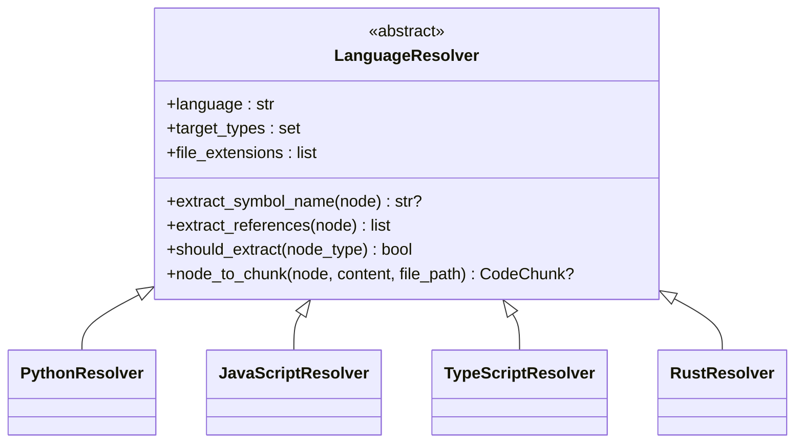
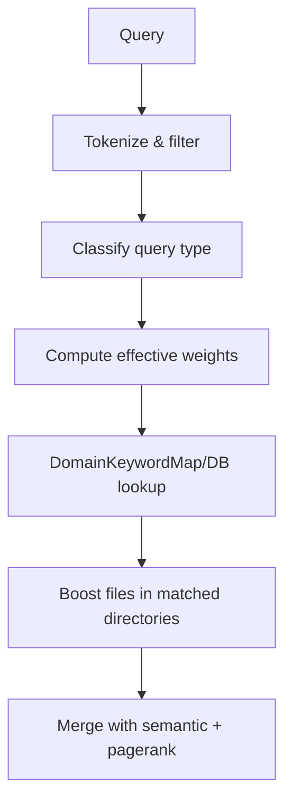
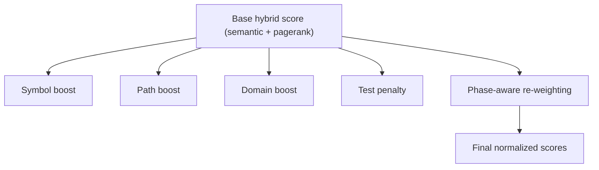
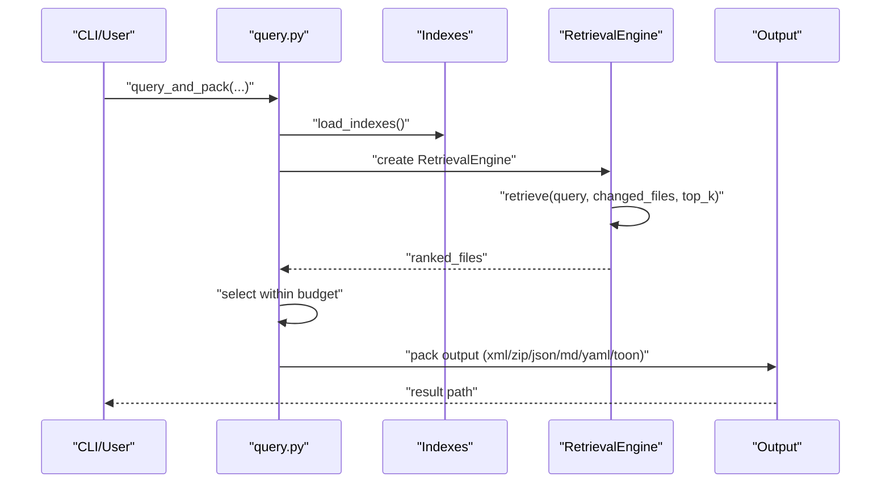
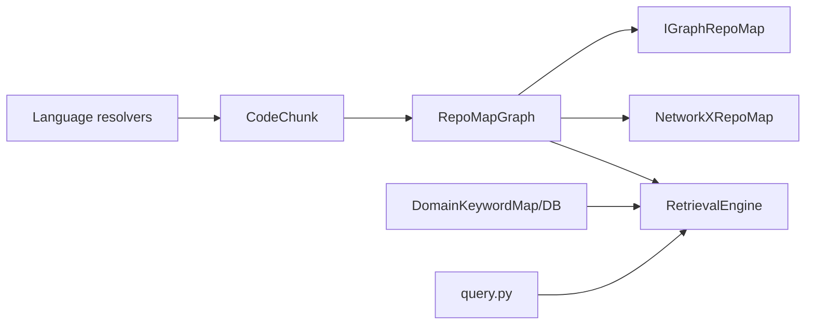

# PageRank Application to Code Dependencies

<cite>
**Referenced Files in This Document**
- [graph.py](file://src/ws_ctx_engine/graph/graph.py)
- [graph.md](file://docs/reference/graph.md)
- [retrieval.py](file://src/ws_ctx_engine/retrieval/retrieval.py)
- [retrieval.md](file://docs/reference/retrieval.md)
- [architecture.md](file://docs/reference/architecture.md)
- [models.py](file://src/ws_ctx_engine/models/models.py)
- [base.py](file://src/ws_ctx_engine/chunker/resolvers/base.py)
- [python.py](file://src/ws_ctx_engine/chunker/resolvers/python.py)
- [javascript.py](file://src/ws_ctx_engine/chunker/resolvers/javascript.py)
- [typescript.py](file://src/ws_ctx_engine/chunker/resolvers/typescript.py)
- [rust.py](file://src/ws_ctx_engine/chunker/resolvers/rust.py)
- [domain_map.py](file://src/ws_ctx_engine/domain_map/domain_map.py)
- [db.py](file://src/ws_ctx_engine/domain_map/db.py)
- [ranker.py](file://src/ws_ctx_engine/ranking/ranker.py)
- [phase_ranker.py](file://src/ws_ctx_engine/ranking/phase_ranker.py)
- [query.py](file://src/ws_ctx_engine/workflow/query.py)
- [test_graph_properties.py](file://tests/property/test_graph_properties.py)
</cite>

## Table of Contents
1. [Introduction](#introduction)
2. [Project Structure](#project-structure)
3. [Core Components](#core-components)
4. [Architecture Overview](#architecture-overview)
5. [Detailed Component Analysis](#detailed-component-analysis)
6. [Dependency Analysis](#dependency-analysis)
7. [Performance Considerations](#performance-considerations)
8. [Troubleshooting Guide](#troubleshooting-guide)
9. [Conclusion](#conclusion)

## Introduction
This document explains how the ws-ctx-engine PageRank application constructs a structural dependency graph from code chunks and computes PageRank scores to identify structurally important files. It covers how symbol references are extracted across supported languages, how the dependency graph is built, how PageRank is computed (including fallbacks), and how domain classification augments ranking. It also documents how the system handles direct and transitive dependencies, circular references, and provides fallback strategies when dependency analysis is incomplete or ambiguous.

## Project Structure
The PageRank pipeline spans several modules:
- Chunking and symbol extraction across languages
- Graph construction and PageRank computation
- Retrieval engine that merges semantic and structural signals
- Domain classification for functional domain weighting
- Workflow orchestration for query and packaging

**Diagram sources**
- [models.py:10-58](file://src/ws_ctx_engine/models/models.py#L10-L58)
- [base.py:7-69](file://src/ws_ctx_engine/chunker/resolvers/base.py#L7-L69)
- [python.py:6-61](file://src/ws_ctx_engine/chunker/resolvers/python.py#L6-L61)
- [javascript.py:6-85](file://src/ws_ctx_engine/chunker/resolvers/javascript.py#L6-L85)
- [typescript.py:6-103](file://src/ws_ctx_engine/chunker/resolvers/typescript.py#L6-L103)
- [rust.py:6-55](file://src/ws_ctx_engine/chunker/resolvers/rust.py#L6-L55)
- [graph.py:19-94](file://src/ws_ctx_engine/graph/graph.py#L19-L94)
- [graph.py:97-128](file://src/ws_ctx_engine/graph/graph.py#L97-L128)
- [graph.py:317-346](file://src/ws_ctx_engine/graph/graph.py#L317-L346)
- [retrieval.py:140-200](file://src/ws_ctx_engine/retrieval/retrieval.py#L140-L200)
- [domain_map.py:11-147](file://src/ws_ctx_engine/domain_map/domain_map.py#L11-L147)
- [db.py:22-309](file://src/ws_ctx_engine/domain_map/db.py#L22-L309)
- [query.py:158-227](file://src/ws_ctx_engine/workflow/query.py#L158-L227)

**Section sources**
- [architecture.md:538-679](file://docs/reference/architecture.md#L538-L679)
- [graph.py:19-94](file://src/ws_ctx_engine/graph/graph.py#L19-L94)
- [models.py:10-58](file://src/ws_ctx_engine/models/models.py#L10-L58)

## Core Components
- CodeChunk: Encapsulates parsed segments with defined and referenced symbols, used as the basis for dependency edges.
- Language resolvers: Extract symbol names and references from AST nodes for Python, JavaScript, TypeScript, and Rust.
- RepoMapGraph implementations: Build directed graphs from symbol references and compute PageRank scores.
- RetrievalEngine: Merges semantic similarity with PageRank and applies domain/path/symbol signals.
- DomainKeywordMap/DomainMapDB: Maps domain keywords to directories for functional domain weighting.
- Workflow: Orchestrates indexing, retrieval, budget selection, and packing.

**Section sources**
- [models.py:10-58](file://src/ws_ctx_engine/models/models.py#L10-L58)
- [base.py:7-69](file://src/ws_ctx_engine/chunker/resolvers/base.py#L7-L69)
- [python.py:6-61](file://src/ws_ctx_engine/chunker/resolvers/python.py#L6-L61)
- [javascript.py:6-85](file://src/ws_ctx_engine/chunker/resolvers/javascript.py#L6-L85)
- [typescript.py:6-103](file://src/ws_ctx_engine/chunker/resolvers/typescript.py#L6-L103)
- [rust.py:6-55](file://src/ws_ctx_engine/chunker/resolvers/rust.py#L6-L55)
- [graph.py:19-94](file://src/ws_ctx_engine/graph/graph.py#L19-L94)
- [retrieval.py:140-200](file://src/ws_ctx_engine/retrieval/retrieval.py#L140-L200)
- [domain_map.py:11-147](file://src/ws_ctx_engine/domain_map/domain_map.py#L11-L147)
- [db.py:22-309](file://src/ws_ctx_engine/domain_map/db.py#L22-L309)
- [query.py:158-227](file://src/ws_ctx_engine/workflow/query.py#L158-L227)

## Architecture Overview
The system builds a structural dependency graph from symbol references and computes PageRank to reflect structural importance. The retrieval engine combines semantic similarity with PageRank and domain/path/symbol signals to produce final rankings.

**Diagram sources**
- [query.py:230-276](file://src/ws_ctx_engine/workflow/query.py#L230-L276)
- [retrieval.py:140-200](file://src/ws_ctx_engine/retrieval/retrieval.py#L140-L200)
- [graph.py:402-449](file://src/ws_ctx_engine/graph/graph.py#L402-L449)

**Section sources**
- [architecture.md:538-679](file://docs/reference/architecture.md#L538-L679)
- [retrieval.md:283-472](file://docs/reference/retrieval.md#L283-L472)

## Detailed Component Analysis

### Dependency Graph Construction from Symbol References
- Symbol definition map: Each defined symbol is mapped to its file path.
- Vertex creation: One vertex per unique file path.
- Edge creation: For each referenced symbol, add a directed edge from the referencing file to the file that defines the symbol.
- Self-loops are avoided; edges are de-duplicated by the underlying graph library.

**Diagram sources**
- [graph.py:146-186](file://src/ws_ctx_engine/graph/graph.py#L146-L186)
- [test_graph_properties.py:99-134](file://tests/property/test_graph_properties.py#L99-L134)

**Section sources**
- [graph.py:129-186](file://src/ws_ctx_engine/graph/graph.py#L129-L186)
- [test_graph_properties.py:99-134](file://tests/property/test_graph_properties.py#L99-L134)

### PageRank Algorithm and Backends
- Primary backend: python-igraph for fast PageRank computation.
- Fallback backend: NetworkX with scipy-based PageRank; if scipy is unavailable, a pure Python power iteration implementation is used.
- Changed files boosting: Multiplies scores for provided changed files by a boost factor and renormalizes to sum to 1.0.

**Diagram sources**
- [graph.py:19-94](file://src/ws_ctx_engine/graph/graph.py#L19-L94)
- [graph.py:97-128](file://src/ws_ctx_engine/graph/graph.py#L97-L128)
- [graph.py:317-346](file://src/ws_ctx_engine/graph/graph.py#L317-L346)
- [graph.py:402-508](file://src/ws_ctx_engine/graph/graph.py#L402-L508)

**Section sources**
- [graph.md:199-290](file://docs/reference/graph.md#L199-L290)
- [graph.py:188-231](file://src/ws_ctx_engine/graph/graph.py#L188-L231)
- [graph.py:402-508](file://src/ws_ctx_engine/graph/graph.py#L402-L508)

### Language Resolvers and Symbol Extraction
- LanguageResolver base class defines the contract for extracting symbol names and references from AST nodes.
- Python/JavaScript/TypeScript/Rust resolvers implement language-specific logic to identify defined symbols and collect referenced identifiers.

**Diagram sources**
- [base.py:7-69](file://src/ws_ctx_engine/chunker/resolvers/base.py#L7-L69)
- [python.py:6-61](file://src/ws_ctx_engine/chunker/resolvers/python.py#L6-L61)
- [javascript.py:6-85](file://src/ws_ctx_engine/chunker/resolvers/javascript.py#L6-L85)
- [typescript.py:6-103](file://src/ws_ctx_engine/chunker/resolvers/typescript.py#L6-L103)
- [rust.py:6-55](file://src/ws_ctx_engine/chunker/resolvers/rust.py#L6-L55)

**Section sources**
- [base.py:7-69](file://src/ws_ctx_engine/chunker/resolvers/base.py#L7-L69)
- [python.py:26-54](file://src/ws_ctx_engine/chunker/resolvers/python.py#L26-L54)
- [javascript.py:30-84](file://src/ws_ctx_engine/chunker/resolvers/javascript.py#L30-L84)
- [typescript.py:34-102](file://src/ws_ctx_engine/chunker/resolvers/typescript.py#L34-L102)
- [rust.py:34-54](file://src/ws_ctx_engine/chunker/resolvers/rust.py#L34-L54)

### Integration with Domain Classification
- DomainKeywordMap and DomainMapDB map domain keywords to directories for functional domain weighting.
- RetrievalEngine classifies queries and applies domain-based boosts to files located under directories matching discovered domain keywords.
- Effective weights vary by query type (symbol, path-dominant, semantic-dominant).

**Diagram sources**
- [retrieval.py:467-541](file://src/ws_ctx_engine/retrieval/retrieval.py#L467-L541)
- [retrieval.md:283-472](file://docs/reference/retrieval.md#L283-L472)
- [domain_map.py:11-147](file://src/ws_ctx_engine/domain_map/domain_map.py#L11-L147)
- [db.py:22-309](file://src/ws_ctx_engine/domain_map/db.py#L22-L309)

**Section sources**
- [retrieval.py:467-541](file://src/ws_ctx_engine/retrieval/retrieval.py#L467-L541)
- [retrieval.md:283-472](file://docs/reference/retrieval.md#L283-L472)
- [domain_map.py:11-147](file://src/ws_ctx_engine/domain_map/domain_map.py#L11-L147)
- [db.py:22-309](file://src/ws_ctx_engine/domain_map/db.py#L22-L309)

### Ranking Signals and Phase-Aware Weighting
- RetrievalEngine merges semantic similarity, PageRank, symbol/path/domain signals, and applies penalties (e.g., test files).
- Phase-aware weighting adjusts scores depending on agent phase (discovery, edit, test) to tailor context selection.

**Diagram sources**
- [retrieval.py:140-200](file://src/ws_ctx_engine/retrieval/retrieval.py#L140-L200)
- [ranker.py:28-86](file://src/ws_ctx_engine/ranking/ranker.py#L28-L86)
- [phase_ranker.py:96-127](file://src/ws_ctx_engine/ranking/phase_ranker.py#L96-L127)

**Section sources**
- [ranker.py:28-86](file://src/ws_ctx_engine/ranking/ranker.py#L28-L86)
- [phase_ranker.py:96-127](file://src/ws_ctx_engine/ranking/phase_ranker.py#L96-L127)

### Workflow Orchestration
- The query workflow loads indexes, creates a RetrievalEngine, retrieves candidates, optionally applies phase-aware weighting, selects within budget, and packs output.

**Diagram sources**
- [query.py:230-276](file://src/ws_ctx_engine/workflow/query.py#L230-L276)
- [query.py:324-379](file://src/ws_ctx_engine/workflow/query.py#L324-L379)
- [query.py:381-412](file://src/ws_ctx_engine/workflow/query.py#L381-L412)
- [query.py:413-617](file://src/ws_ctx_engine/workflow/query.py#L413-L617)

**Section sources**
- [query.py:158-227](file://src/ws_ctx_engine/workflow/query.py#L158-L227)
- [query.py:230-276](file://src/ws_ctx_engine/workflow/query.py#L230-L276)
- [query.py:324-379](file://src/ws_ctx_engine/workflow/query.py#L324-L379)
- [query.py:381-412](file://src/ws_ctx_engine/workflow/query.py#L381-L412)
- [query.py:413-617](file://src/ws_ctx_engine/workflow/query.py#L413-L617)

## Dependency Analysis
- Coupling: RetrievalEngine depends on RepoMapGraph and domain mapping; RepoMapGraph implementations depend on CodeChunk and language resolvers indirectly via chunk building.
- Cohesion: Each module has a single responsibility—chunking, graphing, retrieval, domain mapping, or workflow.
- External dependencies: python-igraph and NetworkX; fallbacks are handled gracefully.
- Circular dependencies: None observed; edges represent symbol dependencies, avoiding self-loops and modeling transitive relationships implicitly through the graph.

**Diagram sources**
- [base.py:7-69](file://src/ws_ctx_engine/chunker/resolvers/base.py#L7-L69)
- [models.py:10-58](file://src/ws_ctx_engine/models/models.py#L10-L58)
- [graph.py:19-94](file://src/ws_ctx_engine/graph/graph.py#L19-L94)
- [retrieval.py:140-200](file://src/ws_ctx_engine/retrieval/retrieval.py#L140-L200)
- [domain_map.py:11-147](file://src/ws_ctx_engine/domain_map/domain_map.py#L11-L147)
- [db.py:22-309](file://src/ws_ctx_engine/domain_map/db.py#L22-L309)
- [query.py:158-227](file://src/ws_ctx_engine/workflow/query.py#L158-L227)

**Section sources**
- [graph.py:129-186](file://src/ws_ctx_engine/graph/graph.py#L129-L186)
- [retrieval.py:140-200](file://src/ws_ctx_engine/retrieval/retrieval.py#L140-L200)
- [domain_map.py:11-147](file://src/ws_ctx_engine/domain_map/domain_map.py#L11-L147)
- [db.py:22-309](file://src/ws_ctx_engine/domain_map/db.py#L22-L309)

## Performance Considerations
- Backend selection: python-igraph is preferred for speed; NetworkX is used as a fallback.
- Fallback PageRank: Pure Python power iteration is available when scipy is not present.
- Renormalization: After boosting changed files, scores are renormalized to maintain a proper distribution.

**Section sources**
- [graph.md:131-147](file://docs/reference/graph.md#L131-L147)
- [graph.py:402-508](file://src/ws_ctx_engine/graph/graph.py#L402-L508)

## Troubleshooting Guide
- Missing python-igraph: The system raises an ImportError indicating installation instructions; it falls back to NetworkX if available.
- Missing NetworkX: The system raises an ImportError with installation guidance.
- Empty chunks list: Graph construction raises ValueError; ensure chunking succeeded.
- Unbuilt graph: Calling pagerank before build raises ValueError; call build first.
- Unknown backend in saved file: Loading fails with ValueError; rebuild the index.
- Domain map DB migration/validation: Use migration helpers and validate data integrity.

**Section sources**
- [graph.py:115-122](file://src/ws_ctx_engine/graph/graph.py#L115-L122)
- [graph.py:335-342](file://src/ws_ctx_engine/graph/graph.py#L335-L342)
- [graph.py:143-144](file://src/ws_ctx_engine/graph/graph.py#L143-L144)
- [graph.py:205-206](file://src/ws_ctx_engine/graph/graph.py#L205-L206)
- [graph.py:646-661](file://src/ws_ctx_engine/graph/graph.py#L646-L661)
- [db.py:311-333](file://src/ws_ctx_engine/domain_map/db.py#L311-L333)
- [db.py:335-373](file://src/ws_ctx_engine/domain_map/db.py#L335-L373)

## Conclusion
The ws-ctx-engine PageRank application constructs a robust structural dependency graph from symbol references across multiple languages, computes PageRank scores with fast and fallback backends, and integrates domain classification to weight files by functional domains. The retrieval engine merges semantic similarity, structural importance, and contextual signals to produce high-quality rankings, while the workflow orchestrates indexing, retrieval, budget selection, and output packing. The system handles direct dependencies explicitly and captures transitive relationships through the graph structure, with careful fallbacks for incomplete or ambiguous dependency analysis.