# Pipeline Architecture

<cite>
**Referenced Files in This Document**
- [indexer.py](file://src/ws_ctx_engine/workflow/indexer.py)
- [query.py](file://src/ws_ctx_engine/workflow/query.py)
- [vector_index.py](file://src/ws_ctx_engine/vector_index/vector_index.py)
- [graph.py](file://src/ws_ctx_engine/graph/graph.py)
- [retrieval.py](file://src/ws_ctx_engine/retrieval/retrieval.py)
- [models.py](file://src/ws_ctx_engine/models/models.py)
- [embedding_cache.py](file://src/ws_ctx_engine/vector_index/embedding_cache.py)
- [dedup_cache.py](file://src/ws_ctx_engine/session/dedup_cache.py)
- [budget.py](file://src/ws_ctx_engine/budget/budget.py)
- [config.py](file://src/ws_ctx_engine/config/config.py)
- [performance.py](file://src/ws_ctx_engine/monitoring/performance.py)
- [domain_map.py](file://src/ws_ctx_engine/domain_map/domain_map.py)
- [backend_selector.py](file://src/ws_ctx_engine/backend_selector/backend_selector.py)
- [xml_packer.py](file://src/ws_ctx_engine/packer/xml_packer.py)
- [cli.py](file://src/ws_ctx_engine/cli/cli.py)
</cite>

## Table of Contents
1. [Introduction](#introduction)
2. [Project Structure](#project-structure)
3. [Core Components](#core-components)
4. [Architecture Overview](#architecture-overview)
5. [Detailed Component Analysis](#detailed-component-analysis)
6. [Dependency Analysis](#dependency-analysis)
7. [Performance Considerations](#performance-considerations)
8. [Troubleshooting Guide](#troubleshooting-guide)
9. [Conclusion](#conclusion)
10. [Appendices](#appendices)

## Introduction
This document explains the ws-ctx-engine multi-stage pipeline architecture that transforms a codebase into optimized context for Large Language Models. The pipeline is divided into three phases:
- Indexing phase: Initial setup and background processing that builds vector indexes, dependency graphs, and metadata for staleness detection.
- Retrieval phase: Query processing and ranking that combines semantic search and structural ranking to produce hybrid importance scores.
- Packaging phase: Output generation that selects files within a token budget and serializes them into the configured format.

It documents data flow between stages, intermediate representations, caching mechanisms, incremental indexing via SHA256 hashing, and error handling with graceful degradation across external dependencies such as vector indexes and graph engines.

## Project Structure
The pipeline is implemented primarily under src/ws_ctx_engine/workflow with supporting modules for vector indexing, graph construction, retrieval, budgeting, configuration, monitoring, and packaging.

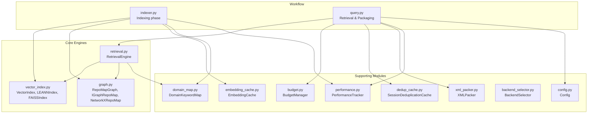

**Diagram sources**
- [indexer.py:1-493](file://src/ws_ctx_engine/workflow/indexer.py#L1-L493)
- [query.py:1-617](file://src/ws_ctx_engine/workflow/query.py#L1-L617)
- [vector_index.py:1-800](file://src/ws_ctx_engine/vector_index/vector_index.py#L1-L800)
- [graph.py:1-667](file://src/ws_ctx_engine/graph/graph.py#L1-L667)
- [retrieval.py:1-627](file://src/ws_ctx_engine/retrieval/retrieval.py#L1-L627)
- [config.py:1-399](file://src/ws_ctx_engine/config/config.py#L1-L399)
- [performance.py:1-263](file://src/ws_ctx_engine/monitoring/performance.py#L1-L263)
- [budget.py:1-105](file://src/ws_ctx_engine/budget/budget.py#L1-L105)
- [domain_map.py:1-147](file://src/ws_ctx_engine/domain_map/domain_map.py#L1-L147)
- [embedding_cache.py:1-127](file://src/ws_ctx_engine/vector_index/embedding_cache.py#L1-L127)
- [dedup_cache.py:1-154](file://src/ws_ctx_engine/session/dedup_cache.py#L1-L154)
- [backend_selector.py:1-191](file://src/ws_ctx_engine/backend_selector/backend_selector.py#L1-L191)
- [xml_packer.py:1-239](file://src/ws_ctx_engine/packer/xml_packer.py#L1-L239)

**Section sources**
- [indexer.py:1-493](file://src/ws_ctx_engine/workflow/indexer.py#L1-L493)
- [query.py:1-617](file://src/ws_ctx_engine/workflow/query.py#L1-L617)

## Core Components
- Indexing phase (indexer.py): Parses code chunks, builds vector index and graph, persists metadata for staleness detection, and writes domain keyword map database.
- Retrieval phase (query.py + retrieval.py): Loads indexes, runs hybrid retrieval (semantic + structural), applies budget constraints, and prepares output metadata.
- Packaging phase (query.py + xml_packer.py): Selects files within budget, optionally shuffles and compresses content, and serializes to XML/ZIP/JSON/YAML/TOON/Markdown.
- Supporting modules: Config, PerformanceTracker, BudgetManager, DomainKeywordMap, EmbeddingCache, SessionDeduplicationCache, BackendSelector, and vector/graph backends.

Key intermediate representations:
- CodeChunk: parsed segments with metadata.
- IndexMetadata: stored hashes and backend info for staleness detection.
- DomainKeywordMap: path-derived keywords mapped to directories.
- EmbeddingCache: persisted content-hash to embedding vector mapping for incremental reuse.

**Section sources**
- [models.py:1-152](file://src/ws_ctx_engine/models/models.py#L1-L152)
- [indexer.py:27-401](file://src/ws_ctx_engine/workflow/indexer.py#L27-L401)
- [query.py:158-617](file://src/ws_ctx_engine/workflow/query.py#L158-L617)
- [retrieval.py:140-627](file://src/ws_ctx_engine/retrieval/retrieval.py#L140-L627)
- [xml_packer.py:51-239](file://src/ws_ctx_engine/packer/xml_packer.py#L51-L239)

## Architecture Overview
The pipeline orchestrates three major phases with explicit data movement and caching:

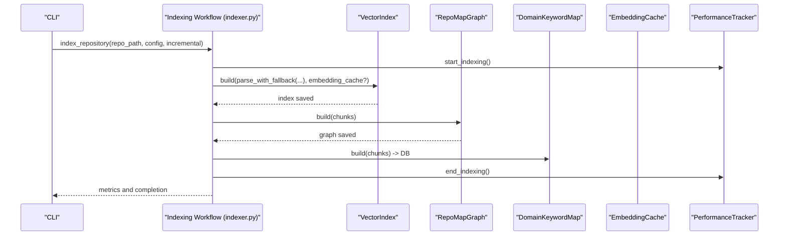

**Diagram sources**
- [indexer.py:72-371](file://src/ws_ctx_engine/workflow/indexer.py#L72-L371)
- [vector_index.py:310-462](file://src/ws_ctx_engine/vector_index/vector_index.py#L310-L462)
- [graph.py:129-314](file://src/ws_ctx_engine/graph/graph.py#L129-L314)
- [domain_map.py:77-147](file://src/ws_ctx_engine/domain_map/domain_map.py#L77-L147)
- [embedding_cache.py:55-84](file://src/ws_ctx_engine/vector_index/embedding_cache.py#L55-L84)
- [performance.py:95-114](file://src/ws_ctx_engine/monitoring/performance.py#L95-L114)

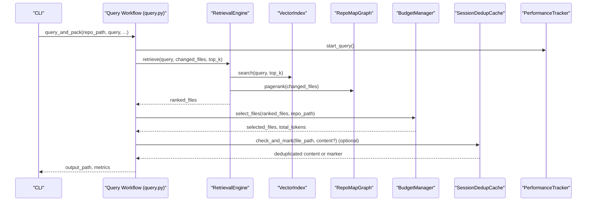

**Diagram sources**
- [query.py:230-617](file://src/ws_ctx_engine/workflow/query.py#L230-L617)
- [retrieval.py:250-368](file://src/ws_ctx_engine/retrieval/retrieval.py#L250-L368)
- [budget.py:50-105](file://src/ws_ctx_engine/budget/budget.py#L50-L105)
- [dedup_cache.py:65-90](file://src/ws_ctx_engine/session/dedup_cache.py#L65-L90)
- [performance.py:105-114](file://src/ws_ctx_engine/monitoring/performance.py#L105-L114)

## Detailed Component Analysis

### Indexing Phase
Responsibilities:
- Parse codebase into CodeChunk objects.
- Build vector index with optional embedding cache reuse.
- Build dependency graph with PageRank.
- Persist metadata for staleness detection and domain keyword map database.
- Track performance and memory usage.

Incremental indexing:
- Compares stored SHA256 hashes against current file content to detect changed and deleted files.
- On change, rebuilds only affected components and updates the index incrementally when supported by backends.

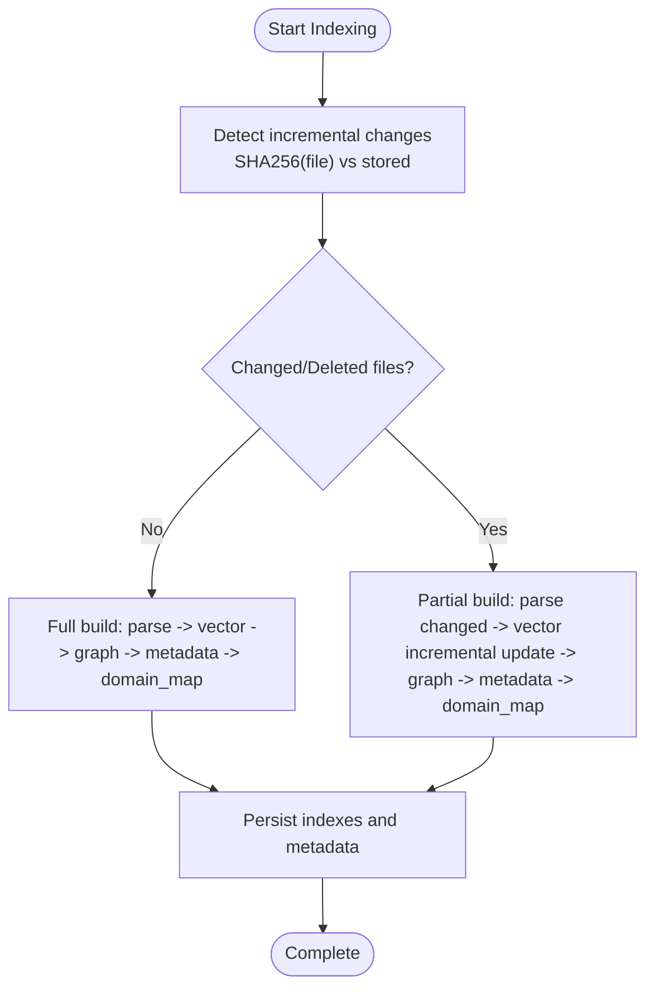

**Diagram sources**
- [indexer.py:27-69](file://src/ws_ctx_engine/workflow/indexer.py#L27-L69)
- [indexer.py:129-371](file://src/ws_ctx_engine/workflow/indexer.py#L129-L371)
- [models.py:87-152](file://src/ws_ctx_engine/models/models.py#L87-L152)

**Section sources**
- [indexer.py:72-371](file://src/ws_ctx_engine/workflow/indexer.py#L72-L371)
- [models.py:87-152](file://src/ws_ctx_engine/models/models.py#L87-L152)

### Retrieval Phase
Responsibilities:
- Load persisted indexes and metadata.
- Hybrid retrieval combining semantic similarity and PageRank scores.
- Apply adaptive boosting for symbols, paths, domains, and penalties for test files.
- Normalize scores to [0, 1] and optionally apply AI rule boost to ensure key rule files are included.
- Support phase-aware re-weighting for agent workflows.

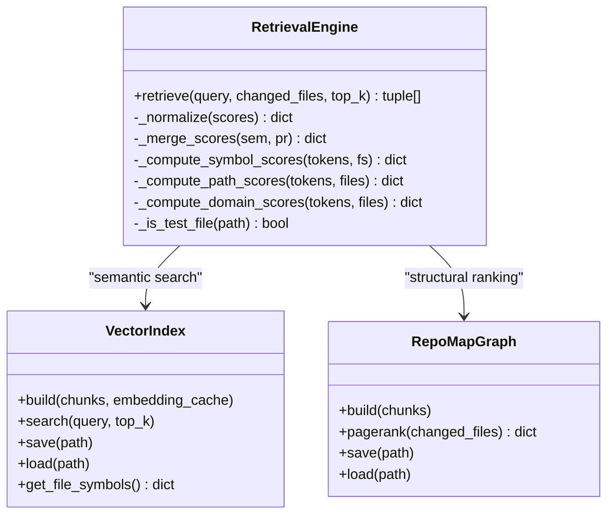

**Diagram sources**
- [retrieval.py:140-627](file://src/ws_ctx_engine/retrieval/retrieval.py#L140-L627)
- [vector_index.py:21-84](file://src/ws_ctx_engine/vector_index/vector_index.py#L21-L84)
- [graph.py:19-94](file://src/ws_ctx_engine/graph/graph.py#L19-L94)

**Section sources**
- [retrieval.py:140-627](file://src/ws_ctx_engine/retrieval/retrieval.py#L140-L627)

### Packaging Phase
Responsibilities:
- Load indexes and metadata health.
- Select files within token budget using greedy knapsack.
- Optionally shuffle files to combat “Lost in the Middle” effect.
- Compress or deduplicate content across sessions.
- Serialize to XML, ZIP, JSON, YAML, TOON, or Markdown.

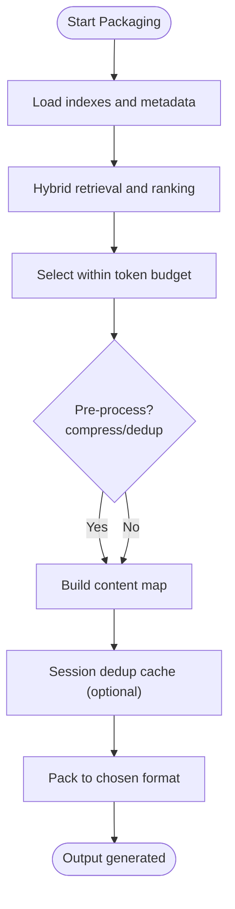

**Diagram sources**
- [query.py:294-617](file://src/ws_ctx_engine/workflow/query.py#L294-L617)
- [xml_packer.py:85-138](file://src/ws_ctx_engine/packer/xml_packer.py#L85-L138)
- [budget.py:50-105](file://src/ws_ctx_engine/budget/budget.py#L50-L105)
- [dedup_cache.py:65-90](file://src/ws_ctx_engine/session/dedup_cache.py#L65-L90)

**Section sources**
- [query.py:230-617](file://src/ws_ctx_engine/workflow/query.py#L230-L617)
- [xml_packer.py:51-239](file://src/ws_ctx_engine/packer/xml_packer.py#L51-L239)

### Incremental Indexing Strategy
Mechanism:
- SHA256 hashing of file content to detect changes.
- On change, rebuild only affected components and update indexes incrementally when supported by backends.
- Embedding cache avoids re-embedding unchanged files across rebuilds.

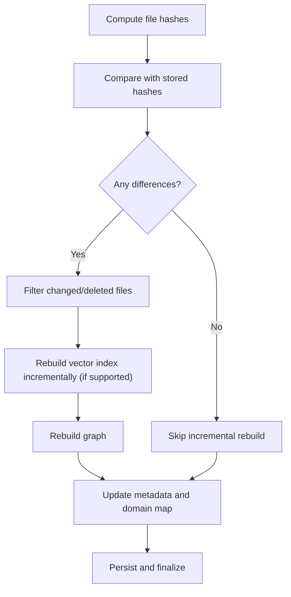

**Diagram sources**
- [indexer.py:27-69](file://src/ws_ctx_engine/workflow/indexer.py#L27-L69)
- [indexer.py:210-234](file://src/ws_ctx_engine/workflow/indexer.py#L210-L234)
- [embedding_cache.py:55-84](file://src/ws_ctx_engine/vector_index/embedding_cache.py#L55-L84)
- [models.py:87-152](file://src/ws_ctx_engine/models/models.py#L87-L152)

**Section sources**
- [indexer.py:27-69](file://src/ws_ctx_engine/workflow/indexer.py#L27-L69)
- [embedding_cache.py:28-127](file://src/ws_ctx_engine/vector_index/embedding_cache.py#L28-L127)
- [models.py:87-152](file://src/ws_ctx_engine/models/models.py#L87-L152)

### Role of Stages and External Dependencies
- VectorIndex backends (LEANNIndex, FAISSIndex) provide semantic search over code chunks.
- RepoMapGraph backends (IGraphRepoMap, NetworkXRepoMap) construct dependency graphs and compute PageRank scores.
- BackendSelector coordinates automatic fallback chains to ensure graceful degradation.
- RetrievalEngine orchestrates hybrid ranking and adaptive boosting strategies.

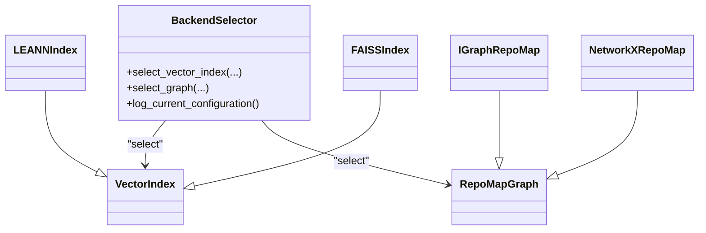

**Diagram sources**
- [backend_selector.py:13-191](file://src/ws_ctx_engine/backend_selector/backend_selector.py#L13-L191)
- [vector_index.py:282-504](file://src/ws_ctx_engine/vector_index/vector_index.py#L282-L504)
- [graph.py:97-314](file://src/ws_ctx_engine/graph/graph.py#L97-L314)

**Section sources**
- [backend_selector.py:13-191](file://src/ws_ctx_engine/backend_selector/backend_selector.py#L13-L191)
- [vector_index.py:282-504](file://src/ws_ctx_engine/vector_index/vector_index.py#L282-L504)
- [graph.py:97-314](file://src/ws_ctx_engine/graph/graph.py#L97-L314)

### Typical Workflows (Sequence Diagrams)

#### Code Review Scenario
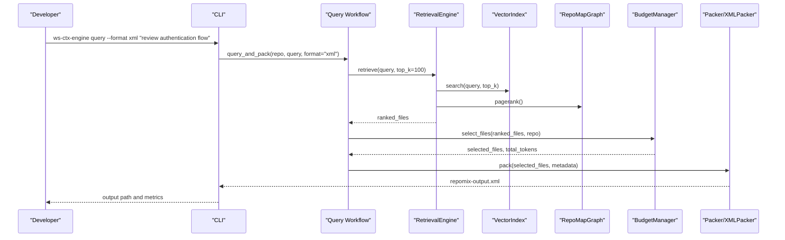

**Diagram sources**
- [cli.py:697-800](file://src/ws_ctx_engine/cli/cli.py#L697-L800)
- [query.py:230-617](file://src/ws_ctx_engine/workflow/query.py#L230-L617)
- [retrieval.py:250-368](file://src/ws_ctx_engine/retrieval/retrieval.py#L250-L368)
- [xml_packer.py:85-138](file://src/ws_ctx_engine/packer/xml_packer.py#L85-L138)

#### Documentation Generation Scenario
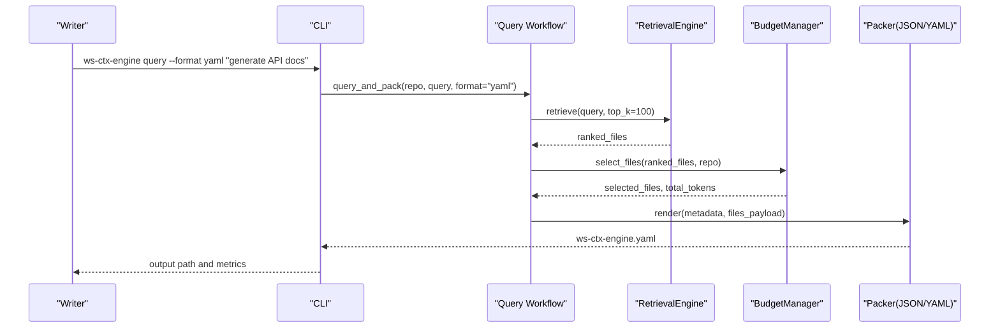

**Diagram sources**
- [cli.py:697-800](file://src/ws_ctx_engine/cli/cli.py#L697-L800)
- [query.py:536-585](file://src/ws_ctx_engine/workflow/query.py#L536-L585)
- [retrieval.py:250-368](file://src/ws_ctx_engine/retrieval/retrieval.py#L250-L368)

#### Bug Investigation Scenario
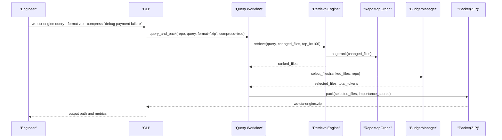

**Diagram sources**
- [cli.py:697-800](file://src/ws_ctx_engine/cli/cli.py#L697-L800)
- [query.py:520-535](file://src/ws_ctx_engine/workflow/query.py#L520-L535)
- [retrieval.py:250-368](file://src/ws_ctx_engine/retrieval/retrieval.py#L250-L368)

## Dependency Analysis
- Coupling: RetrievalEngine depends on VectorIndex and RepoMapGraph; Query workflow depends on BudgetManager, SessionDeduplicationCache, and Packer; Indexing workflow depends on BackendSelector, EmbeddingCache, and DomainKeywordMap.
- Cohesion: Each module encapsulates a focused responsibility (indexing, retrieval, packaging, budgeting).
- External dependencies: python-igraph, networkx, sentence-transformers, faiss-cpu, lxml, tiktoken, psutil.

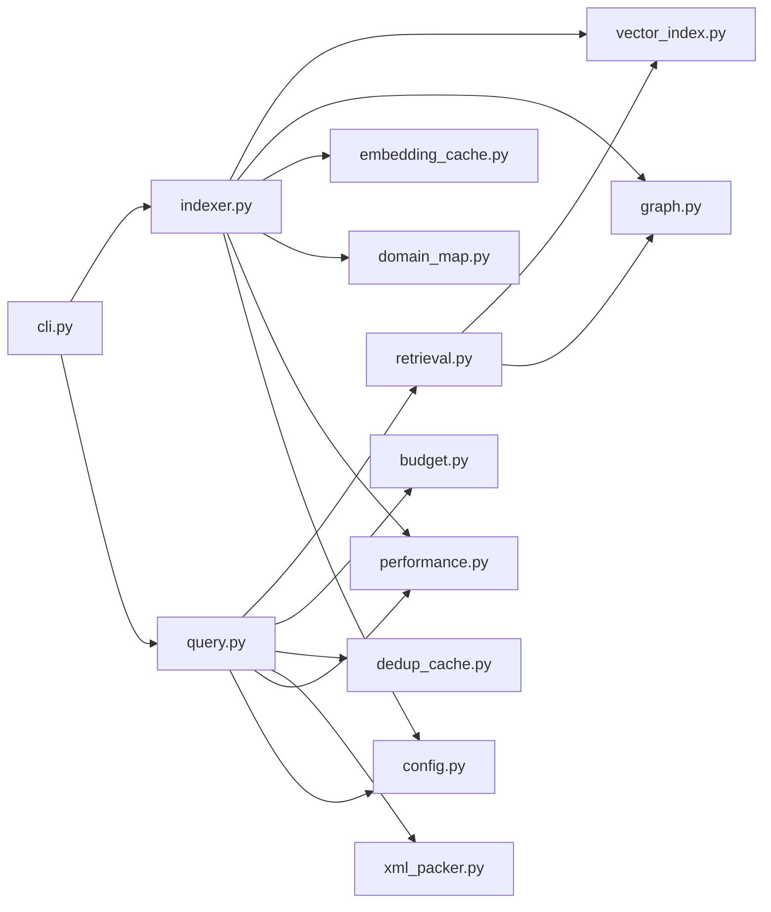

**Diagram sources**
- [cli.py:1-800](file://src/ws_ctx_engine/cli/cli.py#L1-L800)
- [indexer.py:1-493](file://src/ws_ctx_engine/workflow/indexer.py#L1-L493)
- [query.py:1-617](file://src/ws_ctx_engine/workflow/query.py#L1-L617)
- [vector_index.py:1-800](file://src/ws_ctx_engine/vector_index/vector_index.py#L1-L800)
- [graph.py:1-667](file://src/ws_ctx_engine/graph/graph.py#L1-L667)
- [retrieval.py:1-627](file://src/ws_ctx_engine/retrieval/retrieval.py#L1-L627)
- [budget.py:1-105](file://src/ws_ctx_engine/budget/budget.py#L1-L105)
- [dedup_cache.py:1-154](file://src/ws_ctx_engine/session/dedup_cache.py#L1-L154)
- [xml_packer.py:1-239](file://src/ws_ctx_engine/packer/xml_packer.py#L1-L239)
- [performance.py:1-263](file://src/ws_ctx_engine/monitoring/performance.py#L1-L263)
- [config.py:1-399](file://src/ws_ctx_engine/config/config.py#L1-L399)

**Section sources**
- [cli.py:1-800](file://src/ws_ctx_engine/cli/cli.py#L1-L800)
- [backend_selector.py:13-191](file://src/ws_ctx_engine/backend_selector/backend_selector.py#L13-L191)

## Performance Considerations
- Embedding cache reduces re-embedding costs on incremental rebuilds.
- Session-level deduplication reduces redundant content transmission across agent calls.
- Greedy knapsack budget selection ensures token budgets are respected.
- PerformanceTracker measures phase timings, file counts, index sizes, and memory usage.
- BackendSelector chooses optimal backends with graceful fallback to minimize latency and maximize throughput.

[No sources needed since this section provides general guidance]

## Troubleshooting Guide
Common issues and remedies:
- Missing indexes: The query phase raises FileNotFoundError if indexes are not found; run the index command first.
- Stale indexes: load_indexes detects staleness via SHA256 hashes and can auto-rebuild if enabled.
- Backend failures: BackendSelector logs fallback levels and continues with degraded modes.
- Out-of-memory during embeddings: EmbeddingGenerator falls back to API when local memory is insufficient.
- File read errors: Gracefully skips unreadable files and warns; consider adjusting include/exclude patterns.

**Section sources**
- [query.py:316-322](file://src/ws_ctx_engine/workflow/query.py#L316-L322)
- [indexer.py:456-467](file://src/ws_ctx_engine/workflow/indexer.py#L456-L467)
- [backend_selector.py:158-177](file://src/ws_ctx_engine/backend_selector/backend_selector.py#L158-L177)
- [vector_index.py:130-251](file://src/ws_ctx_engine/vector_index/vector_index.py#L130-L251)
- [config.py:112-215](file://src/ws_ctx_engine/config/config.py#L112-L215)

## Conclusion
The ws-ctx-engine pipeline delivers a robust, incremental, and efficient codebase context generation system. By combining semantic and structural ranking, enforcing token budgets, and leveraging caching and graceful degradation, it supports diverse use cases such as code review, documentation generation, and bug investigation. The modular architecture and comprehensive monitoring enable reliable operation across varied environments and dependencies.

[No sources needed since this section summarizes without analyzing specific files]

## Appendices

### Data Models and Intermediate Representations
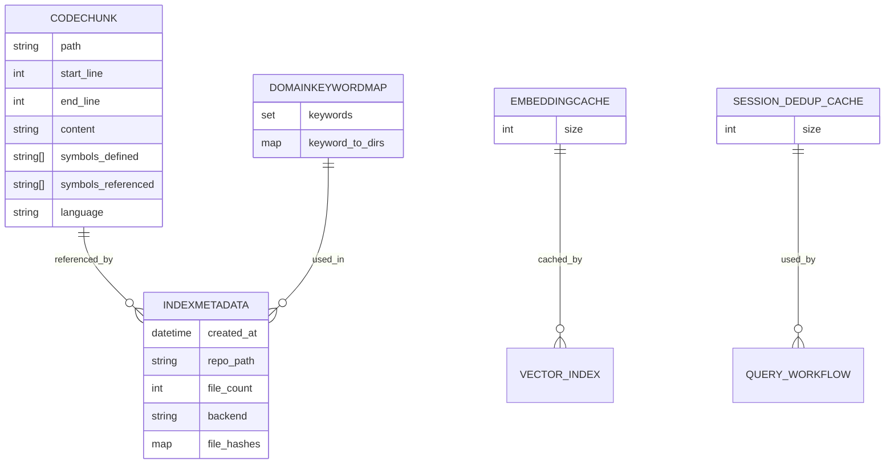

**Diagram sources**
- [models.py:10-152](file://src/ws_ctx_engine/models/models.py#L10-L152)
- [domain_map.py:11-147](file://src/ws_ctx_engine/domain_map/domain_map.py#L11-L147)
- [embedding_cache.py:28-127](file://src/ws_ctx_engine/vector_index/embedding_cache.py#L28-L127)
- [dedup_cache.py:35-154](file://src/ws_ctx_engine/session/dedup_cache.py#L35-L154)