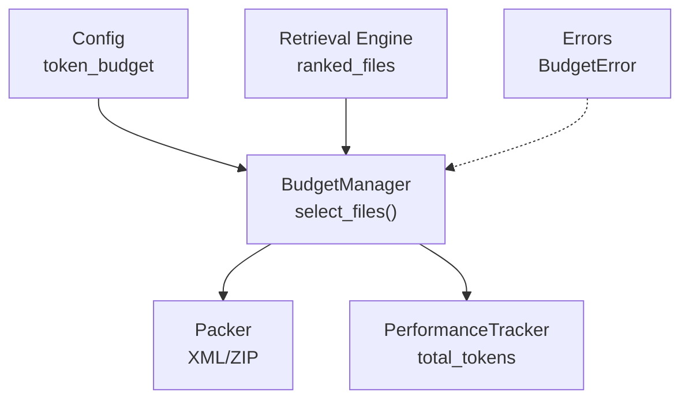
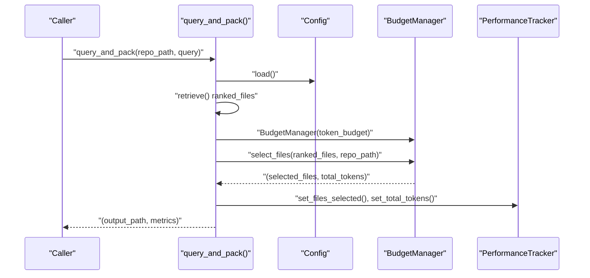
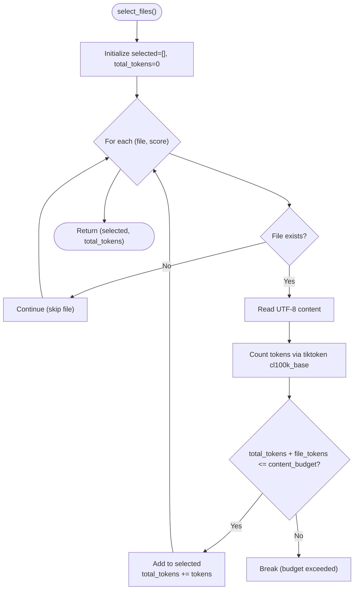
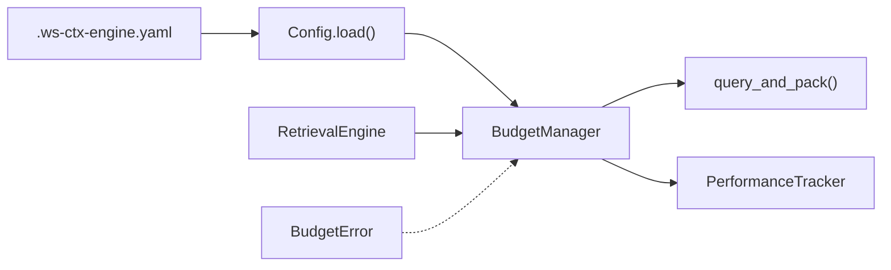

# Token Budget Management

<cite>
**Referenced Files in This Document**
- [budget.py](file://src/ws_ctx_engine/budget/budget.py)
- [__init__.py](file://src/ws_ctx_engine/budget/__init__.py)
- [config.py](file://src/ws_ctx_engine/config/config.py)
- [query.py](file://src/ws_ctx_engine/workflow/query.py)
- [performance.py](file://src/ws_ctx_engine/monitoring/performance.py)
- [errors.py](file://src/ws_ctx_engine/errors/errors.py)
- [.ws-ctx-engine.yaml.example](file://.ws-ctx-engine.yaml.example)
- [budget.md](file://docs/reference/budget.md)
- [architecture.md](file://docs/reference/architecture.md)
- [test_budget.py](file://tests/unit/test_budget.py)
- [test_budget_properties.py](file://tests/property/test_budget_properties.py)
- [integration_test_fallback_scenarios.py](file://tests/integration/test_fallback_scenarios.py)
</cite>

## Table of Contents
1. [Introduction](#introduction)
2. [Project Structure](#project-structure)
3. [Core Components](#core-components)
4. [Architecture Overview](#architecture-overview)
5. [Detailed Component Analysis](#detailed-component-analysis)
6. [Dependency Analysis](#dependency-analysis)
7. [Performance Considerations](#performance-considerations)
8. [Troubleshooting Guide](#troubleshooting-guide)
9. [Conclusion](#conclusion)

## Introduction
This document explains the ws-ctx-engine token budget management system. It covers how the system frames context packing as a greedy knapsack optimization problem, allocates 80% of the budget for content and 20% for metadata/manifest, integrates tiktoken with cl100k_base encoding for precise token counting, and dynamically adjusts budgets based on query complexity. It also provides practical examples for common use cases, monitoring strategies, and guidance for handling budget constraints.

## Project Structure
The token budget management spans several modules:
- BudgetManager: Implements greedy knapsack selection and token accounting
- Config: Supplies token_budget and other runtime settings
- Workflow: Integrates budget selection into the query phase
- Monitoring: Tracks query metrics including total tokens selected
- Docs and Tests: Define behavior, constraints, and validation

**Diagram sources**
- [budget.py:32-104](file://src/ws_ctx_engine/budget/budget.py#L32-L104)
- [config.py](file://src/ws_ctx_engine/config/config.py#L30)
- [query.py:387-408](file://src/ws_ctx_engine/workflow/query.py#L387-L408)
- [performance.py:44-46](file://src/ws_ctx_engine/monitoring/performance.py#L44-L46)

**Section sources**
- [budget.py:1-105](file://src/ws_ctx_engine/budget/budget.py#L1-L105)
- [config.py:1-399](file://src/ws_ctx_engine/config/config.py#L1-L399)
- [query.py:230-617](file://src/ws_ctx_engine/workflow/query.py#L230-L617)

## Core Components
- BudgetManager: Greedy knapsack selection with 80/20 allocation and tiktoken cl100k_base encoding
- Config: token_budget setting with validation
- Workflow: Orchestrates retrieval → budget selection → packing
- Monitoring: Tracks total tokens selected for reporting and alerting
- Errors: BudgetError for budget exceeded and no-files-fit scenarios

Key behaviors:
- 80% content budget, 20% metadata budget
- Greedy selection by descending importance score
- Exact token counting via tiktoken cl100k_base
- Graceful handling of missing/unreadable files

**Section sources**
- [budget.py:8-104](file://src/ws_ctx_engine/budget/budget.py#L8-L104)
- [config.py](file://src/ws_ctx_engine/config/config.py#L30)
- [query.py:387-408](file://src/ws_ctx_engine/workflow/query.py#L387-L408)
- [performance.py:44-46](file://src/ws_ctx_engine/monitoring/performance.py#L44-L46)
- [errors.py:268-319](file://src/ws_ctx_engine/errors/errors.py#L268-L319)

## Architecture Overview
The budget selection sits between retrieval and packing in the query phase. The system loads indexes, retrieves ranked files, applies the BudgetManager to select within budget, and then packs the output.

**Diagram sources**
- [query.py:230-617](file://src/ws_ctx_engine/workflow/query.py#L230-L617)
- [budget.py:32-104](file://src/ws_ctx_engine/budget/budget.py#L32-L104)
- [performance.py:161-175](file://src/ws_ctx_engine/monitoring/performance.py#L161-L175)

## Detailed Component Analysis

### BudgetManager: Greedy Knapsack with 80/20 Allocation
- Purpose: Select files up to content budget while maximizing importance
- Algorithm: Greedy knapsack over pre-sorted ranked_files
- Allocation: content_budget = 80% of token_budget; remaining 20% reserved for metadata/manifest
- Token counting: tiktoken cl100k_base encoding for GPT-4/3.5-turbo compatibility
- Accuracy: Within ±2% of actual API tokenization
- Robustness: Skips missing/unreadable files; stops selection when budget exceeded

**Diagram sources**
- [budget.py:50-104](file://src/ws_ctx_engine/budget/budget.py#L50-L104)

**Section sources**
- [budget.py:8-104](file://src/ws_ctx_engine/budget/budget.py#L8-L104)
- [budget.md:93-137](file://docs/reference/budget.md#L93-L137)
- [test_budget.py:171-198](file://tests/unit/test_budget.py#L171-L198)
- [test_budget_properties.py:120-151](file://tests/property/test_budget_properties.py#L120-L151)

### Configuration and Dynamic Budget Adjustment
- token_budget is loaded from .ws-ctx-engine.yaml with validation
- Defaults to 100,000 tokens; configurable per use case
- Dynamic adjustment: Increase token_budget for complex queries or large contexts

Examples from configuration:
- Code review: 80K tokens
- Documentation: 60K tokens
- Bug investigation: 30K tokens

**Section sources**
- [config.py](file://src/ws_ctx_engine/config/config.py#L30)
- [.ws-ctx-engine.yaml.example:14-21](file://.ws-ctx-engine.yaml.example#L14-L21)
- [.ws-ctx-engine.yaml.example:210-235](file://.ws-ctx-engine.yaml.example#L210-L235)

### Token Estimation and Encoding
- Encoding: cl100k_base (GPT-4/3.5-turbo/text-embedding-ada-002)
- Accuracy: ±2% vs. actual API tokenization
- Examples (approximate tokens):
  - Python function (10 lines): 50–100
  - JavaScript module (100 lines): 500–800
  - Markdown README (500 words): 600–750
  - JSON config (50 keys): 200–300

**Section sources**
- [budget.md:118-137](file://docs/reference/budget.md#L118-L137)
- [test_budget.py:171-198](file://tests/unit/test_budget.py#L171-L198)

### Monitoring and Reporting
- PerformanceTracker tracks total_tokens in selected files
- query_and_pack logs budget usage and selection metrics
- Use total_tokens ≤ content_budget (80% of token_budget) as the hard constraint

**Section sources**
- [performance.py:44-46](file://src/ws_ctx_engine/monitoring/performance.py#L44-L46)
- [query.py:398-408](file://src/ws_ctx_engine/workflow/query.py#L398-L408)
- [integration_test_fallback_scenarios.py:214-218](file://tests/integration/test_fallback_scenarios.py#L214-L218)

### Error Handling and Constraints
- BudgetError.budget_exceeded: Raised when required tokens exceed available budget
- BudgetError.no_files_fit: Raised when even the smallest file exceeds budget
- Tests enforce content budget ≤ 80% and greedy optimality properties

**Section sources**
- [errors.py:268-319](file://src/ws_ctx_engine/errors/errors.py#L268-L319)
- [test_budget.py:154-168](file://tests/unit/test_budget.py#L154-L168)
- [test_budget_properties.py:231-261](file://tests/property/test_budget_properties.py#L231-L261)

## Dependency Analysis
- BudgetManager depends on tiktoken for token counting
- Workflow composes BudgetManager with retrieval results and config
- Monitoring consumes BudgetManager outputs for reporting
- Tests validate BudgetManager behavior and integration points

**Diagram sources**
- [config.py:112-244](file://src/ws_ctx_engine/config/config.py#L112-L244)
- [budget.py:32-104](file://src/ws_ctx_engine/budget/budget.py#L32-L104)
- [query.py:387-408](file://src/ws_ctx_engine/workflow/query.py#L387-L408)
- [performance.py:161-175](file://src/ws_ctx_engine/monitoring/performance.py#L161-L175)

**Section sources**
- [__init__.py:1-4](file://src/ws_ctx_engine/budget/__init__.py#L1-L4)
- [budget.py:1-105](file://src/ws_ctx_engine/budget/budget.py#L1-L105)
- [config.py:1-399](file://src/ws_ctx_engine/config/config.py#L1-L399)
- [query.py:230-617](file://src/ws_ctx_engine/workflow/query.py#L230-L617)

## Performance Considerations
- Token counting per file: O(n) where n is content length; typically 1–10 ms/file
- Selection over m files: O(m); typically 10–100 ms
- Memory usage: O(1) per file; peak ~1 MB
- Real-time constraints: Greedy knapsack chosen for speed and near-optimality

**Section sources**
- [budget.md:224-231](file://docs/reference/budget.md#L224-L231)

## Troubleshooting Guide
Common issues and resolutions:
- Budget exceeded
  - Symptom: BudgetError.budget_exceeded raised
  - Resolution: Increase token_budget in .ws-ctx-engine.yaml or reduce file selection
- No files fit
  - Symptom: BudgetError.no_files_fit raised
  - Resolution: Increase token_budget; consider excluding very large files
- Accuracy concerns
  - Symptom: Discrepancy with expected token counts
  - Resolution: Confirm cl100k_base encoding is used; tests require ±2% accuracy
- Missing/unreadable files
  - Behavior: Skipped gracefully; selection continues with remaining budget

Practical checks:
- Verify content budget ≤ 80% of token_budget
- Confirm total_tokens ≤ content_budget after selection
- Use PerformanceTracker to monitor total_tokens and files_selected

**Section sources**
- [errors.py:268-319](file://src/ws_ctx_engine/errors/errors.py#L268-L319)
- [test_budget.py:154-168](file://tests/unit/test_budget.py#L154-L168)
- [test_budget.py:171-198](file://tests/unit/test_budget.py#L171-L198)
- [query.py:398-408](file://src/ws_ctx_engine/workflow/query.py#L398-L408)

## Conclusion
The ws-ctx-engine token budget management system uses a greedy knapsack algorithm to efficiently select relevant files within LLM token limits. By allocating 80% of the budget to content and reserving 20% for metadata/manifest, integrating tiktoken cl100k_base for precise counting, and providing robust monitoring and error handling, the system delivers predictable, real-time context packing suitable for diverse workflows such as code review, documentation, and bug investigation.