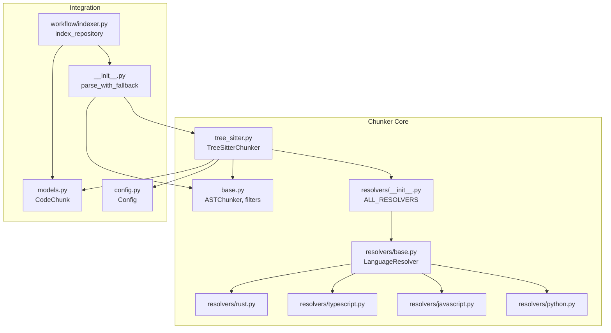
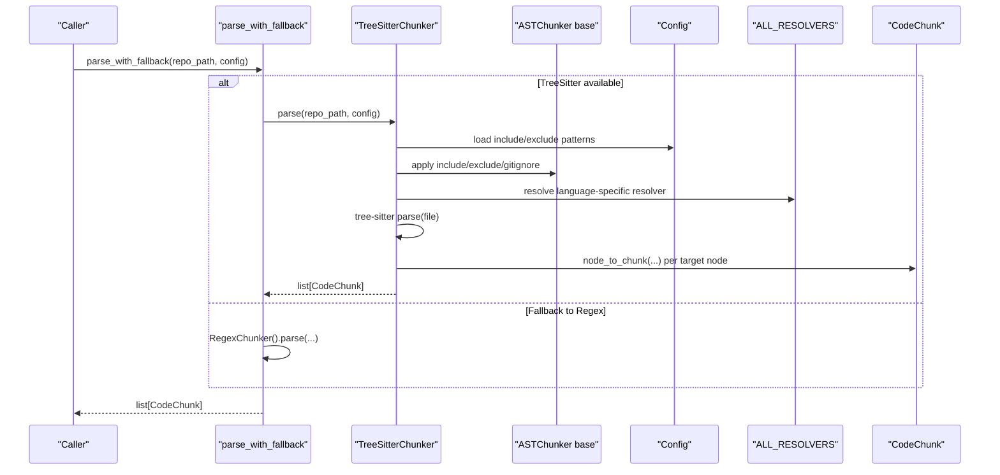
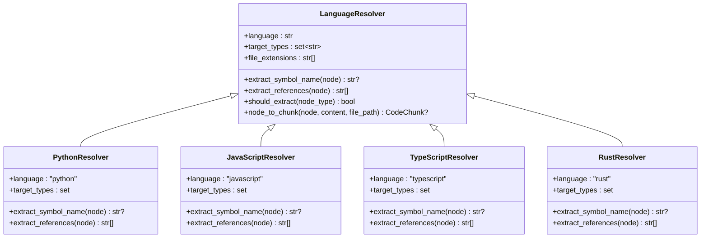
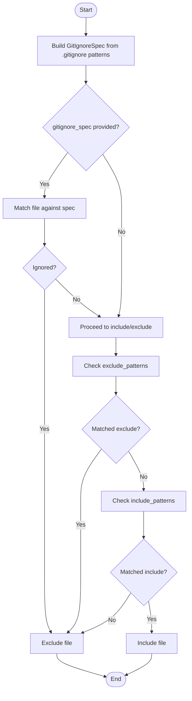
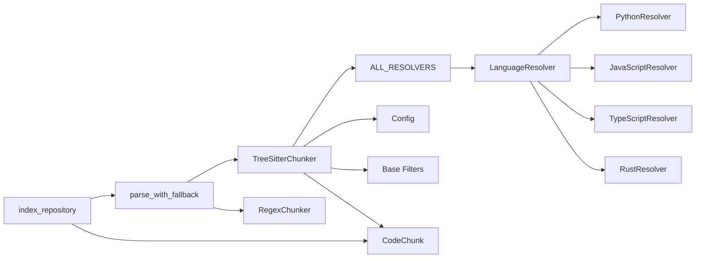

# AST Chunking Core

<cite>
**Referenced Files in This Document**
- [tree_sitter.py](file://src/ws_ctx_engine/chunker/tree_sitter.py)
- [base.py](file://src/ws_ctx_engine/chunker/base.py)
- [resolvers/base.py](file://src/ws_ctx_engine/chunker/resolvers/base.py)
- [resolvers/python.py](file://src/ws_ctx_engine/chunker/resolvers/python.py)
- [resolvers/javascript.py](file://src/ws_ctx_engine/chunker/resolvers/javascript.py)
- [resolvers/typescript.py](file://src/ws_ctx_engine/chunker/resolvers/typescript.py)
- [resolvers/rust.py](file://src/ws_ctx_engine/chunker/resolvers/rust.py)
- [resolvers/__init__.py](file://src/ws_ctx_engine/chunker/resolvers/__init__.py)
- [__init__.py](file://src/ws_ctx_engine/chunker/__init__.py)
- [config.py](file://src/ws_ctx_engine/config/config.py)
- [models.py](file://src/ws_ctx_engine/models/models.py)
- [indexer.py](file://src/ws_ctx_engine/workflow/indexer.py)
- [test_tree_sitter_chunker.py](file://tests/unit/test_tree_sitter_chunker.py)
- [test_ast_chunker.py](file://tests/unit/test_ast_chunker.py)
</cite>

## Table of Contents
1. [Introduction](#introduction)
2. [Project Structure](#project-structure)
3. [Core Components](#core-components)
4. [Architecture Overview](#architecture-overview)
5. [Detailed Component Analysis](#detailed-component-analysis)
6. [Dependency Analysis](#dependency-analysis)
7. [Performance Considerations](#performance-considerations)
8. [Troubleshooting Guide](#troubleshooting-guide)
9. [Conclusion](#conclusion)

## Introduction
This document explains the AST chunking core system that parses source code using the tree-sitter library, extracts meaningful code chunks per language, and integrates with the broader indexing pipeline. It covers the ASTChunker base class interface, file inclusion/exclusion logic, INDEXED_EXTENSIONS configuration, gitignore pattern processing, fallback mechanisms for unsupported file types, the tree-sitter integration workflow, symbol extraction algorithms, chunk size optimization strategies, examples of AST parsing across languages, performance considerations for large codebases, and robust error handling for malformed syntax.

## Project Structure
The AST chunking core resides in the chunker module and integrates with configuration, models, and the indexing workflow.

**Diagram sources**
- [tree_sitter.py:15-160](file://src/ws_ctx_engine/chunker/tree_sitter.py#L15-L160)
- [base.py:41-176](file://src/ws_ctx_engine/chunker/base.py#L41-L176)
- [resolvers/__init__.py:9-26](file://src/ws_ctx_engine/chunker/resolvers/__init__.py#L9-L26)
- [resolvers/base.py:7-70](file://src/ws_ctx_engine/chunker/resolvers/base.py#L7-L70)
- [resolvers/python.py:6-61](file://src/ws_ctx_engine/chunker/resolvers/python.py#L6-L61)
- [resolvers/javascript.py:6-85](file://src/ws_ctx_engine/chunker/resolvers/javascript.py#L6-L85)
- [resolvers/typescript.py:6-103](file://src/ws_ctx_engine/chunker/resolvers/typescript.py#L6-L103)
- [resolvers/rust.py:6-55](file://src/ws_ctx_engine/chunker/resolvers/rust.py#L6-L55)
- [__init__.py:17-38](file://src/ws_ctx_engine/chunker/__init__.py#L17-L38)
- [config.py:16-216](file://src/ws_ctx_engine/config/config.py#L16-L216)
- [models.py:10-85](file://src/ws_ctx_engine/models/models.py#L10-L85)
- [indexer.py:72-371](file://src/ws_ctx_engine/workflow/indexer.py#L72-L371)

**Section sources**
- [tree_sitter.py:15-160](file://src/ws_ctx_engine/chunker/tree_sitter.py#L15-L160)
- [base.py:26-176](file://src/ws_ctx_engine/chunker/base.py#L26-L176)
- [resolvers/__init__.py:9-26](file://src/ws_ctx_engine/chunker/resolvers/__init__.py#L9-L26)
- [__init__.py:17-38](file://src/ws_ctx_engine/chunker/__init__.py#L17-L38)
- [config.py:16-216](file://src/ws_ctx_engine/config/config.py#L16-L216)
- [models.py:10-85](file://src/ws_ctx_engine/models/models.py#L10-L85)
- [indexer.py:72-371](file://src/ws_ctx_engine/workflow/indexer.py#L72-L371)

## Core Components
- ASTChunker: Abstract base class defining the parse contract for AST-based chunkers.
- TreeSitterChunker: Implements AST parsing using tree-sitter with language-specific resolvers.
- LanguageResolver: Abstract base for language-specific symbol extraction and chunk conversion.
- Resolvers: Concrete resolvers for Python, JavaScript, TypeScript, and Rust.
- Base filtering utilities: INDEXED_EXTENSIONS, gitignore processing, include/exclude logic, and warnings for unsupported extensions.
- Fallback mechanism: parse_with_fallback automatically falls back to RegexChunker when TreeSitter is unavailable or fails.
- Integration with Config and CodeChunk models, and the indexing workflow.

**Section sources**
- [base.py:41-176](file://src/ws_ctx_engine/chunker/base.py#L41-L176)
- [tree_sitter.py:15-160](file://src/ws_ctx_engine/chunker/tree_sitter.py#L15-L160)
- [resolvers/base.py:7-70](file://src/ws_ctx_engine/chunker/resolvers/base.py#L7-L70)
- [resolvers/python.py:6-61](file://src/ws_ctx_engine/chunker/resolvers/python.py#L6-L61)
- [resolvers/javascript.py:6-85](file://src/ws_ctx_engine/chunker/resolvers/javascript.py#L6-L85)
- [resolvers/typescript.py:6-103](file://src/ws_ctx_engine/chunker/resolvers/typescript.py#L6-L103)
- [resolvers/rust.py:6-55](file://src/ws_ctx_engine/chunker/resolvers/rust.py#L6-L55)
- [__init__.py:17-38](file://src/ws_ctx_engine/chunker/__init__.py#L17-L38)
- [models.py:10-85](file://src/ws_ctx_engine/models/models.py#L10-L85)
- [config.py:16-216](file://src/ws_ctx_engine/config/config.py#L16-L216)

## Architecture Overview
The AST chunking pipeline:
- Loads configuration and initializes TreeSitterChunker.
- Discovers files by extension and applies include/exclude/gitignore rules.
- Parses each file with tree-sitter and converts AST nodes to CodeChunk instances via resolvers.
- Aggregates chunks and enriches them with file-level imports.
- Integrates with the indexing workflow for vector index and graph construction.

**Diagram sources**
- [__init__.py:17-38](file://src/ws_ctx_engine/chunker/__init__.py#L17-L38)
- [tree_sitter.py:57-114](file://src/ws_ctx_engine/chunker/tree_sitter.py#L57-L114)
- [base.py:118-176](file://src/ws_ctx_engine/chunker/base.py#L118-L176)
- [resolvers/__init__.py:9-26](file://src/ws_ctx_engine/chunker/resolvers/__init__.py#L9-L26)
- [models.py:10-85](file://src/ws_ctx_engine/models/models.py#L10-L85)

## Detailed Component Analysis

### ASTChunker Base Interface
- Defines the parse contract for AST-based chunkers.
- Provides shared filtering utilities:
  - INDEXED_EXTENSIONS: set of extensions with full AST support.
  - collect_gitignore_patterns, build_ignore_spec, get_files_to_include: gitignore processing.
  - _should_include_file: priority-based include/exclude logic with gitignore support.
  - _match_pattern: supports **, **/, and ** patterns.
  - warn_non_indexed_extension: logs warnings for unsupported extensions.

**Section sources**
- [base.py:41-176](file://src/ws_ctx_engine/chunker/base.py#L41-L176)

### TreeSitterChunker Implementation
- Initializes tree-sitter parsers for supported languages and maps file extensions to languages.
- Uses ALL_RESOLVERS to convert AST nodes to CodeChunk.
- Extracts file-level imports and augments each chunk’s symbols_referenced.
- Applies include/exclude/gitignore filtering before parsing.
- Handles exceptions per-file to avoid aborting the entire scan.

Key behaviors:
- Language mapping and import types are defined in class constants.
- File parsing uses UTF-8 decoding with graceful failure logging.
- Import extraction traverses AST nodes of known import statement types.
- Definition extraction delegates to resolvers based on node types.

**Section sources**
- [tree_sitter.py:15-160](file://src/ws_ctx_engine/chunker/tree_sitter.py#L15-L160)
- [resolvers/__init__.py:9-26](file://src/ws_ctx_engine/chunker/resolvers/__init__.py#L9-L26)

### LanguageResolver and Concrete Resolvers
- LanguageResolver defines:
  - language and target_types for AST node types to extract.
  - extract_symbol_name and extract_references.
  - node_to_chunk: converts an AST node to a CodeChunk with start/end lines, content slice, symbols_defined, and symbols_referenced.
- PythonResolver: targets function/class definitions, decorated definitions, and type aliases; collects identifiers for references.
- JavaScriptResolver: targets function/class declarations, method definitions, lexical declarations, JSX elements, export statements, and generator functions.
- TypeScriptResolver: extends JS with interfaces, type aliases, enums, abstract classes, internal modules, and JSX.
- RustResolver: targets functions, structs, traits, impl blocks, enums, const/static/type/items, unions, and signatures.

**Diagram sources**
- [resolvers/base.py:7-70](file://src/ws_ctx_engine/chunker/resolvers/base.py#L7-L70)
- [resolvers/python.py:6-61](file://src/ws_ctx_engine/chunker/resolvers/python.py#L6-L61)
- [resolvers/javascript.py:6-85](file://src/ws_ctx_engine/chunker/resolvers/javascript.py#L6-L85)
- [resolvers/typescript.py:6-103](file://src/ws_ctx_engine/chunker/resolvers/typescript.py#L6-L103)
- [resolvers/rust.py:6-55](file://src/ws_ctx_engine/chunker/resolvers/rust.py#L6-L55)

**Section sources**
- [resolvers/base.py:7-70](file://src/ws_ctx_engine/chunker/resolvers/base.py#L7-L70)
- [resolvers/python.py:6-61](file://src/ws_ctx_engine/chunker/resolvers/python.py#L6-L61)
- [resolvers/javascript.py:6-85](file://src/ws_ctx_engine/chunker/resolvers/javascript.py#L6-L85)
- [resolvers/typescript.py:6-103](file://src/ws_ctx_engine/chunker/resolvers/typescript.py#L6-L103)
- [resolvers/rust.py:6-55](file://src/ws_ctx_engine/chunker/resolvers/rust.py#L6-L55)

### File Inclusion/Exclusion and Gitignore Processing
- INDEXED_EXTENSIONS: restricts AST parsing to supported extensions.
- collect_gitignore_patterns: discovers .gitignore recursively and scopes patterns to subdirectories.
- build_ignore_spec: constructs a GitIgnoreSpec using pathspec; falls back to fnmatch if unavailable.
- _should_include_file: precedence order:
  1) gitignore_spec match (if provided),
  2) explicit exclude_patterns,
  3) include_patterns.
- warn_non_indexed_extension: logs a warning for unsupported extensions.

**Diagram sources**
- [base.py:47-176](file://src/ws_ctx_engine/chunker/base.py#L47-L176)

**Section sources**
- [base.py:26-176](file://src/ws_ctx_engine/chunker/base.py#L26-L176)

### Fallback Mechanism for Unsupported File Types
- parse_with_fallback attempts TreeSitterChunker first; logs and falls back to RegexChunker on ImportError or general exception.
- Ensures robustness when tree-sitter dependencies are missing or when parsing fails.

**Section sources**
- [__init__.py:17-38](file://src/ws_ctx_engine/chunker/__init__.py#L17-L38)

### Integration with the Indexing Pipeline
- index_repository orchestrates the index phase:
  - Parses codebase using parse_with_fallback.
  - Builds vector index and graph (with optional incremental updates).
  - Saves metadata for staleness detection and domain keyword map.
- CodeChunk provides token_count and serialization helpers used downstream.

**Section sources**
- [indexer.py:72-371](file://src/ws_ctx_engine/workflow/indexer.py#L72-L371)
- [models.py:10-85](file://src/ws_ctx_engine/models/models.py#L10-L85)

## Dependency Analysis
- TreeSitterChunker depends on:
  - LanguageResolver implementations via ALL_RESOLVERS.
  - Config for include/exclude patterns.
  - Base filtering utilities for include/exclude/gitignore.
  - CodeChunk model for output.
- Resolvers depend on LanguageResolver base and AST node traversal.
- parse_with_fallback bridges TreeSitterChunker and RegexChunker.
- index_repository consumes CodeChunk outputs and drives downstream systems.

**Diagram sources**
- [tree_sitter.py:15-160](file://src/ws_ctx_engine/chunker/tree_sitter.py#L15-L160)
- [resolvers/__init__.py:9-26](file://src/ws_ctx_engine/chunker/resolvers/__init__.py#L9-L26)
- [base.py:41-176](file://src/ws_ctx_engine/chunker/base.py#L41-L176)
- [models.py:10-85](file://src/ws_ctx_engine/models/models.py#L10-L85)
- [__init__.py:17-38](file://src/ws_ctx_engine/chunker/__init__.py#L17-L38)
- [indexer.py:72-371](file://src/ws_ctx_engine/workflow/indexer.py#L72-L371)

**Section sources**
- [tree_sitter.py:15-160](file://src/ws_ctx_engine/chunker/tree_sitter.py#L15-L160)
- [resolvers/__init__.py:9-26](file://src/ws_ctx_engine/chunker/resolvers/__init__.py#L9-L26)
- [base.py:41-176](file://src/ws_ctx_engine/chunker/base.py#L41-L176)
- [__init__.py:17-38](file://src/ws_ctx_engine/chunker/__init__.py#L17-L38)
- [indexer.py:72-371](file://src/ws_ctx_engine/workflow/indexer.py#L72-L371)

## Performance Considerations
- Large codebases:
  - Use include/exclude patterns to limit scope.
  - Respect_gitignore reduces IO by skipping ignored subtrees.
  - Incremental indexing detects changed/deleted files and updates vector index accordingly.
- Memory optimization:
  - Deduplicate chunks by path/start_line/end_line to avoid redundant processing.
  - Use embedding cache to avoid recomputing unchanged vectors.
- Token budget and chunk sizing:
  - CodeChunk.token_count helps estimate token usage; combine with token_budget to bound index size.
- Parallelization:
  - max_workers is reserved for future parallel processing; current implementation focuses on safe fallback and incremental updates.

[No sources needed since this section provides general guidance]

## Troubleshooting Guide
Common issues and remedies:
- Missing tree-sitter dependencies:
  - ImportError during TreeSitterChunker initialization indicates missing packages; install the required tree-sitter language bindings.
- Unsupported file extensions:
  - warn_non_indexed_extension logs warnings for extensions outside INDEXED_EXTENSIONS; these files are indexed as plain text.
- Malformed syntax:
  - _should_include_file continues processing other files; individual file read/parse failures are logged and skipped.
- Gitignore discrepancies:
  - If pathspec is unavailable, build_ignore_spec falls back to fnmatch; expect less precise semantics.

**Section sources**
- [tree_sitter.py:26-37](file://src/ws_ctx_engine/chunker/tree_sitter.py#L26-L37)
- [base.py:106-115](file://src/ws_ctx_engine/chunker/base.py#L106-L115)
- [base.py:82-92](file://src/ws_ctx_engine/chunker/base.py#L82-L92)
- [tree_sitter.py:98-100](file://src/ws_ctx_engine/chunker/tree_sitter.py#L98-L100)
- [tree_sitter.py:84-87](file://src/ws_ctx_engine/chunker/tree_sitter.py#L84-L87)

## Conclusion
The AST chunking core leverages tree-sitter for precise, language-aware parsing, with robust fallbacks and comprehensive filtering. The modular resolver architecture enables extensible symbol extraction across Python, JavaScript, TypeScript, and Rust. Integrated with the indexing pipeline, it supports incremental updates, deduplication, and efficient token budgeting, while gracefully handling unsupported files and malformed syntax.