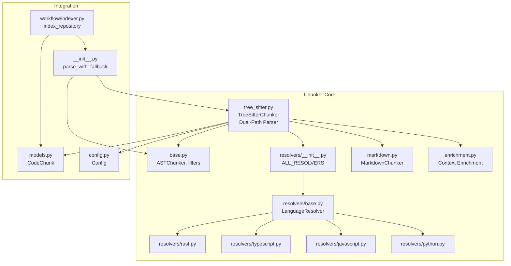
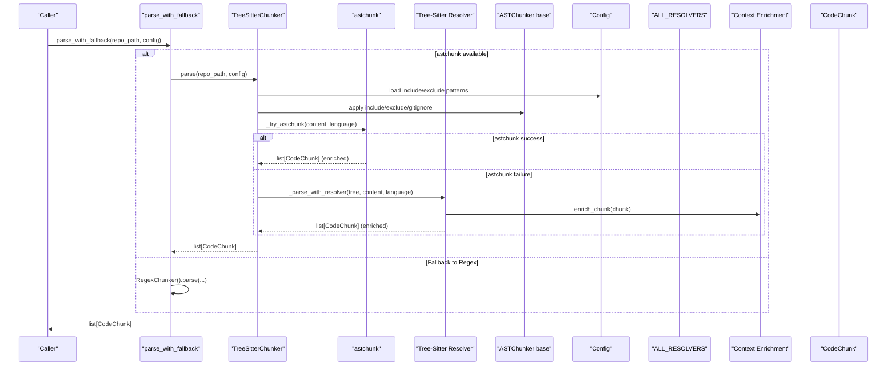
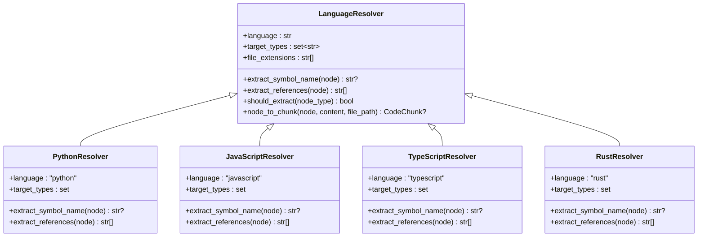
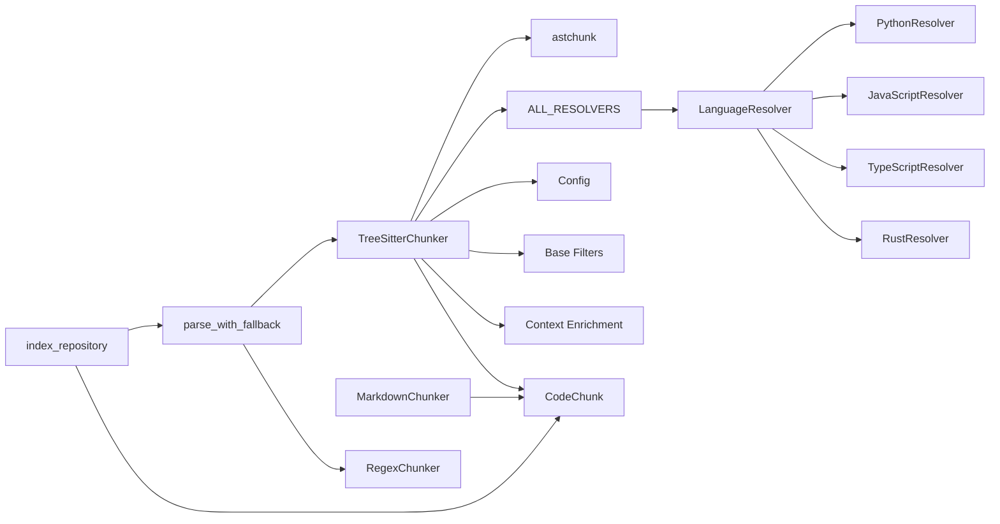

# AST Chunking Core

<cite>
**Referenced Files in This Document**
- [tree_sitter.py](file://src/ws_ctx_engine/chunker/tree_sitter.py)
- [base.py](file://src/ws_ctx_engine/chunker/base.py)
- [enrichment.py](file://src/ws_ctx_engine/chunker/enrichment.py)
- [markdown.py](file://src/ws_ctx_engine/chunker/markdown.py)
- [resolvers/base.py](file://src/ws_ctx_engine/chunker/resolvers/base.py)
- [resolvers/python.py](file://src/ws_ctx_engine/chunker/resolvers/python.py)
- [resolvers/javascript.py](file://src/ws_ctx_engine/chunker/resolvers/javascript.py)
- [resolvers/typescript.py](file://src/ws_ctx_engine/chunker/resolvers/typescript.py)
- [resolvers/rust.py](file://src/ws_ctx_engine/chunker/resolvers/rust.py)
- [resolvers/__init__.py](file://src/ws_ctx_engine/chunker/resolvers/__init__.py)
- [__init__.py](file://src/ws_ctx_engine/chunker/__init__.py)
- [config.py](file://src/ws_ctx_engine/config/config.py)
- [models.py](file://src/ws_ctx_engine/models/models.py)
- [indexer.py](file://src/ws_ctx_engine/workflow/indexer.py)
- [test_tree_sitter_chunker.py](file://tests/unit/test_tree_sitter_chunker.py)
- [test_ast_chunker.py](file://tests/unit/test_ast_chunker.py)
- [test_ast_chunker_upgrade.py](file://tests/unit/test_ast_chunker_upgrade.py)
</cite>

## Update Summary
**Changes Made**
- Updated to reflect astchunk as primary parser with tree-sitter fallback architecture
- Added dual-path parsing approach for supported languages (Python, TypeScript, JavaScript)
- Enhanced context enrichment with structured header comments
- Implemented intelligent chunk size optimization with astchunk integration
- Unified architecture for Markdown parsing and enriched chunk processing
- Added sophisticated symbol extraction and import tracking capabilities

## Table of Contents
1. [Introduction](#introduction)
2. [Project Structure](#project-structure)
3. [Core Components](#core-components)
4. [Architecture Overview](#architecture-overview)
5. [Detailed Component Analysis](#detailed-component-analysis)
6. [Dependency Analysis](#dependency-analysis)
7. [Performance Considerations](#performance-considerations)
8. [Troubleshooting Guide](#troubleshooting-guide)
9. [Conclusion](#conclusion)

## Introduction
This document explains the AST chunking core system that parses source code using a hybrid approach combining astchunk as the primary parser with tree-sitter as a fallback. The system implements dual-path parsing for supported languages, extracts meaningful code chunks per language, and integrates with the broader indexing pipeline. It covers the ASTChunker base class interface, file inclusion/exclusion logic, INDEXED_EXTENSIONS configuration, gitignore pattern processing, fallback mechanisms for unsupported file types, the astchunk integration workflow, sophisticated symbol extraction algorithms, intelligent chunk size optimization strategies, examples of AST parsing across languages, performance considerations for large codebases, and robust error handling for malformed syntax.

## Project Structure
The AST chunking core resides in the chunker module and integrates with configuration, models, and the indexing workflow. The system now features a unified architecture with astchunk as the primary parser and tree-sitter as a fallback.



**Diagram sources**
- [tree_sitter.py:172-443](file://src/ws_ctx_engine/chunker/tree_sitter.py#L172-L443)
- [base.py:41-176](file://src/ws_ctx_engine/chunker/base.py#L41-L176)
- [enrichment.py:21-40](file://src/ws_ctx_engine/chunker/enrichment.py#L21-L40)
- [markdown.py:13-100](file://src/ws_ctx_engine/chunker/markdown.py#L13-L100)
- [resolvers/__init__.py:9-28](file://src/ws_ctx_engine/chunker/resolvers/__init__.py#L9-L28)
- [resolvers/base.py:7-81](file://src/ws_ctx_engine/chunker/resolvers/base.py#L7-L81)
- [__init__.py:18-57](file://src/ws_ctx_engine/chunker/__init__.py#L18-L57)
- [models.py:10-152](file://src/ws_ctx_engine/models/models.py#L10-L152)

**Section sources**
- [tree_sitter.py:172-443](file://src/ws_ctx_engine/chunker/tree_sitter.py#L172-L443)
- [base.py:26-176](file://src/ws_ctx_engine/chunker/base.py#L26-L176)
- [enrichment.py:1-40](file://src/ws_ctx_engine/chunker/enrichment.py#L1-L40)
- [markdown.py:1-100](file://src/ws_ctx_engine/chunker/markdown.py#L1-L100)
- [resolvers/__init__.py:1-28](file://src/ws_ctx_engine/chunker/resolvers/__init__.py#L1-L28)
- [__init__.py:1-57](file://src/ws_ctx_engine/chunker/__init__.py#L1-L57)
- [models.py:10-152](file://src/ws_ctx_engine/models/models.py#L10-L152)

## Core Components
- **ASTChunker**: Abstract base class defining the parse contract for AST-based chunkers.
- **TreeSitterChunker**: Implements hybrid AST parsing using astchunk as primary parser with tree-sitter as fallback, featuring dual-path parsing approach.
- **Context Enrichment**: Adds structured header comments to chunks for improved context understanding.
- **MarkdownChunker**: Unified architecture for Markdown parsing with heading-based splitting.
- **LanguageResolver**: Abstract base for language-specific symbol extraction and chunk conversion.
- **Resolvers**: Concrete resolvers for Python, JavaScript, TypeScript, and Rust.
- **Base filtering utilities**: INDEXED_EXTENSIONS, gitignore processing, include/exclude logic, and warnings for unsupported extensions.
- **Enhanced fallback mechanism**: parse_with_fallback automatically falls back to RegexChunker when astchunk/tree-sitter are unavailable or fail.
- **Integration with Config and CodeChunk models, and the indexing workflow.**

**Section sources**
- [base.py:41-176](file://src/ws_ctx_engine/chunker/base.py#L41-L176)
- [tree_sitter.py:172-443](file://src/ws_ctx_engine/chunker/tree_sitter.py#L172-L443)
- [enrichment.py:1-40](file://src/ws_ctx_engine/chunker/enrichment.py#L1-L40)
- [markdown.py:1-100](file://src/ws_ctx_engine/chunker/markdown.py#L1-L100)
- [resolvers/base.py:7-81](file://src/ws_ctx_engine/chunker/resolvers/base.py#L7-L81)
- [__init__.py:18-57](file://src/ws_ctx_engine/chunker/__init__.py#L18-L57)
- [models.py:10-152](file://src/ws_ctx_engine/models/models.py#L10-L152)

## Architecture Overview
The AST chunking pipeline now features a sophisticated hybrid approach:
- Loads configuration and initializes TreeSitterChunker with astchunk as primary parser.
- Discovers files by extension and applies include/exclude/gitignore rules.
- **Primary Path**: Uses astchunk for languages with native support (Python, TypeScript, JavaScript, Java, C#).
- **Fallback Path**: Uses tree-sitter resolver for languages without native astchunk support (Rust, and any language astchunk fails on).
- **Unified Markdown Processing**: Separate MarkdownChunker handles Markdown files with heading-based splitting.
- Converts AST nodes to CodeChunk instances via resolvers with context enrichment.
- Aggregates chunks and enriches them with file-level imports and structured headers.
- Integrates with the indexing workflow for vector index and graph construction.



**Diagram sources**
- [__init__.py:18-39](file://src/ws_ctx_engine/chunker/__init__.py#L18-L39)
- [tree_sitter.py:265-396](file://src/ws_ctx_engine/chunker/tree_sitter.py#L265-L396)
- [tree_sitter.py:354-396](file://src/ws_ctx_engine/chunker/tree_sitter.py#L354-L396)
- [tree_sitter.py:346-353](file://src/ws_ctx_engine/chunker/tree_sitter.py#L346-L353)
- [enrichment.py:21-40](file://src/ws_ctx_engine/chunker/enrichment.py#L21-L40)
- [base.py:118-176](file://src/ws_ctx_engine/chunker/base.py#L118-L176)
- [resolvers/__init__.py:9-28](file://src/ws_ctx_engine/chunker/resolvers/__init__.py#L9-L28)
- [models.py:10-152](file://src/ws_ctx_engine/models/models.py#L10-L152)

## Detailed Component Analysis

### ASTChunker Base Interface
- Defines the parse contract for AST-based chunkers.
- Provides shared filtering utilities:
  - **INDEXED_EXTENSIONS**: set of extensions with full AST support (limited to .py, .js, .ts, .jsx, .tsx, .rs).
  - collect_gitignore_patterns, build_ignore_spec, get_files_to_include: gitignore processing.
  - _should_include_file: priority-based include/exclude logic with gitignore support.
  - _match_pattern: supports **, **/, and ** patterns.
  - warn_non_indexed_extension: logs warnings for unsupported extensions.

**Section sources**
- [base.py:41-176](file://src/ws_ctx_engine/chunker/base.py#L41-L176)

### TreeSitterChunker Implementation
- **Hybrid Dual-Path Architecture**: Uses astchunk as primary parser with tree-sitter as fallback.
- **Language Mapping**: Maps internal language names to astchunk language names with _ASTCHUNK_LANG_MAP.
- **Intelligent Chunk Size Optimization**: Uses _ASTCHUNK_MAX_CHUNK_SIZE (1500 characters) for astchunk path.
- **Enhanced Import Tracking**: Extracts file-level imports and augments each chunk's symbols_referenced.
- **Smart Fallback Logic**: 
  - Languages without bundled tree-sitter grammar (Java, C#) use astchunk exclusively.
  - For astchunk-supported languages, tries astchunk first, falls back to resolver path.
  - Rust always uses resolver path regardless of astchunk availability.
- **Context Enrichment**: Automatically adds structured header comments to all chunks.

Key behaviors:
- **astchunk Integration**: Attempts astchunk for Python, TypeScript, JavaScript, Java, C# languages.
- **Tree-Sitter Fallback**: Uses resolver-based extraction for languages without astchunk support.
- **Import Extraction**: Traverses AST nodes of known import statement types for accurate tracking.
- **Definition Extraction**: Delegates to resolvers based on node types with enhanced symbol collection.
- **Error Handling**: Graceful fallback with detailed logging for debugging.

**Updated** Enhanced with astchunk integration and dual-path parsing approach

**Section sources**
- [tree_sitter.py:172-443](file://src/ws_ctx_engine/chunker/tree_sitter.py#L172-L443)
- [tree_sitter.py:18-28](file://src/ws_ctx_engine/chunker/tree_sitter.py#L18-L28)
- [tree_sitter.py:30-33](file://src/ws_ctx_engine/chunker/tree_sitter.py#L30-L33)
- [tree_sitter.py:354-396](file://src/ws_ctx_engine/chunker/tree_sitter.py#L354-L396)
- [tree_sitter.py:346-353](file://src/ws_ctx_engine/chunker/tree_sitter.py#L346-L353)

### Context Enrichment System
- **Structured Header Comments**: Adds standardized header blocks to the top of each chunk.
- **Header Format**: Includes file path, language type, and line range information.
- **Immutability**: Creates new CodeChunk instances without mutating originals.
- **Integration**: Applied automatically during both astchunk and tree-sitter parsing paths.

Header format:
```
# File: src/auth.py
# Type: python
# Lines: 10-25

def authenticate(user): ...
```

**Section sources**
- [enrichment.py:1-40](file://src/ws_ctx_engine/chunker/enrichment.py#L1-L40)

### MarkdownChunker Architecture
- **Unified Markdown Processing**: Separate chunker for Markdown files with heading-based splitting.
- **Heading Detection**: Uses ATX heading patterns (#) to determine chunk boundaries.
- **Fallback Handling**: Single chunk for files with no headings.
- **Line Number Accuracy**: Maintains precise line number tracking for Markdown content.
- **Language Classification**: Treats Markdown as "markdown" language for downstream processing.

**Section sources**
- [markdown.py:13-100](file://src/ws_ctx_engine/chunker/markdown.py#L13-L100)

### LanguageResolver and Concrete Resolvers
- **LanguageResolver** defines:
  - language and target_types for AST node types to extract.
  - extract_symbol_name and extract_references.
  - node_to_chunk: converts an AST node to a CodeChunk with start/end lines, content slice, symbols_defined, and symbols_referenced.
- **PythonResolver**: targets function/class definitions, decorated definitions, and type aliases; collects identifiers for references.
- **JavaScriptResolver**: targets function/class declarations, method definitions, lexical declarations, JSX elements, export statements, and generator functions.
- **TypeScriptResolver**: extends JS with interfaces, type aliases, enums, abstract classes, internal modules, and JSX.
- **RustResolver**: targets functions, structs, traits, impl blocks, enums, const/static/type/items, unions, and signatures.



**Diagram sources**
- [resolvers/base.py:7-81](file://src/ws_ctx_engine/chunker/resolvers/base.py#L7-L81)
- [resolvers/python.py:6-109](file://src/ws_ctx_engine/chunker/resolvers/python.py#L6-L109)
- [resolvers/javascript.py:6-113](file://src/ws_ctx_engine/chunker/resolvers/javascript.py#L6-L113)
- [resolvers/typescript.py:6-103](file://src/ws_ctx_engine/chunker/resolvers/typescript.py#L6-L103)
- [resolvers/rust.py:6-55](file://src/ws_ctx_engine/chunker/resolvers/rust.py#L6-L55)

**Section sources**
- [resolvers/base.py:7-81](file://src/ws_ctx_engine/chunker/resolvers/base.py#L7-L81)
- [resolvers/python.py:6-109](file://src/ws_ctx_engine/chunker/resolvers/python.py#L6-L109)
- [resolvers/javascript.py:6-113](file://src/ws_ctx_engine/chunker/resolvers/javascript.py#L6-L113)
- [resolvers/typescript.py:6-103](file://src/ws_ctx_engine/chunker/resolvers/typescript.py#L6-L103)
- [resolvers/rust.py:6-55](file://src/ws_ctx_engine/chunker/resolvers/rust.py#L6-L55)

### File Inclusion/Exclusion and Gitignore Processing
- **INDEXED_EXTENSIONS**: restricts AST parsing to supported extensions (.py, .js, .ts, .jsx, .tsx, .rs).
- collect_gitignore_patterns: discovers .gitignore recursively and scopes patterns to subdirectories.
- build_ignore_spec: constructs a GitIgnoreSpec using pathspec; falls back to fnmatch if unavailable.
- _should_include_file: precedence order:
  1) gitignore_spec match (if provided),
  2) explicit exclude_patterns,
  3) include_patterns.
- warn_non_indexed_extension: logs a warning for unsupported extensions.


**Diagram sources**
- [base.py:47-176](file://src/ws_ctx_engine/chunker/base.py#L47-L176)

**Section sources**
- [base.py:26-176](file://src/ws_ctx_engine/chunker/base.py#L26-L176)

### Enhanced Fallback Mechanism for Unsupported File Types
- **parse_with_fallback**: Attempts TreeSitterChunker first; logs and falls back to RegexChunker on ImportError or general exception.
- **astchunk Integration**: When available, Python and TypeScript files use astchunk for splitting; JavaScript files route through astchunk; Rust files use resolver path.
- **Graceful Degradation**: Comprehensive error handling with detailed logging for debugging.
- **Fallback Languages**: JavaScript and Rust always use resolver path regardless of astchunk availability.

**Updated** Enhanced with astchunk integration and dual-path parsing logic

**Section sources**
- [__init__.py:18-39](file://src/ws_ctx_engine/chunker/__init__.py#L18-L39)
- [test_ast_chunker_upgrade.py:204-248](file://tests/unit/test_ast_chunker_upgrade.py#L204-L248)

### Integration with the Indexing Pipeline
- **index_repository**: orchestrates the index phase:
  - Parses codebase using parse_with_fallback with enhanced hybrid approach.
  - Builds vector index and graph (with optional incremental updates).
  - Saves metadata for staleness detection and domain keyword map.
- **CodeChunk**: provides token_count and serialization helpers used downstream.
- **Context Enrichment**: Automatic header injection improves downstream processing quality.

**Section sources**
- [indexer.py:72-371](file://src/ws_ctx_engine/workflow/indexer.py#L72-L371)
- [models.py:10-152](file://src/ws_ctx_engine/models/models.py#L10-L152)

## Dependency Analysis
- **TreeSitterChunker** depends on:
  - **astchunk**: Primary parser for supported languages with intelligent fallback.
  - **LanguageResolver implementations** via ALL_RESOLVERS for fallback path.
  - **Config** for include/exclude patterns.
  - **Base filtering utilities** for include/exclude/gitignore.
  - **Context Enrichment** for structured header comments.
  - **CodeChunk model** for output.
- **Resolvers** depend on LanguageResolver base and AST node traversal.
- **MarkdownChunker** provides unified architecture for Markdown processing.
- **parse_with_fallback** bridges TreeSitterChunker and RegexChunker.
- **index_repository** consumes CodeChunk outputs and drives downstream systems.



**Diagram sources**
- [tree_sitter.py:172-443](file://src/ws_ctx_engine/chunker/tree_sitter.py#L172-L443)
- [tree_sitter.py:354-396](file://src/ws_ctx_engine/chunker/tree_sitter.py#L354-L396)
- [resolvers/__init__.py:9-28](file://src/ws_ctx_engine/chunker/resolvers/__init__.py#L9-L28)
- [base.py:41-176](file://src/ws_ctx_engine/chunker/base.py#L41-L176)
- [enrichment.py:21-40](file://src/ws_ctx_engine/chunker/enrichment.py#L21-L40)
- [markdown.py:13-100](file://src/ws_ctx_engine/chunker/markdown.py#L13-L100)
- [models.py:10-152](file://src/ws_ctx_engine/models/models.py#L10-L152)
- [__init__.py:18-39](file://src/ws_ctx_engine/chunker/__init__.py#L18-L39)
- [indexer.py:72-371](file://src/ws_ctx_engine/workflow/indexer.py#L72-L371)

**Section sources**
- [tree_sitter.py:172-443](file://src/ws_ctx_engine/chunker/tree_sitter.py#L172-L443)
- [resolvers/__init__.py:9-28](file://src/ws_ctx_engine/chunker/resolvers/__init__.py#L9-L28)
- [base.py:41-176](file://src/ws_ctx_engine/chunker/base.py#L41-L176)
- [enrichment.py:1-40](file://src/ws_ctx_engine/chunker/enrichment.py#L1-L40)
- [markdown.py:1-100](file://src/ws_ctx_engine/chunker/markdown.py#L1-L100)
- [__init__.py:18-39](file://src/ws_ctx_engine/chunker/__init__.py#L18-L39)
- [indexer.py:72-371](file://src/ws_ctx_engine/workflow/indexer.py#L72-L371)

## Performance Considerations
- **Large codebases**:
  - **astchunk Optimization**: Uses intelligent chunk size limits (1500 characters) for optimal token density.
  - **Dual-Path Efficiency**: Primary astchunk path for supported languages provides superior parsing performance.
  - **Memory Optimization**: Context enrichment creates new objects without mutation overhead.
  - **Incremental Indexing**: Respects gitignore and include/exclude patterns to minimize IO.
- **Language-Specific Optimizations**:
  - **astchunk Languages**: Python, TypeScript, JavaScript, Java, C# handled by primary parser.
  - **Tree-Sitter Fallback**: Rust and languages without astchunk support use resolver path.
  - **Markdown Processing**: Unified architecture with heading-based splitting.
- **Token Budget Management**:
  - **CodeChunk.token_count**: Helps estimate token usage for downstream processing.
  - **Chunk Size Limits**: Automatic splitting prevents oversized chunks.
- **Parallelization**: 
  - **Future Enhancement**: max_workers reserved for parallel processing.
  - **Current Focus**: Safe fallbacks and enhanced chunk quality.

**Updated** Enhanced with astchunk integration and dual-path performance optimizations

## Troubleshooting Guide
Common issues and remedies:
- **Missing astchunk dependencies**:
  - ImportError during astchunk initialization indicates missing packages; install astchunk separately.
- **astchunk Language Support**:
  - Languages not in _ASTCHUNK_LANG_MAP fall back to tree-sitter resolver path automatically.
- **Unsupported file extensions**:
  - warn_non_indexed_extension logs warnings for extensions outside INDEXED_EXTENSIONS; these files are indexed as plain text.
- **Malformed syntax**:
  - Enhanced error handling with detailed logging; individual file failures are logged and skipped.
- **Gitignore discrepancies**:
  - If pathspec is unavailable, build_ignore_spec falls back to fnmatch; expect less precise semantics.
- **Context Enrichment Issues**:
  - Structured header comments are automatically applied; verify chunk.content format for debugging.

**Updated** Enhanced with astchunk-specific troubleshooting and dual-path parsing considerations

**Section sources**
- [tree_sitter.py:182-194](file://src/ws_ctx_engine/chunker/tree_sitter.py#L182-L194)
- [tree_sitter.py:362-377](file://src/ws_ctx_engine/chunker/tree_sitter.py#L362-L377)
- [base.py:106-115](file://src/ws_ctx_engine/chunker/base.py#L106-L115)
- [base.py:82-92](file://src/ws_ctx_engine/chunker/base.py#L82-L92)
- [enrichment.py:21-40](file://src/ws_ctx_engine/chunker/enrichment.py#L21-L40)

## Conclusion
The AST chunking core leverages a sophisticated hybrid approach using astchunk as the primary parser with tree-sitter as a reliable fallback. The dual-path parsing architecture provides optimal performance for supported languages while maintaining robust fallback capabilities. Enhanced context enrichment with structured header comments improves downstream processing quality, while intelligent chunk size optimization ensures optimal token density. The unified Markdown processing architecture complements the code chunking system, and the modular resolver architecture enables extensible symbol extraction across Python, JavaScript, TypeScript, and Rust. Integrated with the indexing pipeline, it supports incremental updates, deduplication, and efficient token budgeting, while gracefully handling unsupported files and malformed syntax through comprehensive error handling and fallback mechanisms.