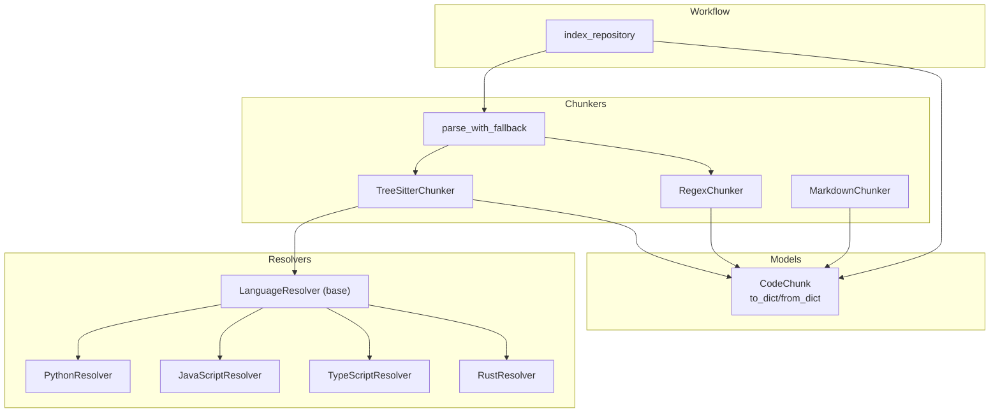
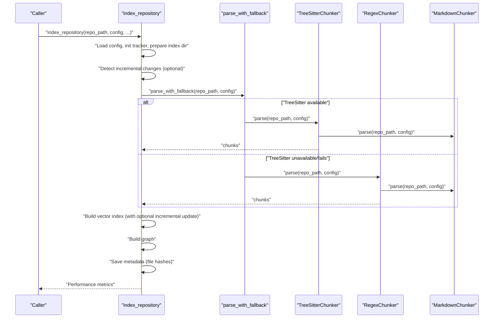
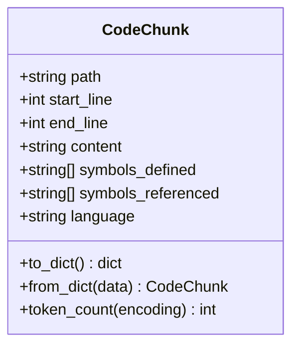
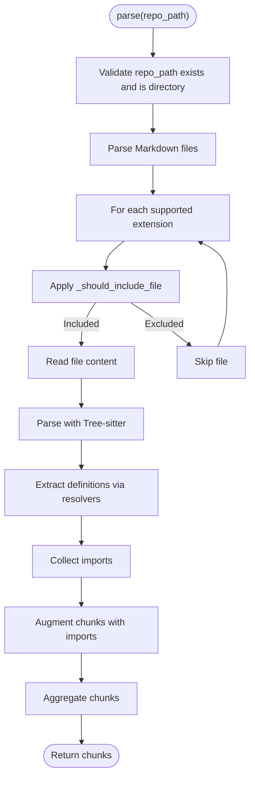
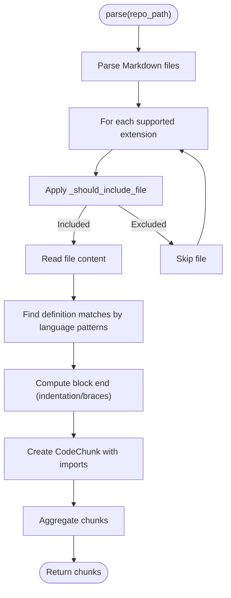
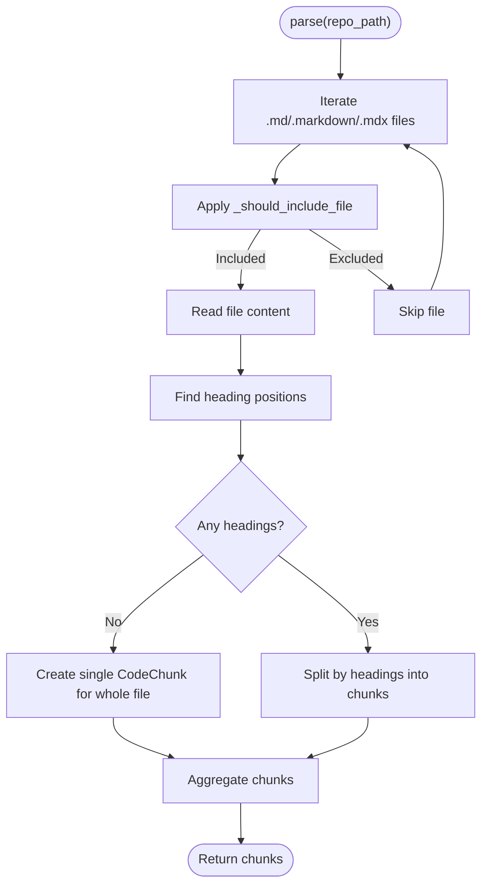
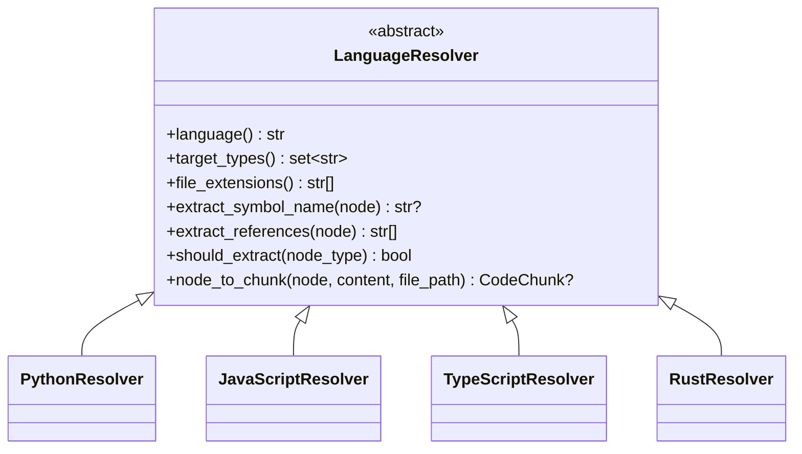
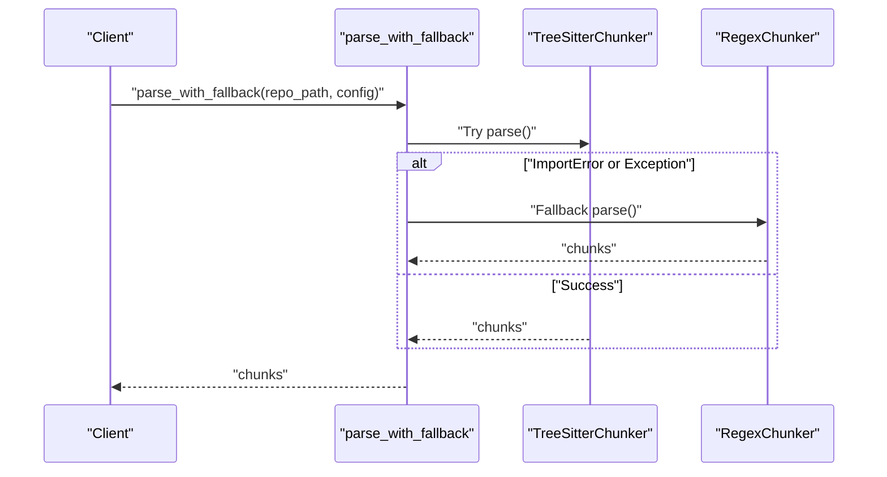
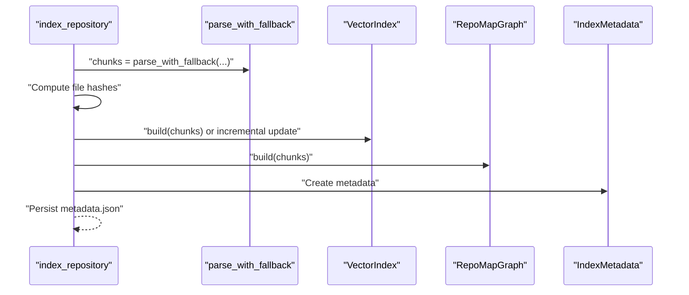
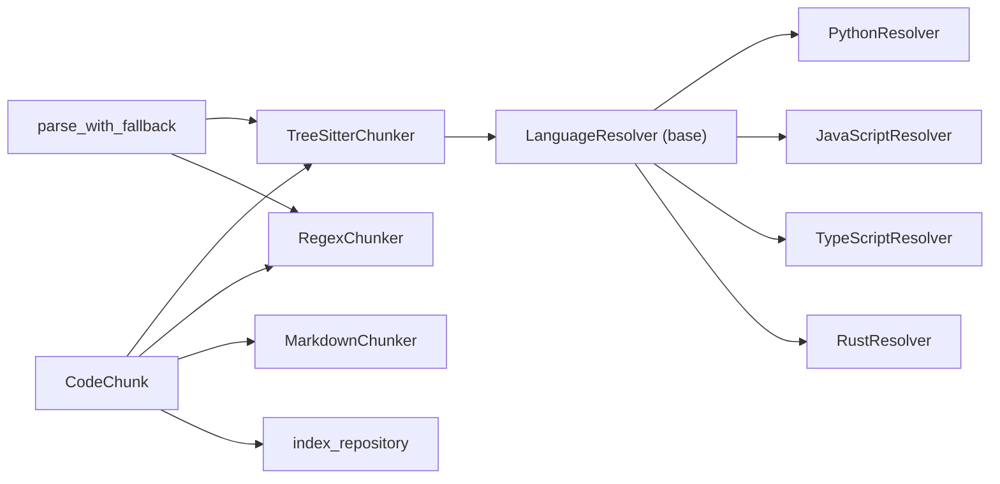

# Chunk Management & Processing

<cite>
**Referenced Files in This Document**
- [models.py](file://src/ws_ctx_engine/models/models.py)
- [base.py](file://src/ws_ctx_engine/chunker/base.py)
- [tree_sitter.py](file://src/ws_ctx_engine/chunker/tree_sitter.py)
- [regex.py](file://src/ws_ctx_engine/chunker/regex.py)
- [markdown.py](file://src/ws_ctx_engine/chunker/markdown.py)
- [__init__.py](file://src/ws_ctx_engine/chunker/__init__.py)
- [base.py](file://src/ws_ctx_engine/chunker/resolvers/base.py)
- [python.py](file://src/ws_ctx_engine/chunker/resolvers/python.py)
- [javascript.py](file://src/ws_ctx_engine/chunker/resolvers/javascript.py)
- [typescript.py](file://src/ws_ctx_engine/chunker/resolvers/typescript.py)
- [rust.py](file://src/ws_ctx_engine/chunker/resolvers/rust.py)
- [indexer.py](file://src/ws_ctx_engine/workflow/indexer.py)
- [dedup_cache.py](file://src/ws_ctx_engine/session/dedup_cache.py)
</cite>

## Table of Contents
1. [Introduction](#introduction)
2. [Project Structure](#project-structure)
3. [Core Components](#core-components)
4. [Architecture Overview](#architecture-overview)
5. [Detailed Component Analysis](#detailed-component-analysis)
6. [Dependency Analysis](#dependency-analysis)
7. [Performance Considerations](#performance-considerations)
8. [Troubleshooting Guide](#troubleshooting-guide)
9. [Conclusion](#conclusion)
10. [Appendices](#appendices)

## Introduction
This document explains the chunk management and processing workflows in the repository. It focuses on the CodeChunk data model, chunk metadata handling, content organization strategies, aggregation, duplicate detection, size optimization, integration with the indexing pipeline, validation and error handling, serialization/deserialization, and practical guidance for performance and debugging.

## Project Structure
The chunking subsystem centers around a shared CodeChunk model and multiple chunkers that extract logical units from source files. A fallback mechanism selects TreeSitter-based parsing when available, otherwise falls back to regex-based parsing. Markdown files are chunked by headings. Language-specific resolvers convert AST nodes into CodeChunk instances.

**Diagram sources**
- [models.py:10-84](file://src/ws_ctx_engine/models/models.py#L10-L84)
- [tree_sitter.py:15-160](file://src/ws_ctx_engine/chunker/tree_sitter.py#L15-L160)
- [regex.py:15-219](file://src/ws_ctx_engine/chunker/regex.py#L15-L219)
- [markdown.py:13-100](file://src/ws_ctx_engine/chunker/markdown.py#L13-L100)
- [__init__.py:17-37](file://src/ws_ctx_engine/chunker/__init__.py#L17-L37)
- [base.py:41-176](file://src/ws_ctx_engine/chunker/base.py#L41-L176)
- [python.py:6-61](file://src/ws_ctx_engine/chunker/resolvers/python.py#L6-L61)
- [javascript.py:6-85](file://src/ws_ctx_engine/chunker/resolvers/javascript.py#L6-L85)
- [typescript.py:6-103](file://src/ws_ctx_engine/chunker/resolvers/typescript.py#L6-L103)
- [rust.py:6-55](file://src/ws_ctx_engine/chunker/resolvers/rust.py#L6-L55)
- [indexer.py:72-371](file://src/ws_ctx_engine/workflow/indexer.py#L72-L371)

**Section sources**
- [models.py:10-84](file://src/ws_ctx_engine/models/models.py#L10-L84)
- [base.py:41-176](file://src/ws_ctx_engine/chunker/base.py#L41-L176)
- [tree_sitter.py:15-160](file://src/ws_ctx_engine/chunker/tree_sitter.py#L15-L160)
- [regex.py:15-219](file://src/ws_ctx_engine/chunker/regex.py#L15-L219)
- [markdown.py:13-100](file://src/ws_ctx_engine/chunker/markdown.py#L13-L100)
- [__init__.py:17-37](file://src/ws_ctx_engine/chunker/__init__.py#L17-L37)
- [indexer.py:72-371](file://src/ws_ctx_engine/workflow/indexer.py#L72-L371)

## Core Components
- CodeChunk: The canonical representation of a code segment with path, line range, content, defined and referenced symbols, and language. It supports serialization to a dictionary and deserialization from it, enabling incremental caching and persistence.
- Chunkers:
  - TreeSitterChunker: Uses language-specific parsers and resolvers to extract logical constructs from supported languages, augmenting chunks with imports.
  - RegexChunker: Fallback that detects definitions and blocks using language-specific regex patterns.
  - MarkdownChunker: Splits Markdown files into chunks per heading; if none, returns a single-chunk file.
- Resolvers: Language-specific adapters that map AST node types to symbol names and references, and produce CodeChunk instances.
- Fallback orchestration: parse_with_fallback chooses TreeSitterChunker when available, otherwise falls back to RegexChunker.

Key responsibilities:
- Metadata handling: path, start/end lines, language, symbols_defined, symbols_referenced.
- Content organization: AST-driven for supported languages; regex-based for others; heading-based for Markdown.
- Validation and error handling: graceful warnings on read failures and unsupported extensions; robust fallbacks.

**Section sources**
- [models.py:10-84](file://src/ws_ctx_engine/models/models.py#L10-L84)
- [tree_sitter.py:15-160](file://src/ws_ctx_engine/chunker/tree_sitter.py#L15-L160)
- [regex.py:15-219](file://src/ws_ctx_engine/chunker/regex.py#L15-L219)
- [markdown.py:13-100](file://src/ws_ctx_engine/chunker/markdown.py#L13-L100)
- [base.py:41-176](file://src/ws_ctx_engine/chunker/base.py#L41-L176)
- [__init__.py:17-37](file://src/ws_ctx_engine/chunker/__init__.py#L17-L37)

## Architecture Overview
The indexing pipeline integrates chunking as its first phase. It parses the repository into CodeChunk objects, optionally performs incremental updates, and proceeds to build vector and graph indexes, saving metadata for staleness detection.

**Diagram sources**
- [indexer.py:72-371](file://src/ws_ctx_engine/workflow/indexer.py#L72-L371)
- [__init__.py:17-37](file://src/ws_ctx_engine/chunker/__init__.py#L17-L37)
- [tree_sitter.py:57-89](file://src/ws_ctx_engine/chunker/tree_sitter.py#L57-L89)
- [regex.py:75-105](file://src/ws_ctx_engine/chunker/regex.py#L75-L105)
- [markdown.py:23-48](file://src/ws_ctx_engine/chunker/markdown.py#L23-L48)

## Detailed Component Analysis

### CodeChunk Data Model
CodeChunk encapsulates a logical unit of source code with associated metadata. It supports:
- Serialization: to_dict for JSON-compatible storage and caching.
- Deserialization: from_dict to reconstruct instances.
- Token counting: token_count(encoding) using a tokenizer to estimate prompt costs.

**Diagram sources**
- [models.py:10-84](file://src/ws_ctx_engine/models/models.py#L10-L84)

**Section sources**
- [models.py:10-84](file://src/ws_ctx_engine/models/models.py#L10-L84)

### TreeSitterChunker
TreeSitterChunker leverages language-specific parsers and resolvers to extract definitions and compute imports. It:
- Initializes parsers for supported languages.
- Walks the repository for supported extensions.
- Applies inclusion/exclusion filters.
- Extracts imports and augments chunks with referenced symbols.
- Aggregates chunks from Markdown and language-specific files.

**Diagram sources**
- [tree_sitter.py:57-114](file://src/ws_ctx_engine/chunker/tree_sitter.py#L57-L114)
- [base.py:118-156](file://src/ws_ctx_engine/chunker/base.py#L118-L156)

**Section sources**
- [tree_sitter.py:15-160](file://src/ws_ctx_engine/chunker/tree_sitter.py#L15-L160)
- [base.py:118-156](file://src/ws_ctx_engine/chunker/base.py#L118-L156)

### RegexChunker
RegexChunker serves as a fallback, scanning files with language-specific patterns to detect definitions and compute block boundaries. It:
- Scans for imports and definitions.
- Determines block endings using indentation (Python) or brace matching (others).
- Produces CodeChunk instances with symbol references.

**Diagram sources**
- [regex.py:75-143](file://src/ws_ctx_engine/chunker/regex.py#L75-L143)
- [base.py:118-156](file://src/ws_ctx_engine/chunker/base.py#L118-L156)

**Section sources**
- [regex.py:15-219](file://src/ws_ctx_engine/chunker/regex.py#L15-L219)

### MarkdownChunker
MarkdownChunker splits Markdown files into chunks bounded by ATX headings. If no headings are present, the entire file becomes a single chunk.

**Diagram sources**
- [markdown.py:23-99](file://src/ws_ctx_engine/chunker/markdown.py#L23-L99)

**Section sources**
- [markdown.py:13-100](file://src/ws_ctx_engine/chunker/markdown.py#L13-L100)

### Language Resolvers
Each resolver defines:
- language identifier
- target AST node types to extract
- symbol name extraction
- references extraction
- conversion to CodeChunk

**Diagram sources**
- [base.py:7-70](file://src/ws_ctx_engine/chunker/resolvers/base.py#L7-L70)
- [python.py:6-61](file://src/ws_ctx_engine/chunker/resolvers/python.py#L6-L61)
- [javascript.py:6-85](file://src/ws_ctx_engine/chunker/resolvers/javascript.py#L6-L85)
- [typescript.py:6-103](file://src/ws_ctx_engine/chunker/resolvers/typescript.py#L6-L103)
- [rust.py:6-55](file://src/ws_ctx_engine/chunker/resolvers/rust.py#L6-L55)

**Section sources**
- [base.py:7-70](file://src/ws_ctx_engine/chunker/resolvers/base.py#L7-L70)
- [python.py:6-61](file://src/ws_ctx_engine/chunker/resolvers/python.py#L6-L61)
- [javascript.py:6-85](file://src/ws_ctx_engine/chunker/resolvers/javascript.py#L6-L85)
- [typescript.py:6-103](file://src/ws_ctx_engine/chunker/resolvers/typescript.py#L6-L103)
- [rust.py:6-55](file://src/ws_ctx_engine/chunker/resolvers/rust.py#L6-L55)

### Fallback Orchestration
parse_with_fallback attempts TreeSitterChunker and falls back to RegexChunker if Tree-sitter is unavailable or raises exceptions. It logs informational and warning messages to guide diagnostics.

**Diagram sources**
- [__init__.py:17-37](file://src/ws_ctx_engine/chunker/__init__.py#L17-L37)

**Section sources**
- [__init__.py:17-37](file://src/ws_ctx_engine/chunker/__init__.py#L17-L37)

### Integration with Indexing Pipeline
The indexing pipeline orchestrates chunking and downstream steps:
- Parses repository into CodeChunk list via parse_with_fallback.
- Computes file hashes for staleness detection.
- Builds vector index (with optional incremental update) and graph.
- Persists metadata for future staleness checks.
- Supports domain-only mode to rebuild only keyword mapping.

**Diagram sources**
- [indexer.py:72-371](file://src/ws_ctx_engine/workflow/indexer.py#L72-L371)

**Section sources**
- [indexer.py:72-371](file://src/ws_ctx_engine/workflow/indexer.py#L72-L371)

## Dependency Analysis
- CodeChunk is consumed by all chunkers and used throughout the indexing pipeline for persistence and staleness detection.
- TreeSitterChunker depends on resolvers and MarkdownChunker; RegexChunker depends on MarkdownChunker and language-specific patterns.
- parse_with_fallback coordinates TreeSitterChunker and RegexChunker.
- Indexing pipeline depends on chunkers and uses CodeChunk for hashing and persistence.

**Diagram sources**
- [models.py:10-84](file://src/ws_ctx_engine/models/models.py#L10-L84)
- [tree_sitter.py:15-160](file://src/ws_ctx_engine/chunker/tree_sitter.py#L15-L160)
- [regex.py:15-219](file://src/ws_ctx_engine/chunker/regex.py#L15-L219)
- [markdown.py:13-100](file://src/ws_ctx_engine/chunker/markdown.py#L13-L100)
- [base.py:41-176](file://src/ws_ctx_engine/chunker/base.py#L41-L176)
- [__init__.py:17-37](file://src/ws_ctx_engine/chunker/__init__.py#L17-L37)
- [indexer.py:72-371](file://src/ws_ctx_engine/workflow/indexer.py#L72-L371)

**Section sources**
- [models.py:10-84](file://src/ws_ctx_engine/models/models.py#L10-L84)
- [tree_sitter.py:15-160](file://src/ws_ctx_engine/chunker/tree_sitter.py#L15-L160)
- [regex.py:15-219](file://src/ws_ctx_engine/chunker/regex.py#L15-L219)
- [markdown.py:13-100](file://src/ws_ctx_engine/chunker/markdown.py#L13-L100)
- [base.py:41-176](file://src/ws_ctx_engine/chunker/base.py#L41-L176)
- [__init__.py:17-37](file://src/ws_ctx_engine/chunker/__init__.py#L17-L37)
- [indexer.py:72-371](file://src/ws_ctx_engine/workflow/indexer.py#L72-L371)

## Performance Considerations
- Chunker selection: parse_with_fallback prioritizes TreeSitterChunker for accuracy and speed; RegexChunker remains reliable for unsupported languages or environments.
- Incremental indexing: index_repository computes file hashes and can update only changed/deleted files when embedding cache is enabled, reducing rebuild time.
- Memory tracking: PerformanceTracker records phase durations and memory usage to identify bottlenecks.
- Token estimation: CodeChunk.token_count(encoding) helps estimate prompt sizes for downstream LLM consumption.
- Large repositories: Prefer TreeSitterChunker for supported languages; ensure .gitignore patterns minimize irrelevant files; leverage include/exclude patterns to focus on relevant subsets.

[No sources needed since this section provides general guidance]

## Troubleshooting Guide
Common issues and remedies:
- Missing Tree-sitter dependencies: parse_with_fallback raises an ImportError with installation guidance; ensure py-tree-sitter and language parsers are installed.
- Unsupported file extensions: warn_non_indexed_extension logs a warning indicating the file will be indexed as plain text; add appropriate patterns or use supported extensions.
- Read failures: chunkers log warnings when failing to read files; verify file permissions and encodings.
- Stale indexes: load_indexes detects staleness via IndexMetadata.is_stale; either rebuild automatically or manually trigger index_repository.
- Incremental update failures: index_repository falls back to full rebuild if incremental update fails; check embedding cache and vector index state.
- Session-level duplication: use SessionDeduplicationCache to mark repeated file content with a compact marker, reducing token usage and cost.

**Section sources**
- [tree_sitter.py:26-37](file://src/ws_ctx_engine/chunker/tree_sitter.py#L26-L37)
- [base.py:106-115](file://src/ws_ctx_engine/chunker/base.py#L106-L115)
- [indexer.py:456-467](file://src/ws_ctx_engine/workflow/indexer.py#L456-L467)
- [indexer.py:226-230](file://src/ws_ctx_engine/workflow/indexer.py#L226-L230)
- [dedup_cache.py:35-101](file://src/ws_ctx_engine/session/dedup_cache.py#L35-L101)

## Conclusion
The chunk management system provides a robust, extensible foundation for extracting logical units from codebases and Markdown documents. By combining AST-based parsing with regex fallbacks, maintaining a consistent CodeChunk model, and integrating tightly with the indexing pipeline, it supports scalable indexing, incremental updates, and efficient retrieval. Proper configuration of include/exclude patterns, awareness of unsupported extensions, and leveraging session-level deduplication further improve reliability and performance.

[No sources needed since this section summarizes without analyzing specific files]

## Appendices

### Chunk Serialization and Deserialization
- CodeChunk.to_dict produces a JSON-compatible dictionary suitable for caching and persistence.
- CodeChunk.from_dict reconstructs a CodeChunk from serialized data.
- IndexMetadata supports staleness detection by comparing stored file hashes with current content.

**Section sources**
- [models.py:35-58](file://src/ws_ctx_engine/models/models.py#L35-L58)
- [models.py:108-151](file://src/ws_ctx_engine/models/models.py#L108-L151)

### Chunk Validation and Error Handling
- File inclusion filtering: _should_include_file applies gitignore-style specs, explicit excludes, and include patterns.
- Extension warnings: warn_non_indexed_extension logs warnings for unsupported extensions.
- Robust parsing: chunkers catch exceptions during file reads and parsing, emitting warnings and continuing.

**Section sources**
- [base.py:118-176](file://src/ws_ctx_engine/chunker/base.py#L118-L176)
- [tree_sitter.py:96-100](file://src/ws_ctx_engine/chunker/tree_sitter.py#L96-L100)
- [regex.py:113-116](file://src/ws_ctx_engine/chunker/regex.py#L113-L116)
- [markdown.py:52-55](file://src/ws_ctx_engine/chunker/markdown.py#L52-L55)

### Memory Management Strategies for Large Repositories
- Use TreeSitterChunker for supported languages to reduce overhead.
- Configure include/exclude patterns to limit scanned files.
- Enable incremental indexing to avoid full rebuilds.
- Monitor memory usage via PerformanceTracker to identify hotspots.

**Section sources**
- [indexer.py:114-116](file://src/ws_ctx_engine/workflow/indexer.py#L114-L116)
- [indexer.py:158-173](file://src/ws_ctx_engine/workflow/indexer.py#L158-L173)

### Monitoring Chunk Quality Metrics
- PerformanceTracker tracks phase durations and memory usage during indexing.
- IndexMetadata stores file counts and hashes to assess completeness and staleness.
- Use token_count(encoding) to estimate prompt sizes for downstream systems.

**Section sources**
- [indexer.py:115-116](file://src/ws_ctx_engine/workflow/indexer.py#L115-L116)
- [models.py:60-84](file://src/ws_ctx_engine/models/models.py#L60-L84)