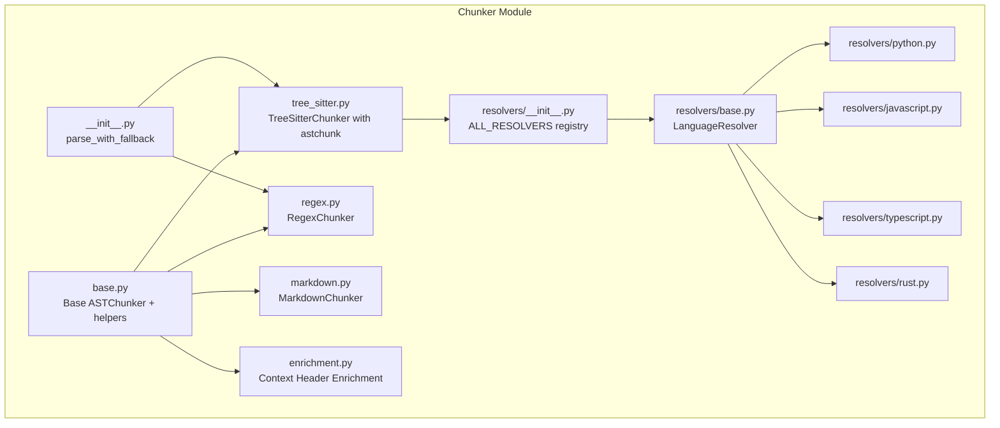
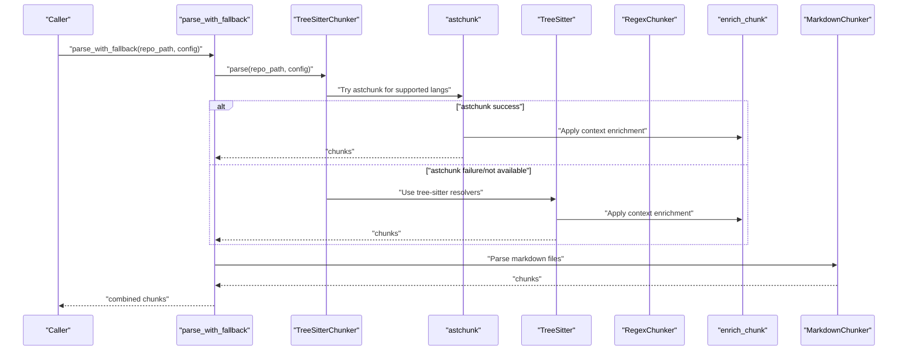
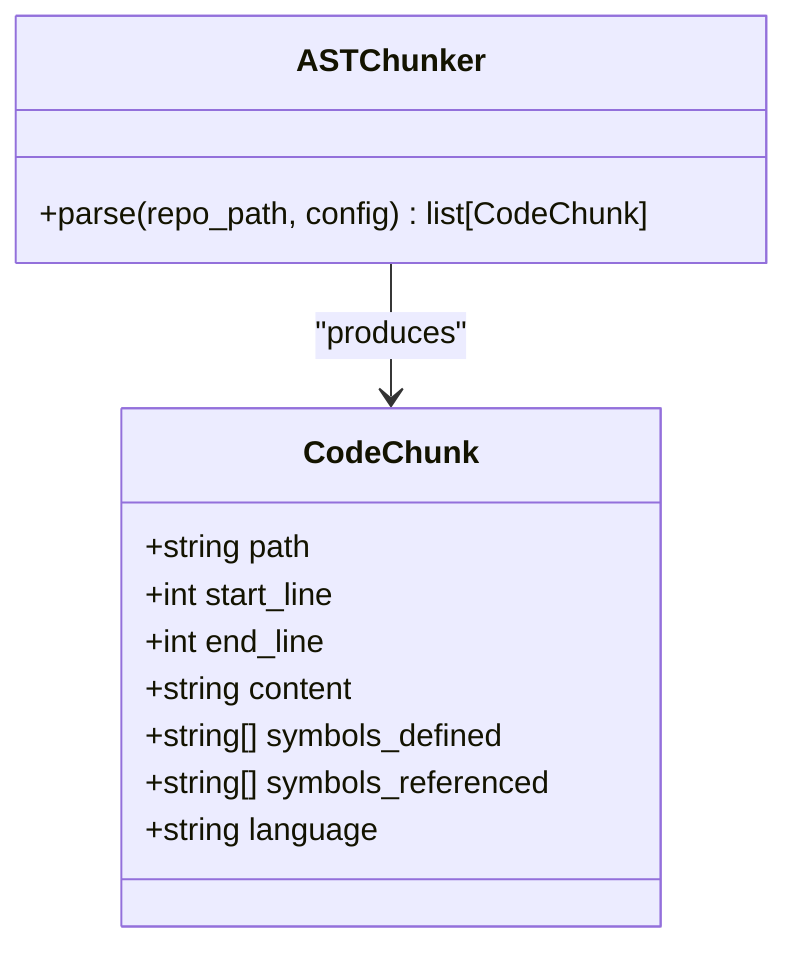
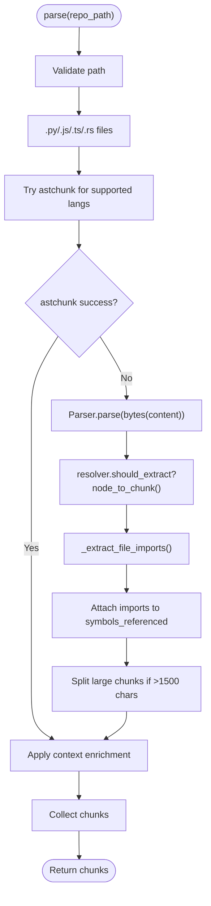
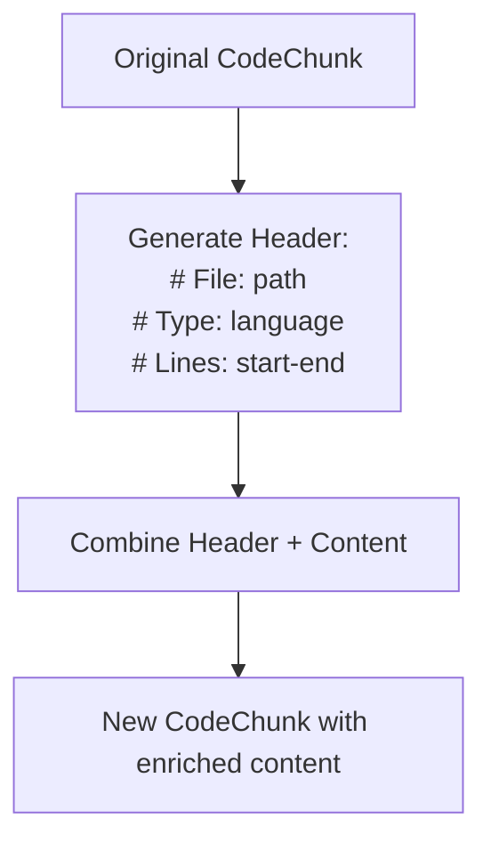
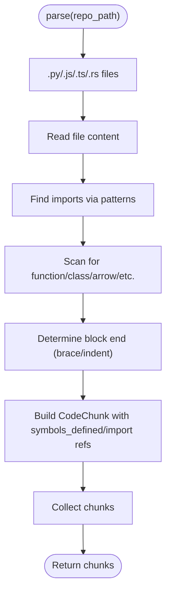
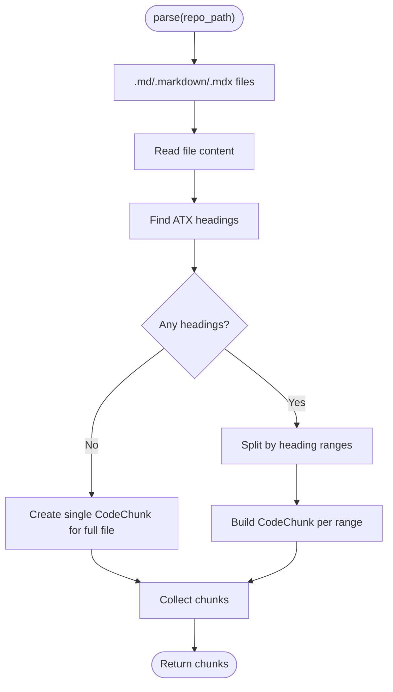
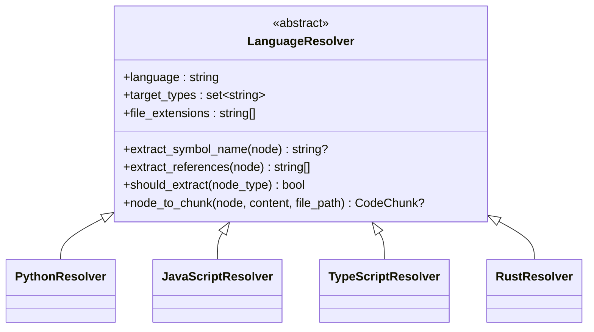
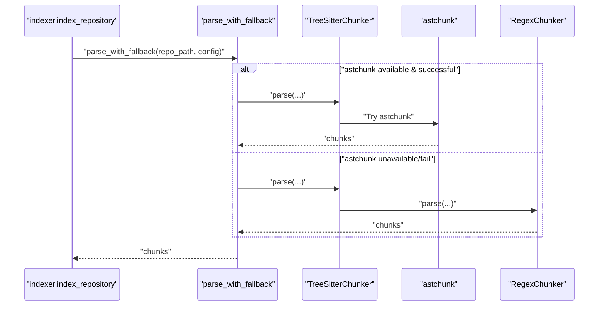
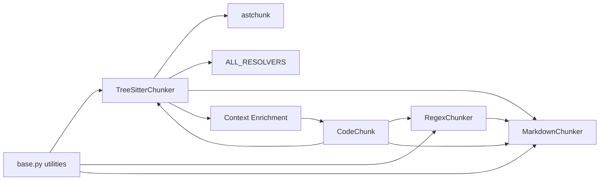

# Chunker System

<cite>
**Referenced Files in This Document**
- [__init__.py](file://src/ws_ctx_engine/chunker/__init__.py)
- [base.py](file://src/ws_ctx_engine/chunker/base.py)
- [tree_sitter.py](file://src/ws_ctx_engine/chunker/tree_sitter.py)
- [markdown.py](file://src/ws_ctx_engine/chunker/markdown.py)
- [regex.py](file://src/ws_ctx_engine/chunker/regex.py)
- [enrichment.py](file://src/ws_ctx_engine/chunker/enrichment.py)
- [resolvers/__init__.py](file://src/ws_ctx_engine/chunker/resolvers/__init__.py)
- [resolvers/base.py](file://src/ws_ctx_engine/chunker/resolvers/base.py)
- [resolvers/python.py](file://src/ws_ctx_engine/chunker/resolvers/python.py)
- [resolvers/javascript.py](file://src/ws_ctx_engine/chunker/resolvers/javascript.py)
- [resolvers/typescript.py](file://src/ws_ctx_engine/chunker/resolvers/typescript.py)
- [resolvers/rust.py](file://src/ws_ctx_engine/chunker/resolvers/rust.py)
- [models.py](file://src/ws_ctx_engine/models/models.py)
- [config.py](file://src/ws_ctx_engine/config/config.py)
- [indexer.py](file://src/ws_ctx_engine/workflow/indexer.py)
</cite>

## Update Summary
**Changes Made**
- Updated to reflect astchunk integration replacing custom tree-sitter implementation
- Added documentation for context enrichment through structured header comments
- Enhanced fallback mechanism documentation for JavaScript and Rust files
- Updated architecture diagrams to show the new dual-path approach (astchunk + tree-sitter)
- Added information about chunk size optimization and content preservation

## Table of Contents
1. [Introduction](#introduction)
2. [Project Structure](#project-structure)
3. [Core Components](#core-components)
4. [Architecture Overview](#architecture-overview)
5. [Detailed Component Analysis](#detailed-component-analysis)
6. [Dependency Analysis](#dependency-analysis)
7. [Performance Considerations](#performance-considerations)
8. [Troubleshooting Guide](#troubleshooting-guide)
9. [Conclusion](#conclusion)
10. [Appendices](#appendices)

## Introduction
This document explains the chunker system that extracts structured, language-aware code segments from repositories for downstream indexing and retrieval. It covers:
- Dual-path AST parsing using astchunk with tree-sitter fallback
- Context enrichment through structured header comments
- Language-specific resolvers for Python, JavaScript, TypeScript, and Rust
- Enhanced fallback mechanisms for unsupported languages
- Markdown chunking strategies
- Base chunker interface and shared utilities
- Resolver pattern for symbol extraction and references
- Integration with the indexing pipeline
- Performance, memory, and chunk overlap considerations

## Project Structure
The chunker system resides under src/ws_ctx_engine/chunker and includes:
- Base abstractions and shared utilities
- Tree-sitter-based AST chunker with astchunk integration
- Regex-based fallback chunker
- Markdown chunker
- Context enrichment system
- Language-specific resolvers (Python, JavaScript, TypeScript, Rust)
- Integration via a convenience function that selects the best available parser

**Diagram sources**
- [base.py:1-176](file://src/ws_ctx_engine/chunker/base.py#L1-L176)
- [tree_sitter.py:1-374](file://src/ws_ctx_engine/chunker/tree_sitter.py#L1-L374)
- [regex.py:1-219](file://src/ws_ctx_engine/chunker/regex.py#L1-L219)
- [markdown.py:1-100](file://src/ws_ctx_engine/chunker/markdown.py#L1-L100)
- [enrichment.py:1-40](file://src/ws_ctx_engine/chunker/enrichment.py#L1-L40)
- [resolvers/__init__.py:1-26](file://src/ws_ctx_engine/chunker/resolvers/__init__.py#L1-L26)
- [resolvers/base.py:1-70](file://src/ws_ctx_engine/chunker/resolvers/base.py#L1-L70)
- [resolvers/python.py:1-93](file://src/ws_ctx_engine/chunker/resolvers/python.py#L1-L93)
- [resolvers/javascript.py:1-109](file://src/ws_ctx_engine/chunker/resolvers/javascript.py#L1-L109)
- [resolvers/typescript.py:1-133](file://src/ws_ctx_engine/chunker/resolvers/typescript.py#L1-L133)
- [resolvers/rust.py:1-108](file://src/ws_ctx_engine/chunker/resolvers/rust.py#L1-L108)
- [__init__.py:1-57](file://src/ws_ctx_engine/chunker/__init__.py#L1-L57)

**Section sources**
- [__init__.py:1-57](file://src/ws_ctx_engine/chunker/__init__.py#L1-L57)
- [base.py:1-176](file://src/ws_ctx_engine/chunker/base.py#L1-L176)

## Core Components
- ASTChunker: Abstract base for chunkers that produce CodeChunk objects.
- TreeSitterChunker: Uses astchunk for supported languages and tree-sitter parsers for others, with comprehensive fallback mechanisms.
- RegexChunker: Fallback that detects blocks and imports via regex patterns.
- MarkdownChunker: Splits Markdown files by headings into chunks.
- ContextEnrichment: Adds structured header comments to chunks for better context preservation.
- LanguageResolver: Per-language strategy for extracting symbol names and references from AST nodes.
- CodeChunk: Data model representing a chunk with path, line range, content, symbols, and language.

Key shared utilities:
- File inclusion/exclusion logic and gitignore handling
- Pattern matching for include/exclude rules
- Warning for unsupported extensions

**Section sources**
- [base.py:41-176](file://src/ws_ctx_engine/chunker/base.py#L41-L176)
- [tree_sitter.py:159-374](file://src/ws_ctx_engine/chunker/tree_sitter.py#L159-L374)
- [regex.py:15-219](file://src/ws_ctx_engine/chunker/regex.py#L15-L219)
- [markdown.py:13-100](file://src/ws_ctx_engine/chunker/markdown.py#L13-L100)
- [enrichment.py:21-40](file://src/ws_ctx_engine/chunker/enrichment.py#L21-L40)
- [resolvers/base.py:7-70](file://src/ws_ctx_engine/chunker/resolvers/base.py#L7-L70)
- [models.py:10-152](file://src/ws_ctx_engine/models/models.py#L10-L152)

## Architecture Overview
The chunker system now employs a dual-path approach: attempting astchunk parsing first for supported languages, with tree-sitter fallback for languages without astchunk support or when astchunk fails. Context enrichment is applied uniformly across all chunk types.

**Diagram sources**
- [__init__.py:18-38](file://src/ws_ctx_engine/chunker/__init__.py#L18-L38)
- [tree_sitter.py:204-284](file://src/ws_ctx_engine/chunker/tree_sitter.py#L204-L284)
- [tree_sitter.py:286-328](file://src/ws_ctx_engine/chunker/tree_sitter.py#L286-L328)
- [enrichment.py:21-40](file://src/ws_ctx_engine/chunker/enrichment.py#L21-L40)
- [markdown.py:23-48](file://src/ws_ctx_engine/chunker/markdown.py#L23-L48)

## Detailed Component Analysis

### Base Chunker Interface and Utilities
- ASTChunker defines the contract for parse(repo_path, config) returning CodeChunk list.
- Shared helpers:
  - Gitignore discovery and spec building
  - File inclusion/exclusion decisions
  - Pattern matching supporting glob-like patterns
  - Warning for unsupported extensions

**Diagram sources**
- [base.py:41-44](file://src/ws_ctx_engine/chunker/base.py#L41-L44)
- [models.py:10-34](file://src/ws_ctx_engine/models/models.py#L10-L34)

**Section sources**
- [base.py:41-176](file://src/ws_ctx_engine/chunker/base.py#L41-L176)
- [models.py:10-152](file://src/ws_ctx_engine/models/models.py#L10-L152)

### Enhanced Tree-Sitter Chunker with astchunk Integration
- **Dual-path Architecture**: Attempts astchunk first for supported languages (Python, JavaScript, TypeScript, Java, C#), then falls back to tree-sitter resolvers.
- **astchunk Integration**: Uses astchunk library for superior AST parsing capabilities with configurable chunk size limits.
- **Enhanced Fallback**: Improved fallback mechanisms for JavaScript and Rust files with better error handling.
- **Context Enrichment**: Applies structured header comments uniformly across all chunk types.
- **Chunk Size Optimization**: Implements 1500-character maximum chunk size with intelligent splitting.

**Diagram sources**
- [tree_sitter.py:204-328](file://src/ws_ctx_engine/chunker/tree_sitter.py#L204-L328)
- [tree_sitter.py:286-328](file://src/ws_ctx_engine/chunker/tree_sitter.py#L286-L328)
- [enrichment.py:21-40](file://src/ws_ctx_engine/chunker/enrichment.py#L21-L40)

**Section sources**
- [tree_sitter.py:159-374](file://src/ws_ctx_engine/chunker/tree_sitter.py#L159-L374)

### Context Enrichment System
- **Structured Header Comments**: Adds standardized header blocks containing file path, language type, and line range information.
- **Content Preservation**: Creates new CodeChunk instances with enriched content while preserving all original metadata.
- **Format**: `# File: path\n# Type: language\n# Lines: start-end\n\ncontent`

**Diagram sources**
- [enrichment.py:21-40](file://src/ws_ctx_engine/chunker/enrichment.py#L21-L40)

**Section sources**
- [enrichment.py:1-40](file://src/ws_ctx_engine/chunker/enrichment.py#L1-L40)

### Regex Chunker
- Provides fallback parsing using language-specific regex patterns for imports and block boundaries.
- Determines block end via brace matching or Python indentation rules.
- Extracts imports and marks them as referenced symbols.

**Diagram sources**
- [regex.py:75-143](file://src/ws_ctx_engine/chunker/regex.py#L75-L143)

**Section sources**
- [regex.py:15-219](file://src/ws_ctx_engine/chunker/regex.py#L15-L219)

### Markdown Chunker
- Splits Markdown files into chunks at ATX heading boundaries.
- If no headings, returns a single chunk covering the whole file.
- Symbols_defined includes the first heading or filename stem.

**Diagram sources**
- [markdown.py:23-99](file://src/ws_ctx_engine/chunker/markdown.py#L23-L99)

**Section sources**
- [markdown.py:13-100](file://src/ws_ctx_engine/chunker/markdown.py#L13-L100)

### Resolvers: Language-Specific Strategies
- LanguageResolver defines:
  - language identifier
  - target AST node types to extract
  - symbol name extraction
  - reference collection
  - conversion from AST node to CodeChunk
- Concrete resolvers:
  - PythonResolver: function/class/decorated/type alias
  - JavaScriptResolver: function/class/method/lexical/export/jsx
  - TypeScriptResolver: function/class/interface/enum/type alias/abstract/jsx/export/module
  - RustResolver: function/struct/trait/impl/enum/const/type/static/mod/macro/union/signature

**Diagram sources**
- [resolvers/base.py:7-70](file://src/ws_ctx_engine/chunker/resolvers/base.py#L7-L70)
- [resolvers/python.py:6-93](file://src/ws_ctx_engine/chunker/resolvers/python.py#L6-L93)
- [resolvers/javascript.py:6-109](file://src/ws_ctx_engine/chunker/resolvers/javascript.py#L6-L109)
- [resolvers/typescript.py:6-133](file://src/ws_ctx_engine/chunker/resolvers/typescript.py#L6-L133)
- [resolvers/rust.py:6-108](file://src/ws_ctx_engine/chunker/resolvers/rust.py#L6-L108)

**Section sources**
- [resolvers/base.py:7-70](file://src/ws_ctx_engine/chunker/resolvers/base.py#L7-L70)
- [resolvers/python.py:6-93](file://src/ws_ctx_engine/chunker/resolvers/python.py#L6-L93)
- [resolvers/javascript.py:6-109](file://src/ws_ctx_engine/chunker/resolvers/javascript.py#L6-L109)
- [resolvers/typescript.py:6-133](file://src/ws_ctx_engine/chunker/resolvers/typescript.py#L6-L133)
- [resolvers/rust.py:6-108](file://src/ws_ctx_engine/chunker/resolvers/rust.py#L6-L108)

### Enhanced Fallback Mechanism and Integration
- **Dual-Path Strategy**: parse_with_fallback attempts astchunk first, then tree-sitter, finally regex fallback.
- **Improved Error Handling**: Better exception handling for astchunk failures and missing dependencies.
- **Context Enrichment**: Applied uniformly across all chunk types for consistent metadata.
- **Integration**: Both chunkers run MarkdownChunker to include documentation content.

**Diagram sources**
- [indexer.py:158-178](file://src/ws_ctx_engine/workflow/indexer.py#L158-L178)
- [__init__.py:18-38](file://src/ws_ctx_engine/chunker/__init__.py#L18-L38)

**Section sources**
- [__init__.py:18-38](file://src/ws_ctx_engine/chunker/__init__.py#L18-L38)
- [indexer.py:72-200](file://src/ws_ctx_engine/workflow/indexer.py#L72-L200)

## Dependency Analysis
- **Enhanced TreeSitterChunker** depends on:
  - astchunk library for supported languages
  - tree-sitter parsers for Python/JavaScript/TypeScript/Rust
  - LanguageResolver registry (ALL_RESOLVERS)
  - MarkdownChunker
  - Context enrichment system
- RegexChunker depends on:
  - Language-specific regex patterns for imports and definitions
  - MarkdownChunker
- MarkdownChunker is standalone and depends only on base utilities.
- All chunkers depend on CodeChunk and base inclusion/exclusion utilities.

**Diagram sources**
- [tree_sitter.py:16-26, 286-328](file://src/ws_ctx_engine/chunker/tree_sitter.py#L16-L26, 286-L328)
- [regex.py:73](file://src/ws_ctx_engine/chunker/regex.py#L73)
- [markdown.py:8](file://src/ws_ctx_engine/chunker/markdown.py#L8)
- [enrichment.py:16](file://src/ws_ctx_engine/chunker/enrichment.py#L16)
- [base.py:41-176](file://src/ws_ctx_engine/chunker/base.py#L41-L176)
- [models.py:10-34](file://src/ws_ctx_engine/models/models.py#L10-L34)

**Section sources**
- [tree_sitter.py:16-328](file://src/ws_ctx_engine/chunker/tree_sitter.py#L16-L328)
- [regex.py:64-74](file://src/ws_ctx_engine/chunker/regex.py#L64-L74)
- [markdown.py:8](file://src/ws_ctx_engine/chunker/markdown.py#L8)
- [enrichment.py:16](file://src/ws_ctx_engine/chunker/enrichment.py#L16)
- [base.py:41-176](file://src/ws_ctx_engine/chunker/base.py#L41-L176)
- [models.py:10-34](file://src/ws_ctx_engine/models/models.py#L10-L34)

## Performance Considerations
- **astchunk Advantages**: Superior AST parsing capabilities with configurable chunk size limits (1500 characters maximum).
- **Dual-Path Strategy**: Attempts astchunk first for supported languages, with tree-sitter fallback for others.
- **Enhanced Fallback**: Improved error handling and graceful degradation for JavaScript and Rust files.
- **Context Enrichment Overhead**: Minimal performance impact with structured header comments.
- **File traversal**: The chunkers traverse supported extensions and apply include/exclude patterns and optional gitignore rules.
- **Token counting**: CodeChunk exposes token_count(encoding) to estimate costs for downstream embedding and retrieval.
- **Incremental indexing**: The indexing workflow supports detecting changed/deleted files and updating vector indices incrementally when caches are available.

Practical tips:
- Ensure astchunk and tree-sitter dependencies are installed for optimal accuracy and speed.
- astchunk provides better chunk size optimization compared to manual splitting.
- Use token_budget and output format settings to control downstream processing costs.

**Section sources**
- [__init__.py:18-38](file://src/ws_ctx_engine/chunker/__init__.py#L18-L38)
- [tree_sitter.py:286-328](file://src/ws_ctx_engine/chunker/tree_sitter.py#L286-L328)
- [base.py:47-116](file://src/ws_ctx_engine/chunker/base.py#L47-L116)
- [models.py:60-84](file://src/ws_ctx_engine/models/models.py#L60-L84)
- [indexer.py:146-234](file://src/ws_ctx_engine/workflow/indexer.py#L146-L234)

## Troubleshooting Guide
Common issues and remedies:
- **astchunk Not Available**: ImportError indicates missing astchunk package. Install with `pip install astchunk`.
- **astchunk Failures**: On general exceptions, the system falls back to tree-sitter resolvers automatically.
- **Tree-sitter Dependencies**: ImportError during initialization indicates missing tree-sitter packages. Install the required dependencies as indicated by the raised error message.
- **Unsupported file extensions**: Files with extensions not in INDEXED_EXTENSIONS trigger a warning; they are indexed as plain text.
- **Include/exclude patterns**: Verify patterns resolve to intended files; use glob-like patterns and ensure precedence rules are understood.
- **Markdown parsing**: If Markdown files are not being split, confirm headings exist or accept single-chunk behavior.
- **Context Enrichment Issues**: Ensure enrichment is applied consistently across all chunk types.

Operational checks:
- Confirm parse_with_fallback is used in the indexing workflow.
- Review warnings logged during parsing for problematic files or missing dependencies.
- Monitor chunk sizes to ensure they respect the 1500-character limit.

**Section sources**
- [tree_sitter.py:169-181](file://src/ws_ctx_engine/chunker/tree_sitter.py#L169-L181)
- [tree_sitter.py:294-297](file://src/ws_ctx_engine/chunker/tree_sitter.py#L294-L297)
- [__init__.py:27-38](file://src/ws_ctx_engine/chunker/__init__.py#L27-L38)
- [base.py:106-115](file://src/ws_ctx_engine/chunker/base.py#L106-L115)
- [base.py:118-156](file://src/ws_ctx_engine/chunker/base.py#L118-L156)
- [markdown.py:66-77](file://src/ws_ctx_engine/chunker/markdown.py#L66-L77)

## Conclusion
The chunker system now provides enhanced, language-aware code segmentation with a sophisticated dual-path approach combining astchunk and tree-sitter technologies. The addition of context enrichment ensures better metadata preservation, while improved fallback mechanisms provide robust error handling for JavaScript and Rust files. The modular resolver pattern continues to cleanly separate language-specific logic, and Markdown chunking ensures documentation remains searchable. Integrated into the indexing pipeline, it supports incremental updates and performance-conscious configurations with superior chunk size optimization.

## Appendices

### Example Workflows
- **Enhanced AST-first parsing with fallback**:
  - Call parse_with_fallback(repo_path, config) to obtain chunks with astchunk priority.
  - Use chunks downstream for vector indexing and graph construction.
  - Benefit from context enrichment headers for better retrieval performance.
- Markdown-only processing:
  - Instantiate MarkdownChunker and call parse(repo_path, config).
- Regex-only processing:
  - Instantiate RegexChunker and call parse(repo_path, config).

**Section sources**
- [__init__.py:18-38](file://src/ws_ctx_engine/chunker/__init__.py#L18-L38)
- [markdown.py:23-48](file://src/ws_ctx_engine/chunker/markdown.py#L23-L48)
- [regex.py:75-105](file://src/ws_ctx_engine/chunker/regex.py#L75-L105)

### Custom Resolver Development
Steps to add a new language:
- Create a subclass of LanguageResolver with:
  - language identifier
  - target_types for AST node types to extract
  - extract_symbol_name(node) to derive the primary symbol
  - extract_references(node) to collect referenced identifiers
- Register the resolver in ALL_RESOLVERS mapping under the language key.
- Ensure the TreeSitterChunker maps the language to either astchunk or tree-sitter Language and file extensions.

**Section sources**
- [resolvers/base.py:7-70](file://src/ws_ctx_engine/chunker/resolvers/base.py#L7-L70)
- [resolvers/__init__.py:9-16](file://src/ws_ctx_engine/chunker/resolvers/__init__.py#L9-L16)
- [tree_sitter.py:184-201](file://src/ws_ctx_engine/chunker/tree_sitter.py#L184-L201)

### Integration with Indexing Pipeline
- The indexing workflow:
  - Calls parse_with_fallback to obtain chunks with astchunk priority
  - Builds vector index and graph (with optional incremental updates)
  - Persists metadata for staleness detection
  - Supports domain-only mode to rebuild only keyword maps
  - Benefits from enhanced context enrichment for better retrieval quality

**Section sources**
- [indexer.py:72-371](file://src/ws_ctx_engine/workflow/indexer.py#L72-L371)

### Context Enrichment Best Practices
- **Header Format**: Structured header comments provide essential context for downstream processing.
- **Content Preservation**: New CodeChunk instances are created to avoid mutating original data.
- **Performance Impact**: Minimal overhead with significant benefits for retrieval quality.
- **Consistency**: Applied uniformly across all chunk types for predictable behavior.

**Section sources**
- [enrichment.py:21-40](file://src/ws_ctx_engine/chunker/enrichment.py#L21-L40)