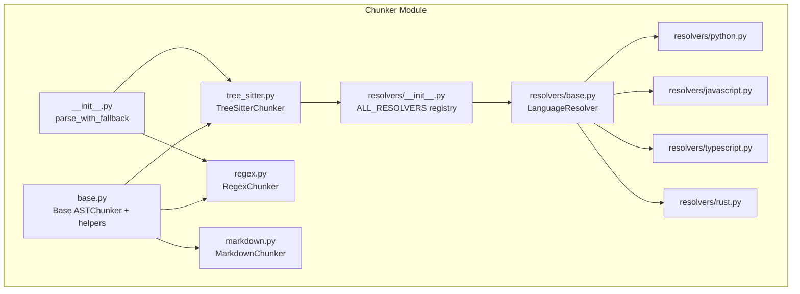
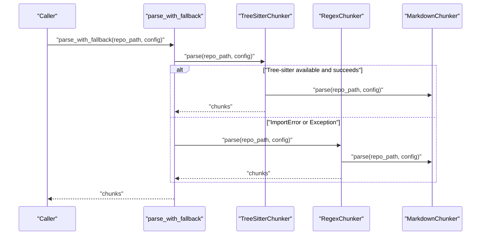
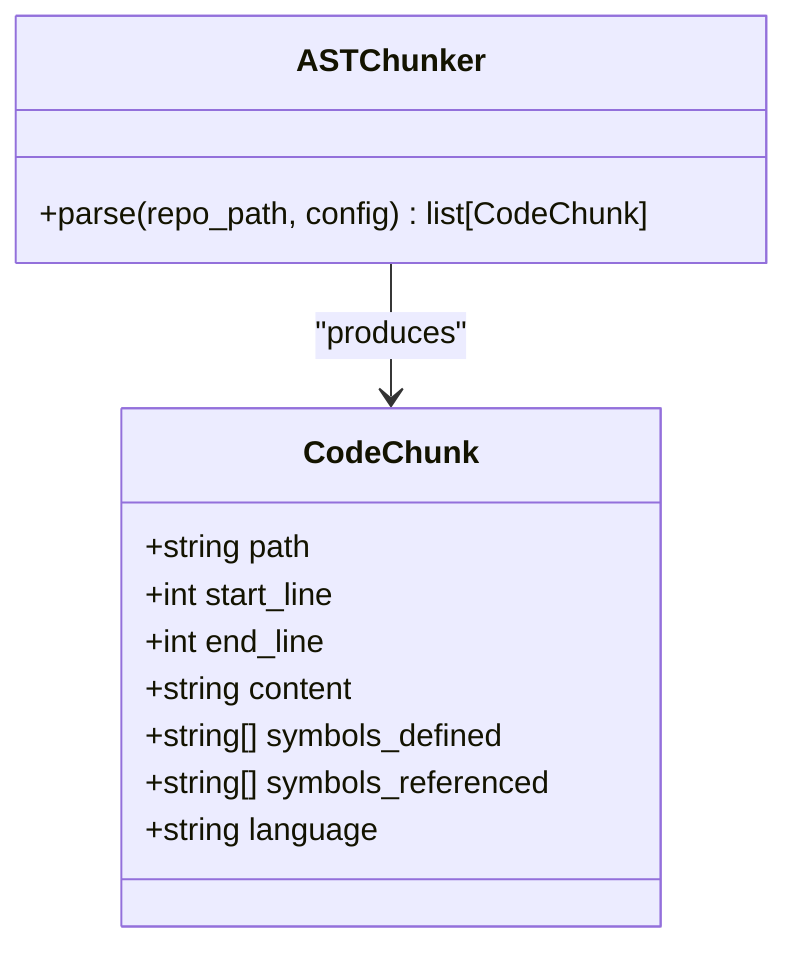
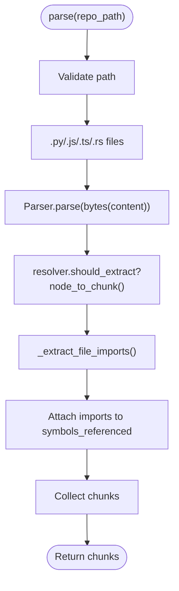
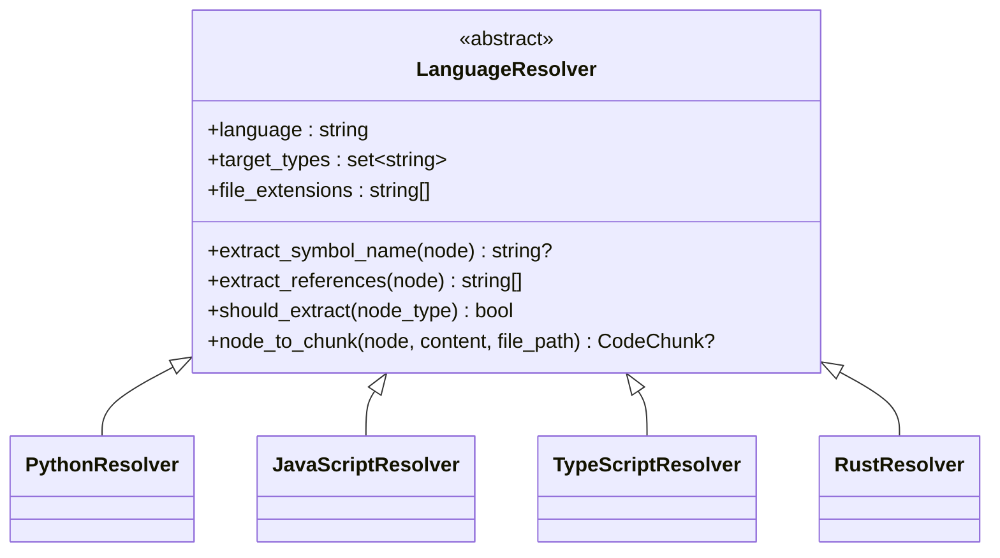
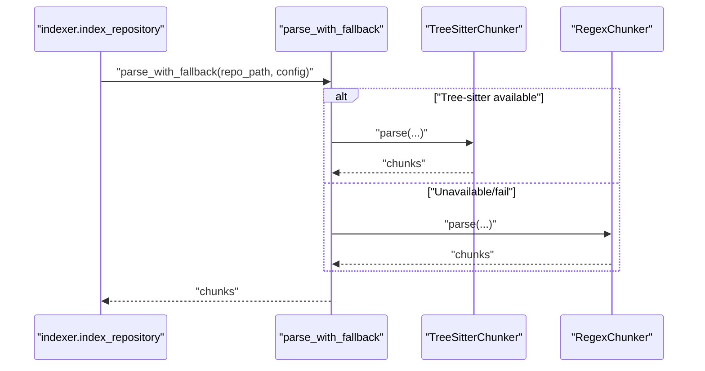
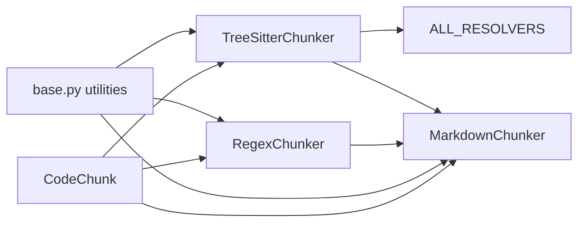

# Chunker System

<cite>
**Referenced Files in This Document**
- [__init__.py](file://src/ws_ctx_engine/chunker/__init__.py)
- [base.py](file://src/ws_ctx_engine/chunker/base.py)
- [tree_sitter.py](file://src/ws_ctx_engine/chunker/tree_sitter.py)
- [markdown.py](file://src/ws_ctx_engine/chunker/markdown.py)
- [regex.py](file://src/ws_ctx_engine/chunker/regex.py)
- [resolvers/__init__.py](file://src/ws_ctx_engine/chunker/resolvers/__init__.py)
- [resolvers/base.py](file://src/ws_ctx_engine/chunker/resolvers/base.py)
- [resolvers/python.py](file://src/ws_ctx_engine/chunker/resolvers/python.py)
- [resolvers/javascript.py](file://src/ws_ctx_engine/chunker/resolvers/javascript.py)
- [resolvers/typescript.py](file://src/ws_ctx_engine/chunker/resolvers/typescript.py)
- [resolvers/rust.py](file://src/ws_ctx_engine/chunker/resolvers/rust.py)
- [models.py](file://src/ws_ctx_engine/models/models.py)
- [config.py](file://src/ws_ctx_engine/config/config.py)
- [indexer.py](file://src/ws_ctx_engine/workflow/indexer.py)
</cite>

## Table of Contents
1. [Introduction](#introduction)
2. [Project Structure](#project-structure)
3. [Core Components](#core-components)
4. [Architecture Overview](#architecture-overview)
5. [Detailed Component Analysis](#detailed-component-analysis)
6. [Dependency Analysis](#dependency-analysis)
7. [Performance Considerations](#performance-considerations)
8. [Troubleshooting Guide](#troubleshooting-guide)
9. [Conclusion](#conclusion)
10. [Appendices](#appendices)

## Introduction
This document explains the chunker system that extracts structured, language-aware code segments from repositories for downstream indexing and retrieval. It covers:
- AST parsing using tree-sitter with language-specific resolvers
- Fallback mechanisms to regex-based parsing
- Markdown chunking strategies
- Base chunker interface and shared utilities
- Resolver pattern for symbol extraction and references
- Integration with the indexing pipeline
- Performance, memory, and chunk overlap considerations

## Project Structure
The chunker system resides under src/ws_ctx_engine/chunker and includes:
- Base abstractions and shared utilities
- Tree-sitter-based AST chunker
- Regex-based fallback chunker
- Markdown chunker
- Language-specific resolvers (Python, JavaScript, TypeScript, Rust)
- Integration via a convenience function that selects the best available parser

**Diagram sources**
- [base.py:1-176](file://src/ws_ctx_engine/chunker/base.py#L1-L176)
- [tree_sitter.py:1-160](file://src/ws_ctx_engine/chunker/tree_sitter.py#L1-L160)
- [regex.py:1-219](file://src/ws_ctx_engine/chunker/regex.py#L1-L219)
- [markdown.py:1-100](file://src/ws_ctx_engine/chunker/markdown.py#L1-L100)
- [resolvers/__init__.py:1-26](file://src/ws_ctx_engine/chunker/resolvers/__init__.py#L1-L26)
- [resolvers/base.py:1-70](file://src/ws_ctx_engine/chunker/resolvers/base.py#L1-L70)
- [resolvers/python.py:1-61](file://src/ws_ctx_engine/chunker/resolvers/python.py#L1-L61)
- [resolvers/javascript.py:1-85](file://src/ws_ctx_engine/chunker/resolvers/javascript.py#L1-L85)
- [resolvers/typescript.py:1-103](file://src/ws_ctx_engine/chunker/resolvers/typescript.py#L1-L103)
- [resolvers/rust.py:1-55](file://src/ws_ctx_engine/chunker/resolvers/rust.py#L1-L55)
- [__init__.py:1-55](file://src/ws_ctx_engine/chunker/__init__.py#L1-L55)

**Section sources**
- [__init__.py:1-55](file://src/ws_ctx_engine/chunker/__init__.py#L1-L55)
- [base.py:1-176](file://src/ws_ctx_engine/chunker/base.py#L1-L176)

## Core Components
- ASTChunker: Abstract base for chunkers that produce CodeChunk objects.
- TreeSitterChunker: Uses tree-sitter parsers per language and resolvers to extract definitions and references.
- RegexChunker: Fallback that detects blocks and imports via regex patterns.
- MarkdownChunker: Splits Markdown files by headings into chunks.
- LanguageResolver: Per-language strategy for extracting symbol names and references from AST nodes.
- CodeChunk: Data model representing a chunk with path, line range, content, symbols, and language.

Key shared utilities:
- File inclusion/exclusion logic and gitignore handling
- Pattern matching for include/exclude rules
- Warning for unsupported extensions

**Section sources**
- [base.py:41-176](file://src/ws_ctx_engine/chunker/base.py#L41-L176)
- [tree_sitter.py:15-160](file://src/ws_ctx_engine/chunker/tree_sitter.py#L15-L160)
- [regex.py:15-219](file://src/ws_ctx_engine/chunker/regex.py#L15-L219)
- [markdown.py:13-100](file://src/ws_ctx_engine/chunker/markdown.py#L13-L100)
- [resolvers/base.py:7-70](file://src/ws_ctx_engine/chunker/resolvers/base.py#L7-L70)
- [models.py:10-85](file://src/ws_ctx_engine/models/models.py#L10-L85)

## Architecture Overview
The chunker system exposes a single entry point that attempts tree-sitter parsing and falls back to regex when unavailable or failing. Markdown files are processed separately and combined with language chunks.

**Diagram sources**
- [__init__.py:17-37](file://src/ws_ctx_engine/chunker/__init__.py#L17-L37)
- [tree_sitter.py:57-89](file://src/ws_ctx_engine/chunker/tree_sitter.py#L57-L89)
- [regex.py:75-105](file://src/ws_ctx_engine/chunker/regex.py#L75-L105)
- [markdown.py:23-48](file://src/ws_ctx_engine/chunker/markdown.py#L23-L48)

## Detailed Component Analysis

### Base Chunker Interface and Utilities
- ASTChunker defines the contract for parse(repo_path, config) returning CodeChunk list.
- Shared helpers:
  - Gitignore discovery and spec building
  - File inclusion/exclusion decisions
  - Pattern matching supporting glob-like patterns
  - Warning for unsupported extensions

**Diagram sources**
- [base.py:41-44](file://src/ws_ctx_engine/chunker/base.py#L41-L44)
- [models.py:10-34](file://src/ws_ctx_engine/models/models.py#L10-L34)

**Section sources**
- [base.py:41-176](file://src/ws_ctx_engine/chunker/base.py#L41-L176)
- [models.py:10-85](file://src/ws_ctx_engine/models/models.py#L10-L85)

### Tree-Sitter Chunker
- Initializes tree-sitter parsers for Python, JavaScript, TypeScript, and Rust.
- Maps file extensions to languages.
- Walks supported files, parses ASTs, and delegates extraction to resolvers.
- Extracts imports and attaches them as referenced symbols.
- Also runs MarkdownChunker to include Markdown content.

**Diagram sources**
- [tree_sitter.py:57-160](file://src/ws_ctx_engine/chunker/tree_sitter.py#L57-L160)

**Section sources**
- [tree_sitter.py:15-160](file://src/ws_ctx_engine/chunker/tree_sitter.py#L15-L160)

### Regex Chunker
- Provides fallback parsing using language-specific regex patterns for imports and block boundaries.
- Determines block end via brace matching or Python indentation rules.
- Extracts imports and marks them as referenced symbols.

**Diagram sources**
- [regex.py:75-143](file://src/ws_ctx_engine/chunker/regex.py#L75-L143)

**Section sources**
- [regex.py:15-219](file://src/ws_ctx_engine/chunker/regex.py#L15-L219)

### Markdown Chunker
- Splits Markdown files into chunks at ATX heading boundaries.
- If no headings, returns a single chunk covering the whole file.
- Symbols_defined includes the first heading or filename stem.

**Diagram sources**
- [markdown.py:23-99](file://src/ws_ctx_engine/chunker/markdown.py#L23-L99)

**Section sources**
- [markdown.py:13-100](file://src/ws_ctx_engine/chunker/markdown.py#L13-L100)

### Resolvers: Language-Specific Strategies
- LanguageResolver defines:
  - language identifier
  - target AST node types to extract
  - symbol name extraction
  - reference collection
  - conversion from AST node to CodeChunk
- Concrete resolvers:
  - PythonResolver: function/class/decorated/type alias
  - JavaScriptResolver: function/class/method/lexical/export/jsx
  - TypeScriptResolver: function/class/interface/enum/type alias/abstract/jsx/export/module
  - RustResolver: function/struct/trait/impl/enum/const/type/static/mod/macro/union/signature

**Diagram sources**
- [resolvers/base.py:7-70](file://src/ws_ctx_engine/chunker/resolvers/base.py#L7-L70)
- [resolvers/python.py:6-61](file://src/ws_ctx_engine/chunker/resolvers/python.py#L6-L61)
- [resolvers/javascript.py:6-85](file://src/ws_ctx_engine/chunker/resolvers/javascript.py#L6-L85)
- [resolvers/typescript.py:6-103](file://src/ws_ctx_engine/chunker/resolvers/typescript.py#L6-L103)
- [resolvers/rust.py:6-55](file://src/ws_ctx_engine/chunker/resolvers/rust.py#L6-L55)

**Section sources**
- [resolvers/base.py:7-70](file://src/ws_ctx_engine/chunker/resolvers/base.py#L7-L70)
- [resolvers/python.py:6-61](file://src/ws_ctx_engine/chunker/resolvers/python.py#L6-L61)
- [resolvers/javascript.py:6-85](file://src/ws_ctx_engine/chunker/resolvers/javascript.py#L6-L85)
- [resolvers/typescript.py:6-103](file://src/ws_ctx_engine/chunker/resolvers/typescript.py#L6-L103)
- [resolvers/rust.py:6-55](file://src/ws_ctx_engine/chunker/resolvers/rust.py#L6-L55)

### Fallback Mechanism and Integration
- parse_with_fallback attempts TreeSitterChunker; on ImportError or Exception, falls back to RegexChunker.
- Both chunkers also run MarkdownChunker to include Markdown content.
- The indexing workflow calls parse_with_fallback during the parsing phase.

**Diagram sources**
- [indexer.py:156-176](file://src/ws_ctx_engine/workflow/indexer.py#L156-L176)
- [__init__.py:17-37](file://src/ws_ctx_engine/chunker/__init__.py#L17-L37)

**Section sources**
- [__init__.py:17-37](file://src/ws_ctx_engine/chunker/__init__.py#L17-L37)
- [indexer.py:72-176](file://src/ws_ctx_engine/workflow/indexer.py#L72-L176)

## Dependency Analysis
- TreeSitterChunker depends on:
  - tree-sitter parsers for Python/JavaScript/TypeScript/Rust
  - LanguageResolver registry (ALL_RESOLVERS)
  - MarkdownChunker
- RegexChunker depends on:
  - Language-specific regex patterns for imports and definitions
  - MarkdownChunker
- MarkdownChunker is standalone and depends only on base utilities.
- All chunkers depend on CodeChunk and base inclusion/exclusion utilities.

**Diagram sources**
- [tree_sitter.py:10-11, 54-55](file://src/ws_ctx_engine/chunker/tree_sitter.py#L10-L11, 54-L55)
- [regex.py:73](file://src/ws_ctx_engine/chunker/regex.py#L73)
- [markdown.py:8](file://src/ws_ctx_engine/chunker/markdown.py#L8)
- [base.py:41-176](file://src/ws_ctx_engine/chunker/base.py#L41-L176)
- [models.py:10-34](file://src/ws_ctx_engine/models/models.py#L10-L34)

**Section sources**
- [tree_sitter.py:10-55](file://src/ws_ctx_engine/chunker/tree_sitter.py#L10-L55)
- [regex.py:64-74](file://src/ws_ctx_engine/chunker/regex.py#L64-L74)
- [markdown.py:8](file://src/ws_ctx_engine/chunker/markdown.py#L8)
- [base.py:41-176](file://src/ws_ctx_engine/chunker/base.py#L41-L176)
- [models.py:10-34](file://src/ws_ctx_engine/models/models.py#L10-L34)

## Performance Considerations
- Tree-sitter availability: The system attempts tree-sitter first and falls back to regex. If tree-sitter is unavailable, parse_with_fallback logs a warning and uses RegexChunker.
- File traversal: The chunkers traverse supported extensions and apply include/exclude patterns and optional gitignore rules.
- Token counting: CodeChunk exposes token_count(encoding) to estimate costs for downstream embedding and retrieval.
- Incremental indexing: The indexing workflow supports detecting changed/deleted files and updating vector indices incrementally when caches are available.

Practical tips:
- Ensure tree-sitter dependencies are installed for optimal accuracy and speed.
- Tune include/exclude patterns to reduce IO and parsing overhead.
- Use token_budget and output format settings to control downstream processing costs.

**Section sources**
- [__init__.py:17-37](file://src/ws_ctx_engine/chunker/__init__.py#L17-L37)
- [base.py:47-116](file://src/ws_ctx_engine/chunker/base.py#L47-L116)
- [models.py:60-84](file://src/ws_ctx_engine/models/models.py#L60-L84)
- [indexer.py:146-234](file://src/ws_ctx_engine/workflow/indexer.py#L146-L234)

## Troubleshooting Guide
Common issues and remedies:
- Tree-sitter not available: ImportError during initialization indicates missing tree-sitter packages. Install the required dependencies as indicated by the raised error message.
- Tree-sitter failures: On general exceptions, the system falls back to RegexChunker automatically.
- Unsupported file extensions: Files with extensions not in INDEXED_EXTENSIONS trigger a warning; they are indexed as plain text.
- Include/exclude patterns: Verify patterns resolve to intended files; use glob-like patterns and ensure precedence rules are understood.
- Markdown parsing: If Markdown files are not being split, confirm headings exist or accept single-chunk behavior.

Operational checks:
- Confirm parse_with_fallback is used in the indexing workflow.
- Review warnings logged during parsing for problematic files or missing dependencies.

**Section sources**
- [tree_sitter.py:26-37](file://src/ws_ctx_engine/chunker/tree_sitter.py#L26-L37)
- [__init__.py:26-37](file://src/ws_ctx_engine/chunker/__init__.py#L26-L37)
- [base.py:106-115](file://src/ws_ctx_engine/chunker/base.py#L106-L115)
- [base.py:118-156](file://src/ws_ctx_engine/chunker/base.py#L118-L156)
- [markdown.py:66-77](file://src/ws_ctx_engine/chunker/markdown.py#L66-L77)

## Conclusion
The chunker system provides robust, language-aware code segmentation with a strong AST-first approach powered by tree-sitter and a reliable regex fallback. Its modular resolver pattern cleanly separates language-specific logic, while Markdown chunking ensures documentation remains searchable. Integrated into the indexing pipeline, it supports incremental updates and performance-conscious configurations.

## Appendices

### Example Workflows
- AST-first parsing with fallback:
  - Call parse_with_fallback(repo_path, config) to obtain chunks.
  - Use chunks downstream for vector indexing and graph construction.
- Markdown-only processing:
  - Instantiate MarkdownChunker and call parse(repo_path, config).
- Regex-only processing:
  - Instantiate RegexChunker and call parse(repo_path, config).

**Section sources**
- [__init__.py:17-37](file://src/ws_ctx_engine/chunker/__init__.py#L17-L37)
- [markdown.py:23-48](file://src/ws_ctx_engine/chunker/markdown.py#L23-L48)
- [regex.py:75-105](file://src/ws_ctx_engine/chunker/regex.py#L75-L105)

### Custom Resolver Development
Steps to add a new language:
- Create a subclass of LanguageResolver with:
  - language identifier
  - target_types for AST node types to extract
  - extract_symbol_name(node) to derive the primary symbol
  - extract_references(node) to collect referenced identifiers
- Register the resolver in ALL_RESOLVERS mapping under the language key.
- Ensure the TreeSitterChunker maps the language to a tree-sitter Language and file extensions.

**Section sources**
- [resolvers/base.py:7-70](file://src/ws_ctx_engine/chunker/resolvers/base.py#L7-L70)
- [resolvers/__init__.py:9-16](file://src/ws_ctx_engine/chunker/resolvers/__init__.py#L9-L16)
- [tree_sitter.py:40-54](file://src/ws_ctx_engine/chunker/tree_sitter.py#L40-L54)

### Integration with Indexing Pipeline
- The indexing workflow:
  - Calls parse_with_fallback to obtain chunks
  - Builds vector index and graph (with optional incremental updates)
  - Persists metadata for staleness detection
  - Supports domain-only mode to rebuild only keyword maps

**Section sources**
- [indexer.py:72-371](file://src/ws_ctx_engine/workflow/indexer.py#L72-L371)