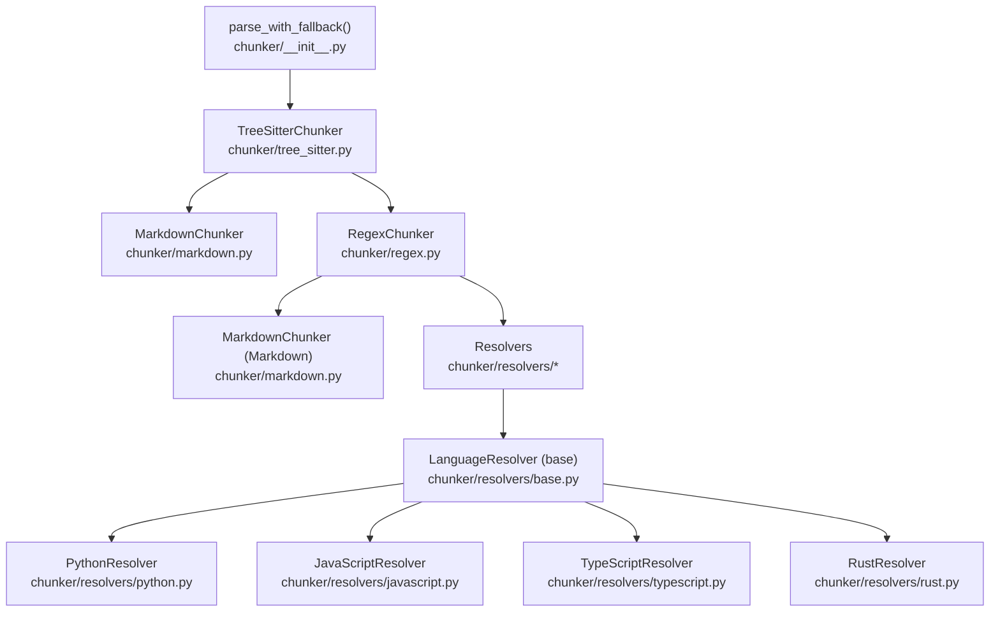
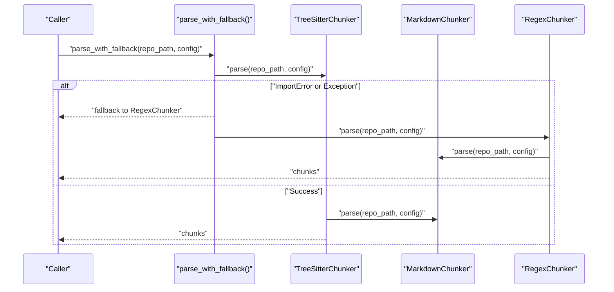
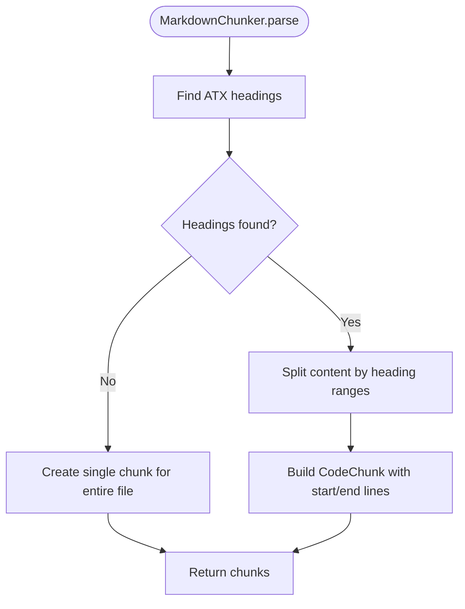
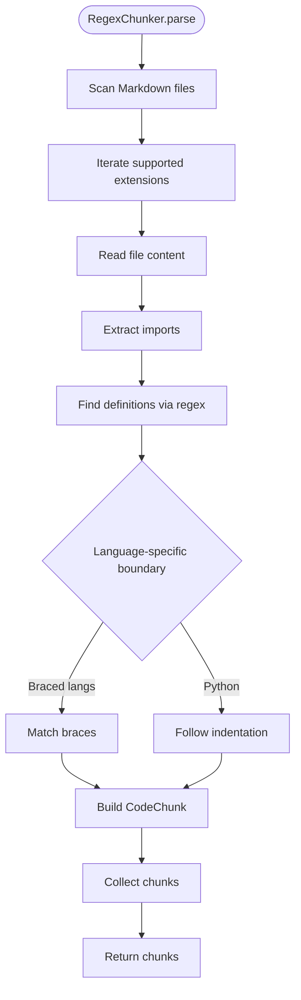
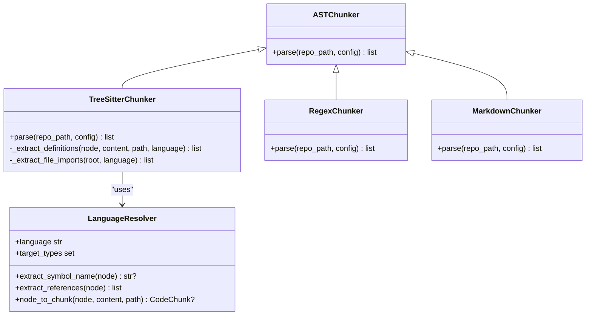
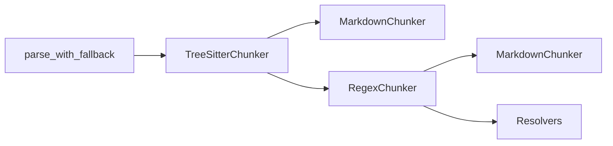

# Fallback Chunking Strategies

<cite>
**Referenced Files in This Document**
- [__init__.py](file://src/ws_ctx_engine/chunker/__init__.py)
- [base.py](file://src/ws_ctx_engine/chunker/base.py)
- [markdown.py](file://src/ws_ctx_engine/chunker/markdown.py)
- [regex.py](file://src/ws_ctx_engine/chunker/regex.py)
- [tree_sitter.py](file://src/ws_ctx_engine/chunker/tree_sitter.py)
- [base.py](file://src/ws_ctx_engine/chunker/resolvers/base.py)
- [python.py](file://src/ws_ctx_engine/chunker/resolvers/python.py)
- [javascript.py](file://src/ws_ctx_engine/chunker/resolvers/javascript.py)
- [typescript.py](file://src/ws_ctx_engine/chunker/resolvers/typescript.py)
- [rust.py](file://src/ws_ctx_engine/chunker/resolvers/rust.py)
- [config.py](file://src/ws_ctx_engine/config/config.py)
- [models.py](file://src/ws_ctx_engine/models/models.py)
- [test_markdown_chunker.py](file://tests/unit/test_markdown_chunker.py)
- [test_regex_chunker.py](file://tests/unit/test_regex_chunker.py)
- [test_fallback_scenarios.py](file://tests/integration/test_fallback_scenarios.py)
</cite>

## Table of Contents
1. [Introduction](#introduction)
2. [Project Structure](#project-structure)
3. [Core Components](#core-components)
4. [Architecture Overview](#architecture-overview)
5. [Detailed Component Analysis](#detailed-component-analysis)
6. [Dependency Analysis](#dependency-analysis)
7. [Performance Considerations](#performance-considerations)
8. [Troubleshooting Guide](#troubleshooting-guide)
9. [Conclusion](#conclusion)
10. [Appendices](#appendices)

## Introduction
This document explains the fallback chunking strategies used when AST parsing is unavailable or insufficient. It covers:
- The markdown chunking approach for Markdown files
- Regex-based chunking algorithms for code files
- Plain text fallback mechanisms for unsupported file types
- Chunk size calculation, content boundary detection, and overlap strategies
- Integration with the main chunking pipeline
- Performance implications and quality assessment of fallback chunks
- Configuration options affecting fallback behavior
- Troubleshooting guidance and best practices

## Project Structure
The fallback chunking pipeline is implemented in the chunker module and integrates with resolvers and configuration:
- TreeSitterChunker attempts AST parsing and falls back to RegexChunker when unavailable
- RegexChunker handles Markdown and code files via regex-based boundaries
- MarkdownChunker splits Markdown by headings into logical chunks
- Resolvers define AST node types and extraction rules per language
- Config controls include/exclude patterns and other filters



**Diagram sources**
- [__init__.py:17-37](file://src/ws_ctx_engine/chunker/__init__.py#L17-L37)
- [tree_sitter.py:57-89](file://src/ws_ctx_engine/chunker/tree_sitter.py#L57-L89)
- [regex.py:75-105](file://src/ws_ctx_engine/chunker/regex.py#L75-L105)
- [markdown.py:23-48](file://src/ws_ctx_engine/chunker/markdown.py#L23-L48)
- [base.py:7-69](file://src/ws_ctx_engine/chunker/resolvers/base.py#L7-L69)
- [python.py:6-60](file://src/ws_ctx_engine/chunker/resolvers/python.py#L6-L60)
- [javascript.py:6-84](file://src/ws_ctx_engine/chunker/resolvers/javascript.py#L6-L84)
- [typescript.py:6-102](file://src/ws_ctx_engine/chunker/resolvers/typescript.py#L6-L102)
- [rust.py:6-54](file://src/ws_ctx_engine/chunker/resolvers/rust.py#L6-L54)

**Section sources**
- [__init__.py:17-37](file://src/ws_ctx_engine/chunker/__init__.py#L17-L37)
- [tree_sitter.py:57-89](file://src/ws_ctx_engine/chunker/tree_sitter.py#L57-L89)
- [regex.py:75-105](file://src/ws_ctx_engine/chunker/regex.py#L75-L105)
- [markdown.py:23-48](file://src/ws_ctx_engine/chunker/markdown.py#L23-L48)

## Core Components
- TreeSitterChunker: Attempts AST parsing using py-tree-sitter with language-specific resolvers. Falls back to RegexChunker on ImportError or other exceptions.
- RegexChunker: Regex-based fallback for Markdown and code files. Detects imports and function/class boundaries per language.
- MarkdownChunker: Splits Markdown by ATX headings into chunks; if no headings, returns a single chunk.
- Resolvers: Define AST node types and extraction rules for Python, JavaScript, TypeScript, and Rust.
- Base utilities: File inclusion/exclusion logic, ignore spec handling, and warnings for unsupported extensions.

Key behaviors:
- Markdown files are always processed first by MarkdownChunker
- For code files, TreeSitterChunker is preferred; if unavailable or failing, RegexChunker is used
- Unsupported extensions trigger a warning and are treated as plain text

**Section sources**
- [__init__.py:17-37](file://src/ws_ctx_engine/chunker/__init__.py#L17-L37)
- [tree_sitter.py:57-89](file://src/ws_ctx_engine/chunker/tree_sitter.py#L57-L89)
- [regex.py:75-105](file://src/ws_ctx_engine/chunker/regex.py#L75-L105)
- [markdown.py:23-48](file://src/ws_ctx_engine/chunker/markdown.py#L23-L48)
- [base.py:118-176](file://src/ws_ctx_engine/chunker/base.py#L118-L176)

## Architecture Overview
The fallback pipeline prioritizes AST parsing with graceful degradation to regex-based chunking.



**Diagram sources**
- [__init__.py:17-37](file://src/ws_ctx_engine/chunker/__init__.py#L17-L37)
- [tree_sitter.py:57-89](file://src/ws_ctx_engine/chunker/tree_sitter.py#L57-L89)
- [regex.py:75-105](file://src/ws_ctx_engine/chunker/regex.py#L75-L105)
- [markdown.py:23-48](file://src/ws_ctx_engine/chunker/markdown.py#L23-L48)

## Detailed Component Analysis

### Markdown Chunking
MarkdownChunker splits Markdown files into chunks at heading boundaries. If no headings are found, the entire file becomes a single chunk.

- Content boundary detection: Uses ATX heading regex to locate chunk boundaries
- Chunk size calculation: Derived from line indices; start_line and end_line are 1-indexed
- Overlap strategy: Not applicable for Markdown; chunks are non-overlapping by definition
- Quality assessment: Preserves Markdown structure; symbols_defined reflects heading text



**Diagram sources**
- [markdown.py:50-99](file://src/ws_ctx_engine/chunker/markdown.py#L50-L99)

**Section sources**
- [markdown.py:23-48](file://src/ws_ctx_engine/chunker/markdown.py#L23-L48)
- [markdown.py:50-99](file://src/ws_ctx_engine/chunker/markdown.py#L50-L99)
- [test_markdown_chunker.py:27-138](file://tests/unit/test_markdown_chunker.py#L27-L138)

### Regex-Based Chunking
RegexChunker provides a robust fallback for Markdown and code files. It:
- Detects imports per language and populates symbols_referenced
- Identifies function/class/arrow/function-like constructs
- Determines block boundaries using brace matching or Python indentation rules



**Diagram sources**
- [regex.py:75-105](file://src/ws_ctx_engine/chunker/regex.py#L75-L105)
- [regex.py:107-143](file://src/ws_ctx_engine/chunker/regex.py#L107-L143)
- [regex.py:145-210](file://src/ws_ctx_engine/chunker/regex.py#L145-L210)

**Section sources**
- [regex.py:15-105](file://src/ws_ctx_engine/chunker/regex.py#L15-L105)
- [regex.py:145-210](file://src/ws_ctx_engine/chunker/regex.py#L145-L210)
- [test_regex_chunker.py:20-331](file://tests/unit/test_regex_chunker.py#L20-L331)

### AST Chunking and Fallback Integration
TreeSitterChunker performs AST parsing and delegates to resolvers for language-specific extraction. On failure, the system falls back to RegexChunker.



**Diagram sources**
- [tree_sitter.py:15-159](file://src/ws_ctx_engine/chunker/tree_sitter.py#L15-L159)
- [regex.py:15-105](file://src/ws_ctx_engine/chunker/regex.py#L15-L105)
- [markdown.py:13-99](file://src/ws_ctx_engine/chunker/markdown.py#L13-L99)
- [base.py:7-69](file://src/ws_ctx_engine/chunker/resolvers/base.py#L7-L69)

**Section sources**
- [tree_sitter.py:57-159](file://src/ws_ctx_engine/chunker/tree_sitter.py#L57-L159)
- [base.py:118-176](file://src/ws_ctx_engine/chunker/base.py#L118-L176)

### Language Resolvers
Each resolver defines:
- language identifier
- target AST node types to extract
- symbol name extraction
- references extraction

```mermaid
classDiagram
class LanguageResolver {
+language str
+target_types set
+extract_symbol_name(node) str?
+extract_references(node) list
+should_extract(node_type) bool
+node_to_chunk(node, content, path) CodeChunk?
}
class PythonResolver {
+language "python"
+target_types {...}
+extract_symbol_name(node) str?
+extract_references(node) list
}
class JavaScriptResolver {
+language "javascript"
+target_types {...}
+extract_symbol_name(node) str?
+extract_references(node) list
}
class TypeScriptResolver {
+language "typescript"
+target_types {...}
+extract_symbol_name(node) str?
+extract_references(node) list
}
class RustResolver {
+language "rust"
+target_types {...}
+extract_symbol_name(node) str?
+extract_references(node) list
}
LanguageResolver <|-- PythonResolver
LanguageResolver <|-- JavaScriptResolver
LanguageResolver <|-- TypeScriptResolver
LanguageResolver <|-- RustResolver
```

**Diagram sources**
- [base.py:7-69](file://src/ws_ctx_engine/chunker/resolvers/base.py#L7-L69)
- [python.py:6-60](file://src/ws_ctx_engine/chunker/resolvers/python.py#L6-L60)
- [javascript.py:6-84](file://src/ws_ctx_engine/chunker/resolvers/javascript.py#L6-L84)
- [typescript.py:6-102](file://src/ws_ctx_engine/chunker/resolvers/typescript.py#L6-L102)
- [rust.py:6-54](file://src/ws_ctx_engine/chunker/resolvers/rust.py#L6-L54)

**Section sources**
- [base.py:7-69](file://src/ws_ctx_engine/chunker/resolvers/base.py#L7-L69)
- [python.py:6-60](file://src/ws_ctx_engine/chunker/resolvers/python.py#L6-L60)
- [javascript.py:6-84](file://src/ws_ctx_engine/chunker/resolvers/javascript.py#L6-L84)
- [typescript.py:6-102](file://src/ws_ctx_engine/chunker/resolvers/typescript.py#L6-L102)
- [rust.py:6-54](file://src/ws_ctx_engine/chunker/resolvers/rust.py#L6-L54)

## Dependency Analysis
- parse_with_fallback orchestrates TreeSitterChunker and RegexChunker
- TreeSitterChunker depends on resolvers and MarkdownChunker
- RegexChunker depends on MarkdownChunker and language-specific patterns
- base utilities provide file filtering and warnings for unsupported extensions



**Diagram sources**
- [__init__.py:17-37](file://src/ws_ctx_engine/chunker/__init__.py#L17-L37)
- [tree_sitter.py:57-89](file://src/ws_ctx_engine/chunker/tree_sitter.py#L57-L89)
- [regex.py:75-105](file://src/ws_ctx_engine/chunker/regex.py#L75-L105)
- [markdown.py:23-48](file://src/ws_ctx_engine/chunker/markdown.py#L23-L48)

**Section sources**
- [__init__.py:17-37](file://src/ws_ctx_engine/chunker/__init__.py#L17-L37)
- [tree_sitter.py:57-89](file://src/ws_ctx_engine/chunker/tree_sitter.py#L57-L89)
- [regex.py:75-105](file://src/ws_ctx_engine/chunker/regex.py#L75-L105)
- [markdown.py:23-48](file://src/ws_ctx_engine/chunker/markdown.py#L23-L48)

## Performance Considerations
- AST vs fallback: TreeSitterChunker is generally faster and more accurate for supported languages; RegexChunker is slower but broadly compatible
- Memory efficiency: RegexChunker reads entire files and scans via regex; consider large file limits and chunk budgets
- Processing speed: RegexChunker’s performance depends on language patterns and nesting depth; brace matching and indentation scanning add overhead
- Token budget: Use Config.token_budget to constrain output size; fallback chunks contribute to token counts via CodeChunk.token_count

[No sources needed since this section provides general guidance]

## Troubleshooting Guide
Common fallback issues and resolutions:
- TreeSitter not installed or fails: parse_with_fallback automatically falls back to RegexChunker; verify dependencies and reinstall if needed
- Unsupported file extension: warn_non_indexed_extension logs a warning; treat as plain text fallback
- Corrupted or unreadable files: chunkers catch exceptions and log warnings; remove or fix problematic files
- Missing files after indexing: gracefully handled; subsequent queries adjust to available files

Validation references:
- Fallback chain and error handling in parse_with_fallback
- Warning for unsupported extensions
- Graceful error handling in MarkdownChunker and RegexChunker
- Integration tests covering error scenarios

**Section sources**
- [__init__.py:17-37](file://src/ws_ctx_engine/chunker/__init__.py#L17-L37)
- [base.py:106-116](file://src/ws_ctx_engine/chunker/base.py#L106-L116)
- [markdown.py:43-47](file://src/ws_ctx_engine/chunker/markdown.py#L43-L47)
- [regex.py:100-104](file://src/ws_ctx_engine/chunker/regex.py#L100-L104)
- [test_fallback_scenarios.py:491-665](file://tests/integration/test_fallback_scenarios.py#L491-L665)

## Conclusion
Fallback chunking ensures robust processing across diverse file types:
- MarkdownChunker preserves semantic structure via headings
- RegexChunker provides reliable boundaries for code and Markdown
- TreeSitterChunker offers precise AST-based extraction with graceful fallback
- Configuration and validation help maintain quality and performance

[No sources needed since this section summarizes without analyzing specific files]

## Appendices

### Configuration Options for Fallback Behavior
- include_patterns and exclude_patterns: Control which files are processed; affects both AST and fallback chunkers
- respect_gitignore: Honors .gitignore semantics for inclusion/exclusion
- token_budget: Limits total tokens across chunks; consider fallback chunk sizes when tuning

**Section sources**
- [config.py:37-72](file://src/ws_ctx_engine/config/config.py#L37-L72)
- [config.py:175-190](file://src/ws_ctx_engine/config/config.py#L175-L190)
- [base.py:47-104](file://src/ws_ctx_engine/chunker/base.py#L47-L104)

### Quality Assessment of Fallback Chunks
- Markdown: Non-overlapping chunks by heading; symbols_defined reflects headings; symbols_referenced empty for Markdown
- Regex: Approximates boundaries; imports extracted into symbols_referenced; accuracy depends on language patterns
- AST: Most accurate; resolvers define precise node types and symbol/reference extraction

**Section sources**
- [markdown.py:66-99](file://src/ws_ctx_engine/chunker/markdown.py#L66-L99)
- [regex.py:122-142](file://src/ws_ctx_engine/chunker/regex.py#L122-L142)
- [base.py:48-69](file://src/ws_ctx_engine/chunker/resolvers/base.py#L48-L69)

### Examples of Fallback Usage
- Markdown files: Processed by MarkdownChunker; single-chunk fallback if no headings
- Python/JS/TS/Rust: Prefer TreeSitterChunker; fallback to RegexChunker when unavailable
- Unsupported extensions: Treated as plain text with a warning

**Section sources**
- [markdown.py:23-48](file://src/ws_ctx_engine/chunker/markdown.py#L23-L48)
- [regex.py:75-105](file://src/ws_ctx_engine/chunker/regex.py#L75-L105)
- [base.py:106-116](file://src/ws_ctx_engine/chunker/base.py#L106-L116)
- [test_markdown_chunker.py:27-138](file://tests/unit/test_markdown_chunker.py#L27-L138)
- [test_regex_chunker.py:20-331](file://tests/unit/test_regex_chunker.py#L20-L331)