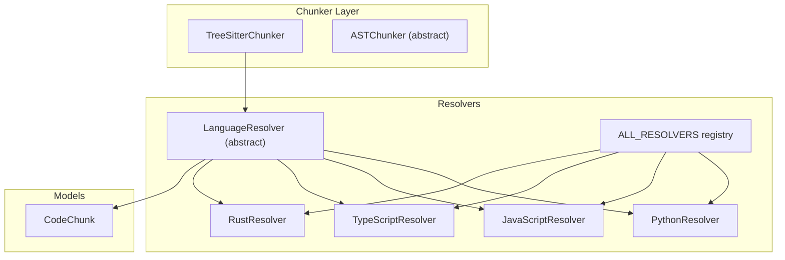
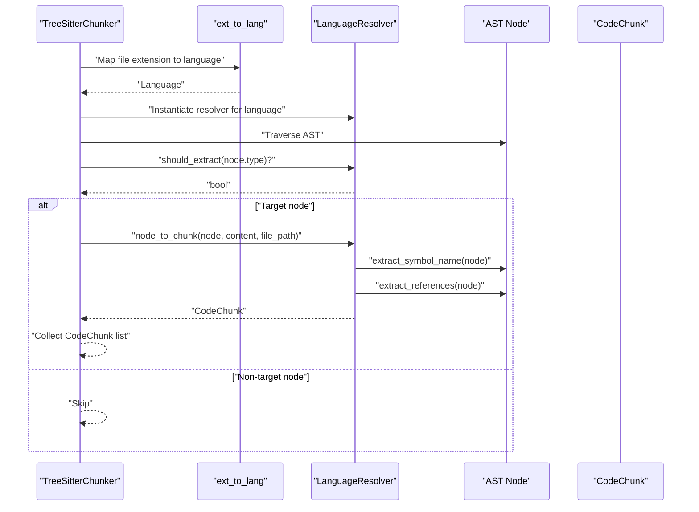
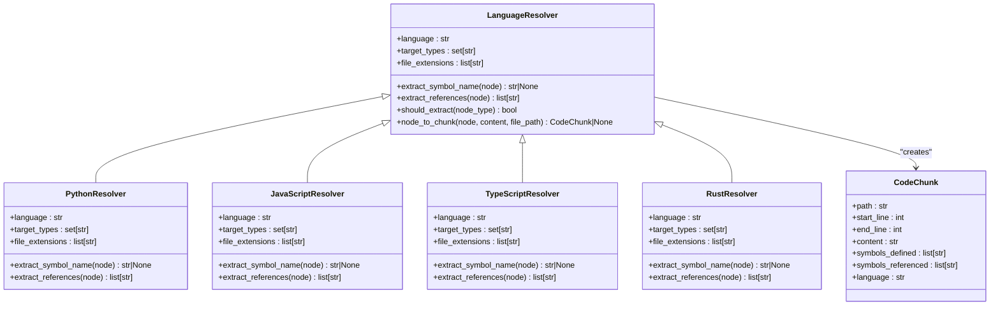
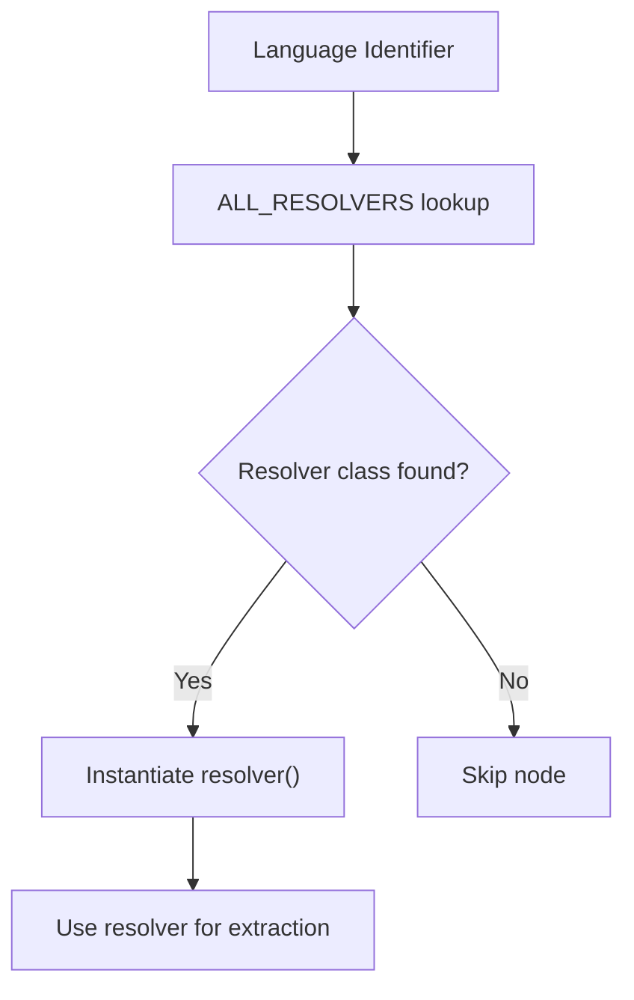
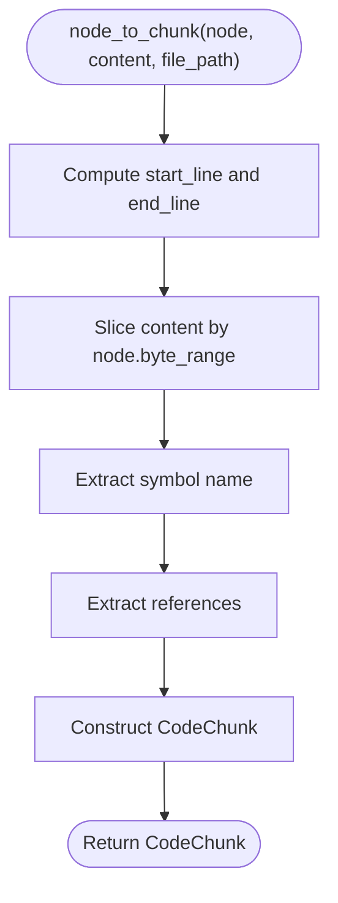
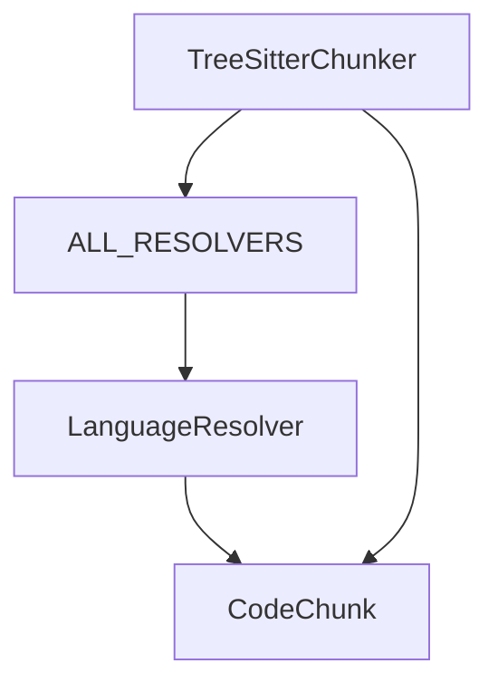

# Base Resolver Interface

<cite>
**Referenced Files in This Document**
- [base.py](file://src/ws_ctx_engine/chunker/resolvers/base.py)
- [python.py](file://src/ws_ctx_engine/chunker/resolvers/pythonResolver)
- [javascript.py](file://src/ws_ctx_engine/chunker/resolvers/JavaScriptResolver)
- [typescript.py](file://src/ws_ctx_engine/chunker/resolvers/TypeScriptResolver)
- [rust.py](file://src/ws_ctx_engine/chunker/resolvers/RustResolver)
- [__init__.py](file://src/ws_ctx_engine/chunker/resolvers/__init__.py)
- [tree_sitter.py](file://src/ws_ctx_engine/chunker/tree_sitter.py)
- [base.py](file://src/ws_ctx_engine/chunker/base.py)
- [models.py](file://src/ws_ctx_engine/models/models.py)
- [__init__.py](file://src/ws_ctx_engine/chunker/__init__.py)
- [test_resolvers.py](file://tests/unit/test_resolvers.py)
</cite>

## Table of Contents
1. [Introduction](#introduction)
2. [Project Structure](#project-structure)
3. [Core Components](#core-components)
4. [Architecture Overview](#architecture-overview)
5. [Detailed Component Analysis](#detailed-component-analysis)
6. [Dependency Analysis](#dependency-analysis)
7. [Performance Considerations](#performance-considerations)
8. [Troubleshooting Guide](#troubleshooting-guide)
9. [Conclusion](#conclusion)

## Introduction
This document explains the base LanguageResolver abstract class interface and the resolver pattern used in the code chunking pipeline. It covers the abstract methods that concrete resolvers must implement, the unified interface for symbol extraction, the CodeChunk creation process, and the relationship between AST nodes and code chunks. It also documents the properties such as language identifiers, target node types, and file extensions, and provides guidance for implementing custom resolvers and integrating them into the overall chunking pipeline.

## Project Structure
The resolver system resides under the chunker module and is composed of:
- An abstract base class defining the resolver contract
- Concrete resolvers for specific languages
- A registry mapping language identifiers to resolver classes
- A tree-sitter-based chunker that orchestrates parsing and uses resolvers

**Diagram sources**
- [tree_sitter.py:15-160](file://src/ws_ctx_engine/chunker/tree_sitter.py#L15-L160)
- [base.py:7-70](file://src/ws_ctx_engine/chunker/resolvers/base.py#L7-L70)
- [__init__.py:9-26](file://src/ws_ctx_engine/chunker/resolvers/__init__.py#L9-L26)
- [models.py:10-58](file://src/ws_ctx_engine/models/models.py#L10-L58)

**Section sources**
- [tree_sitter.py:15-160](file://src/ws_ctx_engine/chunker/tree_sitter.py#L15-L160)
- [base.py:7-70](file://src/ws_ctx_engine/chunker/resolvers/base.py#L7-L70)
- [__init__.py:9-26](file://src/ws_ctx_engine/chunker/resolvers/__init__.py#L9-L26)
- [models.py:10-58](file://src/ws_ctx_engine/models/models.py#L10-L58)

## Core Components
- LanguageResolver (abstract): Defines the contract for language-specific symbol extraction and chunk creation.
- Concrete resolvers: Implement language-specific logic for symbol names and references, and define target AST node types.
- Registry: Maps language identifiers to resolver classes.
- TreeSitterChunker: Orchestrates parsing and delegates node-to-chunk conversion to the appropriate resolver.
- CodeChunk: The unified data model representing a parsed code segment with metadata.

Key responsibilities:
- LanguageResolver: exposes language identity, target AST node types, file extensions, symbol extraction, and node-to-chunk conversion.
- Concrete resolvers: specialize extraction logic for each language.
- TreeSitterChunker: traverses ASTs, filters nodes by target types, and converts nodes to CodeChunk instances.

**Section sources**
- [base.py:7-70](file://src/ws_ctx_engine/chunker/resolvers/base.py#L7-L70)
- [python.py:6-61](file://src/ws_ctx_engine/chunker/resolvers/python.py#L6-L61)
- [javascript.py:6-85](file://src/ws_ctx_engine/chunker/resolvers/javascript.py#L6-L85)
- [typescript.py:6-103](file://src/ws_ctx_engine/chunker/resolvers/typescript.py#L6-L103)
- [rust.py:6-55](file://src/ws_ctx_engine/chunker/resolvers/rust.py#L6-L55)
- [__init__.py:9-26](file://src/ws_ctx_engine/chunker/resolvers/__init__.py#L9-L26)
- [tree_sitter.py:15-160](file://src/ws_ctx_engine/chunker/tree_sitter.py#L15-L160)
- [models.py:10-58](file://src/ws_ctx_engine/models/models.py#L10-L58)

## Architecture Overview
The resolver pattern enables language-specific customization while maintaining a uniform interface. The TreeSitterChunker selects a resolver based on file extension, checks if an AST node type is a target, and converts qualifying nodes into CodeChunk instances.

**Diagram sources**
- [tree_sitter.py:46-55](file://src/ws_ctx_engine/chunker/tree_sitter.py#L46-L55)
- [tree_sitter.py:145-159](file://src/ws_ctx_engine/chunker/tree_sitter.py#L145-L159)
- [base.py:44-70](file://src/ws_ctx_engine/chunker/resolvers/base.py#L44-L70)

## Detailed Component Analysis

### LanguageResolver Abstract Interface
The base class defines the resolver contract:
- Properties:
  - language: returns the language identifier string.
  - target_types: returns the set of AST node types to extract.
  - file_extensions: returns the list of file extensions associated with the language (default empty).
- Methods:
  - extract_symbol_name(node): returns the primary symbol name for the node or None.
  - extract_references(node): returns a list of referenced symbols.
  - should_extract(node_type): checks membership in target_types.
  - node_to_chunk(node, content, file_path): converts an AST node to a CodeChunk.

Implementation details:
- node_to_chunk computes line numbers from start_point/end_point, extracts node content by byte slicing, and constructs a CodeChunk with language, path, line numbers, content, symbols_defined, and symbols_referenced.

**Diagram sources**
- [base.py:7-70](file://src/ws_ctx_engine/chunker/resolvers/base.py#L7-L70)
- [python.py:6-61](file://src/ws_ctx_engine/chunker/resolvers/python.py#L6-L61)
- [javascript.py:6-85](file://src/ws_ctx_engine/chunker/resolvers/javascript.py#L6-L85)
- [typescript.py:6-103](file://src/ws_ctx_engine/chunker/resolvers/typescript.py#L6-L103)
- [rust.py:6-55](file://src/ws_ctx_engine/chunker/resolvers/rust.py#L6-L55)
- [models.py:10-58](file://src/ws_ctx_engine/models/models.py#L10-L58)

**Section sources**
- [base.py:7-70](file://src/ws_ctx_engine/chunker/resolvers/base.py#L7-L70)
- [models.py:10-58](file://src/ws_ctx_engine/models/models.py#L10-L58)

### Concrete Resolvers
Each concrete resolver specializes:
- language: a constant string identifying the language.
- target_types: a set of AST node types to extract for that language.
- file_extensions: a list of file extensions mapped to the language.
- extract_symbol_name(node): identifies the primary symbol name based on node type and children.
- extract_references(node): collects referenced identifiers across the subtree.

Examples:
- PythonResolver targets function/class/type alias definitions and decorated definitions.
- JavaScriptResolver targets function/class declarations, method definitions, lexical declarations, JSX elements, and export statements.
- TypeScriptResolver adds interface, type alias, enum, abstract class, and internal module declarations.
- RustResolver targets items like function, struct, trait, impl, enum, const, type, static, mod, macro, union, and function signatures.

**Section sources**
- [python.py:6-61](file://src/ws_ctx_engine/chunker/resolvers/python.py#L6-L61)
- [javascript.py:6-85](file://src/ws_ctx_engine/chunker/resolvers/javascript.py#L6-L85)
- [typescript.py:6-103](file://src/ws_ctx_engine/chunker/resolvers/typescript.py#L6-L103)
- [rust.py:6-55](file://src/ws_ctx_engine/chunker/resolvers/rust.py#L6-L55)

### Registry and Instantiation
The registry maps language identifiers to resolver classes. The TreeSitterChunker instantiates resolvers per language and uses them to convert AST nodes to CodeChunk instances.

**Diagram sources**
- [__init__.py:9-26](file://src/ws_ctx_engine/chunker/resolvers/__init__.py#L9-L26)
- [tree_sitter.py:54](file://src/ws_ctx_engine/chunker/tree_sitter.py#L54)

**Section sources**
- [__init__.py:9-26](file://src/ws_ctx_engine/chunker/resolvers/__init__.py#L9-L26)
- [tree_sitter.py:54](file://src/ws_ctx_engine/chunker/tree_sitter.py#L54)

### CodeChunk Creation Process
The node_to_chunk method performs:
- Line number conversion: start_point[0] + 1 and end_point[0] + 1 to 1-indexed lines.
- Content extraction: slice content bytes by node.byte_range and decode to UTF-8.
- Symbol extraction: call extract_symbol_name(node) and extract_references(node).
- Construction: create a CodeChunk with path, start_line, end_line, content, symbols_defined, symbols_referenced, and language.

**Diagram sources**
- [base.py:48-70](file://src/ws_ctx_engine/chunker/resolvers/base.py#L48-L70)

**Section sources**
- [base.py:48-70](file://src/ws_ctx_engine/chunker/resolvers/base.py#L48-L70)

### Relationship Between AST Nodes and Code Chunks
- Target node types are language-specific and defined by each resolver’s target_types property.
- The TreeSitterChunker traverses the AST and applies should_extract to filter nodes.
- Matching nodes are converted to CodeChunk instances via node_to_chunk.

**Section sources**
- [tree_sitter.py:145-159](file://src/ws_ctx_engine/chunker/tree_sitter.py#L145-L159)
- [base.py:44-47](file://src/ws_ctx_engine/chunker/resolvers/base.py#L44-L47)

### Properties: Language Identifier, Target Node Types, and File Extensions
- language: string identifier used to label CodeChunk instances and select resolvers.
- target_types: set of AST node types that should be extracted for the language.
- file_extensions: list of file extensions mapped to the language for file filtering and resolver selection.

**Section sources**
- [base.py:17-32](file://src/ws_ctx_engine/chunker/resolvers/base.py#L17-L32)
- [python.py:9-24](file://src/ws_ctx_engine/chunker/resolvers/python.py#L9-L24)
- [javascript.py:9-28](file://src/ws_ctx_engine/chunker/resolvers/javascript.py#L9-L28)
- [typescript.py:9-32](file://src/ws_ctx_engine/chunker/resolvers/typescript.py#L9-L32)
- [rust.py:9-32](file://src/ws_ctx_engine/chunker/resolvers/rust.py#L9-L32)

### Implementing Custom Resolvers
To implement a custom resolver:
- Subclass LanguageResolver.
- Define language, target_types, and file_extensions.
- Implement extract_symbol_name(node) to return the primary symbol name or None.
- Implement extract_references(node) to return a list of referenced symbols.
- Optionally override should_extract if you need custom filtering logic.
- Register the resolver in the registry mapping the desired language identifier to your class.

Integration points:
- Add your resolver class to the resolvers module.
- Extend the registry mapping in the resolvers __init__.py.
- Ensure TreeSitterChunker can map file extensions to your language identifier.

**Section sources**
- [base.py:7-70](file://src/ws_ctx_engine/chunker/resolvers/base.py#L7-L70)
- [__init__.py:9-26](file://src/ws_ctx_engine/chunker/resolvers/__init__.py#L9-L26)

### Role in the Chunking Pipeline
- The TreeSitterChunker drives the pipeline: it parses files, traverses ASTs, and delegates extraction to resolvers.
- LanguageResolver provides a uniform interface for symbol extraction across languages.
- CodeChunk serves as the standardized output for downstream processing (indexing, retrieval, etc.).

**Section sources**
- [tree_sitter.py:15-160](file://src/ws_ctx_engine/chunker/tree_sitter.py#L15-L160)
- [models.py:10-58](file://src/ws_ctx_engine/models/models.py#L10-L58)

## Dependency Analysis
- TreeSitterChunker depends on:
  - LanguageResolver subclasses for symbol extraction.
  - Registry mapping for resolver instantiation.
  - CodeChunk for output representation.
- LanguageResolver depends on:
  - CodeChunk for constructing outputs.
  - AST node structures for symbol and reference extraction.

**Diagram sources**
- [tree_sitter.py:54](file://src/ws_ctx_engine/chunker/tree_sitter.py#L54)
- [__init__.py:9-26](file://src/ws_ctx_engine/chunker/resolvers/__init__.py#L9-L26)
- [base.py:7-70](file://src/ws_ctx_engine/chunker/resolvers/base.py#L7-L70)
- [models.py:10-58](file://src/ws_ctx_engine/models/models.py#L10-L58)

**Section sources**
- [tree_sitter.py:54](file://src/ws_ctx_engine/chunker/tree_sitter.py#L54)
- [__init__.py:9-26](file://src/ws_ctx_engine/chunker/resolvers/__init__.py#L9-L26)
- [base.py:7-70](file://src/ws_ctx_engine/chunker/resolvers/base.py#L7-L70)
- [models.py:10-58](file://src/ws_ctx_engine/models/models.py#L10-L58)

## Performance Considerations
- Node traversal is recursive; keep extract_symbol_name and extract_references efficient by limiting traversal depth and avoiding redundant scans.
- Use sets for collecting references to minimize duplicates.
- Consider caching symbol and reference extraction results when applicable to reduce repeated work.

## Troubleshooting Guide
Common issues and strategies:
- Missing AST parser for extension: The chunker logs warnings for unsupported extensions and falls back to plain text indexing. Ensure the extension is covered by the indexed extensions and resolvers.
- Node type mismatch: Verify that target_types includes the correct AST node types for the language.
- Symbol extraction returning None: Confirm that extract_symbol_name handles the relevant node types and child structures.
- Reference extraction misses identifiers: Ensure extract_references traverses all relevant child nodes and recognizes identifier types.

Validation references:
- Tests demonstrate that resolvers extract identifiers from expressions and handle various node types consistently.

**Section sources**
- [base.py:106-116](file://src/ws_ctx_engine/chunker/base.py#L106-L116)
- [test_resolvers.py:536-555](file://tests/unit/test_resolvers.py#L536-L555)

## Conclusion
The LanguageResolver abstract class establishes a clean, extensible contract for language-specific symbol extraction within the chunking pipeline. By defining consistent properties and methods, it enables concrete resolvers to focus on language-specific logic while the TreeSitterChunker coordinates parsing and chunk creation. The unified CodeChunk model ensures downstream components receive structured, comparable data regardless of language.