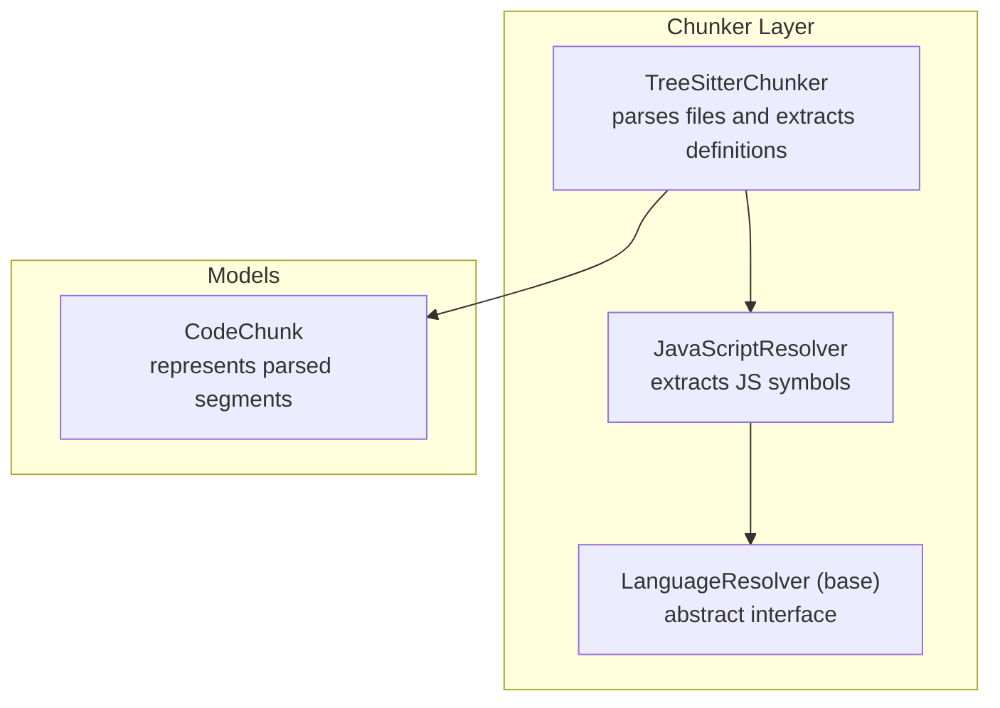
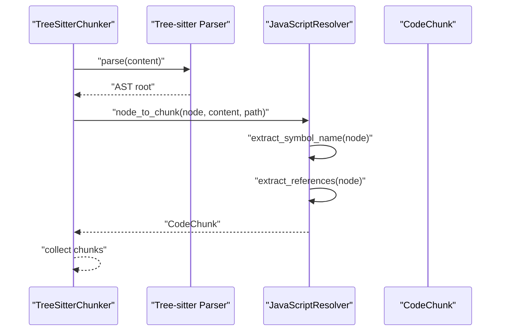
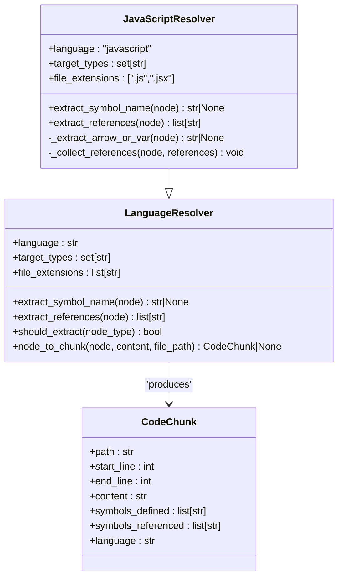
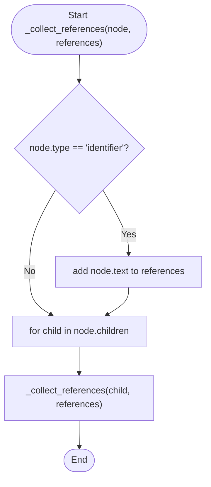
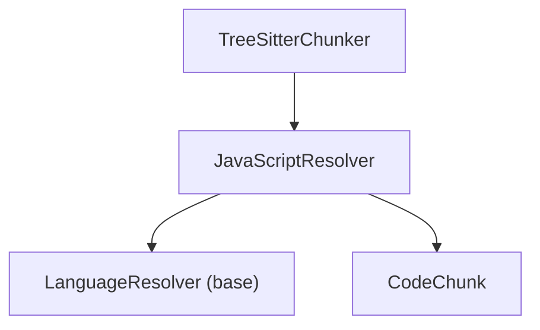

# JavaScript Resolver

<cite>
**Referenced Files in This Document**
- [javascript.py](file://src/ws_ctx_engine/chunker/resolvers/javascript.py)
- [base.py](file://src/ws_ctx_engine/chunker/resolvers/base.py)
- [tree_sitter.py](file://src/ws_ctx_engine/chunker/tree_sitter.py)
- [__init__.py](file://src/ws_ctx_engine/chunker/resolvers/__init__.py)
- [models.py](file://src/ws_ctx_engine/models/models.py)
- [test_resolvers.py](file://tests/unit/test_resolvers.py)
- [test_resolver_improvements.py](file://tests/unit/test_resolver_improvements.py)
</cite>

## Table of Contents
1. [Introduction](#introduction)
2. [Project Structure](#project-structure)
3. [Core Components](#core-components)
4. [Architecture Overview](#architecture-overview)
5. [Detailed Component Analysis](#detailed-component-analysis)
6. [Dependency Analysis](#dependency-analysis)
7. [Performance Considerations](#performance-considerations)
8. [Troubleshooting Guide](#troubleshooting-guide)
9. [Conclusion](#conclusion)

## Introduction
This document describes the JavaScript-specific language resolver implementation used to extract symbols and references from JavaScript code using Tree-sitter. It explains how AST node types are targeted, how symbols are extracted for functions, classes, variables, and modules, and how boundaries are identified for scopes and modules. It also covers modern JavaScript constructs, challenges such as hoisting and dynamic property access, and provides debugging strategies for parsing issues.

## Project Structure
The JavaScript resolver is part of a language-agnostic chunking pipeline that leverages Tree-sitter for parsing and a resolver abstraction to extract language-specific semantics.

**Diagram sources**
- [tree_sitter.py:15-160](file://src/ws_ctx_engine/chunker/tree_sitter.py#L15-L160)
- [javascript.py:6-85](file://src/ws_ctx_engine/chunker/resolvers/javascript.py#L6-L85)
- [base.py:7-70](file://src/ws_ctx_engine/chunker/resolvers/base.py#L7-L70)
- [models.py:10-152](file://src/ws_ctx_engine/models/models.py#L10-L152)

**Section sources**
- [tree_sitter.py:15-160](file://src/ws_ctx_engine/chunker/tree_sitter.py#L15-L160)
- [javascript.py:6-85](file://src/ws_ctx_engine/chunker/resolvers/javascript.py#L6-L85)
- [base.py:7-70](file://src/ws_ctx_engine/chunker/resolvers/base.py#L7-L70)
- [models.py:10-152](file://src/ws_ctx_engine/models/models.py#L10-L152)

## Core Components
- JavaScriptResolver: Implements JavaScript-specific symbol extraction and references collection.
- LanguageResolver (base): Defines the abstract interface for language-specific resolvers.
- TreeSitterChunker: Orchestrates parsing and uses resolvers to extract definitions.
- CodeChunk: Data model representing parsed code segments with metadata.

Key responsibilities:
- Target AST node types for JavaScript (functions, classes, methods, lexical declarations, JSX, exports, generator functions).
- Extract symbol names from AST nodes.
- Collect referenced identifiers from expressions.
- Convert AST nodes to CodeChunk instances with accurate boundaries.

**Section sources**
- [javascript.py:6-85](file://src/ws_ctx_engine/chunker/resolvers/javascript.py#L6-L85)
- [base.py:7-70](file://src/ws_ctx_engine/chunker/resolvers/base.py#L7-L70)
- [tree_sitter.py:15-160](file://src/ws_ctx_engine/chunker/tree_sitter.py#L15-L160)
- [models.py:10-152](file://src/ws_ctx_engine/models/models.py#L10-L152)

## Architecture Overview
The JavaScript resolver participates in a two-stage process:
1. Tree-sitter parses source files into ASTs.
2. The JavaScriptResolver inspects targeted AST nodes and produces CodeChunk objects.

**Diagram sources**
- [tree_sitter.py:91-114](file://src/ws_ctx_engine/chunker/tree_sitter.py#L91-L114)
- [javascript.py:48-69](file://src/ws_ctx_engine/chunker/resolvers/javascript.py#L48-L69)
- [base.py:48-69](file://src/ws_ctx_engine/chunker/resolvers/base.py#L48-L69)

## Detailed Component Analysis

### JavaScriptResolver Implementation
The JavaScriptResolver targets specific Tree-sitter node types and implements symbol extraction and reference collection.

Target AST node types:
- function_declaration
- class_declaration
- method_definition
- lexical_declaration
- jsx_element
- jsx_self_closing_element
- export_statement
- generator_function_declaration

Symbol extraction logic:
- Function/class/generator declarations: look for an identifier among children.
- Method definitions: look for a property_identifier.
- Lexical declarations: delegate to internal helper to handle arrow functions and var/let/const declarations.
- Export statements: if the export wraps a function or class declaration, extract the identifier from the child declaration.
- JSX elements: extract component names from jsx_identifier or jsx_closing_element.

Reference extraction logic:
- Recursively traverse the AST and collect all identifier nodes.

**Diagram sources**
- [base.py:7-70](file://src/ws_ctx_engine/chunker/resolvers/base.py#L7-L70)
- [javascript.py:6-85](file://src/ws_ctx_engine/chunker/resolvers/javascript.py#L6-L85)
- [models.py:10-152](file://src/ws_ctx_engine/models/models.py#L10-L152)

**Section sources**
- [javascript.py:6-85](file://src/ws_ctx_engine/chunker/resolvers/javascript.py#L6-L85)
- [base.py:7-70](file://src/ws_ctx_engine/chunker/resolvers/base.py#L7-L70)
- [models.py:10-152](file://src/ws_ctx_engine/models/models.py#L10-L152)

### Symbol Extraction Details
- Function declarations: identifier child yields the function name.
- Class declarations: identifier child yields the class name.
- Generator functions: function with "*" marker and identifier yields the generator name.
- Method definitions: property_identifier child yields the method name.
- Lexical declarations: internal helper identifies identifiers in variable_declarators and detects arrow functions.
- Export statements: if wrapping function/class declarations, extract the identifier from the child declaration.
- JSX elements: jsx_identifier or jsx_closing_element yields the component name.

Examples validated by tests:
- Function declaration extraction.
- Class declaration extraction.
- Generator function declaration extraction.
- JSX component extraction.
- Exported function/class extraction.

**Section sources**
- [javascript.py:30-59](file://src/ws_ctx_engine/chunker/resolvers/javascript.py#L30-L59)
- [test_resolvers.py:340-398](file://tests/unit/test_resolvers.py#L340-L398)
- [test_resolver_improvements.py:85-140](file://tests/unit/test_resolver_improvements.py#L85-L140)

### Reference Extraction Details
The JavaScriptResolver collects references by traversing all identifier nodes under a given AST node. This ensures that symbols referenced in expressions, calls, and member accesses are captured.

**Diagram sources**
- [javascript.py:75-85](file://src/ws_ctx_engine/chunker/resolvers/javascript.py#L75-L85)

**Section sources**
- [javascript.py:75-85](file://src/ws_ctx_engine/chunker/resolvers/javascript.py#L75-L85)

### Module Boundary Handling
Module boundaries are handled at the Tree-sitter chunker level:
- File-level imports are extracted and added to the symbols_referenced list for each chunk.
- Import types recognized for JavaScript include import_statement.

This ensures that cross-file symbol references are captured even when not explicitly declared within a file’s AST.

**Section sources**
- [tree_sitter.py:18-23](file://src/ws_ctx_engine/chunker/tree_sitter.py#L18-L23)
- [tree_sitter.py:116-143](file://src/ws_ctx_engine/chunker/tree_sitter.py#L116-L143)

### Modern JavaScript Constructs Support
- Generator functions: generator_function_declaration is included in target types and symbol extraction handles the "*" marker and identifier.
- JSX: jsx_element and jsx_self_closing_element are targeted; component names are extracted from jsx_identifier.
- Export statements: export_statement is targeted; exported function/class declarations are recognized and their identifiers are extracted.

Validation via tests:
- Generator function declaration target type and symbol extraction.
- JSX element target type and component name extraction.
- Exported function/class extraction.

**Section sources**
- [javascript.py:14-24](file://src/ws_ctx_engine/chunker/resolvers/javascript.py#L14-L24)
- [javascript.py:30-59](file://src/ws_ctx_engine/chunker/resolvers/javascript.py#L30-L59)
- [test_resolvers.py:368-398](file://tests/unit/test_resolvers.py#L368-L398)
- [test_resolver_improvements.py:85-140](file://tests/unit/test_resolver_improvements.py#L85-L140)

### JavaScript-Specific Challenges
- Hoisting: The resolver operates on AST nodes and does not implement semantic hoisting resolution. Declarations are extracted only when encountered as targeted AST nodes.
- Dynamic property access: Member expressions and computed properties are captured as identifiers during reference extraction; deeper semantic analysis (e.g., prototype chains) is not performed by the resolver.
- Prototype-based inheritance: The resolver focuses on declarations and references; prototype relationships are not inferred from AST alone.

**Section sources**
- [javascript.py:75-85](file://src/ws_ctx_engine/chunker/resolvers/javascript.py#L75-L85)

### Browser vs Node.js Differences
The resolver itself is language-agnostic and does not differentiate between environments. However, the Tree-sitter chunker supports both environments because it parses files directly and relies on Tree-sitter grammars. Practical differences (e.g., global objects, module systems) are not handled by the resolver but may influence which AST nodes are present in the parsed code.

**Section sources**
- [tree_sitter.py:25-37](file://src/ws_ctx_engine/chunker/tree_sitter.py#L25-L37)

## Dependency Analysis
The JavaScript resolver integrates with the chunker and models as follows:

**Diagram sources**
- [__init__.py:9-16](file://src/ws_ctx_engine/chunker/resolvers/__init__.py#L9-L16)
- [javascript.py:6-85](file://src/ws_ctx_engine/chunker/resolvers/javascript.py#L6-L85)
- [base.py:7-70](file://src/ws_ctx_engine/chunker/resolvers/base.py#L7-L70)
- [models.py:10-152](file://src/ws_ctx_engine/models/models.py#L10-L152)

**Section sources**
- [__init__.py:9-16](file://src/ws_ctx_engine/chunker/resolvers/__init__.py#L9-L16)
- [javascript.py:6-85](file://src/ws_ctx_engine/chunker/resolvers/javascript.py#L6-L85)
- [base.py:7-70](file://src/ws_ctx_engine/chunker/resolvers/base.py#L7-L70)
- [models.py:10-152](file://src/ws_ctx_engine/models/models.py#L10-L152)

## Performance Considerations
- The resolver performs a linear traversal of AST nodes for reference extraction, which is efficient for typical JavaScript code sizes.
- Targeted node filtering reduces unnecessary traversal by only processing nodes matching the resolver’s target_types.
- Tree-sitter parsing overhead dominates; ensure appropriate include/exclude patterns to minimize file processing.

[No sources needed since this section provides general guidance]

## Troubleshooting Guide
Common issues and debugging strategies:
- Missing symbols: Verify that the target AST node type is included in target_types and that the resolver.should_extract(node.type) returns True.
- Incorrect symbol names: Inspect the AST node structure to ensure the expected identifier child exists; adjust extraction logic if node types differ.
- Missing references: Confirm that identifier nodes are reachable from the targeted node; consider adjusting traversal depth or node selection.
- Import resolution: Ensure import_statement nodes are being processed; confirm that file-level imports are collected and attached to chunks.

Validation references:
- Unit tests for JavaScript resolver behavior and symbol extraction.
- Export extraction tests validating exported function/class symbols.

**Section sources**
- [test_resolvers.py:327-502](file://tests/unit/test_resolvers.py#L327-L502)
- [test_resolver_improvements.py:76-140](file://tests/unit/test_resolver_improvements.py#L76-L140)

## Conclusion
The JavaScript resolver provides a focused, Tree-sitter-backed extractor for JavaScript symbols and references. It targets essential constructs (functions, classes, methods, lexical declarations, JSX, exports, generators) and integrates cleanly with the chunker pipeline. While it does not implement advanced semantic analyses (hoisting, prototype inference), it reliably captures declarations and references for downstream processing. For robust parsing, ensure Tree-sitter dependencies are installed and use appropriate include/exclude patterns to optimize performance.