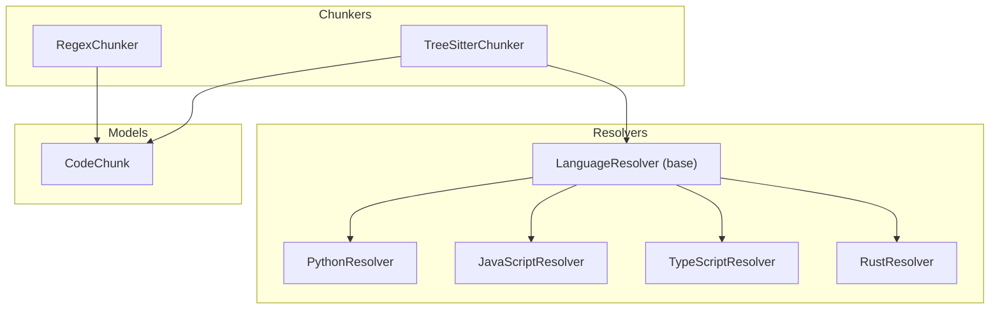
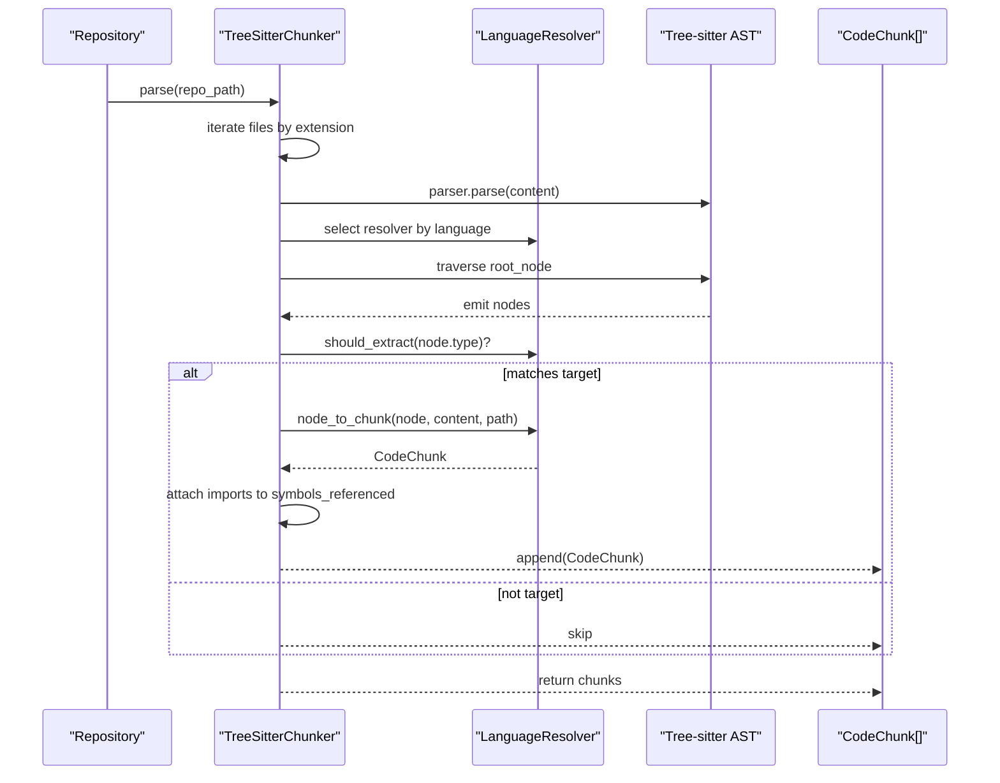
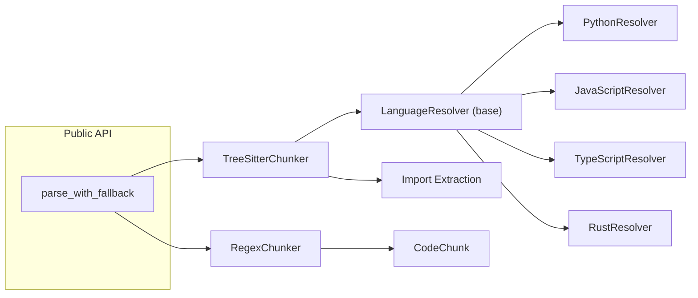

# Language-Specific Resolvers

<cite>
**Referenced Files in This Document**
- [base.py](file://src/ws_ctx_engine/chunker/resolvers/base.py)
- [python.py](file://src/ws_ctx_engine/chunker/resolvers/python.py)
- [javascript.py](file://src/ws_ctx_engine/chunker/resolvers/javascript.py)
- [typescript.py](file://src/ws_ctx_engine/chunker/resolvers/typescript.py)
- [rust.py](file://src/ws_ctx_engine/chunker/resolvers/rust.py)
- [__init__.py](file://src/ws_ctx_engine/chunker/resolvers/__init__.py)
- [tree_sitter.py](file://src/ws_ctx_engine/chunker/tree_sitter.py)
- [regex.py](file://src/ws_ctx_engine/chunker/regex.py)
- [base.py](file://src/ws_ctx_engine/chunker/base.py)
- [__init__.py](file://src/ws_ctx_engine/chunker/__init__.py)
- [models.py](file://src/ws_ctx_engine/models/models.py)
- [test_resolvers.py](file://tests/unit/test_resolvers.py)
- [test_resolver_improvements.py](file://tests/unit/test_resolver_improvements.py)
- [test_typescript_edge_cases.py](file://tests/unit/test_typescript_edge_cases.py)
- [test_regex_edge_cases.py](file://tests/unit/test_regex_edge_cases.py)
</cite>

## Update Summary
**Changes Made**
- Added Python 3.12 forward compatibility section documenting the `from __future__ import annotations` additions
- Updated all resolver implementation sections to reflect the new import statements
- Enhanced troubleshooting guide with Python 3.12 compatibility considerations

## Table of Contents
1. [Introduction](#introduction)
2. [Project Structure](#project-structure)
3. [Core Components](#core-components)
4. [Architecture Overview](#architecture-overview)
5. [Detailed Component Analysis](#detailed-component-analysis)
6. [Python 3.12 Forward Compatibility](#python-312-forward-compatibility)
7. [Dependency Analysis](#dependency-analysis)
8. [Performance Considerations](#performance-considerations)
9. [Troubleshooting Guide](#troubleshooting-guide)
10. [Conclusion](#conclusion)
11. [Appendices](#appendices)

## Introduction
This document explains the language-specific resolver system used by the AST chunking pipeline. It covers the resolver pattern, the base resolver interface, and the concrete implementations for Python, JavaScript, TypeScript, and Rust. It also documents symbol extraction algorithms, function/method identification, class boundary detection, and variable scope analysis per language. The document details fallback mechanisms when Tree-sitter parsing fails, regex-based fallback strategies, and content preservation techniques. Finally, it provides usage examples, guidelines for developing custom resolvers, integration with the AST chunking pipeline, language-specific edge cases, performance optimizations, and debugging techniques for resolver failures.

**Updated** Added comprehensive coverage of Python 3.12 forward compatibility improvements that ensure seamless operation across Python versions.

## Project Structure
The resolver system resides under the chunker module and integrates with Tree-sitter and regex-based chunkers. The high-level structure is:
- Resolvers: language-specific implementations of the base resolver interface
- Chunkers: Tree-sitter and regex-based parsers that use resolvers
- Models: shared data structures like CodeChunk
- Tests: unit and integration tests validating resolver behavior and edge cases



**Diagram sources**
- [base.py:7-69](file://src/ws_ctx_engine/chunker/resolvers/base.py#L7-L69)
- [python.py:6-61](file://src/ws_ctx_engine/chunker/resolvers/python.py#L6-L61)
- [javascript.py:6-85](file://src/ws_ctx_engine/chunker/resolvers/javascript.py#L6-L85)
- [typescript.py:6-103](file://src/ws_ctx_engine/chunker/resolvers/typescript.py#L6-L103)
- [rust.py:6-55](file://src/ws_ctx_engine/chunker/resolvers/rust.py#L6-L55)
- [tree_sitter.py:15-159](file://src/ws_ctx_engine/chunker/tree_sitter.py#L15-L159)
- [regex.py:15-219](file://src/ws_ctx_engine/chunker/regex.py#L15-L219)
- [models.py:10-84](file://src/ws_ctx_engine/models/models.py#L10-L84)

**Section sources**
- [base.py:1-70](file://src/ws_ctx_engine/chunker/resolvers/base.py#L1-L70)
- [__init__.py:1-26](file://src/ws_ctx_engine/chunker/resolvers/__init__.py#L1-L26)
- [tree_sitter.py:1-160](file://src/ws_ctx_engine/chunker/tree_sitter.py#L1-L160)
- [regex.py:1-219](file://src/ws_ctx_engine/chunker/regex.py#L1-L219)
- [models.py:1-152](file://src/ws_ctx_engine/models/models.py#L1-L152)

## Core Components
- LanguageResolver (base): Defines the contract for language-specific resolvers, including language identity, target AST node types, file extensions, symbol name extraction, reference extraction, and conversion of AST nodes to CodeChunk instances.
- PythonResolver: Targets function/class definitions, decorated definitions, and type aliases; extracts identifiers and collects references via traversal.
- JavaScriptResolver: Targets function/class/method declarations, lexical declarations, JSX elements, generator functions, and export statements; extracts identifiers and collects references.
- TypeScriptResolver: Extends JS targets with interfaces, type aliases, enums, abstract classes, internal modules; supports export statements and JSX; extracts identifiers and collects references.
- RustResolver: Targets function, struct, trait, impl, enum, const, type, static, mod, macro, union, and function signature items; extracts identifiers and collects references.
- TreeSitterChunker: Uses language-specific resolvers to convert AST nodes into CodeChunk instances, with import extraction integrated per language.
- RegexChunker: Provides a regex-based fallback with language-specific patterns for imports and definitions, block boundary detection, and content preservation.
- CodeChunk: Shared model representing a parsed code segment with metadata.

**Section sources**
- [base.py:7-69](file://src/ws_ctx_engine/chunker/resolvers/base.py#L7-L69)
- [python.py:6-61](file://src/ws_ctx_engine/chunker/resolvers/python.py#L6-L61)
- [javascript.py:6-85](file://src/ws_ctx_engine/chunker/resolvers/javascript.py#L6-L85)
- [typescript.py:6-103](file://src/ws_ctx_engine/chunker/resolvers/typescript.py#L6-L103)
- [rust.py:6-55](file://src/ws_ctx_engine/chunker/resolvers/rust.py#L6-L55)
- [tree_sitter.py:15-159](file://src/ws_ctx_engine/chunker/tree_sitter.py#L15-L159)
- [regex.py:15-219](file://src/ws_ctx_engine/chunker/regex.py#L15-L219)
- [models.py:10-84](file://src/ws_ctx_engine/models/models.py#L10-L84)

## Architecture Overview
The resolver system is invoked by the Tree-sitter chunker. It selects the appropriate resolver based on file extension, traverses AST nodes, checks if a node matches target types, and converts matching nodes to CodeChunk instances. Import statements are extracted separately and attached to chunks. A fallback mechanism switches to RegexChunker when Tree-sitter is unavailable or fails.



**Diagram sources**
- [tree_sitter.py:57-159](file://src/ws_ctx_engine/chunker/tree_sitter.py#L57-L159)
- [base.py:48-69](file://src/ws_ctx_engine/chunker/resolvers/base.py#L48-L69)
- [__init__.py:9-16](file://src/ws_ctx_engine/chunker/resolvers/__init__.py#L9-L16)

**Section sources**
- [tree_sitter.py:15-159](file://src/ws_ctx_engine/chunker/tree_sitter.py#L15-L159)
- [__init__.py:1-26](file://src/ws_ctx_engine/chunker/resolvers/__init__.py#L1-L26)

## Detailed Component Analysis

### Base Resolver Interface
The base resolver defines:
- language: identifier string
- target_types: set of AST node types to extract
- file_extensions: optional file extensions list
- extract_symbol_name(node): returns the primary symbol name for a node
- extract_references(node): returns a list of referenced symbols
- should_extract(node_type): convenience predicate
- node_to_chunk(node, content, file_path): converts an AST node to a CodeChunk with accurate line numbers and content slice

Key behaviors:
- Line numbers are 1-indexed
- Content bytes are sliced to preserve original encoding
- Symbols_defined includes the extracted symbol name when present
- Symbols_referenced is populated by the resolver's reference collector

**Section sources**
- [base.py:7-69](file://src/ws_ctx_engine/chunker/resolvers/base.py#L7-L69)

### Python Resolver
Target types:
- function_definition
- class_definition
- decorated_definition
- type_alias_statement

Symbol extraction:
- For function_definition and class_definition, the identifier child is extracted.
- For decorated_definition, recursively inspects children to find function or class definitions and extracts the identifier.
- For type_alias_statement, extracts the identifier.

Reference extraction:
- Traverses all children and collects identifier nodes into a set to avoid duplicates.

Scope and boundaries:
- Function/class bodies are captured by slicing content between start_byte/end_byte.
- Decorators and type aliases are supported via dedicated branches.

Edge cases covered by tests:
- Async function definitions with async child
- Decorated functions and classes
- Type alias statements
- Reference extraction from call expressions and member access

**Section sources**
- [python.py:6-61](file://src/ws_ctx_engine/chunker/resolvers/python.py#L6-L61)
- [test_resolvers.py:225-325](file://tests/unit/test_resolvers.py#L225-L325)
- [test_resolver_improvements.py:18-74](file://tests/unit/test_resolver_improvements.py#L18-L74)

### JavaScript Resolver
Target types:
- function_declaration
- class_declaration
- method_definition
- lexical_declaration
- jsx_element
- jsx_self_closing_element
- export_statement
- generator_function_declaration

Symbol extraction:
- function_declaration, class_declaration, generator_function_declaration: identifier child
- method_definition: property_identifier child
- lexical_declaration: special handling to detect arrow functions and extract the variable name
- export_statement: inspect children for function/class declarations and extract identifier
- jsx_element/jsx_self_closing_element: extract jsx_identifier or jsx_closing_element identifier

Reference extraction:
- Collects identifier nodes from all descendants.

Scope and boundaries:
- Method definitions and class bodies are captured by slicing content between start_byte/end_byte.
- Arrow functions in lexical_declaration are handled to extract variable names.

Edge cases covered by tests:
- Generator function declarations
- JSX element extraction
- Exported functions and classes
- References from class declarations

**Section sources**
- [javascript.py:6-85](file://src/ws_ctx_engine/chunker/resolvers/javascript.py#L6-L85)
- [test_resolvers.py:327-403](file://tests/unit/test_resolvers.py#L327-L403)
- [test_resolver_improvements.py:85-141](file://tests/unit/test_resolver_improvements.py#L85-L141)

### TypeScript Resolver
Target types:
- function_declaration
- class_declaration
- method_definition
- interface_declaration
- type_alias_declaration
- enum_declaration
- abstract_class_declaration
- lexical_declaration
- jsx_element
- jsx_self_closing_element
- export_statement
- internal_module

Symbol extraction:
- Similar to JavaScript but includes interface_declaration, type_alias_declaration, enum_declaration, abstract_class_declaration, and internal_module.
- For export_statement, supports multiple declaration types.
- For lexical_declaration, arrow function detection mirrors JavaScript.

Reference extraction:
- Identical to JavaScript, collecting identifiers from all descendants.

Scope and boundaries:
- Handles TypeScript-specific constructs like interfaces, enums, abstract classes, and internal modules.
- Supports JSX elements.

Edge cases covered by tests:
- Interface and type alias declarations
- Exported interfaces and enums
- Abstract class declarations
- Lexical declarations with arrow functions
- Exported abstract classes

**Section sources**
- [typescript.py:6-103](file://src/ws_ctx_engine/chunker/resolvers/typescript.py#L6-L103)
- [test_resolvers.py:401-455](file://tests/unit/test_resolvers.py#L401-L455)
- [test_typescript_edge_cases.py:1-172](file://tests/unit/test_typescript_edge_cases.py#L1-L172)

### Rust Resolver
Target types:
- function_item
- struct_item
- trait_item
- impl_item
- enum_item
- const_item
- type_item
- static_item
- mod_item
- macro_definition
- union_item
- function_signature_item

Symbol extraction:
- For impl_item, extracts the type identifier (not the "impl" keyword) to represent the type being implemented.
- For others, extracts the identifier child.

Reference extraction:
- Collects identifier nodes from all descendants.

Scope and boundaries:
- Function bodies and blocks are captured by slicing content between start_byte/end_byte.
- Scoped use declarations are handled in the Tree-sitter chunker's import extraction.

Edge cases covered by tests:
- Impl blocks with and without generics
- Struct, trait, enum, const, type, mod, macro, union, function signature items
- Scoped use declarations in imports

**Section sources**
- [rust.py:6-55](file://src/ws_ctx_engine/chunker/resolvers/rust.py#L6-L55)
- [test_resolvers.py:15-223](file://tests/unit/test_resolvers.py#L15-L223)
- [test_resolver_improvements.py:211-274](file://tests/unit/test_resolver_improvements.py#L211-L274)

### Tree-Sitter Chunker Integration
- Language mapping: file extensions to languages and language to resolver
- Import extraction: separate traversal of import statements per language adds referenced symbols to chunks
- AST traversal: recursively visits nodes, applies resolver.should_extract, and converts matches to CodeChunk

Fallback behavior:
- parse_with_fallback attempts TreeSitterChunker and falls back to RegexChunker on ImportError or general exceptions

**Section sources**
- [tree_sitter.py:15-159](file://src/ws_ctx_engine/chunker/tree_sitter.py#L15-L159)
- [__init__.py:17-37](file://src/ws_ctx_engine/chunker/__init__.py#L17-L37)

### Regex Chunker Fallback
- Language-specific patterns for imports and definitions
- Block boundary detection:
  - Braced languages: brace matching with string and comment awareness
  - Python: indentation-aware end detection
- Content preservation: reconstructs chunk content from split lines and computed boundaries
- Import references: collected from import patterns and attached to chunks

**Section sources**
- [regex.py:15-219](file://src/ws_ctx_engine/chunker/regex.py#L15-L219)

### CodeChunk Model
- Fields: path, start_line, end_line, content, symbols_defined, symbols_referenced, language
- Serialization helpers for caching and staleness detection
- Token counting helper for downstream consumers

**Section sources**
- [models.py:10-84](file://src/ws_ctx_engine/models/models.py#L10-L84)

## Python 3.12 Forward Compatibility

**Updated** All resolver modules have been updated to support Python 3.12's postponed evaluation of annotations through the addition of `from __future__ import annotations`.

The resolver system now includes forward-compatible type annotations that work seamlessly across Python versions:

### Implementation Details
Each resolver module begins with the forward compatibility import:
```python
from __future__ import annotations
```

This ensures that:
- Type hints are stored as strings rather than being evaluated immediately
- Backward compatibility with Python < 3.12 is maintained
- Forward compatibility with Python 3.12+ is achieved
- No runtime performance impact on older Python versions

### Affected Modules
All resolver modules have been updated:
- `src/ws_ctx_engine/chunker/resolvers/base.py`
- `src/ws_ctx_engine/chunker/resolvers/python.py`
- `src/ws_ctx_engine/chunker/resolvers/javascript.py`
- `src/ws_ctx_engine/chunker/resolvers/typescript.py`
- `src/ws_ctx_engine/chunker/resolvers/rust.py`
- `src/ws_ctx_engine/chunker/resolvers/__init__.py`
- `src/ws_ctx_engine/chunker/tree_sitter.py`

### Benefits
- **Seamless Migration**: Projects can upgrade to Python 3.12 without resolver code modifications
- **Enhanced Type Safety**: Full type hint support in modern Python versions
- **Future-Proof Design**: Maintains compatibility with upcoming Python releases
- **Zero Runtime Overhead**: The `__future__` import has no performance impact

**Section sources**
- [base.py:1](file://src/ws_ctx_engine/chunker/resolvers/base.py#L1)
- [python.py:1](file://src/ws_ctx_engine/chunker/resolvers/python.py#L1)
- [javascript.py:1](file://src/ws_ctx_engine/chunker/resolvers/javascript.py#L1)
- [typescript.py:1](file://src/ws_ctx_engine/chunker/resolvers/typescript.py#L1)
- [rust.py:1](file://src/ws_ctx_engine/chunker/resolvers/rust.py#L1)
- [__init__.py:1](file://src/ws_ctx_engine/chunker/resolvers/__init__.py#L1)
- [tree_sitter.py:1](file://src/ws_ctx_engine/chunker/tree_sitter.py#L1)

## Dependency Analysis
The resolver system is decoupled from the chunkers via the LanguageResolver interface. The Tree-sitter chunker depends on resolvers and import extraction logic, while the regex chunker operates independently. The fallback mechanism ensures robustness.



**Diagram sources**
- [base.py:7-69](file://src/ws_ctx_engine/chunker/resolvers/base.py#L7-L69)
- [python.py:6-61](file://src/ws_ctx_engine/chunker/resolvers/python.py#L6-L61)
- [javascript.py:6-85](file://src/ws_ctx_engine/chunker/resolvers/javascript.py#L6-L85)
- [typescript.py:6-103](file://src/ws_ctx_engine/chunker/resolvers/typescript.py#L6-L103)
- [rust.py:6-55](file://src/ws_ctx_engine/chunker/resolvers/rust.py#L6-L55)
- [tree_sitter.py:15-159](file://src/ws_ctx_engine/chunker/tree_sitter.py#L15-L159)
- [regex.py:15-219](file://src/ws_ctx_engine/chunker/regex.py#L15-L219)
- [__init__.py:17-37](file://src/ws_ctx_engine/chunker/__init__.py#L17-L37)

**Section sources**
- [__init__.py:1-26](file://src/ws_ctx_engine/chunker/resolvers/__init__.py#L1-L26)
- [tree_sitter.py:15-159](file://src/ws_ctx_engine/chunker/tree_sitter.py#L15-L159)
- [regex.py:15-219](file://src/ws_ctx_engine/chunker/regex.py#L15-L219)
- [__init__.py:17-37](file://src/ws_ctx_engine/chunker/__init__.py#L17-L37)

## Performance Considerations
- Tree-sitter parsing is efficient for large codebases; ensure language parsers are installed to avoid fallback overhead.
- Resolver traversal is linear in the number of nodes; keep target_types minimal and precise to reduce unnecessary work.
- Regex fallback is slower and less accurate; it is intended for environments without Tree-sitter or for files that fail Tree-sitter parsing.
- Content slicing uses byte offsets to minimize string copies; ensure content is read once per file.
- Deduplication across files is ensured by the chunker to avoid redundant processing.
- **Updated** Python 3.12 forward compatibility has zero runtime performance impact and maintains optimal performance characteristics.

## Troubleshooting Guide
Common failure modes and debugging techniques:
- Tree-sitter not installed or failing:
  - The fallback mechanism logs warnings and switches to RegexChunker. Verify installation of py-tree-sitter and language bindings.
- Empty or partial chunks:
  - Check that target_types include the desired node types and that extract_symbol_name handles all relevant node types.
- Incorrect symbol names:
  - Validate identifier extraction logic for each construct (e.g., decorated definitions, export statements, JSX).
- Missing references:
  - Confirm import extraction is enabled for the language and that reference collectors traverse all identifier nodes.
- Regex edge cases:
  - Review regex patterns for comments, strings, and template literals. Tests demonstrate handling of braces in strings, comments, and multiline constructs.
- **Updated** Python 3.12 compatibility issues:
  - All resolver modules include `from __future__ import annotations` for forward compatibility
  - No manual intervention required for Python 3.12+ upgrades
  - Type hints work correctly in both old and new Python versions

**Section sources**
- [__init__.py:17-37](file://src/ws_ctx_engine/chunker/__init__.py#L17-L37)
- [tree_sitter.py:84-88](file://src/ws_ctx_engine/chunker/tree_sitter.py#L84-L88)
- [regex.py:100-104](file://src/ws_ctx_engine/chunker/regex.py#L100-L104)
- [test_regex_edge_cases.py:20-254](file://tests/unit/test_regex_edge_cases.py#L20-L254)

## Conclusion
The resolver system provides a clean, extensible pattern for language-specific code extraction. By leveraging Tree-sitter for accurate AST parsing and falling back to regex-based strategies, it achieves robustness across diverse environments. The modular design allows easy addition of new languages and refinement of existing resolvers. **Updated** The recent Python 3.12 forward compatibility improvements ensure seamless operation across Python versions while maintaining optimal performance characteristics.

## Appendices

### Resolver Usage Examples
- Python:
  - Extract decorated functions and classes, type aliases
  - References include identifiers from call expressions and attribute access
- JavaScript:
  - Extract function/class/method declarations, generator functions, export statements, JSX elements
  - References include identifiers from call expressions and class declarations
- TypeScript:
  - Extract interfaces, type aliases, enums, abstract classes, internal modules, export statements, JSX
  - References include identifiers and type annotations
- Rust:
  - Extract function, struct, trait, impl, enum, const, type, static, mod, macro, union, function signature items
  - References include identifiers and scoped use declarations

**Section sources**
- [test_resolvers.py:15-556](file://tests/unit/test_resolvers.py#L15-L556)
- [test_resolver_improvements.py:1-343](file://tests/unit/test_resolver_improvements.py#L1-L343)
- [test_typescript_edge_cases.py:1-172](file://tests/unit/test_typescript_edge_cases.py#L1-L172)
- [test_regex_edge_cases.py:1-254](file://tests/unit/test_regex_edge_cases.py#L1-L254)

### Custom Resolver Development Guidelines
- Define language, target_types, and file_extensions
- Implement extract_symbol_name to return the primary symbol name for each target node type
- Implement extract_references to collect all referenced identifiers
- Use should_extract to filter nodes efficiently
- Integrate with TreeSitterChunker by registering the resolver in ALL_RESOLVERS
- Add language mapping in TreeSitterChunker and import extraction logic if needed
- Write unit tests covering symbol extraction, reference extraction, and edge cases
- **Updated** Include `from __future__ import annotations` at the top of new resolver modules for Python 3.12 compatibility

**Section sources**
- [base.py:7-69](file://src/ws_ctx_engine/chunker/resolvers/base.py#L7-L69)
- [__init__.py:9-16](file://src/ws_ctx_engine/chunker/resolvers/__init__.py#L9-L16)
- [tree_sitter.py:40-54](file://src/ws_ctx_engine/chunker/tree_sitter.py#L40-L54)

### Integration with AST Chunking Pipeline
- TreeSitterChunker:
  - Selects resolver by language
  - Traverses AST nodes and converts matches to CodeChunk
  - Attaches imports to symbols_referenced
- RegexChunker:
  - Operates independently with language-specific patterns
  - Preserves content and computes boundaries carefully

**Section sources**
- [tree_sitter.py:57-159](file://src/ws_ctx_engine/chunker/tree_sitter.py#L57-L159)
- [regex.py:75-143](file://src/ws_ctx_engine/chunker/regex.py#L75-L143)

### Language-Specific Edge Cases
- Python:
  - Decorated functions and async functions
  - Type aliases and call expressions
- JavaScript:
  - Generator functions, export statements, JSX elements
- TypeScript:
  - Interfaces, type aliases, enums, abstract classes, internal modules, export statements, arrow functions in lexical declarations
- Rust:
  - Impl blocks (with and without generics), scoped use declarations, unions, function signatures

**Section sources**
- [test_resolver_improvements.py:1-343](file://tests/unit/test_resolver_improvements.py#L1-L343)
- [test_typescript_edge_cases.py:1-172](file://tests/unit/test_typescript_edge_cases.py#L1-L172)
- [test_regex_edge_cases.py:1-254](file://tests/unit/test_regex_edge_cases.py#L1-L254)