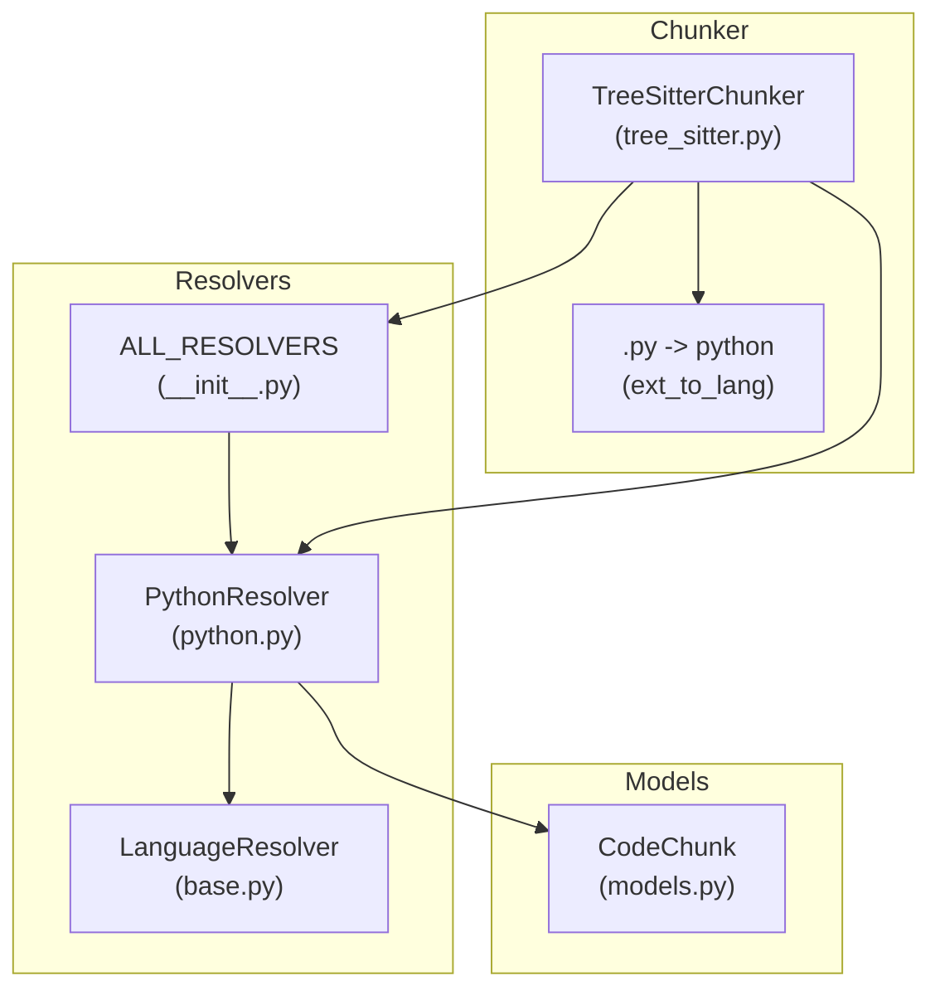
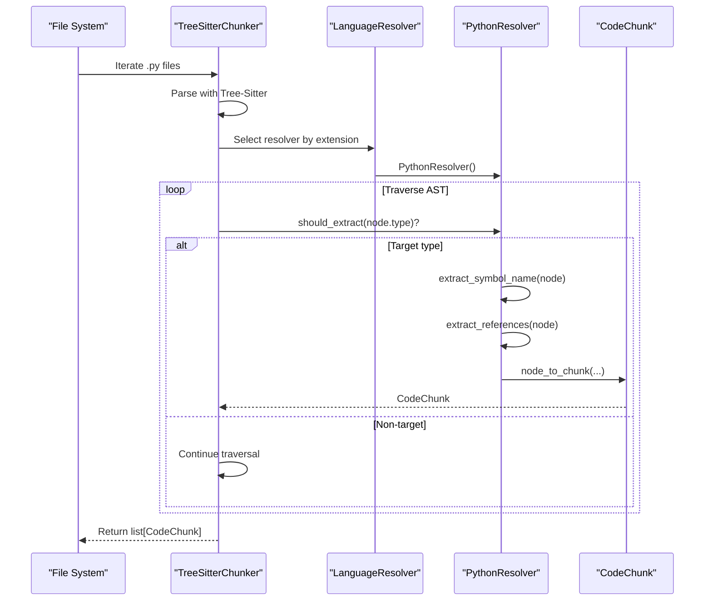
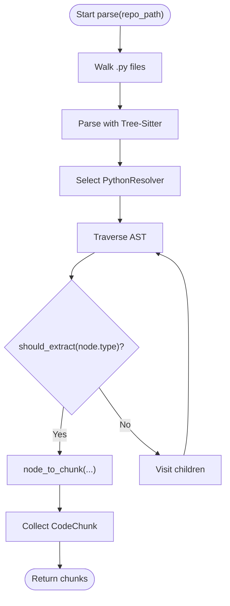
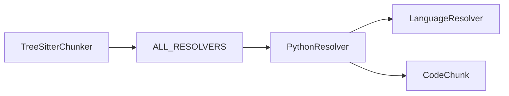

# Python Resolver

<cite>
**Referenced Files in This Document**
- [python.py](file://src/ws_ctx_engine/chunker/resolvers/python.py)
- [base.py](file://src/ws_ctx_engine/chunker/resolvers/base.py)
- [__init__.py](file://src/ws_ctx_engine/chunker/resolvers/__init__.py)
- [tree_sitter.py](file://src/ws_ctx_engine/chunker/tree_sitter.py)
- [base.py](file://src/ws_ctx_engine/chunker/base.py)
- [models.py](file://src/ws_ctx_engine/models/models.py)
- [regex.py](file://src/ws_ctx_engine/chunker/regex.py)
- [test_resolvers.py](file://tests/unit/test_resolvers.py)
</cite>

## Table of Contents
1. [Introduction](#introduction)
2. [Project Structure](#project-structure)
3. [Core Components](#core-components)
4. [Architecture Overview](#architecture-overview)
5. [Detailed Component Analysis](#detailed-component-analysis)
6. [Dependency Analysis](#dependency-analysis)
7. [Performance Considerations](#performance-considerations)
8. [Troubleshooting Guide](#troubleshooting-guide)
9. [Conclusion](#conclusion)

## Introduction
This document explains the Python-specific language resolver implementation used to extract symbols and references from Python code via Tree-Sitter ASTs. It covers:
- AST node targeting for functions, classes, decorated definitions, and type alias statements
- Symbol extraction for function/class names and identifiers
- Reference extraction for identifiers across expressions
- How the resolver integrates into the Tree-Sitter chunker pipeline
- Edge cases and limitations observed in the current implementation
- Performance considerations and debugging techniques

## Project Structure
The Python resolver lives in the resolvers package and is selected by the Tree-Sitter chunker based on file extensions. The resolver inherits from a shared LanguageResolver base class and produces CodeChunk instances consumed downstream.



**Diagram sources**
- [python.py:6-24](file://src/ws_ctx_engine/chunker/resolvers/python.py#L6-L24)
- [base.py:7-70](file://src/ws_ctx_engine/chunker/resolvers/base.py#L7-L70)
- [__init__.py:9-16](file://src/ws_ctx_engine/chunker/resolvers/__init__.py#L9-L16)
- [tree_sitter.py:40-54](file://src/ws_ctx_engine/chunker/tree_sitter.py#L40-L54)
- [models.py:10-34](file://src/ws_ctx_engine/models/models.py#L10-L34)

**Section sources**
- [python.py:6-24](file://src/ws_ctx_engine/chunker/resolvers/python.py#L6-L24)
- [base.py:7-70](file://src/ws_ctx_engine/chunker/resolvers/base.py#L7-L70)
- [__init__.py:9-16](file://src/ws_ctx_engine/chunker/resolvers/__init__.py#L9-L16)
- [tree_sitter.py:40-54](file://src/ws_ctx_engine/chunker/tree_sitter.py#L40-L54)
- [models.py:10-34](file://src/ws_ctx_engine/models/models.py#L10-L34)

## Core Components
- PythonResolver: Implements language identification, target AST node types, symbol extraction, and reference extraction for Python.
- LanguageResolver: Abstract base defining the resolver interface used by all languages.
- TreeSitterChunker: Orchestrates parsing, selects the appropriate resolver per file extension, and collects chunks.
- CodeChunk: The normalized output carrying path, line numbers, content, defined symbols, referenced symbols, and language.

Key behaviors:
- Target types include function_definition, class_definition, decorated_definition, and type_alias_statement.
- Symbol extraction returns the first identifier found under supported nodes.
- Reference extraction traverses the AST to collect all identifiers.

**Section sources**
- [python.py:6-61](file://src/ws_ctx_engine/chunker/resolvers/python.py#L6-L61)
- [base.py:7-70](file://src/ws_ctx_engine/chunker/resolvers/base.py#L7-L70)
- [tree_sitter.py:15-160](file://src/ws_ctx_engine/chunker/tree_sitter.py#L15-L160)
- [models.py:10-34](file://src/ws_ctx_engine/models/models.py#L10-L34)

## Architecture Overview
The resolver participates in a two-stage process:
1. Tree-Sitter parsing produces an AST per file.
2. The chunker traverses the AST, applies the language-specific resolver, and emits CodeChunk objects.



**Diagram sources**
- [tree_sitter.py:57-114](file://src/ws_ctx_engine/chunker/tree_sitter.py#L57-L114)
- [tree_sitter.py:145-159](file://src/ws_ctx_engine/chunker/tree_sitter.py#L145-L159)
- [python.py:44-69](file://src/ws_ctx_engine/chunker/resolvers/python.py#L44-L69)
- [base.py:48-69](file://src/ws_ctx_engine/chunker/resolvers/base.py#L48-L69)
- [models.py:10-34](file://src/ws_ctx_engine/models/models.py#L10-L34)

## Detailed Component Analysis

### PythonResolver
Implements Python-specific logic:
- Language identity: "python"
- Target types: function_definition, class_definition, decorated_definition, type_alias_statement
- File extensions: [".py"]
- Symbol extraction: finds the first identifier under supported nodes
- Reference extraction: recursively collects all identifiers from the AST subtree

```mermaid
classDiagram
class LanguageResolver {
<<abstract>>
+language : str
+target_types : set[str]
+file_extensions : list[str]
+extract_symbol_name(node) str?
+extract_references(node) list[str]
+should_extract(node_type) bool
+node_to_chunk(node, content, file_path) CodeChunk?
}
class PythonResolver {
+language : "python"
+target_types : {"function_definition","class_definition","decorated_definition","type_alias_statement"}
+file_extensions : [".py"]
+extract_symbol_name(node) str?
+extract_references(node) list[str]
-_collect_references(node, seen) void
}
class CodeChunk {
+path : str
+start_line : int
+end_line : int
+content : str
+symbols_defined : list[str]
+symbols_referenced : list[str]
+language : str
}
PythonResolver --|> LanguageResolver
PythonResolver --> CodeChunk : "produces"
```

**Diagram sources**
- [base.py:7-70](file://src/ws_ctx_engine/chunker/resolvers/base.py#L7-L70)
- [python.py:6-61](file://src/ws_ctx_engine/chunker/resolvers/python.py#L6-L61)
- [models.py:10-34](file://src/ws_ctx_engine/models/models.py#L10-L34)

Implementation highlights:
- Function/class name extraction relies on locating an "identifier" among node children.
- Decorated definitions are handled by recursing into child nodes to find function or class definitions and then extracting the identifier.
- Type alias statements are treated similarly to function/class definitions.
- Reference collection traverses the entire subtree and adds every identifier encountered.

Edge cases and limitations:
- Only identifiers are collected as references; attribute access and member expressions are not further decomposed into dotted parts in the current implementation.
- Decorators are not separately tracked as symbols; only the underlying function/class name is extracted.
- Async functions are supported because the resolver treats function_definition uniformly, including nodes that include an "async" child.

Validation via tests:
- Unit tests confirm symbol extraction for function_definition and class_definition, including async variants.
- Reference extraction tests cover call expressions and nested calls.

**Section sources**
- [python.py:26-61](file://src/ws_ctx_engine/chunker/resolvers/python.py#L26-L61)
- [test_resolvers.py:247-285](file://tests/unit/test_resolvers.py#L247-L285)
- [test_resolvers.py:460-488](file://tests/unit/test_resolvers.py#L460-L488)

### LanguageResolver Base
Defines the contract:
- Properties for language, target_types, and optional file_extensions
- Methods for symbol extraction, reference extraction, and conversion to CodeChunk

The base node_to_chunk computes line numbers from AST start/end points and slices content accordingly.

**Section sources**
- [base.py:7-70](file://src/ws_ctx_engine/chunker/resolvers/base.py#L7-L70)
- [base.py:48-69](file://src/ws_ctx_engine/chunker/resolvers/base.py#L48-L69)

### Tree-Sitter Chunker Integration
- Maps file extensions to languages and loads language-specific parsers.
- Parses each file and traverses the AST.
- Applies the resolver’s should_extract to filter nodes and converts matches to CodeChunk.



**Diagram sources**
- [tree_sitter.py:57-114](file://src/ws_ctx_engine/chunker/tree_sitter.py#L57-L114)
- [tree_sitter.py:145-159](file://src/ws_ctx_engine/chunker/tree_sitter.py#L145-L159)
- [base.py:48-69](file://src/ws_ctx_engine/chunker/resolvers/base.py#L48-L69)

**Section sources**
- [tree_sitter.py:15-160](file://src/ws_ctx_engine/chunker/tree_sitter.py#L15-L160)
- [base.py:48-69](file://src/ws_ctx_engine/chunker/resolvers/base.py#L48-L69)

### CodeChunk Model
- Carries path, start/end lines, raw content, symbols_defined, symbols_referenced, and language.
- Provides serialization helpers and a token_count method for downstream consumers.

**Section sources**
- [models.py:10-34](file://src/ws_ctx_engine/models/models.py#L10-L34)

## Dependency Analysis
- PythonResolver depends on LanguageResolver for the interface and on the AST node structure returned by Tree-Sitter.
- TreeSitterChunker depends on ALL_RESOLVERS to select the correct resolver per language.
- The resolver indirectly depends on the AST node taxonomy provided by the Tree-Sitter Python grammar.



**Diagram sources**
- [tree_sitter.py:54](file://src/ws_ctx_engine/chunker/tree_sitter.py#L54)
- [__init__.py:9-16](file://src/ws_ctx_engine/chunker/resolvers/__init__.py#L9-L16)
- [python.py:6-24](file://src/ws_ctx_engine/chunker/resolvers/python.py#L6-L24)
- [base.py:7-70](file://src/ws_ctx_engine/chunker/resolvers/base.py#L7-L70)
- [models.py:10-34](file://src/ws_ctx_engine/models/models.py#L10-L34)

**Section sources**
- [tree_sitter.py:54](file://src/ws_ctx_engine/chunker/tree_sitter.py#L54)
- [__init__.py:9-16](file://src/ws_ctx_engine/chunker/resolvers/__init__.py#L9-L16)
- [python.py:6-24](file://src/ws_ctx_engine/chunker/resolvers/python.py#L6-L24)
- [base.py:7-70](file://src/ws_ctx_engine/chunker/resolvers/base.py#L7-L70)
- [models.py:10-34](file://src/ws_ctx_engine/models/models.py#L10-L34)

## Performance Considerations
- Tree-Sitter parsing scales with file size and nesting depth; very large files or deeply nested modules will increase traversal time.
- The resolver performs a full subtree traversal for reference extraction, which is linear in the number of nodes.
- Import extraction is handled by the chunker and appended to referenced symbols, avoiding repeated work inside the resolver.
- The system logs warnings for unsupported extensions and falls back to regex-based chunking for non-indexed languages; Python files are indexed via Tree-Sitter.

Recommendations:
- Limit the number of included files using include/exclude patterns.
- Prefer smaller, focused modules to reduce AST sizes.
- Cache results when reprocessing unchanged repositories.

**Section sources**
- [base.py:29-38](file://src/ws_ctx_engine/chunker/base.py#L29-L38)
- [base.py:106-116](file://src/ws_ctx_engine/chunker/base.py#L106-L116)
- [regex.py:36-40](file://src/ws_ctx_engine/chunker/regex.py#L36-L40)
- [tree_sitter.py:116-144](file://src/ws_ctx_engine/chunker/tree_sitter.py#L116-L144)

## Troubleshooting Guide
Common issues and diagnostics:
- Missing or incorrect symbol names:
  - Verify that function_definition and class_definition nodes contain an "identifier" child.
  - Confirm async functions are recognized as function_definition.
- Missing references:
  - Attribute/member access is not decomposed into dotted identifiers in the current implementation.
  - Nested calls are partially captured by extracting the outermost identifier; deeper references are not extracted.
- Unsupported extension:
  - Files with extensions not in INDEXED_EXTENSIONS are logged as warnings and indexed as plain text.
- Resolver not applied:
  - Ensure the file extension is mapped in ext_to_lang and that the resolver is registered in ALL_RESOLVERS.

Debugging tips:
- Add logging around node.type and children inspection in extract_symbol_name and _collect_references.
- Validate that Tree-Sitter parsers are installed and loadable.
- Run unit tests to confirm expected behavior for function/class/async/type_alias and call/nested-call scenarios.

**Section sources**
- [test_resolvers.py:247-285](file://tests/unit/test_resolvers.py#L247-L285)
- [test_resolvers.py:460-488](file://tests/unit/test_resolvers.py#L460-L488)
- [base.py:106-116](file://src/ws_ctx_engine/chunker/base.py#L106-L116)
- [tree_sitter.py:25-37](file://src/ws_ctx_engine/chunker/tree_sitter.py#L25-L37)
- [tree_sitter.py:46-54](file://src/ws_ctx_engine/chunker/tree_sitter.py#L46-L54)

## Conclusion
The Python resolver provides a focused, AST-driven approach to extract function/class definitions, decorated definitions, and type aliases from Python code, along with identifier-based references. It integrates cleanly into the Tree-Sitter chunker pipeline and produces standardized CodeChunk outputs. While the current implementation captures core constructs and identifiers, enhancements could include:
- Handling attribute/member expressions as composite references
- Tracking decorators as separate symbols
- Supporting advanced Python features like lambdas, async/await boundaries, and metaclass declarations
- Adding boundary detection for nested scopes and comprehensions

These improvements would expand coverage for complex Python codebases while maintaining the resolver’s simplicity and performance characteristics.