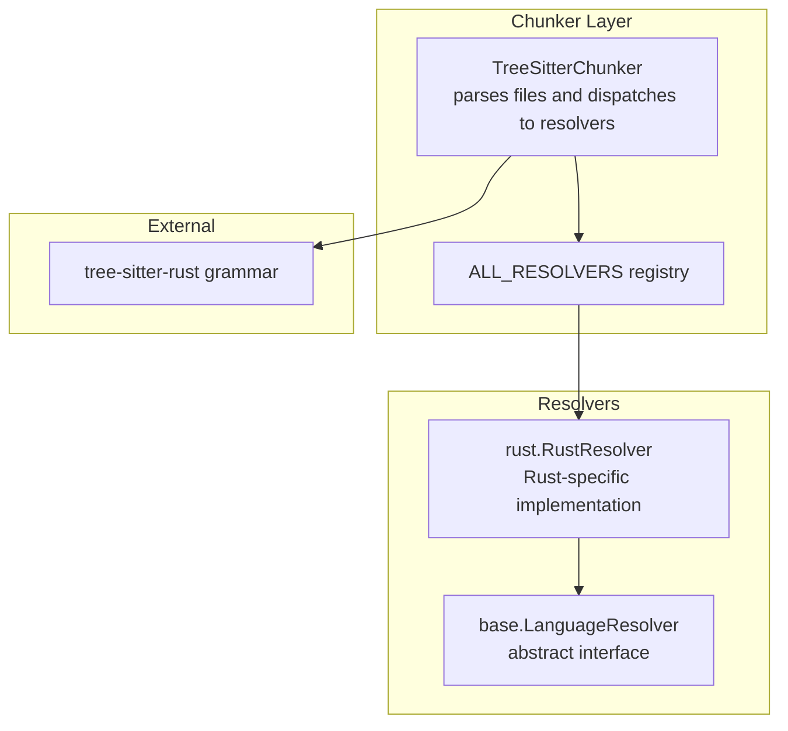
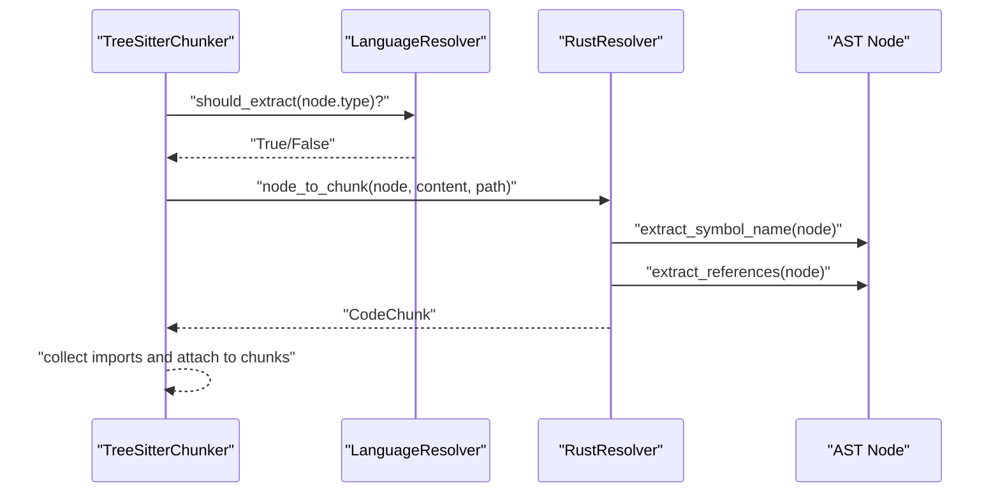
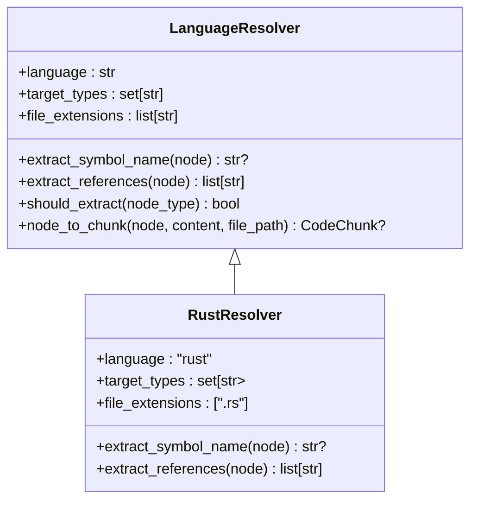
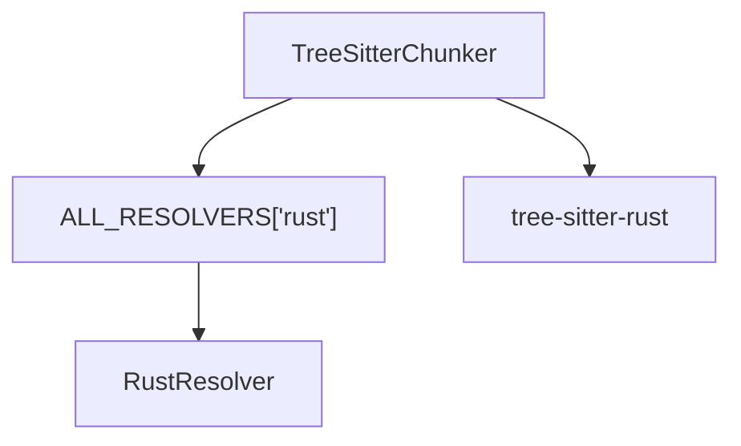

# Rust Resolver

<cite>
**Referenced Files in This Document**
- [rust.py](file://src/ws_ctx_engine/chunker/resolvers/rust.py)
- [base.py](file://src/ws_ctx_engine/chunker/resolvers/base.py)
- [tree_sitter.py](file://src/ws_ctx_engine/chunker/tree_sitter.py)
- [__init__.py (resolvers)](file://src/ws_ctx_engine/chunker/resolvers/__init__.py)
- [test_resolvers.py](file://tests/unit/test_resolvers.py)
- [test_resolver_improvements.py](file://tests/unit/test_resolver_improvements.py)
- [chunker.md](file://docs/reference/chunker.md)
- [architecture.md](file://docs/reference/architecture.md)
- [uv.lock](file://uv.lock)
</cite>

## Table of Contents
1. [Introduction](#introduction)
2. [Project Structure](#project-structure)
3. [Core Components](#core-components)
4. [Architecture Overview](#architecture-overview)
5. [Detailed Component Analysis](#detailed-component-analysis)
6. [Dependency Analysis](#dependency-analysis)
7. [Performance Considerations](#performance-considerations)
8. [Troubleshooting Guide](#troubleshooting-guide)
9. [Conclusion](#conclusion)

## Introduction
This document explains the Rust-specific language resolver implementation used to extract Rust constructs from source code into structured chunks. It covers AST node targeting, symbol extraction, references collection, and how the resolver integrates with the broader chunking pipeline. It also highlights Rust-specific considerations such as ownership semantics, borrowing rules, the module system, and macro expansion, along with performance and debugging guidance.

## Project Structure
The Rust resolver is part of a language-agnostic chunking system powered by Tree-sitter. The resolver participates in a strategy pattern where each language has a dedicated resolver class.

**Diagram sources**
- [tree_sitter.py:15-55](file://src/ws_ctx_engine/chunker/tree_sitter.py#L15-L55)
- [__init__.py (resolvers):9-25](file://src/ws_ctx_engine/chunker/resolvers/__init__.py#L9-L25)
- [rust.py:6-32](file://src/ws_ctx_engine/chunker/resolvers/rust.py#L6-L32)
- [base.py:7-70](file://src/ws_ctx_engine/chunker/resolvers/base.py#L7-L70)

**Section sources**
- [tree_sitter.py:15-55](file://src/ws_ctx_engine/chunker/tree_sitter.py#L15-L55)
- [__init__.py (resolvers):9-25](file://src/ws_ctx_engine/chunker/resolvers/__init__.py#L9-L25)
- [chunker.md:108-110](file://docs/reference/chunker.md#L108-L110)

## Core Components
- RustResolver: Implements Rust-specific AST node targeting, symbol name extraction, and identifier reference collection.
- LanguageResolver base: Defines the contract for all language resolvers, including target node types, symbol extraction, and reference extraction.
- TreeSitterChunker: Orchestrates parsing with Tree-sitter, selects the Rust resolver, and aggregates chunks.

Key capabilities:
- Target types include functions, structs, traits, impl blocks, enums, constants, type aliases, static items, modules, macro definitions, unions, and function signature items.
- Extracts symbol names from AST nodes, preferring identifiers while handling special cases like impl blocks.
- Collects referenced identifiers across expressions and imports.

**Section sources**
- [rust.py:6-55](file://src/ws_ctx_engine/chunker/resolvers/rust.py#L6-L55)
- [base.py:7-70](file://src/ws_ctx_engine/chunker/resolvers/base.py#L7-L70)
- [tree_sitter.py:15-55](file://src/ws_ctx_engine/chunker/tree_sitter.py#L15-L55)

## Architecture Overview
The Rust resolver participates in a layered architecture:
- TreeSitterChunker detects files by extension, parses with Tree-sitter, and recursively traverses AST nodes.
- For each node, it checks if the node type is among the resolver’s target types and converts matching nodes into CodeChunk objects.
- Import statements are extracted separately and attached to chunks as referenced symbols.

**Diagram sources**
- [tree_sitter.py:145-160](file://src/ws_ctx_engine/chunker/tree_sitter.py#L145-L160)
- [base.py:48-70](file://src/ws_ctx_engine/chunker/resolvers/base.py#L48-L70)
- [rust.py:34-55](file://src/ws_ctx_engine/chunker/resolvers/rust.py#L34-L55)

**Section sources**
- [tree_sitter.py:145-160](file://src/ws_ctx_engine/chunker/tree_sitter.py#L145-L160)
- [base.py:48-70](file://src/ws_ctx_engine/chunker/resolvers/base.py#L48-L70)

## Detailed Component Analysis

### RustResolver
Responsibilities:
- Define supported Rust AST node types for extraction.
- Extract symbol names from nodes, with special handling for impl blocks.
- Collect referenced identifiers from expressions and imports.

Target AST node types:
- function_item, struct_item, trait_item, impl_item, enum_item, const_item, type_item, static_item, mod_item, macro_definition, union_item, function_signature_item.

Symbol extraction:
- For impl_item, the resolver looks for type_identifier or identifier children to extract the implementing type name.
- For other items, it extracts the first identifier child.

Reference extraction:
- Recursively traverses the AST node and collects all identifier nodes as references.

**Diagram sources**
- [base.py:7-70](file://src/ws_ctx_engine/chunker/resolvers/base.py#L7-L70)
- [rust.py:6-55](file://src/ws_ctx_engine/chunker/resolvers/rust.py#L6-L55)

**Section sources**
- [rust.py:6-55](file://src/ws_ctx_engine/chunker/resolvers/rust.py#L6-L55)
- [test_resolvers.py:28-43](file://tests/unit/test_resolvers.py#L28-L43)

### Symbol Extraction Behavior
- Function items: Extract the identifier immediately following the function keyword.
- Struct items: Extract the identifier following the struct keyword.
- Trait items: Extract the identifier following the trait keyword.
- Enum items: Extract the identifier following the enum keyword.
- Const items: Extract the identifier following the const keyword.
- Type items: Extract the identifier following the type keyword.
- Static items: Extract the identifier following the static keyword.
- Mod items: Extract the identifier following the mod keyword.
- Macro definitions: Extract the identifier following macro_rules!.
- Impl items: Extract the type identifier or identifier representing the type being implemented (not the “impl” keyword).
- Union items: Extract the identifier following the union keyword.
- Function signature items: Included in target types for signature-focused extraction.

Validation and examples are covered by unit tests.

**Section sources**
- [rust.py:34-43](file://src/ws_ctx_engine/chunker/resolvers/rust.py#L34-L43)
- [test_resolvers.py:45-183](file://tests/unit/test_resolvers.py#L45-L183)

### Reference Extraction Behavior
- Identifier traversal: The resolver recursively walks the AST node and adds all identifier nodes to the set of referenced symbols.
- Use declarations: Scoped use declarations are handled by the TreeSitterChunker’s import extraction logic and are included in the chunk’s referenced symbols.
- Call expressions: Both standalone and qualified path calls are captured by collecting identifiers.

**Section sources**
- [rust.py:45-55](file://src/ws_ctx_engine/chunker/resolvers/rust.py#L45-L55)
- [tree_sitter.py:116-144](file://src/ws_ctx_engine/chunker/tree_sitter.py#L116-L144)
- [test_resolvers.py:520-534](file://tests/unit/test_resolvers.py#L520-L534)
- [test_resolver_improvements.py:314-342](file://tests/unit/test_resolver_improvements.py#L314-L342)

### Ownership, Borrowing, and Lifetime Handling
- The current resolver extracts identifiers and basic node types but does not implement Rust-specific semantic analysis for ownership, borrowing, or lifetimes. These are not required for structural chunking and symbol reference extraction.
- Ownership semantics and borrowing rules are enforced by the Rust compiler during type checking and do not impact the AST node targeting performed here.
- Lifetimes are not represented as separate AST nodes in the current grammar; therefore, lifetime parameters are not extracted as distinct symbols.

Implications:
- Generic items with lifetime parameters are treated as regular generics for symbol extraction.
- Associated types and trait bounds are not resolved; they appear as identifiers in the AST and are collected accordingly.

**Section sources**
- [rust.py:14-28](file://src/ws_ctx_engine/chunker/resolvers/rust.py#L14-L28)
- [test_resolvers.py:81-93](file://tests/unit/test_resolvers.py#L81-L93)

### Macro Expansion Considerations
- Macro definitions are targeted as macro_definition nodes and their names are extracted.
- Macro invocations are not explicitly targeted as separate node types in the current resolver; they are captured implicitly through identifier references in expressions.
- The Tree-sitter Rust grammar resolves macro_rules! definitions and invocation sites at parse time; the resolver focuses on structural extraction rather than runtime expansion.

**Section sources**
- [rust.py:25-28](file://src/ws_ctx_engine/chunker/resolvers/rust.py#L25-L28)
- [test_resolvers.py:155-165](file://tests/unit/test_resolvers.py#L155-L165)

### Module System Integration
- Module boundaries are represented by mod_item nodes and are extracted as top-level units.
- Use declarations (imports) are extracted by the TreeSitterChunker and attached to chunks as referenced symbols, enabling cross-module symbol tracking.

**Section sources**
- [rust.py:24](file://src/ws_ctx_engine/chunker/resolvers/rust.py#L24)
- [tree_sitter.py:116-144](file://src/ws_ctx_engine/chunker/tree_sitter.py#L116-L144)
- [test_resolvers.py:194-206](file://tests/unit/test_resolvers.py#L194-L206)

### Complex Rust Constructs
- Generics with lifetimes: Handled as generic parameters; the resolver treats them as identifiers and does not distinguish lifetimes from type parameters.
- Associated types and trait bounds: Collected as identifiers; no semantic resolution is performed.
- Procedural macros: Definitions are targeted; invocations are captured via identifier references.

Validation evidence:
- Generic impl blocks: Verified by unit tests.
- Scoped use declarations: Verified by integration tests.

**Section sources**
- [test_resolvers.py:81-93](file://tests/unit/test_resolvers.py#L81-L93)
- [test_resolver_improvements.py:314-342](file://tests/unit/test_resolver_improvements.py#L314-L342)

## Dependency Analysis
- External dependency: tree-sitter-rust grammar is required for accurate Rust AST parsing.
- Resolver registry: The ALL_RESOLVERS mapping binds the “rust” language key to RustResolver.
- TreeSitterChunker: Uses the registry to obtain the Rust resolver and applies it to .rs files.

**Diagram sources**
- [__init__.py (resolvers):9-16](file://src/ws_ctx_engine/chunker/resolvers/__init__.py#L9-L16)
- [tree_sitter.py:40-45](file://src/ws_ctx_engine/chunker/tree_sitter.py#L40-L45)

**Section sources**
- [__init__.py (resolvers):9-16](file://src/ws_ctx_engine/chunker/resolvers/__init__.py#L9-L16)
- [tree_sitter.py:40-45](file://src/ws_ctx_engine/chunker/tree_sitter.py#L40-L45)
- [uv.lock:4294-4302](file://uv.lock#L4294-L4302)

## Performance Considerations
- Tree-sitter parsing speed: The Rust resolver relies on tree-sitter-rust, which is a compiled grammar and generally fast for large codebases.
- File filtering: The chunker respects include/exclude patterns and .gitignore to avoid unnecessary work.
- Fallback behavior: If tree-sitter is unavailable, the system falls back to regex-based parsing, though Rust support remains primarily via Tree-sitter.

Recommendations:
- Ensure tree-sitter-rust is installed for optimal performance.
- Keep include patterns specific to reduce traversal overhead.
- Use the provided configuration options to tune filtering behavior.

**Section sources**
- [chunker.md:227-228](file://docs/reference/chunker.md#L227-L228)
- [chunker.md:378-388](file://docs/reference/chunker.md#L378-L388)
- [uv.lock:4294-4302](file://uv.lock#L4294-L4302)

## Troubleshooting Guide
Common issues and resolutions:
- Missing tree-sitter-rust: The chunker raises an ImportError with installation guidance. Install the dependency to enable Rust parsing.
- Parse exceptions: The chunker logs warnings and continues with other files, ensuring robustness.
- Incorrect symbol extraction: Verify that the target node types match expectations and that identifiers are present in the AST.
- Macro-related parsing: Macro definitions are targeted; invocation sites rely on identifier references. If symbols are missing, check whether the macro invocation produces visible identifiers in the AST.

Debugging tips:
- Enable logging to inspect parse failures and warnings.
- Validate that .rs files are included in the configured include patterns.
- Confirm that the resolver’s target_types align with the constructs you expect to extract.

**Section sources**
- [tree_sitter.py:26-37](file://src/ws_ctx_engine/chunker/tree_sitter.py#L26-L37)
- [tree_sitter.py:84-88](file://src/ws_ctx_engine/chunker/tree_sitter.py#L84-L88)
- [chunker.md:324-342](file://docs/reference/chunker.md#L324-L342)

## Conclusion
The Rust resolver provides a focused, efficient extractor for Rust constructs using Tree-sitter. It targets key AST node types, extracts symbol names and references, and integrates seamlessly into the chunking pipeline. While it does not implement Rust-specific semantic analysis (ownership, borrowing, lifetimes), it captures the structural elements necessary for downstream indexing and retrieval. For complex Rust features like procedural macros and advanced generics, the resolver’s identifier-centric approach ensures broad coverage, with room for future enhancements if semantic resolution becomes necessary.