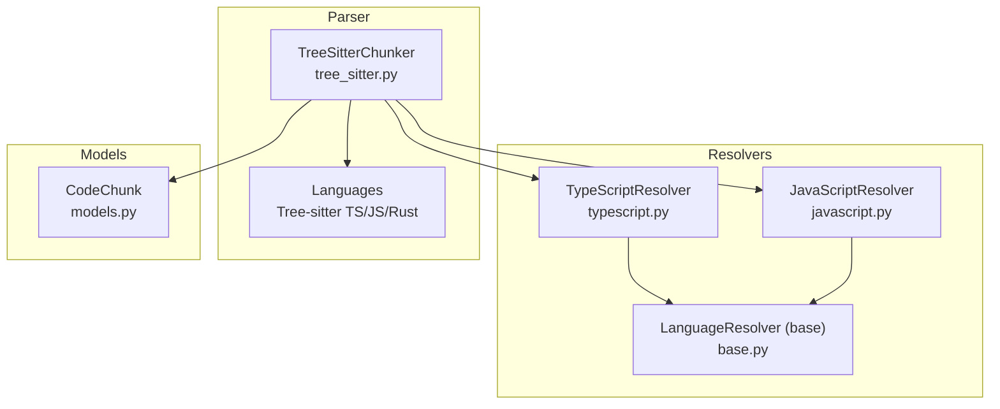
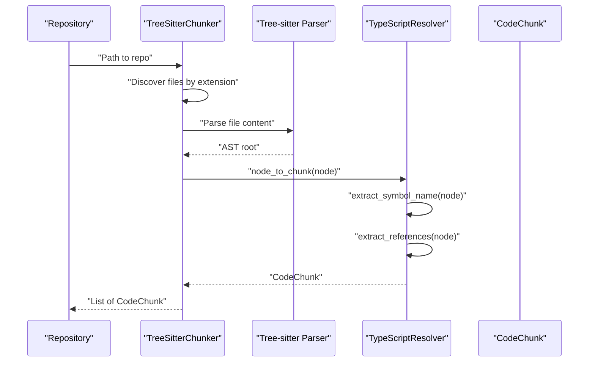
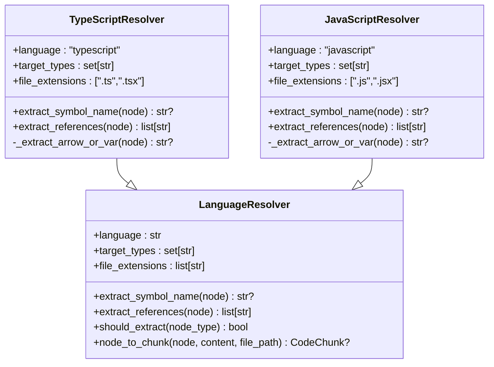
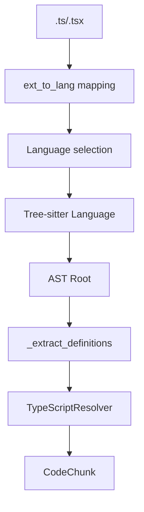
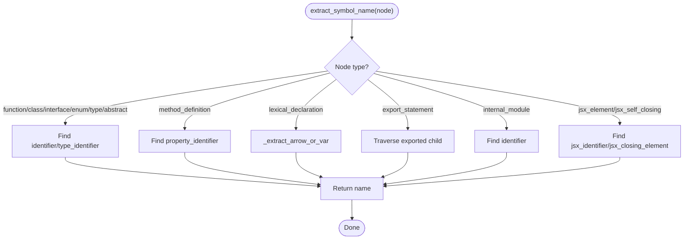
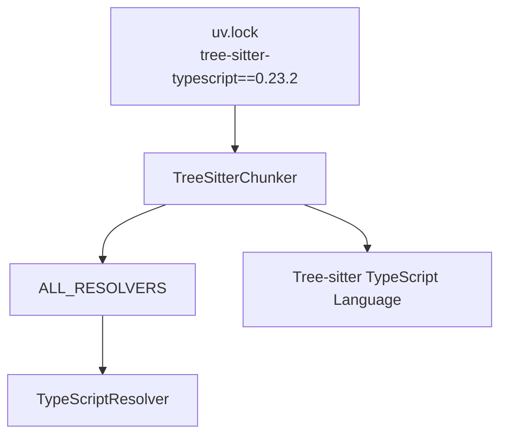

# TypeScript Resolver

<cite>
**Referenced Files in This Document**
- [typescript.py](file://src/ws_ctx_engine/chunker/resolvers/typescript.py)
- [base.py](file://src/ws_ctx_engine/chunker/resolvers/base.py)
- [javascript.py](file://src/ws_ctx_engine/chunker/resolvers/javascript.py)
- [tree_sitter.py](file://src/ws_ctx_engine/chunker/tree_sitter.py)
- [models.py](file://src/ws_ctx_engine/models/models.py)
- [test_resolvers.py](file://tests/unit/test_resolvers.py)
- [test_typescript_edge_cases.py](file://tests/unit/test_typescript_edge_cases.py)
- [large.ts](file://tests/fixtures/large_file_repo/large.ts)
- [tsconfig.json](file://tests/fixtures/config_only_repo/tsconfig.json)
- [uv.lock](file://uv.lock)
</cite>

## Table of Contents
1. [Introduction](#introduction)
2. [Project Structure](#project-structure)
3. [Core Components](#core-components)
4. [Architecture Overview](#architecture-overview)
5. [Detailed Component Analysis](#detailed-component-analysis)
6. [Dependency Analysis](#dependency-analysis)
7. [Performance Considerations](#performance-considerations)
8. [Troubleshooting Guide](#troubleshooting-guide)
9. [Conclusion](#conclusion)

## Introduction
This document describes the TypeScript-specific language resolver implementation used by the AST chunker. It explains how TypeScript AST node types are targeted, how symbols are extracted from declarations and JSX elements, and how the resolver integrates with the Tree-sitter parser. It also covers TypeScript-specific constructs observed in tests, such as exported type aliases, enums, abstract classes, and generic type aliases, and provides guidance for debugging and extending support for advanced TypeScript features.

## Project Structure
The TypeScript resolver is part of a language-agnostic resolver framework that delegates AST traversal and language-specific extraction to specialized resolvers. The Tree-sitter chunker selects the appropriate resolver per file extension and language.

**Diagram sources**
- [tree_sitter.py:15-55](file://src/ws_ctx_engine/chunker/tree_sitter.py#L15-L55)
- [typescript.py:6-32](file://src/ws_ctx_engine/chunker/resolvers/typescript.py#L6-L32)
- [javascript.py:6-28](file://src/ws_ctx_engine/chunker/resolvers/javascript.py#L6-L28)
- [base.py:7-46](file://src/ws_ctx_engine/chunker/resolvers/base.py#L7-L46)
- [models.py:10-34](file://src/ws_ctx_engine/models/models.py#L10-L34)

**Section sources**
- [tree_sitter.py:15-55](file://src/ws_ctx_engine/chunker/tree_sitter.py#L15-L55)
- [typescript.py:6-32](file://src/ws_ctx_engine/chunker/resolvers/typescript.py#L6-L32)
- [javascript.py:6-28](file://src/ws_ctx_engine/chunker/resolvers/javascript.py#L6-L28)
- [base.py:7-46](file://src/ws_ctx_engine/chunker/resolvers/base.py#L7-L46)
- [models.py:10-34](file://src/ws_ctx_engine/models/models.py#L10-L34)

## Core Components
- TypeScriptResolver: Implements TypeScript-specific AST node targeting, symbol extraction, and reference collection. It targets declarations such as interfaces, type aliases, enums, abstract classes, and JSX elements, and supports export statements and internal modules (namespaces).
- LanguageResolver (base): Defines the contract for all language resolvers, including target node types, symbol extraction, reference extraction, and conversion of AST nodes to CodeChunk instances.
- TreeSitterChunker: Orchestrates parsing via Tree-sitter, language selection by file extension, and definition extraction using the appropriate resolver.
- CodeChunk: The output model representing a parsed code segment with metadata such as defined and referenced symbols.

Key TypeScriptResolver capabilities:
- Target types include function/class/interface/type/enum/abstract class declarations, export statements, internal modules (namespaces), and JSX elements.
- Symbol extraction handles identifiers, type identifiers, and JSX identifiers.
- Reference extraction collects identifiers recursively under a node.

**Section sources**
- [typescript.py:6-103](file://src/ws_ctx_engine/chunker/resolvers/typescript.py#L6-L103)
- [base.py:7-70](file://src/ws_ctx_engine/chunker/resolvers/base.py#L7-L70)
- [tree_sitter.py:15-160](file://src/ws_ctx_engine/chunker/tree_sitter.py#L15-L160)
- [models.py:10-34](file://src/ws_ctx_engine/models/models.py#L10-L34)

## Architecture Overview
The TypeScript resolver participates in a layered architecture:
- Tree-sitter parses source files into ASTs.
- The chunker selects a resolver based on file extension.
- The resolver identifies target AST node types and extracts symbols and references.
- Extracted definitions are converted to CodeChunk objects.

**Diagram sources**
- [tree_sitter.py:57-114](file://src/ws_ctx_engine/chunker/tree_sitter.py#L57-L114)
- [typescript.py:34-103](file://src/ws_ctx_engine/chunker/resolvers/typescript.py#L34-L103)
- [base.py:48-70](file://src/ws_ctx_engine/chunker/resolvers/base.py#L48-L70)
- [models.py:10-34](file://src/ws_ctx_engine/models/models.py#L10-L34)

## Detailed Component Analysis

### TypeScriptResolver
The TypeScriptResolver specializes the base LanguageResolver for TypeScript. It defines:
- language: "typescript"
- target_types: Declarations and JSX relevant to TypeScript contexts
- file_extensions: [".ts", ".tsx"]

Symbol extraction logic:
- Declarations: function_declaration, class_declaration, interface_declaration, enum_declaration, type_alias_declaration, abstract_class_declaration
- Method definitions: method_definition
- Lexical declarations: lexical_declaration (with special handling for arrow functions)
- Export statements: export_statement wrapping the above declarations
- Internal modules (namespaces): internal_module
- JSX elements: jsx_element and jsx_self_closing_element

Reference extraction:
- Recursively traverses children and collects identifier nodes.

**Diagram sources**
- [base.py:7-70](file://src/ws_ctx_engine/chunker/resolvers/base.py#L7-L70)
- [typescript.py:6-103](file://src/ws_ctx_engine/chunker/resolvers/typescript.py#L6-L103)
- [javascript.py:6-85](file://src/ws_ctx_engine/chunker/resolvers/javascript.py#L6-L85)

**Section sources**
- [typescript.py:6-103](file://src/ws_ctx_engine/chunker/resolvers/typescript.py#L6-L103)
- [base.py:7-70](file://src/ws_ctx_engine/chunker/resolvers/base.py#L7-L70)

### Symbol Extraction Details
- Function/class/interface/enum/type/abstract class declarations: look for identifier or type_identifier among children.
- Method definitions: look for property_identifier.
- Lexical declarations: variable_declarator with an identifier and an arrow_function indicate a named arrow function.
- Export statements: traverse the exported declaration to find the identifier/type_identifier.
- Internal modules (namespaces): identifier under internal_module.
- JSX elements: jsx_identifier or jsx_closing_element with jsx_identifier.

These behaviors are validated by unit tests for TypeScript declarations and JSX.

**Section sources**
- [typescript.py:34-91](file://src/ws_ctx_engine/chunker/resolvers/typescript.py#L34-L91)
- [test_resolvers.py:401-442](file://tests/unit/test_resolvers.py#L401-L442)

### Reference Extraction Details
The resolver recursively collects identifiers under a node to build the symbols_referenced list. This provides a baseline for import and usage tracking.

**Section sources**
- [typescript.py:93-103](file://src/ws_ctx_engine/chunker/resolvers/typescript.py#L93-L103)

### TypeScript-Specific Constructs Observed in Tests
- Exported type aliases and enums: verified by parsing and checking symbols_defined.
- Abstract class declarations and exported abstract classes: verified by parsing and checking symbols_defined.
- Generic type aliases: verified by parsing and checking symbols_defined.

These tests demonstrate that the resolver recognizes and extracts symbols from:
- Export statements
- Type aliases (including generic forms)
- Enums
- Abstract classes

**Section sources**
- [test_typescript_edge_cases.py:61-171](file://tests/unit/test_typescript_edge_cases.py#L61-L171)

### TypeScript vs JavaScript AST Nodes
The TypeScriptResolver and JavaScriptResolver share similar patterns for symbol extraction, differing mainly in target_types and supported JSX handling. The JavaScriptResolver targets generator_function_declaration and includes JSX element handling, while the TypeScriptResolver targets internal_module (namespace) and export_statement.

**Section sources**
- [javascript.py:6-85](file://src/ws_ctx_engine/chunker/resolvers/javascript.py#L6-L85)
- [typescript.py:6-32](file://src/ws_ctx_engine/chunker/resolvers/typescript.py#L6-L32)

## Architecture Overview
The resolver integrates with Tree-sitter parsing and the chunker pipeline. The chunker maps file extensions to languages, initializes language parsers, and invokes the resolver’s node_to_chunk to produce CodeChunk instances.

**Diagram sources**
- [tree_sitter.py:46-55](file://src/ws_ctx_engine/chunker/tree_sitter.py#L46-L55)
- [tree_sitter.py:102-114](file://src/ws_ctx_engine/chunker/tree_sitter.py#L102-L114)
- [tree_sitter.py:145-160](file://src/ws_ctx_engine/chunker/tree_sitter.py#L145-L160)
- [typescript.py:34-103](file://src/ws_ctx_engine/chunker/resolvers/typescript.py#L34-L103)
- [models.py:10-34](file://src/ws_ctx_engine/models/models.py#L10-L34)

## Detailed Component Analysis

### TypeScriptResolver Implementation
- Target types include declarations and JSX relevant to TypeScript.
- File extensions are .ts and .tsx.
- Symbol extraction prioritizes identifier and type_identifier nodes depending on the declaration type.
- Export statements are handled by recursing into the declared child node.
- Internal modules (namespaces) are supported via identifier extraction.
- JSX elements are supported via jsx_identifier and jsx_closing_element traversal.

**Diagram sources**
- [typescript.py:34-91](file://src/ws_ctx_engine/chunker/resolvers/typescript.py#L34-L91)

**Section sources**
- [typescript.py:34-91](file://src/ws_ctx_engine/chunker/resolvers/typescript.py#L34-L91)

### Reference Collection
The resolver performs a depth-first traversal of AST children to collect identifiers, enabling downstream consumers to track symbol usage.

**Section sources**
- [typescript.py:93-103](file://src/ws_ctx_engine/chunker/resolvers/typescript.py#L93-L103)

### CodeChunk Generation
The base LanguageResolver.node_to_chunk computes line numbers, node content, and populates symbols_defined and symbols_referenced before constructing a CodeChunk.

**Section sources**
- [base.py:48-70](file://src/ws_ctx_engine/chunker/resolvers/base.py#L48-L70)
- [models.py:10-34](file://src/ws_ctx_engine/models/models.py#L10-L34)

## Dependency Analysis
- Tree-sitter language bindings: The chunker imports tree-sitter-python, tree-sitter-javascript, tree-sitter-typescript, and tree-sitter-rust. The TypeScript language binding is selected for .ts and .tsx files.
- Resolver mapping: ALL_RESOLVERS maps "typescript" to TypeScriptResolver.
- Unit tests: Validate TypeScriptResolver behavior for declarations, JSX, and edge cases.

**Diagram sources**
- [uv.lock:4310-4318](file://uv.lock#L4310-L4318)
- [tree_sitter.py:39-45](file://src/ws_ctx_engine/chunker/tree_sitter.py#L39-L45)
- [tree_sitter.py:54](file://src/ws_ctx_engine/chunker/tree_sitter.py#L54)
- [tree_sitter.py:43](file://src/ws_ctx_engine/chunker/tree_sitter.py#L43)

**Section sources**
- [uv.lock:4310-4318](file://uv.lock#L4310-L4318)
- [tree_sitter.py:39-45](file://src/ws_ctx_engine/chunker/tree_sitter.py#L39-L45)
- [tree_sitter.py:54](file://src/ws_ctx_engine/chunker/tree_sitter.py#L54)

## Performance Considerations
- AST traversal is linear in the number of nodes; symbol extraction and reference collection are O(n) per node.
- Using Tree-sitter provides efficient parsing; ensure only necessary nodes are traversed by leveraging target_types filtering.
- For very large TypeScript files, consider batching or limiting the number of chunks generated.

## Troubleshooting Guide
Common issues and resolutions:
- Missing Tree-sitter dependencies: The chunker raises an ImportError if tree-sitter packages are not installed. Install the required packages as indicated by the error message.
- Unsupported AST node types: If a new TypeScript construct is not recognized, add its node type to target_types and implement symbol extraction logic in extract_symbol_name.
- Incorrect symbol names for arrow functions: Verify that lexical_declaration with variable_declarator and arrow_function is handled by _extract_arrow_or_var.
- JSX symbol extraction: Ensure jsx_identifier and jsx_closing_element are properly traversed for jsx_element and jsx_self_closing_element.
- Exported symbols not appearing: Confirm that export_statement is included in target_types and that the resolver recurses into the exported child node to extract the identifier.

Validation references:
- Unit tests for TypeScriptResolver behavior and edge cases.
- Large TypeScript fixture demonstrating exported functions.

**Section sources**
- [tree_sitter.py:32-37](file://src/ws_ctx_engine/chunker/tree_sitter.py#L32-L37)
- [test_resolvers.py:401-442](file://tests/unit/test_resolvers.py#L401-L442)
- [test_typescript_edge_cases.py:18-41](file://tests/unit/test_typescript_edge_cases.py#L18-L41)
- [large.ts:1-20](file://tests/fixtures/large_file_repo/large.ts#L1-L20)

## Conclusion
The TypeScriptResolver provides a focused, extensible foundation for extracting TypeScript definitions and JSX components from ASTs. Its design aligns with the broader chunker architecture, leveraging Tree-sitter for parsing and a shared base class for consistent symbol and reference handling. The included unit tests validate core behaviors, including exported type aliases, enums, abstract classes, and generic type aliases. Extending support for advanced TypeScript features involves adding node types to target_types and implementing extraction logic in extract_symbol_name, following the existing patterns in the resolver.