# Core Modules

<cite>
**Referenced Files in This Document**
- [__init__.py](file://src/ws_ctx_engine/__init__.py)
- [workflow/__init__.py](file://src/ws_ctx_engine/workflow/__init__.py)
- [indexer.py](file://src/ws_ctx_engine/workflow/indexer.py)
- [query.py](file://src/ws_ctx_engine/workflow/query.py)
- [retrieval/__init__.py](file://src/ws_ctx_engine/retrieval/__init__.py)
- [retrieval.py](file://src/ws_ctx_engine/retrieval/retrieval.py)
- [vector_index/__init__.py](file://src/ws_ctx_engine/vector_index/__init__.py)
- [vector_index.py](file://src/ws_ctx_engine/vector_index/vector_index.py)
- [graph/__init__.py](file://src/ws_ctx_engine/graph/__init__.py)
- [graph.py](file://src/ws_ctx_engine/graph/graph.py)
- [chunker/__init__.py](file://src/ws_ctx_engine/chunker/__init__.py)
- [base.py](file://src/ws_ctx_engine/chunker/base.py)
- [tree_sitter.py](file://src/ws_ctx_engine/chunker/tree_sitter.py)
- [python.py](file://src/ws_ctx_engine/chunker/resolvers/python.py)
- [models.py](file://src/ws_ctx_engine/models/models.py)
- [config.py](file://src/ws_ctx_engine/config/config.py)
- [budget.py](file://src/ws_ctx_engine/budget/budget.py)
- [ranker.py](file://src/ws_ctx_engine/ranking/ranker.py)
- [cozo_store.py](file://src/ws_ctx_engine/graph/cozo_store.py)
- [symbol_index.py](file://src/ws_ctx_engine/graph/symbol_index.py)
- [context_assembler.py](file://src/ws_ctx_engine/graph/context_assembler.py)
- [builder.py](file://src/ws_ctx_engine/graph/builder.py)
- [signal_router.py](file://src/ws_ctx_engine/graph/signal_router.py)
- [store_protocol.py](file://src/ws_ctx_engine/graph/store_protocol.py)
- [validation.py](file://src/ws_ctx_engine/graph/validation.py)
- [graph_tools.py](file://src/ws_ctx_engine/mcp/graph_tools.py)
- [tools.py](file://src/ws_ctx_engine/mcp/tools.py)
</cite>

## Update Summary
**Changes Made**
- Added comprehensive CozoDB graph store implementation with multiple storage backends
- Enhanced chunker system with AST-based processing and symbol indexing capabilities
- Integrated specialized graph operations including CALLS and IMPORTS edge creation
- Expanded MCP protocol implementation with four new graph tools: find_callers, impact_analysis, graph_search, and call_chain
- Added context assembly system for merging vector and graph retrieval results
- Implemented signal routing for intelligent graph query classification
- Added graph validation and protocol interfaces for extensible graph storage backends

## Table of Contents
1. [Introduction](#introduction)
2. [Project Structure](#project-structure)
3. [Core Components](#core-components)
4. [Architecture Overview](#architecture-overview)
5. [Detailed Component Analysis](#detailed-component-analysis)
6. [Dependency Analysis](#dependency-analysis)
7. [Performance Considerations](#performance-considerations)
8. [Troubleshooting Guide](#troubleshooting-guide)
9. [Conclusion](#conclusion)

## Introduction
This document explains the core modules of ws-ctx-engine that power intelligent codebase packaging for LLMs. It covers the indexing pipeline, query processing, hybrid ranking, vector similarity search, PageRank computation, and language-specific AST parsing. The system now includes comprehensive graph engine capabilities with CozoDB integration, enhanced chunker system with AST-based processing, and expanded MCP protocol implementation with graph tools integration. The goal is to help both beginners and experienced developers understand how the system works, how modules integrate, and how to configure and operate them effectively.

## Project Structure
The core modules are organized by responsibility:
- Workflow: orchestration of index and query phases
- Retrieval: hybrid ranking combining semantic and structural signals
- Vector Index: semantic search over code chunks
- Graph: comprehensive dependency graph engine with CozoDB integration
- Chunker: AST-based parsing with language-specific resolvers and symbol indexing
- Models and Config: shared data structures and configuration
- Budget: token-aware file selection
- Ranking: AI rule boosting
- MCP Tools: graph-aware tool integration

```mermaid
graph TB
subgraph "Workflow"
IDX["indexer.py"]
QRY["query.py"]
end
subgraph "Retrieval"
RET["retrieval.py"]
end
subgraph "Vector Index"
VI["vector_index.py"]
end
subgraph "Graph Engine"
GR["graph.py"]
COZO["cozo_store.py"]
SYMBOL["symbol_index.py"]
ASSEMBLER["context_assembler.py"]
BUILDER["builder.py"]
SIGNAL["signal_router.py"]
VALIDATE["validation.py"]
PROTOCOL["store_protocol.py"]
end
subgraph "Chunker"
CS["chunker/__init__.py"]
BASE["base.py"]
TS["tree_sitter.py"]
PYRES["python.py"]
END
subgraph "MCP Tools"
MCP_TOOLS["mcp/tools.py"]
GRAPH_TOOLS["mcp/graph_tools.py"]
end
subgraph "Support"
CFG["config.py"]
M["models.py"]
BUD["budget.py"]
RANK["ranker.py"]
end
IDX --> CS
IDX --> VI
IDX --> GR
QRY --> RET
QRY --> BUD
QRY --> RANK
RET --> VI
RET --> GR
CS --> BASE
CS --> TS
TS --> PYRES
GR --> COZO
GR --> SYMBOL
GR --> ASSEMBLER
GR --> BUILDER
GR --> SIGNAL
GR --> VALIDATE
GR --> PROTOCOL
QRY --> MCP_TOOLS
MCP_TOOLS --> GRAPH_TOOLS
QRY --> CFG
IDX --> CFG
QRY --> M
IDX --> M
```

**Diagram sources**
- [indexer.py:72-371](file://src/ws_ctx_engine/workflow/indexer.py#L72-L371)
- [query.py:230-617](file://src/ws_ctx_engine/workflow/query.py#L230-L617)
- [retrieval.py:140-369](file://src/ws_ctx_engine/retrieval/retrieval.py#L140-L369)
- [vector_index.py:21-800](file://src/ws_ctx_engine/vector_index/vector_index.py#L21-L800)
- [graph.py:19-667](file://src/ws_ctx_engine/graph/graph.py#L19-L667)
- [cozo_store.py:59-364](file://src/ws_ctx_engine/graph/cozo_store.py#L59-L364)
- [symbol_index.py:18-140](file://src/ws_ctx_engine/graph/symbol_index.py#L18-L140)
- [context_assembler.py:29-167](file://src/ws_ctx_engine/graph/context_assembler.py#L29-L167)
- [builder.py:22-159](file://src/ws_ctx_engine/graph/builder.py#L22-L159)
- [signal_router.py:18-133](file://src/ws_ctx_engine/graph/signal_router.py#L18-L133)
- [validation.py:14-87](file://src/ws_ctx_engine/graph/validation.py#L14-L87)
- [store_protocol.py:17-61](file://src/ws_ctx_engine/graph/store_protocol.py#L17-L61)
- [chunker/__init__.py:1-55](file://src/ws_ctx_engine/chunker/__init__.py#L1-L55)
- [base.py:41-176](file://src/ws_ctx_engine/chunker/base.py#L41-L176)
- [tree_sitter.py:15-160](file://src/ws_ctx_engine/chunker/tree_sitter.py#L15-L160)
- [python.py:6-61](file://src/ws_ctx_engine/chunker/resolvers/python.py#L6-L61)
- [graph_tools.py:28-103](file://src/ws_ctx_engine/mcp/graph_tools.py#L28-L103)
- [tools.py:56-399](file://src/ws_ctx_engine/mcp/tools.py#L56-L399)
- [config.py:16-399](file://src/ws_ctx_engine/config/config.py#L16-L399)
- [models.py:10-152](file://src/ws_ctx_engine/models/models.py#L10-L152)
- [budget.py:8-105](file://src/ws_ctx_engine/budget/budget.py#L8-L105)
- [ranker.py:28-86](file://src/ws_ctx_engine/ranking/ranker.py#L28-L86)

**Section sources**
- [__init__.py:8-32](file://src/ws_ctx_engine/__init__.py#L8-L32)
- [workflow/__init__.py:1-5](file://src/ws_ctx_engine/workflow/__init__.py#L1-L5)

## Core Components
- Workflow: orchestrates index and query phases, manages performance tracking, and coordinates persistence/loading of indexes.
- Retrieval: hybrid ranking engine that merges semantic similarity and PageRank, then applies query-aware boosts and penalties.
- Vector Index: embeds code chunks and supports semantic search with multiple backends (LEANN, FAISS) and optional API fallback.
- Graph Engine: comprehensive dependency graph system with CozoDB integration, supporting multiple storage backends (memory, RocksDB, SQLite), symbol indexing, and graph operations.
- Chunker: parses code using AST (Tree-Sitter) with language-specific resolvers and falls back to regex-based chunking when needed.
- Models and Config: shared data structures and robust configuration loader with validation.
- Budget: greedy selection constrained by token budgets using tiktoken.
- Ranking: persistent boosting of AI rule files to ensure they appear in every pack.
- MCP Tools: graph-aware tool integration with four specialized graph operations: find_callers, impact_analysis, graph_search, and call_chain.

**Section sources**
- [indexer.py:72-371](file://src/ws_ctx_engine/workflow/indexer.py#L72-L371)
- [query.py:230-617](file://src/ws_ctx_engine/workflow/query.py#L230-L617)
- [retrieval.py:140-369](file://src/ws_ctx_engine/retrieval/retrieval.py#L140-L369)
- [vector_index.py:21-800](file://src/ws_ctx_engine/vector_index/vector_index.py#L21-L800)
- [graph.py:19-667](file://src/ws_ctx_engine/graph/graph.py#L19-L667)
- [cozo_store.py:59-364](file://src/ws_ctx_engine/graph/cozo_store.py#L59-L364)
- [symbol_index.py:18-140](file://src/ws_ctx_engine/graph/symbol_index.py#L18-L140)
- [context_assembler.py:29-167](file://src/ws_ctx_engine/graph/context_assembler.py#L29-L167)
- [builder.py:22-159](file://src/ws_ctx_engine/graph/builder.py#L22-L159)
- [signal_router.py:18-133](file://src/ws_ctx_engine/graph/signal_router.py#L18-L133)
- [validation.py:14-87](file://src/ws_ctx_engine/graph/validation.py#L14-L87)
- [store_protocol.py:17-61](file://src/ws_ctx_engine/graph/store_protocol.py#L17-L61)
- [chunker/__init__.py:17-38](file://src/ws_ctx_engine/chunker/__init__.py#L17-L38)
- [base.py:41-176](file://src/ws_ctx_engine/chunker/base.py#L41-L176)
- [tree_sitter.py:15-160](file://src/ws_ctx_engine/chunker/tree_sitter.py#L15-L160)
- [models.py:10-152](file://src/ws_ctx_engine/models/models.py#L10-L152)
- [config.py:16-399](file://src/ws_ctx_engine/config/config.py#L16-L399)
- [budget.py:8-105](file://src/ws_ctx_engine/budget/budget.py#L8-L105)
- [ranker.py:28-86](file://src/ws_ctx_engine/ranking/ranker.py#L28-L86)
- [graph_tools.py:28-103](file://src/ws_ctx_engine/mcp/graph_tools.py#L28-L103)
- [tools.py:56-399](file://src/ws_ctx_engine/mcp/tools.py#L56-L399)

## Architecture Overview
The system follows a two-phase workflow with enhanced graph capabilities:
- Index phase: parse repository, build vector index and graph, persist artifacts, and record metadata for staleness detection.
- Query phase: load indexes, retrieve candidates with hybrid ranking, optionally augment with graph results, select within token budget, and pack output in the configured format.

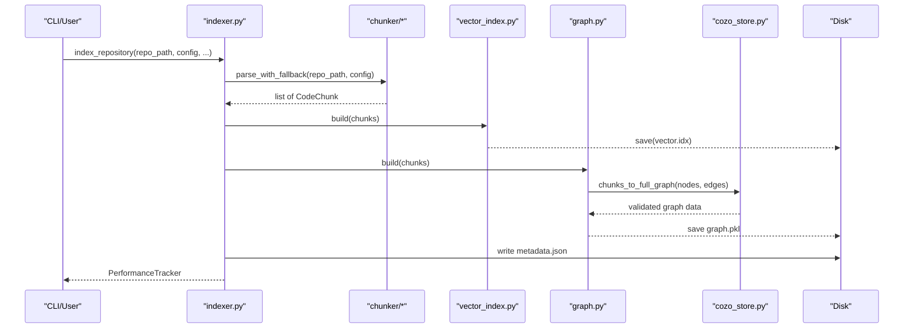

**Diagram sources**
- [indexer.py:72-371](file://src/ws_ctx_engine/workflow/indexer.py#L72-L371)
- [chunker/__init__.py:17-38](file://src/ws_ctx_engine/chunker/__init__.py#L17-L38)
- [vector_index.py:280-501](file://src/ws_ctx_engine/vector_index/vector_index.py#L280-L501)
- [graph.py:97-315](file://src/ws_ctx_engine/graph/graph.py#L97-L315)
- [cozo_store.py:164-185](file://src/ws_ctx_engine/graph/cozo_store.py#L164-L185)

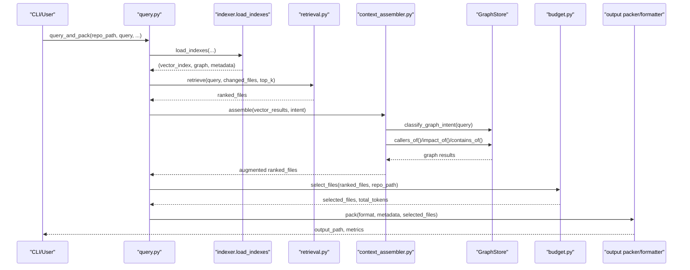

**Diagram sources**
- [query.py:230-617](file://src/ws_ctx_engine/workflow/query.py#L230-L617)
- [indexer.py:404-492](file://src/ws_ctx_engine/workflow/indexer.py#L404-L492)
- [retrieval.py:250-369](file://src/ws_ctx_engine/retrieval/retrieval.py#L250-L369)
- [budget.py:50-105](file://src/ws_ctx_engine/budget/budget.py#L50-L105)
- [context_assembler.py:46-130](file://src/ws_ctx_engine/graph/context_assembler.py#L46-L130)
- [cozo_store.py:247-274](file://src/ws_ctx_engine/graph/cozo_store.py#L247-L274)

## Detailed Component Analysis

### Workflow: Indexer
Responsibilities:
- Parse repository with AST chunker (Tree-Sitter with fallback to Regex).
- Build vector index with optional embedding cache and incremental update support.
- Build graph (PageRank) with fallback between igraph and NetworkX.
- **Enhanced**: Generate full graph with CALLS and IMPORTS edges using SymbolIndex.
- Persist artifacts and metadata for staleness detection.
- Support domain-only rebuilds and incremental mode gated by configuration.

Key behaviors:
- Incremental detection compares stored file hashes with current disk state.
- Embedding cache avoids re-embedding unchanged files on full rebuilds.
- Metadata tracks backend and file counts to inform staleness and health reporting.
- **New**: Full graph construction with symbol resolution and edge validation.

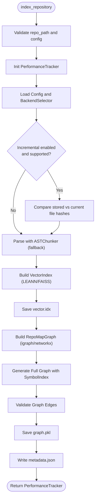

**Diagram sources**
- [indexer.py:72-371](file://src/ws_ctx_engine/workflow/indexer.py#L72-L371)
- [symbol_index.py:65-102](file://src/ws_ctx_engine/graph/symbol_index.py#L65-L102)
- [validation.py:23-86](file://src/ws_ctx_engine/graph/validation.py#L23-L86)

**Section sources**
- [indexer.py:72-371](file://src/ws_ctx_engine/workflow/indexer.py#L72-L371)

### Workflow: Query Processor
Responsibilities:
- Load persisted indexes with staleness detection and optional auto-rebuild.
- Hybrid retrieval: combine semantic and PageRank scores, then apply query-aware boosts and penalties.
- **Enhanced**: Intelligent graph augmentation using SignalRouter and ContextAssembler.
- Token budget selection using greedy knapsack.
- Output packing in XML, ZIP, or structured formats (JSON/YAML/TOON/Markdown).
- Optional session-level deduplication and compression.

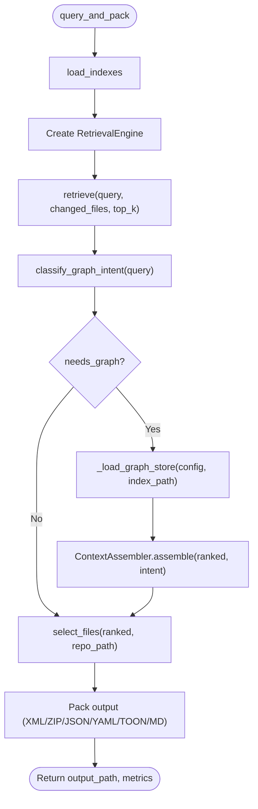

**Diagram sources**
- [query.py:230-617](file://src/ws_ctx_engine/workflow/query.py#L230-L617)
- [signal_router.py:98-115](file://src/ws_ctx_engine/graph/signal_router.py#L98-L115)
- [context_assembler.py:46-130](file://src/ws_ctx_engine/graph/context_assembler.py#L46-L130)
- [retrieval.py:250-369](file://src/ws_ctx_engine/retrieval/retrieval.py#L250-L369)
- [budget.py:50-105](file://src/ws_ctx_engine/budget/budget.py#L50-L105)

**Section sources**
- [query.py:230-617](file://src/ws_ctx_engine/workflow/query.py#L230-L617)

### Retrieval Engine
Hybrid ranking combines:
- Semantic scores from vector search
- Structural scores from PageRank
- Symbol exact-match boost
- Path keyword boost
- Domain directory boost
- Test file penalty
- AI rule file boost

Normalization ensures final scores are in [0, 1].

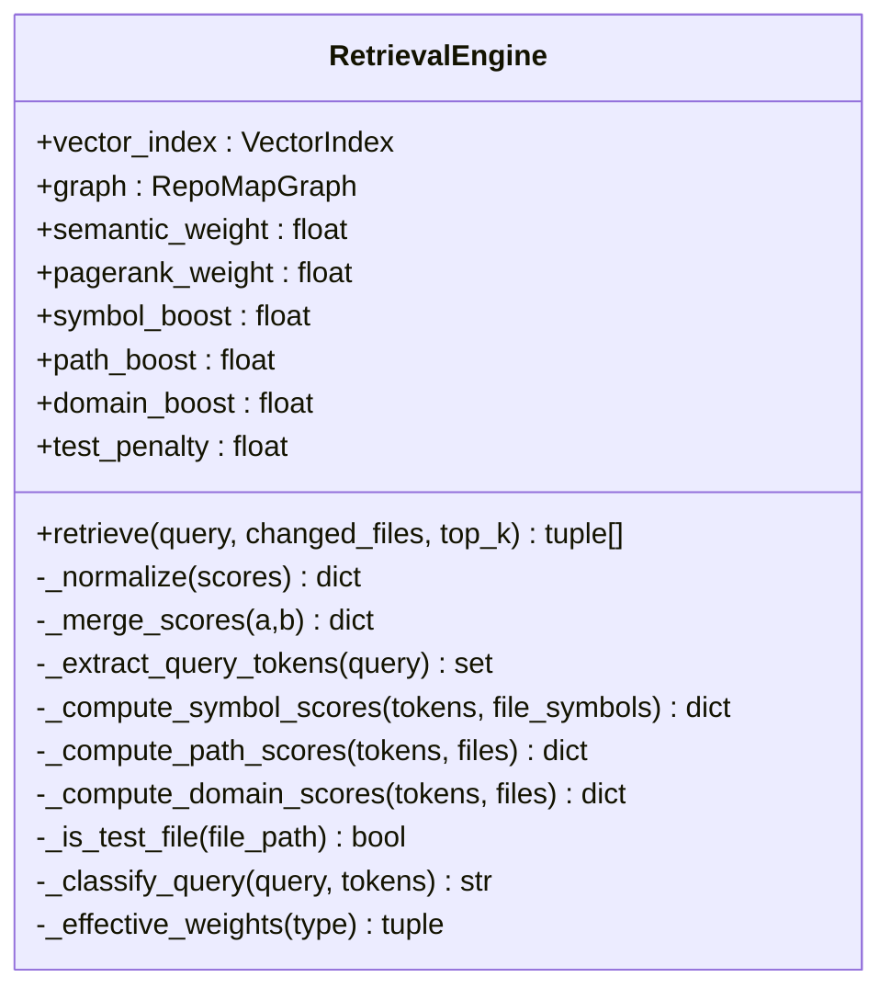

**Diagram sources**
- [retrieval.py:140-627](file://src/ws_ctx_engine/retrieval/retrieval.py#L140-L627)

**Section sources**
- [retrieval.py:140-369](file://src/ws_ctx_engine/retrieval/retrieval.py#L140-L369)

### Vector Index
Backends:
- LEANNIndex: stores file embeddings and symbol maps; cosine similarity search.
- FAISSIndex: brute-force exact search with IndexIDMap2 for incremental updates.
- EmbeddingGenerator: local sentence-transformers with fallback to OpenAI API.

Capabilities:
- Build from CodeChunk list
- Search returning (file_path, similarity) tuples
- Save/load with pickle or FAISS-native formats
- Optional embedding cache reuse across runs

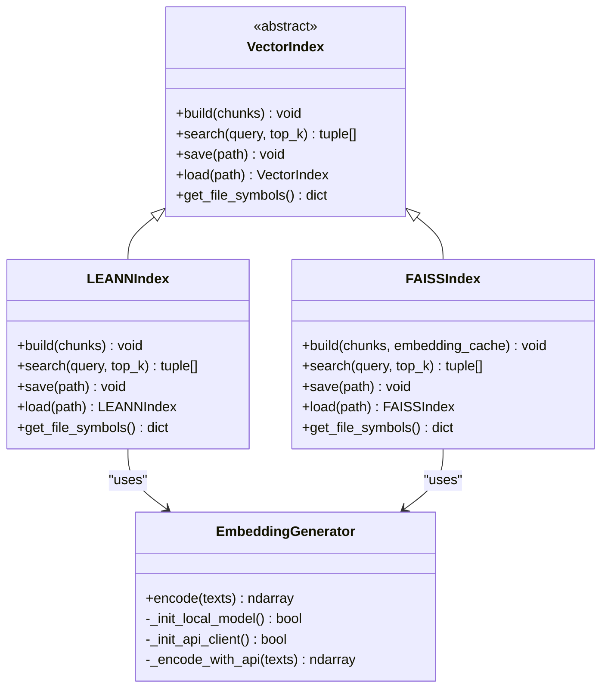

**Diagram sources**
- [vector_index.py:21-800](file://src/ws_ctx_engine/vector_index/vector_index.py#L21-L800)

**Section sources**
- [vector_index.py:280-501](file://src/ws_ctx_engine/vector_index/vector_index.py#L280-L501)
- [vector_index.py:503-800](file://src/ws_ctx_engine/vector_index/vector_index.py#L503-L800)

### Graph Engine: CozoDB Integration
**New** Comprehensive graph store with CozoDB backend supporting multiple storage backends:
- Storage backends: "mem" (in-memory), "rocksdb:<path>" (persistent), "sqlite:<path>" (persistent)
- Graceful degradation: when pycozo is unavailable, store becomes unhealthy but operations remain safe
- Schema management: automatic DDL creation and schema version tracking
- Query optimization: efficient datalog queries for graph operations

Capabilities:
- Bulk upsert operations for nodes and edges
- File scope deletion with cascading edge removal
- Graph operations: contains_of, callers_of, impact_of, find_path
- Health monitoring and statistics collection
- Metrics recording for performance tracking

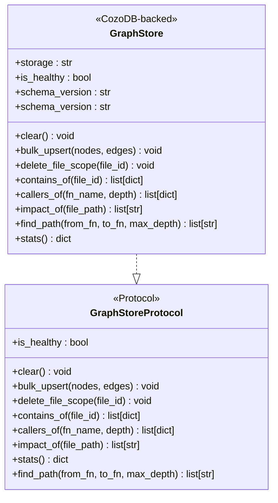

**Diagram sources**
- [cozo_store.py:59-364](file://src/ws_ctx_engine/graph/cozo_store.py#L59-L364)
- [store_protocol.py:17-61](file://src/ws_ctx_engine/graph/store_protocol.py#L17-L61)

**Section sources**
- [cozo_store.py:59-364](file://src/ws_ctx_engine/graph/cozo_store.py#L59-L364)
- [store_protocol.py:17-61](file://src/ws_ctx_engine/graph/store_protocol.py#L17-L61)

### Graph Engine: Symbol Indexing and Resolution
**New** Advanced symbol indexing system for resolving function names and module paths:
- SymbolIndex: resolves raw symbol names to canonical node IDs
- Module resolution: converts dotted module names to file node IDs
- Longest match precedence: most specific module path takes priority
- Iterative processing: no recursion allowed per project rules

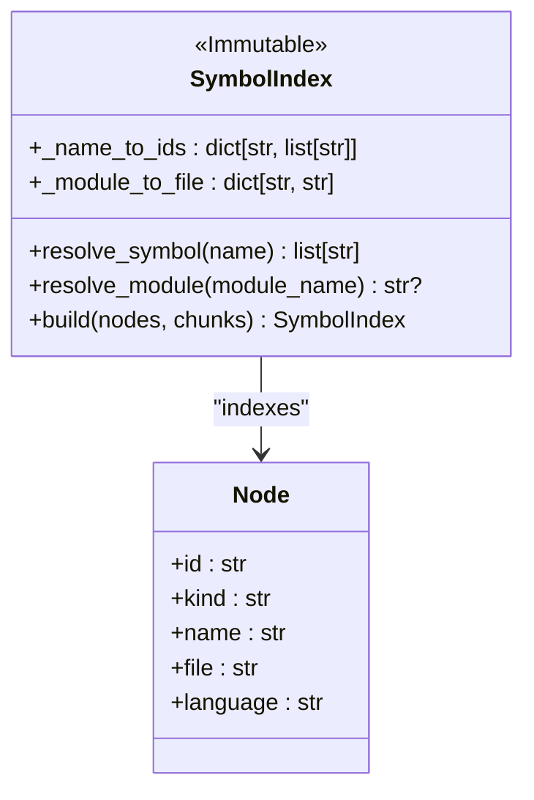

**Diagram sources**
- [symbol_index.py:18-140](file://src/ws_ctx_engine/graph/symbol_index.py#L18-L140)
- [builder.py:22-40](file://src/ws_ctx_engine/graph/builder.py#L22-L40)

**Section sources**
- [symbol_index.py:18-140](file://src/ws_ctx_engine/graph/symbol_index.py#L18-L140)

### Graph Engine: Context Assembly and Signal Routing
**New** Intelligent graph augmentation system:
- SignalRouter: classifies query intent without LLM (callers_of, impact_of, none)
- ContextAssembler: merges vector and graph results with configurable weights
- Graceful degradation: continues without graph augmentation on failures
- Score normalization: maintains consistent scoring across modalities

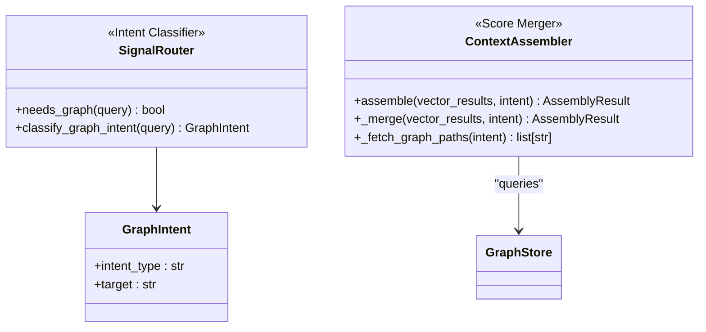

**Diagram sources**
- [signal_router.py:18-133](file://src/ws_ctx_engine/graph/signal_router.py#L18-L133)
- [context_assembler.py:29-167](file://src/ws_ctx_engine/graph/context_assembler.py#L29-L167)

**Section sources**
- [signal_router.py:18-133](file://src/ws_ctx_engine/graph/signal_router.py#L18-L133)
- [context_assembler.py:29-167](file://src/ws_ctx_engine/graph/context_assembler.py#L29-L167)

### Graph Engine: Builder and Validation
**New** Graph construction and validation system:
- chunks_to_graph: creates basic graph with CONTAINS edges only
- chunks_to_full_graph: generates complete graph with CALLS and IMPORTS edges
- SymbolIndex integration: resolves symbols and modules for edge creation
- Graph validation: ensures consistency before ingestion
- Edge deduplication: prevents duplicate edges in final graph

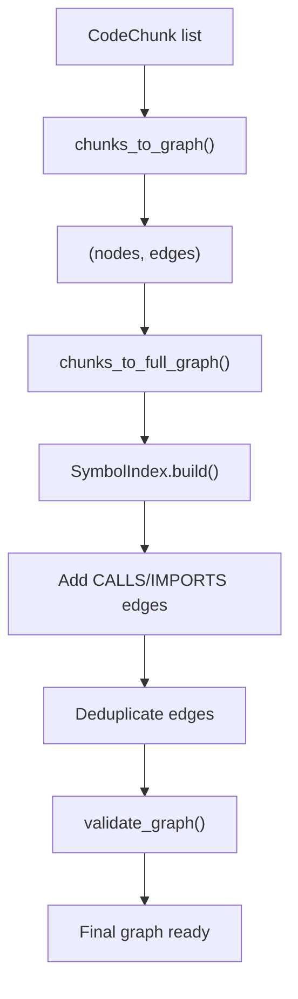

**Diagram sources**
- [builder.py:56-159](file://src/ws_ctx_engine/graph/builder.py#L56-L159)
- [validation.py:23-86](file://src/ws_ctx_engine/graph/validation.py#L23-L86)

**Section sources**
- [builder.py:56-159](file://src/ws_ctx_engine/graph/builder.py#L56-L159)
- [validation.py:23-86](file://src/ws_ctx_engine/graph/validation.py#L23-L86)

### Chunker System
- ASTChunker base with include/exclude logic and .gitignore support.
- TreeSitterChunker: language-specific resolvers for Python, JavaScript, TypeScript, and Rust; extracts definitions and imports.
- Fallback to RegexChunker when Tree-Sitter is unavailable or fails.
- MarkdownChunker integrated for Markdown files.

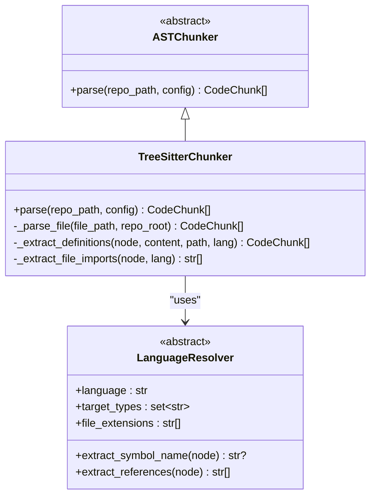

**Diagram sources**
- [base.py:41-176](file://src/ws_ctx_engine/chunker/base.py#L41-L176)
- [tree_sitter.py:15-160](file://src/ws_ctx_engine/chunker/tree_sitter.py#L15-L160)
- [python.py:6-61](file://src/ws_ctx_engine/chunker/resolvers/python.py#L6-L61)

**Section sources**
- [chunker/__init__.py:17-38](file://src/ws_ctx_engine/chunker/__init__.py#L17-L38)
- [base.py:41-176](file://src/ws_ctx_engine/chunker/base.py#L41-L176)
- [tree_sitter.py:57-160](file://src/ws_ctx_engine/chunker/tree_sitter.py#L57-L160)
- [python.py:6-61](file://src/ws_ctx_engine/chunker/resolvers/python.py#L6-L61)

### MCP Tools: Graph Operations
**New** Four specialized graph tools integrated into MCP protocol:
- find_callers: finds all functions and files that call a given function
- impact_analysis: returns files that would be affected by modifying a given file
- graph_search: lists all symbols defined in a given file
- call_chain: traces call path between two functions via BFS

Each tool includes validation, error handling, and rate limiting.

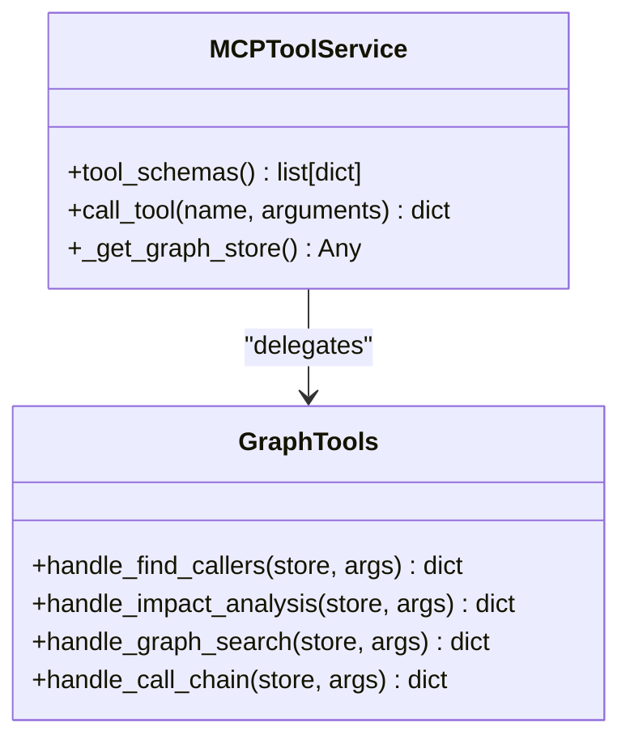

**Diagram sources**
- [tools.py:56-399](file://src/ws_ctx_engine/mcp/tools.py#L56-L399)
- [graph_tools.py:28-103](file://src/ws_ctx_engine/mcp/graph_tools.py#L28-L103)

**Section sources**
- [graph_tools.py:28-103](file://src/ws_ctx_engine/mcp/graph_tools.py#L28-L103)
- [tools.py:56-399](file://src/ws_ctx_engine/mcp/tools.py#L56-L399)

### Domain Keyword Map and Domain Filtering
- Lightweight mapping of domain keywords to directories built during indexing.
- Used at query time to boost files under matched directories and filter by domain.

**Section sources**
- [retrieval.py:25-56](file://src/ws_ctx_engine/retrieval/retrieval.py#L25-L56)

### Budget Manager
- Greedy knapsack selection constrained by token budget.
- Reserves ~20% for metadata and uses ~80% for content.
- Uses tiktoken encoding to estimate token counts.

**Section sources**
- [budget.py:8-105](file://src/ws_ctx_engine/budget/budget.py#L8-L105)

### Ranking: AI Rule Boost
- Persistent boosting of canonical AI rule files to ensure inclusion regardless of query.
- Supports extra user-configured files and adjustable boost magnitude.

**Section sources**
- [ranker.py:28-86](file://src/ws_ctx_engine/ranking/ranker.py#L28-L86)

## Dependency Analysis
Module-level relationships:
- Workflow depends on Chunker, Vector Index, Graph, Models, Config, Budget, and Ranking.
- Retrieval depends on Vector Index and Graph.
- Vector Index depends on EmbeddingGenerator and models.
- Graph depends on models, CozoDB store, SymbolIndex, and validation.
- Chunker depends on base utilities and resolvers.
- **New**: ContextAssembler depends on SignalRouter and GraphStore.
- **New**: MCP tools depend on GraphTools and GraphStore.

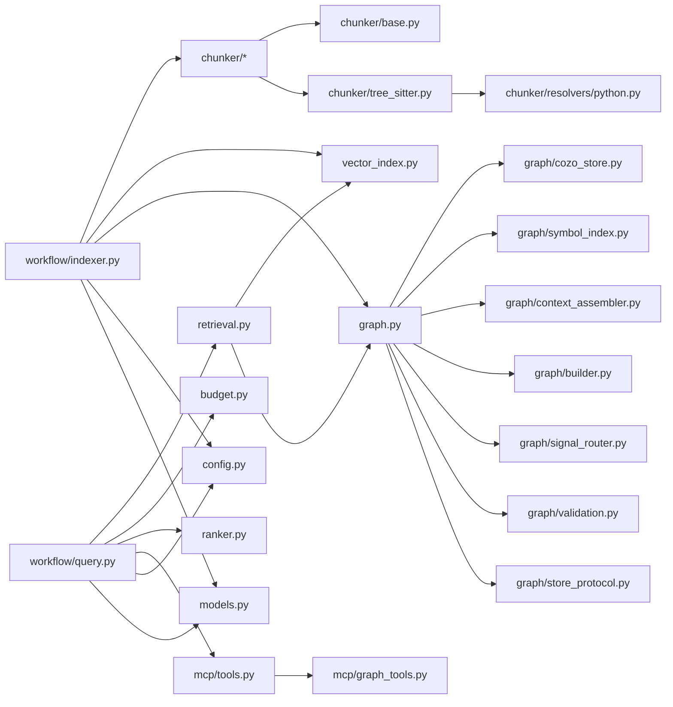

**Diagram sources**
- [indexer.py:14-22](file://src/ws_ctx_engine/workflow/indexer.py#L14-L22)
- [query.py:13-22](file://src/ws_ctx_engine/workflow/query.py#L13-L22)
- [retrieval.py:19-21](file://src/ws_ctx_engine/retrieval/retrieval.py#L19-L21)
- [vector_index.py:17-18](file://src/ws_ctx_engine/vector_index/vector_index.py#L17-L18)
- [graph.py:13-14](file://src/ws_ctx_engine/graph/graph.py#L13-L14)
- [chunker/__init__.py:1-16](file://src/ws_ctx_engine/chunker/__init__.py#L1-L16)
- [base.py:1-8](file://src/ws_ctx_engine/chunker/base.py#L1-L8)
- [tree_sitter.py:1-11](file://src/ws_ctx_engine/chunker/tree_sitter.py#L1-L11)
- [python.py:1-4](file://src/ws_ctx_engine/chunker/resolvers/python.py#L1-L4)
- [cozo_store.py:22-25](file://src/ws_ctx_engine/graph/cozo_store.py#L22-L25)
- [symbol_index.py:13-15](file://src/ws_ctx_engine/graph/symbol_index.py#L13-L15)
- [context_assembler.py:15-17](file://src/ws_ctx_engine/graph/context_assembler.py#L15-L17)
- [builder.py:13-16](file://src/ws_ctx_engine/graph/builder.py#L13-L16)
- [signal_router.py:8-11](file://src/ws_ctx_engine/graph/signal_router.py#L8-L11)
- [validation.py:11-11](file://src/ws_ctx_engine/graph/validation.py#L11-L11)
- [store_protocol.py:11-14](file://src/ws_ctx_engine/graph/store_protocol.py#L11-L14)
- [tools.py:12-22](file://src/ws_ctx_engine/mcp/tools.py#L12-L22)
- [graph_tools.py:11-13](file://src/ws_ctx_engine/mcp/graph_tools.py#L11-L13)

**Section sources**
- [__init__.py:8-32](file://src/ws_ctx_engine/__init__.py#L8-L32)
- [workflow/__init__.py:1-5](file://src/ws_ctx_engine/workflow/__init__.py#L1-L5)

## Performance Considerations
- Incremental indexing: detect changed/deleted files and update vector index incrementally when possible.
- Embedding cache: reuse embeddings across runs to avoid re-encoding unchanged files.
- Backend selection: prefer igraph for PageRank; use NetworkX as fallback; choose LEANN or FAISS for vector index depending on environment.
- Memory-aware embedding generation: automatically switch to API fallback when local memory is low.
- Token budgeting: reserve ~20% for metadata; greedy selection maximizes relevance within content budget.
- Output pre-processing: optional compression and session-level deduplication reduce output size.
- **New**: CozoDB graph store performance: schema version tracking, query metrics, graceful degradation when pycozo unavailable.
- **New**: Graph augmentation: configurable weight for graph query results, with automatic fallback on failures.
- **New**: Symbol indexing: iterative processing avoids recursion overhead, with longest-match module resolution.

## Troubleshooting Guide
Common issues and strategies:
- Missing or incompatible backends:
  - Graph: install python-igraph or networkx; igraph load failures will trigger fallback warnings.
  - Vector Index: install faiss-cpu for FAISS; otherwise LEANN is used.
  - Embeddings: install sentence-transformers or provide OPENAI_API_KEY for API fallback.
  - **New**: CozoDB: install pycozo for graph store functionality; store degrades gracefully when unavailable.
- Stale indexes:
  - Automatic staleness detection compares file hashes; disable auto-rebuild if needed.
- Low memory during embedding:
  - Local model initialization may be skipped; ensure sufficient RAM or use API fallback.
- File parsing failures:
  - Tree-Sitter parsing exceptions are caught and logged; fallback to RegexChunker is attempted.
- Invalid configuration:
  - Weights must sum to 1.0; patterns must be lists of strings; invalid values revert to defaults.
- **New**: Graph store issues:
  - Schema version mismatches trigger warnings and suggest re-indexing.
  - Query failures are logged but don't crash the system; operations return empty results.
  - Health monitoring helps diagnose connectivity issues.
- **New**: Graph augmentation failures:
  - Intent classification errors are handled gracefully; system continues with vector-only results.
  - Graph store unavailability triggers fallback to pure vector search.
- **New**: MCP tool rate limiting:
  - Exceeded rate limits return standardized error responses with retry information.
  - Tool schemas include comprehensive input validation.

**Section sources**
- [graph.py:115-122](file://src/ws_ctx_engine/graph/graph.py#L115-L122)
- [vector_index.py:141-171](file://src/ws_ctx_engine/vector_index/vector_index.py#L141-L171)
- [vector_index.py:210-244](file://src/ws_ctx_engine/vector_index/vector_index.py#L210-L244)
- [indexer.py:146-154](file://src/ws_ctx_engine/workflow/indexer.py#L146-L154)
- [indexer.py:226-230](file://src/ws_ctx_engine/workflow/indexer.py#L226-L230)
- [config.py:261-269](file://src/ws_ctx_engine/config/config.py#L261-L269)
- [cozo_store.py:78-83](file://src/ws_ctx_engine/graph/cozo_store.py#L78-L83)
- [cozo_store.py:107-115](file://src/ws_ctx_engine/graph/cozo_store.py#L107-L115)
- [context_assembler.py:78-84](file://src/ws_ctx_engine/graph/context_assembler.py#L78-L84)
- [tools.py:355-362](file://src/ws_ctx_engine/mcp/tools.py#L355-L362)

## Conclusion
ws-ctx-engine integrates AST-based parsing, semantic search, structural ranking, and token-aware selection to deliver high-quality, query-focused context packs. The enhanced system now includes comprehensive graph engine capabilities with CozoDB integration, advanced symbol indexing, intelligent graph augmentation, and MCP protocol support for graph operations. Its modular design enables robust fallbacks, incremental updates, flexible configuration, and seamless graph-aware tool integration, making it suitable for repositories of varying sizes and ecosystems.