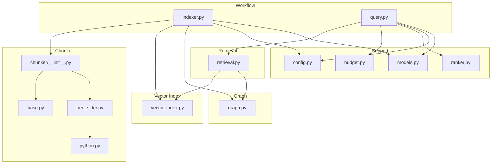
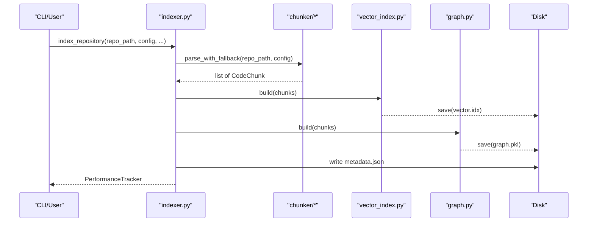
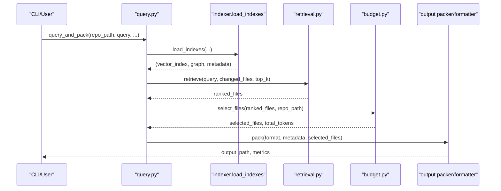
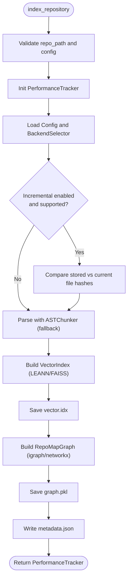
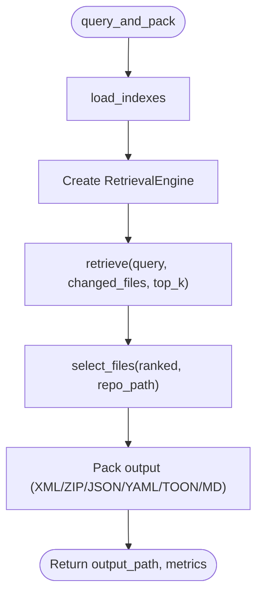
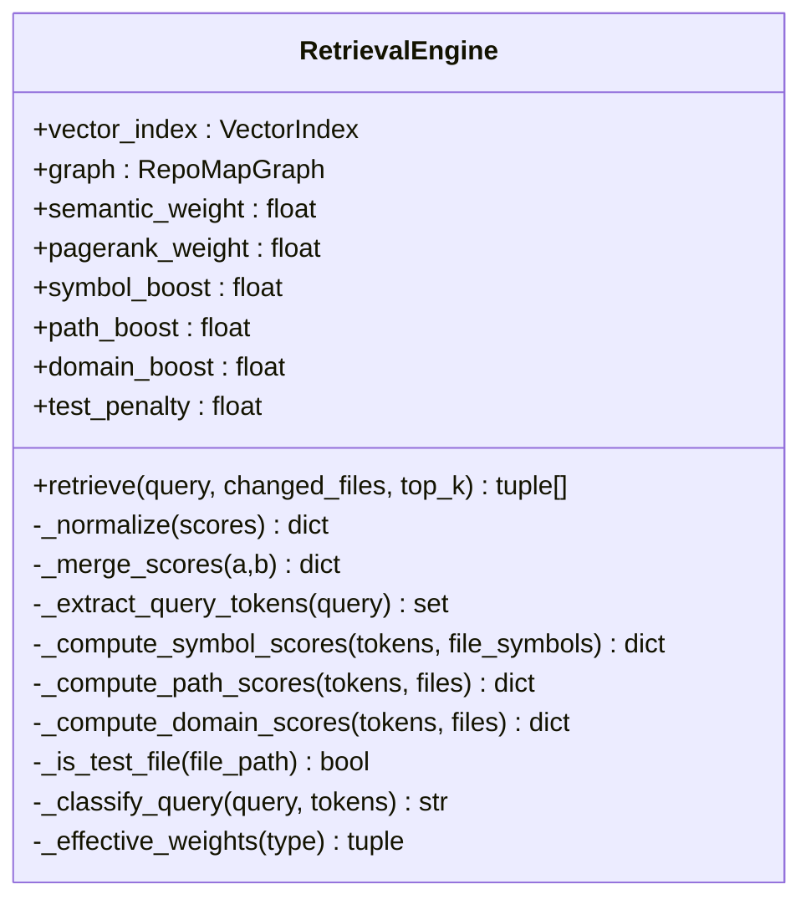
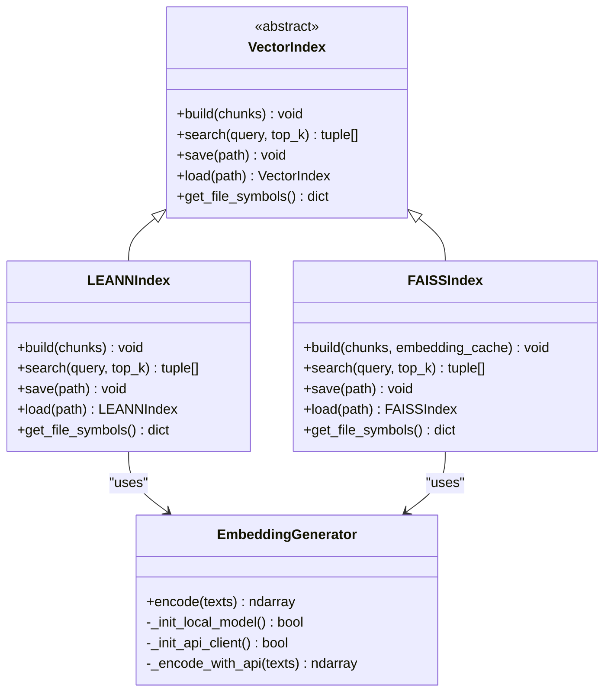
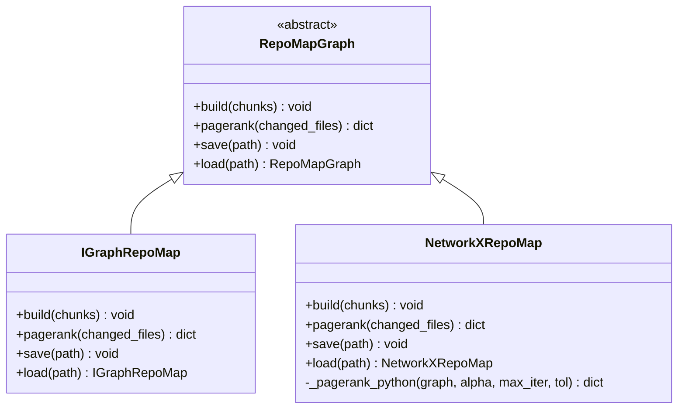
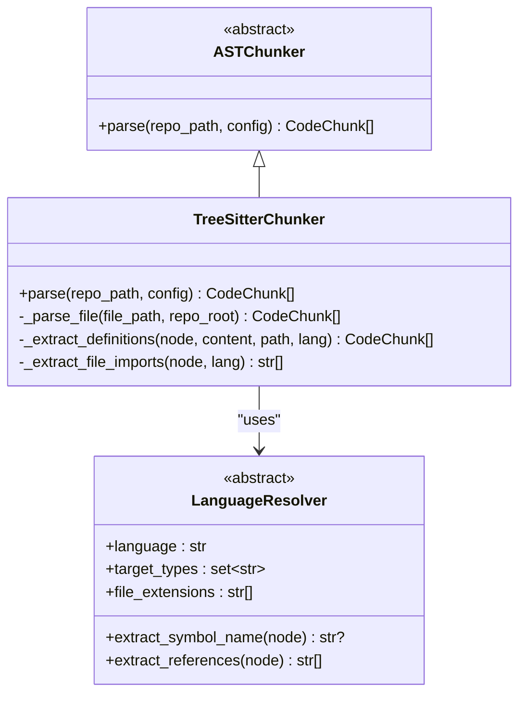
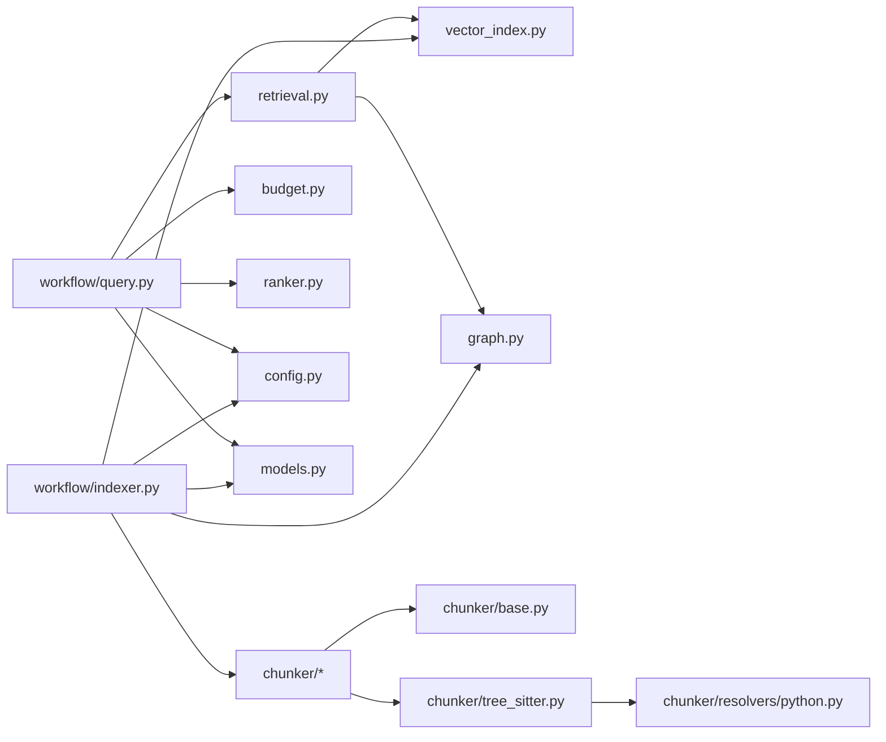

# Core Modules

<cite>
**Referenced Files in This Document**
- [__init__.py](file://src/ws_ctx_engine/__init__.py)
- [workflow/__init__.py](file://src/ws_ctx_engine/workflow/__init__.py)
- [indexer.py](file://src/ws_ctx_engine/workflow/indexer.py)
- [query.py](file://src/ws_ctx_engine/workflow/query.py)
- [retrieval/__init__.py](file://src/ws_ctx_engine/retrieval/__init__.py)
- [retrieval.py](file://src/ws_ctx_engine/retrieval/retrieval.py)
- [vector_index/__init__.py](file://src/ws_ctx_engine/vector_index/__init__.py)
- [vector_index.py](file://src/ws_ctx_engine/vector_index/vector_index.py)
- [graph/__init__.py](file://src/ws_ctx_engine/graph/__init__.py)
- [graph.py](file://src/ws_ctx_engine/graph/graph.py)
- [chunker/__init__.py](file://src/ws_ctx_engine/chunker/__init__.py)
- [base.py](file://src/ws_ctx_engine/chunker/base.py)
- [tree_sitter.py](file://src/ws_ctx_engine/chunker/tree_sitter.py)
- [python.py](file://src/ws_ctx_engine/chunker/resolvers/python.py)
- [models.py](file://src/ws_ctx_engine/models/models.py)
- [config.py](file://src/ws_ctx_engine/config/config.py)
- [budget.py](file://src/ws_ctx_engine/budget/budget.py)
- [ranker.py](file://src/ws_ctx_engine/ranking/ranker.py)
</cite>

## Table of Contents
1. [Introduction](#introduction)
2. [Project Structure](#project-structure)
3. [Core Components](#core-components)
4. [Architecture Overview](#architecture-overview)
5. [Detailed Component Analysis](#detailed-component-analysis)
6. [Dependency Analysis](#dependency-analysis)
7. [Performance Considerations](#performance-considerations)
8. [Troubleshooting Guide](#troubleshooting-guide)
9. [Conclusion](#conclusion)

## Introduction
This document explains the core modules of ws-ctx-engine that power intelligent codebase packaging for LLMs. It covers the indexing pipeline, query processing, hybrid ranking, vector similarity search, PageRank computation, and language-specific AST parsing. The goal is to help both beginners and experienced developers understand how the system works, how modules integrate, and how to configure and operate them effectively.

## Project Structure
The core modules are organized by responsibility:
- Workflow: orchestration of index and query phases
- Retrieval: hybrid ranking combining semantic and structural signals
- Vector Index: semantic search over code chunks
- Graph: dependency graph and PageRank computation
- Chunker: AST-based parsing with language-specific resolvers
- Models and Config: shared data structures and configuration
- Budget: token-aware file selection
- Ranking: AI rule boosting

**Diagram sources**
- [indexer.py:72-371](file://src/ws_ctx_engine/workflow/indexer.py#L72-L371)
- [query.py:230-617](file://src/ws_ctx_engine/workflow/query.py#L230-L617)
- [retrieval.py:140-369](file://src/ws_ctx_engine/retrieval/retrieval.py#L140-L369)
- [vector_index.py:21-800](file://src/ws_ctx_engine/vector_index/vector_index.py#L21-L800)
- [graph.py:19-667](file://src/ws_ctx_engine/graph/graph.py#L19-L667)
- [chunker/__init__.py:1-55](file://src/ws_ctx_engine/chunker/__init__.py#L1-L55)
- [base.py:41-176](file://src/ws_ctx_engine/chunker/base.py#L41-L176)
- [tree_sitter.py:15-160](file://src/ws_ctx_engine/chunker/tree_sitter.py#L15-L160)
- [python.py:6-61](file://src/ws_ctx_engine/chunker/resolvers/python.py#L6-L61)
- [config.py:16-399](file://src/ws_ctx_engine/config/config.py#L16-L399)
- [models.py:10-152](file://src/ws_ctx_engine/models/models.py#L10-L152)
- [budget.py:8-105](file://src/ws_ctx_engine/budget/budget.py#L8-L105)
- [ranker.py:28-86](file://src/ws_ctx_engine/ranking/ranker.py#L28-L86)

**Section sources**
- [__init__.py:8-32](file://src/ws_ctx_engine/__init__.py#L8-L32)
- [workflow/__init__.py:1-5](file://src/ws_ctx_engine/workflow/__init__.py#L1-L5)

## Core Components
- Workflow: orchestrates index and query phases, manages performance tracking, and coordinates persistence/loading of indexes.
- Retrieval: hybrid ranking engine that merges semantic similarity and PageRank, then applies query-aware boosts and penalties.
- Vector Index: embeds code chunks and supports semantic search with multiple backends (LEANN, FAISS) and optional API fallback.
- Graph: constructs a symbol-dependency graph and computes PageRank scores with optional boosting for changed files.
- Chunker: parses code using AST (Tree-Sitter) with language-specific resolvers and falls back to regex-based chunking when needed.
- Models and Config: shared data models and robust configuration loader with validation.
- Budget: greedy selection constrained by token budgets using tiktoken.
- Ranking: persistent boosting of AI rule files to ensure they appear in every pack.

**Section sources**
- [indexer.py:72-371](file://src/ws_ctx_engine/workflow/indexer.py#L72-L371)
- [query.py:230-617](file://src/ws_ctx_engine/workflow/query.py#L230-L617)
- [retrieval.py:140-369](file://src/ws_ctx_engine/retrieval/retrieval.py#L140-L369)
- [vector_index.py:21-800](file://src/ws_ctx_engine/vector_index/vector_index.py#L21-L800)
- [graph.py:19-667](file://src/ws_ctx_engine/graph/graph.py#L19-L667)
- [chunker/__init__.py:17-38](file://src/ws_ctx_engine/chunker/__init__.py#L17-L38)
- [base.py:41-176](file://src/ws_ctx_engine/chunker/base.py#L41-L176)
- [tree_sitter.py:15-160](file://src/ws_ctx_engine/chunker/tree_sitter.py#L15-L160)
- [models.py:10-152](file://src/ws_ctx_engine/models/models.py#L10-L152)
- [config.py:16-399](file://src/ws_ctx_engine/config/config.py#L16-L399)
- [budget.py:8-105](file://src/ws_ctx_engine/budget/budget.py#L8-L105)
- [ranker.py:28-86](file://src/ws_ctx_engine/ranking/ranker.py#L28-L86)

## Architecture Overview
The system follows a two-phase workflow:
- Index phase: parse repository, build vector index and graph, persist artifacts, and record metadata for staleness detection.
- Query phase: load indexes, retrieve candidates with hybrid ranking, select within token budget, and pack output in the configured format.

**Diagram sources**
- [indexer.py:72-371](file://src/ws_ctx_engine/workflow/indexer.py#L72-L371)
- [chunker/__init__.py:17-38](file://src/ws_ctx_engine/chunker/__init__.py#L17-L38)
- [vector_index.py:280-501](file://src/ws_ctx_engine/vector_index/vector_index.py#L280-L501)
- [graph.py:97-315](file://src/ws_ctx_engine/graph/graph.py#L97-L315)

**Diagram sources**
- [query.py:230-617](file://src/ws_ctx_engine/workflow/query.py#L230-L617)
- [indexer.py:404-492](file://src/ws_ctx_engine/workflow/indexer.py#L404-L492)
- [retrieval.py:250-369](file://src/ws_ctx_engine/retrieval/retrieval.py#L250-L369)
- [budget.py:50-105](file://src/ws_ctx_engine/budget/budget.py#L50-L105)

## Detailed Component Analysis

### Workflow: Indexer
Responsibilities:
- Parse repository with AST chunker (Tree-Sitter with fallback to Regex).
- Build vector index with optional embedding cache and incremental update support.
- Build graph (PageRank) with fallback between igraph and NetworkX.
- Persist artifacts and metadata for staleness detection.
- Support domain-only rebuilds and incremental mode gated by configuration.

Key behaviors:
- Incremental detection compares stored file hashes with current disk state.
- Embedding cache avoids re-embedding unchanged files on full rebuilds.
- Metadata tracks backend and file counts to inform staleness and health reporting.

**Diagram sources**
- [indexer.py:72-371](file://src/ws_ctx_engine/workflow/indexer.py#L72-L371)

**Section sources**
- [indexer.py:72-371](file://src/ws_ctx_engine/workflow/indexer.py#L72-L371)

### Workflow: Query Processor
Responsibilities:
- Load persisted indexes with staleness detection and optional auto-rebuild.
- Hybrid retrieval: combine semantic and PageRank scores, then apply query-aware boosts and penalties.
- Token budget selection using greedy knapsack.
- Output packing in XML, ZIP, or structured formats (JSON/YAML/TOON/Markdown).
- Optional session-level deduplication and compression.

**Diagram sources**
- [query.py:230-617](file://src/ws_ctx_engine/workflow/query.py#L230-L617)
- [retrieval.py:250-369](file://src/ws_ctx_engine/retrieval/retrieval.py#L250-L369)
- [budget.py:50-105](file://src/ws_ctx_engine/budget/budget.py#L50-L105)

**Section sources**
- [query.py:230-617](file://src/ws_ctx_engine/workflow/query.py#L230-L617)

### Retrieval Engine
Hybrid ranking combines:
- Semantic scores from vector search
- Structural scores from PageRank
- Symbol exact-match boost
- Path keyword boost
- Domain directory boost
- Test file penalty
- AI rule file boost

Normalization ensures final scores are in [0, 1].

**Diagram sources**
- [retrieval.py:140-627](file://src/ws_ctx_engine/retrieval/retrieval.py#L140-L627)

**Section sources**
- [retrieval.py:140-369](file://src/ws_ctx_engine/retrieval/retrieval.py#L140-L369)

### Vector Index
Backends:
- LEANNIndex: stores file embeddings and symbol maps; cosine similarity search.
- FAISSIndex: brute-force exact search with IndexIDMap2 for incremental updates.
- EmbeddingGenerator: local sentence-transformers with fallback to OpenAI API.

Capabilities:
- Build from CodeChunk list
- Search returning (file_path, similarity) tuples
- Save/load with pickle or FAISS-native formats
- Optional embedding cache reuse across runs

**Diagram sources**
- [vector_index.py:21-800](file://src/ws_ctx_engine/vector_index/vector_index.py#L21-L800)

**Section sources**
- [vector_index.py:280-501](file://src/ws_ctx_engine/vector_index/vector_index.py#L280-L501)
- [vector_index.py:503-800](file://src/ws_ctx_engine/vector_index/vector_index.py#L503-L800)

### Graph Engine (RepoMap Graph and PageRank)
Backends:
- IGraphRepoMap: C++ backend via python-igraph; fast PageRank computation with boost for changed files.
- NetworkXRepoMap: pure Python fallback; includes scipy-backed or power-iteration fallback.

Capabilities:
- Build directed dependency graph from symbol definitions and references
- Compute PageRank scores and optionally boost changed files
- Persist/load graph with automatic backend detection

**Diagram sources**
- [graph.py:19-667](file://src/ws_ctx_engine/graph/graph.py#L19-L667)

**Section sources**
- [graph.py:97-315](file://src/ws_ctx_engine/graph/graph.py#L97-L315)
- [graph.py:317-570](file://src/ws_ctx_engine/graph/graph.py#L317-L570)

### Chunker System
- ASTChunker base with include/exclude logic and .gitignore support.
- TreeSitterChunker: language-specific resolvers for Python, JavaScript, TypeScript, and Rust; extracts definitions and imports.
- Fallback to RegexChunker when Tree-Sitter is unavailable or fails.
- MarkdownChunker integrated for Markdown files.

**Diagram sources**
- [base.py:41-176](file://src/ws_ctx_engine/chunker/base.py#L41-L176)
- [tree_sitter.py:15-160](file://src/ws_ctx_engine/chunker/tree_sitter.py#L15-L160)
- [python.py:6-61](file://src/ws_ctx_engine/chunker/resolvers/python.py#L6-L61)

**Section sources**
- [chunker/__init__.py:17-38](file://src/ws_ctx_engine/chunker/__init__.py#L17-L38)
- [base.py:41-176](file://src/ws_ctx_engine/chunker/base.py#L41-L176)
- [tree_sitter.py:57-160](file://src/ws_ctx_engine/chunker/tree_sitter.py#L57-L160)
- [python.py:6-61](file://src/ws_ctx_engine/chunker/resolvers/python.py#L6-L61)

### Domain Keyword Map and Domain Filtering
- Lightweight mapping of domain keywords to directories built during indexing.
- Used at query time to boost files under matched directories and filter by domain.

**Section sources**
- [retrieval.py:25-56](file://src/ws_ctx_engine/retrieval/retrieval.py#L25-L56)

### Budget Manager
- Greedy knapsack selection constrained by token budget.
- Reserves ~20% for metadata and uses ~80% for content.
- Uses tiktoken encoding to estimate token counts.

**Section sources**
- [budget.py:8-105](file://src/ws_ctx_engine/budget/budget.py#L8-L105)

### Ranking: AI Rule Boost
- Persistent boosting of canonical AI rule files to ensure inclusion regardless of query.
- Supports extra user-configured files and adjustable boost magnitude.

**Section sources**
- [ranker.py:28-86](file://src/ws_ctx_engine/ranking/ranker.py#L28-L86)

## Dependency Analysis
Module-level relationships:
- Workflow depends on Chunker, Vector Index, Graph, Models, Config, Budget, and Ranking.
- Retrieval depends on Vector Index and Graph.
- Vector Index depends on EmbeddingGenerator and models.
- Graph depends on models and supports multiple backends.
- Chunker depends on base utilities and resolvers.

**Diagram sources**
- [indexer.py:14-22](file://src/ws_ctx_engine/workflow/indexer.py#L14-L22)
- [query.py:13-22](file://src/ws_ctx_engine/workflow/query.py#L13-L22)
- [retrieval.py:19-21](file://src/ws_ctx_engine/retrieval/retrieval.py#L19-L21)
- [vector_index.py:17-18](file://src/ws_ctx_engine/vector_index/vector_index.py#L17-L18)
- [graph.py:13-14](file://src/ws_ctx_engine/graph/graph.py#L13-L14)
- [chunker/__init__.py:1-16](file://src/ws_ctx_engine/chunker/__init__.py#L1-L16)
- [base.py:1-8](file://src/ws_ctx_engine/chunker/base.py#L1-L8)
- [tree_sitter.py:1-11](file://src/ws_ctx_engine/chunker/tree_sitter.py#L1-L11)
- [python.py:1-4](file://src/ws_ctx_engine/chunker/resolvers/python.py#L1-L4)

**Section sources**
- [__init__.py:8-32](file://src/ws_ctx_engine/__init__.py#L8-L32)
- [workflow/__init__.py:1-5](file://src/ws_ctx_engine/workflow/__init__.py#L1-L5)

## Performance Considerations
- Incremental indexing: detect changed/deleted files and update vector index incrementally when possible.
- Embedding cache: reuse embeddings across runs to avoid re-encoding unchanged files.
- Backend selection: prefer igraph for PageRank; use NetworkX as fallback; choose LEANN or FAISS for vector index depending on environment.
- Memory-aware embedding generation: automatically switch to API fallback when local memory is low.
- Token budgeting: reserve ~20% for metadata; greedy selection maximizes relevance within content budget.
- Output pre-processing: optional compression and session-level deduplication reduce output size.

[No sources needed since this section provides general guidance]

## Troubleshooting Guide
Common issues and strategies:
- Missing or incompatible backends:
  - Graph: install python-igraph or networkx; igraph load failures will trigger fallback warnings.
  - Vector Index: install faiss-cpu for FAISS; otherwise LEANN is used.
  - Embeddings: install sentence-transformers or provide OPENAI_API_KEY for API fallback.
- Stale indexes:
  - Automatic staleness detection compares file hashes; disable auto-rebuild if needed.
- Low memory during embedding:
  - Local model initialization may be skipped; ensure sufficient RAM or use API fallback.
- File parsing failures:
  - Tree-Sitter parsing exceptions are caught and logged; fallback to RegexChunker is attempted.
- Invalid configuration:
  - Weights must sum to 1.0; patterns must be lists of strings; invalid values revert to defaults.

**Section sources**
- [graph.py:115-122](file://src/ws_ctx_engine/graph/graph.py#L115-L122)
- [vector_index.py:141-171](file://src/ws_ctx_engine/vector_index/vector_index.py#L141-L171)
- [vector_index.py:210-244](file://src/ws_ctx_engine/vector_index/vector_index.py#L210-L244)
- [indexer.py:146-154](file://src/ws_ctx_engine/workflow/indexer.py#L146-L154)
- [indexer.py:226-230](file://src/ws_ctx_engine/workflow/indexer.py#L226-L230)
- [config.py:261-269](file://src/ws_ctx_engine/config/config.py#L261-L269)

## Conclusion
ws-ctx-engine integrates AST-based parsing, semantic search, structural ranking, and token-aware selection to deliver high-quality, query-focused context packs. Its modular design enables robust fallbacks, incremental updates, and flexible configuration, making it suitable for repositories of varying sizes and ecosystems.