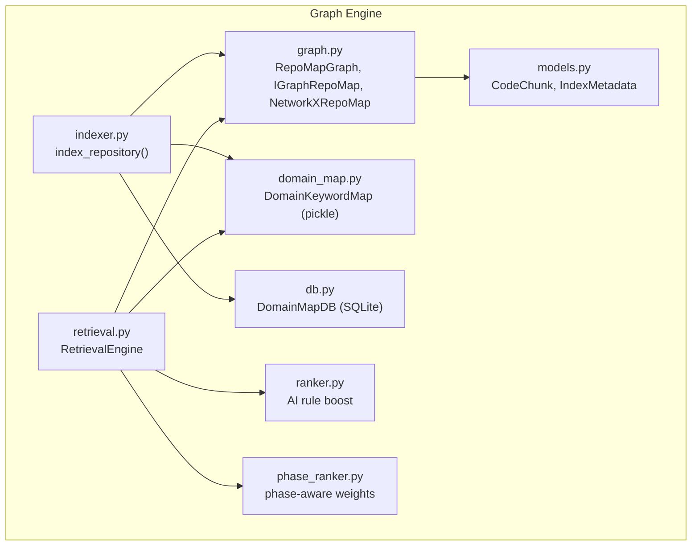
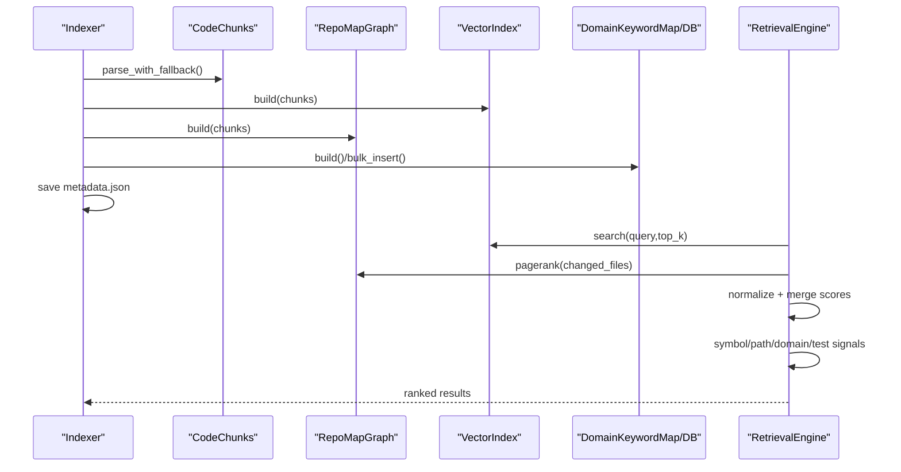
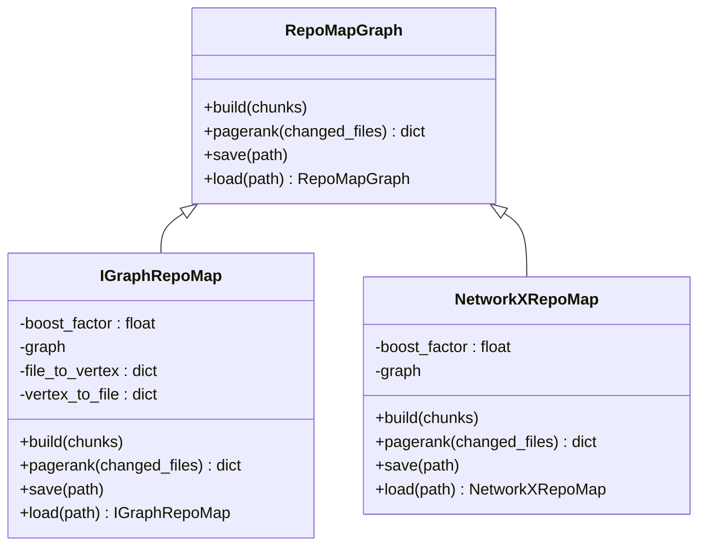
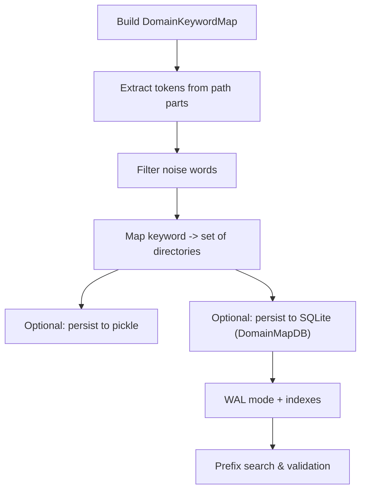
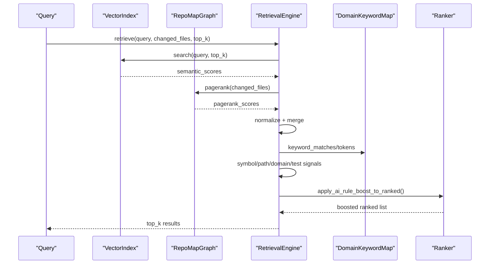
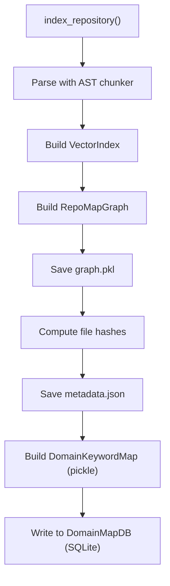
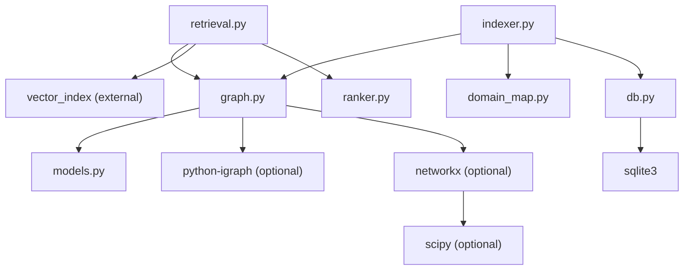

# Graph Engine

<cite>
**Referenced Files in This Document**
- [graph.py](file://src/ws_ctx_engine/graph/graph.py)
- [domain_map.py](file://src/ws_ctx_engine/domain_map/domain_map.py)
- [db.py](file://src/ws_ctx_engine/domain_map/db.py)
- [retrieval.py](file://src/ws_ctx_engine/retrieval/retrieval.py)
- [indexer.py](file://src/ws_ctx_engine/workflow/indexer.py)
- [models.py](file://src/ws_ctx_engine/models/models.py)
- [ranker.py](file://src/ws_ctx_engine/ranking/ranker.py)
- [phase_ranker.py](file://src/ws_ctx_engine/ranking/phase_ranker.py)
- [graph.md](file://docs/reference/graph.md)
- [retrieval.md](file://docs/reference/retrieval.md)
- [test_graph.py](file://tests/unit/test_graph.py)
- [test_domain_map.py](file://tests/unit/test_domain_map.py)
- [test_domain_map_db.py](file://tests/unit/test_domain_map_db.py)
</cite>

## Table of Contents
1. [Introduction](#introduction)
2. [Project Structure](#project-structure)
3. [Core Components](#core-components)
4. [Architecture Overview](#architecture-overview)
5. [Detailed Component Analysis](#detailed-component-analysis)
6. [Dependency Analysis](#dependency-analysis)
7. [Performance Considerations](#performance-considerations)
8. [Troubleshooting Guide](#troubleshooting-guide)
9. [Conclusion](#conclusion)
10. [Appendices](#appendices)

## Introduction
This document describes the graph engine module responsible for constructing dependency graphs from code analysis, computing PageRank scores for structural ranking, and integrating with the domain mapping system for semantic and structural retrieval. It explains the graph representation, node relationships, edge semantics, traversal algorithms, and the database backend for persistent storage. It also covers performance optimization strategies for large codebases, memory management, and incremental graph updates.

## Project Structure
The graph engine spans several modules:
- Graph construction and PageRank: [graph.py](file://src/ws_ctx_engine/graph/graph.py)
- Domain keyword mapping (pickle and SQLite): [domain_map.py](file://src/ws_ctx_engine/domain_map/domain_map.py), [db.py](file://src/ws_ctx_engine/domain_map/db.py)
- Retrieval integration: [retrieval.py](file://src/ws_ctx_engine/retrieval/retrieval.py)
- Indexing workflow: [indexer.py](file://src/ws_ctx_engine/workflow/indexer.py)
- Data models: [models.py](file://src/ws_ctx_engine/models/models.py)
- Ranking integration: [ranker.py](file://src/ws_ctx_engine/ranking/ranker.py), [phase_ranker.py](file://src/ws_ctx_engine/ranking/phase_ranker.py)

**Diagram sources**
- [graph.py:1-667](file://src/ws_ctx_engine/graph/graph.py#L1-L667)
- [retrieval.py:1-627](file://src/ws_ctx_engine/retrieval/retrieval.py#L1-L627)
- [domain_map.py:1-147](file://src/ws_ctx_engine/domain_map/domain_map.py#L1-L147)
- [db.py:1-518](file://src/ws_ctx_engine/domain_map/db.py#L1-L518)
- [indexer.py:1-493](file://src/ws_ctx_engine/workflow/indexer.py#L1-L493)
- [models.py:1-152](file://src/ws_ctx_engine/models/models.py#L1-L152)
- [ranker.py:1-86](file://src/ws_ctx_engine/ranking/ranker.py#L1-L86)
- [phase_ranker.py:1-138](file://src/ws_ctx_engine/ranking/phase_ranker.py#L1-L138)

**Section sources**
- [graph.py:1-667](file://src/ws_ctx_engine/graph/graph.py#L1-L667)
- [domain_map.py:1-147](file://src/ws_ctx_engine/domain_map/domain_map.py#L1-L147)
- [db.py:1-518](file://src/ws_ctx_engine/domain_map/db.py#L1-L518)
- [retrieval.py:1-627](file://src/ws_ctx_engine/retrieval/retrieval.py#L1-L627)
- [indexer.py:1-493](file://src/ws_ctx_engine/workflow/indexer.py#L1-L493)
- [models.py:1-152](file://src/ws_ctx_engine/models/models.py#L1-L152)
- [ranker.py:1-86](file://src/ws_ctx_engine/ranking/ranker.py#L1-L86)
- [phase_ranker.py:1-138](file://src/ws_ctx_engine/ranking/phase_ranker.py#L1-L138)

## Core Components
- RepoMapGraph: Abstract interface for dependency graph construction and PageRank computation.
- IGraphRepoMap: Fast implementation using python-igraph (C++ backend).
- NetworkXRepoMap: Portable fallback using NetworkX (Python) with optional pure-Python PageRank.
- DomainKeywordMap: Lightweight keyword-to-directories mapping for query classification.
- DomainMapDB: SQLite-backed domain map with WAL mode, indexes, and migration support.
- RetrievalEngine: Hybrid retrieval combining semantic similarity and PageRank with additional signals.
- Indexer workflow: Builds and persists indexes (vector, graph, domain map) and supports incremental updates.

**Section sources**
- [graph.py:19-95](file://src/ws_ctx_engine/graph/graph.py#L19-L95)
- [graph.py:97-315](file://src/ws_ctx_engine/graph/graph.py#L97-L315)
- [graph.py:317-570](file://src/ws_ctx_engine/graph/graph.py#L317-L570)
- [domain_map.py:11-147](file://src/ws_ctx_engine/domain_map/domain_map.py#L11-L147)
- [db.py:22-310](file://src/ws_ctx_engine/domain_map/db.py#L22-L310)
- [retrieval.py:140-369](file://src/ws_ctx_engine/retrieval/retrieval.py#L140-L369)
- [indexer.py:72-372](file://src/ws_ctx_engine/workflow/indexer.py#L72-L372)

## Architecture Overview
The graph engine integrates with the broader retrieval pipeline:
- Code chunks (symbols defined/referenced) feed into RepoMapGraph to build a directed dependency graph.
- PageRank scores reflect structural importance; optionally boosted for changed files.
- RetrievalEngine blends semantic scores, PageRank, symbol/path/domain signals, and test penalties.
- DomainKeywordMap (pickle) and DomainMapDB (SQLite) classify queries and boost relevant directories.
- Indexer coordinates parsing, building, and persisting indexes for incremental reuse.

**Diagram sources**
- [indexer.py:72-372](file://src/ws_ctx_engine/workflow/indexer.py#L72-L372)
- [retrieval.py:250-369](file://src/ws_ctx_engine/retrieval/retrieval.py#L250-L369)
- [graph.py:188-234](file://src/ws_ctx_engine/graph/graph.py#L188-L234)
- [domain_map.py:77-147](file://src/ws_ctx_engine/domain_map/domain_map.py#L77-L147)
- [db.py:107-178](file://src/ws_ctx_engine/domain_map/db.py#L107-L178)

## Detailed Component Analysis

### Graph Construction and PageRank
- Graph representation:
  - Nodes: unique file paths from CodeChunk instances.
  - Edges: directed from A to B if A references a symbol defined in B.
  - No self-loops; edges derived from symbol references mapped to symbol definitions.
- Backend selection:
  - IGraphRepoMap uses python-igraph for speed; NetworkXRepoMap provides a portable fallback.
  - Automatic fallback when igraph is unavailable.
- PageRank computation:
  - Base scores from PageRank; optional boost for changed files multiplied by a configurable factor and renormalized.
  - NetworkX fallback includes a pure Python power iteration when scipy is unavailable.
- Persistence:
  - Both backends serialize to pickle with backend metadata for auto-detection on load.

**Diagram sources**
- [graph.py:19-95](file://src/ws_ctx_engine/graph/graph.py#L19-L95)
- [graph.py:97-128](file://src/ws_ctx_engine/graph/graph.py#L97-L128)
- [graph.py:317-346](file://src/ws_ctx_engine/graph/graph.py#L317-L346)

**Section sources**
- [graph.py:129-187](file://src/ws_ctx_engine/graph/graph.py#L129-L187)
- [graph.py:188-234](file://src/ws_ctx_engine/graph/graph.py#L188-L234)
- [graph.py:267-315](file://src/ws_ctx_engine/graph/graph.py#L267-L315)
- [graph.py:402-449](file://src/ws_ctx_engine/graph/graph.py#L402-L449)
- [graph.py:451-509](file://src/ws_ctx_engine/graph/graph.py#L451-L509)
- [graph.py:572-621](file://src/ws_ctx_engine/graph/graph.py#L572-L621)
- [graph.py:623-667](file://src/ws_ctx_engine/graph/graph.py#L623-L667)
- [models.py:10-59](file://src/ws_ctx_engine/models/models.py#L10-L59)

### Domain Mapping System
- DomainKeywordMap (pickle-based):
  - Extracts keywords from file path parts, filters noise words, and maps keywords to parent directories.
  - Supports exact and prefix matching for query classification.
- DomainMapDB (SQLite-based):
  - Schema-normalized design with indexes for efficient lookups and prefix search.
  - WAL mode for concurrent reads; supports bulk insert and migration from pickle.
  - Provides shadow-read validation and phased migration to SQLite.

**Diagram sources**
- [domain_map.py:77-147](file://src/ws_ctx_engine/domain_map/domain_map.py#L77-L147)
- [db.py:70-106](file://src/ws_ctx_engine/domain_map/db.py#L70-L106)
- [db.py:107-178](file://src/ws_ctx_engine/domain_map/db.py#L107-L178)
- [db.py:218-244](file://src/ws_ctx_engine/domain_map/db.py#L218-L244)

**Section sources**
- [domain_map.py:74-147](file://src/ws_ctx_engine/domain_map/domain_map.py#L74-L147)
- [db.py:40-106](file://src/ws_ctx_engine/domain_map/db.py#L40-L106)
- [db.py:107-178](file://src/ws_ctx_engine/domain_map/db.py#L107-L178)
- [db.py:218-287](file://src/ws_ctx_engine/domain_map/db.py#L218-L287)
- [db.py:310-374](file://src/ws_ctx_engine/domain_map/db.py#L310-L374)

### Retrieval Integration and Structural Scoring
- RetrievalEngine combines:
  - Semantic scores from vector search.
  - PageRank scores from RepoMapGraph.
  - Symbol exact-matching boost.
  - Path keyword boost.
  - Domain directory boost (via DomainKeywordMap).
  - Test file penalty.
  - Optional AI rule boost to guarantee inclusion of project-level rule files.
- Query classification adapts signal weights based on query type (symbol, path-dominant, semantic-dominant).

**Diagram sources**
- [retrieval.py:250-369](file://src/ws_ctx_engine/retrieval/retrieval.py#L250-L369)
- [ranker.py:28-86](file://src/ws_ctx_engine/ranking/ranker.py#L28-L86)

**Section sources**
- [retrieval.py:140-369](file://src/ws_ctx_engine/retrieval/retrieval.py#L140-L369)
- [ranker.py:28-86](file://src/ws_ctx_engine/ranking/ranker.py#L28-L86)
- [phase_ranker.py:96-123](file://src/ws_ctx_engine/ranking/phase_ranker.py#L96-L123)

### Indexing Workflow and Incremental Updates
- index_repository coordinates:
  - Parse codebase with AST chunker.
  - Build vector index (with optional embedding cache).
  - Build RepoMapGraph and persist to disk.
  - Save metadata for staleness detection.
  - Build domain map (pickle) and store in SQLite (DomainMapDB).
- load_indexes detects staleness and can auto-rebuild.

**Diagram sources**
- [indexer.py:72-372](file://src/ws_ctx_engine/workflow/indexer.py#L72-L372)

**Section sources**
- [indexer.py:72-372](file://src/ws_ctx_engine/workflow/indexer.py#L72-L372)

## Dependency Analysis
- Internal dependencies:
  - graph.py depends on CodeChunk and logging.
  - retrieval.py depends on RepoMapGraph, VectorIndex, and ranking modules.
  - domain_map.py/db.py depend on CodeChunk and SQLite/pickle.
  - indexer.py orchestrates chunking, vector index, graph, and domain map.
- External dependencies:
  - python-igraph (fast backend), networkx (fallback), scipy (optional optimization for NetworkX).
  - sqlite3 (built-in), pickle (serialization).

**Diagram sources**
- [graph.py:1-16](file://src/ws_ctx_engine/graph/graph.py#L1-L16)
- [retrieval.py:1-22](file://src/ws_ctx_engine/retrieval/retrieval.py#L1-L22)
- [indexer.py:14-24](file://src/ws_ctx_engine/workflow/indexer.py#L14-L24)
- [domain_map.py:1-8](file://src/ws_ctx_engine/domain_map/domain_map.py#L1-L8)
- [db.py:9-18](file://src/ws_ctx_engine/domain_map/db.py#L9-L18)

**Section sources**
- [graph.py:1-16](file://src/ws_ctx_engine/graph/graph.py#L1-L16)
- [retrieval.py:1-22](file://src/ws_ctx_engine/retrieval/retrieval.py#L1-L22)
- [indexer.py:14-24](file://src/ws_ctx_engine/workflow/indexer.py#L14-L24)
- [domain_map.py:1-8](file://src/ws_ctx_engine/domain_map/domain_map.py#L1-L8)
- [db.py:9-18](file://src/ws_ctx_engine/domain_map/db.py#L9-L18)

## Performance Considerations
- Graph construction complexity:
  - O(number of chunks + number of edges), dominated by symbol mapping and edge creation.
- PageRank complexity:
  - O(V + E) for both igraph and NetworkX backends.
- Backend performance characteristics:
  - IGraphRepoMap: <1 second for 10k nodes; minimal memory overhead.
  - NetworkXRepoMap: <10 seconds for 10k nodes; pure Python fallback available.
- RetrievalEngine scoring complexity:
  - Semantic search O(n × d), PageRank O(V + E), symbol/path/domain boosts O(tokens × counts), normalization O(files).
- Recommendations:
  - Prefer python-igraph for large codebases; fallback to NetworkX when unavailable.
  - Use incremental indexing: detect changed/deleted files and update only affected components.
  - Enable embedding cache to avoid re-embedding unchanged files.
  - Use DomainMapDB with WAL mode for concurrent reads and efficient prefix searches.

[No sources needed since this section provides general guidance]

## Troubleshooting Guide
- ImportError for python-igraph or networkx:
  - Install recommended packages; igraph provides fastest PageRank, NetworkX offers portability.
- Empty or stale indexes:
  - load_indexes detects staleness and can auto-rebuild; verify metadata.json presence and integrity.
- Graph not built before pagerank:
  - Ensure build() is called before pagerank(); otherwise a ValueError is raised.
- Changed files not receiving boost:
  - Verify boost_factor and that changed_files are passed to pagerank().
- Domain map mismatch:
  - Use DomainMapDB.validate_migration() to compare SQLite vs pickle; migrate with migrate_from_pickle() if needed.
- Test files penalized unexpectedly:
  - Adjust test_penalty weight or disable test penalty in RetrievalEngine configuration.

**Section sources**
- [graph.py:115-122](file://src/ws_ctx_engine/graph/graph.py#L115-L122)
- [graph.py:205-206](file://src/ws_ctx_engine/graph/graph.py#L205-L206)
- [indexer.py:456-467](file://src/ws_ctx_engine/workflow/indexer.py#L456-L467)
- [db.py:335-374](file://src/ws_ctx_engine/domain_map/db.py#L335-L374)
- [retrieval.py:219-227](file://src/ws_ctx_engine/retrieval/retrieval.py#L219-L227)

## Conclusion
The graph engine module provides a robust, scalable foundation for structural ranking in code retrieval. By combining symbol-based dependency graphs with PageRank, it complements semantic search and improves context selection accuracy. The dual-path domain mapping system (pickle and SQLite) enables efficient query classification and directory boosting. With incremental indexing, backend fallbacks, and optimized storage, the system scales to large codebases while maintaining responsiveness and reliability.

[No sources needed since this section summarizes without analyzing specific files]

## Appendices

### Example Workflows

- Build and persist a RepoMapGraph:
  - Parse repository with AST chunker.
  - Create graph with create_graph(), build from chunks.
  - Compute PageRank scores; optionally boost changed files.
  - Save graph to disk for reuse.

- Retrieve files with hybrid ranking:
  - Build vector index and graph.
  - Initialize RetrievalEngine with weights.
  - Call retrieve(query, changed_files, top_k); apply AI rule boost afterward.

- Domain map migration:
  - Migrate from pickle to SQLite using migrate_from_pickle().
  - Validate migration with validate_migration().
  - Switch to DomainMapDB for production.

**Section sources**
- [graph.md:406-470](file://docs/reference/graph.md#L406-L470)
- [retrieval.md:347-435](file://docs/reference/retrieval.md#L347-L435)
- [db.py:310-334](file://src/ws_ctx_engine/domain_map/db.py#L310-L334)
- [db.py:335-374](file://src/ws_ctx_engine/domain_map/db.py#L335-L374)

### Validation and Testing References
- Graph unit tests validate:
  - Edge creation from symbol references.
  - PageRank score normalization and boosting.
  - Backend selection and load/save behavior.
- Domain map unit tests validate:
  - Keyword extraction and filtering.
  - Directory mapping and prefix matching.
  - SQLite bulk insert, prefix search, and migration validation.

**Section sources**
- [test_graph.py:89-396](file://tests/unit/test_graph.py#L89-L396)
- [test_domain_map.py:9-345](file://tests/unit/test_domain_map.py#L9-L345)
- [test_domain_map_db.py:10-436](file://tests/unit/test_domain_map_db.py#L10-L436)