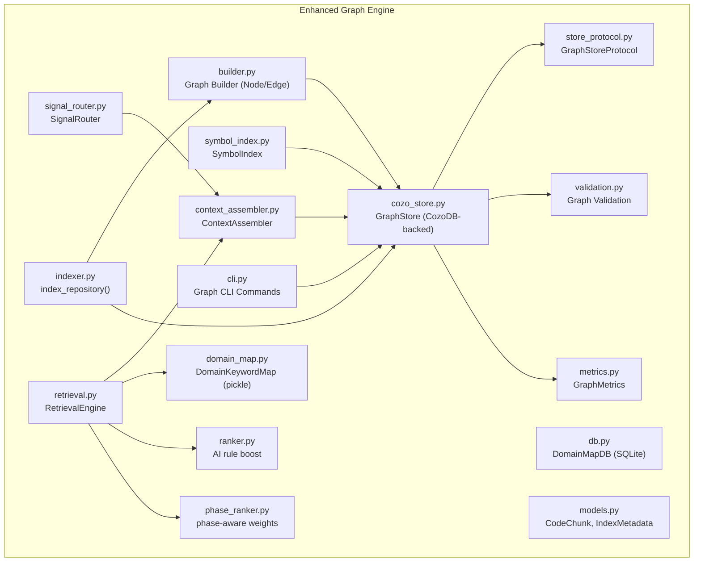
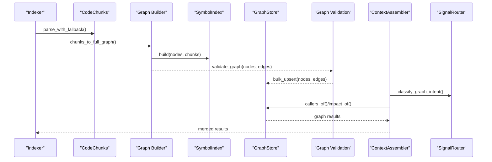
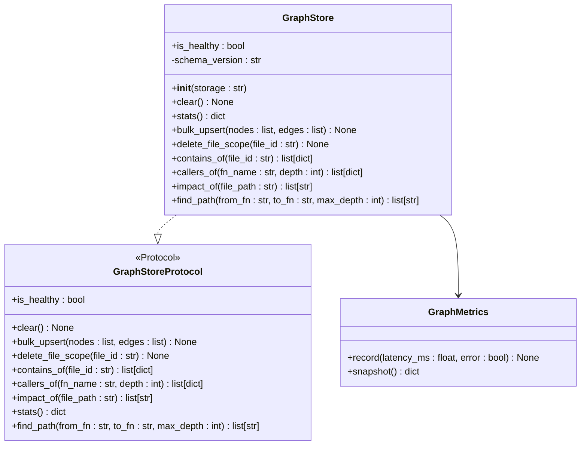
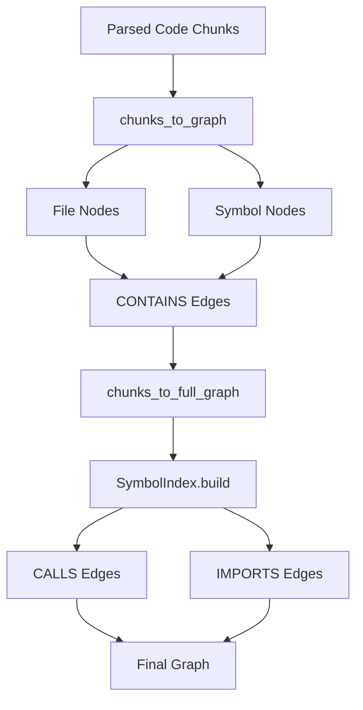
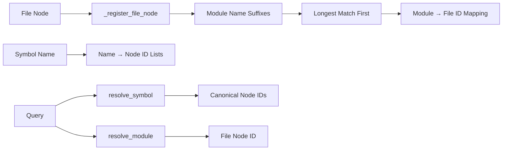
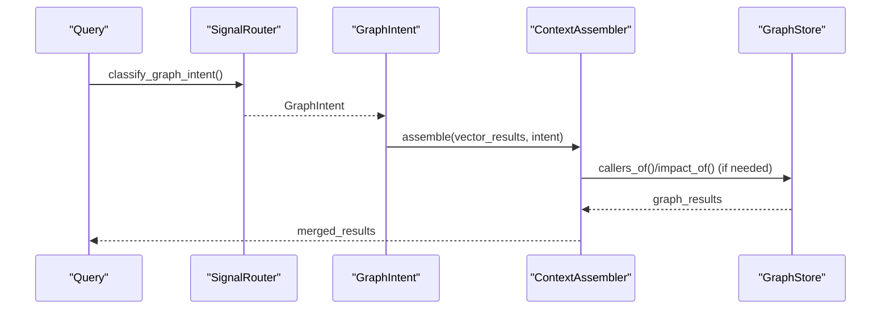
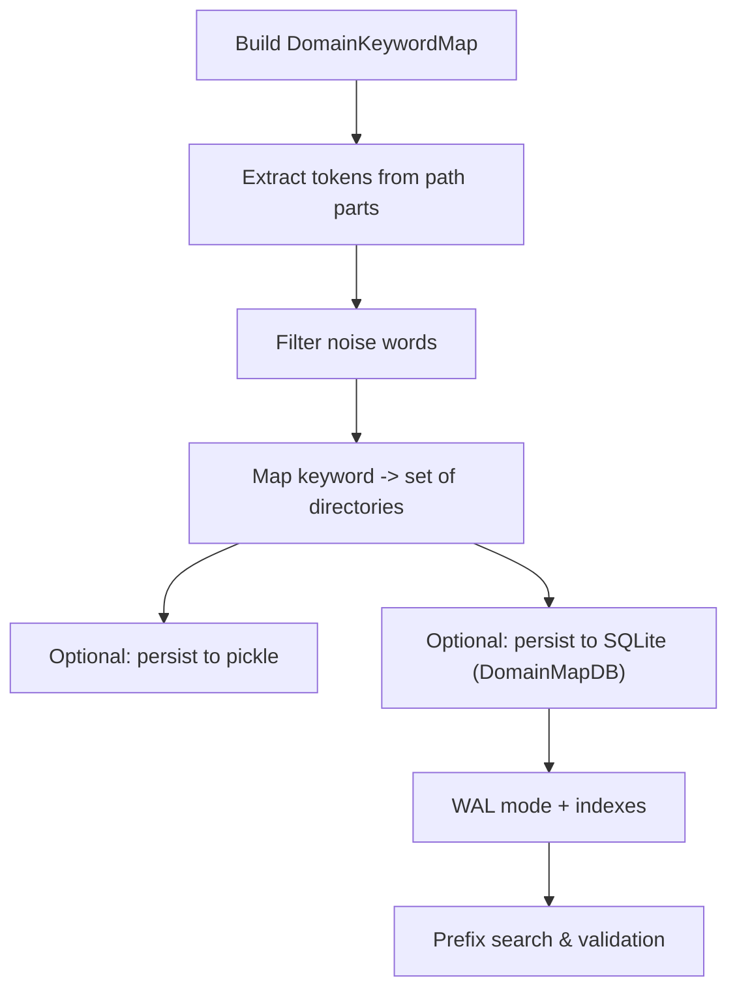
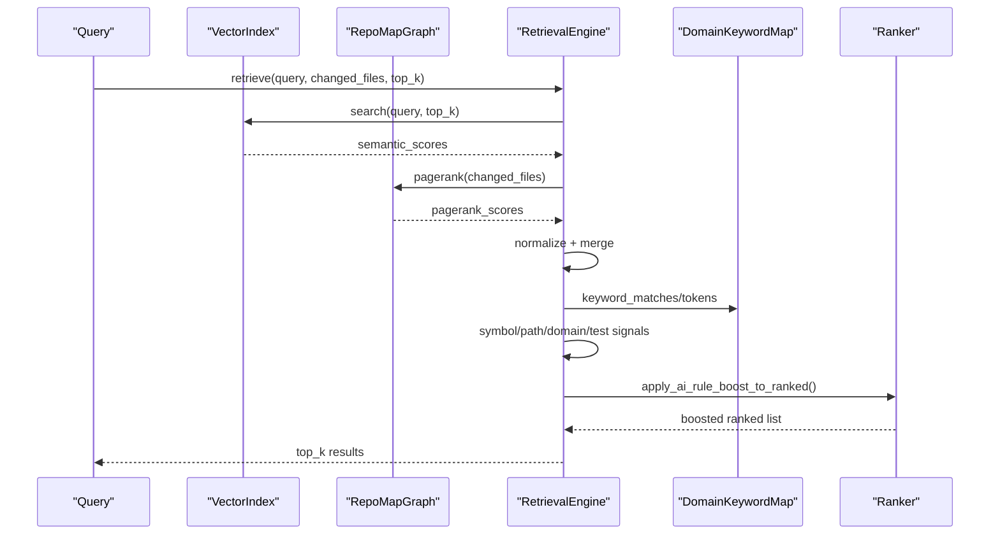
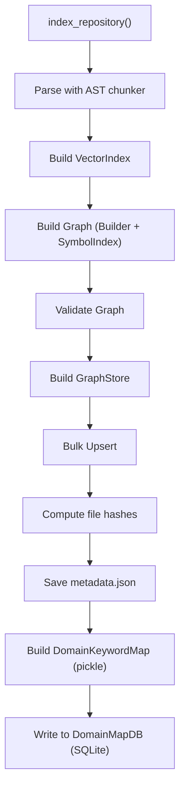
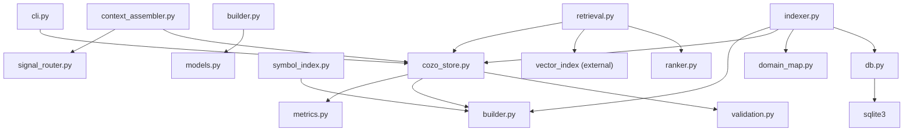

# Graph Engine

<cite>
**Referenced Files in This Document**
- [cozo_store.py](file://src/ws_ctx_engine/graph/cozo_store.py)
- [builder.py](file://src/ws_ctx_engine/graph/builder.py)
- [symbol_index.py](file://src/ws_ctx_engine/graph/symbol_index.py)
- [context_assembler.py](file://src/ws_ctx_engine/graph/context_assembler.py)
- [signal_router.py](file://src/ws_ctx_engine/graph/signal_router.py)
- [store_protocol.py](file://src/ws_ctx_engine/graph/store_protocol.py)
- [validation.py](file://src/ws_ctx_engine/graph/validation.py)
- [metrics.py](file://src/ws_ctx_engine/graph/metrics.py)
- [cli.py](file://src/ws_ctx_engine/cli/cli.py)
- [indexer.py](file://src/ws_ctx_engine/workflow/indexer.py)
- [domain_map.py](file://src/ws_ctx_engine/domain_map/domain_map.py)
- [db.py](file://src/ws_ctx_engine/domain_map/db.py)
- [retrieval.py](file://src/ws_ctx_engine/retrieval/retrieval.py)
- [models.py](file://src/ws_ctx_engine/models/models.py)
- [ranker.py](file://src/ws_ctx_engine/ranking/ranker.py)
- [phase_ranker.py](file://src/ws_ctx_engine/ranking/phase_ranker.py)
- [graph.md](file://docs/reference/graph.md)
- [retrieval.md](file://docs/reference/retrieval.md)
- [test_graph.py](file://tests/unit/test_graph.py)
- [test_domain_map.py](file://tests/unit/test_domain_map.py)
- [test_domain_map_db.py](file://tests/unit/test_domain_map_db.py)
- [test_graph_backup.py](file://tests/unit/test_graph_backup.py)
</cite>

## Update Summary
**Changes Made**
- Added comprehensive CozoDB-backed GraphStore with RocksDB, SQLite, and in-memory backends
- Introduced sophisticated graph builder system for converting parsed code chunks to graph structures
- Implemented advanced symbol indexing system for CALLS and IMPORTS edge resolution
- Added context assembler for merging vector and graph retrieval results
- Integrated signal routing for query intent classification
- Enhanced CLI with complete graph store management commands
- Added graph validation and metrics collection systems

## Table of Contents
1. [Introduction](#introduction)
2. [Project Structure](#project-structure)
3. [Core Components](#core-components)
4. [Architecture Overview](#architecture-overview)
5. [Detailed Component Analysis](#detailed-component-analysis)
6. [Dependency Analysis](#dependency-analysis)
7. [Performance Considerations](#performance-considerations)
8. [Troubleshooting Guide](#troubleshooting-guide)
9. [Conclusion](#conclusion)
10. [Appendices](#appendices)

## Introduction
This document describes the graph engine module responsible for constructing dependency graphs from code analysis, computing PageRank scores for structural ranking, and integrating with the domain mapping system for semantic and structural retrieval. The module now features a comprehensive CozoDB-backed graph store with multiple storage backends, sophisticated graph building capabilities, and advanced query routing for intelligent graph augmentation. It explains the graph representation, node relationships, edge semantics, traversal algorithms, and the database backend for persistent storage. It also covers performance optimization strategies for large codebases, memory management, and incremental graph updates.

## Project Structure
The graph engine spans several modules with enhanced CozoDB integration:
- CozoDB-backed GraphStore: [cozo_store.py](file://src/ws_ctx_engine/graph/cozo_store.py)
- Graph builder system: [builder.py](file://src/ws_ctx_engine/graph/builder.py)
- Symbol indexing system: [symbol_index.py](file://src/ws_ctx_engine/graph/symbol_index.py)
- Context assembler: [context_assembler.py](file://src/ws_ctx_engine/graph/context_assembler.py)
- Signal routing: [signal_router.py](file://src/ws_ctx_engine/graph/signal_router.py)
- Store protocol: [store_protocol.py](file://src/ws_ctx_engine/graph/store_protocol.py)
- Graph validation: [validation.py](file://src/ws_ctx_engine/graph/validation.py)
- Metrics collection: [metrics.py](file://src/ws_ctx_engine/graph/metrics.py)
- CLI integration: [cli.py](file://src/ws_ctx_engine/cli/cli.py)
- Domain keyword mapping (pickle and SQLite): [domain_map.py](file://src/ws_ctx_engine/domain_map/domain_map.py), [db.py](file://src/ws_ctx_engine/domain_map/db.py)
- Retrieval integration: [retrieval.py](file://src/ws_ctx_engine/retrieval/retrieval.py)
- Indexing workflow: [indexer.py](file://src/ws_ctx_engine/workflow/indexer.py)
- Data models: [models.py](file://src/ws_ctx_engine/models/models.py)
- Ranking integration: [ranker.py](file://src/ws_ctx_engine/ranking/ranker.py), [phase_ranker.py](file://src/ws_ctx_engine/ranking/phase_ranker.py)

**Diagram sources**
- [cozo_store.py:1-364](file://src/ws_ctx_engine/graph/cozo_store.py#L1-L364)
- [builder.py:1-159](file://src/ws_ctx_engine/graph/builder.py#L1-L159)
- [symbol_index.py:1-140](file://src/ws_ctx_engine/graph/symbol_index.py#L1-L140)
- [context_assembler.py:1-167](file://src/ws_ctx_engine/graph/context_assembler.py#L1-L167)
- [signal_router.py:1-133](file://src/ws_ctx_engine/graph/signal_router.py#L1-L133)
- [store_protocol.py:1-61](file://src/ws_ctx_engine/graph/store_protocol.py#L1-L61)
- [validation.py:1-87](file://src/ws_ctx_engine/graph/validation.py#L1-L87)
- [metrics.py:1-34](file://src/ws_ctx_engine/graph/metrics.py#L1-L34)
- [cli.py:1682-1736](file://src/ws_ctx_engine/cli/cli.py#L1682-L1736)
- [indexer.py:304-321](file://src/ws_ctx_engine/workflow/indexer.py#L304-L321)

**Section sources**
- [cozo_store.py:1-364](file://src/ws_ctx_engine/graph/cozo_store.py#L1-L364)
- [builder.py:1-159](file://src/ws_ctx_engine/graph/builder.py#L1-L159)
- [symbol_index.py:1-140](file://src/ws_ctx_engine/graph/symbol_index.py#L1-L140)
- [context_assembler.py:1-167](file://src/ws_ctx_engine/graph/context_assembler.py#L1-L167)
- [signal_router.py:1-133](file://src/ws_ctx_engine/graph/signal_router.py#L1-L133)
- [store_protocol.py:1-61](file://src/ws_ctx_engine/graph/store_protocol.py#L1-L61)
- [validation.py:1-87](file://src/ws_ctx_engine/graph/validation.py#L1-L87)
- [metrics.py:1-34](file://src/ws_ctx_engine/graph/metrics.py#L1-L34)
- [cli.py:1682-1736](file://src/ws_ctx_engine/cli/cli.py#L1682-L1736)
- [indexer.py:304-321](file://src/ws_ctx_engine/workflow/indexer.py#L304-L321)

## Core Components
- **GraphStore**: CozoDB-backed graph store supporting RocksDB, SQLite, and in-memory backends with automatic fallback and graceful degradation.
- **Graph Builder**: Converts parsed code chunks into graph structures with sophisticated node and edge generation.
- **SymbolIndex**: Resolves raw symbol names and module paths to canonical node IDs for CALLS and IMPORTS edges.
- **ContextAssembler**: Merges vector retrieval results with graph query results using configurable weighting.
- **SignalRouter**: Classifies query intent for graph augmentation using regex-based pattern matching.
- **GraphStoreProtocol**: Structural typing contract for all graph store backends ensuring compatibility.
- **Graph Validation**: Pre-flight validation system for graph consistency and integrity checks.
- **GraphMetrics**: Lightweight in-process query metrics collection for performance monitoring.
- **DomainKeywordMap**: Lightweight keyword-to-directories mapping for query classification.
- **DomainMapDB**: SQLite-backed domain map with WAL mode, indexes, and migration support.
- **RetrievalEngine**: Hybrid retrieval combining semantic similarity and PageRank with additional signals.
- **Indexer workflow**: Builds and persists indexes (vector, graph, domain map) with CozoDB integration and supports incremental updates.

**Section sources**
- [cozo_store.py:59-163](file://src/ws_ctx_engine/graph/cozo_store.py#L59-L163)
- [builder.py:22-105](file://src/ws_ctx_engine/graph/builder.py#L22-L105)
- [symbol_index.py:18-102](file://src/ws_ctx_engine/graph/symbol_index.py#L18-L102)
- [context_assembler.py:29-131](file://src/ws_ctx_engine/graph/context_assembler.py#L29-L131)
- [signal_router.py:18-116](file://src/ws_ctx_engine/graph/signal_router.py#L18-L116)
- [store_protocol.py:17-61](file://src/ws_ctx_engine/graph/store_protocol.py#L17-L61)
- [validation.py:23-87](file://src/ws_ctx_engine/graph/validation.py#L23-L87)
- [metrics.py:8-34](file://src/ws_ctx_engine/graph/metrics.py#L8-L34)

## Architecture Overview
The enhanced graph engine integrates with the broader retrieval pipeline through CozoDB-backed storage:
- Code chunks (symbols defined/referenced) feed into the Graph Builder to construct a directed dependency graph.
- The GraphStore persists nodes and edges with support for multiple backends (RocksDB, SQLite, in-memory).
- SymbolIndex resolves cross-file references for CALLS and IMPORTS edges.
- ContextAssembler merges vector and graph results with configurable weighting.
- SignalRouter classifies query intent for intelligent graph augmentation.
- PageRank scores reflect structural importance; optionally boosted for changed files.
- RetrievalEngine blends semantic scores, PageRank, symbol/path/domain signals, and test penalties.
- DomainKeywordMap (pickle) and DomainMapDB (SQLite) classify queries and boost relevant directories.
- Indexer coordinates parsing, building, and persisting indexes for incremental reuse.

**Diagram sources**
- [indexer.py:304-321](file://src/ws_ctx_engine/workflow/indexer.py#L304-L321)
- [builder.py:108-159](file://src/ws_ctx_engine/graph/builder.py#L108-L159)
- [symbol_index.py:65-102](file://src/ws_ctx_engine/graph/symbol_index.py#L65-L102)
- [validation.py:23-87](file://src/ws_ctx_engine/graph/validation.py#L23-L87)
- [cozo_store.py:164-185](file://src/ws_ctx_engine/graph/cozo_store.py#L164-L185)
- [context_assembler.py:46-85](file://src/ws_ctx_engine/graph/context_assembler.py#L46-L85)
- [signal_router.py:98-116](file://src/ws_ctx_engine/graph/signal_router.py#L98-L116)

## Detailed Component Analysis

### CozoDB-backed GraphStore
- **Storage Backends**:
  - `mem`: In-memory (fast, non-persistent; ideal for tests)
  - `rocksdb:<path>`: Persistent RocksDB storage
  - `sqlite:<path>`: Persistent SQLite storage
- **Schema Design**:
  - Nodes table: `id`, `kind`, `name`, `file`, `language`
  - Edges table: `src`, `relation`, `dst`
  - Meta table for schema version tracking
- **Core Operations**:
  - Bulk upsert with parameter binding
  - File scope deletion with cascading edge removal
  - Query methods: `contains_of`, `callers_of`, `impact_of`, `find_path`
  - Health monitoring and statistics
- **Graceful Degradation**: Returns empty results without exceptions when unhealthy

**Diagram sources**
- [cozo_store.py:59-163](file://src/ws_ctx_engine/graph/cozo_store.py#L59-L163)
- [metrics.py:8-34](file://src/ws_ctx_engine/graph/metrics.py#L8-L34)
- [store_protocol.py:17-61](file://src/ws_ctx_engine/graph/store_protocol.py#L17-L61)

**Section sources**
- [cozo_store.py:41-56](file://src/ws_ctx_engine/graph/cozo_store.py#L41-L56)
- [cozo_store.py:33-38](file://src/ws_ctx_engine/graph/cozo_store.py#L33-L38)
- [cozo_store.py:164-185](file://src/ws_ctx_engine/graph/cozo_store.py#L164-L185)
- [cozo_store.py:186-232](file://src/ws_ctx_engine/graph/cozo_store.py#L186-L232)
- [cozo_store.py:233-275](file://src/ws_ctx_engine/graph/cozo_store.py#L233-L275)
- [cozo_store.py:276-330](file://src/ws_ctx_engine/graph/cozo_store.py#L276-L330)
- [metrics.py:8-34](file://src/ws_ctx_engine/graph/metrics.py#L8-L34)

### Graph Builder System
- **Node Representation**: Files and named symbols with canonical IDs and metadata
- **Edge Types**: `CONTAINS` (file to symbol), `CALLS` (file to symbol), `IMPORTS` (file to file)
- **Graph Construction**:
  - Basic: Creates file and symbol nodes, emits CONTAINS edges
  - Full: Adds CALLS and IMPORTS edges using SymbolIndex resolution
- **Symbol Resolution**: Heuristic classification (PascalCase → class, others → function)
- **Deduplication**: Prevents duplicate nodes and edges

**Diagram sources**
- [builder.py:56-105](file://src/ws_ctx_engine/graph/builder.py#L56-L105)
- [builder.py:108-159](file://src/ws_ctx_engine/graph/builder.py#L108-L159)

**Section sources**
- [builder.py:22-40](file://src/ws_ctx_engine/graph/builder.py#L22-L40)
- [builder.py:42-54](file://src/ws_ctx_engine/graph/builder.py#L42-L54)
- [builder.py:56-105](file://src/ws_ctx_engine/graph/builder.py#L56-L105)
- [builder.py:108-159](file://src/ws_ctx_engine/graph/builder.py#L108-L159)

### Symbol Indexing System
- **Name Resolution**: Maps short symbol names to canonical node IDs
- **Module Resolution**: Derives dotted module names from file paths with longest-match precedence
- **Index Construction**: Iterative processing avoiding recursion, registering all suffix combinations
- **Resolution Logic**:
  - `resolve_symbol(name)`: Returns all matching node IDs
  - `resolve_module(module_name)`: Returns file node ID with longest suffix match

**Diagram sources**
- [symbol_index.py:65-102](file://src/ws_ctx_engine/graph/symbol_index.py#L65-L102)
- [symbol_index.py:105-140](file://src/ws_ctx_engine/graph/symbol_index.py#L105-L140)

**Section sources**
- [symbol_index.py:18-64](file://src/ws_ctx_engine/graph/symbol_index.py#L18-L64)
- [symbol_index.py:65-102](file://src/ws_ctx_engine/graph/symbol_index.py#L65-L102)
- [symbol_index.py:105-140](file://src/ws_ctx_engine/graph/symbol_index.py#L105-L140)

### Context Assembler and Signal Routing
- **Signal Router**: Regex-based query intent classification with stop word filtering
  - `callers_of`: Detects caller queries using patterns like "who calls", "callers of"
  - `impact_of`: Detects impact/dependency queries using patterns like "imports", "depends on"
  - `none`: Default for non-graph queries
- **Context Assembler**: Merges vector and graph results with configurable weighting
  - Graceful degradation when GraphStore is unhealthy
  - Preserves higher vector scores for overlapping files
  - Inserts graph-only files with weighted scores

**Diagram sources**
- [signal_router.py:98-116](file://src/ws_ctx_engine/graph/signal_router.py#L98-L116)
- [context_assembler.py:46-85](file://src/ws_ctx_engine/graph/context_assembler.py#L46-L85)
- [context_assembler.py:132-146](file://src/ws_ctx_engine/graph/context_assembler.py#L132-L146)

**Section sources**
- [signal_router.py:18-116](file://src/ws_ctx_engine/graph/signal_router.py#L18-L116)
- [context_assembler.py:29-131](file://src/ws_ctx_engine/graph/context_assembler.py#L29-L131)
- [context_assembler.py:132-167](file://src/ws_ctx_engine/graph/context_assembler.py#L132-L167)

### Graph Validation and Metrics
- **Validation System**: Pre-flight checks for graph integrity
  - Duplicate node ID detection
  - Dangling edge endpoint validation
  - Orphan symbol warnings
  - Semantic edge validation (CALLS/IMPORTS)
- **Metrics Collection**: Query performance monitoring with latency tracking
  - Query count and error tracking
  - Moving average latency calculation
  - Last query latency recording

**Section sources**
- [validation.py:23-87](file://src/ws_ctx_engine/graph/validation.py#L23-L87)
- [metrics.py:8-34](file://src/ws_ctx_engine/graph/metrics.py#L8-L34)

### CLI Integration and Management Commands
- **Graph Sub-app**: Complete CLI integration for graph store management
  - `graph backup`: Backs up RocksDB/SQLite stores to destination directory
  - Automatic path resolution and validation
  - Graceful handling of in-memory stores (no persistent data)
- **Configuration Integration**: Storage string format `storage:path` for GraphStore initialization
- **Health Monitoring**: Status reporting with node/edge counts and query metrics

**Section sources**
- [cli.py:1682-1736](file://src/ws_ctx_engine/cli/cli.py#L1682-L1736)
- [cli.py:1661-1668](file://src/ws_ctx_engine/cli/cli.py#L1661-L1668)

### Domain Mapping System
- **DomainKeywordMap (pickle-based)**:
  - Extracts keywords from file path parts, filters noise words, and maps keywords to parent directories.
  - Supports exact and prefix matching for query classification.
- **DomainMapDB (SQLite-based)**:
  - Schema-normalized design with indexes for efficient lookups and prefix search.
  - WAL mode for concurrent reads; supports bulk insert and migration from pickle.
  - Provides shadow-read validation and phased migration to SQLite.

**Diagram sources**
- [domain_map.py:77-147](file://src/ws_ctx_engine/domain_map/domain_map.py#L77-L147)
- [db.py:70-106](file://src/ws_ctx_engine/domain_map/db.py#L70-L106)
- [db.py:107-178](file://src/ws_ctx_engine/domain_map/db.py#L107-L178)
- [db.py:218-244](file://src/ws_ctx_engine/domain_map/db.py#L218-L244)

**Section sources**
- [domain_map.py:74-147](file://src/ws_ctx_engine/domain_map/domain_map.py#L74-L147)
- [db.py:40-106](file://src/ws_ctx_engine/domain_map/db.py#L40-L106)
- [db.py:107-178](file://src/ws_ctx_engine/domain_map/db.py#L107-L178)
- [db.py:218-287](file://src/ws_ctx_engine/domain_map/db.py#L218-L287)
- [db.py:310-374](file://src/ws_ctx_engine/domain_map/db.py#L310-L374)

### Retrieval Integration and Structural Scoring
- **RetrievalEngine** combines:
  - Semantic scores from vector search.
  - PageRank scores from RepoMapGraph.
  - Symbol exact-matching boost.
  - Path keyword boost.
  - Domain directory boost (via DomainKeywordMap).
  - Test file penalty.
  - Optional AI rule boost to guarantee inclusion of project-level rule files.
- **Query classification** adapts signal weights based on query type (symbol, path-dominant, semantic-dominant).

**Diagram sources**
- [retrieval.py:250-369](file://src/ws_ctx_engine/retrieval/retrieval.py#L250-L369)
- [ranker.py:28-86](file://src/ws_ctx_engine/ranking/ranker.py#L28-L86)

**Section sources**
- [retrieval.py:140-369](file://src/ws_ctx_engine/retrieval/retrieval.py#L140-L369)
- [ranker.py:28-86](file://src/ws_ctx_engine/ranking/ranker.py#L28-L86)
- [phase_ranker.py:96-123](file://src/ws_ctx_engine/ranking/phase_ranker.py#L96-L123)

### Indexing Workflow and Incremental Updates
- **index_repository** coordinates:
  - Parse codebase with AST chunker.
  - Build vector index (with optional embedding cache).
  - Build graph using Graph Builder and SymbolIndex.
  - Validate graph with pre-flight checks.
  - Persist to CozoDB GraphStore with incremental support.
  - Save metadata for staleness detection.
  - Build domain map (pickle) and store in SQLite (DomainMapDB).
- **load_indexes** detects staleness and can auto-rebuild.

**Diagram sources**
- [indexer.py:72-372](file://src/ws_ctx_engine/workflow/indexer.py#L72-L372)
- [indexer.py:304-321](file://src/ws_ctx_engine/workflow/indexer.py#L304-L321)

**Section sources**
- [indexer.py:72-372](file://src/ws_ctx_engine/workflow/indexer.py#L72-L372)
- [indexer.py:304-321](file://src/ws_ctx_engine/workflow/indexer.py#L304-L321)

## Dependency Analysis
- **Internal dependencies**:
  - cozo_store.py depends on metrics.py and builder.py types.
  - builder.py depends on node_id.py and models.CodeChunk.
  - symbol_index.py depends on builder.Node and models.CodeChunk.
  - context_assembler.py depends on signal_router.GraphIntent and cozo_store.GraphStore.
  - signal_router.py uses regex patterns and dataclasses.
  - validation.py depends on builder.Node and Edge types.
  - metrics.py is standalone metric collection.
  - cli.py depends on cozo_store.GraphStore for management commands.
  - retrieval.py depends on RepoMapGraph, VectorIndex, and ranking modules.
  - domain_map.py/db.py depend on CodeChunk and SQLite/pickle.
  - indexer.py orchestrates chunking, vector index, graph, and domain map.
- **External dependencies**:
  - pycozo (CozoDB client), rocksdb, sqlite3 (built-in), pickle (serialization).
  - python-igraph (fast backend), networkx (fallback), scipy (optional optimization for NetworkX).
  - rich (CLI output formatting), typer (CLI framework).

**Diagram sources**
- [cozo_store.py:15-27](file://src/ws_ctx_engine/graph/cozo_store.py#L15-L27)
- [builder.py:9-19](file://src/ws_ctx_engine/graph/builder.py#L9-L19)
- [symbol_index.py:7-15](file://src/ws_ctx_engine/graph/symbol_index.py#L7-L15)
- [context_assembler.py:9-17](file://src/ws_ctx_engine/graph/context_assembler.py#L9-L17)
- [signal_router.py:8-11](file://src/ws_ctx_engine/graph/signal_router.py#L8-L11)
- [validation.py:9-11](file://src/ws_ctx_engine/graph/validation.py#L9-L11)
- [cli.py:30-33](file://src/ws_ctx_engine/cli/cli.py#L30-L33)

**Section sources**
- [cozo_store.py:15-27](file://src/ws_ctx_engine/graph/cozo_store.py#L15-L27)
- [builder.py:9-19](file://src/ws_ctx_engine/graph/builder.py#L9-L19)
- [symbol_index.py:7-15](file://src/ws_ctx_engine/graph/symbol_index.py#L7-L15)
- [context_assembler.py:9-17](file://src/ws_ctx_engine/graph/context_assembler.py#L9-L17)
- [signal_router.py:8-11](file://src/ws_ctx_engine/graph/signal_router.py#L8-L11)
- [validation.py:9-11](file://src/ws_ctx_engine/graph/validation.py#L9-L11)
- [cli.py:30-33](file://src/ws_ctx_engine/cli/cli.py#L30-L33)

## Performance Considerations
- **GraphStore Performance**:
  - CozoDB provides ACID guarantees with excellent write performance for large-scale graph operations.
  - RocksDB backend offers high write throughput for large repositories.
  - SQLite backend provides reliable durability with good read performance.
  - In-memory backend enables fast testing and temporary storage.
- **Graph Construction Complexity**:
  - O(number of chunks + number of edges), dominated by symbol mapping and edge creation.
  - SymbolIndex construction: O(nodes + edges) with iterative processing.
  - Graph validation: O(nodes + edges) with duplicate checking and edge validation.
- **Query Performance**:
  - Single-hop queries: O(log n) with proper indexing.
  - BFS path finding: O(b^d) where b is branching factor and d is depth.
  - Metrics collection: O(1) per query with sliding window averaging.
- **Memory Management**:
  - GraphStore maintains bounded latency history (1000 samples).
  - SymbolIndex uses efficient dictionary lookups with minimal memory overhead.
  - ContextAssembler preserves vector results and uses O(n) additional memory for merging.
- **Recommendations**:
  - Use RocksDB for large repositories (>100k nodes), SQLite for medium-sized projects.
  - Enable incremental indexing to minimize rebuild time.
  - Monitor GraphStore metrics for performance tuning.
  - Use SymbolIndex caching for repeated symbol resolution queries.

## Troubleshooting Guide
- **GraphStore Initialization Failures**:
  - Missing pycozo dependency: Install with `pip install pycozo` or use alternative backends.
  - Invalid storage string format: Use `storage:path` format (e.g., `rocksdb:/path/to/db`).
  - Permission errors: Ensure write access to specified storage path.
- **Graph Validation Errors**:
  - Duplicate node IDs: Check for conflicting symbol definitions.
  - Dangling edges: Verify symbol resolution in SymbolIndex.
  - Orphan symbols: Ensure all symbols have proper CONTAINS relationships.
- **CLI Backup Issues**:
  - In-memory stores: Cannot be backed up as they contain no persistent data.
  - Missing source path: Verify graph_store_path configuration.
  - Destination conflicts: Remove existing destination directory.
- **Context Assembler Problems**:
  - Unhealthy GraphStore: Results fall back to pure vector search.
  - Low graph query weight: Adjust graph_query_weight configuration.
  - Signal router misclassification: Review query patterns and stop words.
- **Performance Issues**:
  - Slow queries: Check GraphStore metrics and consider backend switching.
  - Memory usage: Monitor SymbolIndex and GraphStore memory footprint.
  - Validation warnings: Address orphan symbols and dangling edges.

**Section sources**
- [cozo_store.py:78-83](file://src/ws_ctx_engine/graph/cozo_store.py#L78-L83)
- [validation.py:40-87](file://src/ws_ctx_engine/graph/validation.py#L40-L87)
- [cli.py:1706-1735](file://src/ws_ctx_engine/cli/cli.py#L1706-L1735)
- [context_assembler.py:76-84](file://src/ws_ctx_engine/graph/context_assembler.py#L76-L84)

## Conclusion
The enhanced graph engine module provides a comprehensive, scalable foundation for structural ranking in code retrieval through CozoDB-backed storage. The integration of sophisticated graph building, symbol indexing, and context assembly enables intelligent query routing and hybrid retrieval. The modular design with multiple storage backends ensures flexibility across different deployment scenarios. With robust validation, metrics collection, and CLI management tools, the system maintains reliability and performance while supporting complex graph operations on large codebases.

## Appendices

### Example Workflows

- **Build and persist a CozoDB-backed GraphStore**:
  - Parse repository with AST chunker.
  - Create graph with chunks_to_full_graph(), build SymbolIndex.
  - Validate graph with validate_graph().
  - Initialize GraphStore with storage string (rocksdb:/path/to/db).
  - Bulk upsert nodes and edges.
  - Monitor metrics and health status.

- **Retrieve files with hybrid ranking and graph augmentation**:
  - Build vector index and graph store.
  - Initialize ContextAssembler with GraphStore and weights.
  - Classify query intent with SignalRouter.
  - Assemble results merging vector and graph outputs.
  - Apply AI rule boost and domain mapping.

- **Manage GraphStore lifecycle**:
  - Use `ws-ctx-engine graph backup` for RocksDB/SQLite stores.
  - Monitor health with status commands.
  - Handle incremental updates with file scope deletion.
  - Validate schema version compatibility.

**Section sources**
- [cozo_store.py:164-185](file://src/ws_ctx_engine/graph/cozo_store.py#L164-L185)
- [builder.py:108-159](file://src/ws_ctx_engine/graph/builder.py#L108-L159)
- [validation.py:23-87](file://src/ws_ctx_engine/graph/validation.py#L23-L87)
- [context_assembler.py:46-131](file://src/ws_ctx_engine/graph/context_assembler.py#L46-L131)
- [signal_router.py:98-116](file://src/ws_ctx_engine/graph/signal_router.py#L98-L116)
- [cli.py:1686-1736](file://src/ws_ctx_engine/cli/cli.py#L1686-L1736)

### Validation and Testing References
- **Graph unit tests validate**:
  - CozoDB GraphStore operations and backend selection.
  - Graph builder edge creation and symbol resolution.
  - SymbolIndex module and name resolution accuracy.
  - Context assembler merging and weighting logic.
  - Signal router intent classification patterns.
  - Graph validation error detection and warnings.
  - CLI graph backup command functionality.
- **Domain map unit tests validate**:
  - Keyword extraction and filtering.
  - Directory mapping and prefix matching.
  - SQLite bulk insert, prefix search, and migration validation.

**Section sources**
- [test_graph.py:89-396](file://tests/unit/test_graph.py#L89-L396)
- [test_domain_map.py:9-345](file://tests/unit/test_domain_map.py#L9-L345)
- [test_domain_map_db.py:10-436](file://tests/unit/test_domain_map_db.py#L10-L436)
- [test_graph_backup.py:41-156](file://tests/unit/test_graph_backup.py#L41-L156)