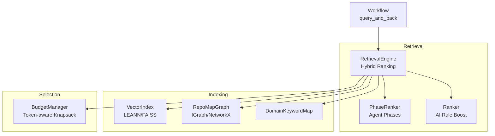
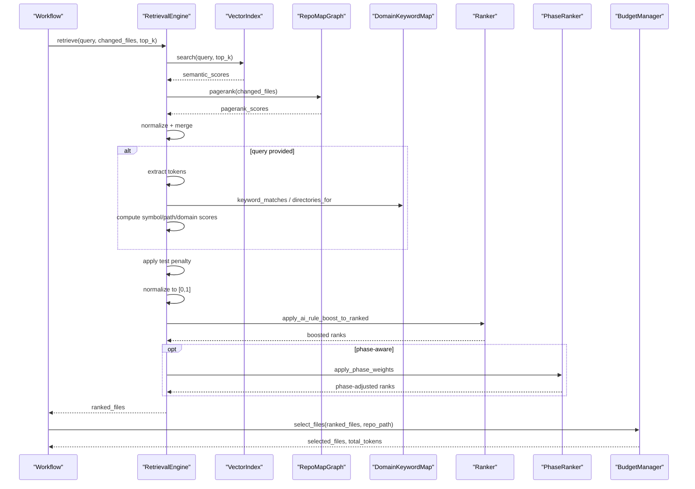
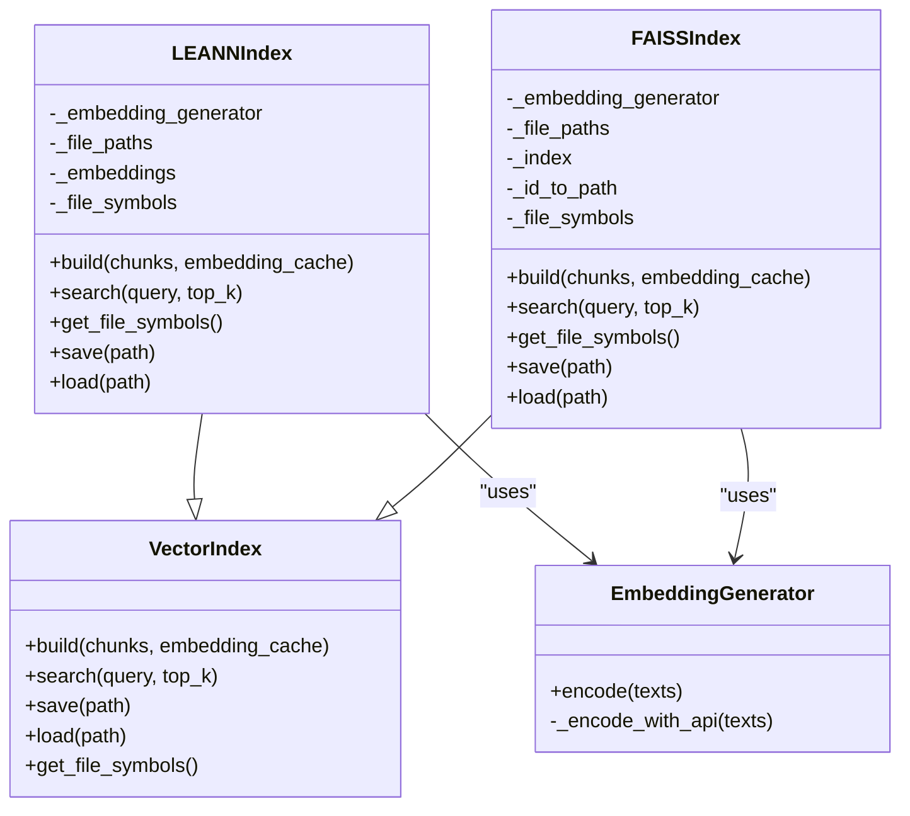
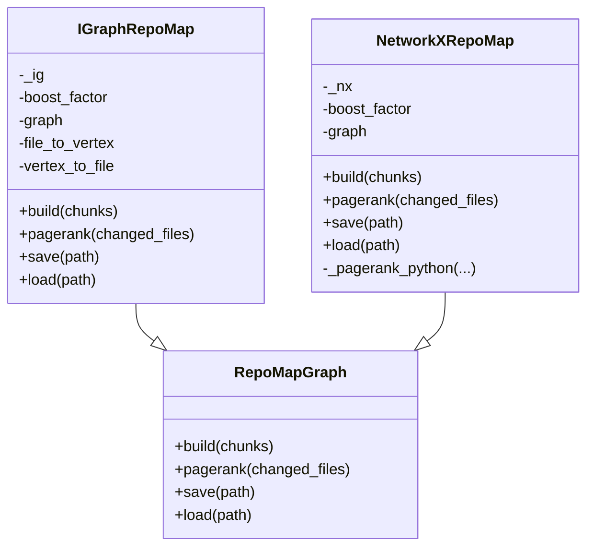
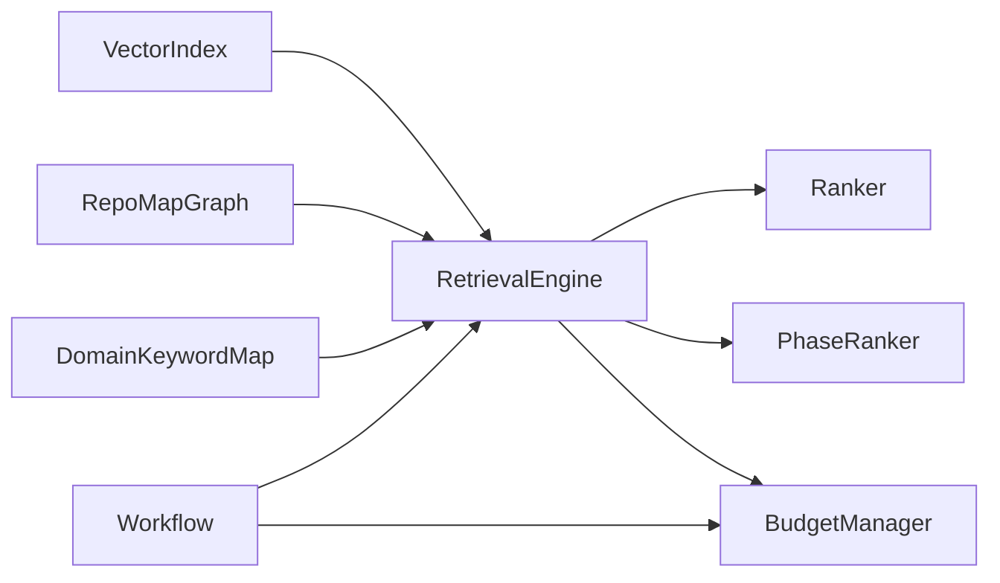

# Retrieval System

<cite>
**Referenced Files in This Document**
- [retrieval.py](file://src/ws_ctx_engine/retrieval/retrieval.py)
- [ranker.py](file://src/ws_ctx_engine/ranking/ranker.py)
- [phase_ranker.py](file://src/ws_ctx_engine/ranking/phase_ranker.py)
- [vector_index.py](file://src/ws_ctx_engine/vector_index/vector_index.py)
- [graph.py](file://src/ws_ctx_engine/graph/graph.py)
- [budget.py](file://src/ws_ctx_engine/budget/budget.py)
- [models.py](file://src/ws_ctx_engine/models/models.py)
- [embedding_cache.py](file://src/ws_ctx_engine/vector_index/embedding_cache.py)
- [domain_map.py](file://src/ws_ctx_engine/domain_map/domain_map.py)
- [query.py](file://src/ws_ctx_engine/workflow/query.py)
- [config.py](file://src/ws_ctx_engine/config/config.py)
- [retrieval_example.py](file://examples/retrieval_example.py)
- [test_retrieval.py](file://tests/unit/test_retrieval.py)
- [test_ranker.py](file://tests/unit/test_ranker.py)
- [test_phase_ranker.py](file://tests/unit/test_phase_ranker.py)
- [test_budget.py](file://tests/unit/test_budget.py)
</cite>

## Table of Contents
1. [Introduction](#introduction)
2. [Project Structure](#project-structure)
3. [Core Components](#core-components)
4. [Architecture Overview](#architecture-overview)
5. [Detailed Component Analysis](#detailed-component-analysis)
6. [Dependency Analysis](#dependency-analysis)
7. [Performance Considerations](#performance-considerations)
8. [Troubleshooting Guide](#troubleshooting-guide)
9. [Conclusion](#conclusion)
10. [Appendices](#appendices)

## Introduction
This document explains the retrieval system that powers hybrid ranking in the context engine. It combines semantic search with structural PageRank scoring to produce robust file rankings, then applies adaptive boosting for symbols, paths, domains, and optional AI rule persistence. The system integrates with vector index backends, a repository dependency graph, token budget management, and optional phase-aware weighting for agent workflows.

## Project Structure
The retrieval system spans several modules:
- Retrieval engine orchestrating hybrid ranking
- Ranker utilities for AI rule persistence
- Phase-aware ranker for agent workflows
- Vector index backends for semantic search
- Graph-based PageRank computation
- Token budget manager for content selection
- Supporting models, caches, and domain maps
- Workflow orchestration integrating all pieces



**Diagram sources**
- [retrieval.py:140-368](file://src/ws_ctx_engine/retrieval/retrieval.py#L140-L368)
- [phase_ranker.py:96-122](file://src/ws_ctx_engine/ranking/phase_ranker.py#L96-L122)
- [ranker.py:64-85](file://src/ws_ctx_engine/ranking/ranker.py#L64-L85)
- [vector_index.py:21-84](file://src/ws_ctx_engine/vector_index/vector_index.py#L21-L84)
- [graph.py:19-94](file://src/ws_ctx_engine/graph/graph.py#L19-L94)
- [domain_map.py:11-147](file://src/ws_ctx_engine/domain_map/domain_map.py#L11-L147)
- [budget.py:8-104](file://src/ws_ctx_engine/budget/budget.py#L8-L104)
- [query.py:230-616](file://src/ws_ctx_engine/workflow/query.py#L230-L616)

**Section sources**
- [retrieval.py:1-627](file://src/ws_ctx_engine/retrieval/retrieval.py#L1-L627)
- [vector_index.py:1-1120](file://src/ws_ctx_engine/vector_index/vector_index.py#L1-L1120)
- [graph.py:1-667](file://src/ws_ctx_engine/graph/graph.py#L1-L667)
- [budget.py:1-105](file://src/ws_ctx_engine/budget/budget.py#L1-L105)
- [domain_map.py:1-147](file://src/ws_ctx_engine/domain_map/domain_map.py#L1-L147)
- [ranker.py:1-86](file://src/ws_ctx_engine/ranking/ranker.py#L1-L86)
- [phase_ranker.py:1-138](file://src/ws_ctx_engine/ranking/phase_ranker.py#L1-L138)
- [query.py:1-617](file://src/ws_ctx_engine/workflow/query.py#L1-L617)

## Core Components
- RetrievalEngine: Orchestrates hybrid ranking, normalization, merging, adaptive boosting, penalties, and final normalization. Supports query classification and domain-aware boosting.
- VectorIndex: Abstract interface and concrete backends (LEANNIndex, FAISSIndex) for semantic search and symbol extraction.
- RepoMapGraph: Abstract interface and implementations (IGraphRepoMap, NetworkXRepoMap) for PageRank computation and dependency graph management.
- BudgetManager: Greedy knapsack selection constrained by token budgets.
- DomainKeywordMap: Maps domain keywords to directories for adaptive boosting.
- Ranker: Applies persistent AI rule boosting to ensure essential rule files are always included.
- PhaseRanker: Adjusts scores based on agent phase (discovery/edit/test) with phase-specific overrides.
- Workflow: Integrates retrieval, budget selection, and packing into a cohesive query pipeline.

**Section sources**
- [retrieval.py:140-368](file://src/ws_ctx_engine/retrieval/retrieval.py#L140-L368)
- [vector_index.py:21-84](file://src/ws_ctx_engine/vector_index/vector_index.py#L21-L84)
- [graph.py:19-94](file://src/ws_ctx_engine/graph/graph.py#L19-L94)
- [budget.py:8-104](file://src/ws_ctx_engine/budget/budget.py#L8-L104)
- [domain_map.py:11-147](file://src/ws_ctx_engine/domain_map/domain_map.py#L11-L147)
- [ranker.py:28-85](file://src/ws_ctx_engine/ranking/ranker.py#L28-L85)
- [phase_ranker.py:96-127](file://src/ws_ctx_engine/ranking/phase_ranker.py#L96-L127)
- [query.py:230-616](file://src/ws_ctx_engine/workflow/query.py#L230-L616)

## Architecture Overview
The retrieval pipeline proceeds in phases:
1. Semantic search: VectorIndex.search returns file similarity scores.
2. Structural ranking: RepoMapGraph.pagerank produces PageRank scores.
3. Normalization and merge: Scores are normalized independently and merged using configured weights.
4. Adaptive boosting: Symbol, path, and domain signals are applied conditionally based on query classification.
5. Penalties: Test file penalty scales down scores for test-related files.
6. Final normalization: Scores are normalized to [0, 1].
7. AI rule boost: Rule files are boosted and re-sorted.
8. Phase-aware weighting: Optional phase-specific adjustments.
9. Token budget selection: BudgetManager greedily selects files within token budget.



**Diagram sources**
- [retrieval.py:250-368](file://src/ws_ctx_engine/retrieval/retrieval.py#L250-L368)
- [ranker.py:64-85](file://src/ws_ctx_engine/ranking/ranker.py#L64-L85)
- [phase_ranker.py:96-122](file://src/ws_ctx_engine/ranking/phase_ranker.py#L96-L122)
- [budget.py:50-104](file://src/ws_ctx_engine/budget/budget.py#L50-L104)
- [query.py:324-411](file://src/ws_ctx_engine/workflow/query.py#L324-L411)

## Detailed Component Analysis

### RetrievalEngine: Hybrid Ranking and Adaptive Boosting
- Initialization validates semantic and PageRank weights and ensures they sum to 1.0.
- retrieve orchestrates:
  - Semantic search via VectorIndex.search
  - PageRank computation via RepoMapGraph.pagerank
  - Normalization and weighted merge
  - Query tokenization and classification
  - Adaptive boosting for symbols, paths, and domains
  - Test file penalty
  - Final normalization to [0, 1]
  - AI rule boost application
  - Optional phase-aware re-weighting
  - Returns top-k results sorted by score
- Scoring helpers:
  - _extract_query_tokens: cleans and filters tokens
  - _compute_symbol_scores: exact overlap between tokens and defined symbols
  - _compute_path_scores: exact, substring, or 5-char prefix matches in path parts
  - _compute_domain_scores: directory inclusion based on domain keywords
  - _classify_query: determines symbol vs path-dominant vs semantic-dominant
  - _effective_weights: multipliers per query type
  - _normalize and _merge_scores: min-max normalization and weighted combination
  - _is_test_file: detects test/spec files

```mermaid
flowchart TD
Start(["retrieve(query, changed_files, top_k)"]) --> Sem["Semantic search via VectorIndex"]
Start --> PR["PageRank via RepoMapGraph"]
Sem --> NormSem["Normalize semantic scores"]
PR --> NormPR["Normalize PageRank scores"]
NormSem --> Merge["Merge with semantic_weight and pagerank_weight"]
NormPR --> Merge
alt query provided
Merge --> Tokens["Extract tokens"]
Tokens --> Classify["Classify query type"]
Classify --> EffW["Compute effective weights"]
EffW --> Symbol["Symbol boost"]
EffW --> Path["Path boost"]
EffW --> Domain["Domain boost"]
Symbol --> MergeAdj["Adjust merged scores"]
Path --> MergeAdj
Domain --> MergeAdj
end
MergeAdj --> Penalty["Test file penalty"]
Penalty --> FinalNorm["Final min-max normalization"]
FinalNorm --> AIRule["AI rule boost"]
AIRule --> Phase["Phase-aware weights (optional)"]
Phase --> TopK["Return top-k results"]
```

**Diagram sources**
- [retrieval.py:250-368](file://src/ws_ctx_engine/retrieval/retrieval.py#L250-L368)
- [retrieval.py:374-558](file://src/ws_ctx_engine/retrieval/retrieval.py#L374-L558)

**Section sources**
- [retrieval.py:191-368](file://src/ws_ctx_engine/retrieval/retrieval.py#L191-L368)
- [retrieval.py:374-558](file://src/ws_ctx_engine/retrieval/retrieval.py#L374-L558)

### VectorIndex Backends: Semantic Search
- VectorIndex defines the contract for build, search, save, load, and symbol extraction.
- LEANNIndex:
  - Groups chunks by file, concatenates content, generates embeddings, stores file paths and symbols.
  - Cosine similarity search with normalized vectors.
  - get_file_symbols returns per-file symbol lists.
- FAISSIndex:
  - Uses IndexFlatL2 wrapped in IndexIDMap2 for exact search.
  - Supports embedding cache for incremental rebuilds.
  - get_file_symbols returns per-file symbol lists.
- EmbeddingGenerator:
  - Attempts local sentence-transformers model; falls back to OpenAI API on memory errors or unavailability.
  - Memory checks and graceful degradation.



**Diagram sources**
- [vector_index.py:21-84](file://src/ws_ctx_engine/vector_index/vector_index.py#L21-L84)
- [vector_index.py:282-503](file://src/ws_ctx_engine/vector_index/vector_index.py#L282-L503)
- [vector_index.py:506-800](file://src/ws_ctx_engine/vector_index/vector_index.py#L506-L800)

**Section sources**
- [vector_index.py:21-84](file://src/ws_ctx_engine/vector_index/vector_index.py#L21-L84)
- [vector_index.py:282-503](file://src/ws_ctx_engine/vector_index/vector_index.py#L282-L503)
- [vector_index.py:506-800](file://src/ws_ctx_engine/vector_index/vector_index.py#L506-L800)
- [embedding_cache.py:28-127](file://src/ws_ctx_engine/vector_index/embedding_cache.py#L28-L127)

### RepoMapGraph: Structural PageRank
- RepoMapGraph builds a directed dependency graph from symbol definitions and references.
- IGraphRepoMap: Fast C++ backend using python-igraph; supports boost factor for changed files and renormalization.
- NetworkXRepoMap: Pure Python fallback; includes a power iteration implementation when scipy is unavailable.
- Both support save/load for incremental indexing.



**Diagram sources**
- [graph.py:19-94](file://src/ws_ctx_engine/graph/graph.py#L19-L94)
- [graph.py:97-314](file://src/ws_ctx_engine/graph/graph.py#L97-L314)
- [graph.py:317-569](file://src/ws_ctx_engine/graph/graph.py#L317-L569)

**Section sources**
- [graph.py:19-94](file://src/ws_ctx_engine/graph/graph.py#L19-L94)
- [graph.py:97-314](file://src/ws_ctx_engine/graph/graph.py#L97-L314)
- [graph.py:317-569](file://src/ws_ctx_engine/graph/graph.py#L317-L569)

### DomainKeywordMap: Domain-Aware Boosting
- Builds keyword-to-directories mapping from file paths during indexing.
- At query time, identifies domain keywords and matches directories for domain boost.
- Supports exact and prefix-based matching with minimum prefix length thresholds.

**Section sources**
- [domain_map.py:11-147](file://src/ws_ctx_engine/domain_map/domain_map.py#L11-L147)
- [retrieval.py:523-554](file://src/ws_ctx_engine/retrieval/retrieval.py#L523-L554)

### Ranker: AI Rule Persistence
- Ensures essential rule files (e.g., .cursorrules, AI_RULES.md, CLAUDE.md) are always included and ranked highly.
- apply_ai_rule_boost_to_ranked increases scores by a fixed boost and re-sorts.

**Section sources**
- [ranker.py:28-85](file://src/ws_ctx_engine/ranking/ranker.py#L28-L85)
- [retrieval.py:358-366](file://src/ws_ctx_engine/retrieval/retrieval.py#L358-L366)

### PhaseRanker: Agent Phase-Aware Ranking
- Defines AgentPhase (DISCOVERY, EDIT, TEST) and PhaseWeightConfig overrides.
- apply_phase_weights multiplies scores for test and mock files depending on phase.
- get_phase_config returns overrides; parse_phase converts CLI strings.

**Section sources**
- [phase_ranker.py:25-127](file://src/ws_ctx_engine/ranking/phase_ranker.py#L25-L127)
- [query.py:356-366](file://src/ws_ctx_engine/workflow/query.py#L356-L366)

### BudgetManager: Token-Aware Content Selection
- Implements greedy knapsack selection to respect token budgets.
- Reserves 20% for metadata and uses 80% for content.
- Reads file contents, counts tokens with tiktoken, and accumulates until budget is exhausted.

**Section sources**
- [budget.py:8-104](file://src/ws_ctx_engine/budget/budget.py#L8-L104)
- [query.py:387-411](file://src/ws_ctx_engine/workflow/query.py#L387-L411)

### Workflow Integration
- query_and_pack coordinates index loading, retrieval, budget selection, and packing.
- Applies phase-aware weighting when agent_phase is provided.
- Handles secrets scanning, deduplication, compression, and output formatting.

**Section sources**
- [query.py:230-616](file://src/ws_ctx_engine/workflow/query.py#L230-L616)

## Dependency Analysis
- RetrievalEngine depends on VectorIndex and RepoMapGraph for scores, and on DomainKeywordMap for domain classification.
- Ranker and PhaseRanker operate on the ranked list post-retrieval.
- BudgetManager consumes the ranked list and repository paths to select files within budget.
- Workflow composes all components and exposes CLI-friendly entry points.



**Diagram sources**
- [retrieval.py:191-237](file://src/ws_ctx_engine/retrieval/retrieval.py#L191-L237)
- [ranker.py:64-85](file://src/ws_ctx_engine/ranking/ranker.py#L64-L85)
- [phase_ranker.py:96-122](file://src/ws_ctx_engine/ranking/phase_ranker.py#L96-L122)
- [budget.py:50-104](file://src/ws_ctx_engine/budget/budget.py#L50-L104)
- [query.py:324-411](file://src/ws_ctx_engine/workflow/query.py#L324-L411)

**Section sources**
- [retrieval.py:191-237](file://src/ws_ctx_engine/retrieval/retrieval.py#L191-L237)
- [query.py:324-411](file://src/ws_ctx_engine/workflow/query.py#L324-L411)

## Performance Considerations
- Vector search backends:
  - LEANNIndex stores embeddings for all files and computes cosine similarity efficiently.
  - FAISSIndex uses exact search (IndexFlatL2) wrapped in IndexIDMap2 for incremental updates.
  - EmbeddingGenerator falls back to API on memory constraints and logs fallback events.
- Graph computation:
  - IGraphRepoMap leverages C++ backend for fast PageRank; NetworkXRepoMap provides a pure Python fallback.
- Token budgeting:
  - BudgetManager uses greedy selection to maximize total importance within content budget.
- Caching:
  - EmbeddingCache persists content-hash → embedding mappings to avoid re-embedding unchanged files.
- Memory and CPU:
  - EmbeddingGenerator checks available memory before initializing local models.
  - FAISSIndex supports incremental removal/addition via ID mapping to maintain performance over time.

[No sources needed since this section provides general guidance]

## Troubleshooting Guide
- Invalid weights:
  - RetrievalEngine raises ValueError if weights are outside [0, 1] or do not sum to 1.0.
- Empty or missing results:
  - If semantic search or PageRank computation fails, the engine continues with partial results and logs warnings.
- Low memory during embedding:
  - EmbeddingGenerator falls back to API and frees memory when out-of-memory conditions occur.
- Graph backend availability:
  - If igraph is unavailable, the system automatically falls back to NetworkX and logs the fallback.
- Phase-aware ranking failures:
  - Workflow catches exceptions and logs warnings, then proceeds without phase adjustments.

**Section sources**
- [retrieval.py:219-227](file://src/ws_ctx_engine/retrieval/retrieval.py#L219-L227)
- [retrieval.py:297-307](file://src/ws_ctx_engine/retrieval/retrieval.py#L297-L307)
- [vector_index.py:130-251](file://src/ws_ctx_engine/vector_index/vector_index.py#L130-L251)
- [graph.py:594-620](file://src/ws_ctx_engine/graph/graph.py#L594-L620)
- [query.py:364-366](file://src/ws_ctx_engine/workflow/query.py#L364-L366)

## Conclusion
The retrieval system combines semantic and structural signals with adaptive boosting and domain awareness to produce high-quality file rankings. It integrates cleanly with vector index backends, dependency graphs, token budgeting, and agent-phase-aware weighting. Configuration options allow tuning of ranking weights, penalties, and phase-specific behaviors, while caching and fallback mechanisms ensure robustness and performance.

## Appendices

### Configuration Options for Tuning
- Scoring weights:
  - semantic_weight: Weight for semantic similarity (default 0.6)
  - pagerank_weight: Weight for PageRank scores (default 0.4)
- Adaptive boosting:
  - symbol_boost: Additive boost for symbol matches (default 0.3)
  - path_boost: Additive boost for path keyword matches (default 0.2)
  - domain_boost: Additive boost for domain directory matches (default 0.25)
- Penalties:
  - test_penalty: Multiplicative penalty for test files (default 0.5)
- Token budget:
  - token_budget: Total token budget for context (default 100000)
- AI rule persistence:
  - ai_rules.auto_detect: Enable auto-detection of rule files
  - ai_rules.extra_files: Additional rule file names/paths
  - ai_rules.boost: Score boost for rule files (default 10.0)
- Phase-aware overrides:
  - semantic_weight, symbol_weight, signature_only, include_tree, max_token_density, test_file_boost, mock_file_boost per AgentPhase

**Section sources**
- [config.py:34-36](file://src/ws_ctx_engine/config/config.py#L34-L36)
- [config.py:104-110](file://src/ws_ctx_engine/config/config.py#L104-L110)
- [phase_ranker.py:32-72](file://src/ws_ctx_engine/ranking/phase_ranker.py#L32-L72)

### Example Workflows
- Basic hybrid retrieval:
  - Build vector index and graph, create RetrievalEngine with desired weights, call retrieve with a query and optional changed_files.
- Phase-aware retrieval:
  - After retrieving, apply apply_phase_weights with the current AgentPhase.
- Token-aware selection:
  - Use BudgetManager to select files within token budget after retrieval.

**Section sources**
- [retrieval_example.py:81-156](file://examples/retrieval_example.py#L81-L156)
- [query.py:356-366](file://src/ws_ctx_engine/workflow/query.py#L356-L366)
- [budget.py:50-104](file://src/ws_ctx_engine/budget/budget.py#L50-L104)

### Unit Tests Highlights
- RetrievalEngine:
  - Weight validation, normalization, merging, symbol/path/domain scoring, test file penalty, and final normalization.
- Ranker:
  - AI rule file detection and boosting behavior.
- PhaseRanker:
  - Phase parsing, test/mock file boosting, and sorting correctness.
- BudgetManager:
  - Greedy selection, budget reservation, and token counting accuracy.

**Section sources**
- [test_retrieval.py:63-604](file://tests/unit/test_retrieval.py#L63-L604)
- [test_ranker.py:13-83](file://tests/unit/test_ranker.py#L13-L83)
- [test_phase_ranker.py:13-83](file://tests/unit/test_phase_ranker.py#L13-L83)
- [test_budget.py:35-283](file://tests/unit/test_budget.py#L35-L283)