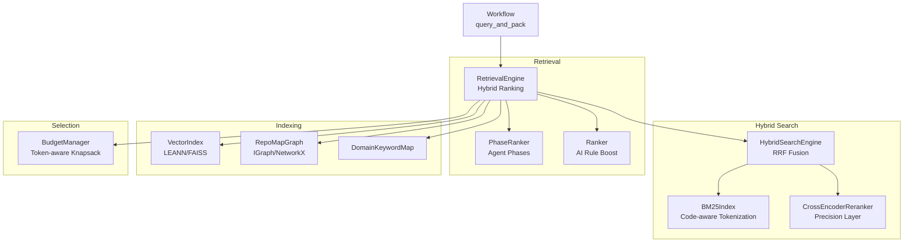
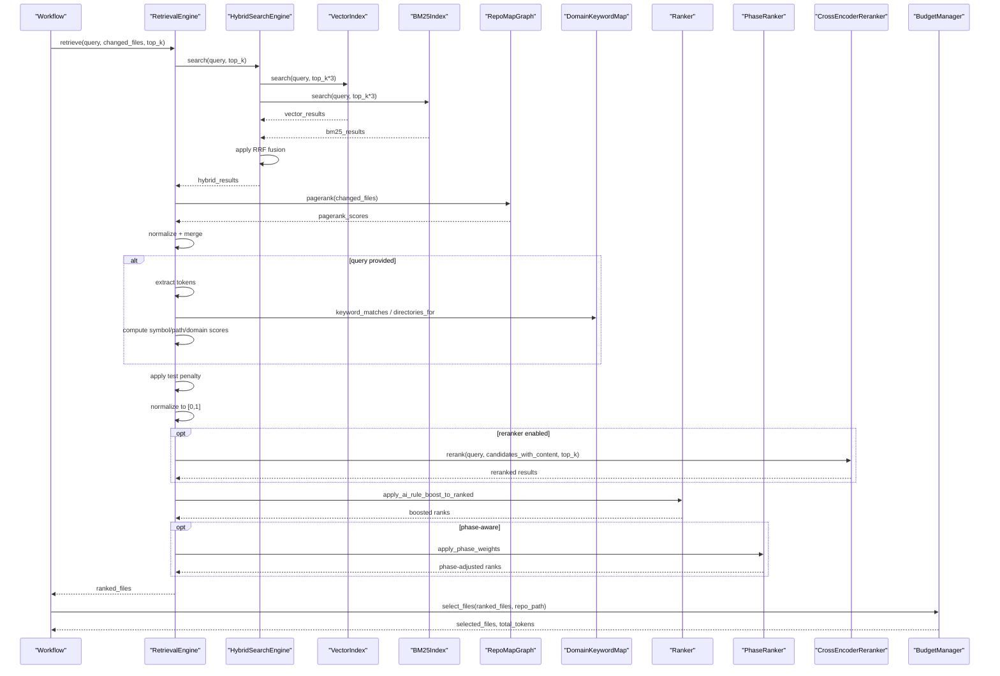
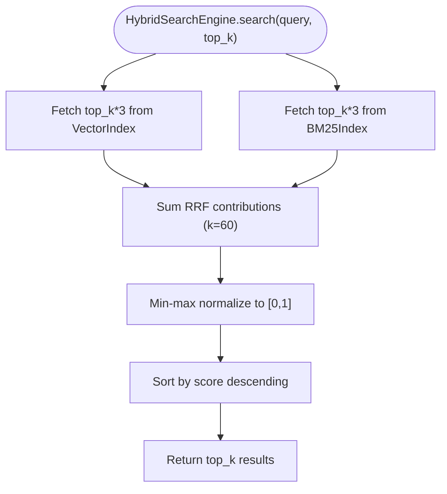
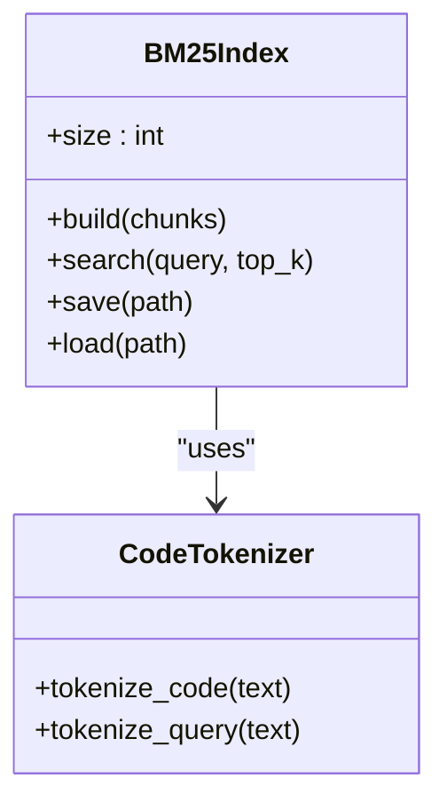
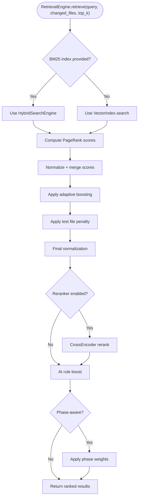
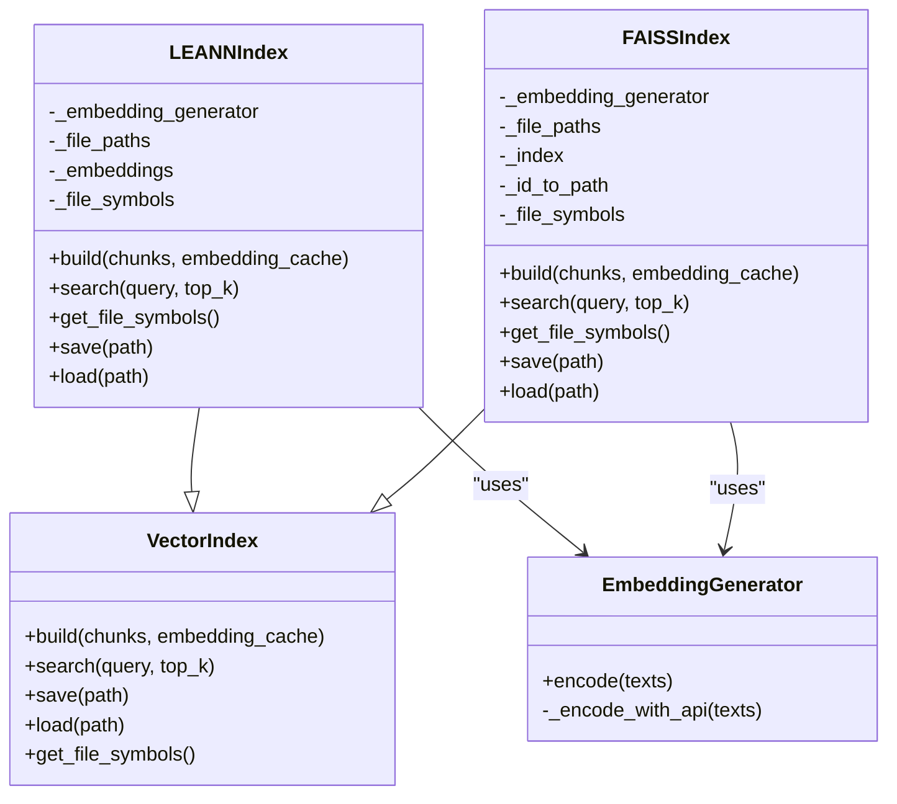
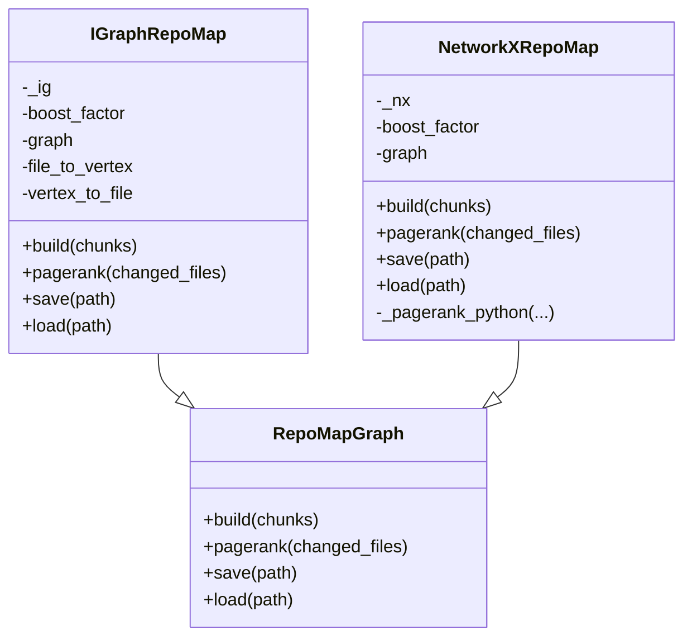
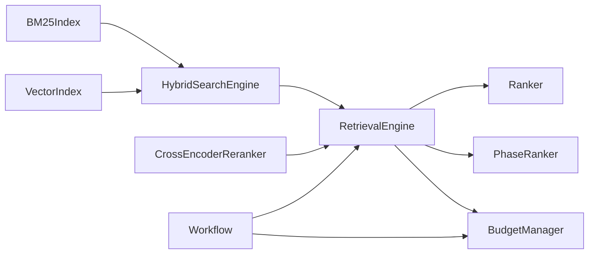

# Retrieval System

<cite>
**Referenced Files in This Document**
- [retrieval.py](file://src/ws_ctx_engine/retrieval/retrieval.py)
- [ranker.py](file://src/ws_ctx_engine/ranking/ranker.py)
- [phase_ranker.py](file://src/ws_ctx_engine/ranking/phase_ranker.py)
- [vector_index.py](file://src/ws_ctx_engine/vector_index/vector_index.py)
- [graph.py](file://src/ws_ctx_engine/graph/graph.py)
- [budget.py](file://src/ws_ctx_engine/budget/budget.py)
- [models.py](file://src/ws_ctx_engine/models/models.py)
- [embedding_cache.py](file://src/ws_ctx_engine/vector_index/embedding_cache.py)
- [domain_map.py](file://src/ws_ctx_engine/domain_map/domain_map.py)
- [query.py](file://src/ws_ctx_engine/workflow/query.py)
- [config.py](file://src/ws_ctx_engine/config/config.py)
- [retrieval_example.py](file://examples/retrieval_example.py)
- [test_retrieval.py](file://tests/unit/test_retrieval.py)
- [test_ranker.py](file://tests/unit/test_ranker.py)
- [test_phase_ranker.py](file://tests/unit/test_phase_ranker.py)
- [test_budget.py](file://tests/unit/test_budget.py)
- [hybrid_engine.py](file://src/ws_ctx_engine/retrieval/hybrid_engine.py)
- [bm25_index.py](file://src/ws_ctx_engine/retrieval/bm25_index.py)
- [code_tokenizer.py](file://src/ws_ctx_engine/retrieval/code_tokenizer.py)
- [reranker.py](file://src/ws_ctx_engine/retrieval/reranker.py)
- [test_hybrid_engine.py](file://tests/unit/test_hybrid_engine.py)
- [test_bm25_index.py](file://tests/unit/test_bm25_index.py)
- [test_reranker.py](file://tests/unit/test_reranker.py)
- [test_phase5_integration.py](file://tests/integration/test_phase5_integration.py)
</cite>

## Update Summary
**Changes Made**
- Added comprehensive hybrid search engine combining BM25 sparse retrieval with dense vector search using reciprocal rank fusion (RRF)
- Introduced new BM25Index class with code-aware tokenization for keyword-based retrieval
- Added CrossEncoderReranker for precision layer after hybrid search
- Updated RetrievalEngine to integrate hybrid search capabilities and optional reranking
- Enhanced workflow integration to support BM25 index loading and cross-encoder reranking

## Table of Contents
1. [Introduction](#introduction)
2. [Project Structure](#project-structure)
3. [Core Components](#core-components)
4. [Architecture Overview](#architecture-overview)
5. [Detailed Component Analysis](#detailed-component-analysis)
6. [Dependency Analysis](#dependency-analysis)
7. [Performance Considerations](#performance-considerations)
8. [Troubleshooting Guide](#troubleshooting-guide)
9. [Conclusion](#conclusion)
10. [Appendices](#appendices)

## Introduction
This document explains the retrieval system that powers hybrid ranking in the context engine. The system now combines semantic search with structural PageRank scoring and BM25 sparse retrieval using reciprocal rank fusion (RRF) to produce robust file rankings. It includes an optional precision layer using cross-encoder reranking and integrates with vector index backends, a repository dependency graph, token budget management, and optional phase-aware weighting for agent workflows.

## Project Structure
The retrieval system spans several modules:
- Hybrid search engine orchestrating vector + BM25 fusion via RRF
- Retrieval engine with hybrid ranking capabilities
- Ranker utilities for AI rule persistence
- Phase-aware ranker for agent workflows
- Vector index backends for semantic search
- BM25 index with code-aware tokenization for keyword-based retrieval
- CrossEncoder reranker for precision layer
- Graph-based PageRank computation
- Token budget manager for content selection
- Supporting models, caches, and domain maps
- Workflow orchestration integrating all pieces

**Diagram sources**
- [hybrid_engine.py:36-96](file://src/ws_ctx_engine/retrieval/hybrid_engine.py#L36-L96)
- [bm25_index.py:21-139](file://src/ws_ctx_engine/retrieval/bm25_index.py#L21-L139)
- [reranker.py:30-138](file://src/ws_ctx_engine/retrieval/reranker.py#L30-L138)
- [retrieval.py:245-252](file://src/ws_ctx_engine/retrieval/retrieval.py#L245-L252)
- [phase_ranker.py:96-122](file://src/ws_ctx_engine/ranking/phase_ranker.py#L96-L122)
- [ranker.py:64-85](file://src/ws_ctx_engine/ranking/ranker.py#L64-L85)
- [vector_index.py:21-84](file://src/ws_ctx_engine/vector_index/vector_index.py#L21-L84)
- [graph.py:19-94](file://src/ws_ctx_engine/graph/graph.py#L19-L94)
- [domain_map.py:11-147](file://src/ws_ctx_engine/domain_map/domain_map.py#L11-L147)
- [budget.py:8-104](file://src/ws_ctx_engine/budget/budget.py#L8-L104)
- [query.py:230-616](file://src/ws_ctx_engine/workflow/query.py#L230-L616)

**Section sources**
- [retrieval.py:1-627](file://src/ws_ctx_engine/retrieval/retrieval.py#L1-L627)
- [vector_index.py:1-1120](file://src/ws_ctx_engine/vector_index/vector_index.py#L1-L1120)
- [graph.py:1-667](file://src/ws_ctx_engine/graph/graph.py#L1-L667)
- [budget.py:1-105](file://src/ws_ctx_engine/budget/budget.py#L1-L105)
- [domain_map.py:1-147](file://src/ws_ctx_engine/domain_map/domain_map.py#L1-L147)
- [ranker.py:1-86](file://src/ws_ctx_engine/ranking/ranker.py#L1-L86)
- [phase_ranker.py:1-138](file://src/ws_ctx_engine/ranking/phase_ranker.py#L1-L138)
- [query.py:1-617](file://src/ws_ctx_engine/workflow/query.py#L1-L617)
- [hybrid_engine.py:1-96](file://src/ws_ctx_engine/retrieval/hybrid_engine.py#L1-L96)
- [bm25_index.py:1-139](file://src/ws_ctx_engine/retrieval/bm25_index.py#L1-L139)
- [reranker.py:1-138](file://src/ws_ctx_engine/retrieval/reranker.py#L1-L138)
- [code_tokenizer.py:1-90](file://src/ws_ctx_engine/retrieval/code_tokenizer.py#L1-L90)

## Core Components
- HybridSearchEngine: Fuses vector-search and BM25 ranked lists using reciprocal rank fusion (RRF) with configurable smoothing constant.
- BM25Index: Implements BM25Okapi over CodeChunk content with code-aware tokenization for keyword-based retrieval.
- CrossEncoderReranker: Optional precision layer using cross-encoder models to rescore top-N candidates.
- RetrievalEngine: Enhanced to support hybrid search via BM25Index and optional cross-encoder reranking.
- VectorIndex: Abstract interface and concrete backends (LEANNIndex, FAISSIndex) for semantic search and symbol extraction.
- RepoMapGraph: Abstract interface and implementations (IGraphRepoMap, NetworkXRepoMap) for PageRank computation and dependency graph management.
- BudgetManager: Greedy knapsack selection constrained by token budgets.
- DomainKeywordMap: Maps domain keywords to directories for adaptive boosting.
- Ranker: Applies persistent AI rule boosting to ensure essential rule files are always included.
- PhaseRanker: Adjusts scores based on agent phase (discovery/edit/test) with phase-specific overrides.
- Workflow: Integrates retrieval, budget selection, and packing into a cohesive query pipeline with hybrid search support.

**Section sources**
- [hybrid_engine.py:36-96](file://src/ws_ctx_engine/retrieval/hybrid_engine.py#L36-L96)
- [bm25_index.py:21-139](file://src/ws_ctx_engine/retrieval/bm25_index.py#L21-L139)
- [reranker.py:30-138](file://src/ws_ctx_engine/retrieval/reranker.py#L30-L138)
- [retrieval.py:245-252](file://src/ws_ctx_engine/retrieval/retrieval.py#L245-L252)
- [vector_index.py:21-84](file://src/ws_ctx_engine/vector_index/vector_index.py#L21-L84)
- [graph.py:19-94](file://src/ws_ctx_engine/graph/graph.py#L19-L94)
- [budget.py:8-104](file://src/ws_ctx_engine/budget/budget.py#L8-L104)
- [domain_map.py:11-147](file://src/ws_ctx_engine/domain_map/domain_map.py#L11-L147)
- [ranker.py:28-85](file://src/ws_ctx_engine/ranking/ranker.py#L28-L85)
- [phase_ranker.py:96-127](file://src/ws_ctx_engine/ranking/phase_ranker.py#L96-L127)
- [query.py:230-616](file://src/ws_ctx_engine/workflow/query.py#L230-L616)

## Architecture Overview
The enhanced retrieval pipeline proceeds in phases with hybrid search capabilities:
1. Hybrid search: BM25Index.search and VectorIndex.search return file similarity scores, then fused via RRF.
2. Structural ranking: RepoMapGraph.pagerank produces PageRank scores.
3. Normalization and merge: Scores are normalized independently and merged using configured weights.
4. Adaptive boosting: Symbol, path, and domain signals are applied conditionally based on query classification.
5. Penalties: Test file penalty scales down scores for test-related files.
6. Final normalization: Scores are normalized to [0, 1].
7. Optional cross-encoder reranking: Precision layer rescores top-N candidates.
8. AI rule boost: Rule files are boosted and re-sorted.
9. Phase-aware weighting: Optional phase-specific adjustments.
10. Token budget selection: BudgetManager greedily selects files within token budget.

**Diagram sources**
- [retrieval.py:306-402](file://src/ws_ctx_engine/retrieval/retrieval.py#L306-L402)
- [hybrid_engine.py:55-96](file://src/ws_ctx_engine/retrieval/hybrid_engine.py#L55-L96)
- [reranker.py:74-121](file://src/ws_ctx_engine/retrieval/reranker.py#L74-L121)
- [ranker.py:64-85](file://src/ws_ctx_engine/ranking/ranker.py#L64-L85)
- [phase_ranker.py:96-122](file://src/ws_ctx_engine/ranking/phase_ranker.py#L96-L122)
- [budget.py:50-104](file://src/ws_ctx_engine/budget/budget.py#L50-L104)
- [query.py:399-429](file://src/ws_ctx_engine/workflow/query.py#L399-L429)

## Detailed Component Analysis

### HybridSearchEngine: Reciprocal Rank Fusion
- Implements reciprocal rank fusion (RRF) to combine vector and BM25 search results.
- Uses standard RRF constant k=60 to dampen influence of very high ranks.
- Fetches top_k * 3 candidates from each source to ensure good coverage before fusion.
- Applies min-max normalization to convert RRF scores to [0, 1] range.
- Returns final top-k list sorted by descending scores.

**Diagram sources**
- [hybrid_engine.py:55-96](file://src/ws_ctx_engine/retrieval/hybrid_engine.py#L55-L96)

**Section sources**
- [hybrid_engine.py:1-96](file://src/ws_ctx_engine/retrieval/hybrid_engine.py#L1-L96)

### BM25Index: Code-Aware Keyword Search
- Wraps BM25Okapi for keyword-based retrieval over CodeChunk content.
- Implements code-aware tokenization using tokenize_code and tokenize_query functions.
- Graceful degradation when rank-bm25 is unavailable (returns empty results).
- Provides build, search, save, and load methods with persistence support.
- Uses deduplicated token lists to improve search quality.

**Diagram sources**
- [bm25_index.py:21-139](file://src/ws_ctx_engine/retrieval/bm25_index.py#L21-L139)
- [code_tokenizer.py:48-90](file://src/ws_ctx_engine/retrieval/code_tokenizer.py#L48-L90)

**Section sources**
- [bm25_index.py:1-139](file://src/ws_ctx_engine/retrieval/bm25_index.py#L1-L139)
- [code_tokenizer.py:1-90](file://src/ws_ctx_engine/retrieval/code_tokenizer.py#L1-L90)

### CrossEncoderReranker: Precision Layer
- Optional cross-encoder model (default: BAAI/bge-reranker-v2-m3) for precision improvement.
- Loaded lazily on first use to avoid startup overhead.
- Environment variable WSCTX_ENABLE_RERANKER controls activation.
- Falls back to uniform scores when model is unavailable.
- Applies min-max normalization to convert raw scores to [0, 1].

**Section sources**
- [reranker.py:1-138](file://src/ws_ctx_engine/retrieval/reranker.py#L1-L138)

### RetrievalEngine: Enhanced Hybrid Ranking
- Enhanced to support hybrid search via BM25Index and optional cross-encoder reranking.
- Uses HybridSearchEngine when bm25_index parameter is provided.
- Integrates cross-encoder reranking as optional precision layer.
- Maintains backward compatibility with existing semantic-only mode.
- Preserves all existing ranking features (symbol/path/domain boosting, penalties, etc.).

**Diagram sources**
- [retrieval.py:306-402](file://src/ws_ctx_engine/retrieval/retrieval.py#L306-L402)

**Section sources**
- [retrieval.py:245-252](file://src/ws_ctx_engine/retrieval/retrieval.py#L245-L252)
- [retrieval.py:306-402](file://src/ws_ctx_engine/retrieval/retrieval.py#L306-L402)

### VectorIndex Backends: Semantic Search
- VectorIndex defines the contract for build, search, save, load, and symbol extraction.
- LEANNIndex:
  - Groups chunks by file, concatenates content, generates embeddings, stores file paths and symbols.
  - Cosine similarity search with normalized vectors.
  - get_file_symbols returns per-file symbol lists.
- FAISSIndex:
  - Uses IndexFlatL2 wrapped in IndexIDMap2 for exact search.
  - Supports embedding cache for incremental rebuilds.
  - get_file_symbols returns per-file symbol lists.
- EmbeddingGenerator:
  - Attempts local sentence-transformers model; falls back to OpenAI API on memory errors or unavailability.
  - Memory checks and graceful degradation.

**Diagram sources**
- [vector_index.py:21-84](file://src/ws_ctx_engine/vector_index/vector_index.py#L21-L84)
- [vector_index.py:282-503](file://src/ws_ctx_engine/vector_index/vector_index.py#L282-L503)
- [vector_index.py:506-800](file://src/ws_ctx_engine/vector_index/vector_index.py#L506-L800)

**Section sources**
- [vector_index.py:21-84](file://src/ws_ctx_engine/vector_index/vector_index.py#L21-L84)
- [vector_index.py:282-503](file://src/ws_ctx_engine/vector_index/vector_index.py#L282-L503)
- [vector_index.py:506-800](file://src/ws_ctx_engine/vector_index/vector_index.py#L506-L800)
- [embedding_cache.py:28-127](file://src/ws_ctx_engine/vector_index/embedding_cache.py#L28-L127)

### RepoMapGraph: Structural PageRank
- RepoMapGraph builds a directed dependency graph from symbol definitions and references.
- IGraphRepoMap: Fast C++ backend using python-igraph; supports boost factor for changed files and renormalization.
- NetworkXRepoMap: Pure Python fallback; includes a power iteration implementation when scipy is unavailable.
- Both support save/load for incremental indexing.

**Diagram sources**
- [graph.py:19-94](file://src/ws_ctx_engine/graph/graph.py#L19-L94)
- [graph.py:97-314](file://src/ws_ctx_engine/graph/graph.py#L97-L314)
- [graph.py:317-569](file://src/ws_ctx_engine/graph/graph.py#L317-L569)

**Section sources**
- [graph.py:19-94](file://src/ws_ctx_engine/graph/graph.py#L19-L94)
- [graph.py:97-314](file://src/ws_ctx_engine/graph/graph.py#L97-L314)
- [graph.py:317-569](file://src/ws_ctx_engine/graph/graph.py#L317-L569)

### DomainKeywordMap: Domain-Aware Boosting
- Builds keyword-to-directories mapping from file paths during indexing.
- At query time, identifies domain keywords and matches directories for domain boost.
- Supports exact and prefix-based matching with minimum prefix length thresholds.

**Section sources**
- [domain_map.py:11-147](file://src/ws_ctx_engine/domain_map/domain_map.py#L11-L147)
- [retrieval.py:523-554](file://src/ws_ctx_engine/retrieval/retrieval.py#L523-L554)

### Ranker: AI Rule Persistence
- Ensures essential rule files (e.g., .cursorrules, AI_RULES.md, CLAUDE.md) are always included and ranked highly.
- apply_ai_rule_boost_to_ranked increases scores by a fixed boost and re-sorts.

**Section sources**
- [ranker.py:28-85](file://src/ws_ctx_engine/ranking/ranker.py#L28-L85)
- [retrieval.py:377-385](file://src/ws_ctx_engine/retrieval/retrieval.py#L377-L385)

### PhaseRanker: Agent Phase-Aware Ranking
- Defines AgentPhase (DISCOVERY, EDIT, TEST) and PhaseWeightConfig overrides.
- apply_phase_weights multiplies scores for test and mock files depending on phase.
- get_phase_config returns overrides; parse_phase converts CLI strings.

**Section sources**
- [phase_ranker.py:25-127](file://src/ws_ctx_engine/ranking/phase_ranker.py#L25-L127)
- [query.py:407-416](file://src/ws_ctx_engine/workflow/query.py#L407-L416)

### BudgetManager: Token-Aware Content Selection
- Implements greedy knapsack selection to respect token budgets.
- Reserves 20% for metadata and uses 80% for content.
- Reads file contents, counts tokens with tiktoken, and accumulates until budget is exhausted.

**Section sources**
- [budget.py:8-104](file://src/ws_ctx_engine/budget/budget.py#L8-L104)
- [query.py:421-429](file://src/ws_ctx_engine/workflow/query.py#L421-L429)

### Workflow Integration
- query_and_pack coordinates index loading, retrieval, budget selection, and packing.
- Loads BM25 index if available and cross-encoder reranker when enabled.
- Applies phase-aware weighting when agent_phase is provided.
- Handles secrets scanning, deduplication, compression, and output formatting.

**Section sources**
- [query.py:256-429](file://src/ws_ctx_engine/workflow/query.py#L256-L429)

## Dependency Analysis
- HybridSearchEngine depends on VectorIndex and BM25Index for hybrid search capabilities.
- RetrievalEngine optionally uses HybridSearchEngine when bm25_index is provided.
- CrossEncoderReranker operates as an optional precision layer after retrieval.
- Ranker and PhaseRanker operate on the ranked list post-retrieval.
- BudgetManager consumes the ranked list and repository paths to select files within budget.
- Workflow composes all components and exposes CLI-friendly entry points.

**Diagram sources**
- [hybrid_engine.py:45-53](file://src/ws_ctx_engine/retrieval/hybrid_engine.py#L45-L53)
- [retrieval.py:245-252](file://src/ws_ctx_engine/retrieval/retrieval.py#L245-L252)
- [reranker.py:74-121](file://src/ws_ctx_engine/retrieval/reranker.py#L74-L121)
- [ranker.py:64-85](file://src/ws_ctx_engine/ranking/ranker.py#L64-L85)
- [phase_ranker.py:96-122](file://src/ws_ctx_engine/ranking/phase_ranker.py#L96-L122)
- [budget.py:50-104](file://src/ws_ctx_engine/budget/budget.py#L50-L104)
- [query.py:389-429](file://src/ws_ctx_engine/workflow/query.py#L389-L429)

**Section sources**
- [retrieval.py:245-252](file://src/ws_ctx_engine/retrieval/retrieval.py#L245-L252)
- [query.py:389-429](file://src/ws_ctx_engine/workflow/query.py#L389-L429)

## Performance Considerations
- Hybrid search performance:
  - HybridSearchEngine fetches top_k * 3 from each source to ensure good coverage before fusion.
  - RRF fusion is O(n + m) where n and m are the number of results from vector and BM25 sources.
  - Min-max normalization adds minimal computational overhead.
- BM25Index optimizations:
  - Code-aware tokenization reduces vocabulary size and improves search quality.
  - Graceful fallback when rank-bm25 is unavailable preserves system reliability.
  - Persistent index storage via pickle for fast reloads.
- CrossEncoderReranker:
  - Lazy loading avoids startup overhead when disabled.
  - GPU acceleration supported when CUDA is available.
- Vector search backends:
  - LEANNIndex stores embeddings for all files and computes cosine similarity efficiently.
  - FAISSIndex uses exact search (IndexFlatL2) wrapped in IndexIDMap2 for incremental updates.
  - EmbeddingGenerator falls back to API on memory constraints and logs fallback events.
- Graph computation:
  - IGraphRepoMap leverages C++ backend for fast PageRank; NetworkXRepoMap provides a pure Python fallback.
- Token budgeting:
  - BudgetManager uses greedy selection to maximize total importance within content budget.
- Caching:
  - EmbeddingCache persists content-hash → embedding mappings to avoid re-embedding unchanged files.
  - BM25 index persistence enables fast reloading of keyword index.
- Memory and CPU:
  - EmbeddingGenerator checks available memory before initializing local models.
  - FAISSIndex supports incremental removal/addition via ID mapping to maintain performance over time.

## Troubleshooting Guide
- Invalid weights:
  - RetrievalEngine raises ValueError if weights are outside [0, 1] or do not sum to 1.0.
- Empty or missing results:
  - If semantic search or PageRank computation fails, the engine continues with partial results and logs warnings.
  - HybridSearchEngine returns empty results when both sources are empty.
- BM25Index failures:
  - If rank-bm25 is not installed, BM25Index.search returns empty results gracefully.
  - BM25Index.build handles empty chunk lists without raising exceptions.
- CrossEncoderReranker failures:
  - If sentence-transformers is not installed or model fails to load, reranker falls back to uniform scores.
  - Environment variable WSCTX_ENABLE_RERANKER controls activation.
- Low memory during embedding:
  - EmbeddingGenerator falls back to API and frees memory when out-of-memory conditions occur.
- Graph backend availability:
  - If igraph is unavailable, the system automatically falls back to NetworkX and logs the fallback.
- Phase-aware ranking failures:
  - Workflow catches exceptions and logs warnings, then proceeds without phase adjustments.

**Section sources**
- [retrieval.py:219-227](file://src/ws_ctx_engine/retrieval/retrieval.py#L219-L227)
- [retrieval.py:317-318](file://src/ws_ctx_engine/retrieval/retrieval.py#L317-L318)
- [bm25_index.py:61-64](file://src/ws_ctx_engine/retrieval/bm25_index.py#L61-L64)
- [reranker.py:134-137](file://src/ws_ctx_engine/retrieval/reranker.py#L134-L137)
- [vector_index.py:130-251](file://src/ws_ctx_engine/vector_index/vector_index.py#L130-L251)
- [graph.py:594-620](file://src/ws_ctx_engine/graph/graph.py#L594-L620)
- [query.py:414-416](file://src/ws_ctx_engine/workflow/query.py#L414-L416)

## Conclusion
The retrieval system now provides comprehensive hybrid search capabilities combining semantic, BM25 keyword-based, and structural signals with adaptive boosting and domain awareness. The addition of reciprocal rank fusion (RRF) creates a robust fusion mechanism that leverages the strengths of both dense vector and sparse BM25 retrieval. An optional cross-encoder precision layer further enhances result quality when enabled. The system maintains backward compatibility while offering enhanced performance and accuracy through its hybrid approach, integrating seamlessly with vector index backends, dependency graphs, token budgeting, and agent-phase-aware weighting.

## Appendices

### Configuration Options for Tuning
- Scoring weights:
  - semantic_weight: Weight for semantic similarity (default 0.6)
  - pagerank_weight: Weight for PageRank scores (default 0.4)
- Adaptive boosting:
  - symbol_boost: Additive boost for symbol matches (default 0.3)
  - path_boost: Additive boost for path keyword matches (default 0.2)
  - domain_boost: Additive boost for domain directory matches (default 0.25)
- Penalties:
  - test_penalty: Multiplicative penalty for test files (default 0.5)
- Token budget:
  - token_budget: Total token budget for context (default 100000)
- AI rule persistence:
  - ai_rules.auto_detect: Enable auto-detection of rule files
  - ai_rules.extra_files: Additional rule file names/paths
  - ai_rules.boost: Score boost for rule files (default 10.0)
- Phase-aware overrides:
  - semantic_weight, symbol_weight, signature_only, include_tree, max_token_density, test_file_boost, mock_file_boost per AgentPhase
- Hybrid search options:
  - bm25_rrf_k: RRF smoothing constant (default 60)
- Cross-encoder reranking:
  - WSCTX_ENABLE_RERANKER: Enable cross-encoder reranking (default off)
  - reranker_model: Cross-encoder model name (default BAAI/bge-reranker-v2-m3)

**Section sources**
- [config.py:174-185](file://src/ws_ctx_engine/config/config.py#L174-L185)
- [config.py:216-225](file://src/ws_ctx_engine/config/config.py#L216-L225)
- [phase_ranker.py:32-72](file://src/ws_ctx_engine/ranking/phase_ranker.py#L32-L72)
- [hybrid_engine.py:20](file://src/ws_ctx_engine/retrieval/hybrid_engine.py#L20)
- [reranker.py:27](file://src/ws_ctx_engine/retrieval/reranker.py#L27)

### Example Workflows
- Basic hybrid retrieval:
  - Build vector index and BM25 index, create RetrievalEngine with desired weights, call retrieve with a query and optional changed_files.
- Phase-aware retrieval:
  - After retrieving, apply apply_phase_weights with the current AgentPhase.
- Token-aware selection:
  - Use BudgetManager to select files within token budget after retrieval.
- Cross-encoder reranking:
  - Enable WSCTX_ENABLE_RERANKER=1 environment variable and provide content_map for reranking.

**Section sources**
- [retrieval_example.py:81-156](file://examples/retrieval_example.py#L81-L156)
- [query.py:407-416](file://src/ws_ctx_engine/workflow/query.py#L407-L416)
- [budget.py:50-104](file://src/ws_ctx_engine/budget/budget.py#L50-L104)
- [reranker.py:67](file://src/ws_ctx_engine/retrieval/reranker.py#L67)

### Unit Tests Highlights
- HybridSearchEngine:
  - RRF fusion formula correctness, result ordering, top_k truncation, degenerate cases.
- BM25Index:
  - Build and search functionality, graceful fallback, persistence, tokenization quality.
- CrossEncoderReranker:
  - Correct ordering, score normalization, top_k truncation, environment variable control, integration testing.
- RetrievalEngine:
  - Weight validation, hybrid search integration, normalization, merging, symbol/path/domain scoring, test file penalty, and final normalization.
- Ranker:
  - AI rule file detection and boosting behavior.
- PhaseRanker:
  - Phase parsing, test/mock file boosting, and sorting correctness.
- BudgetManager:
  - Greedy selection, budget reservation, and token counting accuracy.

**Section sources**
- [test_hybrid_engine.py:1-183](file://tests/unit/test_hybrid_engine.py#L1-L183)
- [test_bm25_index.py:1-151](file://tests/unit/test_bm25_index.py#L1-L151)
- [test_reranker.py:1-168](file://tests/unit/test_reranker.py#L1-L168)
- [test_retrieval.py:63-604](file://tests/unit/test_retrieval.py#L63-L604)
- [test_ranker.py:13-83](file://tests/unit/test_ranker.py#L13-L83)
- [test_phase_ranker.py:13-83](file://tests/unit/test_phase_ranker.py#L13-L83)
- [test_budget.py:35-283](file://tests/unit/test_budget.py#L35-L283)