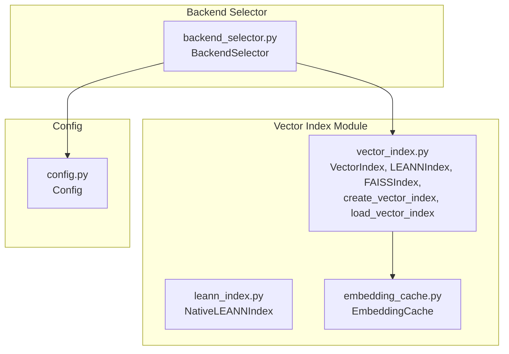
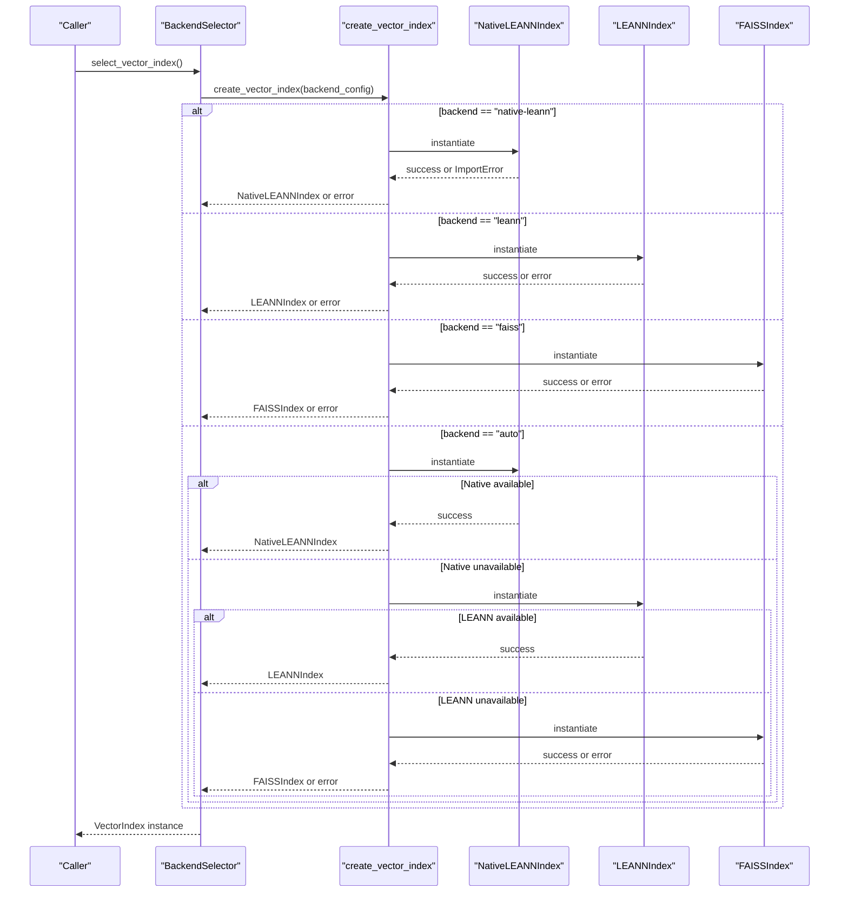
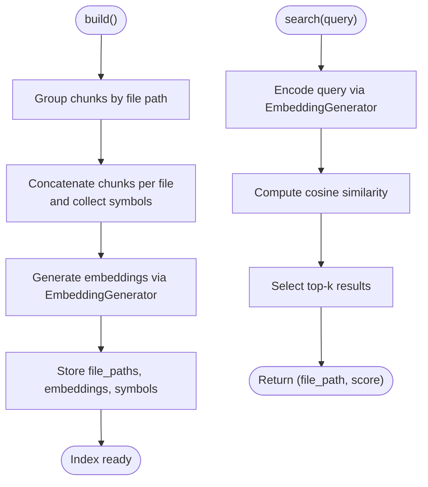
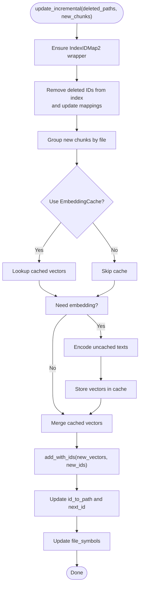
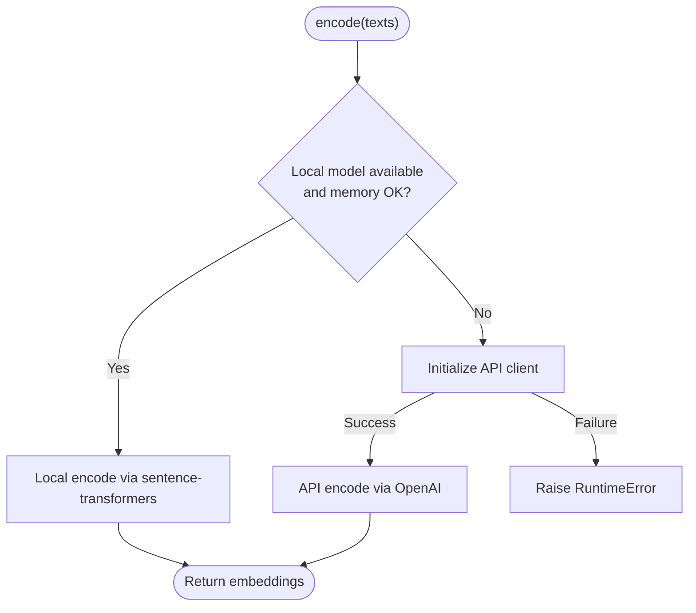
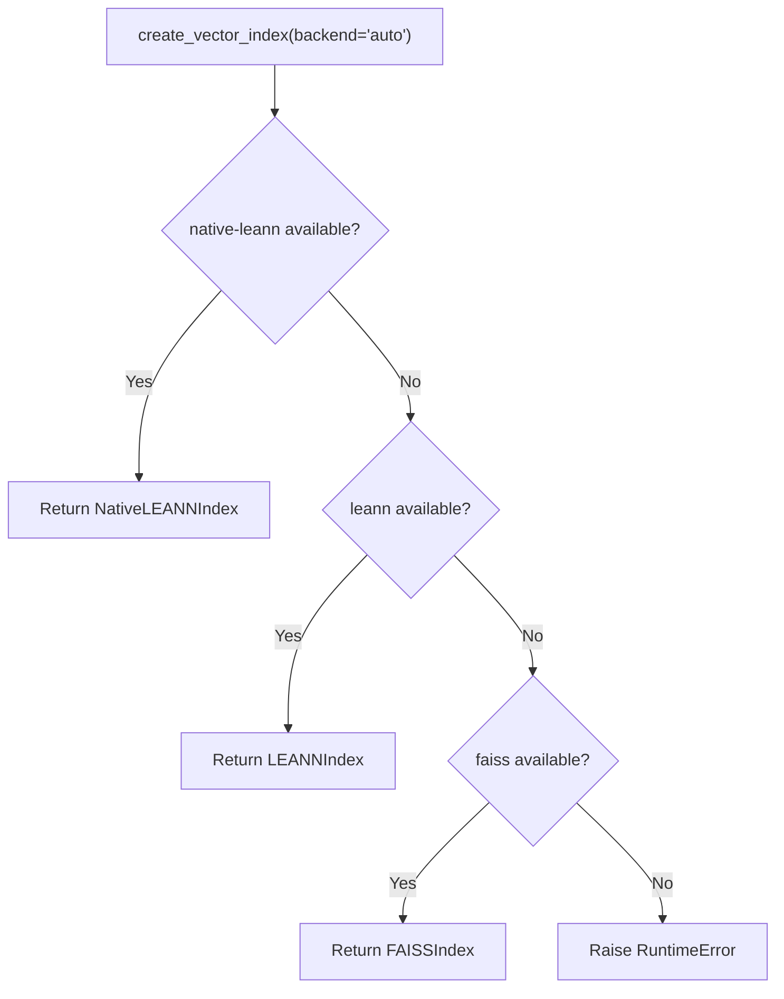
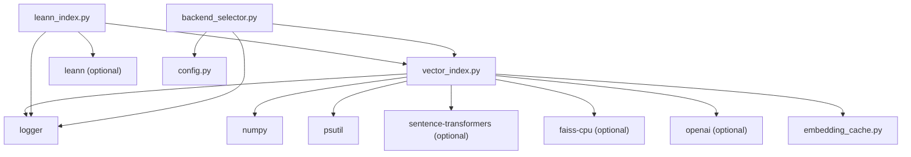

# Backend Selection Strategy

<cite>
**Referenced Files in This Document**
- [vector_index.py](file://src/ws_ctx_engine/vector_index/vector_index.py)
- [leann_index.py](file://src/ws_ctx_engine/vector_index/leann_index.py)
- [backend_selector.py](file://src/ws_ctx_engine/backend_selector/backend_selector.py)
- [config.py](file://src/ws_ctx_engine/config/config.py)
- [embedding_cache.py](file://src/ws_ctx_engine/vector_index/embedding_cache.py)
- [vector-index.md](file://docs/reference/vector-index.md)
- [.ws-ctx-engine.yaml.example](file://.ws-ctx-engine.yaml.example)
- [cli.py](file://src/ws_ctx_engine/cli/cli.py)
- [indexer.py](file://src/ws_ctx_engine/workflow/indexer.py)
- [test_fallback_scenarios.py](file://tests/integration/test_fallback_scenarios.py)
</cite>

## Table of Contents
1. [Introduction](#introduction)
2. [Project Structure](#project-structure)
3. [Core Components](#core-components)
4. [Architecture Overview](#architecture-overview)
5. [Detailed Component Analysis](#detailed-component-analysis)
6. [Dependency Analysis](#dependency-analysis)
7. [Performance Considerations](#performance-considerations)
8. [Troubleshooting Guide](#troubleshooting-guide)
9. [Conclusion](#conclusion)
10. [Appendices](#appendices)

## Introduction
This document explains the vector index backend selection strategy used by the system. It covers the abstract VectorIndex interface, the decision-making process among LEANNIndex and FAISSIndex backends, configuration options for backend preference, resource availability assessment, and performance characteristics. It also details fallback mechanisms, backend-specific optimizations, memory usage patterns, scalability considerations, configuration examples, performance tuning recommendations, and troubleshooting steps.

## Project Structure
The vector index and backend selection logic resides primarily in the vector_index module and the backend_selector module, with configuration managed centrally.

**Diagram sources**
- [vector_index.py:21-1120](file://src/ws_ctx_engine/vector_index/vector_index.py#L21-L1120)
- [leann_index.py:1-297](file://src/ws_ctx_engine/vector_index/leann_index.py#L1-L297)
- [embedding_cache.py:1-127](file://src/ws_ctx_engine/vector_index/embedding_cache.py#L1-L127)
- [backend_selector.py:1-191](file://src/ws_ctx_engine/backend_selector/backend_selector.py#L1-L191)
- [config.py:74-101](file://src/ws_ctx_engine/config/config.py#L74-L101)

**Section sources**
- [vector_index.py:1-1120](file://src/ws_ctx_engine/vector_index/vector_index.py#L1-L1120)
- [backend_selector.py:1-191](file://src/ws_ctx_engine/backend_selector/backend_selector.py#L1-L191)
- [config.py:1-399](file://src/ws_ctx_engine/config/config.py#L1-L399)

## Core Components
- VectorIndex: Abstract base class defining the contract for vector index implementations (build, search, save, load).
- LEANNIndex: Cosine similarity-based implementation that groups chunks by file and stores embeddings for files.
- FAISSIndex: Fallback implementation using FAISS IndexFlatL2 wrapped in IndexIDMap2 for exact search and incremental updates.
- NativeLEANNIndex: Production-grade implementation using the LEANN library for 97% storage savings via graph-based recomputation.
- EmbeddingGenerator: Generates embeddings with automatic fallback from local to API and memory-aware checks.
- EmbeddingCache: Disk-backed cache for incremental indexing to avoid re-embedding unchanged content.
- BackendSelector: Central orchestrator for backend selection with graceful fallback chains.
- Config: Central configuration for backend preferences and embedding settings.

**Section sources**
- [vector_index.py:21-1120](file://src/ws_ctx_engine/vector_index/vector_index.py#L21-L1120)
- [leann_index.py:20-297](file://src/ws_ctx_engine/vector_index/leann_index.py#L20-L297)
- [embedding_cache.py:28-127](file://src/ws_ctx_engine/vector_index/embedding_cache.py#L28-L127)
- [backend_selector.py:13-191](file://src/ws_ctx_engine/backend_selector/backend_selector.py#L13-L191)
- [config.py:74-101](file://src/ws_ctx_engine/config/config.py#L74-L101)

## Architecture Overview
The backend selection strategy follows a prioritized fallback chain controlled by configuration. The system attempts to use the highest-performance backend first and gracefully degrades to lower-performance alternatives when dependencies or resources are unavailable.

**Diagram sources**
- [backend_selector.py:36-81](file://src/ws_ctx_engine/backend_selector/backend_selector.py#L36-L81)
- [vector_index.py:972-1080](file://src/ws_ctx_engine/vector_index/vector_index.py#L972-L1080)

## Detailed Component Analysis

### Abstract VectorIndex Interface
VectorIndex defines the contract that all backends must implement:
- build: Construct the index from CodeChunk inputs.
- search: Perform semantic search and return ranked file paths with similarity scores.
- save/load: Persist and restore index state.
- get_file_symbols: Optional mapping of file paths to symbols.

This abstraction ensures interchangeable backends and consistent behavior across implementations.

**Section sources**
- [vector_index.py:21-94](file://src/ws_ctx_engine/vector_index/vector_index.py#L21-L94)

### Backend Selection Logic
BackendSelector resolves the vector index backend based on configuration and environment capabilities:
- Reads backends.vector_index from Config.
- Delegates to create_vector_index with the selected backend.
- Logs current fallback level and configuration for observability.

The fallback levels are:
- Level 1: NativeLEANN (if available) + local embeddings
- Level 2: LEANNIndex + local embeddings
- Level 3: FAISSIndex + local embeddings
- Level 4: FAISSIndex + API embeddings
- Level 5: File size ranking only (no graph)

**Section sources**
- [backend_selector.py:13-178](file://src/ws_ctx_engine/backend_selector/backend_selector.py#L13-L178)
- [config.py:74-81](file://src/ws_ctx_engine/config/config.py#L74-L81)

### LEANNIndex (Cosine Similarity)
LEANNIndex groups chunks by file path, concatenates content per file, and computes embeddings per file. It stores file-level embeddings and uses cosine similarity for search.

Key characteristics:
- File-level grouping reduces dimensionality compared to per-chunk embeddings.
- Uses cosine similarity with normalized vectors.
- Stores file → symbols mapping for symbol boosting.
- Saves metadata including model parameters and file paths.

**Diagram sources**
- [vector_index.py:310-428](file://src/ws_ctx_engine/vector_index/vector_index.py#L310-L428)

**Section sources**
- [vector_index.py:282-504](file://src/ws_ctx_engine/vector_index/vector_index.py#L282-L504)

### FAISSIndex (Exact Search + Incremental Updates)
FAISSIndex uses IndexFlatL2 wrapped in IndexIDMap2 for exact nearest neighbor search and supports incremental updates:
- IndexFlatL2 + IndexIDMap2 enable remove_ids and add_with_ids for incremental updates.
- Maintains authoritative ID-to-path mapping to handle deletions reliably.
- Supports embedding cache to avoid re-embedding unchanged files.
- Provides update_incremental for removing deleted paths and adding new/changed chunks.

**Diagram sources**
- [vector_index.py:855-962](file://src/ws_ctx_engine/vector_index/vector_index.py#L855-L962)

**Section sources**
- [vector_index.py:506-962](file://src/ws_ctx_engine/vector_index/vector_index.py#L506-L962)
- [embedding_cache.py:28-127](file://src/ws_ctx_engine/vector_index/embedding_cache.py#L28-L127)

### NativeLEANNIndex (97% Storage Savings)
NativeLEANNIndex leverages the LEANN library for graph-based selective recomputation:
- Two backend options: HNSW or DiskANN.
- Produces metadata files and persists index artifacts.
- Integrates with the same VectorIndex interface.

**Section sources**
- [leann_index.py:20-297](file://src/ws_ctx_engine/vector_index/leann_index.py#L20-L297)

### EmbeddingGenerator and Fallback Mechanisms
EmbeddingGenerator encapsulates embedding generation with memory-aware checks and API fallback:
- Initializes sentence-transformers locally if memory allows.
- Falls back to OpenAI API when local model fails or memory is insufficient.
- Uses configurable model name, device, and batch size.

**Diagram sources**
- [vector_index.py:199-280](file://src/ws_ctx_engine/vector_index/vector_index.py#L199-L280)

**Section sources**
- [vector_index.py:96-280](file://src/ws_ctx_engine/vector_index/vector_index.py#L96-L280)

### Configuration Options for Backend Preference
Backends are configured via the Config class:
- backends.vector_index: "auto" | "native-leann" | "leann" | "faiss"
- backends.graph: "auto" | "igraph" | "networkx"
- backends.embeddings: "auto" | "local" | "api"
- embeddings.model/device/batch_size/api_provider/api_key_env
- performance.cache_embeddings/incremental_index

Example configurations are provided in the example config file.

**Section sources**
- [config.py:74-101](file://src/ws_ctx_engine/config/config.py#L74-L101)
- [.ws-ctx-engine.yaml.example:103-161](file://.ws-ctx-engine.yaml.example#L103-L161)

### Resource Availability Assessment
- Memory-aware checks: EmbeddingGenerator checks available memory before initializing local models.
- Optional dependencies: NativeLEANNIndex requires the leann library; FAISSIndex requires faiss-cpu.
- CLI auto-resolution: The CLI reports installed optional dependencies and auto-resolves vector_index backend accordingly.

**Section sources**
- [vector_index.py:130-142](file://src/ws_ctx_engine/vector_index/vector_index.py#L130-L142)
- [cli.py:283-296](file://src/ws_ctx_engine/cli/cli.py#L283-L296)

### Performance Characteristics
- Search latency targets (typical):
  - NativeLEANN: <10ms (1k), <50ms (10k), <200ms (100k)
  - LEANNIndex: <5ms (1k), <20ms (10k), <100ms (100k)
  - FAISSIndex (IndexFlatL2): <1ms (1k), <5ms (10k), <20ms (100k)
- Memory usage (approximate, 10k files, 384-dim):
  - NativeLEANN: ~3MB (97% savings)
  - LEANNIndex: ~15MB
  - FAISSIndex: ~20MB

These targets are derived from the module documentation and reflect backend-specific trade-offs between storage, indexing cost, and search speed.

**Section sources**
- [vector-index.md:402-420](file://docs/reference/vector-index.md#L402-L420)

### Backend-Specific Optimizations and Scalability
- LEANNIndex:
  - File-level embeddings reduce memory footprint.
  - Cosine similarity is efficient for moderate-scale repositories.
- FAISSIndex:
  - IndexFlatL2 provides exact nearest neighbors.
  - IndexIDMap2 supports incremental updates and ID mapping correctness.
  - EmbeddingCache avoids re-embedding unchanged content for large incremental rebuilds.
- NativeLEANNIndex:
  - 97% storage savings via graph-based recomputation.
  - HNSW/DiskANN backends selectable for different workload profiles.

**Section sources**
- [vector_index.py:506-962](file://src/ws_ctx_engine/vector_index/vector_index.py#L506-L962)
- [leann_index.py:20-297](file://src/ws_ctx_engine/vector_index/leann_index.py#L20-L297)
- [embedding_cache.py:28-127](file://src/ws_ctx_engine/vector_index/embedding_cache.py#L28-L127)

### Automatic Backend Switching and Fallback Chains
- create_vector_index implements a strict fallback chain:
  - native-leann → leann → faiss
  - On ImportError or runtime failures, logs fallback events and proceeds to the next backend.
- BackendSelector integrates with Config to resolve backend preferences and logs the effective fallback level.

**Diagram sources**
- [vector_index.py:1031-1080](file://src/ws_ctx_engine/vector_index/vector_index.py#L1031-L1080)

**Section sources**
- [vector_index.py:972-1080](file://src/ws_ctx_engine/vector_index/vector_index.py#L972-L1080)
- [backend_selector.py:36-81](file://src/ws_ctx_engine/backend_selector/backend_selector.py#L36-L81)

### Incremental Indexing and Embedding Cache
- EmbeddingCache persists content-hash → vector mappings to avoid re-embedding unchanged files.
- FAISSIndex.update_incremental removes deleted IDs and adds new/changed vectors, leveraging the cache for efficiency.
- The workflow conditionally uses incremental mode based on configuration and detects stale indexes.

**Section sources**
- [embedding_cache.py:28-127](file://src/ws_ctx_engine/vector_index/embedding_cache.py#L28-L127)
- [vector_index.py:855-962](file://src/ws_ctx_engine/vector_index/vector_index.py#L855-L962)
- [indexer.py:197-242](file://src/ws_ctx_engine/workflow/indexer.py#L197-L242)

## Dependency Analysis
The vector index module depends on:
- External packages: numpy, psutil, sentence-transformers (optional), faiss-cpu (optional), leann (optional), openai (optional).
- Internal modules: models, logger, and embedding_cache.

**Diagram sources**
- [vector_index.py:9-18](file://src/ws_ctx_engine/vector_index/vector_index.py#L9-L18)
- [leann_index.py:10-17](file://src/ws_ctx_engine/vector_index/leann_index.py#L10-L17)
- [backend_selector.py:7-10](file://src/ws_ctx_engine/backend_selector/backend_selector.py#L7-L10)
- [config.py:1-14](file://src/ws_ctx_engine/config/config.py#L1-L14)

**Section sources**
- [vector_index.py:9-18](file://src/ws_ctx_engine/vector_index/vector_index.py#L9-L18)
- [leann_index.py:10-17](file://src/ws_ctx_engine/vector_index/leann_index.py#L10-L17)
- [backend_selector.py:7-10](file://src/ws_ctx_engine/backend_selector/backend_selector.py#L7-L10)
- [config.py:1-14](file://src/ws_ctx_engine/config/config.py#L1-L14)

## Performance Considerations
- Choose NativeLEANN for maximum storage savings and acceptable latency on typical workloads.
- Prefer FAISSIndex for fastest search performance and when incremental updates are required.
- Use LEANNIndex as a balanced fallback with straightforward operation and minimal dependencies.
- Tune embeddings.device and batch_size to match hardware capabilities while avoiding out-of-memory conditions.
- Enable embedding cache to reduce rebuild times for incremental runs.

[No sources needed since this section provides general guidance]

## Troubleshooting Guide
Common issues and resolutions:
- ImportError for optional backends:
  - Install leann for NativeLEANN or faiss-cpu for FAISSIndex.
  - The CLI auto-resolves backends based on installed dependencies.
- Out-of-memory during local embedding:
  - Reduce batch_size or switch embeddings.backend to "api".
  - EmbeddingGenerator already falls back to API when memory is low.
- FAISS fallback triggered unexpectedly:
  - Verify faiss-cpu installation and availability.
  - Check that the backend preference is set to "faiss" or "auto".
- Incremental update failures:
  - Ensure EmbeddingCache is enabled and persisted.
  - Confirm that FAISSIndex is used for incremental updates.

Validation and examples:
- Integration tests demonstrate LEANN to FAISS fallback and performance bounds.
- The example configuration shows recommended settings for different deployment scenarios.

**Section sources**
- [cli.py:283-296](file://src/ws_ctx_engine/cli/cli.py#L283-L296)
- [vector_index.py:130-142](file://src/ws_ctx_engine/vector_index/vector_index.py#L130-L142)
- [test_fallback_scenarios.py:327-396](file://tests/integration/test_fallback_scenarios.py#L327-L396)
- [.ws-ctx-engine.yaml.example:236-254](file://.ws-ctx-engine.yaml.example#L236-L254)

## Conclusion
The backend selection strategy prioritizes performance and reliability by attempting the most capable backend first and gracefully degrading to simpler alternatives. Configuration controls backend preferences, while resource-aware checks and embedding fallbacks ensure robust operation across diverse environments. Incremental updates and caching further improve operational efficiency for large repositories.

[No sources needed since this section summarizes without analyzing specific files]

## Appendices

### Configuration Examples for Different Deployment Scenarios
- Minimal dependencies (no optional backends):
  - vector_index: faiss
  - graph: networkx
  - embeddings: api
- Maximum performance (all primary backends):
  - vector_index: leann
  - graph: igraph
  - embeddings: local
  - embeddings.device: cuda
  - embeddings.batch_size: 128

See the example configuration for additional scenarios and comments.

**Section sources**
- [.ws-ctx-engine.yaml.example:236-254](file://.ws-ctx-engine.yaml.example#L236-L254)

### Performance Tuning Recommendations
- Use NativeLEANN for storage-constrained environments.
- Use FAISSIndex for fastest search and when incremental updates are essential.
- Adjust embeddings.batch_size to balance throughput and memory usage.
- Enable embeddings.cache_embeddings to accelerate incremental rebuilds.

**Section sources**
- [vector-index.md:402-420](file://docs/reference/vector-index.md#L402-L420)
- [indexer.py:197-242](file://src/ws_ctx_engine/workflow/indexer.py#L197-L242)