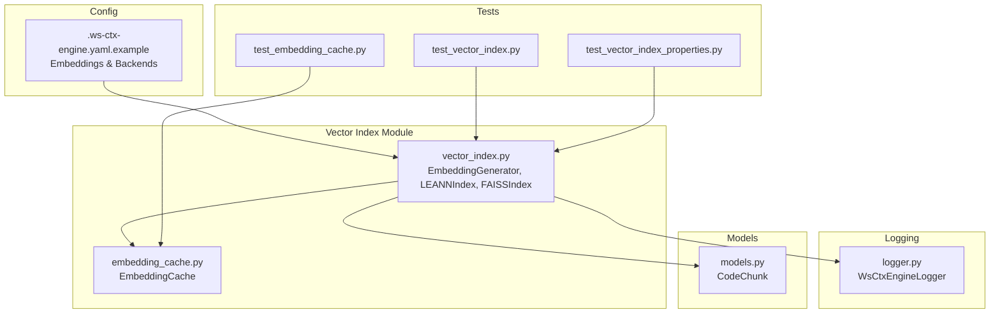
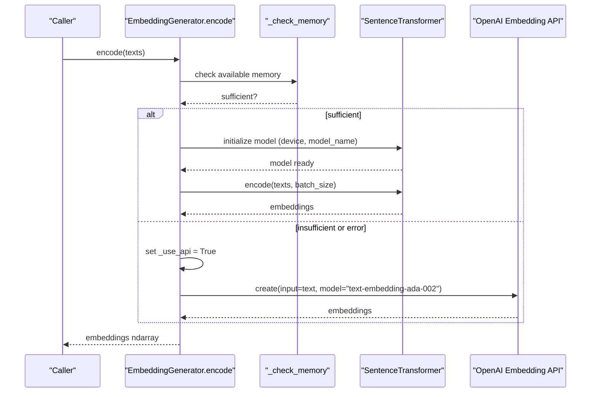
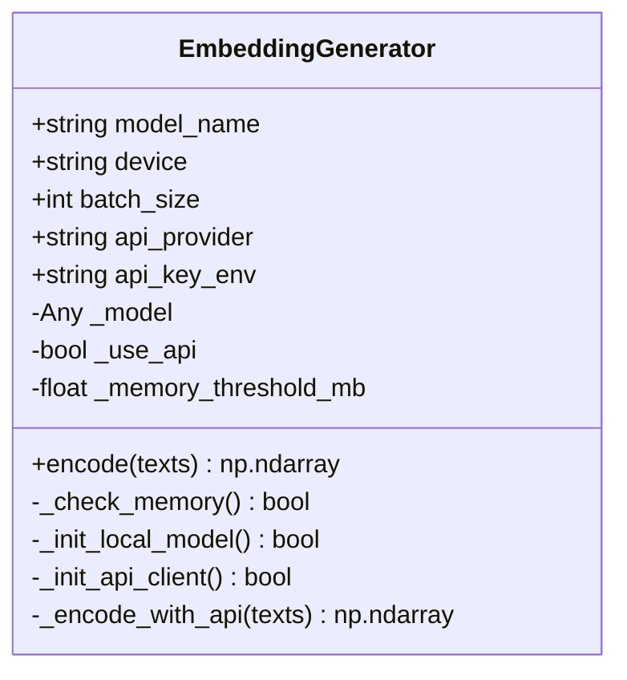
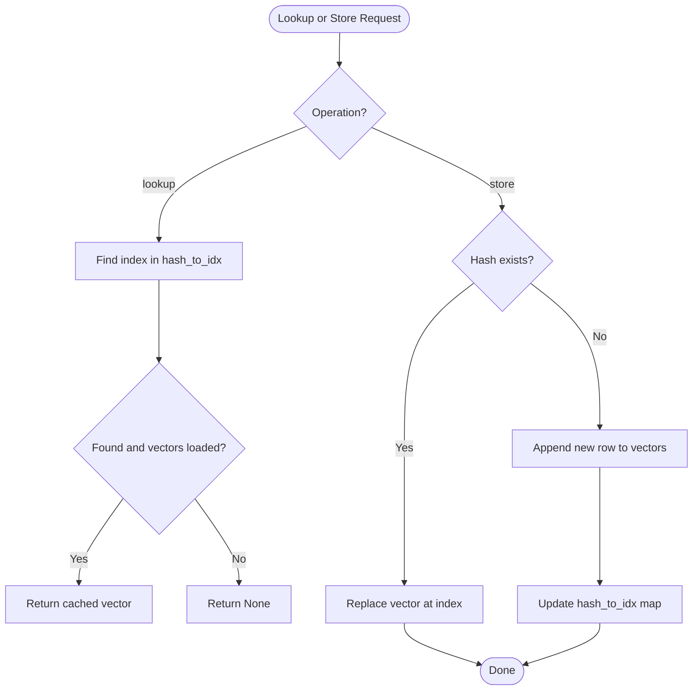
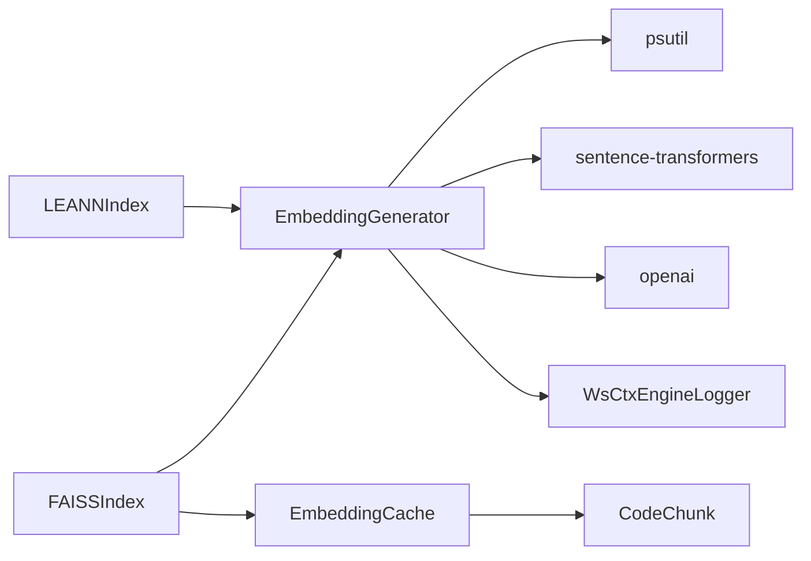

# Embedding Generation System

<cite>
**Referenced Files in This Document**
- [vector_index.py](file://src/ws_ctx_engine/vector_index/vector_index.py)
- [embedding_cache.py](file://src/ws_ctx_engine/vector_index/embedding_cache.py)
- [logger.py](file://src/ws_ctx_engine/logger/logger.py)
- [models.py](file://src/ws_ctx_engine/models/models.py)
- [.ws-ctx-engine.yaml.example](file://.ws-ctx-engine.yaml.example)
- [test_embedding_cache.py](file://tests/unit/test_embedding_cache.py)
- [test_vector_index.py](file://tests/unit/test_vector_index.py)
- [test_vector_index_properties.py](file://tests/property/test_vector_index_properties.py)
</cite>

## Table of Contents
1. [Introduction](#introduction)
2. [Project Structure](#project-structure)
3. [Core Components](#core-components)
4. [Architecture Overview](#architecture-overview)
5. [Detailed Component Analysis](#detailed-component-analysis)
6. [Dependency Analysis](#dependency-analysis)
7. [Performance Considerations](#performance-considerations)
8. [Troubleshooting Guide](#troubleshooting-guide)
9. [Conclusion](#conclusion)

## Introduction
This document explains the embedding generation system used for semantic search over code chunks. It focuses on the EmbeddingGenerator class that implements a dual-path architecture:
- Local path using sentence-transformers for offline, deterministic embeddings
- API fallback using OpenAI for scenarios where local resources are insufficient

It covers automatic memory detection, API fallback mechanisms, batch processing, device selection (CPU/CUDA/MPS), error handling, and the integration of an embedding cache for performance optimization. It also documents configuration options, environment variables, and troubleshooting steps for common embedding generation issues.

## Project Structure
The embedding generation system spans several modules:
- EmbeddingGenerator and vector index implementations live in the vector_index module
- An embedding cache persists content-hash → embedding mappings to avoid re-encoding unchanged content
- A structured logger records operational events and fallback decisions
- Configuration is driven by a YAML example file that defines embedding model, device, batch size, and API settings
- Tests validate cache behavior, memory checks, and fallback logic

**Diagram sources**
- [vector_index.py:96-280](file://src/ws_ctx_engine/vector_index/vector_index.py#L96-L280)
- [embedding_cache.py:28-127](file://src/ws_ctx_engine/vector_index/embedding_cache.py#L28-L127)
- [logger.py:13-145](file://src/ws_ctx_engine/logger/logger.py#L13-L145)
- [models.py:10-58](file://src/ws_ctx_engine/models/models.py#L10-L58)
- [.ws-ctx-engine.yaml.example:119-162](file://.ws-ctx-engine.yaml.example#L119-L162)
- [test_embedding_cache.py:1-111](file://tests/unit/test_embedding_cache.py#L1-L111)
- [test_vector_index.py:64-93](file://tests/unit/test_vector_index.py#L64-L93)
- [test_vector_index_properties.py:232-295](file://tests/property/test_vector_index_properties.py#L232-L295)

**Section sources**
- [vector_index.py:1-120](file://src/ws_ctx_engine/vector_index/vector_index.py#L1-L120)
- [embedding_cache.py:1-127](file://src/ws_ctx_engine/vector_index/embedding_cache.py#L1-L127)
- [logger.py:1-145](file://src/ws_ctx_engine/logger/logger.py#L1-L145)
- [.ws-ctx-engine.yaml.example:119-162](file://.ws-ctx-engine.yaml.example#L119-L162)

## Core Components
- EmbeddingGenerator: Dual-path encoder with memory-aware local initialization and OpenAI API fallback
- EmbeddingCache: Disk-backed cache keyed by SHA-256 content hash for unchanged content reuse
- WsCtxEngineLogger: Structured logging with console and file outputs, including fallback logging
- CodeChunk: Data model representing parsed code segments with metadata used by index builders

Key responsibilities:
- Automatic memory detection to decide whether to initialize a local model
- Batched encoding with configurable batch size
- Device selection for local model (cpu/cuda/mps)
- API client setup and per-request embedding generation
- Error handling and graceful fallback to API
- Integration with FAISSIndex and LEANNIndex for incremental and batched embedding workflows

**Section sources**
- [vector_index.py: EmbeddingGenerator:96-280](file://src/ws_ctx_engine/vector_index/vector_index.py#L96-L280)
- [embedding_cache.py: EmbeddingCache:28-127](file://src/ws_ctx_engine/vector_index/embedding_cache.py#L28-L127)
- [logger.py: WsCtxEngineLogger:13-145](file://src/ws_ctx_engine/logger/logger.py#L13-L145)
- [models.py: CodeChunk:10-58](file://src/ws_ctx_engine/models/models.py#L10-L58)

## Architecture Overview
The embedding pipeline integrates local and API paths with cache reuse and robust error handling.

**Diagram sources**
- [vector_index.py: EmbeddingGenerator.encode:199-251](file://src/ws_ctx_engine/vector_index/vector_index.py#L199-L251)
- [vector_index.py: _encode_with_api:253-279](file://src/ws_ctx_engine/vector_index/vector_index.py#L253-L279)

## Detailed Component Analysis

### EmbeddingGenerator
Dual-path architecture with memory-aware local initialization and OpenAI API fallback.

- Initialization parameters:
  - model_name: sentence-transformers model identifier
  - device: target device for local inference
  - batch_size: batching for local encoding
  - api_provider: provider identifier for fallback
  - api_key_env: environment variable name for API key

- Memory monitoring:
  - Periodically checks available memory and decides whether to initialize the local model
  - Threshold is configured internally; low memory triggers skipping local initialization

- Local model initialization:
  - Attempts to import sentence-transformers and construct a model on the specified device
  - Handles ImportError, MemoryError, and generic exceptions by falling back to API

- Encoding workflow:
  - If not using API, attempts local encoding; on MemoryError or other failures, logs a fallback event and switches to API
  - On low memory during encoding, frees the model and switches to API
  - Returns numpy array of embeddings

- API client setup:
  - Reads API key from environment variable
  - Initializes client and performs per-text embedding requests
  - Raises runtime errors on initialization or request failures

- Error handling:
  - Logs warnings and fallback events via the structured logger
  - Ensures graceful degradation to API when local path fails

**Diagram sources**
- [vector_index.py: EmbeddingGenerator:96-280](file://src/ws_ctx_engine/vector_index/vector_index.py#L96-L280)

**Section sources**
- [vector_index.py: EmbeddingGenerator.__init__:102-128](file://src/ws_ctx_engine/vector_index/vector_index.py#L102-L128)
- [vector_index.py: _check_memory:130-141](file://src/ws_ctx_engine/vector_index/vector_index.py#L130-L141)
- [vector_index.py: _init_local_model:143-172](file://src/ws_ctx_engine/vector_index/vector_index.py#L143-L172)
- [vector_index.py: _init_api_client:174-197](file://src/ws_ctx_engine/vector_index/vector_index.py#L174-L197)
- [vector_index.py: encode:199-251](file://src/ws_ctx_engine/vector_index/vector_index.py#L199-L251)
- [vector_index.py: _encode_with_api:253-279](file://src/ws_ctx_engine/vector_index/vector_index.py#L253-L279)

### EmbeddingCache
Disk-backed cache keyed by SHA-256 content hash to avoid re-embedding unchanged content.

- Storage layout:
  - embeddings.npy: numpy array of shape (N, embedding_dim)
  - embedding_index.json: {"hash_to_idx": {"<sha256>": <row_index>, ...}}

- Operations:
  - load(): restores cache from disk if present
  - save(): persists cache to disk
  - lookup(content_hash): returns cached vector or None
  - store(content_hash, vector): adds or updates a cached vector
  - content_hash(text): computes SHA-256 hex digest of text
  - size: number of cached entries

- Integration points:
  - FAISSIndex uses cache to skip re-embedding unchanged files
  - Incremental updates consult cache before invoking the encoder

**Diagram sources**
- [embedding_cache.py: EmbeddingCache:28-127](file://src/ws_ctx_engine/vector_index/embedding_cache.py#L28-L127)

**Section sources**
- [embedding_cache.py: EmbeddingCache:28-127](file://src/ws_ctx_engine/vector_index/embedding_cache.py#L28-L127)
- [test_embedding_cache.py: cache behavior:1-111](file://tests/unit/test_embedding_cache.py#L1-L111)

### VectorIndex Implementations and Integration
- LEANNIndex and FAISSIndex both depend on EmbeddingGenerator to produce embeddings for files.
- FAISSIndex optionally integrates EmbeddingCache to skip re-embedding unchanged files.
- Both implementations group chunks by file, combine content, and compute embeddings.

Key integration points:
- Building indexes initializes EmbeddingGenerator with configured model_name, device, and batch_size
- FAISSIndex’s cache-aware embedding builder computes content hashes and reuses cached vectors when available

**Section sources**
- [vector_index.py: LEANNIndex.build:310-362](file://src/ws_ctx_engine/vector_index/vector_index.py#L310-L362)
- [vector_index.py: FAISSIndex.build:564-646](file://src/ws_ctx_engine/vector_index/vector_index.py#L564-L646)
- [vector_index.py: FAISSIndex._build_embeddings_with_cache:539-562](file://src/ws_ctx_engine/vector_index/vector_index.py#L539-L562)

### Logger and Fallback Logging
- WsCtxEngineLogger provides structured logging with console and file outputs
- log_fallback(component, primary, fallback, reason) emits a standardized fallback record
- EmbeddingGenerator uses this to record memory-related and error-based fallbacks

**Section sources**
- [logger.py: WsCtxEngineLogger.log_fallback:64-77](file://src/ws_ctx_engine/logger/logger.py#L64-L77)
- [vector_index.py: encode fallback logging:235-240](file://src/ws_ctx_engine/vector_index/vector_index.py#L235-L240)

## Dependency Analysis
- EmbeddingGenerator depends on:
  - psutil for memory checks
  - sentence-transformers for local embeddings (optional)
  - openai for API embeddings (optional)
  - WsCtxEngineLogger for structured logging
- EmbeddingCache is used by FAISSIndex and incremental update routines
- CodeChunk is consumed by index builders to form file-level texts

**Diagram sources**
- [vector_index.py:130-197](file://src/ws_ctx_engine/vector_index/vector_index.py#L130-L197)
- [embedding_cache.py:28-127](file://src/ws_ctx_engine/vector_index/embedding_cache.py#L28-L127)
- [models.py:10-58](file://src/ws_ctx_engine/models/models.py#L10-L58)

**Section sources**
- [vector_index.py: imports and usage:9-18](file://src/ws_ctx_engine/vector_index/vector_index.py#L9-L18)
- [embedding_cache.py: usage in FAISSIndex:539-562](file://src/ws_ctx_engine/vector_index/vector_index.py#L539-L562)

## Performance Considerations
- Batch size tuning:
  - Larger batches increase throughput but consume more memory; adjust based on device capacity
- Device selection:
  - Use CUDA or MPS for GPU acceleration when available; otherwise CPU for portability
- Memory monitoring:
  - Low memory triggers API fallback; monitor available memory to avoid OOM
- Cache utilization:
  - Enable embedding cache to avoid re-encoding unchanged files across runs
- Incremental updates:
  - FAISSIndex supports incremental removal/addition with cache-aware embedding to minimize rebuild costs

[No sources needed since this section provides general guidance]

## Troubleshooting Guide
Common issues and resolutions:

- Out of memory during local model initialization:
  - Symptom: MemoryError or warning indicating insufficient memory
  - Resolution: Switch to API fallback by ensuring OPENAI_API_KEY is set; reduce batch size; use CPU instead of GPU

- API key not found:
  - Symptom: Error indicating missing API key environment variable
  - Resolution: Set the environment variable (default name is OPENAI_API_KEY) before running

- API client initialization failure:
  - Symptom: Error initializing the OpenAI client
  - Resolution: Verify openai package installation and correct API key

- Local encoding failures:
  - Symptom: Exceptions during local encoding lead to fallback logging
  - Resolution: Check model availability, device compatibility, and memory conditions

- Cache persistence issues:
  - Symptom: Cache load/save warnings
  - Resolution: Ensure write permissions to cache directory and validate JSON/index file integrity

Validation references:
- Memory checks and fallback behavior are covered by unit and property tests
- Cache correctness validated by dedicated unit tests

**Section sources**
- [vector_index.py: _init_api_client error handling:183-197](file://src/ws_ctx_engine/vector_index/vector_index.py#L183-L197)
- [vector_index.py: encode fallback paths:234-245](file://src/ws_ctx_engine/vector_index/vector_index.py#L234-L245)
- [test_vector_index.py: memory and encode tests:76-93](file://tests/unit/test_vector_index.py#L76-L93)
- [test_vector_index_properties.py: fallback on OOM and low memory:243-295](file://tests/property/test_vector_index_properties.py#L243-L295)
- [test_embedding_cache.py: persistence and lookup:67-111](file://tests/unit/test_embedding_cache.py#L67-L111)

## Conclusion
The embedding generation system provides a resilient, performance-oriented pipeline:
- It prefers local sentence-transformers for speed and determinism
- It automatically falls back to OpenAI API when local resources are constrained
- It integrates a disk-backed cache keyed by content hash to accelerate incremental builds
- It offers configurable batch sizes, device selection, and robust error handling with structured logging

By tuning configuration parameters and leveraging the cache, teams can achieve efficient, scalable semantic search over codebases while maintaining reliability across diverse environments.