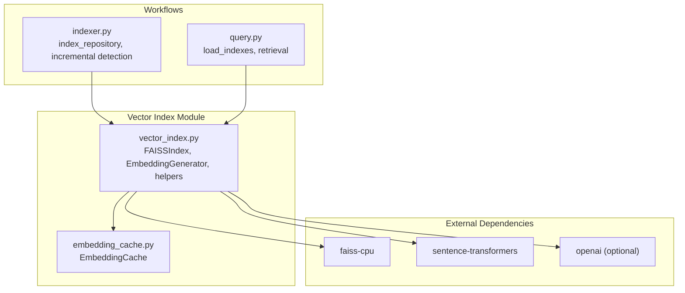
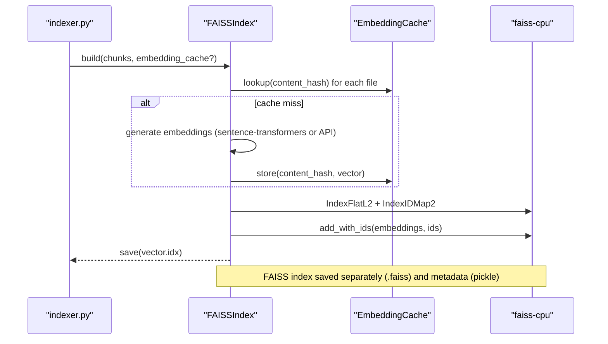
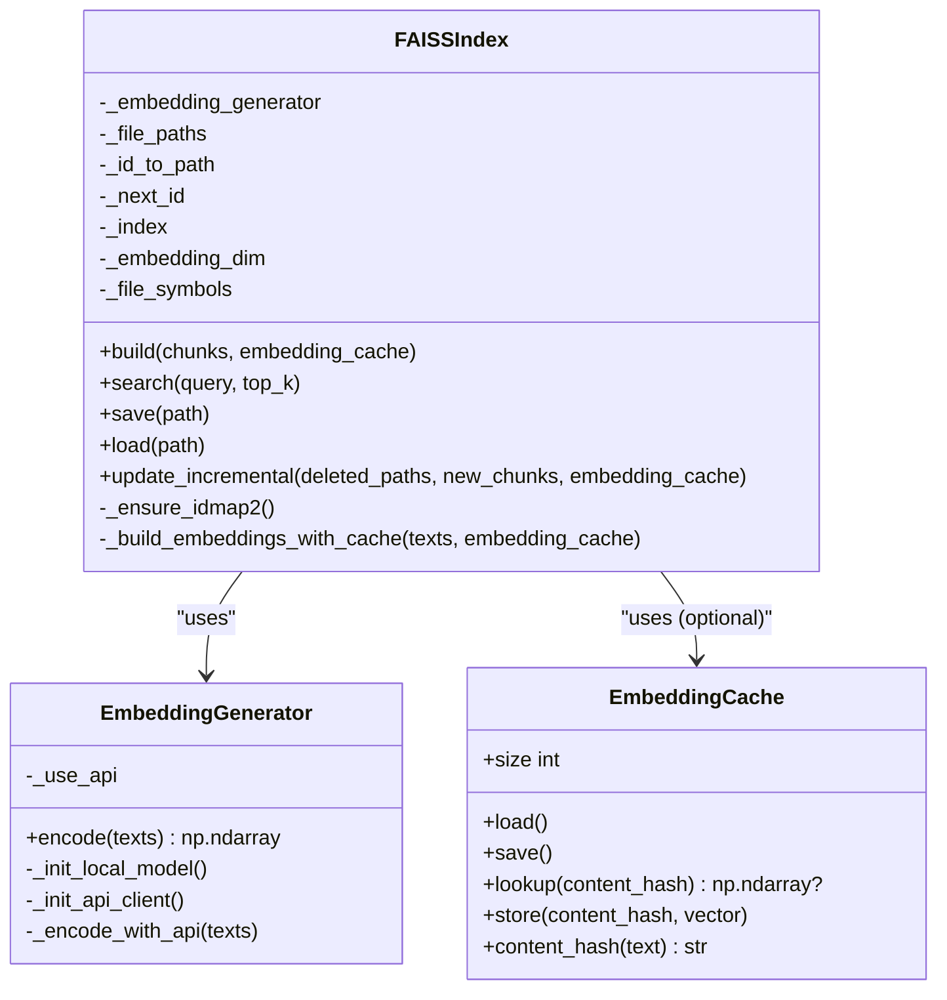
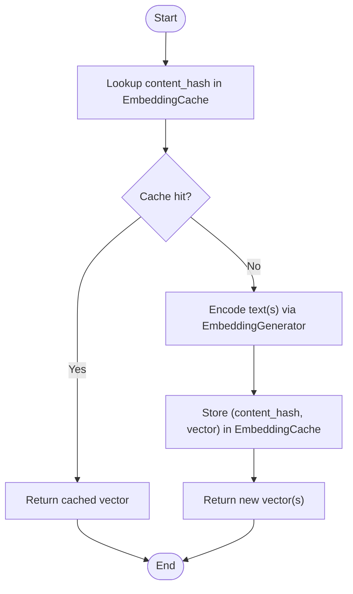
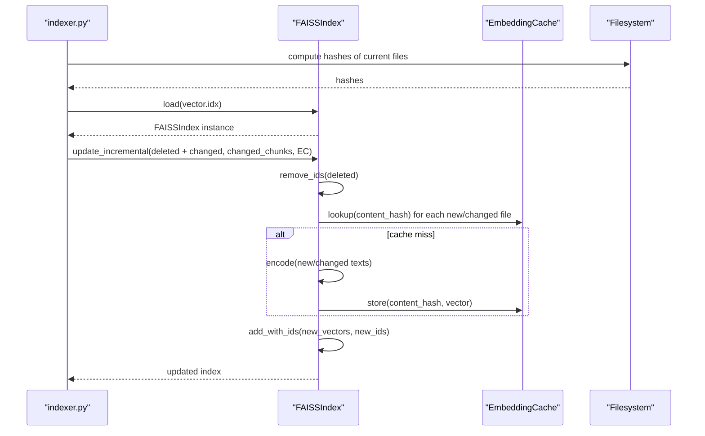
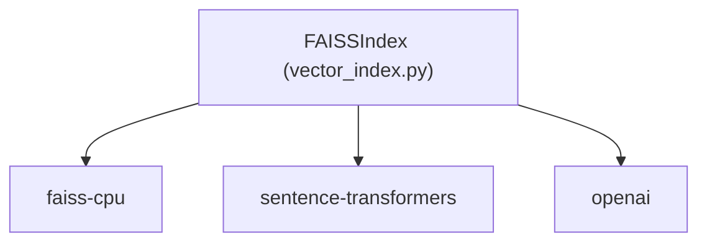

# FAISS Backend

<cite>
**Referenced Files in This Document**
- [vector_index.py](file://src/ws_ctx_engine/vector_index/vector_index.py)
- [embedding_cache.py](file://src/ws_ctx_engine/vector_index/embedding_cache.py)
- [indexer.py](file://src/ws_ctx_engine/workflow/indexer.py)
- [query.py](file://src/ws_ctx_engine/workflow/query.py)
- [pyproject.toml](file://pyproject.toml)
- [test_performance_benchmarks.py](file://tests/test_performance_benchmarks.py)
</cite>

## Table of Contents
1. [Introduction](#introduction)
2. [Project Structure](#project-structure)
3. [Core Components](#core-components)
4. [Architecture Overview](#architecture-overview)
5. [Detailed Component Analysis](#detailed-component-analysis)
6. [Dependency Analysis](#dependency-analysis)
7. [Performance Considerations](#performance-considerations)
8. [Troubleshooting Guide](#troubleshooting-guide)
9. [Conclusion](#conclusion)
10. [Appendices](#appendices)

## Introduction
This document explains the FAISS backend implementation used as a fallback vector index in the system. It focuses on:
- The FAISSIndex class and its IndexFlatL2 wrapper with IndexIDMap2 for incremental updates without index migration.
- Embedding generation and caching to avoid re-embedding unchanged files.
- Save/load mechanics for separate FAISS index files and metadata.
- Installation requirements, performance characteristics, scalability expectations for repositories up to 50k files, and backward compatibility including auto-migration from legacy index types.

## Project Structure
The FAISS backend lives in the vector index module and integrates with the indexing and query workflows:
- FAISSIndex implementation and helpers are in the vector index module.
- Embedding cache is a standalone component that accelerates incremental rebuilds.
- The indexing workflow orchestrates FAISSIndex usage, embedding cache, and incremental updates.
- The query workflow loads persisted indexes and executes retrieval.

**Diagram sources**
- [vector_index.py](file://src/ws_ctx_engine/vector_index/vector_index.py)
- [embedding_cache.py](file://src/ws_ctx_engine/vector_index/embedding_cache.py)
- [indexer.py](file://src/ws_ctx_engine/workflow/indexer.py)
- [query.py](file://src/ws_ctx_engine/workflow/query.py)

**Section sources**
- [vector_index.py](file://src/ws_ctx_engine/vector_index/vector_index.py)
- [embedding_cache.py](file://src/ws_ctx_engine/vector_index/embedding_cache.py)
- [indexer.py](file://src/ws_ctx_engine/workflow/indexer.py)
- [query.py](file://src/ws_ctx_engine/workflow/query.py)

## Core Components
- FAISSIndex: Implements VectorIndex using FAISS IndexFlatL2 wrapped in IndexIDMap2 to enable incremental updates without rebuilding the index.
- EmbeddingGenerator: Provides embeddings via sentence-transformers with a local fallback to OpenAI API when needed.
- EmbeddingCache: Disk-backed cache keyed by content hash to avoid re-embedding unchanged files during incremental rebuilds.
- Indexing workflow: Builds or updates the FAISS index, optionally using the embedding cache and incremental update path.
- Query workflow: Loads persisted indexes and performs retrieval.

Key implementation highlights:
- FAISSIndex.build constructs IndexFlatL2 and wraps it with IndexIDMap2, then populates it with add_with_ids and maintains an authoritative ID-to-path mapping.
- FAISSIndex.search converts L2 distances to similarity scores and resolves file paths via the ID-to-path mapping.
- FAISSIndex.save writes the FAISS index to a .faiss file and metadata (including id_to_path and next_id) to a pickle file.
- FAISSIndex.load reads the FAISS index and metadata, auto-migrates legacy indexes to IndexIDMap2, and restores the ID-to-path mapping.
- EmbeddingCache persists content hash → vector mappings to accelerate incremental rebuilds.
- Indexing workflow detects changed/deleted files and invokes FAISSIndex.update_incremental to remove and add vectors atomically.

**Section sources**
- [vector_index.py](file://src/ws_ctx_engine/vector_index/vector_index.py)
- [embedding_cache.py](file://src/ws_ctx_engine/vector_index/embedding_cache.py)
- [indexer.py](file://src/ws_ctx_engine/workflow/indexer.py)

## Architecture Overview
The FAISS backend participates in a layered architecture:
- Workflow layer: index_repository and query_and_pack orchestrate parsing, indexing, retrieval, and packing.
- Vector index layer: FAISSIndex and EmbeddingCache provide embedding generation and vector storage.
- External libraries: FAISS for brute-force exact search, sentence-transformers for local embeddings, and optional OpenAI API.

**Diagram sources**
- [indexer.py](file://src/ws_ctx_engine/workflow/indexer.py)
- [vector_index.py](file://src/ws_ctx_engine/vector_index/vector_index.py)
- [embedding_cache.py](file://src/ws_ctx_engine/vector_index/embedding_cache.py)

**Section sources**
- [indexer.py](file://src/ws_ctx_engine/workflow/indexer.py)
- [vector_index.py](file://src/ws_ctx_engine/vector_index/vector_index.py)

## Detailed Component Analysis

### FAISSIndex: IndexFlatL2 with IndexIDMap2 for Incremental Updates
FAISSIndex uses IndexFlatL2 (exact brute-force search) wrapped in IndexIDMap2 to support removing and adding vectors by ID without full rebuilds. The class maintains:
- An embedding generator for text-to-vector conversion.
- An authoritative ID-to-path mapping to resolve file paths reliably after deletions.
- A monotonic next_id counter to assign fresh IDs for new vectors.

Key behaviors:
- build: Groups chunks by file, generates embeddings (using cache when provided), constructs IndexFlatL2, wraps with IndexIDMap2, and populates via add_with_ids. Stores id_to_path and next_id.
- search: Encodes the query, performs FAISS search, converts L2 distances to similarity scores, and resolves paths via id_to_path.
- save/load: Writes/reads FAISS index to a .faiss file and metadata (including id_to_path, next_id, embedding_dim) to a pickle file. On load, migrates legacy indexes to IndexIDMap2 and restores id_to_path safely.
- update_incremental: Removes vectors for deleted/changed files using the authoritative id_to_path mapping, then adds new/changed vectors with fresh IDs, updating id_to_path and next_id accordingly.

**Diagram sources**
- [vector_index.py](file://src/ws_ctx_engine/vector_index/vector_index.py)
- [embedding_cache.py](file://src/ws_ctx_engine/vector_index/embedding_cache.py)

**Section sources**
- [vector_index.py](file://src/ws_ctx_engine/vector_index/vector_index.py)

### Embedding Generation and Caching (H-3)
EmbeddingGenerator:
- Attempts local sentence-transformers model first; falls back to OpenAI API on memory errors or unavailability.
- Uses a memory threshold to decide whether to initialize the local model.

EmbeddingCache:
- Persists content hash → vector mappings to accelerate incremental rebuilds.
- Uses SHA-256 of concatenated chunk content per file as the content hash to invalidate cache on any content change.
- Stores vectors in a contiguous numpy array and a JSON index mapping hash to row index.

Integration:
- FAISSIndex.build consults EmbeddingCache to skip re-embedding unchanged files.
- FAISSIndex.update_incremental similarly checks cache for new/changed files before encoding.

**Diagram sources**
- [vector_index.py](file://src/ws_ctx_engine/vector_index/vector_index.py)
- [embedding_cache.py](file://src/ws_ctx_engine/vector_index/embedding_cache.py)

**Section sources**
- [vector_index.py](file://src/ws_ctx_engine/vector_index/vector_index.py)
- [embedding_cache.py](file://src/ws_ctx_engine/vector_index/embedding_cache.py)

### ID-to-Path Mapping System (H-1)
The FAISS index internally assigns integer IDs to vectors. After deletions, these IDs may no longer align with list positions. FAISSIndex maintains an authoritative id_to_path mapping:
- During build: id_to_path maps initial integer IDs to file paths.
- During incremental updates: id_to_path is updated to reflect deletions and new IDs assigned to added files.
- During search: FAISS returns integer IDs; FAISSIndex resolves them to file paths via id_to_path.

Fallback behavior:
- If id_to_path is missing in saved metadata (legacy indexes), FAISSIndex derives it from _file_paths and sets next_id accordingly.

**Section sources**
- [vector_index.py](file://src/ws_ctx_engine/vector_index/vector_index.py)

### Save/Load Process and Backward Compatibility
Save:
- FAISS index is written to path + ".faiss".
- Metadata (backend type, model/device/batch settings, file_paths, embedding_dim, file_symbols, id_to_path, next_id) is pickled to path.

Load:
- Metadata is unpickled; backend type is validated.
- FAISS index is read from path + ".faiss".
- Legacy indexes are migrated to IndexIDMap2 via _ensure_idmap2 if needed.
- id_to_path is restored; if missing, derived from _file_paths.

Auto-migration:
- _ensure_idmap2 wraps non-IDMap indexes with IndexIDMap2 when supported (flat-family indices that support reconstruct()).

**Section sources**
- [vector_index.py](file://src/ws_ctx_engine/vector_index/vector_index.py)

### Incremental Update Workflow
The indexing workflow orchestrates incremental updates:
- Detects changed/deleted files by comparing stored hashes with current disk state.
- Loads the existing FAISS index and calls update_incremental with deleted and changed files.
- update_incremental removes deleted/changed vectors by ID, then adds new/changed vectors with fresh IDs, updating id_to_path and next_id.

**Diagram sources**
- [indexer.py](file://src/ws_ctx_engine/workflow/indexer.py)
- [vector_index.py](file://src/ws_ctx_engine/vector_index/vector_index.py)
- [embedding_cache.py](file://src/ws_ctx_engine/vector_index/embedding_cache.py)

**Section sources**
- [indexer.py](file://src/ws_ctx_engine/workflow/indexer.py)
- [vector_index.py](file://src/ws_ctx_engine/vector_index/vector_index.py)

## Dependency Analysis
External dependencies required by FAISSIndex:
- faiss-cpu: Provides IndexFlatL2 and IndexIDMap2 for exact brute-force search with ID mapping.
- sentence-transformers: Provides local embedding generation.
- openai (optional): Provides API fallback for embeddings when local model fails or memory-constrained.

Optional extras in pyproject.toml:
- fast: includes faiss-cpu and scikit-learn.
- full/all: includes faiss-cpu, sentence-transformers, torch, and leann.

**Diagram sources**
- [vector_index.py](file://src/ws_ctx_engine/vector_index/vector_index.py)
- [pyproject.toml](file://pyproject.toml)

**Section sources**
- [pyproject.toml](file://pyproject.toml)
- [vector_index.py](file://src/ws_ctx_engine/vector_index/vector_index.py)

## Performance Considerations
- FAISSIndex uses IndexFlatL2 (exact brute-force) with IndexIDMap2, suitable for repositories up to approximately 50k files as noted in the implementation comments.
- EmbeddingCache avoids re-embedding unchanged files, reducing CPU time and API costs during incremental rebuilds.
- Memory usage is tracked via psutil integration in the broader system; embedding generation attempts to avoid OOM by falling back to API when memory is low.
- Performance targets observed in tests:
  - Indexing: <300s for 10k files with primary backends; <600s with fallback backends (FAISS + NetworkX).
  - Query: <10s with primary backends; <15s with fallback backends.

Recommendations:
- Enable embedding cache for incremental rebuilds to reduce embedding overhead.
- Prefer local sentence-transformers when memory allows; otherwise rely on API fallback.
- Monitor memory usage and adjust batch sizes or device settings as needed.

**Section sources**
- [vector_index.py](file://src/ws_ctx_engine/vector_index/vector_index.py)
- [test_performance_benchmarks.py](file://tests/test_performance_benchmarks.py)

## Troubleshooting Guide
Common issues and resolutions:
- faiss-cpu not installed: FAISSIndex.build raises a runtime error instructing to install faiss-cpu. Install via optional extras or directly.
- Low memory during embedding: EmbeddingGenerator falls back to API; ensure API key is configured if using API fallback.
- Legacy index without ID mapping: FAISSIndex.load auto-migrates legacy indexes to IndexIDMap2; id_to_path is restored from file_paths if missing.
- Incremental update failures: The indexing workflow falls back to a full rebuild if incremental update fails.
- Search returns unexpected results: Ensure id_to_path is intact; FAISSIndex.search relies on this mapping to resolve file paths after deletions.

**Section sources**
- [vector_index.py](file://src/ws_ctx_engine/vector_index/vector_index.py)
- [indexer.py](file://src/ws_ctx_engine/workflow/indexer.py)

## Conclusion
The FAISS backend provides a robust, incremental-capable vector index using IndexFlatL2 wrapped in IndexIDMap2. It integrates tightly with embedding generation and a persistent embedding cache to minimize redundant computation. The save/load mechanism separates the FAISS index from metadata, enabling straightforward persistence and migration. With proper configuration and caching, FAISSIndex scales effectively for repositories up to 50k files and offers predictable performance targets.

## Appendices

### Installation Requirements
- Core dependency: faiss-cpu for FAISSIndex.
- Optional extras:
  - fast: includes faiss-cpu and scikit-learn.
  - full/all: includes faiss-cpu, sentence-transformers, torch, and leann.

**Section sources**
- [pyproject.toml](file://pyproject.toml)

### Scalability Limits and Benchmarks
- FAISSIndex is documented as suitable for repositories up to ~50k files.
- Observed performance targets:
  - Indexing: <300s (primary backends), <600s (fallback backends).
  - Query: <10s (primary backends), <15s (fallback backends).

**Section sources**
- [vector_index.py](file://src/ws_ctx_engine/vector_index/vector_index.py)
- [test_performance_benchmarks.py](file://tests/test_performance_benchmarks.py)