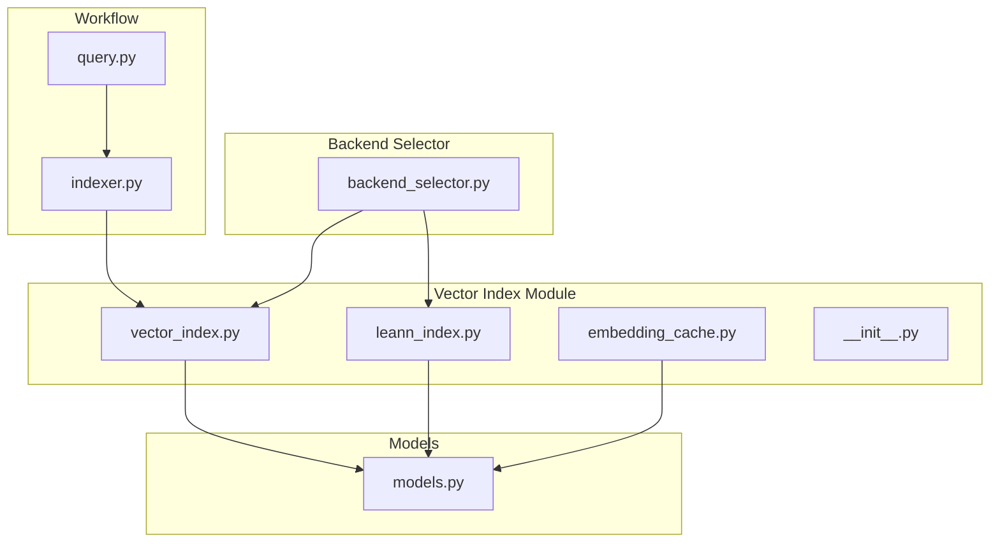
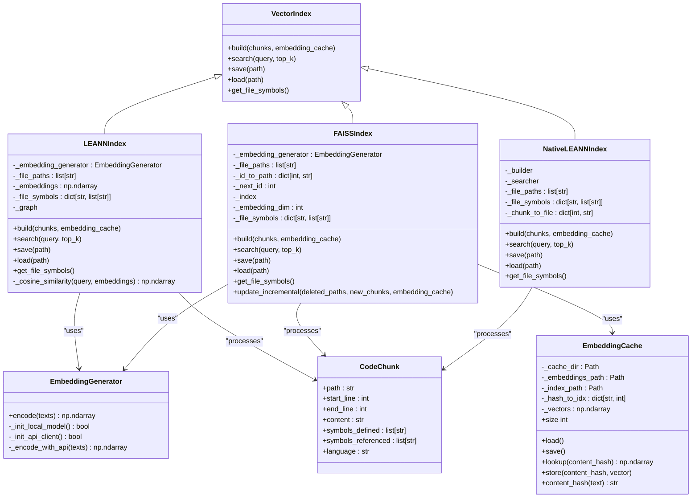
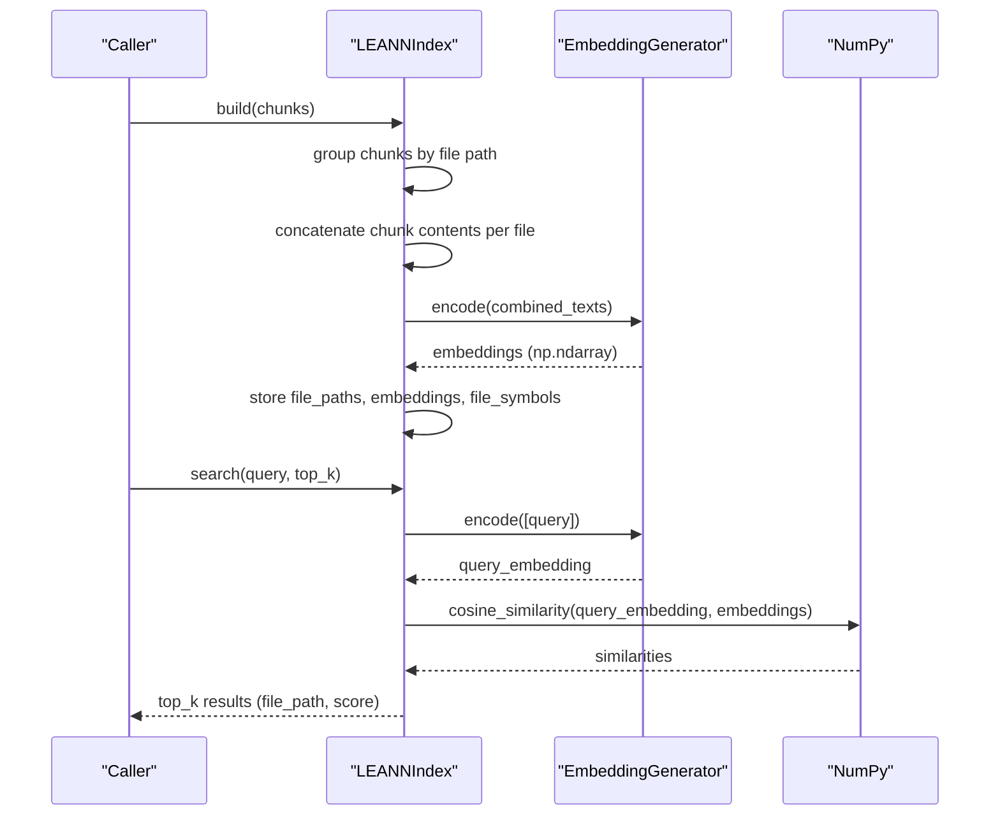
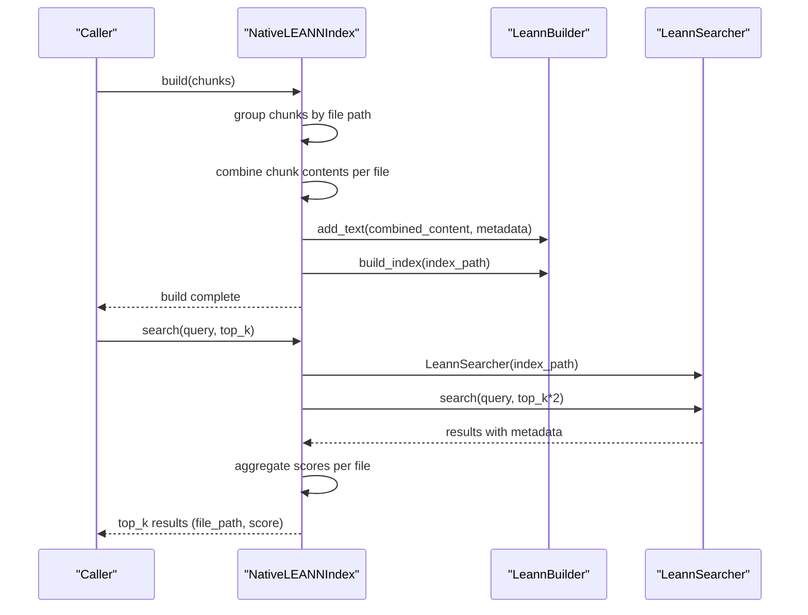
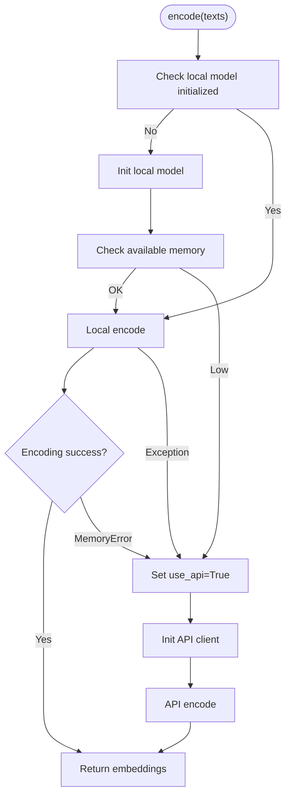
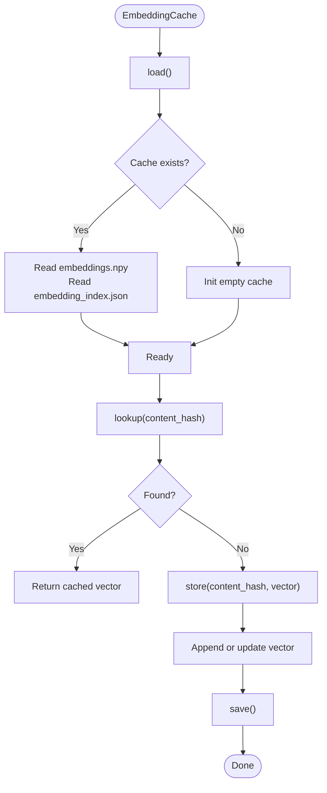
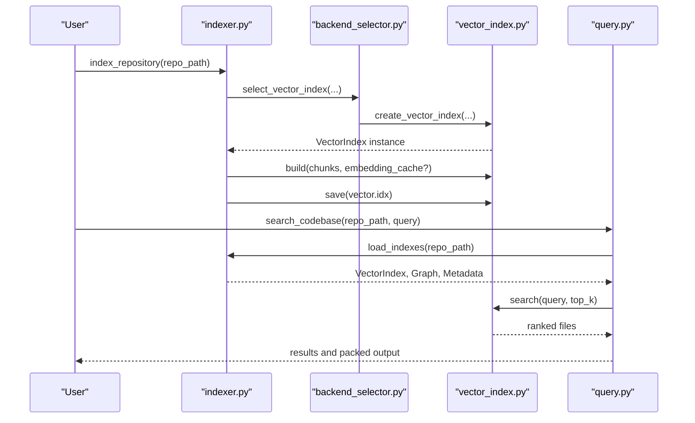
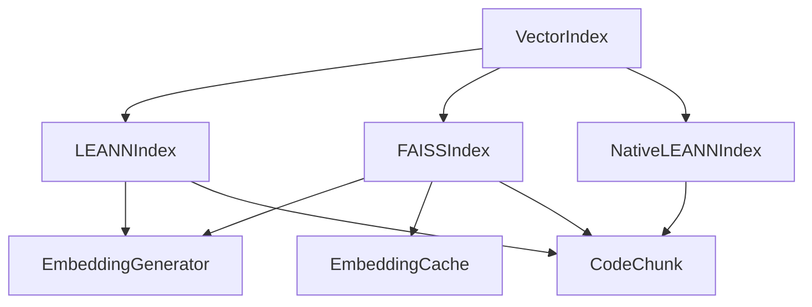

# LEANN Implementation

<cite>
**Referenced Files in This Document**
- [leann_index.py](file://src/ws_ctx_engine/vector_index/leann_index.py)
- [vector_index.py](file://src/ws_ctx_engine/vector_index/vector_index.py)
- [embedding_cache.py](file://src/ws_ctx_engine/vector_index/embedding_cache.py)
- [__init__.py](file://src/ws_ctx_engine/vector_index/__init__.py)
- [models.py](file://src/ws_ctx_engine/models/models.py)
- [indexer.py](file://src/ws_ctx_engine/workflow/indexer.py)
- [query.py](file://src/ws_ctx_engine/workflow/query.py)
- [backend_selector.py](file://src/ws_ctx_engine/backend_selector/backend_selector.py)
- [vector-index.md](file://docs/reference/vector-index.md)
- [leann.md](file://docs/development/research/leann.md)
- [performance.md](file://docs/guides/performance.md)
</cite>

## Table of Contents
1. [Introduction](#introduction)
2. [Project Structure](#project-structure)
3. [Core Components](#core-components)
4. [Architecture Overview](#architecture-overview)
5. [Detailed Component Analysis](#detailed-component-analysis)
6. [Dependency Analysis](#dependency-analysis)
7. [Performance Considerations](#performance-considerations)
8. [Troubleshooting Guide](#troubleshooting-guide)
9. [Conclusion](#conclusion)
10. [Appendices](#appendices)

## Introduction
This document explains the LEANN (Locality Enhanced Approximate Nearest Neighbor) implementation in the codebase, focusing on the graph-based approach that achieves 97% storage savings by storing only a subset of vectors and recomputing others on-the-fly. It documents the LEANNIndex class architecture, embedding generation, cosine similarity computation, and file symbol tracking. It also covers the build process for grouping chunks by file path, combining chunk contents, and generating embeddings; the search algorithm using cosine similarity; and the save/load mechanisms with pickle serialization. Finally, it compares the simplified graph storage approach to the native LEANN library and outlines future enhancements.

## Project Structure
The LEANN implementation resides in the vector index module and integrates with the broader indexing and querying workflows.

**Diagram sources**
- [vector_index.py:1-1120](file://src/ws_ctx_engine/vector_index/vector_index.py#L1-L1120)
- [leann_index.py:1-297](file://src/ws_ctx_engine/vector_index/leann_index.py#L1-L297)
- [embedding_cache.py:1-127](file://src/ws_ctx_engine/vector_index/embedding_cache.py#L1-L127)
- [models.py:1-152](file://src/ws_ctx_engine/models/models.py#L1-L152)
- [indexer.py:1-493](file://src/ws_ctx_engine/workflow/indexer.py#L1-L493)
- [query.py:1-617](file://src/ws_ctx_engine/workflow/query.py#L1-L617)
- [backend_selector.py:1-191](file://src/ws_ctx_engine/backend_selector/backend_selector.py#L1-L191)

**Section sources**
- [vector_index.py:1-1120](file://src/ws_ctx_engine/vector_index/vector_index.py#L1-L1120)
- [leann_index.py:1-297](file://src/ws_ctx_engine/vector_index/leann_index.py#L1-L297)
- [embedding_cache.py:1-127](file://src/ws_ctx_engine/vector_index/embedding_cache.py#L1-L127)
- [models.py:1-152](file://src/ws_ctx_engine/models/models.py#L1-L152)
- [indexer.py:1-493](file://src/ws_ctx_engine/workflow/indexer.py#L1-L493)
- [query.py:1-617](file://src/ws_ctx_engine/workflow/query.py#L1-L617)
- [backend_selector.py:1-191](file://src/ws_ctx_engine/backend_selector/backend_selector.py#L1-L191)

## Core Components
- VectorIndex: Abstract base class defining the interface for vector index implementations.
- EmbeddingGenerator: Generates embeddings using local sentence-transformers or falls back to OpenAI API.
- LEANNIndex: Cosine similarity-based implementation that stores all embeddings for file-level grouping.
- FAISSIndex: Fallback backend using FAISS with IndexFlatL2 wrapped in IndexIDMap2.
- NativeLEANNIndex: Production implementation using the actual LEANN library with graph-based selective recomputation.
- EmbeddingCache: Disk-backed cache for incremental indexing to avoid re-embedding unchanged files.
- CodeChunk: Data model representing parsed code segments with metadata.

**Section sources**
- [vector_index.py:21-84](file://src/ws_ctx_engine/vector_index/vector_index.py#L21-L84)
- [vector_index.py:96-280](file://src/ws_ctx_engine/vector_index/vector_index.py#L96-L280)
- [vector_index.py:282-504](file://src/ws_ctx_engine/vector_index/vector_index.py#L282-L504)
- [vector_index.py:506-962](file://src/ws_ctx_engine/vector_index/vector_index.py#L506-L962)
- [leann_index.py:20-297](file://src/ws_ctx_engine/vector_index/leann_index.py#L20-L297)
- [embedding_cache.py:28-127](file://src/ws_ctx_engine/vector_index/embedding_cache.py#L28-L127)
- [models.py:10-85](file://src/ws_ctx_engine/models/models.py#L10-L85)

## Architecture Overview
The vector index architecture provides multiple backends with automatic fallback. The LEANN implementation supports two primary modes:
- LEANNIndex (cosine similarity): Stores all embeddings and computes cosine similarity for search.
- NativeLEANNIndex (graph-based): Uses the LEANN library for selective recomputation and reduced storage.

**Diagram sources**
- [vector_index.py:21-962](file://src/ws_ctx_engine/vector_index/vector_index.py#L21-L962)
- [leann_index.py:20-297](file://src/ws_ctx_engine/vector_index/leann_index.py#L20-L297)
- [embedding_cache.py:28-127](file://src/ws_ctx_engine/vector_index/embedding_cache.py#L28-L127)
- [models.py:10-85](file://src/ws_ctx_engine/models/models.py#L10-L85)

## Detailed Component Analysis

### LEANNIndex (Cosine Similarity)
LEANNIndex implements a simplified graph storage approach by storing all embeddings for file-level grouping. It groups chunks by file path, concatenates chunk contents, generates embeddings, and computes cosine similarity for search.

Key behaviors:
- Groups chunks by file path and concatenates content per file.
- Builds a file → symbols mapping for symbol boost.
- Computes cosine similarity using normalized vectors.
- Persists metadata and embeddings via pickle.

**Diagram sources**
- [vector_index.py:310-424](file://src/ws_ctx_engine/vector_index/vector_index.py#L310-L424)
- [vector_index.py:429-503](file://src/ws_ctx_engine/vector_index/vector_index.py#L429-L503)

**Section sources**
- [vector_index.py:282-504](file://src/ws_ctx_engine/vector_index/vector_index.py#L282-L504)
- [vector_index.py:403-424](file://src/ws_ctx_engine/vector_index/vector_index.py#L403-L424)
- [vector_index.py:429-503](file://src/ws_ctx_engine/vector_index/vector_index.py#L429-L503)

### NativeLEANNIndex (Graph-Based Selective Recomputation)
NativeLEANNIndex uses the actual LEANN library to achieve 97% storage savings by storing only a subset of vectors and recomputing others on-the-fly. It groups chunks by file path, combines content, and uses the LEANN builder/searcher APIs.

Key behaviors:
- Groups chunks by file path and combines content per file.
- Tracks file → symbols mapping.
- Uses LEANN builder to add text and build index.
- Uses LEANN searcher to retrieve top-k results and aggregate scores per file.

**Diagram sources**
- [leann_index.py:84-142](file://src/ws_ctx_engine/vector_index/leann_index.py#L84-L142)
- [leann_index.py:143-188](file://src/ws_ctx_engine/vector_index/leann_index.py#L143-L188)

**Section sources**
- [leann_index.py:20-297](file://src/ws_ctx_engine/vector_index/leann_index.py#L20-L297)

### EmbeddingGenerator
EmbeddingGenerator handles local and API fallback embedding generation:
- Initializes sentence-transformers model on CPU/GPU.
- Falls back to OpenAI API when memory constraints or failures occur.
- Encodes batches of texts and returns numpy arrays.

**Diagram sources**
- [vector_index.py:199-280](file://src/ws_ctx_engine/vector_index/vector_index.py#L199-L280)

**Section sources**
- [vector_index.py:96-280](file://src/ws_ctx_engine/vector_index/vector_index.py#L96-L280)

### EmbeddingCache (Incremental Indexing)
EmbeddingCache persists content-hash → embedding mappings to avoid re-embedding unchanged files:
- Loads existing cache from disk.
- Stores vectors and maintains hash-to-index mapping.
- Supports lookup and store operations.

**Diagram sources**
- [embedding_cache.py:55-84](file://src/ws_ctx_engine/vector_index/embedding_cache.py#L55-L84)
- [embedding_cache.py:89-114](file://src/ws_ctx_engine/vector_index/embedding_cache.py#L89-L114)

**Section sources**
- [embedding_cache.py:28-127](file://src/ws_ctx_engine/vector_index/embedding_cache.py#L28-L127)

### Workflow Integration
The LEANN implementation integrates with the indexing and querying workflows:
- Indexing: Parses codebase, selects vector backend, builds index, saves metadata and index.
- Querying: Loads indexes, retrieves candidates with hybrid ranking, selects files within budget, packs output.

**Diagram sources**
- [indexer.py:72-371](file://src/ws_ctx_engine/workflow/indexer.py#L72-L371)
- [backend_selector.py:36-81](file://src/ws_ctx_engine/backend_selector/backend_selector.py#L36-L81)
- [vector_index.py:972-1120](file://src/ws_ctx_engine/vector_index/vector_index.py#L972-L1120)
- [query.py:158-227](file://src/ws_ctx_engine/workflow/query.py#L158-L227)

**Section sources**
- [indexer.py:72-371](file://src/ws_ctx_engine/workflow/indexer.py#L72-L371)
- [backend_selector.py:36-81](file://src/ws_ctx_engine/backend_selector/backend_selector.py#L36-L81)
- [vector_index.py:972-1120](file://src/ws_ctx_engine/vector_index/vector_index.py#L972-L1120)
- [query.py:158-227](file://src/ws_ctx_engine/workflow/query.py#L158-L227)

## Dependency Analysis
- VectorIndex is the abstraction used by all backends.
- LEANNIndex depends on EmbeddingGenerator and NumPy for cosine similarity.
- FAISSIndex depends on FAISS library and EmbeddingGenerator; uses EmbeddingCache for incremental updates.
- NativeLEANNIndex depends on the leann library and CodeChunk.
- EmbeddingCache depends on numpy and JSON for persistence.

**Diagram sources**
- [vector_index.py:21-962](file://src/ws_ctx_engine/vector_index/vector_index.py#L21-L962)
- [leann_index.py:1-297](file://src/ws_ctx_engine/vector_index/leann_index.py#L1-L297)
- [embedding_cache.py:1-127](file://src/ws_ctx_engine/vector_index/embedding_cache.py#L1-L127)
- [models.py:10-85](file://src/ws_ctx_engine/models/models.py#L10-L85)

**Section sources**
- [vector_index.py:21-962](file://src/ws_ctx_engine/vector_index/vector_index.py#L21-L962)
- [leann_index.py:1-297](file://src/ws_ctx_engine/vector_index/leann_index.py#L1-L297)
- [embedding_cache.py:1-127](file://src/ws_ctx_engine/vector_index/embedding_cache.py#L1-L127)
- [models.py:10-85](file://src/ws_ctx_engine/models/models.py#L10-L85)

## Performance Considerations
- Storage savings:
  - NativeLEANNIndex achieves 97% storage savings by storing only a subset of vectors and recomputing others on-the-fly.
  - LEANNIndex stores all embeddings; FAISSIndex stores full vectors plus index structures.
- Search latency targets:
  - NativeLEANN: ~10ms for 1k files, scaling to ~200ms for 100k files.
  - LEANNIndex: ~5ms for 1k files, scaling to ~100ms for 100k files.
  - FAISSIndex: ~1ms for 1k files, scaling to ~20ms for 100k files.
- Memory usage:
  - NativeLEANN: ~3MB for 10k files (384-dim).
  - LEANNIndex: ~15MB for 10k files (384-dim).
  - FAISSIndex: ~20MB for 10k files (384-dim).
- Incremental updates:
  - FAISSIndex supports incremental updates via IndexIDMap2 and EmbeddingCache to avoid re-embedding unchanged files.
- Local vs API embeddings:
  - EmbeddingGenerator prefers local sentence-transformers and falls back to OpenAI API when memory constraints occur.

[No sources needed since this section provides general guidance]

## Troubleshooting Guide
Common issues and resolutions:
- Missing leann library:
  - Install with: pip install leann or pip install ws-ctx-engine[leann].
  - The create_vector_index function logs fallbacks when leann is unavailable.
- Out of memory during local embedding:
  - EmbeddingGenerator automatically falls back to API and frees memory.
- FAISS not available:
  - Install with: pip install faiss-cpu.
- Index build/search failures:
  - Check logs for detailed error messages; ensure chunks are non-empty and valid.
- Incremental update failures:
  - FAISSIndex.update_incremental gracefully falls back to full rebuild if incremental update fails.

**Section sources**
- [leann_index.py:67-83](file://src/ws_ctx_engine/vector_index/leann_index.py#L67-L83)
- [vector_index.py:130-173](file://src/ws_ctx_engine/vector_index/vector_index.py#L130-L173)
- [vector_index.py:583-587](file://src/ws_ctx_engine/vector_index/vector_index.py#L583-L587)
- [vector_index.py:860-901](file://src/ws_ctx_engine/vector_index/vector_index.py#L860-L901)

## Conclusion
The LEANN implementation offers two complementary approaches:
- LEANNIndex (cosine similarity) provides a simplified, all-embeddings approach suitable for smaller repositories and quick deployment.
- NativeLEANNIndex (graph-based) delivers 97% storage savings by selectively storing vectors and recomputing others on-the-fly, leveraging the LEANN library’s advanced graph pruning and traversal algorithms.

Both integrate seamlessly with the indexing and querying workflows, support incremental updates (via FAISS), and offer robust fallbacks for reliability. The design balances performance, memory usage, and ease of deployment, with clear paths for future enhancements such as adopting LEANN’s built-in code chunking and multi-language support.

[No sources needed since this section summarizes without analyzing specific files]

## Appendices

### Build Process Details
- Group chunks by file path and concatenate chunk contents per file.
- Generate embeddings using EmbeddingGenerator.
- For NativeLEANNIndex, use LeannBuilder to add text and build index.
- Track file → symbols mapping for symbol boost.

**Section sources**
- [vector_index.py:330-362](file://src/ws_ctx_engine/vector_index/vector_index.py#L330-L362)
- [leann_index.py:107-131](file://src/ws_ctx_engine/vector_index/leann_index.py#L107-L131)

### Search Algorithm Details
- LEANNIndex: Compute cosine similarity between normalized query and normalized embeddings; return top-k results.
- NativeLEANNIndex: Use LeannSearcher to retrieve candidates and aggregate scores per file.

**Section sources**
- [vector_index.py:403-424](file://src/ws_ctx_engine/vector_index/vector_index.py#L403-L424)
- [leann_index.py:143-188](file://src/ws_ctx_engine/vector_index/leann_index.py#L143-L188)

### Save/Load Mechanisms
- LEANNIndex: Pickle metadata including model settings, file_paths, embeddings, and file_symbols.
- FAISSIndex: Save FAISS index separately and metadata via pickle.
- NativeLEANNIndex: Persist metadata (file_paths, symbols mapping) via pickle; LEANN index files are stored separately.

**Section sources**
- [vector_index.py:429-462](file://src/ws_ctx_engine/vector_index/vector_index.py#L429-L462)
- [vector_index.py:699-740](file://src/ws_ctx_engine/vector_index/vector_index.py#L699-L740)
- [leann_index.py:194-224](file://src/ws_ctx_engine/vector_index/leann_index.py#L194-L224)

### Comparison with FAISS Backend
- Storage: NativeLEANNIndex achieves 97% savings; FAISS stores full vectors plus index structures.
- Speed: NativeLEANNIndex and FAISS offer fast search; FAISS can be fastest for very large datasets.
- Incremental updates: FAISSIndex supports IndexIDMap2 for removals and add_with_ids; NativeLEANNIndex relies on external incremental strategies.

**Section sources**
- [vector-index.md:297-303](file://docs/reference/vector-index.md#L297-L303)
- [vector_index.py:506-962](file://src/ws_ctx_engine/vector_index/vector_index.py#L506-L962)

### Future Enhancements
- Adopt LEANN’s built-in code chunking and multi-language support.
- Evaluate DiskANN backend for very large codebases.
- Integrate leann ask-code-index for interactive code search.
- Explore symbol-aware scoring and improved recall tuning.

**Section sources**
- [leann.md:311-317](file://docs/development/research/leann.md#L311-L317)
- [leann.md:151-213](file://docs/development/research/leann.md#L151-L213)