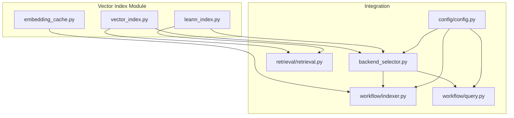
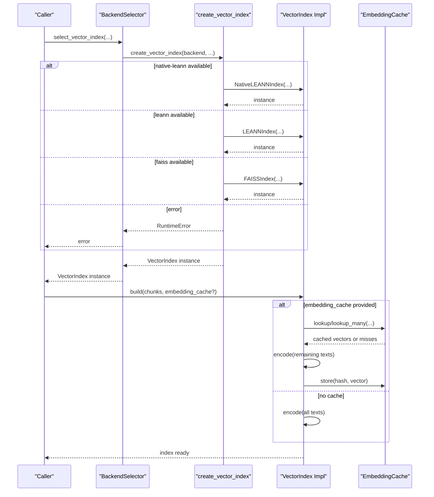
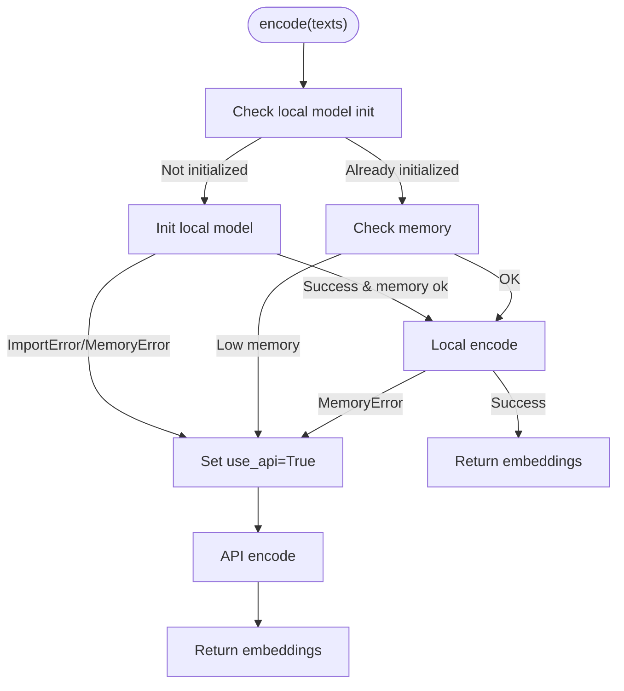
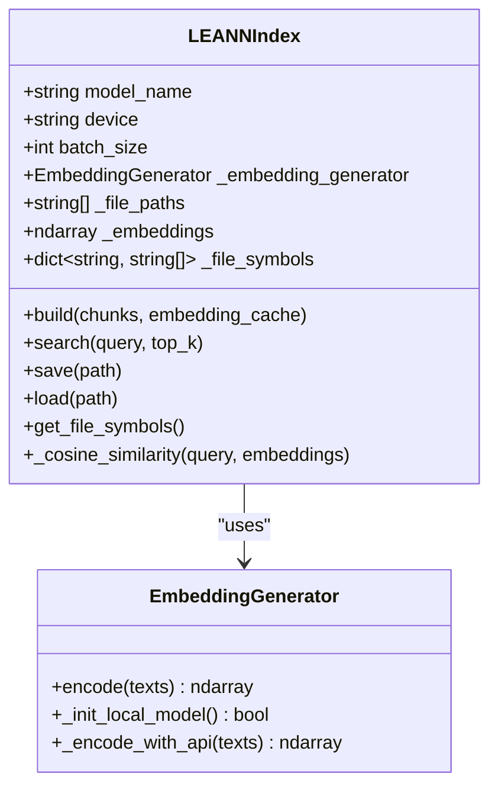
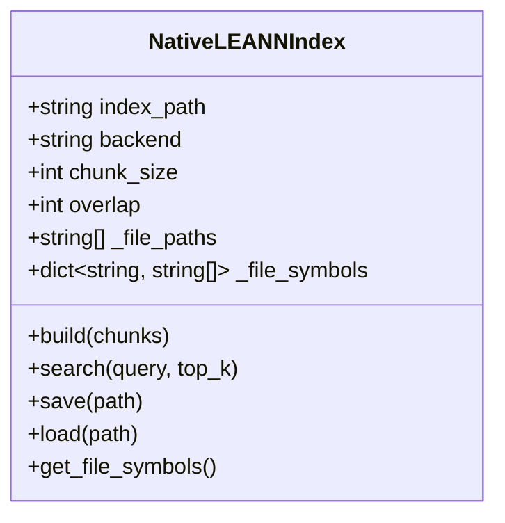
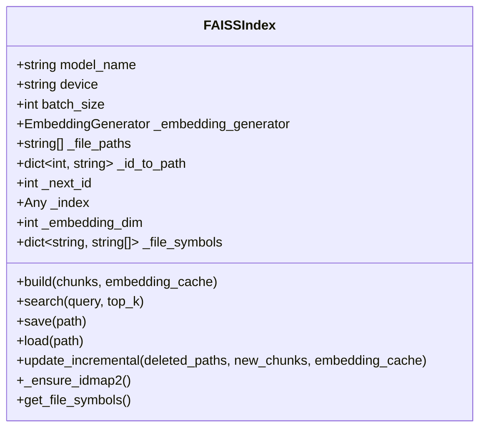
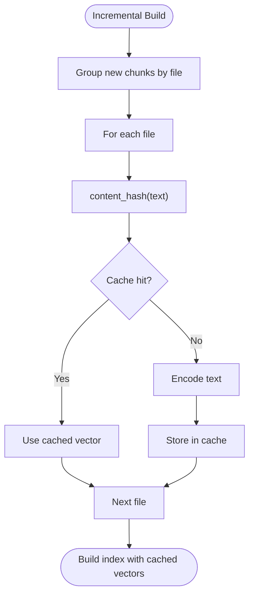
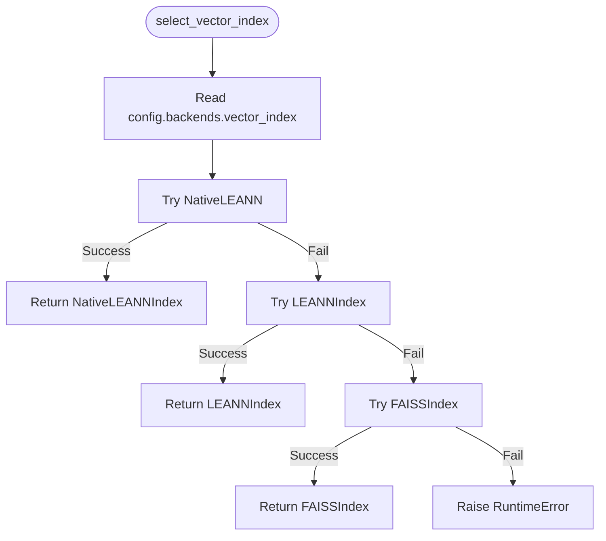
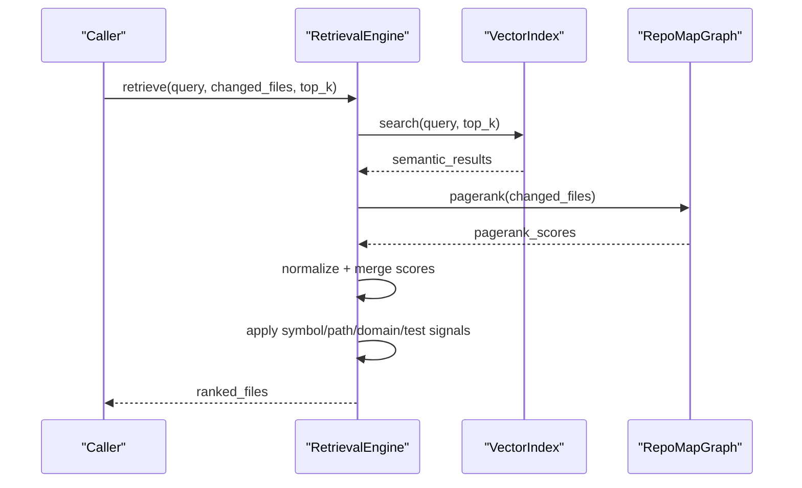
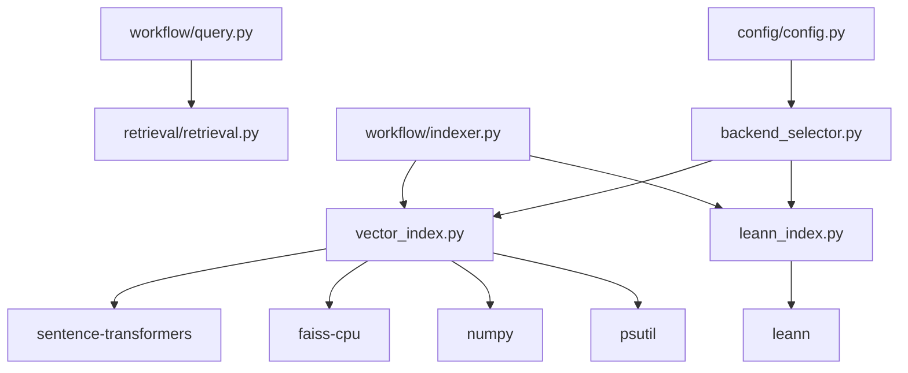

# Vector Index System

<cite>
**Referenced Files in This Document**
- [vector_index.py](file://src/ws_ctx_engine/vector_index/vector_index.py)
- [leann_index.py](file://src/ws_ctx_engine/vector_index/leann_index.py)
- [embedding_cache.py](file://src/ws_ctx_engine/vector_index/embedding_cache.py)
- [backend_selector.py](file://src/ws_ctx_engine/backend_selector/backend_selector.py)
- [indexer.py](file://src/ws_ctx_engine/workflow/indexer.py)
- [query.py](file://src/ws_ctx_engine/workflow/query.py)
- [config.py](file://src/ws_ctx_engine/config/config.py)
- [retrieval.py](file://src/ws_ctx_engine/retrieval/retrieval.py)
- [vector-index.md](file://docs/reference/vector-index.md)
- [performance.md](file://docs/guides/performance.md)
- [test_vector_index.py](file://tests/unit/test_vector_index.py)
- [test_embedding_cache.py](file://tests/unit/test_embedding_cache.py)
</cite>

## Table of Contents
1. [Introduction](#introduction)
2. [Project Structure](#project-structure)
3. [Core Components](#core-components)
4. [Architecture Overview](#architecture-overview)
5. [Detailed Component Analysis](#detailed-component-analysis)
6. [Dependency Analysis](#dependency-analysis)
7. [Performance Considerations](#performance-considerations)
8. [Troubleshooting Guide](#troubleshooting-guide)
9. [Conclusion](#conclusion)
10. [Appendices](#appendices)

## Introduction
This document describes the vector index system that powers semantic search over code repositories. It explains the backend selection strategy, the LEANN implementation for efficient similarity search, and the embedding cache mechanisms. It documents the vector index interface, supported backends (LEANN, FAISS), and fallback strategies. It also covers embedding generation, storage optimization, query performance characteristics, configuration examples, memory usage optimization, scaling considerations, embedding cache management, precomputation strategies, and integration with the retrieval system.

## Project Structure
The vector index system resides under the vector_index module and integrates with the broader indexing and querying workflows.

**Diagram sources**
- [vector_index.py:1-1120](file://src/ws_ctx_engine/vector_index/vector_index.py#L1-L1120)
- [leann_index.py:1-297](file://src/ws_ctx_engine/vector_index/leann_index.py#L1-L297)
- [embedding_cache.py:1-127](file://src/ws_ctx_engine/vector_index/embedding_cache.py#L1-L127)
- [backend_selector.py:1-191](file://src/ws_ctx_engine/backend_selector/backend_selector.py#L1-L191)
- [indexer.py:1-493](file://src/ws_ctx_engine/workflow/indexer.py#L1-L493)
- [query.py:1-617](file://src/ws_ctx_engine/workflow/query.py#L1-L617)
- [retrieval.py:1-627](file://src/ws_ctx_engine/retrieval/retrieval.py#L1-L627)
- [config.py:1-399](file://src/ws_ctx_engine/config/config.py#L1-L399)

**Section sources**
- [vector_index.py:1-1120](file://src/ws_ctx_engine/vector_index/vector_index.py#L1-L1120)
- [leann_index.py:1-297](file://src/ws_ctx_engine/vector_index/leann_index.py#L1-L297)
- [embedding_cache.py:1-127](file://src/ws_ctx_engine/vector_index/embedding_cache.py#L1-L127)
- [backend_selector.py:1-191](file://src/ws_ctx_engine/backend_selector/backend_selector.py#L1-L191)
- [indexer.py:1-493](file://src/ws_ctx_engine/workflow/indexer.py#L1-L493)
- [query.py:1-617](file://src/ws_ctx_engine/workflow/query.py#L1-L617)
- [retrieval.py:1-627](file://src/ws_ctx_engine/retrieval/retrieval.py#L1-L627)
- [config.py:1-399](file://src/ws_ctx_engine/config/config.py#L1-L399)

## Core Components
- VectorIndex abstract base class defining the interface for all backends.
- EmbeddingGenerator for local and API-based embedding generation with memory-aware fallback.
- LEANNIndex: cosine similarity-based implementation with file-level grouping.
- NativeLEANNIndex: production-grade implementation using the LEANN library with 97% storage savings.
- FAISSIndex: FAISS-based implementation with IndexFlatL2 + IndexIDMap2 for exact search and incremental updates.
- EmbeddingCache: disk-backed cache for incremental indexing to avoid re-embedding unchanged content.
- BackendSelector: orchestrates backend selection and fallback chains.
- Workflow integration: indexer and query phases integrate vector indexing and retrieval.

**Section sources**
- [vector_index.py:21-1120](file://src/ws_ctx_engine/vector_index/vector_index.py#L21-L1120)
- [leann_index.py:20-297](file://src/ws_ctx_engine/vector_index/leann_index.py#L20-L297)
- [embedding_cache.py:28-127](file://src/ws_ctx_engine/vector_index/embedding_cache.py#L28-L127)
- [backend_selector.py:13-191](file://src/ws_ctx_engine/backend_selector/backend_selector.py#L13-L191)
- [indexer.py:72-493](file://src/ws_ctx_engine/workflow/indexer.py#L72-L493)
- [query.py:158-617](file://src/ws_ctx_engine/workflow/query.py#L158-L617)

## Architecture Overview
The vector index system provides a unified interface for semantic search with pluggable backends and automatic fallback. The backend selection prioritizes NativeLEANN (97% storage savings), falls back to LEANNIndex, and finally to FAISSIndex. Embedding generation supports local sentence-transformers models with API fallback to OpenAI. Incremental indexing uses an embedding cache to avoid re-embedding unchanged files.

**Diagram sources**
- [backend_selector.py:36-81](file://src/ws_ctx_engine/backend_selector/backend_selector.py#L36-L81)
- [vector_index.py:972-1080](file://src/ws_ctx_engine/vector_index/vector_index.py#L972-L1080)
- [indexer.py:189-234](file://src/ws_ctx_engine/workflow/indexer.py#L189-L234)
- [embedding_cache.py:89-113](file://src/ws_ctx_engine/vector_index/embedding_cache.py#L89-L113)

**Section sources**
- [backend_selector.py:13-191](file://src/ws_ctx_engine/backend_selector/backend_selector.py#L13-L191)
- [vector_index.py:972-1080](file://src/ws_ctx_engine/vector_index/vector_index.py#L972-L1080)
- [indexer.py:189-234](file://src/ws_ctx_engine/workflow/indexer.py#L189-L234)
- [embedding_cache.py:28-127](file://src/ws_ctx_engine/vector_index/embedding_cache.py#L28-L127)

## Detailed Component Analysis

### VectorIndex Interface
VectorIndex defines the contract for all vector index implementations:
- build: construct the index from CodeChunk objects, optionally using an embedding cache.
- search: perform semantic similarity search and return file paths with similarity scores.
- save/load: persist and restore index state.
- get_file_symbols: return file-to-symbols mapping for downstream boosting.

Key behaviors:
- All implementations must handle empty inputs gracefully.
- Search validates query emptiness and index readiness.
- Save/load enforce index readiness and backend-specific metadata.

**Section sources**
- [vector_index.py:21-84](file://src/ws_ctx_engine/vector_index/vector_index.py#L21-L84)

### EmbeddingGenerator
EmbeddingGenerator encapsulates embedding generation with memory-aware fallback:
- Initializes sentence-transformers locally when sufficient memory is available.
- Falls back to OpenAI API embeddings when local model fails or memory is low.
- Uses configurable model name, device, and batch size.
- Tracks memory thresholds and logs fallback events.

**Diagram sources**
- [vector_index.py:199-280](file://src/ws_ctx_engine/vector_index/vector_index.py#L199-L280)

**Section sources**
- [vector_index.py:96-280](file://src/ws_ctx_engine/vector_index/vector_index.py#L96-L280)

### LEANNIndex (Cosine Similarity)
LEANNIndex groups chunks by file path, concatenates content per file, and computes embeddings. It stores file paths, embeddings, and symbol mappings. Search uses cosine similarity with normalized vectors.

Key implementation details:
- Groups chunks by path, concatenates content, and computes embeddings.
- Stores file → symbols mapping for symbol boost.
- Uses cosine similarity with L2 normalization and dot product.

**Diagram sources**
- [vector_index.py:282-504](file://src/ws_ctx_engine/vector_index/vector_index.py#L282-L504)

**Section sources**
- [vector_index.py:282-504](file://src/ws_ctx_engine/vector_index/vector_index.py#L282-L504)

### NativeLEANNIndex (97% Storage Savings)
NativeLEANNIndex uses the actual LEANN library to achieve 97% storage savings via graph-based selective recomputation. It stores index metadata and relies on the LEANN library for index construction and search.

Key features:
- Integrates with the LEANN library (LeannBuilder/LeannSearcher).
- Supports HNSW and DiskANN backends.
- Persists index metadata and file-to-symbols mapping.

**Diagram sources**
- [leann_index.py:20-297](file://src/ws_ctx_engine/vector_index/leann_index.py#L20-L297)

**Section sources**
- [leann_index.py:20-297](file://src/ws_ctx_engine/vector_index/leann_index.py#L20-L297)

### FAISSIndex (FAISS-CPU)
FAISSIndex uses FAISS with IndexFlatL2 wrapped in IndexIDMap2 for exact search and incremental updates. It supports:
- IndexFlatL2 for brute-force exact search.
- IndexIDMap2 for ID mapping and incremental removal/addition.
- Incremental update via remove_ids + add_with_ids with monotonic ID assignment.

**Diagram sources**
- [vector_index.py:506-962](file://src/ws_ctx_engine/vector_index/vector_index.py#L506-L962)

**Section sources**
- [vector_index.py:506-962](file://src/ws_ctx_engine/vector_index/vector_index.py#L506-L962)

### EmbeddingCache (Incremental Indexing)
EmbeddingCache provides disk-backed caching of content-hash → embedding vector mappings:
- Uses SHA-256 of concatenated file content as the key.
- Persists embeddings.npy and embedding_index.json.
- Supports lookup, store, load, and save operations.
- Enables incremental rebuilds by skipping unchanged files.

**Diagram sources**
- [embedding_cache.py:28-127](file://src/ws_ctx_engine/vector_index/embedding_cache.py#L28-L127)
- [vector_index.py:539-562](file://src/ws_ctx_engine/vector_index/vector_index.py#L539-L562)

**Section sources**
- [embedding_cache.py:28-127](file://src/ws_ctx_engine/vector_index/embedding_cache.py#L28-L127)
- [vector_index.py:539-562](file://src/ws_ctx_engine/vector_index/vector_index.py#L539-L562)

### Backend Selection Strategy
BackendSelector implements graceful degradation:
- Level 1: igraph + NativeLEANN + local embeddings (optimal, 97% storage savings).
- Level 2: NetworkX + NativeLEANN + local embeddings.
- Level 3: NetworkX + LEANNIndex + local embeddings.
- Level 4: NetworkX + FAISS + local embeddings.
- Level 5: NetworkX + FAISS + API embeddings.
- Level 6: File size ranking only (no graph).

It selects backends based on configuration and logs the current fallback level.

**Diagram sources**
- [backend_selector.py:36-81](file://src/ws_ctx_engine/backend_selector/backend_selector.py#L36-L81)
- [vector_index.py:972-1080](file://src/ws_ctx_engine/vector_index/vector_index.py#L972-L1080)

**Section sources**
- [backend_selector.py:13-191](file://src/ws_ctx_engine/backend_selector/backend_selector.py#L13-L191)
- [vector_index.py:972-1080](file://src/ws_ctx_engine/vector_index/vector_index.py#L972-L1080)

### Integration with Retrieval System
The retrieval system combines semantic and structural signals:
- Semantic scores from vector_index.search.
- PageRank scores from RepoMapGraph.
- Symbol boost, path boost, domain boost, and test penalty.
- Min-max normalization to [0, 1].

**Diagram sources**
- [retrieval.py:250-368](file://src/ws_ctx_engine/retrieval/retrieval.py#L250-L368)
- [vector_index.py:43-56](file://src/ws_ctx_engine/vector_index/vector_index.py#L43-L56)

**Section sources**
- [retrieval.py:140-368](file://src/ws_ctx_engine/retrieval/retrieval.py#L140-L368)
- [vector_index.py:43-56](file://src/ws_ctx_engine/vector_index/vector_index.py#L43-L56)

## Dependency Analysis
- Internal dependencies:
  - VectorIndex implementations depend on EmbeddingGenerator and CodeChunk.
  - FAISSIndex depends on FAISS library for index operations.
  - NativeLEANNIndex depends on the LEANN library for index construction/search.
- External dependencies:
  - numpy for array operations.
  - psutil for memory checks.
  - sentence-transformers for local embeddings.
  - faiss-cpu for FAISS backend.
  - leann for NativeLEANN backend.
  - openai for API fallback.

**Diagram sources**
- [vector_index.py:1-1120](file://src/ws_ctx_engine/vector_index/vector_index.py#L1-L1120)
- [leann_index.py:1-297](file://src/ws_ctx_engine/vector_index/leann_index.py#L1-L297)
- [indexer.py:1-493](file://src/ws_ctx_engine/workflow/indexer.py#L1-L493)
- [query.py:1-617](file://src/ws_ctx_engine/workflow/query.py#L1-L617)
- [config.py:1-399](file://src/ws_ctx_engine/config/config.py#L1-L399)

**Section sources**
- [vector_index.py:1-1120](file://src/ws_ctx_engine/vector_index/vector_index.py#L1-L1120)
- [leann_index.py:1-297](file://src/ws_ctx_engine/vector_index/leann_index.py#L1-L297)
- [indexer.py:1-493](file://src/ws_ctx_engine/workflow/indexer.py#L1-L493)
- [query.py:1-617](file://src/ws_ctx_engine/workflow/query.py#L1-L617)
- [config.py:1-399](file://src/ws_ctx_engine/config/config.py#L1-L399)

## Performance Considerations
- Backend latency targets:
  - NativeLEANN: <10ms (1k), <50ms (10k), <200ms (100k).
  - LEANNIndex: <5ms (1k), <20ms (10k), <100ms (100k).
  - FAISSIndex (HNSW): <1ms (1k), <5ms (10k), <20ms (100k).
- Memory usage:
  - NativeLEANN: ~3MB (97% savings).
  - LEANNIndex: ~15MB.
  - FAISSIndex: ~20MB (384-dim, 10k files).
- Embedding dimensions:
  - all-MiniLM-L6-v2: 384 dimensions.
- Optional Rust acceleration:
  - File walking, gitignore matching, chunk hashing, and token counting can be accelerated by 8–20x with the Rust extension.

**Section sources**
- [vector-index.md:402-419](file://docs/reference/vector-index.md#L402-L419)
- [performance.md:8-16](file://docs/guides/performance.md#L8-L16)

## Troubleshooting Guide
Common issues and resolutions:
- Local model initialization failures:
  - Insufficient memory triggers API fallback.
  - ImportError for sentence-transformers leads to API fallback.
- FAISS not available:
  - Install faiss-cpu; otherwise, fallback to LEANNIndex.
- NativeLEANN not available:
  - Install leann or leann extras; otherwise, fallback to LEANNIndex.
- Out of memory during encoding:
  - EmbeddingGenerator frees memory and switches to API fallback.
- Incremental update failures:
  - Index rebuild is attempted; ensure embedding cache is enabled and persisted.

**Section sources**
- [vector_index.py:130-280](file://src/ws_ctx_engine/vector_index/vector_index.py#L130-L280)
- [vector_index.py:564-646](file://src/ws_ctx_engine/vector_index/vector_index.py#L564-L646)
- [vector_index.py:1011-1076](file://src/ws_ctx_engine/vector_index/vector_index.py#L1011-L1076)
- [indexer.py:210-230](file://src/ws_ctx_engine/workflow/indexer.py#L210-L230)

## Conclusion
The vector index system provides a robust, configurable, and scalable foundation for semantic search over codebases. It balances performance and storage efficiency through multiple backends, memory-aware embedding generation, and incremental indexing with embedding caching. The retrieval system integrates semantic and structural signals to produce high-quality ranked results suitable for downstream packing and output generation.

## Appendices

### Configuration Examples
- Backend selection:
  - vector_index.backend: auto | native-leann | leann | faiss
  - embeddings.model/device/batch_size: configure embedding generation
  - performance.cache_embeddings/incremental_index: enable caching and incremental builds
- Example YAML:
  - See [vector-index.md:482-508](file://docs/reference/vector-index.md#L482-L508) for a complete configuration example.

**Section sources**
- [config.py:74-101](file://src/ws_ctx_engine/config/config.py#L74-L101)
- [vector-index.md:482-508](file://docs/reference/vector-index.md#L482-L508)

### Scaling Considerations
- Choose backends based on repository size:
  - NativeLEANNIndex: optimal for large repositories with tight storage budgets.
  - FAISSIndex: best for fastest search performance with moderate storage overhead.
  - LEANNIndex: balanced option with cosine similarity and full embedding storage.
- Enable embedding cache for incremental builds to reduce rebuild time.
- Monitor memory usage and adjust batch sizes accordingly.

**Section sources**
- [vector-index.md:295-302](file://docs/reference/vector-index.md#L295-L302)
- [vector-index.md:406-418](file://docs/reference/vector-index.md#L406-L418)

### Embedding Cache Management
- Persist cache under .ws-ctx-engine/embeddings.npy and embedding_index.json.
- Use content_hash to ensure cache invalidation on content changes.
- Load cache before building and save after incremental updates.

**Section sources**
- [embedding_cache.py:1-127](file://src/ws_ctx_engine/vector_index/embedding_cache.py#L1-L127)
- [indexer.py:197-237](file://src/ws_ctx_engine/workflow/indexer.py#L197-L237)

### Precomputation Strategies
- Group chunks by file path and concatenate content per file before embedding.
- Use embedding cache to avoid re-embedding unchanged files.
- For FAISSIndex, leverage IndexIDMap2 for incremental removal/addition with monotonic ID assignment.

**Section sources**
- [vector_index.py:330-359](file://src/ws_ctx_engine/vector_index/vector_index.py#L330-L359)
- [vector_index.py:914-953](file://src/ws_ctx_engine/vector_index/vector_index.py#L914-L953)

### Integration with Retrieval System
- VectorIndex.search feeds semantic scores to RetrievalEngine.
- get_file_symbols enables symbol-based boosting.
- RetrievalEngine merges semantic and PageRank scores, applies additional signals, and normalizes results.

**Section sources**
- [retrieval.py:250-368](file://src/ws_ctx_engine/retrieval/retrieval.py#L250-L368)
- [vector_index.py:86-93](file://src/ws_ctx_engine/vector_index/vector_index.py#L86-L93)