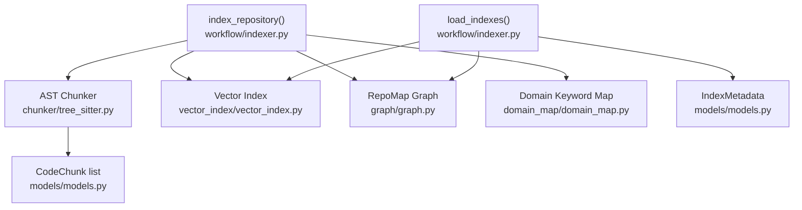
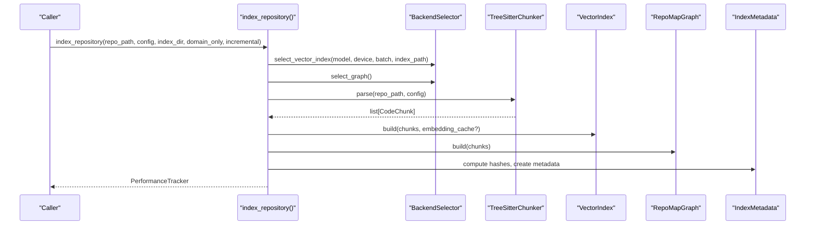
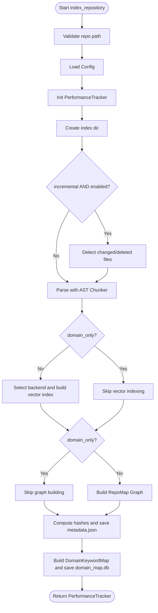
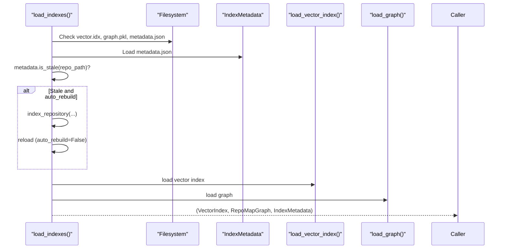
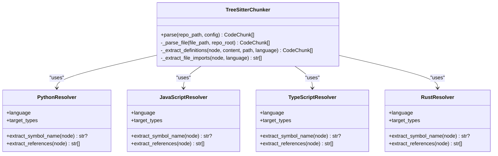
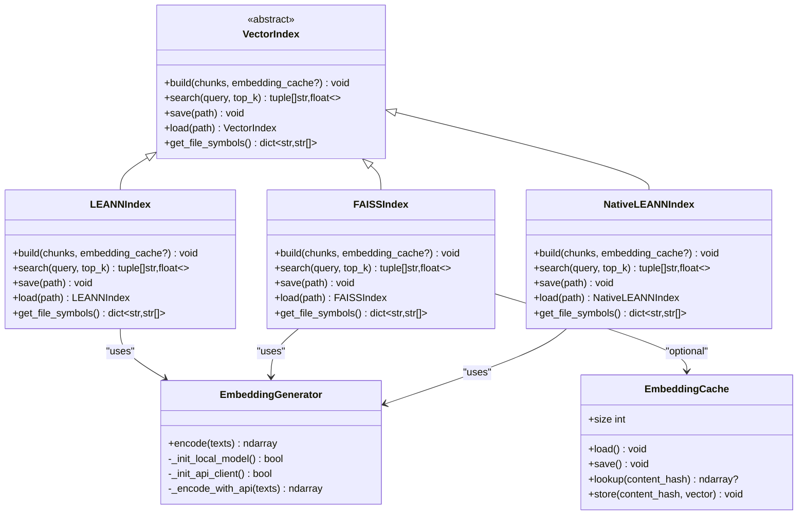
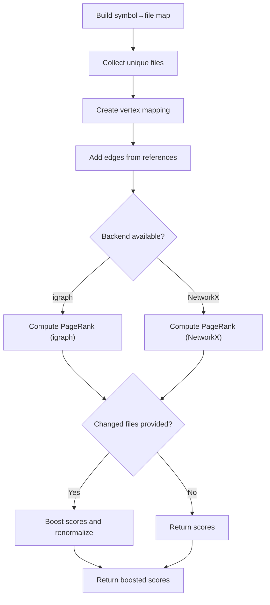
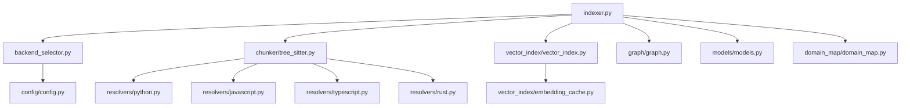

# Indexing Phase

<cite>
**Referenced Files in This Document**
- [indexer.py](file://src/ws_ctx_engine/workflow/indexer.py)
- [vector_index.py](file://src/ws_ctx_engine/vector_index/vector_index.py)
- [leann_index.py](file://src/ws_ctx_engine/vector_index/leann_index.py)
- [embedding_cache.py](file://src/ws_ctx_engine/vector_index/embedding_cache.py)
- [graph.py](file://src/ws_ctx_engine/graph/graph.py)
- [config.py](file://src/ws_ctx_engine/config/config.py)
- [backend_selector.py](file://src/ws_ctx_engine/backend_selector/backend_selector.py)
- [tree_sitter.py](file://src/ws_ctx_engine/chunker/tree_sitter.py)
- [base.py](file://src/ws_ctx_engine/chunker/base.py)
- [python.py](file://src/ws_ctx_engine/chunker/resolvers/python.py)
- [javascript.py](file://src/ws_ctx_engine/chunker/resolvers/javascript.py)
- [typescript.py](file://src/ws_ctx_engine/chunker/resolvers/typescript.py)
- [rust.py](file://src/ws_ctx_engine/chunker/resolvers/rust.py)
- [models.py](file://src/ws_ctx_engine/models/models.py)
- [domain_map.py](file://src/ws_ctx_engine/domain_map/domain_map.py)
</cite>

## Table of Contents
1. [Introduction](#introduction)
2. [Project Structure](#project-structure)
3. [Core Components](#core-components)
4. [Architecture Overview](#architecture-overview)
5. [Detailed Component Analysis](#detailed-component-analysis)
6. [Dependency Analysis](#dependency-analysis)
7. [Performance Considerations](#performance-considerations)
8. [Troubleshooting Guide](#troubleshooting-guide)
9. [Conclusion](#conclusion)
10. [Appendices](#appendices)

## Introduction
This document explains the indexing phase of the workflow engine, focusing on the index_repository orchestration function and the load_indexes loader. It covers the end-to-end pipeline: file discovery, AST parsing, chunk generation, vector index building, graph construction, and persistence. It also documents chunking strategies per language, vector embedding processes, PageRank computation for dependency graphs, configuration options, practical examples, performance optimizations, memory management, incremental indexing, and error handling.

## Project Structure
The indexing phase spans several modules:
- Workflow orchestration: index_repository and load_indexes
- Chunking: AST-based parsing with language-specific resolvers
- Vector indexing: LEANN-based and FAISS-based backends with embedding caching
- Graph construction: RepoMap graph with PageRank scoring
- Configuration: central Config class and BackendSelector
- Persistence: metadata, vector index, graph, and domain keyword map

**Diagram sources**
- [indexer.py:72-492](file://src/ws_ctx_engine/workflow/indexer.py#L72-L492)
- [tree_sitter.py:57-89](file://src/ws_ctx_engine/chunker/tree_sitter.py#L57-L89)
- [vector_index.py:21-84](file://src/ws_ctx_engine/vector_index/vector_index.py#L21-L84)
- [graph.py:19-94](file://src/ws_ctx_engine/graph/graph.py#L19-L94)
- [domain_map.py:11-17](file://src/ws_ctx_engine/domain_map/domain_map.py#L11-L17)
- [models.py:10-59](file://src/ws_ctx_engine/models/models.py#L10-L59)

**Section sources**
- [indexer.py:72-492](file://src/ws_ctx_engine/workflow/indexer.py#L72-L492)
- [config.py:16-398](file://src/ws_ctx_engine/config/config.py#L16-L398)

## Core Components
- index_repository: Orchestrates the full indexing pipeline with phases for parsing, vector index building, graph construction, metadata saving, and domain map building. Supports incremental mode and embedding cache reuse.
- load_indexes: Loads persisted indexes and metadata, detects staleness, and optionally rebuilds automatically.
- BackendSelector: Centralized backend selection with fallback chains for vector index, graph, and embeddings.
- VectorIndex implementations: LEANNIndex (cosine similarity), FAISSIndex (exact brute-force with ID mapping), and NativeLEANNIndex (external library).
- RepoMapGraph: Builds dependency graphs and computes PageRank scores with optional boost for changed files.
- Chunker: Tree-sitter-based AST parsing with language-specific resolvers and fallbacks.
- EmbeddingCache: Disk-backed cache for embeddings to accelerate incremental rebuilds.
- DomainKeywordMap: Maps domain keywords to directories for query-time classification.

**Section sources**
- [indexer.py:72-492](file://src/ws_ctx_engine/workflow/indexer.py#L72-L492)
- [backend_selector.py:13-190](file://src/ws_ctx_engine/backend_selector/backend_selector.py#L13-L190)
- [vector_index.py:21-84](file://src/ws_ctx_engine/vector_index/vector_index.py#L21-L84)
- [graph.py:19-94](file://src/ws_ctx_engine/graph/graph.py#L19-L94)
- [tree_sitter.py:15-159](file://src/ws_ctx_engine/chunker/tree_sitter.py#L15-L159)
- [embedding_cache.py:28-127](file://src/ws_ctx_engine/vector_index/embedding_cache.py#L28-L127)
- [domain_map.py:11-147](file://src/ws_ctx_engine/domain_map/domain_map.py#L11-L147)

## Architecture Overview
The indexing pipeline is a five-phase process:
1. Parse codebase with AST Chunker (with fallback)
2. Build Vector Index (with fallback and embedding cache)
3. Build RepoMap Graph (with fallback)
4. Save metadata for staleness detection
5. Build Domain Keyword Map (parallel write)

**Diagram sources**
- [indexer.py:72-371](file://src/ws_ctx_engine/workflow/indexer.py#L72-L371)
- [backend_selector.py:36-110](file://src/ws_ctx_engine/backend_selector/backend_selector.py#L36-L110)
- [tree_sitter.py:57-89](file://src/ws_ctx_engine/chunker/tree_sitter.py#L57-L89)
- [vector_index.py:309-462](file://src/ws_ctx_engine/vector_index/vector_index.py#L309-L462)
- [graph.py:129-186](file://src/ws_ctx_engine/graph/graph.py#L129-L186)
- [models.py:87-151](file://src/ws_ctx_engine/models/models.py#L87-L151)

## Detailed Component Analysis

### index_repository: Orchestration and Incremental Indexing
- Validates repository path, loads configuration, initializes performance tracking, and creates index directory.
- Optional incremental mode: compares stored file hashes with current disk state to detect changed/deleted files.
- Phase 1: parse_with_fallback invokes TreeSitterChunker and collects CodeChunk objects.
- Phase 2: selects vector index backend via BackendSelector, optionally uses EmbeddingCache, supports incremental update for FAISSIndex, and persists vector.idx.
- Phase 3: builds RepoMapGraph via BackendSelector and persists graph.pkl.
- Phase 4: computes SHA256 hashes for unique files, constructs IndexMetadata, and writes metadata.json.
- Phase 5: builds DomainKeywordMap and persists domain_map.db.
- Tracks memory and logs metrics via PerformanceTracker.

**Diagram sources**
- [indexer.py:72-371](file://src/ws_ctx_engine/workflow/indexer.py#L72-L371)

**Section sources**
- [indexer.py:72-371](file://src/ws_ctx_engine/workflow/indexer.py#L72-L371)
- [_detect_incremental_changes:27-69](file://src/ws_ctx_engine/workflow/indexer.py#L27-L69)
- [_compute_file_hashes:374-401](file://src/ws_ctx_engine/workflow/indexer.py#L374-L401)

### load_indexes: Loading and Staleness Detection
- Checks existence of vector.idx, graph.pkl, and metadata.json.
- Loads IndexMetadata and checks staleness by comparing stored hashes with current file content.
- If stale and auto_rebuild is True, triggers index_repository and reloads indexes.
- On load failures, attempts automatic rebuild and reload.
- Returns tuple of (VectorIndex, RepoMapGraph, IndexMetadata).

**Diagram sources**
- [indexer.py:404-492](file://src/ws_ctx_engine/workflow/indexer.py#L404-L492)
- [models.py:87-151](file://src/ws_ctx_engine/models/models.py#L87-L151)

**Section sources**
- [indexer.py:404-492](file://src/ws_ctx_engine/workflow/indexer.py#L404-L492)
- [models.py:87-151](file://src/ws_ctx_engine/models/models.py#L87-L151)

### Chunking Strategies and AST Parsing
- TreeSitterChunker discovers files matching supported extensions and parses them with language-specific resolvers.
- Supported languages: Python, JavaScript, TypeScript, JSX/TSX, Rust.
- Resolvers extract definitions and references for each language’s AST node types.
- MarkdownChunker is invoked early to include Markdown content.
- Includes/excludes are governed by Config include_patterns and exclude_patterns, with optional respect_gitignore.

**Diagram sources**
- [tree_sitter.py:15-159](file://src/ws_ctx_engine/chunker/tree_sitter.py#L15-L159)
- [python.py:6-61](file://src/ws_ctx_engine/chunker/resolvers/python.py#L6-L61)
- [javascript.py:6-85](file://src/ws_ctx_engine/chunker/resolvers/javascript.py#L6-L85)
- [typescript.py:6-103](file://src/ws_ctx_engine/chunker/resolvers/typescript.py#L6-L103)
- [rust.py:6-55](file://src/ws_ctx_engine/chunker/resolvers/rust.py#L6-L55)

**Section sources**
- [tree_sitter.py:57-159](file://src/ws_ctx_engine/chunker/tree_sitter.py#L57-L159)
- [base.py:47-176](file://src/ws_ctx_engine/chunker/base.py#L47-L176)
- [python.py:6-61](file://src/ws_ctx_engine/chunker/resolvers/python.py#L6-L61)
- [javascript.py:6-85](file://src/ws_ctx_engine/chunker/resolvers/javascript.py#L6-L85)
- [typescript.py:6-103](file://src/ws_ctx_engine/chunker/resolvers/typescript.py#L6-L103)
- [rust.py:6-55](file://src/ws_ctx_engine/chunker/resolvers/rust.py#L6-L55)

### Vector Embedding and Index Backends
- EmbeddingGenerator supports local sentence-transformers and API fallback (OpenAI), with memory-aware switching and batching.
- LEANNIndex: Groups chunks by file, concatenates content, generates embeddings, and stores vectors for cosine similarity search.
- FAISSIndex: Uses IndexFlatL2 wrapped in IndexIDMap2 for exact brute-force search with ID mapping for incremental updates.
- NativeLEANNIndex: Integrates external LEANN library for 97% storage savings with configurable backend and chunking parameters.
- EmbeddingCache: Persists content-hash → embedding vector mappings to avoid re-embedding unchanged files during incremental rebuilds.

**Diagram sources**
- [vector_index.py:21-84](file://src/ws_ctx_engine/vector_index/vector_index.py#L21-L84)
- [vector_index.py:282-503](file://src/ws_ctx_engine/vector_index/vector_index.py#L282-L503)
- [vector_index.py:506-800](file://src/ws_ctx_engine/vector_index/vector_index.py#L506-L800)
- [leann_index.py:20-296](file://src/ws_ctx_engine/vector_index/leann_index.py#L20-L296)
- [embedding_cache.py:28-127](file://src/ws_ctx_engine/vector_index/embedding_cache.py#L28-L127)

**Section sources**
- [vector_index.py:96-280](file://src/ws_ctx_engine/vector_index/vector_index.py#L96-L280)
- [vector_index.py:282-503](file://src/ws_ctx_engine/vector_index/vector_index.py#L282-L503)
- [vector_index.py:506-800](file://src/ws_ctx_engine/vector_index/vector_index.py#L506-L800)
- [leann_index.py:20-296](file://src/ws_ctx_engine/vector_index/leann_index.py#L20-L296)
- [embedding_cache.py:28-127](file://src/ws_ctx_engine/vector_index/embedding_cache.py#L28-L127)

### PageRank Computation for Dependency Graphs
- RepoMapGraph builds a directed graph from symbol definitions and references.
- IGraphRepoMap uses python-igraph for fast PageRank computation; falls back to NetworkXRepoMap if igraph is unavailable.
- PageRank scores are normalized and optionally boosted for changed files by a configurable factor.

**Diagram sources**
- [graph.py:129-231](file://src/ws_ctx_engine/graph/graph.py#L129-L231)
- [graph.py:347-449](file://src/ws_ctx_engine/graph/graph.py#L347-L449)

**Section sources**
- [graph.py:19-94](file://src/ws_ctx_engine/graph/graph.py#L19-L94)
- [graph.py:129-231](file://src/ws_ctx_engine/graph/graph.py#L129-L231)
- [graph.py:347-449](file://src/ws_ctx_engine/graph/graph.py#L347-L449)

### Configuration Options
Key configuration areas:
- embeddings: model, device, batch_size, api_provider, api_key_env
- performance: cache_embeddings, incremental_index
- backends: vector_index, graph, embeddings
- include/exclude patterns and gitignore respect
- scoring weights (semantic_weight, pagerank_weight)

These drive backend selection, embedding generation, and file filtering during parsing.

**Section sources**
- [config.py:84-101](file://src/ws_ctx_engine/config/config.py#L84-L101)
- [config.py:286-398](file://src/ws_ctx_engine/config/config.py#L286-L398)
- [backend_selector.py:36-110](file://src/ws_ctx_engine/backend_selector/backend_selector.py#L36-L110)

### Practical Examples
- Small Python project: Run index_repository with default settings; expect quick parsing and indexing.
- Large monorepo: Enable performance.cache_embeddings and performance.incremental_index; use FAISSIndex for scalability.
- Mixed-language repository: Ensure language-specific resolvers are available; TreeSitterChunker will parse supported extensions.
- CI/CD pipeline: Use load_indexes with auto_rebuild=True to automatically rebuild stale indexes.

[No sources needed since this section provides general guidance]

### Performance Optimizations and Memory Management
- EmbeddingGenerator switches from local to API embeddings when memory is low.
- EmbeddingCache avoids re-embedding unchanged files during incremental rebuilds.
- FAISSIndex uses IndexIDMap2 to support incremental updates without full rebuilds.
- BackendSelector logs current fallback level to inform users about performance trade-offs.
- PerformanceTracker measures per-phase durations and memory usage.

**Section sources**
- [vector_index.py:130-251](file://src/ws_ctx_engine/vector_index/vector_index.py#L130-L251)
- [embedding_cache.py:55-84](file://src/ws_ctx_engine/vector_index/embedding_cache.py#L55-L84)
- [vector_index.py:539-646](file://src/ws_ctx_engine/vector_index/vector_index.py#L539-L646)
- [backend_selector.py:120-177](file://src/ws_ctx_engine/backend_selector/backend_selector.py#L120-L177)
- [indexer.py:115-160](file://src/ws_ctx_engine/workflow/indexer.py#L115-L160)

### Incremental Indexing Capabilities
- Detects changed/deleted files by comparing stored SHA256 hashes with current file content.
- For FAISSIndex, attempts incremental update by removing deleted/changed IDs and adding new embeddings; falls back to full rebuild on failure.
- EmbeddingCache is leveraged to skip re-embedding unchanged files.

**Section sources**
- [_detect_incremental_changes:27-69](file://src/ws_ctx_engine/workflow/indexer.py#L27-L69)
- [indexer.py:210-234](file://src/ws_ctx_engine/workflow/indexer.py#L210-L234)
- [embedding_cache.py:89-113](file://src/ws_ctx_engine/vector_index/embedding_cache.py#L89-L113)

### Error Handling and Recovery
- index_repository wraps each phase with try/except and logs errors; raises RuntimeError with contextual info.
- load_indexes detects missing artifacts, staleness, and load failures; optionally rebuilds and reloads.
- BackendSelector and individual components raise descriptive errors on unavailability or misconfiguration.

**Section sources**
- [indexer.py:174-176](file://src/ws_ctx_engine/workflow/indexer.py#L174-L176)
- [indexer.py:251-253](file://src/ws_ctx_engine/workflow/indexer.py#L251-L253)
- [indexer.py:279-281](file://src/ws_ctx_engine/workflow/indexer.py#L279-L281)
- [indexer.py:460-485](file://src/ws_ctx_engine/workflow/indexer.py#L460-L485)
- [graph.py:115-122](file://src/ws_ctx_engine/graph/graph.py#L115-L122)
- [vector_index.py:584-587](file://src/ws_ctx_engine/vector_index/vector_index.py#L584-L587)

## Dependency Analysis
The indexing pipeline exhibits clear module boundaries and controlled coupling:
- index_repository depends on BackendSelector, Chunker, VectorIndex, RepoMapGraph, and persistence utilities.
- VectorIndex implementations depend on EmbeddingGenerator and optional EmbeddingCache.
- Graph implementations depend on igraph or NetworkX with graceful fallback.
- Configuration drives backend selection and feature toggles.

**Diagram sources**
- [indexer.py:14-24](file://src/ws_ctx_engine/workflow/indexer.py#L14-L24)
- [backend_selector.py:7-10](file://src/ws_ctx_engine/backend_selector/backend_selector.py#L7-L10)
- [tree_sitter.py:5-10](file://src/ws_ctx_engine/chunker/tree_sitter.py#L5-L10)
- [vector_index.py:17-18](file://src/ws_ctx_engine/vector_index/vector_index.py#L17-L18)
- [graph.py:13-14](file://src/ws_ctx_engine/graph/graph.py#L13-L14)
- [models.py:3-7](file://src/ws_ctx_engine/models/models.py#L3-L7)
- [domain_map.py](file://src/ws_ctx_engine/domain_map/domain_map.py#L8)

**Section sources**
- [indexer.py:14-24](file://src/ws_ctx_engine/workflow/indexer.py#L14-L24)
- [backend_selector.py:7-10](file://src/ws_ctx_engine/backend_selector/backend_selector.py#L7-L10)
- [tree_sitter.py:5-10](file://src/ws_ctx_engine/chunker/tree_sitter.py#L5-L10)
- [vector_index.py:17-18](file://src/ws_ctx_engine/vector_index/vector_index.py#L17-L18)
- [graph.py:13-14](file://src/ws_ctx_engine/graph/graph.py#L13-L14)
- [models.py:3-7](file://src/ws_ctx_engine/models/models.py#L3-L7)
- [domain_map.py](file://src/ws_ctx_engine/domain_map/domain_map.py#L8)

## Performance Considerations
- Prefer FAISSIndex for repositories exceeding ~50k files; leverage IndexIDMap2 for incremental updates.
- Enable EmbeddingCache to reduce rebuild time by skipping unchanged files.
- Choose embeddings.device="cuda" when GPU memory permits; otherwise CPU with batching remains viable.
- Use BackendSelector’s optimal level (igraph + NativeLEANN + local embeddings) when available for 97% storage savings.
- Monitor memory usage; EmbeddingGenerator will switch to API embeddings on low-memory conditions.

[No sources needed since this section provides general guidance]

## Troubleshooting Guide
Common issues and remedies:
- Missing dependencies: Install python-igraph, networkx, faiss-cpu, or leann as indicated by ImportError messages.
- Out of memory during embedding: Reduce batch_size or switch to API embeddings; EmbeddingGenerator handles fallback automatically.
- Stale indexes: load_indexes will rebuild automatically if auto_rebuild=True; otherwise, manually call index_repository.
- Backend unavailability: BackendSelector logs fallback levels; adjust config.backends to force compatible backends.

**Section sources**
- [graph.py:115-122](file://src/ws_ctx_engine/graph/graph.py#L115-L122)
- [graph.py:335-342](file://src/ws_ctx_engine/graph/graph.py#L335-L342)
- [vector_index.py:584-587](file://src/ws_ctx_engine/vector_index/vector_index.py#L584-L587)
- [leann_index.py:73-82](file://src/ws_ctx_engine/vector_index/leann_index.py#L73-L82)
- [vector_index.py:150-172](file://src/ws_ctx_engine/vector_index/vector_index.py#L150-L172)
- [indexer.py:460-485](file://src/ws_ctx_engine/workflow/indexer.py#L460-L485)

## Conclusion
The indexing phase integrates robust parsing, efficient vector indexing, dependency graph construction, and persistent metadata to support fast, scalable retrieval. With incremental indexing, embedding caching, and backend fallbacks, it adapts to repositories of varying sizes and environments while maintaining reliability and performance.

[No sources needed since this section summarizes without analyzing specific files]

## Appendices

### Configuration Reference
- embeddings: model, device, batch_size, api_provider, api_key_env
- performance: cache_embeddings, incremental_index
- backends: vector_index, graph, embeddings
- include/exclude patterns and gitignore respect

**Section sources**
- [config.py:84-101](file://src/ws_ctx_engine/config/config.py#L84-L101)
- [config.py:286-398](file://src/ws_ctx_engine/config/config.py#L286-L398)

### API Definitions
- index_repository(repo_path, config=None, index_dir=".ws-ctx-engine", domain_only=False, incremental=False) -> PerformanceTracker
- load_indexes(repo_path, index_dir=".ws-ctx-engine", auto_rebuild=True, config=None) -> tuple[VectorIndex, RepoMapGraph, IndexMetadata]

**Section sources**
- [indexer.py:72-103](file://src/ws_ctx_engine/workflow/indexer.py#L72-L103)
- [indexer.py:404-425](file://src/ws_ctx_engine/workflow/indexer.py#L404-L425)