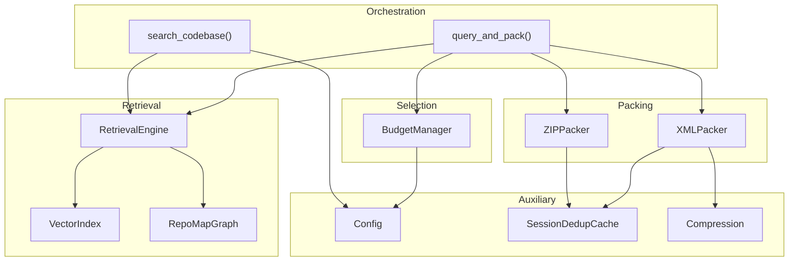
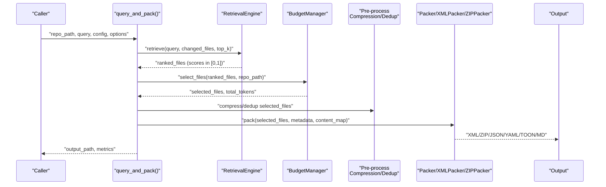
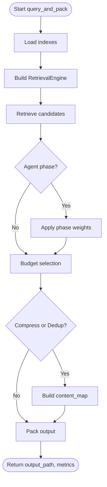
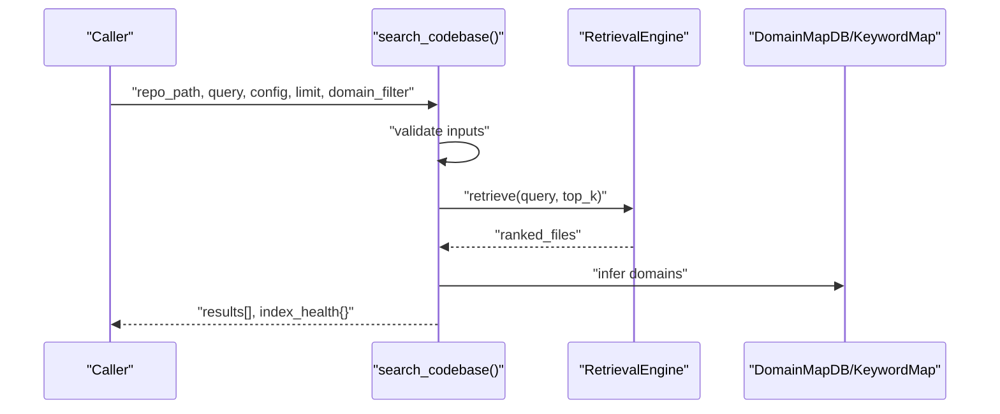
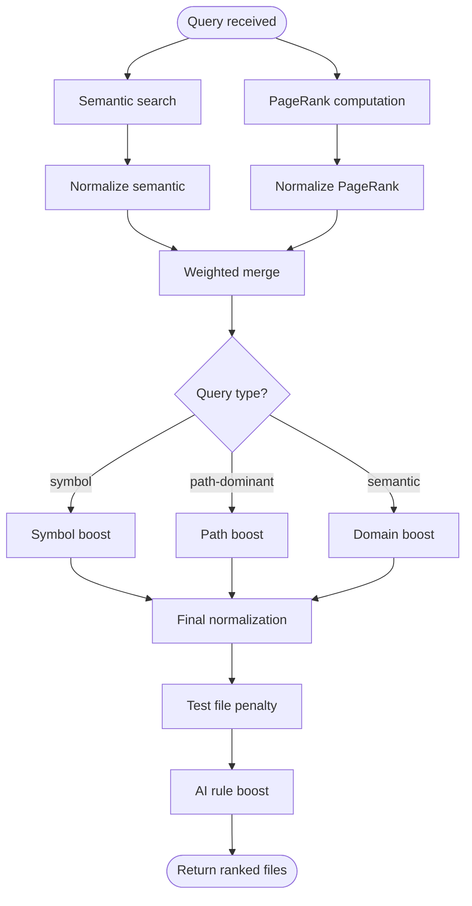
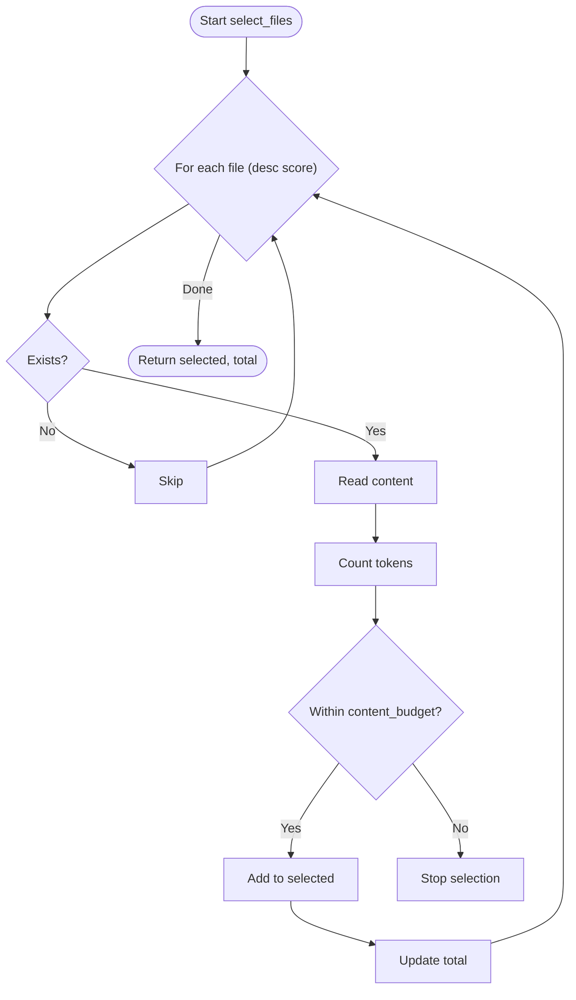
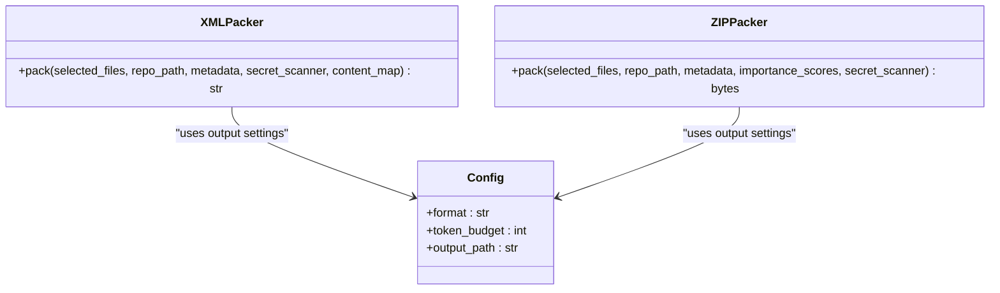
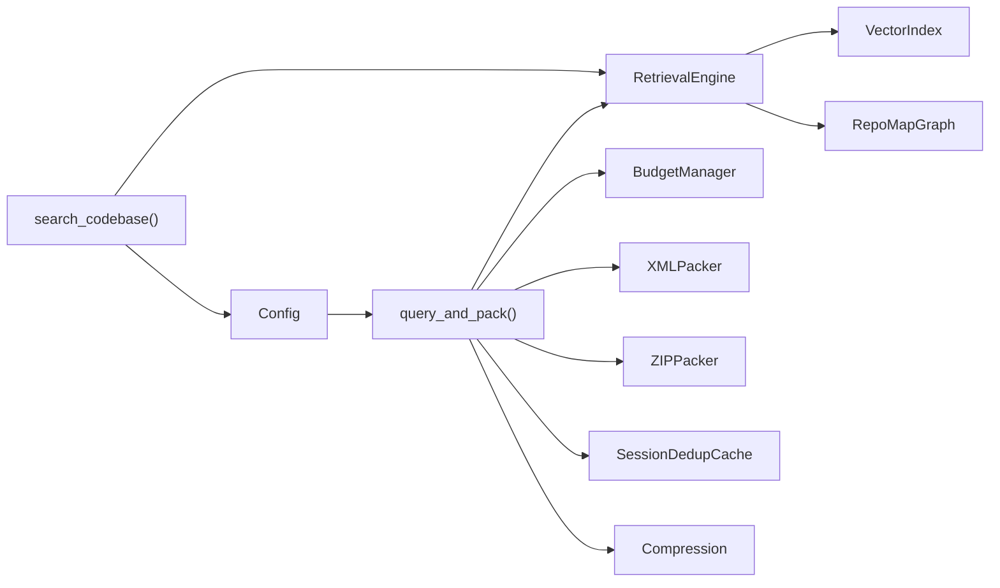

# Query Processing

<cite>
**Referenced Files in This Document**
- [query.py](file://src/ws_ctx_engine/workflow/query.py)
- [retrieval.py](file://src/ws_ctx_engine/retrieval/retrieval.py)
- [budget.py](file://src/ws_ctx_engine/budget/budget.py)
- [xml_packer.py](file://src/ws_ctx_engine/packer/xml_packer.py)
- [zip_packer.py](file://src/ws_ctx_engine/packer/zip_packer.py)
- [config.py](file://src/ws_ctx_engine/config/config.py)
- [phase_ranker.py](file://src/ws_ctx_engine/ranking/phase_ranker.py)
- [ranker.py](file://src/ws_ctx_engine/ranking/ranker.py)
- [dedup_cache.py](file://src/ws_ctx_engine/session/dedup_cache.py)
- [compressor.py](file://src/ws_ctx_engine/output/compressor.py)
- [tools.py](file://src/ws_ctx_engine/mcp/tools.py)
- [cli.py](file://src/ws_ctx_engine/cli/cli.py)
- [performance.md](file://docs/guides/performance.md)
- [budget.md](file://docs/reference/budget.md)
- [retrieval.md](file://docs/reference/retrieval.md)
- [architecture.md](file://docs/reference/architecture.md)
</cite>

## Table of Contents
1. [Introduction](#introduction)
2. [Project Structure](#project-structure)
3. [Core Components](#core-components)
4. [Architecture Overview](#architecture-overview)
5. [Detailed Component Analysis](#detailed-component-analysis)
6. [Dependency Analysis](#dependency-analysis)
7. [Performance Considerations](#performance-considerations)
8. [Troubleshooting Guide](#troubleshooting-guide)
9. [Conclusion](#conclusion)
10. [Appendices](#appendices)

## Introduction
This document explains the query processing phase of the workflow engine, focusing on how user queries are transformed into curated context packs. It covers:
- The query_and_pack function that orchestrates retrieval, budget selection, pre-processing, and output packing.
- The search_codebase function for direct codebase searches without user interaction.
- The hybrid ranking algorithm that combines vector similarity with PageRank and query-aware boosts.
- Token budget management and output formatting options.
- Configuration parameters, caching strategies, performance tips, and error handling.

## Project Structure
The query processing pipeline spans several modules:
- Workflow orchestration: query_and_pack and search_codebase
- Retrieval engine: hybrid semantic and structural ranking
- Budget management: greedy knapsack selection respecting token budgets
- Output packers: XML, ZIP, and structured text formats
- Configuration: weights, token budget, and output format
- Session-level deduplication and compression utilities
- CLI and MCP integration points

**Diagram sources**
- [query.py:230-617](file://src/ws_ctx_engine/workflow/query.py#L230-L617)
- [retrieval.py:140-368](file://src/ws_ctx_engine/retrieval/retrieval.py#L140-L368)
- [budget.py:8-105](file://src/ws_ctx_engine/budget/budget.py#L8-L105)
- [xml_packer.py:51-138](file://src/ws_ctx_engine/packer/xml_packer.py#L51-L138)
- [zip_packer.py:17-90](file://src/ws_ctx_engine/packer/zip_packer.py#L17-L90)
- [config.py:16-110](file://src/ws_ctx_engine/config/config.py#L16-L110)
- [dedup_cache.py:35-90](file://src/ws_ctx_engine/session/dedup_cache.py#L35-L90)
- [compressor.py:217-266](file://src/ws_ctx_engine/output/compressor.py#L217-L266)

**Section sources**
- [query.py:1-617](file://src/ws_ctx_engine/workflow/query.py#L1-L617)
- [retrieval.py:1-627](file://src/ws_ctx_engine/retrieval/retrieval.py#L1-L627)
- [budget.py:1-105](file://src/ws_ctx_engine/budget/budget.py#L1-L105)
- [xml_packer.py:1-239](file://src/ws_ctx_engine/packer/xml_packer.py#L1-L239)
- [zip_packer.py:1-254](file://src/ws_ctx_engine/packer/zip_packer.py#L1-L254)
- [config.py:1-399](file://src/ws_ctx_engine/config/config.py#L1-L399)
- [dedup_cache.py:1-154](file://src/ws_ctx_engine/session/dedup_cache.py#L1-L154)
- [compressor.py:1-266](file://src/ws_ctx_engine/output/compressor.py#L1-L266)

## Core Components
- query_and_pack: Full query-phase workflow from index loading to output generation, including budget-aware selection and pre-processing.
- search_codebase: Standalone search returning ranked files and index health metadata.
- RetrievalEngine: Hybrid ranking with semantic, structural, symbol/path/domain boosts, and test-file penalty.
- BudgetManager: Greedy knapsack selection preserving 80% budget for content.
- Packer modules: XMLPacker and ZIPPacker for XML and ZIP outputs; structured formatters for JSON/YAML/TOON/Markdown.
- Config: Centralized configuration for weights, token budget, and output format.
- SessionDedupCache: Lightweight session-level deduplication to reduce token usage across repeated calls.
- Compression: Relevance-aware compression to reduce token footprint while preserving recall.

**Section sources**
- [query.py:230-617](file://src/ws_ctx_engine/workflow/query.py#L230-L617)
- [retrieval.py:140-368](file://src/ws_ctx_engine/retrieval/retrieval.py#L140-L368)
- [budget.py:8-105](file://src/ws_ctx_engine/budget/budget.py#L8-L105)
- [xml_packer.py:51-138](file://src/ws_ctx_engine/packer/xml_packer.py#L51-L138)
- [zip_packer.py:17-90](file://src/ws_ctx_engine/packer/zip_packer.py#L17-L90)
- [config.py:16-110](file://src/ws_ctx_engine/config/config.py#L16-L110)
- [dedup_cache.py:35-90](file://src/ws_ctx_engine/session/dedup_cache.py#L35-L90)
- [compressor.py:217-266](file://src/ws_ctx_engine/output/compressor.py#L217-L266)

## Architecture Overview
The query processing architecture integrates retrieval, selection, pre-processing, and packing into a cohesive pipeline.

**Diagram sources**
- [query.py:230-617](file://src/ws_ctx_engine/workflow/query.py#L230-L617)
- [retrieval.py:250-368](file://src/ws_ctx_engine/retrieval/retrieval.py#L250-L368)
- [budget.py:50-105](file://src/ws_ctx_engine/budget/budget.py#L50-L105)
- [xml_packer.py:85-138](file://src/ws_ctx_engine/packer/xml_packer.py#L85-L138)
- [zip_packer.py:49-90](file://src/ws_ctx_engine/packer/zip_packer.py#L49-L90)

## Detailed Component Analysis

### query_and_pack: Full Query Phase Workflow
Responsibilities:
- Index loading with auto-detection and rebuild gating.
- Hybrid retrieval with optional phase-aware re-weighting.
- Budget-aware selection using greedy knapsack.
- Pre-processing: optional compression and session-level deduplication.
- Output packing in configured format (XML, ZIP, JSON, YAML, TOON, Markdown).

Key behaviors:
- Loads vector index, graph, and metadata; constructs RetrievalEngine with weights from Config.
- Applies optional phase-aware weighting via AgentPhase and PhaseWeightConfig.
- Uses BudgetManager to select files within token budget (80% content, 20% metadata).
- Builds content_map for pre-processing and optional session deduplication.
- Packs output and records performance metrics.

**Diagram sources**
- [query.py:294-617](file://src/ws_ctx_engine/workflow/query.py#L294-L617)
- [phase_ranker.py:96-122](file://src/ws_ctx_engine/ranking/phase_ranker.py#L96-L122)

**Section sources**
- [query.py:230-617](file://src/ws_ctx_engine/workflow/query.py#L230-L617)
- [phase_ranker.py:1-138](file://src/ws_ctx_engine/ranking/phase_ranker.py#L1-L138)

### search_codebase: Direct Codebase Search
Responsibilities:
- Validates inputs and loads indexes.
- Constructs RetrievalEngine with weights from Config.
- Retrieves ranked files with top_k expansion.
- Filters by domain filter and returns results plus index health metadata.

**Diagram sources**
- [query.py:158-227](file://src/ws_ctx_engine/workflow/query.py#L158-L227)
- [retrieval.py:250-368](file://src/ws_ctx_engine/retrieval/retrieval.py#L250-L368)

**Section sources**
- [query.py:158-227](file://src/ws_ctx_engine/workflow/query.py#L158-L227)

### Hybrid Ranking: Semantic + Structural + Query-Specific Boosts
RetrievalEngine implements:
- Semantic search via VectorIndex.
- Structural ranking via RepoMapGraph PageRank.
- Normalized merge with configurable weights.
- Query-aware boosts:
  - Symbol boost: exact matches between query tokens and defined symbols.
  - Path boost: keyword matches in file paths using exact, substring, and shared prefix heuristics.
  - Domain boost: files under directories matched by domain keywords.
- Test file penalty: multiplicative reduction for likely test files.
- AI rule boost: always push canonical AI rule files to the top.

**Diagram sources**
- [retrieval.py:250-368](file://src/ws_ctx_engine/retrieval/retrieval.py#L250-L368)
- [retrieval.md:152-318](file://docs/reference/retrieval.md#L152-L318)
- [architecture.md:182-221](file://docs/reference/architecture.md#L182-L221)

**Section sources**
- [retrieval.py:140-368](file://src/ws_ctx_engine/retrieval/retrieval.py#L140-L368)
- [retrieval.md:152-318](file://docs/reference/retrieval.md#L152-L318)
- [architecture.md:182-221](file://docs/reference/architecture.md#L182-L221)
- [ranker.py:28-86](file://src/ws_ctx_engine/ranking/ranker.py#L28-L86)

### Token Budget Management
BudgetManager enforces:
- 80% content budget and 20% metadata budget.
- Greedy knapsack selection over pre-sorted ranked files.
- Resilient token counting using tiktoken cl100k_base.
- Skips unreadable files without failing selection.

**Diagram sources**
- [budget.py:50-105](file://src/ws_ctx_engine/budget/budget.py#L50-L105)
- [budget.md:83-104](file://docs/reference/budget.md#L83-L104)

**Section sources**
- [budget.py:8-105](file://src/ws_ctx_engine/budget/budget.py#L8-L105)
- [budget.md:1-238](file://docs/reference/budget.md#L1-L238)

### Output Formatting Options
query_and_pack supports multiple output formats:
- XML: Repomix-style XML with metadata and file contents; optional context shuffling for model recall.
- ZIP: Archive with preserved directory structure and REVIEW_CONTEXT.md manifest.
- JSON/YAML/TOON/Markdown: Structured outputs with file payloads and metadata.

**Diagram sources**
- [xml_packer.py:51-138](file://src/ws_ctx_engine/packer/xml_packer.py#L51-L138)
- [zip_packer.py:17-90](file://src/ws_ctx_engine/packer/zip_packer.py#L17-L90)
- [config.py:28-31](file://src/ws_ctx_engine/config/config.py#L28-L31)

**Section sources**
- [query.py:504-587](file://src/ws_ctx_engine/workflow/query.py#L504-L587)
- [xml_packer.py:51-138](file://src/ws_ctx_engine/packer/xml_packer.py#L51-L138)
- [zip_packer.py:17-90](file://src/ws_ctx_engine/packer/zip_packer.py#L17-L90)
- [config.py:28-31](file://src/ws_ctx_engine/config/config.py#L28-L31)

### Configuration Parameters
Key configuration fields influencing query processing:
- format: Output format (xml, zip, json, yaml, md, toon)
- token_budget: Total token budget; 80% reserved for content
- semantic_weight, pagerank_weight: Hybrid ranking weights (must sum to 1.0)
- include_tests, respect_gitignore, include/exclude_patterns: Filtering controls
- backends: Backend selection for vector_index, graph, embeddings
- embeddings: Model/device/batch settings
- performance: cache_embeddings, incremental_index, max_workers
- ai_rules: Auto-detect and boost canonical AI rule files

Validation ensures types and ranges are sane; warnings are emitted for misconfiguration.

**Section sources**
- [config.py:16-399](file://src/ws_ctx_engine/config/config.py#L16-L399)

### Practical Examples
- Query patterns:
  - Natural language: “authentication logic” → hybrid ranking with symbol/path/domain boosts.
  - Identifier-heavy: “UserService createUser” → symbol boost favors files defining these identifiers.
  - Path-focused: “auth routes middleware” → path boost emphasizes relevant directories.
- Result filtering:
  - Domain filter narrows results to a specific domain inferred from path keywords.
  - include_tests toggles inclusion of test files.
- Output customization:
  - Change format to xml/zip/json/yaml/md/toon.
  - Adjust token_budget to fit downstream model constraints.
  - Use session_id to enable session-level deduplication and reduce token usage across repeated calls.

[No sources needed since this section provides general guidance]

### Integration Patterns
- CLI integration:
  - query_and_pack is invoked by CLI for interactive runs.
  - search_codebase is used for “search” command mode.
- MCP integration:
  - Tools expose search_codebase and pack_context with argument validation and error mapping.
- Agent workflows:
  - Phase-aware weighting adjusts ranking for discovery/edit/test phases.

**Section sources**
- [cli.py:551-592](file://src/ws_ctx_engine/cli/cli.py#L551-L592)
- [cli.py:861-887](file://src/ws_ctx_engine/cli/cli.py#L861-L887)
- [tools.py:167-230](file://src/ws_ctx_engine/mcp/tools.py#L167-L230)
- [tools.py:557-671](file://src/ws_ctx_engine/mcp/tools.py#L557-L671)
- [phase_ranker.py:96-122](file://src/ws_ctx_engine/ranking/phase_ranker.py#L96-L122)

## Dependency Analysis
Inter-module dependencies in query processing:

**Diagram sources**
- [query.py:194-227](file://src/ws_ctx_engine/workflow/query.py#L194-L227)
- [retrieval.py:191-237](file://src/ws_ctx_engine/retrieval/retrieval.py#L191-L237)
- [budget.py:32-49](file://src/ws_ctx_engine/budget/budget.py#L32-L49)
- [xml_packer.py:75-83](file://src/ws_ctx_engine/packer/xml_packer.py#L75-L83)
- [zip_packer.py:39-47](file://src/ws_ctx_engine/packer/zip_packer.py#L39-L47)
- [config.py:16-110](file://src/ws_ctx_engine/config/config.py#L16-L110)
- [dedup_cache.py:45-59](file://src/ws_ctx_engine/session/dedup_cache.py#L45-L59)
- [compressor.py:217-266](file://src/ws_ctx_engine/output/compressor.py#L217-L266)

**Section sources**
- [query.py:194-227](file://src/ws_ctx_engine/workflow/query.py#L194-L227)
- [retrieval.py:191-237](file://src/ws_ctx_engine/retrieval/retrieval.py#L191-L237)
- [budget.py:32-49](file://src/ws_ctx_engine/budget/budget.py#L32-L49)
- [xml_packer.py:75-83](file://src/ws_ctx_engine/packer/xml_packer.py#L75-L83)
- [zip_packer.py:39-47](file://src/ws_ctx_engine/packer/zip_packer.py#L39-L47)
- [config.py:16-110](file://src/ws_ctx_engine/config/config.py#L16-L110)
- [dedup_cache.py:45-59](file://src/ws_ctx_engine/session/dedup_cache.py#L45-L59)
- [compressor.py:217-266](file://src/ws_ctx_engine/output/compressor.py#L217-L266)

## Performance Considerations
- Rust hot-path acceleration:
  - Optional Rust extension improves file walking, gitignore matching, chunk hashing, and token counting by 8–20x.
  - Falls back to Python implementations automatically.
- Greedy knapsack:
  - Fast, near-optimal selection given pre-sorted ranked files.
- Compression and deduplication:
  - Relevance-aware compression reduces tokens for medium/low-ranked files.
  - Session-level deduplication replaces repeated content with markers.
- Token budget allocation:
  - 80% content budget and 20% metadata budget balances context and manifest sizes.

**Section sources**
- [performance.md:1-81](file://docs/guides/performance.md#L1-L81)
- [budget.md:83-104](file://docs/reference/budget.md#L83-L104)
- [compressor.py:217-266](file://src/ws_ctx_engine/output/compressor.py#L217-L266)
- [dedup_cache.py:35-90](file://src/ws_ctx_engine/session/dedup_cache.py#L35-L90)

## Troubleshooting Guide
Common issues and resolutions:
- Indexes not found:
  - query_and_pack raises FileNotFoundError; run indexing first.
- Invalid repository path:
  - Both query_and_pack and search_codebase validate paths and raise ValueError.
- Empty retrieval results:
  - RetrievalEngine warns and continues; verify query and index quality.
- Malformed arguments (MCP):
  - Tools validate inputs and return structured errors; ensure query, limit, and format meet constraints.
- Budget exceeded:
  - BudgetManager stops selection early; adjust token_budget or refine query.

**Section sources**
- [query.py:316-322](file://src/ws_ctx_engine/workflow/query.py#L316-L322)
- [query.py:166-176](file://src/ws_ctx_engine/workflow/query.py#L166-L176)
- [retrieval.py:297-299](file://src/ws_ctx_engine/retrieval/retrieval.py#L297-L299)
- [tools.py:186-222](file://src/ws_ctx_engine/mcp/tools.py#L186-L222)

## Conclusion
The query processing phase delivers robust, configurable, and efficient context curation:
- Hybrid ranking blends semantic and structural signals with query-aware boosts.
- Token budget management ensures outputs fit downstream constraints.
- Multiple output formats and pre-processing options tailor context to agent workflows.
- Caching and compression strategies optimize cost and performance for repeated usage.

[No sources needed since this section summarizes without analyzing specific files]

## Appendices

### Configuration Reference
- format: Output format selector.
- token_budget: Total tokens; 80% for content.
- semantic_weight, pagerank_weight: Must sum to 1.0.
- include_tests, respect_gitignore, include/exclude_patterns: File filtering.
- backends: Backend choices for vector_index, graph, embeddings.
- embeddings: Model/device/batch configuration.
- performance: cache_embeddings, incremental_index, max_workers.
- ai_rules: Auto-detect and boost canonical AI rule files.

**Section sources**
- [config.py:28-399](file://src/ws_ctx_engine/config/config.py#L28-L399)

### CLI and MCP Usage Notes
- CLI invokes query_and_pack for interactive runs and search_codebase for “search” mode.
- MCP tools validate arguments and map errors to standardized payloads.

**Section sources**
- [cli.py:551-592](file://src/ws_ctx_engine/cli/cli.py#L551-L592)
- [cli.py:861-887](file://src/ws_ctx_engine/cli/cli.py#L861-L887)
- [tools.py:167-230](file://src/ws_ctx_engine/mcp/tools.py#L167-L230)
- [tools.py:557-671](file://src/ws_ctx_engine/mcp/tools.py#L557-L671)