# Workflow Engine

<cite>
**Referenced Files in This Document**
- [workflow/indexer.py](file://src/ws_ctx_engine/workflow/indexer.py)
- [workflow/query.py](file://src/ws_ctx_engine/workflow/query.py)
- [workflow/__init__.py](file://src/ws_ctx_engine/workflow/__init__.py)
- [vector_index/vector_index.py](file://src/ws_ctx_engine/vector_index/vector_index.py)
- [vector_index/embedding_cache.py](file://src/ws_ctx_engine/vector_index/embedding_cache.py)
- [retrieval/retrieval.py](file://src/ws_ctx_engine/retrieval/retrieval.py)
- [budget/budget.py](file://src/ws_ctx_engine/budget/budget.py)
- [packer/xml_packer.py](file://src/ws_ctx_engine/packer/xml_packer.py)
- [packer/zip_packer.py](file://src/ws_ctx_engine/packer/zip_packer.py)
- [models/models.py](file://src/ws_ctx_engine/models/models.py)
- [config/config.py](file://src/ws_ctx_engine/config/config.py)
- [monitoring/performance.py](file://src/ws_ctx_engine/monitoring/performance.py)
- [cli/cli.py](file://src/ws_ctx_engine/cli/cli.py)
- [graph/builder.py](file://src/ws_ctx_engine/graph/builder.py)
- [graph/cozo_store.py](file://src/ws_ctx_engine/graph/cozo_store.py)
- [graph/context_assembler.py](file://src/ws_ctx_engine/graph/context_assembler.py)
- [graph/signal_router.py](file://src/ws_ctx_engine/graph/signal_router.py)
- [graph/node_id.py](file://src/ws_ctx_engine/graph/node_id.py)
- [graph/validation.py](file://src/ws_ctx_engine/graph/validation.py)
- [graph/symbol_index.py](file://src/ws_ctx_engine/graph/symbol_index.py)
- [mcp/graph_tools.py](file://src/ws_ctx_engine/mcp/graph_tools.py)
- [docs/reference/workflow.md](file://docs/reference/workflow.md)
</cite>

## Update Summary
**Changes Made**
- Updated indexing phase to integrate GraphStore building seamlessly with existing pipeline
- Enhanced query workflow with graph augmentation capabilities through ContextAssembler
- Added comprehensive testing infrastructure for graph operations and MCP integration
- Integrated signal routing for intelligent graph query classification
- Added graceful degradation mechanisms for graph store failures

## Table of Contents
1. [Introduction](#introduction)
2. [Project Structure](#project-structure)
3. [Core Components](#core-components)
4. [Architecture Overview](#architecture-overview)
5. [Detailed Component Analysis](#detailed-component-analysis)
6. [Dependency Analysis](#dependency-analysis)
7. [Performance Considerations](#performance-considerations)
8. [Troubleshooting Guide](#troubleshooting-guide)
9. [Conclusion](#conclusion)
10. [Appendices](#appendices)

## Introduction
This document explains the workflow engine module that powers the indexing and querying pipeline for codebases. It covers the indexing phase (parsing, vector index building, graph construction, GraphStore building, metadata persistence, and domain keyword mapping), the query phase (loading indexes, hybrid retrieval, graph augmentation, budget-aware selection, and output packing), and the orchestration across components. It also documents configuration options, error handling, performance optimization, memory management, caching strategies, and incremental indexing capabilities.

## Project Structure
The workflow engine is organized around two primary modules with integrated graph capabilities:
- Indexing workflow: index_repository() and load_indexes() with GraphStore integration
- Query workflow: query_and_pack() and search_codebase() with graph augmentation

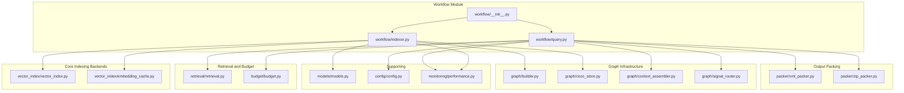

**Diagram sources**
- [workflow/__init__.py:1-5](file://src/ws_ctx_engine/workflow/__init__.py#L1-L5)
- [workflow/indexer.py:1-563](file://src/ws_ctx_engine/workflow/indexer.py#L1-L563)
- [workflow/query.py:1-730](file://src/ws_ctx_engine/workflow/query.py#L1-L730)
- [vector_index/vector_index.py:1-800](file://src/ws_ctx_engine/vector_index/vector_index.py#L1-L800)
- [vector_index/embedding_cache.py:1-127](file://src/ws_ctx_engine/vector_index/embedding_cache.py#L1-L127)
- [graph/builder.py:1-159](file://src/ws_ctx_engine/graph/builder.py#L1-L159)
- [graph/cozo_store.py:1-364](file://src/ws_ctx_engine/graph/cozo_store.py#L1-L364)
- [graph/context_assembler.py:1-167](file://src/ws_ctx_engine/graph/context_assembler.py#L1-L167)
- [graph/signal_router.py:1-133](file://src/ws_ctx_engine/graph/signal_router.py#L1-L133)

**Section sources**
- [workflow/__init__.py:1-5](file://src/ws_ctx_engine/workflow/__init__.py#L1-L5)
- [docs/reference/workflow.md:1-410](file://docs/reference/workflow.md#L1-L410)

## Core Components
- index_repository(repo_path, config=None, index_dir=".ws-ctx-engine", domain_only=False, incremental=False) -> PerformanceTracker
  - Builds and persists indexes for later queries. Phases include parsing with AST chunker, vector index construction, graph building, GraphStore creation, metadata saving, and domain keyword map persistence.
- load_indexes(repo_path, index_dir=".ws-ctx-engine", auto_rebuild=True, config=None) -> (VectorIndex, RepoMapGraph, IndexMetadata)
  - Loads persisted indexes, detects staleness, and optionally rebuilds automatically.
- query_and_pack(repo_path, query=None, changed_files=None, config=None, index_dir=".ws-ctx-engine", secrets_scan=False, compress=False, shuffle=True, agent_phase=None, session_id=None) -> (output_path, metrics_dict)
  - Orchestrates loading indexes, hybrid retrieval, graph augmentation, budget selection, and output packing in XML/ZIP/JSON/MD/TOON formats.
- search_codebase(repo_path, query, config=None, limit=10, domain_filter=None, index_dir=".ws-ctx-engine") -> (results, index_health)
  - High-level programmatic search returning ranked files with domain inference, graph augmentation, and index health.

Key orchestration responsibilities:
- Workflow module exports the four primary functions and exposes them to CLI and integrations.
- Indexing phase writes .ws-ctx-engine/ with vector.idx, graph.pkl, graph.db, metadata.json, and domain_map.db.
- Query phase reads these artifacts, runs hybrid retrieval, applies graph augmentation, enforces token budget, and packs outputs.

**Section sources**
- [workflow/indexer.py:72-563](file://src/ws_ctx_engine/workflow/indexer.py#L72-L563)
- [workflow/indexer.py:474-563](file://src/ws_ctx_engine/workflow/indexer.py#L474-L563)
- [workflow/query.py:210-730](file://src/ws_ctx_engine/workflow/query.py#L210-L730)
- [workflow/query.py:158-227](file://src/ws_ctx_engine/workflow/query.py#L158-L227)
- [workflow/__init__.py:1-5](file://src/ws_ctx_engine/workflow/__init__.py#L1-L5)

## Architecture Overview
The workflow engine coordinates parsing, indexing, retrieval, graph augmentation, budgeting, and output generation. The CLI integrates with these functions to provide a cohesive developer experience with comprehensive graph capabilities.

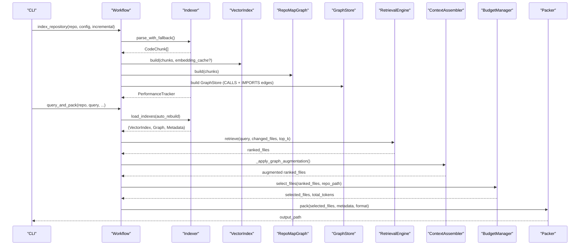

**Diagram sources**
- [workflow/indexer.py:72-563](file://src/ws_ctx_engine/workflow/indexer.py#L72-L563)
- [workflow/query.py:210-730](file://src/ws_ctx_engine/workflow/query.py#L210-L730)
- [cli/cli.py:406-800](file://src/ws_ctx_engine/cli/cli.py#L406-L800)

## Detailed Component Analysis

### Indexing Phase: index_repository
Responsibilities:
- Parse codebase into CodeChunk objects using AST chunker with fallback.
- Build vector index (LEANNIndex or FAISSIndex) with optional embedding cache.
- Build RepoMap graph (fallback supported).
- **NEW**: Build GraphStore with CALLS and IMPORTS edges via CozoDB (graceful degradation).
- Persist metadata.json for staleness detection.
- Build and persist domain keyword map database.

Incremental indexing:
- Compares stored file hashes against current disk state to detect changed/deleted files.
- When enabled and supported, rebuilds only changed files and updates the vector index incrementally.
- Uses embedding cache to avoid re-embedding unchanged files.
- **NEW**: Supports incremental GraphStore updates by removing stale file data before re-insertion.

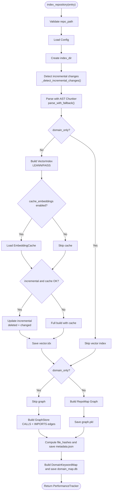

**Diagram sources**
- [workflow/indexer.py:72-563](file://src/ws_ctx_engine/workflow/indexer.py#L72-L563)
- [vector_index/embedding_cache.py:55-84](file://src/ws_ctx_engine/vector_index/embedding_cache.py#L55-L84)
- [vector_index/vector_index.py:506-800](file://src/ws_ctx_engine/vector_index/vector_index.py#L506-L800)
- [graph/builder.py:108-159](file://src/ws_ctx_engine/graph/builder.py#L108-L159)
- [graph/cozo_store.py:59-364](file://src/ws_ctx_engine/graph/cozo_store.py#L59-L364)

**Section sources**
- [workflow/indexer.py:72-563](file://src/ws_ctx_engine/workflow/indexer.py#L72-L563)
- [vector_index/embedding_cache.py:1-127](file://src/ws_ctx_engine/vector_index/embedding_cache.py#L1-L127)
- [vector_index/vector_index.py:282-504](file://src/ws_ctx_engine/vector_index/vector_index.py#L282-L504)
- [vector_index/vector_index.py:506-800](file://src/ws_ctx_engine/vector_index/vector_index.py#L506-L800)
- [models/models.py:87-152](file://src/ws_ctx_engine/models/models.py#L87-L152)
- [graph/builder.py:1-159](file://src/ws_ctx_engine/graph/builder.py#L1-L159)
- [graph/cozo_store.py:1-364](file://src/ws_ctx_engine/graph/cozo_store.py#L1-L364)

### Index Loading and Staleness Detection: load_indexes
Responsibilities:
- Verify presence of vector.idx, graph.pkl, metadata.json, and GraphStore database.
- Load metadata and detect staleness via file hash comparison.
- Optionally rebuild indexes automatically and reload.

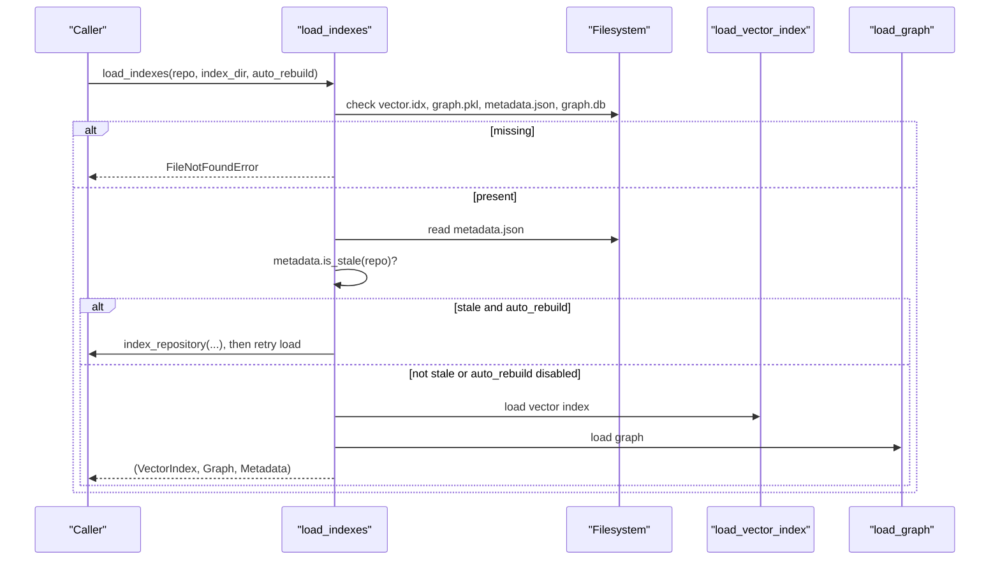

**Diagram sources**
- [workflow/indexer.py:474-563](file://src/ws_ctx_engine/workflow/indexer.py#L474-L563)

**Section sources**
- [workflow/indexer.py:474-563](file://src/ws_ctx_engine/workflow/indexer.py#L474-L563)
- [models/models.py:87-152](file://src/ws_ctx_engine/models/models.py#L87-L152)

### Query Phase: query_and_pack
Responsibilities:
- Load indexes with staleness detection.
- Hybrid retrieval combining semantic similarity and PageRank.
- **NEW**: Graph augmentation using ContextAssembler with intelligent query routing.
- Budget-aware file selection using greedy knapsack with token budget.
- Output packing in XML, ZIP, JSON, YAML, MD, or TOON formats.
- Optional pre-processing: compression, session-level deduplication, and shuffling for model recall.

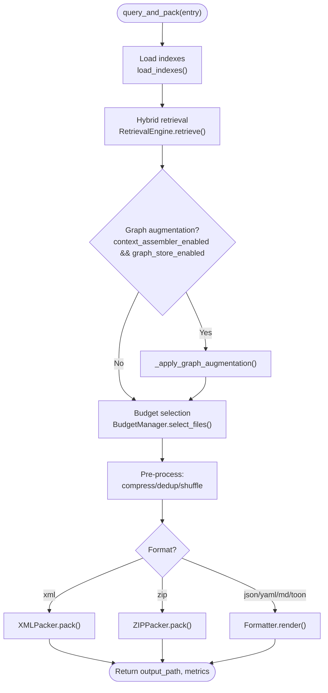

**Diagram sources**
- [workflow/query.py:210-730](file://src/ws_ctx_engine/workflow/query.py#L210-L730)
- [retrieval/retrieval.py:250-368](file://src/ws_ctx_engine/retrieval/retrieval.py#L250-L368)
- [budget/budget.py:50-105](file://src/ws_ctx_engine/budget/budget.py#L50-L105)
- [packer/xml_packer.py:85-137](file://src/ws_ctx_engine/packer/xml_packer.py#L85-L137)
- [packer/zip_packer.py:49-90](file://src/ws_ctx_engine/packer/zip_packer.py#L49-L90)
- [graph/context_assembler.py:29-167](file://src/ws_ctx_engine/graph/context_assembler.py#L29-L167)
- [graph/signal_router.py:88-133](file://src/ws_ctx_engine/graph/signal_router.py#L88-L133)

**Section sources**
- [workflow/query.py:210-730](file://src/ws_ctx_engine/workflow/query.py#L210-L730)
- [retrieval/retrieval.py:140-627](file://src/ws_ctx_engine/retrieval/retrieval.py#L140-L627)
- [budget/budget.py:1-105](file://src/ws_ctx_engine/budget/budget.py#L1-105)
- [packer/xml_packer.py:1-239](file://src/ws_ctx_engine/packer/xml_packer.py#L1-L239)
- [packer/zip_packer.py:1-254](file://src/ws_ctx_engine/packer/zip_packer.py#L1-L254)
- [graph/context_assembler.py:1-167](file://src/ws_ctx_engine/graph/context_assembler.py#L1-L167)
- [graph/signal_router.py:1-133](file://src/ws_ctx_engine/graph/signal_router.py#L1-L133)

### Programmatic Search: search_codebase
Responsibilities:
- High-level search API returning ranked files with inferred domains, graph augmentation, and index health.

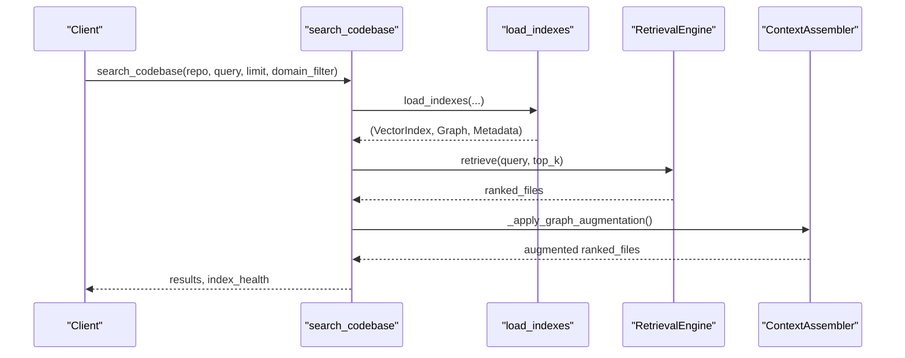

**Diagram sources**
- [workflow/query.py:210-310](file://src/ws_ctx_engine/workflow/query.py#L210-L310)

**Section sources**
- [workflow/query.py:210-310](file://src/ws_ctx_engine/workflow/query.py#L210-L310)

### Graph Augmentation Pipeline
**NEW**: The query workflow now includes sophisticated graph augmentation capabilities:

- **Signal Routing**: Intelligent query intent classification using regex patterns to detect cross-file questions.
- **Context Assembly**: Pure score merger that augments vector retrieval results with graph query results.
- **Graceful Degradation**: Non-fatal failures that fall back to vector-only results.
- **Weighted Merging**: Graph results contribute with configurable weight relative to vector scores.

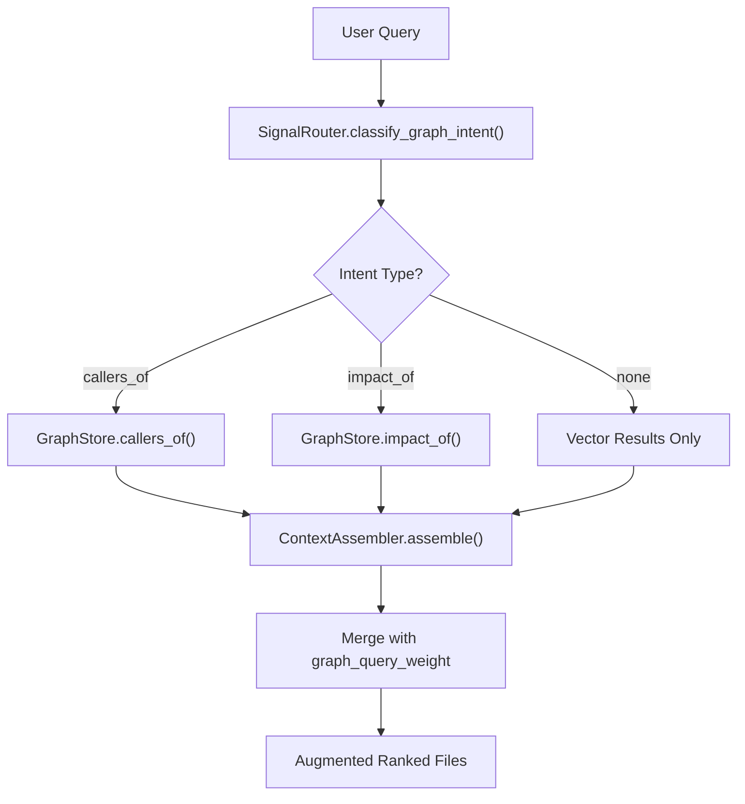

**Diagram sources**
- [workflow/query.py:46-76](file://src/ws_ctx_engine/workflow/query.py#L46-L76)
- [graph/signal_router.py:88-133](file://src/ws_ctx_engine/graph/signal_router.py#L88-L133)
- [graph/context_assembler.py:29-167](file://src/ws_ctx_engine/graph/context_assembler.py#L29-L167)
- [graph/cozo_store.py:247-274](file://src/ws_ctx_engine/graph/cozo_store.py#L247-274)

**Section sources**
- [workflow/query.py:46-76](file://src/ws_ctx_engine/workflow/query.py#L46-L76)
- [graph/signal_router.py:1-133](file://src/ws_ctx_engine/graph/signal_router.py#L1-L133)
- [graph/context_assembler.py:1-167](file://src/ws_ctx_engine/graph/context_assembler.py#L1-L167)
- [graph/cozo_store.py:1-364](file://src/ws_ctx_engine/graph/cozo_store.py#L1-L364)

### Vector Index Backends and Embedding Cache
- VectorIndex abstract base with LEANNIndex and FAISSIndex implementations.
- EmbeddingGenerator handles local model and API fallback with memory-aware checks.
- EmbeddingCache persists content-hash → embedding mappings to accelerate incremental rebuilds.

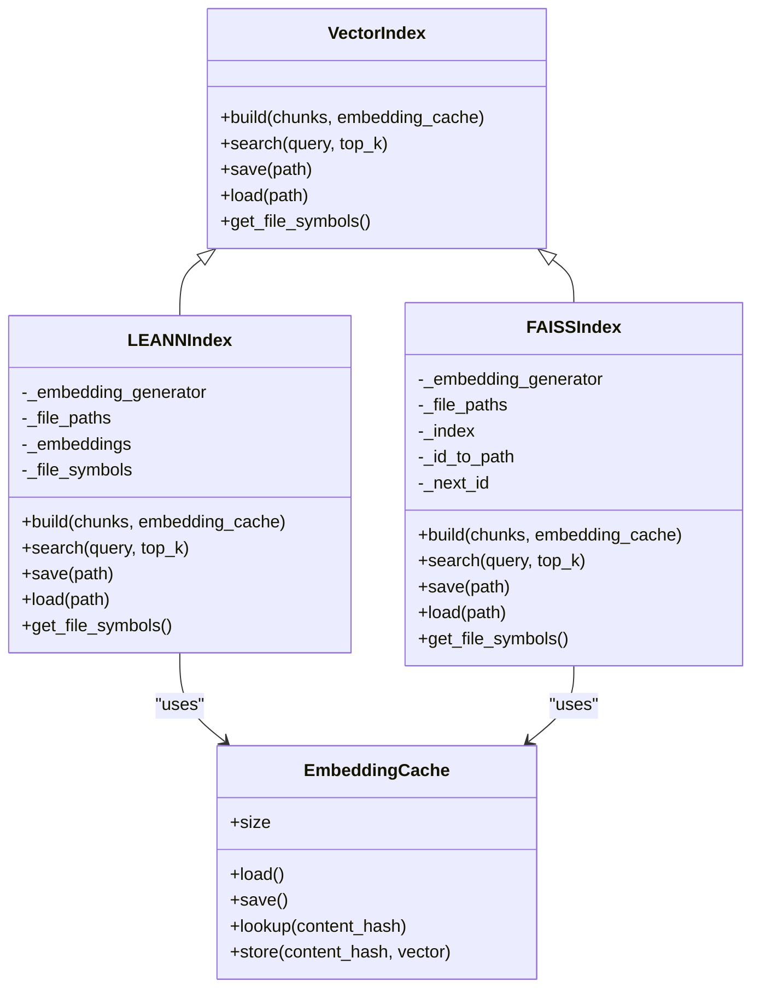

**Diagram sources**
- [vector_index/vector_index.py:21-84](file://src/ws_ctx_engine/vector_index/vector_index.py#L21-L84)
- [vector_index/vector_index.py:282-504](file://src/ws_ctx_engine/vector_index/vector_index.py#L282-L504)
- [vector_index/vector_index.py:506-800](file://src/ws_ctx_engine/vector_index/vector_index.py#L506-L800)
- [vector_index/embedding_cache.py:28-127](file://src/ws_ctx_engine/vector_index/embedding_cache.py#L28-L127)

**Section sources**
- [vector_index/vector_index.py:1-800](file://src/ws_ctx_engine/vector_index/vector_index.py#L1-L800)
- [vector_index/embedding_cache.py:1-127](file://src/ws_ctx_engine/vector_index/embedding_cache.py#L1-L127)

### Retrieval Engine and Budget Management
- RetrievalEngine merges semantic similarity and PageRank scores, applies symbol/path/domain boosts, and penalizes test files.
- BudgetManager greedily selects files within token budget, reserving 20% for metadata.

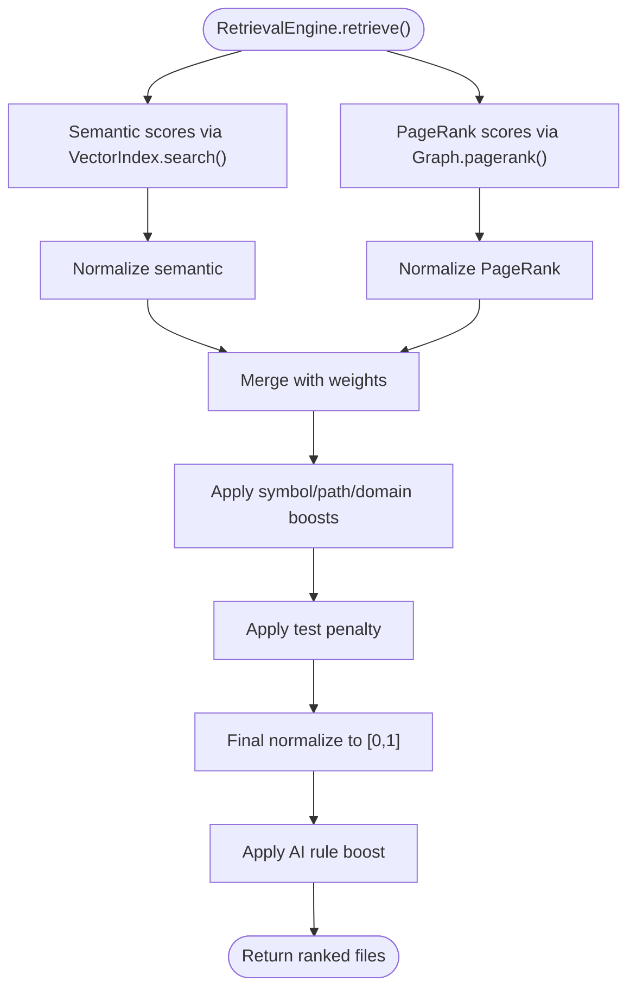

**Diagram sources**
- [retrieval/retrieval.py:250-368](file://src/ws_ctx_engine/retrieval/retrieval.py#L250-L368)

**Section sources**
- [retrieval/retrieval.py:140-627](file://src/ws_ctx_engine/retrieval/retrieval.py#L140-L627)
- [budget/budget.py:1-105](file://src/ws_ctx_engine/budget/budget.py#L1-L105)

### Output Packing
- XMLPacker: Generates Repomix-style XML with metadata and file contents; supports shuffling to mitigate "Lost in the Middle."
- ZIPPacker: Creates ZIP with preserved directory structure and REVIEW_CONTEXT.md manifest.

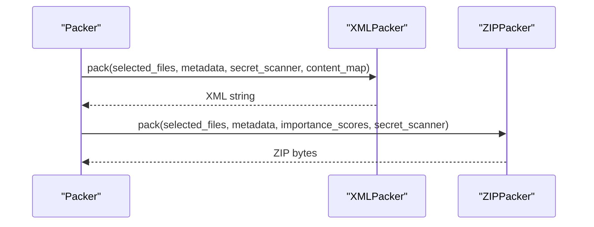

**Diagram sources**
- [packer/xml_packer.py:85-137](file://src/ws_ctx_engine/packer/xml_packer.py#L85-L137)
- [packer/zip_packer.py:49-90](file://src/ws_ctx_engine/packer/zip_packer.py#L49-L90)

**Section sources**
- [packer/xml_packer.py:1-239](file://src/ws_ctx_engine/packer/xml_packer.py#L1-L239)
- [packer/zip_packer.py:1-254](file://src/ws_ctx_engine/packer/zip_packer.py#L1-L254)

### Graph Infrastructure Components
**NEW**: Comprehensive graph infrastructure for advanced codebase exploration:

- **Graph Builder**: Converts CodeChunk objects to graph representation with CONTAINS, CALLS, and IMPORTS edges.
- **GraphStore**: CozoDB-backed persistent graph storage with multiple storage backends (memory, RocksDB, SQLite).
- **Context Assembler**: Merges vector and graph results with configurable weighting.
- **Signal Router**: Regex-based query intent classification for intelligent graph augmentation.
- **Validation**: Graph validation with warnings and error reporting.

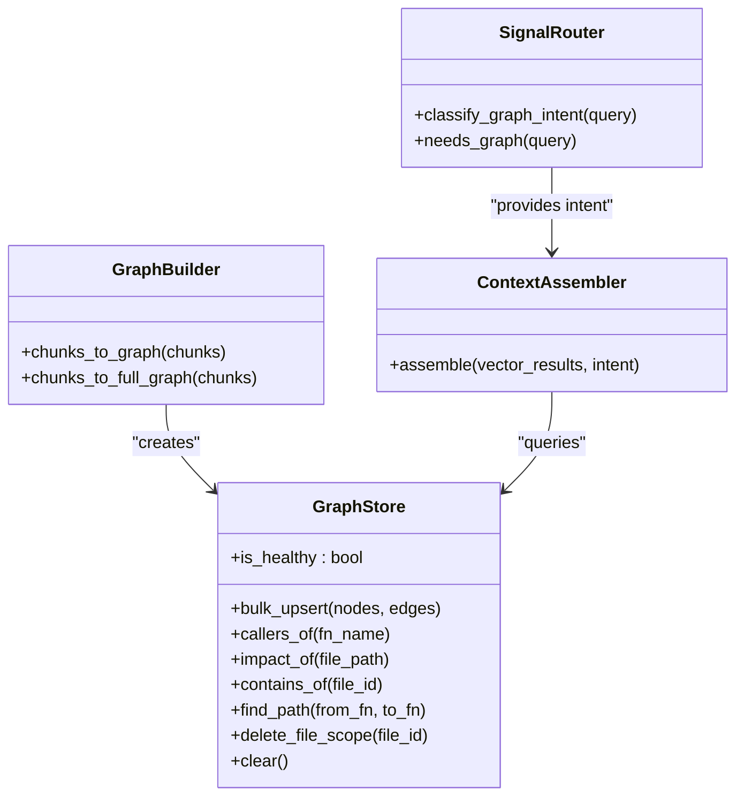

**Diagram sources**
- [graph/builder.py:56-159](file://src/ws_ctx_engine/graph/builder.py#L56-L159)
- [graph/cozo_store.py:59-364](file://src/ws_ctx_engine/graph/cozo_store.py#L59-L364)
- [graph/context_assembler.py:29-167](file://src/ws_ctx_engine/graph/context_assembler.py#L29-L167)
- [graph/signal_router.py:88-133](file://src/ws_ctx_engine/graph/signal_router.py#L88-L133)

**Section sources**
- [graph/builder.py:1-159](file://src/ws_ctx_engine/graph/builder.py#L1-L159)
- [graph/cozo_store.py:1-364](file://src/ws_ctx_engine/graph/cozo_store.py#L1-L364)
- [graph/context_assembler.py:1-167](file://src/ws_ctx_engine/graph/context_assembler.py#L1-L167)
- [graph/signal_router.py:1-133](file://src/ws_ctx_engine/graph/signal_router.py#L1-L133)

## Dependency Analysis
- Workflow module depends on:
  - Vector index backends (LEANNIndex/FAISSIndex) and embedding cache for incremental builds.
  - Retrieval engine for hybrid ranking.
  - Budget manager for token-aware selection.
  - Packer implementations for output formats.
  - **NEW**: Graph infrastructure (builder, store, assembler, router) for advanced codebase exploration.
  - Configuration and performance tracking.
- CLI integrates with workflow functions to expose commands for indexing, searching, querying, and graph operations.
- **NEW**: MCP integration with dedicated graph tools for external tool consumption.

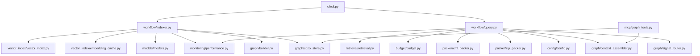

**Diagram sources**
- [workflow/indexer.py:14-24](file://src/ws_ctx_engine/workflow/indexer.py#L14-L24)
- [workflow/query.py:13-22](file://src/ws_ctx_engine/workflow/query.py#L13-L22)
- [cli/cli.py:22-25](file://src/ws_ctx_engine/cli/cli.py#L22-L25)
- [mcp/graph_tools.py:1-103](file://src/ws_ctx_engine/mcp/graph_tools.py#L1-L103)

**Section sources**
- [workflow/indexer.py:1-563](file://src/ws_ctx_engine/workflow/indexer.py#L1-L563)
- [workflow/query.py:1-730](file://src/ws_ctx_engine/workflow/query.py#L1-L730)
- [cli/cli.py:1-800](file://src/ws_ctx_engine/cli/cli.py#L1-L800)
- [mcp/graph_tools.py:1-103](file://src/ws_ctx_engine/mcp/graph_tools.py#L1-L103)

## Performance Considerations
- Incremental indexing:
  - Detects changed/deleted files and rebuilds only affected parts.
  - Uses embedding cache to avoid re-embedding unchanged files.
  - **NEW**: Supports incremental GraphStore updates by removing stale file data before re-insertion.
- Memory management:
  - EmbeddingGenerator checks available memory and falls back to API when needed.
  - PerformanceTracker records peak memory usage when psutil is available.
  - **NEW**: GraphStore supports multiple storage backends with different memory footprints.
- Token budgeting:
  - BudgetManager reserves 20% of budget for metadata and uses 80% for content.
  - Greedy selection maximizes total importance within token limits.
- Output optimization:
  - XMLPacker supports shuffling to improve recall.
  - Optional compression and session-level deduplication reduce output size.
- **NEW**: Graph augmentation performance:
  - Graceful degradation ensures query completion even with unhealthy graph store.
  - Configurable graph_query_weight balances vector and graph contributions.

[No sources needed since this section provides general guidance]

## Troubleshooting Guide
Common issues and resolutions:
- Indexes not found:
  - Run index_repository() first to build indexes.
- Stale indexes:
  - load_indexes() can auto-rebuild; otherwise, rebuild manually.
- Out of memory during embedding:
  - EmbeddingGenerator falls back to API; adjust device/batch_size or use API provider.
- Invalid configuration:
  - Config.load() validates fields; ensure weights sum to 1.0 and patterns are lists.
- Missing dependencies:
  - CLI doctor command reports availability; install recommended extras.
- **NEW**: Graph store issues:
  - GraphStore.init failures are handled gracefully; check pycozo installation.
  - Use mem storage for testing; configure rocksdb/sqlite for production.
  - Verify graph_store_path permissions and disk space.
- **NEW**: Graph augmentation failures:
  - Query routing failures fall back to vector-only results.
  - Check graph_query_weight configuration (0.0-1.0 range).
  - Verify graph_store_enabled setting matches deployment environment.

**Section sources**
- [workflow/query.py:316-322](file://src/ws_ctx_engine/workflow/query.py#L316-L322)
- [workflow/indexer.py:456-467](file://src/ws_ctx_engine/workflow/indexer.py#L456-L467)
- [vector_index/vector_index.py:130-251](file://src/ws_ctx_engine/vector_index/vector_index.py#L130-L251)
- [config/config.py:133-138](file://src/ws_ctx_engine/config/config.py#L133-L138)
- [graph/cozo_store.py:78-83](file://src/ws_ctx_engine/graph/cozo_store.py#L78-L83)
- [cli/cli.py:329-364](file://src/ws_ctx_engine/cli/cli.py#L329-L364)

## Conclusion
The workflow engine provides a robust, configurable pipeline for indexing and querying codebases with comprehensive graph capabilities. It emphasizes incremental builds, hybrid retrieval, graph augmentation, token-aware selection, and flexible output formats. With strong error handling, performance tracking, caching strategies, and graceful degradation for graph operations, it scales from small repositories to large codebases while maintaining developer productivity and enabling advanced codebase exploration through intelligent graph augmentation.

[No sources needed since this section summarizes without analyzing specific files]

## Appendices

### Practical Usage Examples
- Index repository:
  - CLI: ws-ctx-engine index /path/to/repo [--incremental]
  - Programmatic: index_repository(repo_path, config, incremental=True)
- Query and pack:
  - CLI: ws-ctx-engine query "authentication logic" --repo /path/to/repo --format xml --budget 50000
  - Programmatic: query_and_pack(repo_path, query="...", config, compress=True, shuffle=True)
- Programmatic search:
  - results, health = search_codebase(repo_path, query="...", limit=20, domain_filter="database")
- **NEW**: Graph operations:
  - Direct GraphStore queries for cross-file analysis
  - ContextAssembler for custom graph-augmented retrieval
  - SignalRouter for intent classification

**Section sources**
- [docs/reference/workflow.md:374-410](file://docs/reference/workflow.md#L374-L410)
- [cli/cli.py:406-800](file://src/ws_ctx_engine/cli/cli.py#L406-L800)

### Configuration Options
- Output settings: format, token_budget, output_path
- Scoring weights: semantic_weight, pagerank_weight (must sum to 1.0)
- File filtering: include_tests, respect_gitignore, include_patterns, exclude_patterns
- Backends: vector_index, graph, embeddings
- Embeddings: model, device, batch_size, api_provider, api_key_env
- Performance: max_workers, cache_embeddings, incremental_index
- AI rules: auto_detect, extra_files, boost
- **NEW**: Graph store settings: graph_store_enabled, graph_store_storage, graph_store_path
- **NEW**: Graph augmentation: context_assembler_enabled, graph_query_weight (0.0-1.0)

**Section sources**
- [config/config.py:16-429](file://src/ws_ctx_engine/config/config.py#L16-L429)

### Integration Patterns
- CLI integration: Commands index, search, query, mcp delegate to workflow functions.
- Agent workflows: --agent-mode emits NDJSON; MCP server exposes tools with rate limiting.
- Domain-aware ranking: DomainKeywordMap enhances retrieval with domain boosts.
- **NEW**: Graph tool integration: MCP graph_tools provide find_callers, impact_analysis, graph_search, and call_chain operations.
- **NEW**: External tool consumption: Dedicated graph APIs for IDEs, editors, and CI/CD pipelines.

**Section sources**
- [cli/cli.py:406-800](file://src/ws_ctx_engine/cli/cli.py#L406-L800)
- [retrieval/retrieval.py:250-368](file://src/ws_ctx_engine/retrieval/retrieval.py#L250-L368)
- [mcp/graph_tools.py:1-103](file://src/ws_ctx_engine/mcp/graph_tools.py#L1-L103)

### Testing Infrastructure
**NEW**: Comprehensive testing framework covering:
- Integration tests for GraphStore building and querying
- MCP graph tools integration testing
- Graceful degradation scenarios
- Performance benchmarking
- Stress testing for concurrent operations

Testing coverage includes:
- GraphStore initialization with different storage backends
- Cross-file function call detection and analysis
- Impact analysis for dependency tracking
- Call chain tracing between functions
- Error handling and fallback mechanisms
- Performance regression testing

**Section sources**
- [tests/integration/test_graph_store_indexer.py:1-134](file://tests/integration/test_graph_store_indexer.py#L1-L134)
- [tests/integration/test_mcp_graph_tools_integration.py:1-87](file://tests/integration/test_mcp_graph_tools_integration.py#L1-L87)
- [test_results/mcp/comprehensive_test/evaluation_summary_20260327_175401.md:170-199](file://test_results/mcp/comprehensive_test/evaluation_summary_20260327_175401.md#L170-L199)