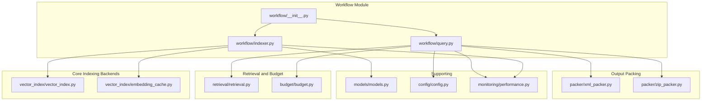
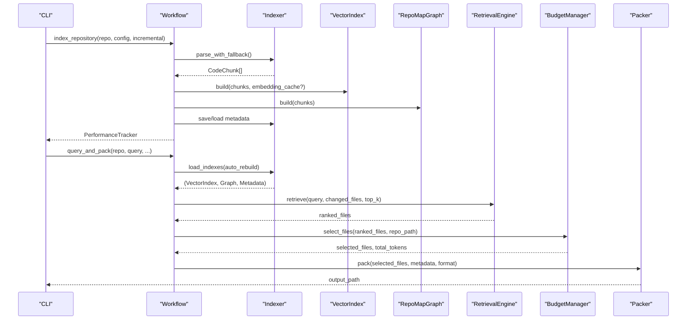
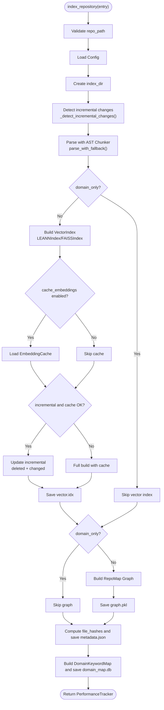
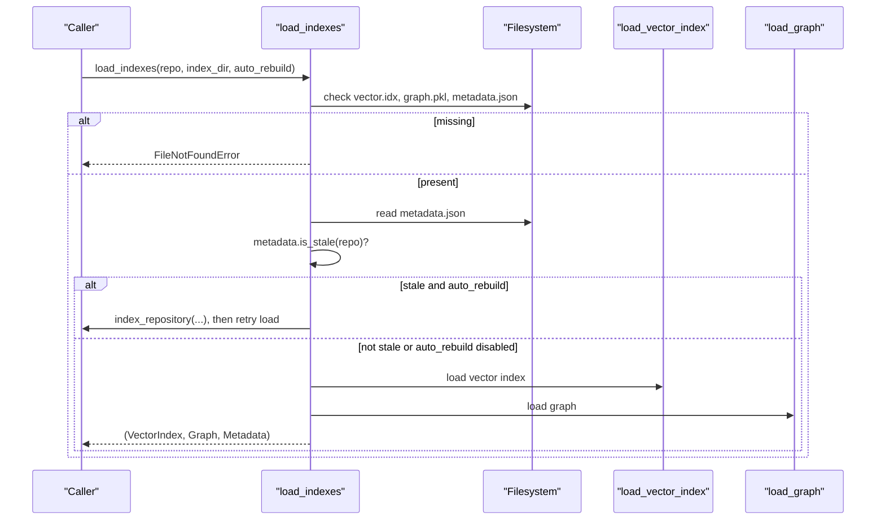
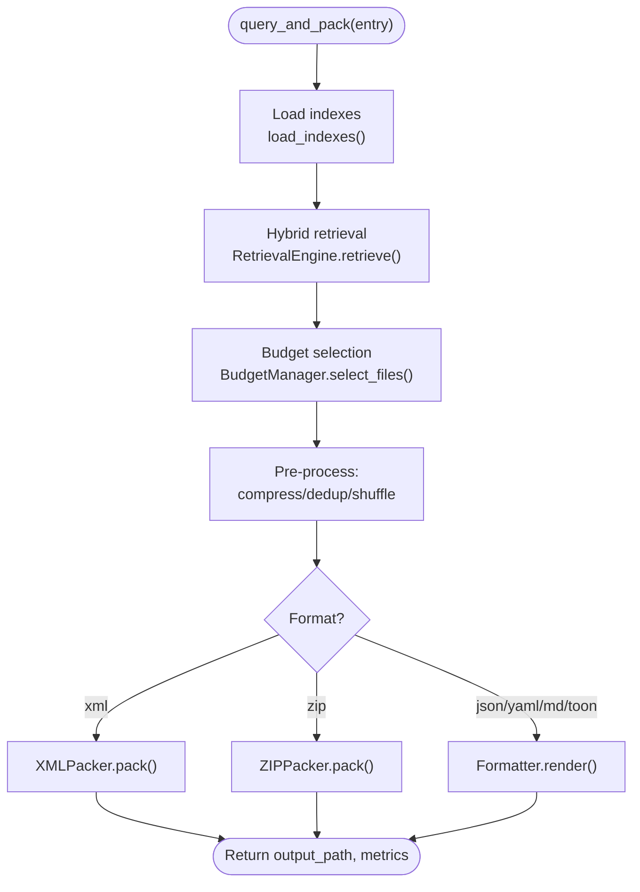
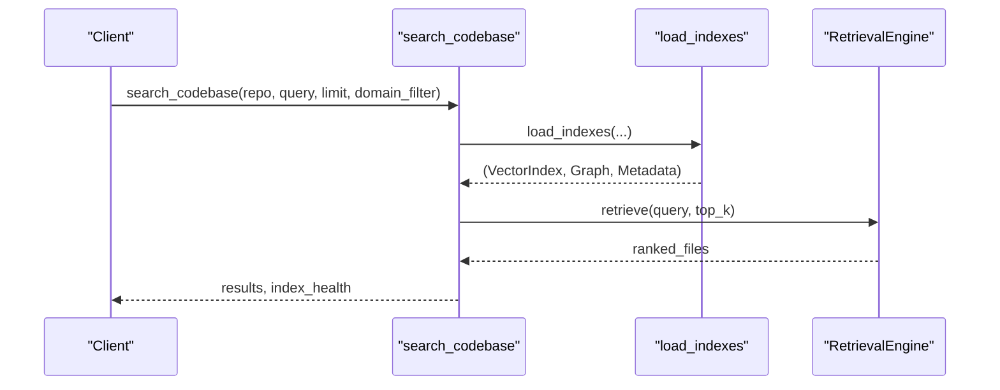
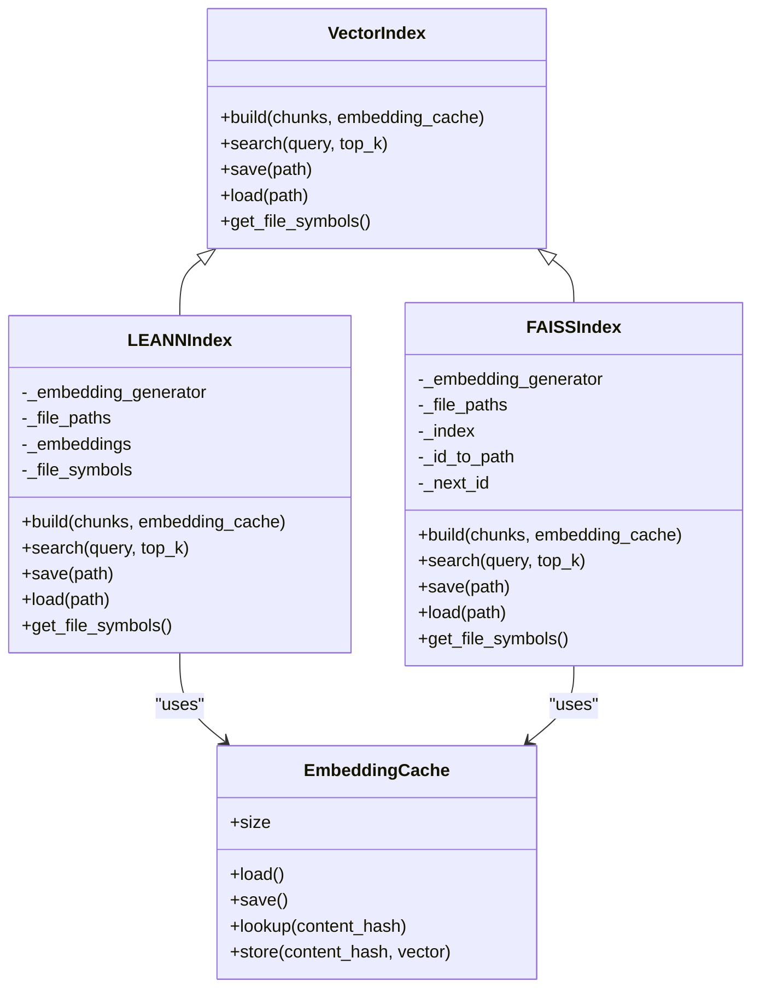
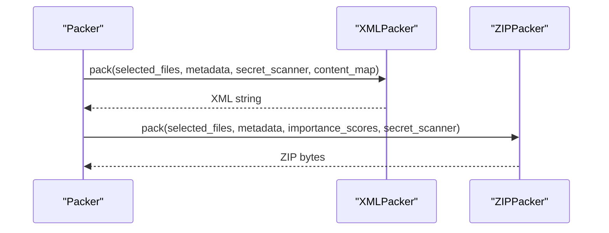
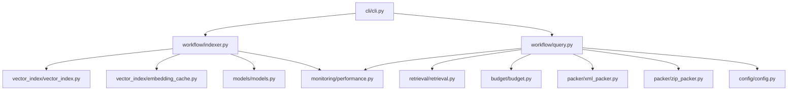

# Workflow Engine

<cite>
**Referenced Files in This Document**
- [workflow/indexer.py](file://src/ws_ctx_engine/workflow/indexer.py)
- [workflow/query.py](file://src/ws_ctx_engine/workflow/query.py)
- [workflow/__init__.py](file://src/ws_ctx_engine/workflow/__init__.py)
- [vector_index/vector_index.py](file://src/ws_ctx_engine/vector_index/vector_index.py)
- [vector_index/embedding_cache.py](file://src/ws_ctx_engine/vector_index/embedding_cache.py)
- [retrieval/retrieval.py](file://src/ws_ctx_engine/retrieval/retrieval.py)
- [budget/budget.py](file://src/ws_ctx_engine/budget/budget.py)
- [packer/xml_packer.py](file://src/ws_ctx_engine/packer/xml_packer.py)
- [packer/zip_packer.py](file://src/ws_ctx_engine/packer/zip_packer.py)
- [models/models.py](file://src/ws_ctx_engine/models/models.py)
- [config/config.py](file://src/ws_ctx_engine/config/config.py)
- [monitoring/performance.py](file://src/ws_ctx_engine/monitoring/performance.py)
- [cli/cli.py](file://src/ws_ctx_engine/cli/cli.py)
- [docs/reference/workflow.md](file://docs/reference/workflow.md)
</cite>

## Table of Contents
1. [Introduction](#introduction)
2. [Project Structure](#project-structure)
3. [Core Components](#core-components)
4. [Architecture Overview](#architecture-overview)
5. [Detailed Component Analysis](#detailed-component-analysis)
6. [Dependency Analysis](#dependency-analysis)
7. [Performance Considerations](#performance-considerations)
8. [Troubleshooting Guide](#troubleshooting-guide)
9. [Conclusion](#conclusion)
10. [Appendices](#appendices)

## Introduction
This document explains the workflow engine module that powers the indexing and querying pipeline for codebases. It covers the indexing phase (parsing, vector index building, graph construction, metadata persistence, and domain keyword mapping), the query phase (loading indexes, hybrid retrieval, budget-aware selection, and output packing), and the orchestration across components. It also documents configuration options, error handling, performance optimization, memory management, caching strategies, and incremental indexing capabilities.

## Project Structure
The workflow engine is organized around two primary modules:
- Indexing workflow: index_repository() and load_indexes()
- Query workflow: query_and_pack() and search_codebase()

**Diagram sources**
- [workflow/__init__.py:1-5](file://src/ws_ctx_engine/workflow/__init__.py#L1-L5)
- [workflow/indexer.py:1-493](file://src/ws_ctx_engine/workflow/indexer.py#L1-L493)
- [workflow/query.py:1-617](file://src/ws_ctx_engine/workflow/query.py#L1-L617)
- [vector_index/vector_index.py:1-800](file://src/ws_ctx_engine/vector_index/vector_index.py#L1-L800)
- [vector_index/embedding_cache.py:1-127](file://src/ws_ctx_engine/vector_index/embedding_cache.py#L1-L127)
- [retrieval/retrieval.py:1-627](file://src/ws_ctx_engine/retrieval/retrieval.py#L1-L627)
- [budget/budget.py:1-105](file://src/ws_ctx_engine/budget/budget.py#L1-L105)
- [packer/xml_packer.py:1-239](file://src/ws_ctx_engine/packer/xml_packer.py#L1-L239)
- [packer/zip_packer.py:1-254](file://src/ws_ctx_engine/packer/zip_packer.py#L1-L254)
- [models/models.py:1-152](file://src/ws_ctx_engine/models/models.py#L1-L152)
- [config/config.py:1-399](file://src/ws_ctx_engine/config/config.py#L1-L399)
- [monitoring/performance.py:1-263](file://src/ws_ctx_engine/monitoring/performance.py#L1-L263)

**Section sources**
- [workflow/__init__.py:1-5](file://src/ws_ctx_engine/workflow/__init__.py#L1-L5)
- [docs/reference/workflow.md:1-410](file://docs/reference/workflow.md#L1-L410)

## Core Components
- index_repository(repo_path, config=None, index_dir=".ws-ctx-engine", domain_only=False, incremental=False) -> PerformanceTracker
  - Builds and persists indexes for later queries. Phases include parsing with AST chunker, vector index construction, graph building, metadata saving, and domain keyword map persistence.
- load_indexes(repo_path, index_dir=".ws-ctx-engine", auto_rebuild=True, config=None) -> (VectorIndex, RepoMapGraph, IndexMetadata)
  - Loads persisted indexes, detects staleness, and optionally rebuilds automatically.
- query_and_pack(repo_path, query=None, changed_files=None, config=None, index_dir=".ws-ctx-engine", secrets_scan=False, compress=False, shuffle=True, agent_phase=None, session_id=None) -> (output_path, metrics_dict)
  - Orchestrates loading indexes, hybrid retrieval, budget selection, and output packing in XML/ZIP/JSON/MD/TOON formats.
- search_codebase(repo_path, query, config=None, limit=10, domain_filter=None, index_dir=".ws-ctx-engine") -> (results, index_health)
  - High-level programmatic search returning ranked files with domain inference and index health.

Key orchestration responsibilities:
- Workflow module exports the four primary functions and exposes them to CLI and integrations.
- Indexing phase writes .ws-ctx-engine/ with vector.idx, graph.pkl, metadata.json, and domain_map.db.
- Query phase reads these artifacts, runs hybrid retrieval, enforces token budget, and packs outputs.

**Section sources**
- [workflow/indexer.py:72-371](file://src/ws_ctx_engine/workflow/indexer.py#L72-L371)
- [workflow/indexer.py:404-492](file://src/ws_ctx_engine/workflow/indexer.py#L404-L492)
- [workflow/query.py:158-227](file://src/ws_ctx_engine/workflow/query.py#L158-L227)
- [workflow/query.py:230-616](file://src/ws_ctx_engine/workflow/query.py#L230-L616)
- [workflow/__init__.py:1-5](file://src/ws_ctx_engine/workflow/__init__.py#L1-L5)

## Architecture Overview
The workflow engine coordinates parsing, indexing, retrieval, budgeting, and output generation. The CLI integrates with these functions to provide a cohesive developer experience.

**Diagram sources**
- [workflow/indexer.py:72-371](file://src/ws_ctx_engine/workflow/indexer.py#L72-L371)
- [workflow/query.py:230-616](file://src/ws_ctx_engine/workflow/query.py#L230-L616)
- [cli/cli.py:406-800](file://src/ws_ctx_engine/cli/cli.py#L406-L800)

## Detailed Component Analysis

### Indexing Phase: index_repository
Responsibilities:
- Parse codebase into CodeChunk objects using AST chunker with fallback.
- Build vector index (LEANNIndex or FAISSIndex) with optional embedding cache.
- Build RepoMap graph (fallback supported).
- Persist metadata.json for staleness detection.
- Build and persist domain keyword map database.

Incremental indexing:
- Compares stored file hashes against current disk state to detect changed/deleted files.
- When enabled and supported, rebuilds only changed files and updates the vector index incrementally.
- Uses embedding cache to avoid re-embedding unchanged files.

**Diagram sources**
- [workflow/indexer.py:72-371](file://src/ws_ctx_engine/workflow/indexer.py#L72-L371)
- [vector_index/embedding_cache.py:55-84](file://src/ws_ctx_engine/vector_index/embedding_cache.py#L55-L84)
- [vector_index/vector_index.py:506-800](file://src/ws_ctx_engine/vector_index/vector_index.py#L506-L800)

**Section sources**
- [workflow/indexer.py:72-371](file://src/ws_ctx_engine/workflow/indexer.py#L72-L371)
- [vector_index/embedding_cache.py:1-127](file://src/ws_ctx_engine/vector_index/embedding_cache.py#L1-L127)
- [vector_index/vector_index.py:282-504](file://src/ws_ctx_engine/vector_index/vector_index.py#L282-L504)
- [vector_index/vector_index.py:506-800](file://src/ws_ctx_engine/vector_index/vector_index.py#L506-L800)
- [models/models.py:87-152](file://src/ws_ctx_engine/models/models.py#L87-L152)

### Index Loading and Staleness Detection: load_indexes
Responsibilities:
- Verify presence of vector.idx, graph.pkl, and metadata.json.
- Load metadata and detect staleness via file hash comparison.
- Optionally rebuild indexes automatically and reload.

**Diagram sources**
- [workflow/indexer.py:404-492](file://src/ws_ctx_engine/workflow/indexer.py#L404-L492)

**Section sources**
- [workflow/indexer.py:404-492](file://src/ws_ctx_engine/workflow/indexer.py#L404-L492)
- [models/models.py:87-152](file://src/ws_ctx_engine/models/models.py#L87-L152)

### Query Phase: query_and_pack
Responsibilities:
- Load indexes with staleness detection.
- Hybrid retrieval combining semantic similarity and PageRank.
- Budget-aware file selection using greedy knapsack with token budget.
- Output packing in XML, ZIP, JSON, YAML, MD, or TOON formats.
- Optional pre-processing: compression, session-level deduplication, and shuffling for model recall.

**Diagram sources**
- [workflow/query.py:230-616](file://src/ws_ctx_engine/workflow/query.py#L230-L616)
- [retrieval/retrieval.py:250-368](file://src/ws_ctx_engine/retrieval/retrieval.py#L250-L368)
- [budget/budget.py:50-105](file://src/ws_ctx_engine/budget/budget.py#L50-L105)
- [packer/xml_packer.py:85-137](file://src/ws_ctx_engine/packer/xml_packer.py#L85-L137)
- [packer/zip_packer.py:49-90](file://src/ws_ctx_engine/packer/zip_packer.py#L49-L90)

**Section sources**
- [workflow/query.py:230-616](file://src/ws_ctx_engine/workflow/query.py#L230-L616)
- [retrieval/retrieval.py:140-627](file://src/ws_ctx_engine/retrieval/retrieval.py#L140-L627)
- [budget/budget.py:1-105](file://src/ws_ctx_engine/budget/budget.py#L1-105)
- [packer/xml_packer.py:1-239](file://src/ws_ctx_engine/packer/xml_packer.py#L1-L239)
- [packer/zip_packer.py:1-254](file://src/ws_ctx_engine/packer/zip_packer.py#L1-L254)

### Programmatic Search: search_codebase
Responsibilities:
- High-level search API returning ranked files with inferred domains and index health.

**Diagram sources**
- [workflow/query.py:158-227](file://src/ws_ctx_engine/workflow/query.py#L158-L227)

**Section sources**
- [workflow/query.py:158-227](file://src/ws_ctx_engine/workflow/query.py#L158-L227)

### Vector Index Backends and Embedding Cache
- VectorIndex abstract base with LEANNIndex and FAISSIndex implementations.
- EmbeddingGenerator handles local model and API fallback with memory-aware checks.
- EmbeddingCache persists content-hash → embedding mappings to accelerate incremental rebuilds.

**Diagram sources**
- [vector_index/vector_index.py:21-84](file://src/ws_ctx_engine/vector_index/vector_index.py#L21-L84)
- [vector_index/vector_index.py:282-504](file://src/ws_ctx_engine/vector_index/vector_index.py#L282-L504)
- [vector_index/vector_index.py:506-800](file://src/ws_ctx_engine/vector_index/vector_index.py#L506-L800)
- [vector_index/embedding_cache.py:28-127](file://src/ws_ctx_engine/vector_index/embedding_cache.py#L28-L127)

**Section sources**
- [vector_index/vector_index.py:1-800](file://src/ws_ctx_engine/vector_index/vector_index.py#L1-L800)
- [vector_index/embedding_cache.py:1-127](file://src/ws_ctx_engine/vector_index/embedding_cache.py#L1-L127)

### Retrieval Engine and Budget Management
- RetrievalEngine merges semantic similarity and PageRank scores, applies symbol/path/domain boosts, and penalizes test files.
- BudgetManager greedily selects files within token budget, reserving 20% for metadata.

**Diagram sources**
- [retrieval/retrieval.py:250-368](file://src/ws_ctx_engine/retrieval/retrieval.py#L250-L368)

**Section sources**
- [retrieval/retrieval.py:140-627](file://src/ws_ctx_engine/retrieval/retrieval.py#L140-L627)
- [budget/budget.py:1-105](file://src/ws_ctx_engine/budget/budget.py#L1-L105)

### Output Packing
- XMLPacker: Generates Repomix-style XML with metadata and file contents; supports shuffling to mitigate “Lost in the Middle.”
- ZIPPacker: Creates ZIP with preserved directory structure and REVIEW_CONTEXT.md manifest.

**Diagram sources**
- [packer/xml_packer.py:85-137](file://src/ws_ctx_engine/packer/xml_packer.py#L85-L137)
- [packer/zip_packer.py:49-90](file://src/ws_ctx_engine/packer/zip_packer.py#L49-L90)

**Section sources**
- [packer/xml_packer.py:1-239](file://src/ws_ctx_engine/packer/xml_packer.py#L1-L239)
- [packer/zip_packer.py:1-254](file://src/ws_ctx_engine/packer/zip_packer.py#L1-L254)

## Dependency Analysis
- Workflow module depends on:
  - Vector index backends (LEANNIndex/FAISSIndex) and embedding cache for incremental builds.
  - Retrieval engine for hybrid ranking.
  - Budget manager for token-aware selection.
  - Packer implementations for output formats.
  - Configuration and performance tracking.
- CLI integrates with workflow functions to expose commands for indexing, searching, and querying.

**Diagram sources**
- [workflow/indexer.py:14-24](file://src/ws_ctx_engine/workflow/indexer.py#L14-L24)
- [workflow/query.py:13-22](file://src/ws_ctx_engine/workflow/query.py#L13-L22)
- [cli/cli.py:22-25](file://src/ws_ctx_engine/cli/cli.py#L22-L25)

**Section sources**
- [workflow/indexer.py:1-493](file://src/ws_ctx_engine/workflow/indexer.py#L1-L493)
- [workflow/query.py:1-617](file://src/ws_ctx_engine/workflow/query.py#L1-L617)
- [cli/cli.py:1-800](file://src/ws_ctx_engine/cli/cli.py#L1-L800)

## Performance Considerations
- Incremental indexing:
  - Detects changed/deleted files and rebuilds only affected parts.
  - Uses embedding cache to avoid re-embedding unchanged files.
- Memory management:
  - EmbeddingGenerator checks available memory and falls back to API when needed.
  - PerformanceTracker records peak memory usage when psutil is available.
- Token budgeting:
  - BudgetManager reserves 20% of budget for metadata and uses 80% for content.
  - Greedy selection maximizes total importance within token limits.
- Output optimization:
  - XMLPacker supports shuffling to improve recall.
  - Optional compression and session-level deduplication reduce output size.

[No sources needed since this section provides general guidance]

## Troubleshooting Guide
Common issues and resolutions:
- Indexes not found:
  - Run index_repository() first to build indexes.
- Stale indexes:
  - load_indexes() can auto-rebuild; otherwise, rebuild manually.
- Out of memory during embedding:
  - EmbeddingGenerator falls back to API; adjust device/batch_size or use API provider.
- Invalid configuration:
  - Config.load() validates fields; ensure weights sum to 1.0 and patterns are lists.
- Missing dependencies:
  - CLI doctor command reports availability; install recommended extras.

**Section sources**
- [workflow/query.py:316-322](file://src/ws_ctx_engine/workflow/query.py#L316-L322)
- [workflow/indexer.py:456-467](file://src/ws_ctx_engine/workflow/indexer.py#L456-L467)
- [vector_index/vector_index.py:130-251](file://src/ws_ctx_engine/vector_index/vector_index.py#L130-L251)
- [config/config.py:212-399](file://src/ws_ctx_engine/config/config.py#L212-L399)
- [cli/cli.py:329-364](file://src/ws_ctx_engine/cli/cli.py#L329-L364)

## Conclusion
The workflow engine provides a robust, configurable pipeline for indexing and querying codebases. It emphasizes incremental builds, hybrid retrieval, token-aware selection, and flexible output formats. With strong error handling, performance tracking, and caching strategies, it scales from small repositories to large codebases while maintaining developer productivity.

[No sources needed since this section summarizes without analyzing specific files]

## Appendices

### Practical Usage Examples
- Index repository:
  - CLI: ws-ctx-engine index /path/to/repo [--incremental]
  - Programmatic: index_repository(repo_path, config, incremental=True)
- Query and pack:
  - CLI: ws-ctx-engine query "authentication logic" --repo /path/to/repo --format xml --budget 50000
  - Programmatic: query_and_pack(repo_path, query="...", config, compress=True, shuffle=True)
- Programmatic search:
  - results, health = search_codebase(repo_path, query="...", limit=20, domain_filter="database")

**Section sources**
- [docs/reference/workflow.md:374-410](file://docs/reference/workflow.md#L374-L410)
- [cli/cli.py:406-800](file://src/ws_ctx_engine/cli/cli.py#L406-L800)

### Configuration Options
- Output settings: format, token_budget, output_path
- Scoring weights: semantic_weight, pagerank_weight (must sum to 1.0)
- File filtering: include_tests, respect_gitignore, include_patterns, exclude_patterns
- Backends: vector_index, graph, embeddings
- Embeddings: model, device, batch_size, api_provider, api_key_env
- Performance: max_workers, cache_embeddings, incremental_index
- AI rules: auto_detect, extra_files, boost

**Section sources**
- [config/config.py:16-399](file://src/ws_ctx_engine/config/config.py#L16-L399)

### Integration Patterns
- CLI integration: Commands index, search, query, mcp delegate to workflow functions.
- Agent workflows: --agent-mode emits NDJSON; MCP server exposes tools with rate limiting.
- Domain-aware ranking: DomainKeywordMap enhances retrieval with domain boosts.

**Section sources**
- [cli/cli.py:406-800](file://src/ws_ctx_engine/cli/cli.py#L406-L800)
- [retrieval/retrieval.py:250-368](file://src/ws_ctx_engine/retrieval/retrieval.py#L250-L368)