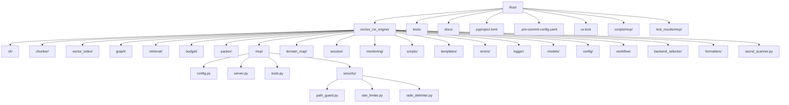
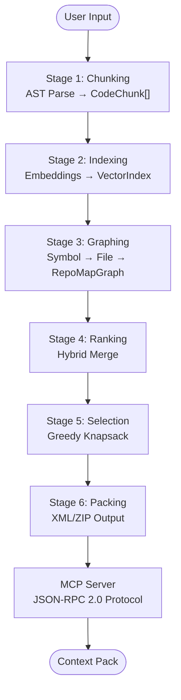
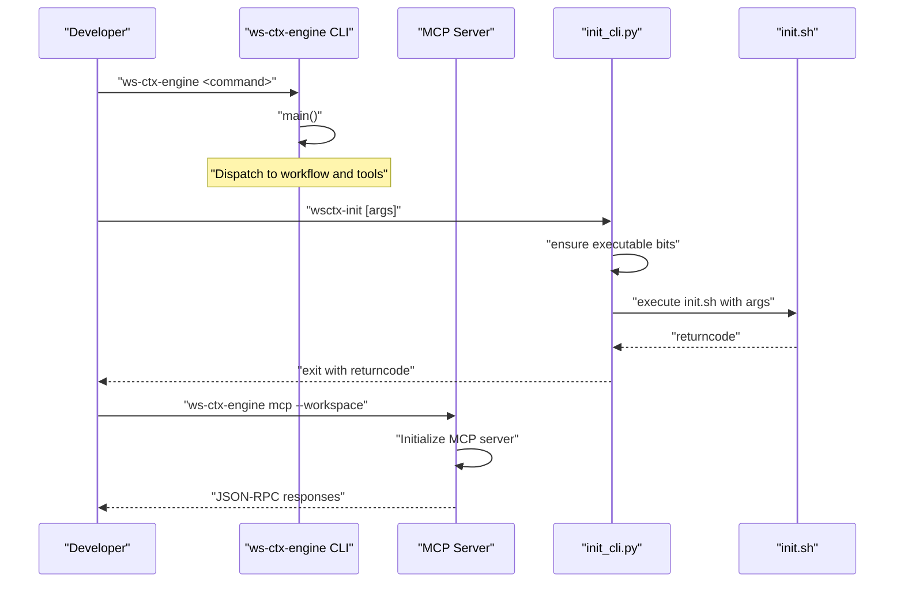
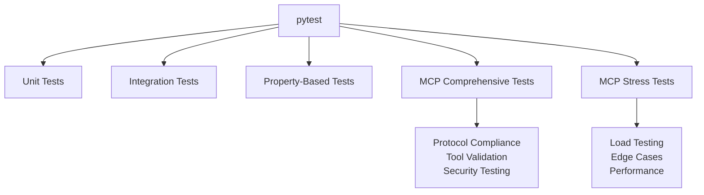
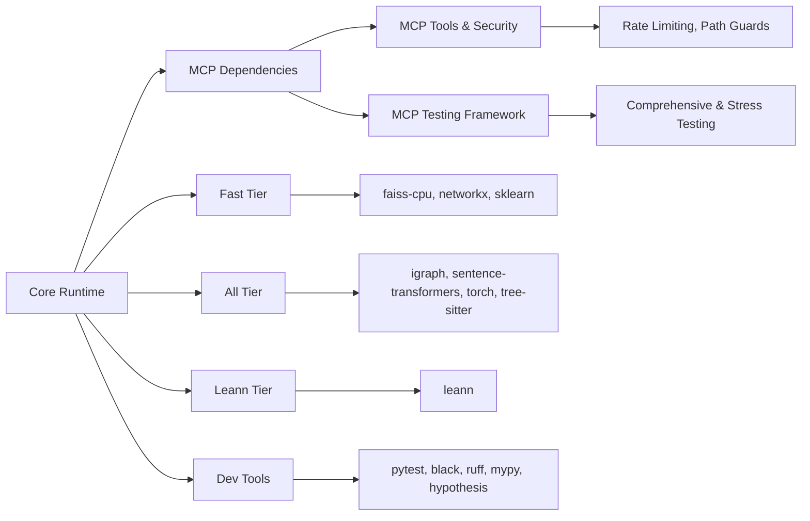

# Development Guide

<cite>
**Referenced Files in This Document**
- [pyproject.toml](file://pyproject.toml)
- [CONTRIBUTING.md](file://CONTRIBUTING.md)
- [README.md](file://README.md)
- [INSTALL.md](file://INSTALL.md)
- [.pre-commit-config.yaml](file://.pre-commit-config.yaml)
- [uv.lock](file://uv.lock)
- [tests/README.md](file://tests/README.md)
- [tests/conftest.py](file://tests/conftest.py)
- [docs/development/plans/agent-plan-v4.md](file://docs/development/plans/agent-plan-v4.md)
- [docs/reference/architecture.md](file://docs/reference/architecture.md)
- [src/ws_ctx_engine/__init__.py](file://src/ws_ctx_engine/__init__.py)
- [src/ws_ctx_engine/cli/__main__.py](file://src/ws_ctx_engine/cli/__main__.py)
- [src/ws_ctx_engine/init_cli.py](file://src/ws_ctx_engine/init_cli.py)
- [src/ws_ctx_engine/mcp/config.py](file://src/ws_ctx_engine/mcp/config.py)
- [src/ws_ctx_engine/mcp/server.py](file://src/ws_ctx_engine/mcp/server.py)
- [src/ws_ctx_engine/mcp/tools.py](file://src/ws_ctx_engine/mcp/tools.py)
- [src/ws_ctx_engine/mcp/security/path_guard.py](file://src/ws_ctx_engine/mcp/security/path_guard.py)
- [src/ws_ctx_engine/mcp/security/rate_limiter.py](file://src/ws_ctx_engine/mcp/security/rate_limiter.py)
- [src/ws_ctx_engine/templates/mcp/mcp_config.json.tpl](file://src/ws_ctx_engine/templates/mcp/mcp_config.json.tpl)
- [scripts/mcp/mcp_comprehensive_test.py](file://scripts/mcp/mcp_comprehensive_test.py)
- [scripts/mcp/mcp_stress_test.py](file://scripts/mcp/mcp_stress_test.py)
- [docs/integrations/mcp-server.md](file://docs/integrations/mcp-server.md)
- [docs/performance/MCP_PERFORMANCE_OPTIMIZATION.md](file://docs/performance/MCP_PERFORMANCE_OPTIMIZATION.md)
- [test_results/mcp/comprehensive_test/detailed_report_20260326_213840.json](file://test_results/mcp/comprehensive_test/detailed_report_20260326_213840.json)
- [test_results/mcp/comprehensive_test/evaluation_summary_20260326_213840.md](file://test_results/mcp/comprehensive_test/evaluation_summary_20260326_213840.md)
- [test_results/mcp/stress_test/stress_test_20260326_212315.json](file://test_results/mcp/stress_test/stress_test_20260326_212315.json)
- [test_results/mcp/stress_test/summary_20260326_212315.txt](file://test_results/mcp/stress_test/summary_20260326_212315.txt)
- [tests/unit/test_mcp_config.py](file://tests/unit/test_mcp_config.py)
- [tests/unit/test_mcp_server.py](file://tests/unit/test_mcp_server.py)
- [tests/unit/test_mcp_tools.py](file://tests/unit/test_mcp_tools.py)
- [tests/unit/test_mcp_rate_limiter.py](file://tests/unit/test_mcp_rate_limiter.py)
- [.windsurf/mcp_config.json](file://.windsurf/mcp_config.json)
</cite>

## Update Summary
**Changes Made**
- Added comprehensive MCP (Model Context Protocol) development configuration documentation
- Documented MCP server implementation with security controls and rate limiting
- Added MCP testing infrastructure including comprehensive and stress testing scripts
- Included MCP performance optimization strategies and benchmarking approaches
- Documented MCP configuration templates and workspace management
- Added MCP security components including path guards and rate limiting

## Table of Contents
1. [Introduction](#introduction)
2. [Project Structure](#project-structure)
3. [Core Components](#core-components)
4. [Architecture Overview](#architecture-overview)
5. [MCP Development Configuration](#mcp-development-configuration)
6. [MCP Server Implementation](#mcp-server-implementation)
7. [MCP Testing Infrastructure](#mcp-testing-infrastructure)
8. [MCP Security Controls](#mcp-security-controls)
9. [MCP Performance Optimization](#mcp-performance-optimization)
10. [Detailed Component Analysis](#detailed-component-analysis)
11. [Dependency Analysis](#dependency-analysis)
12. [Performance Considerations](#performance-considerations)
13. [Troubleshooting Guide](#troubleshooting-guide)
14. [Conclusion](#conclusion)
15. [Appendices](#appendices)

## Introduction
This development guide provides a comprehensive, contributor-friendly roadmap for building, testing, and maintaining ws-ctx-engine with enhanced MCP (Model Context Protocol) development capabilities. It covers environment setup, dependency management, MCP-specific testing strategies (unit, integration, property-based, comprehensive, and stress testing), code quality standards, contribution workflows, and operational practices. The guide is designed for both new contributors and maintainers working on MCP server implementations and agent workflows.

## Project Structure
The repository is organized around a Python package named ws-ctx-engine under src/, with extensive tests under tests/, documentation under docs/, and configuration for development and CI under pyproject.toml and .pre-commit-config.yaml. The MCP development infrastructure adds specialized components for server implementation, security controls, and testing frameworks.



**Diagram sources**
- [src/ws_ctx_engine/__init__.py](file://src/ws_ctx_engine/__init__.py)
- [src/ws_ctx_engine/cli/__main__.py](file://src/ws_ctx_engine/cli/__main__.py)
- [src/ws_ctx_engine/init_cli.py](file://src/ws_ctx_engine/init_cli.py)
- [src/ws_ctx_engine/mcp/config.py](file://src/ws_ctx_engine/mcp/config.py)
- [src/ws_ctx_engine/mcp/server.py](file://src/ws_ctx_engine/mcp/server.py)
- [src/ws_ctx_engine/mcp/tools.py](file://src/ws_ctx_engine/mcp/tools.py)
- [src/ws_ctx_engine/mcp/security/path_guard.py](file://src/ws_ctx_engine/mcp/security/path_guard.py)
- [src/ws_ctx_engine/mcp/security/rate_limiter.py](file://src/ws_ctx_engine/mcp/security/rate_limiter.py)

**Section sources**
- [README.md:1-457](file://README.md#L1-L457)
- [pyproject.toml:1-243](file://pyproject.toml#L1-L243)

## Core Components
Key runtime components include:
- CLI entry points for ws-ctx-engine and initialization
- Chunking and parsing (AST-based with fallbacks)
- Vector indexing and graph construction
- Retrieval engine combining semantic and structural signals
- Budget management and packing for output formats
- **MCP server implementation with JSON-RPC 2.0 protocol support**
- **MCP security controls including path guards, rate limiting, and content sanitization**
- **MCP testing infrastructure with comprehensive and stress testing suites**
- Domain mapping and session deduplication
- Monitoring and performance utilities

These components are wired through the CLI and workflow modules, with configuration-driven backend selection and fallback strategies, and enhanced with MCP-specific development tools and testing frameworks.

**Section sources**
- [src/ws_ctx_engine/__init__.py:1-33](file://src/ws_ctx_engine/__init__.py#L1-L33)
- [docs/reference/architecture.md:1-940](file://docs/reference/architecture.md#L1-L940)
- [docs/development/plans/agent-plan-v4.md:1-889](file://docs/development/plans/agent-plan-v4.md#L1-L889)

## Architecture Overview
The system implements a six-stage pipeline: chunking, indexing, graphing, ranking, selection, and packing. It supports robust fallbacks across vector indexing, graph libraries, and embedding backends, ensuring production-grade resilience. The MCP server extends this architecture with JSON-RPC 2.0 protocol support for agent workflows.



**Diagram sources**
- [docs/reference/architecture.md:1-940](file://docs/reference/architecture.md#L1-L940)

**Section sources**
- [docs/reference/architecture.md:1-940](file://docs/reference/architecture.md#L1-L940)

## MCP Development Configuration

### MCP Configuration Management
The MCP system uses a structured configuration approach with default values and runtime overrides:

- **Configuration File Location**: `.ws-ctx-engine/mcp_config.json`
- **Default Rate Limits**: 60 search_codebase, 120 get_file_context, 10 get_domain_map, 10 get_index_status, 5 pack_context, 10 session_clear
- **Cache TTL**: 30 seconds by default
- **Workspace Resolution**: Supports both absolute and relative workspace paths

### Configuration Template
The system provides a template for MCP configuration that can be customized for different environments:

```json
{
  "workspace": "${CTX_TARGET}",
  "rate_limits": {
    "search_codebase": 60,
    "get_file_context": 120,
    "get_domain_map": 10,
    "get_index_status": 10
  },
  "cache_ttl_seconds": 30
}
```

### Workspace Binding and Resolution
The MCP server binds to a single workspace root with automatic resolution:
- Runtime workspace takes precedence over configured workspace
- Relative paths are resolved against the bootstrap workspace
- Absolute paths bypass workspace resolution

**Section sources**
- [src/ws_ctx_engine/mcp/config.py:1-129](file://src/ws_ctx_engine/mcp/config.py#L1-L129)
- [src/ws_ctx_engine/templates/mcp/mcp_config.json.tpl:1-11](file://src/ws_ctx_engine/templates/mcp/mcp_config.json.tpl#L1-L11)
- [tests/unit/test_mcp_config.py:1-260](file://tests/unit/test_mcp_config.py#L1-L260)

## MCP Server Implementation

### JSON-RPC 2.0 Protocol Support
The MCP server implements the JSON-RPC 2.0 specification with comprehensive method handling:

**Core Methods:**
- `initialize`: Server initialization with protocol version and capabilities
- `tools/list`: Returns available tool schemas
- `tools/call`: Executes MCP tools with structured content support

**Response Format:**
```json
{
  "jsonrpc": "2.0",
  "id": 123,
  "result": {
    "content": [{"type": "text", "text": "..."}],
    "structuredContent": {}
  }
}
```

### Server Lifecycle Management
The server manages its lifecycle through stdin/stdout communication:
- Reads requests line-by-line from stdin
- Validates JSON-RPC format and method signatures
- Handles notifications (like `initialized`) without responses
- Writes responses to stdout with proper flushing

### Version Information
The server reports version information using importlib.metadata with graceful fallback to "unknown" when package metadata is unavailable.

**Section sources**
- [src/ws_ctx_engine/mcp/server.py:1-136](file://src/ws_ctx_engine/mcp/server.py#L1-L136)
- [tests/unit/test_mcp_server.py:1-290](file://tests/unit/test_mcp_server.py#L1-L290)

## MCP Testing Infrastructure

### Comprehensive Test Suite
The comprehensive test suite evaluates MCP server compliance across multiple categories:

**Test Categories:**
1. **Protocol Compliance**: JSON-RPC 2.0 validation and initialization
2. **Tool Discovery**: Schema validation and registration
3. **Input Validation**: Parameter validation and error handling
4. **Error Handling**: Graceful error responses and recovery
5. **Performance Testing**: Latency and throughput measurements
6. **Concurrency Testing**: Multi-threaded request handling
7. **Security Testing**: Path traversal and access control
8. **Structured Content**: Content wrapping and delivery
9. **Timeout & Limits**: Resource management and timeouts
10. **Rate Limiting**: Traffic control and throttling

### Stress Testing Framework
The stress testing framework validates MCP tools under various conditions:

**Test Scenarios:**
- **search_codebase**: Various query patterns and edge cases
- **get_file_context**: Multiple file types and permission scenarios
- **pack_context**: Different output formats and token budgets
- **get_domain_map**: Graph analysis and caching behavior
- **session_clear**: Cache management and cleanup operations

**Test Coverage:**
- Invalid input validation
- Boundary condition testing
- Performance regression detection
- Security vulnerability assessment

### Test Result Management
Test results are systematically organized with detailed reporting:

**Output Structure:**
- `test_results/mcp/comprehensive_test/`: Detailed JSON reports and markdown summaries
- `test_results/mcp/stress_test/`: Stress test results and summary statistics

**Report Features:**
- Individual test case details
- Performance metrics and timing data
- Error categorization and recommendations
- Compliance scoring and ratings

**Section sources**
- [scripts/mcp/mcp_comprehensive_test.py:1-948](file://scripts/mcp/mcp_comprehensive_test.py#L1-L948)
- [scripts/mcp/mcp_stress_test.py:1-378](file://scripts/mcp/mcp_stress_test.py#L1-L378)
- [test_results/mcp/comprehensive_test/detailed_report_20260326_213840.json:1-2000](file://test_results/mcp/comprehensive_test/detailed_report_20260326_213840.json#L1-L2000)
- [test_results/mcp/comprehensive_test/evaluation_summary_20260326_213840.md:1-150](file://test_results/mcp/comprehensive_test/evaluation_summary_20260326_213840.md#L1-L150)
- [test_results/mcp/stress_test/stress_test_20260326_212315.json:1-2500](file://test_results/mcp/stress_test/stress_test_20260326_212315.json#L1-L2500)

## MCP Security Controls

### Path Traversal Protection
The WorkspacePathGuard provides comprehensive path validation:

**Security Features:**
- Resolves all paths against workspace root
- Prevents absolute path escapes
- Blocks symlink-based attacks
- Validates POSIX path normalization

**Validation Logic:**
- Converts relative paths to absolute within workspace
- Rejects paths attempting to escape workspace boundaries
- Handles edge cases like `..` navigation and symbolic links

### Rate Limiting System
The RateLimiter implements token bucket algorithm for traffic control:

**Rate Limit Configuration:**
- Configurable limits per tool type
- Automatic bucket refills based on time
- Minimum retry-after enforcement (≥1 second)
- Burst capacity support for short-term spikes

**Supported Tools:**
- search_codebase: configurable per-minute limits
- get_file_context: higher priority for file access
- get_domain_map: moderate access frequency
- get_index_status: low-frequency administrative access
- pack_context: controlled bulk operations
- session_clear: cache management operations

### Content Sanitization
The RADE (Redaction and Delimiter Engine) provides secure content handling:

**Security Measures:**
- Secret detection and redaction
- Content delimiter insertion for safe boundaries
- Dependency and dependent file discovery
- Safe content wrapping with markers

**Section sources**
- [src/ws_ctx_engine/mcp/security/path_guard.py:1-31](file://src/ws_ctx_engine/mcp/security/path_guard.py#L1-L31)
- [src/ws_ctx_engine/mcp/security/rate_limiter.py:1-45](file://src/ws_ctx_engine/mcp/security/rate_limiter.py#L1-L45)
- [tests/unit/test_mcp_tools.py:1-485](file://tests/unit/test_mcp_tools.py#L1-L485)
- [tests/unit/test_mcp_rate_limiter.py:1-70](file://tests/unit/test_mcp_rate_limiter.py#L1-L70)

## MCP Performance Optimization

### Current Performance Analysis
**Problem**: `search_codebase` latency averages **10,023ms** (~10 seconds)

**Root Causes:**
1. **Embedding Model Loading** (Primary - ~6-8s): SentenceTransformer("facebook/contriever") loads on-demand
2. **LEANN Searcher Initialization** (Secondary - ~1-2s): New searcher instance per request
3. **Graph Operations** (Minor - ~1-2s): PageRank computation and graph loading

### Recommended Solutions

**Solution 1: Pre-load Embedding Model (HIGH IMPACT)**
- **Implementation**: Lazy-load model in constructor with warm-up
- **Impact**: Eliminates 6-8s cold start on first query
- **Memory**: ~500MB additional memory usage
- **Complexity**: Simple implementation, minimal code changes

**Solution 2: Singleton Pattern for Shared Resources (MEDIUM IMPACT)**
- **Implementation**: Module-level singleton for expensive resources
- **Impact**: Model shared across all requests/sessions
- **Complexity**: Higher complexity, requires vector_index module refactoring

**Solution 3: Cache LEANN Searcher Instance (LOW IMPACT)**
- **Implementation**: Reuse searcher instead of creating per-request
- **Impact**: Saves ~1-2s per request
- **Complexity**: Simple implementation

### Performance Testing Framework
The system includes comprehensive benchmarking capabilities:

**Benchmark Script Example:**
```python
def benchmark_search_latency(iterations=5):
    latencies = []
    for i in range(iterations):
        start = time.time()
        result = call_mcp_tool("search_codebase", {"query": "authentication"})
        elapsed = (time.time() - start) * 1000
        latencies.append(elapsed)
    
    avg = sum(latencies) / len(latencies)
    p95 = sorted(latencies)[int(0.95*len(latencies))]
    return avg, p95
```

**Success Criteria:**
- Average latency < 3,000ms (down from 10,023ms)
- P95 latency < 5,000ms
- No regression in search quality
- Memory increase < 1GB

**Section sources**
- [docs/performance/MCP_PERFORMANCE_OPTIMIZATION.md:1-253](file://docs/performance/MCP_PERFORMANCE_OPTIMIZATION.md#L1-L253)
- [scripts/mcp/mcp_comprehensive_test.py:200-948](file://scripts/mcp/mcp_comprehensive_test.py#L200-L948)

## Detailed Component Analysis

### CLI and Initialization
- Entry points: ws-ctx-engine and wsctx-init
- Initialization script wrapper ensures executable permissions and delegates to bash script
- CLI module delegates to main entry point
- **MCP-specific CLI**: `ws-ctx-engine mcp --workspace <path>`



**Diagram sources**
- [src/ws_ctx_engine/cli/__main__.py:1-5](file://src/ws_ctx_engine/cli/__main__.py#L1-L5)
- [src/ws_ctx_engine/init_cli.py:1-24](file://src/ws_ctx_engine/init_cli.py#L1-L24)

**Section sources**
- [src/ws_ctx_engine/cli/__main__.py:1-5](file://src/ws_ctx_engine/cli/__main__.py#L1-L5)
- [src/ws_ctx_engine/init_cli.py:1-24](file://src/ws_ctx_engine/init_cli.py#L1-L24)

### MCP Tool Registry and Execution
The MCP system provides a comprehensive tool registry with structured content support:

**Available Tools:**
1. **search_codebase**: Semantic code search with ranking
2. **get_file_context**: Secure file content retrieval with dependency analysis
3. **get_domain_map**: Architecture domain inference from codebase
4. **get_index_status**: Index freshness and health monitoring
5. **pack_context**: Context packaging for agent workflows
6. **session_clear**: Cache management for deduplication

**Execution Flow:**
- Input validation and parameter parsing
- Security checks and rate limiting
- Tool-specific processing with structured content
- Response formatting with JSON-RPC 2.0 compliance

**Section sources**
- [src/ws_ctx_engine/mcp/tools.py:29-131](file://src/ws_ctx_engine/mcp/tools.py#L29-L131)
- [src/ws_ctx_engine/mcp/tools.py:133-184](file://src/ws_ctx_engine/mcp/tools.py#L133-L184)

### Testing Strategy
The project employs a multi-layered testing approach:
- Unit tests: isolated function/class verification
- Integration tests: component interaction validation
- Property-based tests: broad behavioral guarantees via Hypothesis
- **MCP comprehensive tests**: Protocol compliance and feature validation
- **MCP stress tests**: Load testing and edge case scenarios
- Benchmarking: performance measurement with pytest-benchmark
- Stress tests: end-to-end scenarios with artifact capture



**Diagram sources**
- [tests/conftest.py:1-17](file://tests/conftest.py#L1-L17)
- [pyproject.toml:158-176](file://pyproject.toml#L158-L176)
- [tests/README.md:1-178](file://tests/README.md#L1-L178)
- [scripts/mcp/mcp_comprehensive_test.py:1-200](file://scripts/mcp/mcp_comprehensive_test.py#L1-L200)
- [scripts/mcp/mcp_stress_test.py:1-200](file://scripts/mcp/mcp_stress_test.py#L1-L200)

**Section sources**
- [tests/README.md:1-178](file://tests/README.md#L1-L178)
- [tests/conftest.py:1-17](file://tests/conftest.py#L1-L17)
- [pyproject.toml:158-176](file://pyproject.toml#L158-L176)

### Development Workflows and Branching
- Fork and clone the repository
- Create feature branches; keep main clean
- Rebase frequently onto upstream/main
- Run all checks before submitting PRs
- **Include MCP-specific tests in PR validation**
- Update documentation and CHANGELOG.md

**Section sources**
- [CONTRIBUTING.md:22-291](file://CONTRIBUTING.md#L22-L291)

### Release Procedures
- Maintain changelog entries under "Unreleased"
- Tag releases following conventional commits
- Publish artifacts via CI/CD pipeline
- **Validate MCP server compliance in release checks**

**Section sources**
- [CONTRIBUTING.md:238-291](file://CONTRIBUTING.md#L238-L291)

### Contribution Guidelines and Code Review
- Follow PEP 8, Black formatting, Ruff linting, and MyPy type checking
- Write docstrings and tests for new features
- **Include MCP configuration and security considerations**
- Engage early via issues; iterate on proposals
- PR checklist includes style, tests, docs, changelog, and commit hygiene

**Section sources**
- [CONTRIBUTING.md:89-291](file://CONTRIBUTING.md#L89-L291)

### Debugging and Profiling
- Use verbose flags and inspect logs in .ws-ctx-engine/logs/
- Use cProfile for deterministic profiling
- Use pytest-benchmark for performance regression detection
- **MCP-specific debugging**: JSON-RPC request/response inspection, rate limiting analysis

**Section sources**
- [CONTRIBUTING.md:356-383](file://CONTRIBUTING.md#L356-L383)

### Documentation Standards and Community Engagement
- Use Google-style docstrings
- Keep README and inline docs synchronized
- **Document MCP configuration and deployment procedures**
- Encourage community discussions and questions

**Section sources**
- [CONTRIBUTING.md:108-153](file://CONTRIBUTING.md#L108-L153)

## Dependency Analysis
The project uses a layered dependency model:
- Core runtime dependencies for token counting, YAML parsing, XML generation, CLI, and rich output
- Optional tiers for performance (fast/all/leann/full) and development tooling
- **MCP-specific dependencies**: JSON-RPC 2.0 protocol support, rate limiting, security libraries
- Pre-commit hooks enforce formatting, linting, type checking, and security checks



**Diagram sources**
- [pyproject.toml:55-122](file://pyproject.toml#L55-L122)
- [.pre-commit-config.yaml:1-94](file://.pre-commit-config.yaml#L1-L94)

**Section sources**
- [pyproject.toml:55-122](file://pyproject.toml#L55-L122)
- [.pre-commit-config.yaml:1-94](file://.pre-commit-config.yaml#L1-L94)

## Performance Considerations
- Primary stack targets: sub-5 minute indexing, sub-10 second query, and sub-2GB memory usage for 10k files
- Fallback stack remains within 2x performance of primary
- Token counting accuracy targets ±2%
- Shuffle heuristic mitigates "Lost in the Middle" for model recall
- **MCP server performance targets**: Sub-3 second average search latency, P95 < 5 seconds

**Section sources**
- [docs/reference/architecture.md:739-771](file://docs/reference/architecture.md#L739-L771)
- [docs/performance/MCP_PERFORMANCE_OPTIMIZATION.md:223-227](file://docs/performance/MCP_PERFORMANCE_OPTIMIZATION.md#L223-L227)

## Troubleshooting Guide
Common issues and resolutions:
- Missing optional dependencies: use ws-ctx-engine doctor to diagnose and install recommended tiers
- C++ compilation errors: install fast/all tiers or platform build tools
- Index staleness: remove .ws-ctx-engine/ and re-run index
- Python version mismatch: ensure Python 3.11+ as required by pyproject
- **MCP server issues**: Check JSON-RPC protocol compliance, validate configuration files, verify workspace permissions
- **Rate limiting problems**: Review rate limit configurations, monitor retry-after headers
- **Security violations**: Audit path traversal attempts, verify workspace boundaries

**Section sources**
- [README.md:386-427](file://README.md#L386-L427)
- [INSTALL.md:88-124](file://INSTALL.md#L88-L124)
- [pyproject.toml:10](file://pyproject.toml#L10)
- [docs/integrations/mcp-server.md:1-94](file://docs/integrations/mcp-server.md#L1-L94)

## Conclusion
This guide consolidates environment setup, MCP-specific testing, quality standards, workflows, and operational practices for ws-ctx-engine contributors. The enhanced MCP development infrastructure provides comprehensive server implementation, security controls, and testing frameworks that enable reliable, well-tested features for agent workflows. By following these patterns, contributors can deliver production-ready MCP servers with robust security, performance, and compliance characteristics.

## Appendices

### A. Environment Setup and Dependency Management
- Python version requirement: Python 3.11+ as per pyproject
- Install development dependencies: pip install -e ".[dev,all]"
- Install pre-commit hooks: pre-commit install
- Verify installation: ws-ctx-engine doctor
- **MCP development**: Install MCP-specific dependencies and configure workspace

**Section sources**
- [pyproject.toml:10](file://pyproject.toml#L10)
- [INSTALL.md:49-87](file://INSTALL.md#L49-L87)
- [README.md:64-80](file://README.md#L64-L80)

### B. MCP Configuration and Deployment
- **Configuration templates**: Use `src/ws_ctx_engine/templates/mcp/mcp_config.json.tpl` as starting point
- **Workspace management**: Configure workspace resolution and binding
- **Rate limiting**: Customize per-tool limits based on deployment requirements
- **Deployment**: Use `.windsurf/mcp_config.json` for integrated development environments

**Section sources**
- [src/ws_ctx_engine/templates/mcp/mcp_config.json.tpl:1-11](file://src/ws_ctx_engine/templates/mcp/mcp_config.json.tpl#L1-L11)
- [src/ws_ctx_engine/mcp/config.py:117-129](file://src/ws_ctx_engine/mcp/config.py#L117-L129)
- [.windsurf/mcp_config.json:1-9](file://.windsurf/mcp_config.json#L1-L9)

### C. MCP Testing Framework Configuration
- pytest configuration includes coverage, markers, and strict settings
- **MCP comprehensive tests**: Protocol compliance, tool validation, security testing
- **MCP stress tests**: Load testing, edge case scenarios, performance validation
- **Test result management**: Automated report generation and compliance scoring

**Section sources**
- [pyproject.toml:158-176](file://pyproject.toml#L158-L176)
- [tests/conftest.py:1-17](file://tests/conftest.py#L1-L17)
- [tests/README.md:1-178](file://tests/README.md#L1-L178)
- [scripts/mcp/mcp_comprehensive_test.py:1-200](file://scripts/mcp/mcp_comprehensive_test.py#L1-L200)

### D. MCP Security Implementation
- **Path traversal protection**: WorkspacePathGuard with comprehensive validation
- **Rate limiting**: Token bucket algorithm with configurable limits
- **Content sanitization**: RADE engine for secure content delivery
- **Access control**: Read-only tool registry with validation

**Section sources**
- [src/ws_ctx_engine/mcp/security/path_guard.py:1-31](file://src/ws_ctx_engine/mcp/security/path_guard.py#L1-L31)
- [src/ws_ctx_engine/mcp/security/rate_limiter.py:1-45](file://src/ws_ctx_engine/mcp/security/rate_limiter.py#L1-L45)
- [src/ws_ctx_engine/mcp/tools.py:37-41](file://src/ws_ctx_engine/mcp/tools.py#L37-L41)

### E. MCP Performance Optimization
- **Model pre-loading**: Embedding model warm-up during server initialization
- **Resource caching**: Singleton patterns for expensive resources
- **Search optimization**: LEANN searcher instance reuse
- **Benchmarking**: Performance measurement and regression detection

**Section sources**
- [docs/performance/MCP_PERFORMANCE_OPTIMIZATION.md:24-181](file://docs/performance/MCP_PERFORMANCE_OPTIMIZATION.md#L24-L181)

### F. Code Quality Standards
- Formatting: Black (line length 100)
- Linting: Ruff (E/W/F/I/B008)
- Type checking: MyPy strict mode
- Coverage: configured via pytest.ini and coverage tool
- **MCP-specific standards**: JSON-RPC 2.0 compliance, security validation
- Pre-commit enforces hooks across Python, YAML, Markdown, and security checks

**Section sources**
- [pyproject.toml:193-242](file://pyproject.toml#L193-L242)
- [.pre-commit-config.yaml:1-94](file://.pre-commit-config.yaml#L1-L94)

### G. Development Workflows and Release Procedures
- Branching: feature branches rebased onto upstream/main
- PR process: run checks, update docs/changelog, fill PR template
- **MCP validation**: Include comprehensive MCP tests in PR workflow
- Releases: conventional commits, changelog maintenance

**Section sources**
- [CONTRIBUTING.md:238-291](file://CONTRIBUTING.md#L238-L291)

### H. Debugging Techniques and Performance Testing
- Debugging: verbose flags, logs in .ws-ctx-engine/logs/, Python debugger
- Profiling: cProfile, pytest-benchmark
- Property-based testing: Hypothesis profiles and verbosity tuning
- **MCP debugging**: JSON-RPC inspection, rate limiting analysis, security audit trails

**Section sources**
- [CONTRIBUTING.md:356-383](file://CONTRIBUTING.md#L356-L383)

### I. Documentation Standards and Example Creation
- Docstrings: Google style
- Examples: CLI usage and configuration in README
- Templates: agent and MCP templates under templates/
- **MCP documentation**: Server configuration, security policies, performance guidelines

**Section sources**
- [CONTRIBUTING.md:108-153](file://CONTRIBUTING.md#L108-L153)
- [README.md:186-234](file://README.md#L186-L234)

### J. Onboarding and Maintainer Responsibilities
- Onboarding: fork, clone, install, run tests, pre-commit
- **MCP onboarding**: Configure MCP workspace, validate server functionality
- Maintainer responsibilities: code review, release tagging, triage, and community support
- **MCP maintenance**: Security updates, performance optimization, compliance validation

**Section sources**
- [CONTRIBUTING.md:22-291](file://CONTRIBUTING.md#L22-L291)