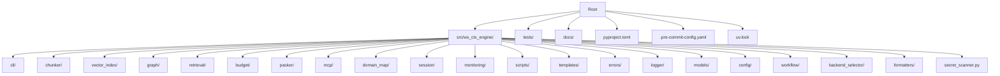
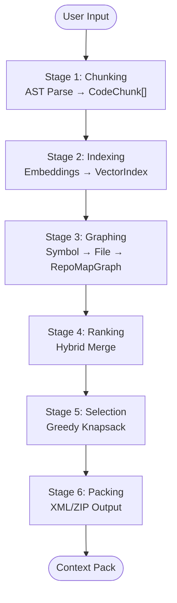
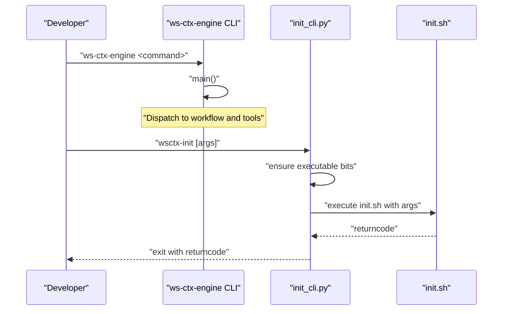
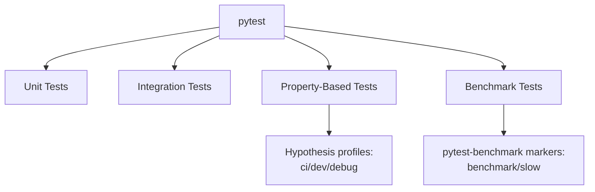
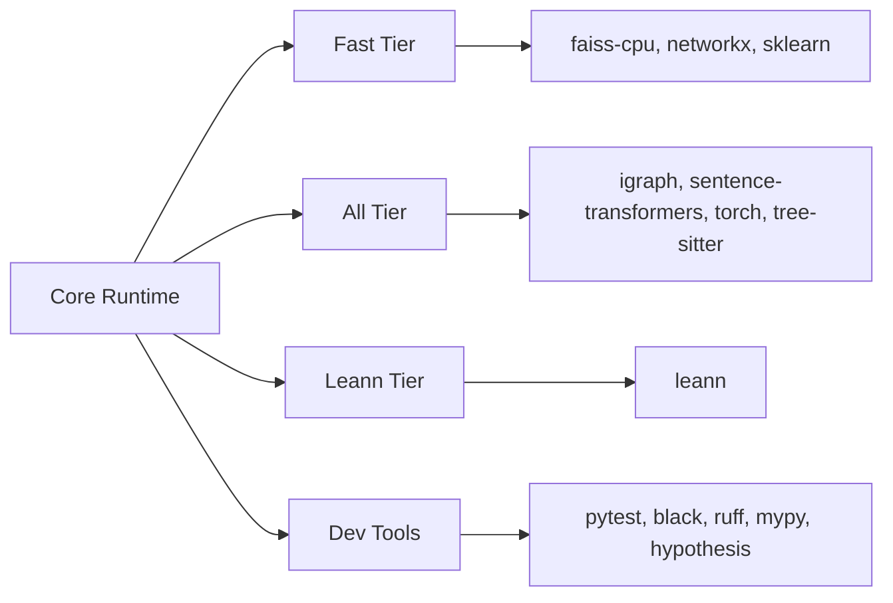

# Development Guide

<cite>
**Referenced Files in This Document**
- [pyproject.toml](file://pyproject.toml)
- [CONTRIBUTING.md](file://CONTRIBUTING.md)
- [README.md](file://README.md)
- [INSTALL.md](file://INSTALL.md)
- [.pre-commit-config.yaml](file://.pre-commit-config.yaml)
- [uv.lock](file://uv.lock)
- [tests/README.md](file://tests/README.md)
- [tests/conftest.py](file://tests/conftest.py)
- [docs/development/plans/agent-plan-v4.md](file://docs/development/plans/agent-plan-v4.md)
- [docs/reference/architecture.md](file://docs/reference/architecture.md)
- [src/ws_ctx_engine/__init__.py](file://src/ws_ctx_engine/__init__.py)
- [src/ws_ctx_engine/cli/__main__.py](file://src/ws_ctx_engine/cli/__main__.py)
- [src/ws_ctx_engine/init_cli.py](file://src/ws_ctx_engine/init_cli.py)
</cite>

## Table of Contents
1. [Introduction](#introduction)
2. [Project Structure](#project-structure)
3. [Core Components](#core-components)
4. [Architecture Overview](#architecture-overview)
5. [Detailed Component Analysis](#detailed-component-analysis)
6. [Dependency Analysis](#dependency-analysis)
7. [Performance Considerations](#performance-considerations)
8. [Troubleshooting Guide](#troubleshooting-guide)
9. [Conclusion](#conclusion)
10. [Appendices](#appendices)

## Introduction
This development guide provides a comprehensive, contributor-friendly roadmap for building, testing, and maintaining ws-ctx-engine. It covers environment setup, dependency management, testing strategies (unit, integration, property-based, and benchmarking), code quality standards, contribution workflows, and operational practices. It is designed for both new contributors and maintainers.

## Project Structure
The repository is organized around a Python package named ws-ctx-engine under src/, with extensive tests under tests/, documentation under docs/, and configuration for development and CI under pyproject.toml and .pre-commit-config.yaml.

**Diagram sources**
- [src/ws_ctx_engine/__init__.py](file://src/ws_ctx_engine/__init__.py)
- [src/ws_ctx_engine/cli/__main__.py](file://src/ws_ctx_engine/cli/__main__.py)
- [src/ws_ctx_engine/init_cli.py](file://src/ws_ctx_engine/init_cli.py)

**Section sources**
- [README.md:1-457](file://README.md#L1-L457)
- [pyproject.toml:1-243](file://pyproject.toml#L1-L243)

## Core Components
Key runtime components include:
- CLI entry points for ws-ctx-engine and initialization
- Chunking and parsing (AST-based with fallbacks)
- Vector indexing and graph construction
- Retrieval engine combining semantic and structural signals
- Budget management and packing for output formats
- MCP server and security controls for agent workflows
- Domain mapping and session deduplication
- Monitoring and performance utilities

These components are wired through the CLI and workflow modules, with configuration-driven backend selection and fallback strategies.

**Section sources**
- [src/ws_ctx_engine/__init__.py:1-33](file://src/ws_ctx_engine/__init__.py#L1-L33)
- [docs/reference/architecture.md:1-940](file://docs/reference/architecture.md#L1-L940)
- [docs/development/plans/agent-plan-v4.md:1-889](file://docs/development/plans/agent-plan-v4.md#L1-L889)

## Architecture Overview
The system implements a six-stage pipeline: chunking, indexing, graphing, ranking, selection, and packing. It supports robust fallbacks across vector indexing, graph libraries, and embedding backends, ensuring production-grade resilience.

**Diagram sources**
- [docs/reference/architecture.md:1-940](file://docs/reference/architecture.md#L1-L940)

**Section sources**
- [docs/reference/architecture.md:1-940](file://docs/reference/architecture.md#L1-L940)

## Detailed Component Analysis

### CLI and Initialization
- Entry points: ws-ctx-engine and wsctx-init
- Initialization script wrapper ensures executable permissions and delegates to bash script
- CLI module delegates to main entry point

**Diagram sources**
- [src/ws_ctx_engine/cli/__main__.py:1-5](file://src/ws_ctx_engine/cli/__main__.py#L1-L5)
- [src/ws_ctx_engine/init_cli.py:1-24](file://src/ws_ctx_engine/init_cli.py#L1-L24)

**Section sources**
- [src/ws_ctx_engine/cli/__main__.py:1-5](file://src/ws_ctx_engine/cli/__main__.py#L1-L5)
- [src/ws_ctx_engine/init_cli.py:1-24](file://src/ws_ctx_engine/init_cli.py#L1-L24)

### Testing Strategy
The project employs a multi-layered testing approach:
- Unit tests: isolated function/class verification
- Integration tests: component interaction validation
- Property-based tests: broad behavioral guarantees via Hypothesis
- Benchmarking: performance measurement with pytest-benchmark
- Stress tests: end-to-end scenarios with artifact capture

**Diagram sources**
- [tests/conftest.py:1-17](file://tests/conftest.py#L1-L17)
- [pyproject.toml:158-176](file://pyproject.toml#L158-L176)
- [tests/README.md:1-178](file://tests/README.md#L1-L178)

**Section sources**
- [tests/README.md:1-178](file://tests/README.md#L1-L178)
- [tests/conftest.py:1-17](file://tests/conftest.py#L1-L17)
- [pyproject.toml:158-176](file://pyproject.toml#L158-L176)

### Development Workflows and Branching
- Fork and clone the repository
- Create feature branches; keep main clean
- Rebase frequently onto upstream/main
- Run all checks before submitting PRs
- Update documentation and CHANGELOG.md

**Section sources**
- [CONTRIBUTING.md:22-291](file://CONTRIBUTING.md#L22-L291)

### Release Procedures
- Maintain changelog entries under “Unreleased”
- Tag releases following conventional commits
- Publish artifacts via CI/CD pipeline

**Section sources**
- [CONTRIBUTING.md:238-291](file://CONTRIBUTING.md#L238-L291)

### Contribution Guidelines and Code Review
- Follow PEP 8, Black formatting, Ruff linting, and MyPy type checking
- Write docstrings and tests for new features
- Engage early via issues; iterate on proposals
- PR checklist includes style, tests, docs, changelog, and commit hygiene

**Section sources**
- [CONTRIBUTING.md:89-291](file://CONTRIBUTING.md#L89-L291)

### Debugging and Profiling
- Use verbose flags and inspect logs in .ws-ctx-engine/logs/
- Use cProfile for deterministic profiling
- Use pytest-benchmark for performance regression detection

**Section sources**
- [CONTRIBUTING.md:356-383](file://CONTRIBUTING.md#L356-L383)

### Documentation Standards and Community Engagement
- Use Google-style docstrings
- Keep README and inline docs synchronized
- Encourage community discussions and questions

**Section sources**
- [CONTRIBUTING.md:108-153](file://CONTRIBUTING.md#L108-L153)

## Dependency Analysis
The project uses a layered dependency model:
- Core runtime dependencies for token counting, YAML parsing, XML generation, CLI, and rich output
- Optional tiers for performance (fast/all/leann/full) and development tooling
- Pre-commit hooks enforce formatting, linting, type checking, and security checks

**Diagram sources**
- [pyproject.toml:55-122](file://pyproject.toml#L55-L122)
- [.pre-commit-config.yaml:1-94](file://.pre-commit-config.yaml#L1-L94)

**Section sources**
- [pyproject.toml:55-122](file://pyproject.toml#L55-L122)
- [.pre-commit-config.yaml:1-94](file://.pre-commit-config.yaml#L1-L94)

## Performance Considerations
- Primary stack targets: sub-5 minute indexing, sub-10 second query, and sub-2GB memory usage for 10k files
- Fallback stack remains within 2x performance of primary
- Token counting accuracy targets ±2%
- Shuffle heuristic mitigates “Lost in the Middle” for model recall

**Section sources**
- [docs/reference/architecture.md:739-771](file://docs/reference/architecture.md#L739-L771)

## Troubleshooting Guide
Common issues and resolutions:
- Missing optional dependencies: use ws-ctx-engine doctor to diagnose and install recommended tiers
- C++ compilation errors: install fast/all tiers or platform build tools
- Index staleness: remove .ws-ctx-engine/ and re-run index
- Python version mismatch: ensure Python 3.11+ as required by pyproject

**Section sources**
- [README.md:386-427](file://README.md#L386-L427)
- [INSTALL.md:88-124](file://INSTALL.md#L88-L124)
- [pyproject.toml:10](file://pyproject.toml#L10)

## Conclusion
This guide consolidates environment setup, testing, quality standards, workflows, and operational practices for ws-ctx-engine contributors. By following these patterns, contributors can deliver reliable, well-tested features that integrate smoothly with the six-stage pipeline and MCP-based agent workflows.

## Appendices

### A. Environment Setup and Dependency Management
- Python version requirement: Python 3.11+ as per pyproject
- Install development dependencies: pip install -e ".[dev,all]"
- Install pre-commit hooks: pre-commit install
- Verify installation: ws-ctx-engine doctor

**Section sources**
- [pyproject.toml:10](file://pyproject.toml#L10)
- [INSTALL.md:49-87](file://INSTALL.md#L49-L87)
- [README.md:64-80](file://README.md#L64-L80)

### B. Testing Framework Configuration
- pytest configuration includes coverage, markers, and strict settings
- Hypothesis profiles: ci/dev/debug
- Stress tests: automated scenarios with artifact collection and summary reports

**Section sources**
- [pyproject.toml:158-176](file://pyproject.toml#L158-L176)
- [tests/conftest.py:1-17](file://tests/conftest.py#L1-L17)
- [tests/README.md:1-178](file://tests/README.md#L1-L178)

### C. Code Quality Standards
- Formatting: Black (line length 100)
- Linting: Ruff (E/W/F/I/B008)
- Type checking: MyPy strict mode
- Coverage: configured via pytest.ini and coverage tool
- Pre-commit enforces hooks across Python, YAML, Markdown, and security checks

**Section sources**
- [pyproject.toml:193-242](file://pyproject.toml#L193-L242)
- [.pre-commit-config.yaml:1-94](file://.pre-commit-config.yaml#L1-L94)

### D. Development Workflows and Release Procedures
- Branching: feature branches rebased onto upstream/main
- PR process: run checks, update docs/changelog, fill PR template
- Releases: conventional commits, changelog maintenance

**Section sources**
- [CONTRIBUTING.md:238-291](file://CONTRIBUTING.md#L238-L291)

### E. Debugging Techniques and Performance Testing
- Debugging: verbose flags, logs in .ws-ctx-engine/logs/, Python debugger
- Profiling: cProfile, pytest-benchmark
- Property-based testing: Hypothesis profiles and verbosity tuning

**Section sources**
- [CONTRIBUTING.md:356-383](file://CONTRIBUTING.md#L356-L383)

### F. Documentation Standards and Example Creation
- Docstrings: Google style
- Examples: CLI usage and configuration in README
- Templates: agent and MCP templates under templates/

**Section sources**
- [CONTRIBUTING.md:108-153](file://CONTRIBUTING.md#L108-L153)
- [README.md:186-234](file://README.md#L186-L234)

### G. Onboarding and Maintainer Responsibilities
- Onboarding: fork, clone, install, run tests, pre-commit
- Maintainer responsibilities: code review, release tagging, triage, and community support

**Section sources**
- [CONTRIBUTING.md:22-291](file://CONTRIBUTING.md#L22-L291)