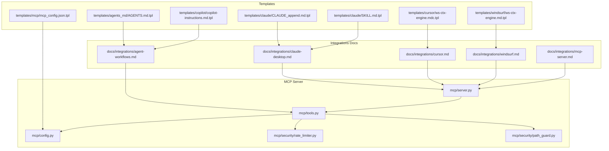
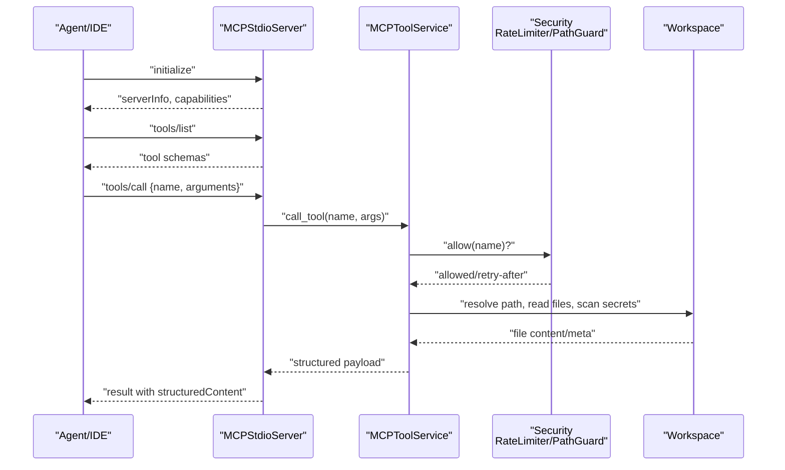
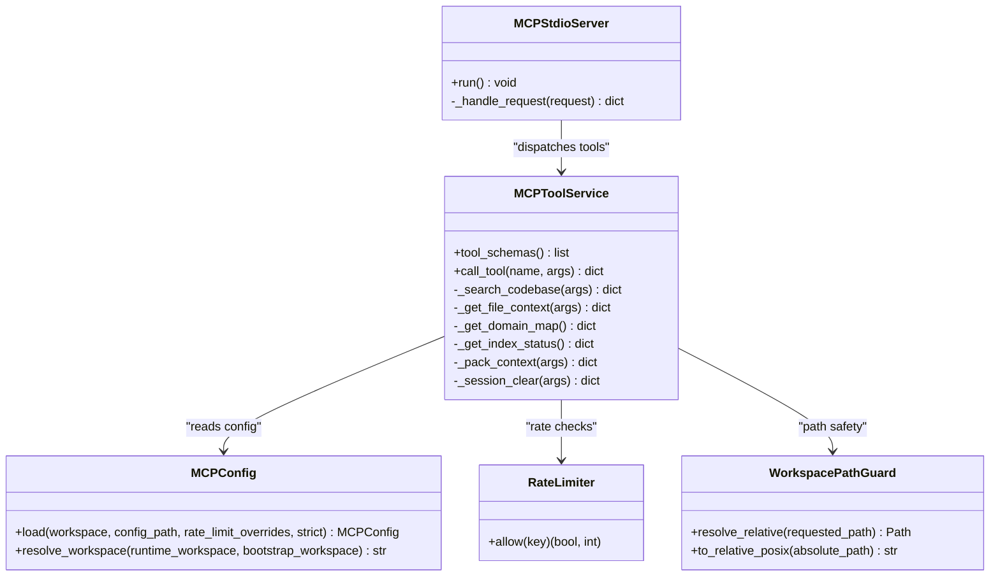
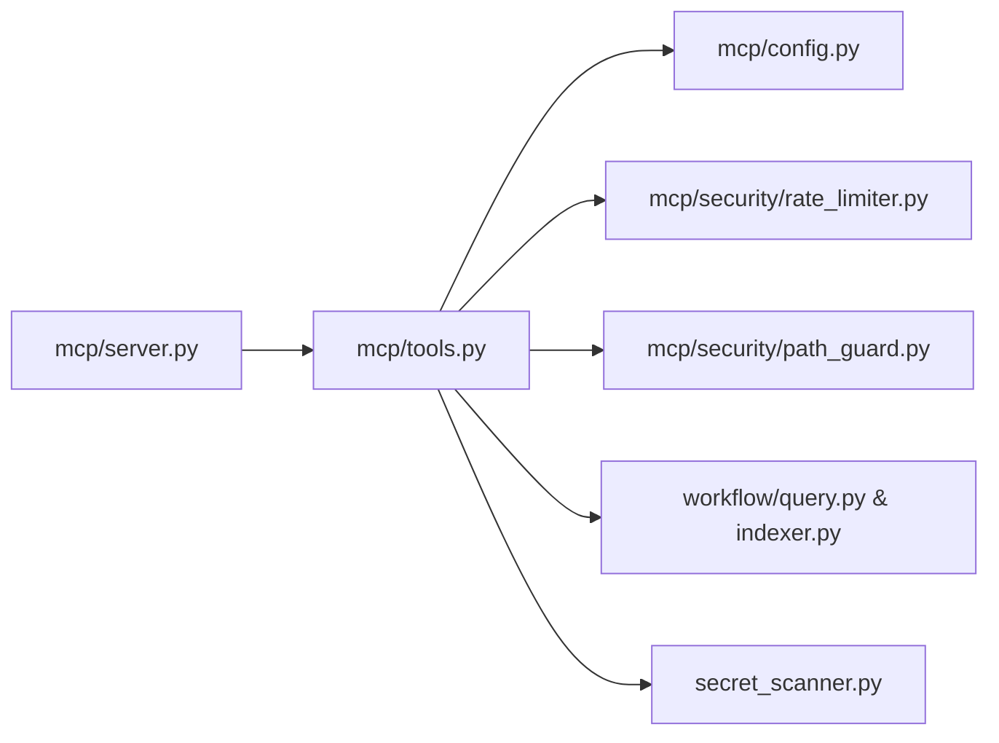

# Agent Integration Examples

<cite>
**Referenced Files in This Document**
- [AI_AGENTS.md](file://AI_AGENTS.md)
- [CLAUDE.md](file://CLAUDE.md)
- [docs/integrations/agent-workflows.md](file://docs/integrations/agent-workflows.md)
- [docs/integrations/claude-desktop.md](file://docs/integrations/claude-desktop.md)
- [docs/integrations/cursor.md](file://docs/integrations/cursor.md)
- [docs/integrations/mcp-server.md](file://docs/integrations/mcp-server.md)
- [docs/integrations/windsurf.md](file://docs/integrations/windsurf.md)
- [src/ws_ctx_engine/templates/agents_md/AGENTS.md.tpl](file://src/ws_ctx_engine/templates/agents_md/AGENTS.md.tpl)
- [src/ws_ctx_engine/templates/claude/CLAUDE_append.md.tpl](file://src/ws_ctx_engine/templates/claude/CLAUDE_append.md.tpl)
- [src/ws_ctx_engine/templates/claude/SKILL.md.tpl](file://src/ws_ctx_engine/templates/claude/SKILL.md.tpl)
- [src/ws_ctx_engine/templates/copilot/copilot-instructions.md.tpl](file://src/ws_ctx_engine/templates/copilot/copilot-instructions.md.tpl)
- [src/ws_ctx_engine/templates/cursor/ws-ctx-engine.mdc.tpl](file://src/ws_ctx_engine/templates/cursor/ws-ctx-engine.mdc.tpl)
- [src/ws_ctx_engine/templates/mcp/mcp_config.json.tpl](file://src/ws_ctx_engine/templates/mcp/mcp_config.json.tpl)
- [src/ws_ctx_engine/templates/windsurf/ws-ctx-engine.md.tpl](file://src/ws_ctx_engine/templates/windsurf/ws-ctx-engine.md.tpl)
- [src/ws_ctx_engine/mcp/tools.py](file://src/ws_ctx_engine/mcp/tools.py)
- [src/ws_ctx_engine/mcp/server.py](file://src/ws_ctx_engine/mcp/server.py)
- [src/ws_ctx_engine/mcp/config.py](file://src/ws_ctx_engine/mcp/config.py)
- [src/ws_ctx_engine/mcp/security/rate_limiter.py](file://src/ws_ctx_engine/mcp/security/rate_limiter.py)
- [src/ws_ctx_engine/mcp/security/path_guard.py](file://src/ws_ctx_engine/mcp/security/path_guard.py)
</cite>

## Table of Contents
1. [Introduction](#introduction)
2. [Project Structure](#project-structure)
3. [Core Components](#core-components)
4. [Architecture Overview](#architecture-overview)
5. [Detailed Component Analysis](#detailed-component-analysis)
6. [Dependency Analysis](#dependency-analysis)
7. [Performance Considerations](#performance-considerations)
8. [Troubleshooting Guide](#troubleshooting-guide)
9. [Conclusion](#conclusion)
10. [Appendices](#appendices)

## Introduction
This document provides comprehensive agent integration examples for ws-ctx-engine. It covers practical setup and usage patterns for integrating with Claude Desktop, Cursor, Copilot, Windsurf, and custom MCP-compatible agents. It documents the agent template system, configuration options, security and rate-limiting behavior, and performance optimization strategies. The goal is to help developers and researchers integrate ws-ctx-engine into AI-assisted coding workflows efficiently and securely.

## Project Structure
The repository organizes agent integration assets across documentation, templates, and MCP server implementation:
- Integrations documentation for Claude Desktop, Cursor, Windsurf, and MCP server reference
- Template system for generating agent-specific instructions and configuration blocks
- MCP server implementation exposing read-only tools and enforcing security and rate limits

**Diagram sources**
- [docs/integrations/agent-workflows.md](file://docs/integrations/agent-workflows.md)
- [docs/integrations/claude-desktop.md](file://docs/integrations/claude-desktop.md)
- [docs/integrations/cursor.md](file://docs/integrations/cursor.md)
- [docs/integrations/windsurf.md](file://docs/integrations/windsurf.md)
- [docs/integrations/mcp-server.md](file://docs/integrations/mcp-server.md)
- [src/ws_ctx_engine/templates/agents_md/AGENTS.md.tpl](file://src/ws_ctx_engine/templates/agents_md/AGENTS.md.tpl)
- [src/ws_ctx_engine/templates/claude/CLAUDE_append.md.tpl](file://src/ws_ctx_engine/templates/claude/CLAUDE_append.md.tpl)
- [src/ws_ctx_engine/templates/claude/SKILL.md.tpl](file://src/ws_ctx_engine/templates/claude/SKILL.md.tpl)
- [src/ws_ctx_engine/templates/copilot/copilot-instructions.md.tpl](file://src/ws_ctx_engine/templates/copilot/copilot-instructions.md.tpl)
- [src/ws_ctx_engine/templates/cursor/ws-ctx-engine.mdc.tpl](file://src/ws_ctx_engine/templates/cursor/ws-ctx-engine.mdc.tpl)
- [src/ws_ctx_engine/templates/mcp/mcp_config.json.tpl](file://src/ws_ctx_engine/templates/mcp/mcp_config.json.tpl)
- [src/ws_ctx_engine/templates/windsurf/ws-ctx-engine.md.tpl](file://src/ws_ctx_engine/templates/windsurf/ws-ctx-engine.md.tpl)
- [src/ws_ctx_engine/mcp/server.py](file://src/ws_ctx_engine/mcp/server.py)
- [src/ws_ctx_engine/mcp/tools.py](file://src/ws_ctx_engine/mcp/tools.py)
- [src/ws_ctx_engine/mcp/config.py](file://src/ws_ctx_engine/mcp/config.py)
- [src/ws_ctx_engine/mcp/security/rate_limiter.py](file://src/ws_ctx_engine/mcp/security/rate_limiter.py)
- [src/ws_ctx_engine/mcp/security/path_guard.py](file://src/ws_ctx_engine/mcp/security/path_guard.py)

**Section sources**
- [AI_AGENTS.md](file://AI_AGENTS.md)
- [CLAUDE.md](file://CLAUDE.md)

## Core Components
- Agent workflow orchestration: phase-aware ranking, session-based deduplication, and combined agent-optimized workflows
- MCP server: JSON-RPC over stdio with read-only tool registry, workspace binding, and security controls
- Template system: reusable templates for agent instructions and configuration scaffolding
- Security and rate limiting: path guard, RADE content delimiters, secret scanning, and per-tool rate limiting

Key capabilities:
- Phase-aware context selection via mode flags
- Session-based deduplication to reduce token waste
- Unified MCP toolset for search, file context retrieval, domain map, index status, and context packing
- Configurable rate limits and caching TTL for MCP operations

**Section sources**
- [docs/integrations/agent-workflows.md](file://docs/integrations/agent-workflows.md)
- [docs/integrations/mcp-server.md](file://docs/integrations/mcp-server.md)
- [src/ws_ctx_engine/mcp/tools.py](file://src/ws_ctx_engine/mcp/tools.py)
- [src/ws_ctx_engine/mcp/server.py](file://src/ws_ctx_engine/mcp/server.py)
- [src/ws_ctx_engine/mcp/config.py](file://src/ws_ctx_engine/mcp/config.py)
- [src/ws_ctx_engine/mcp/security/rate_limiter.py](file://src/ws_ctx_engine/mcp/security/rate_limiter.py)
- [src/ws_ctx_engine/mcp/security/path_guard.py](file://src/ws_ctx_engine/mcp/security/path_guard.py)

## Architecture Overview
The agent integration architecture centers on the MCP server, which exposes a standardized tool interface to IDEs and agents. Clients initialize the server, list tools, and call tools with structured arguments. The server enforces security and rate limits, performs workspace-bound file operations, and returns structured payloads.

**Diagram sources**
- [src/ws_ctx_engine/mcp/server.py](file://src/ws_ctx_engine/mcp/server.py)
- [src/ws_ctx_engine/mcp/tools.py](file://src/ws_ctx_engine/mcp/tools.py)
- [src/ws_ctx_engine/mcp/security/rate_limiter.py](file://src/ws_ctx_engine/mcp/security/rate_limiter.py)
- [src/ws_ctx_engine/mcp/security/path_guard.py](file://src/ws_ctx_engine/mcp/security/path_guard.py)

## Detailed Component Analysis

### Claude Desktop Integration
Claude Desktop integrates via MCP. The setup requires indexing the repository once, starting the MCP server bound to the workspace, and configuring Claude Desktop to connect to the server.

Setup steps:
- Index the repository
- Start the MCP server with a workspace argument
- Configure Claude Desktop MCP settings with a server entry pointing to the MCP command and args

Available tools:
- search_codebase
- get_file_context
- get_domain_map
- get_index_status

Security model:
- Read-only operations
- Workspace-bound path resolution
- Secret scanning and RADE delimiters

**Section sources**
- [docs/integrations/claude-desktop.md](file://docs/integrations/claude-desktop.md)
- [docs/integrations/mcp-server.md](file://docs/integrations/mcp-server.md)

### Cursor Integration
Cursor launches the MCP server for a workspace and registers the server in its MCP settings. The integration pattern mirrors Claude Desktop with a focus on workspace isolation and index freshness.

Setup steps:
- Index the repository
- Launch the MCP server with an absolute workspace path
- Register the MCP server in Cursor settings

Notes:
- Keep one MCP server per workspace
- Re-index after large code changes

**Section sources**
- [docs/integrations/cursor.md](file://docs/integrations/cursor.md)
- [docs/integrations/mcp-server.md](file://docs/integrations/mcp-server.md)

### Windsurf Integration
Windsurf uses the same MCP protocol. The setup involves building the index once and registering the MCP server with Windsurf.

Setup steps:
- Index the repository
- Register the MCP server in Windsurf with the MCP command and args

Exposed tools:
- search_codebase
- get_file_context
- get_domain_map
- get_index_status

**Section sources**
- [docs/integrations/windsurf.md](file://docs/integrations/windsurf.md)
- [docs/integrations/mcp-server.md](file://docs/integrations/mcp-server.md)

### Copilot Integration
Copilot integration leverages the unified CLI and MCP tooling. The template provides instructions for indexing, searching, and packaging context for Copilot.

Template highlights:
- Commands for indexing, searching, and full context packaging
- Use cases for finding files, understanding structure, code review, and investigation
- Output guidance for ZIP vs XML depending on the target interface

**Section sources**
- [src/ws_ctx_engine/templates/copilot/copilot-instructions.md.tpl](file://src/ws_ctx_engine/templates/copilot/copilot-instructions.md.tpl)

### Custom MCP-Compatible Agent
Any MCP-compatible agent can consume ws-ctx-engine’s toolset. The server supports:
- Standardized initialization and tool listing
- Tool invocation with structured arguments
- Read-only operations scoped to the workspace

Configuration:
- MCP config path defaults to a repository-local file
- Rate limits and cache TTL are configurable
- Workspace resolution supports runtime and configured values

**Section sources**
- [docs/integrations/mcp-server.md](file://docs/integrations/mcp-server.md)
- [src/ws_ctx_engine/mcp/server.py](file://src/ws_ctx_engine/mcp/server.py)
- [src/ws_ctx_engine/mcp/config.py](file://src/ws_ctx_engine/mcp/config.py)

### Agent Template System
The template system generates agent-specific instructions and configuration blocks. Templates include:
- AGENTS.md.tpl: general agent context and commands
- CLAUDE_append.md.tpl: Claude-specific append content
- SKILL.md.tpl: Claude skill definition
- copilot-instructions.md.tpl: Copilot-specific instructions
- ws-ctx-engine.mdc.tpl: Cursor guidance
- mcp_config.json.tpl: MCP server configuration scaffold
- ws-ctx-engine.md.tpl: Windsurf guidance

Usage patterns:
- Generate agent instructions tailored to the repository
- Provide standardized command placeholders for index/search/pack/status
- Offer configuration scaffolds for MCP servers

**Section sources**
- [src/ws_ctx_engine/templates/agents_md/AGENTS.md.tpl](file://src/ws_ctx_engine/templates/agents_md/AGENTS.md.tpl)
- [src/ws_ctx_engine/templates/claude/CLAUDE_append.md.tpl](file://src/ws_ctx_engine/templates/claude/CLAUDE_append.md.tpl)
- [src/ws_ctx_engine/templates/claude/SKILL.md.tpl](file://src/ws_ctx_engine/templates/claude/SKILL.md.tpl)
- [src/ws_ctx_engine/templates/copilot/copilot-instructions.md.tpl](file://src/ws_ctx_engine/templates/copilot/copilot-instructions.md.tpl)
- [src/ws_ctx_engine/templates/cursor/ws-ctx-engine.mdc.tpl](file://src/ws_ctx_engine/templates/cursor/ws-ctx-engine.mdc.tpl)
- [src/ws_ctx_engine/templates/mcp/mcp_config.json.tpl](file://src/ws_ctx_engine/templates/mcp/mcp_config.json.tpl)
- [src/ws_ctx_engine/templates/windsurf/ws-ctx-engine.md.tpl](file://src/ws_ctx_engine/templates/windsurf/ws-ctx-engine.md.tpl)

### MCP Server Implementation
The MCP server implements JSON-RPC over stdio, validates requests, lists tools, and dispatches calls to the tool service. The tool service enforces:
- Rate limiting per tool
- Workspace path guard
- Secret scanning and content wrapping
- Caching for selected tools

**Diagram sources**
- [src/ws_ctx_engine/mcp/server.py](file://src/ws_ctx_engine/mcp/server.py)
- [src/ws_ctx_engine/mcp/tools.py](file://src/ws_ctx_engine/mcp/tools.py)
- [src/ws_ctx_engine/mcp/config.py](file://src/ws_ctx_engine/mcp/config.py)
- [src/ws_ctx_engine/mcp/security/rate_limiter.py](file://src/ws_ctx_engine/mcp/security/rate_limiter.py)
- [src/ws_ctx_engine/mcp/security/path_guard.py](file://src/ws_ctx_engine/mcp/security/path_guard.py)

**Section sources**
- [src/ws_ctx_engine/mcp/server.py](file://src/ws_ctx_engine/mcp/server.py)
- [src/ws_ctx_engine/mcp/tools.py](file://src/ws_ctx_engine/mcp/tools.py)
- [src/ws_ctx_engine/mcp/config.py](file://src/ws_ctx_engine/mcp/config.py)
- [src/ws_ctx_engine/mcp/security/rate_limiter.py](file://src/ws_ctx_engine/mcp/security/rate_limiter.py)
- [src/ws_ctx_engine/mcp/security/path_guard.py](file://src/ws_ctx_engine/mcp/security/path_guard.py)

### Agent Workflows and Optimization
Agent workflows emphasize:
- Phase-aware context selection: discovery, edit, test modes
- Session-based deduplication to avoid redundant file content
- Combined agent-optimized workflow: pack with compression, shuffling, and NDJSON emission

Practical examples:
- Discovery: lightweight overview using discovery mode
- Edit: deep context for a specific change using edit mode
- Test: boost test files and mocks using test mode
- Session management: clear specific or all sessions
- Combined workflow: pack with mode, session-id, compress, and agent-mode

**Section sources**
- [docs/integrations/agent-workflows.md](file://docs/integrations/agent-workflows.md)

## Dependency Analysis
The MCP tool service depends on configuration, security modules, and workflow components. The server depends on the tool service and configuration loading.

**Diagram sources**
- [src/ws_ctx_engine/mcp/server.py](file://src/ws_ctx_engine/mcp/server.py)
- [src/ws_ctx_engine/mcp/tools.py](file://src/ws_ctx_engine/mcp/tools.py)
- [src/ws_ctx_engine/mcp/config.py](file://src/ws_ctx_engine/mcp/config.py)
- [src/ws_ctx_engine/mcp/security/rate_limiter.py](file://src/ws_ctx_engine/mcp/security/rate_limiter.py)
- [src/ws_ctx_engine/mcp/security/path_guard.py](file://src/ws_ctx_engine/mcp/security/path_guard.py)

**Section sources**
- [src/ws_ctx_engine/mcp/tools.py](file://src/ws_ctx_engine/mcp/tools.py)
- [src/ws_ctx_engine/mcp/server.py](file://src/ws_ctx_engine/mcp/server.py)
- [src/ws_ctx_engine/mcp/config.py](file://src/ws_ctx_engine/mcp/config.py)

## Performance Considerations
- Use phase-aware modes to tailor ranking and token density for the current task
- Enable session-based deduplication to reduce repeated file content
- Prefer combined agent-optimized workflow for compression and shuffled output
- Adjust token budgets and output formats based on downstream agent needs
- Keep indices fresh and re-index after significant code changes

[No sources needed since this section provides general guidance]

## Troubleshooting Guide
Common issues and resolutions:
- Index not found: ensure the repository is indexed and the index directory exists
- File not found or read failed: verify paths are within the workspace and accessible
- Rate limit exceeded: adjust rate limits in MCP configuration or back off and retry
- Access denied: ensure workspace paths are absolute and within scope
- Stale index: rebuild the index if the repository has changed since indexing

Operational tips:
- Use status commands to check index health
- Clear sessions when needed to reset deduplication state
- Validate MCP configuration and workspace resolution

**Section sources**
- [docs/integrations/mcp-server.md](file://docs/integrations/mcp-server.md)
- [src/ws_ctx_engine/mcp/tools.py](file://src/ws_ctx_engine/mcp/tools.py)
- [src/ws_ctx_engine/mcp/config.py](file://src/ws_ctx_engine/mcp/config.py)

## Conclusion
ws-ctx-engine offers robust, secure, and efficient agent integration through a standardized MCP interface and a flexible template system. By leveraging phase-aware workflows, session-based deduplication, and MCP security controls, teams can integrate ws-ctx-engine with Claude Desktop, Cursor, Windsurf, Copilot, and custom MCP-compatible agents. The provided templates and configuration scaffolds accelerate setup while the built-in security and rate-limiting features protect workspaces and resources.

[No sources needed since this section summarizes without analyzing specific files]

## Appendices

### Setup and Usage Patterns by Agent
- Claude Desktop
  - Index once, start MCP server, configure server entry in Claude Desktop
  - Use read-only tools for search, file context, domain map, and index status
- Cursor
  - Index once, launch MCP server with absolute workspace, register server in Cursor
  - Keep one server per workspace and re-index after major changes
- Windsurf
  - Index once, register MCP server with Windsurf using the MCP command and args
  - Use the same tool set as other MCP clients
- Copilot
  - Use template instructions to index, search, and package context for Copilot
  - Choose output format based on target interface (ZIP vs XML)
- Custom MCP-Compatible Agent
  - Initialize server, list tools, and call tools with structured arguments
  - Configure MCP settings for rate limits, cache TTL, and workspace

**Section sources**
- [docs/integrations/claude-desktop.md](file://docs/integrations/claude-desktop.md)
- [docs/integrations/cursor.md](file://docs/integrations/cursor.md)
- [docs/integrations/windsurf.md](file://docs/integrations/windsurf.md)
- [src/ws_ctx_engine/templates/copilot/copilot-instructions.md.tpl](file://src/ws_ctx_engine/templates/copilot/copilot-instructions.md.tpl)
- [docs/integrations/mcp-server.md](file://docs/integrations/mcp-server.md)

### Security Considerations
- Read-only tool set prevents destructive operations
- Workspace-bound path resolution prevents traversal outside the workspace
- Secret scanning and RADE delimiters protect sensitive content
- Per-tool rate limiting mitigates abuse and resource exhaustion
- Session-based deduplication reduces token waste and repeated processing

**Section sources**
- [docs/integrations/mcp-server.md](file://docs/integrations/mcp-server.md)
- [src/ws_ctx_engine/mcp/tools.py](file://src/ws_ctx_engine/mcp/tools.py)
- [src/ws_ctx_engine/mcp/security/rate_limiter.py](file://src/ws_ctx_engine/mcp/security/rate_limiter.py)
- [src/ws_ctx_engine/mcp/security/path_guard.py](file://src/ws_ctx_engine/mcp/security/path_guard.py)

### Comparative Examples and Trade-offs
- MCP vs CLI-only workflows:
  - MCP enables real-time, interactive context retrieval with security and rate limits
  - CLI workflows are simpler to script but lack dynamic security controls
- Discovery vs Edit vs Test modes:
  - Discovery mode favors directory trees and signatures with lower token density
  - Edit mode emphasizes full verbatim code with higher token density
  - Test mode boosts test files and mocks for focused coverage
- Session-based deduplication:
  - Reduces token usage and improves throughput across agent cycles
  - Requires careful session-id management to avoid stale caches

**Section sources**
- [docs/integrations/agent-workflows.md](file://docs/integrations/agent-workflows.md)
- [docs/integrations/mcp-server.md](file://docs/integrations/mcp-server.md)