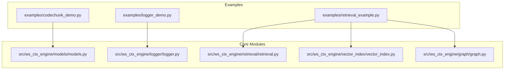
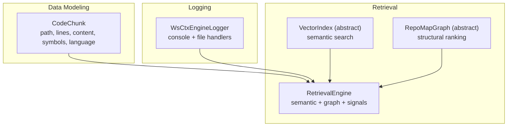
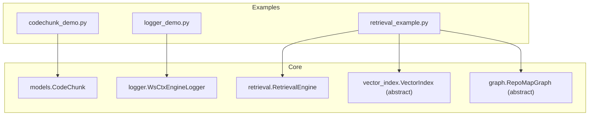

# Basic Examples

<cite>
**Referenced Files in This Document**
- [codechunk_demo.py](file://examples/codechunk_demo.py)
- [logger_demo.py](file://examples/logger_demo.py)
- [retrieval_example.py](file://examples/retrieval_example.py)
- [models.py](file://src/ws_ctx_engine/models/models.py)
- [logger.py](file://src/ws_ctx_engine/logger/logger.py)
- [retrieval.py](file://src/ws_ctx_engine/retrieval/retrieval.py)
- [vector_index.py](file://src/ws_ctx_engine/vector_index/vector_index.py)
- [graph.py](file://src/ws_ctx_engine/graph/graph.py)
- [__init__.py](file://src/ws_ctx_engine/__init__.py)
</cite>

## Table of Contents
1. [Introduction](#introduction)
2. [Project Structure](#project-structure)
3. [Core Components](#core-components)
4. [Architecture Overview](#architecture-overview)
5. [Detailed Component Analysis](#detailed-component-analysis)
6. [Dependency Analysis](#dependency-analysis)
7. [Performance Considerations](#performance-considerations)
8. [Troubleshooting Guide](#troubleshooting-guide)
9. [Conclusion](#conclusion)

## Introduction
This document provides a hands-on guide to the three basic examples shipped with ws-ctx-engine:
- codechunk_demo.py: Demonstrates the CodeChunk data model and token counting.
- logger_demo.py: Shows how to use the structured logging system.
- retrieval_example.py: Illustrates hybrid retrieval combining semantic search and structural ranking.

Each example includes step-by-step walkthroughs, parameter explanations, expected outputs, and practical usage scenarios. You will learn how to run the examples, interpret results, adjust parameters, and troubleshoot common issues.

## Project Structure
The examples live under the examples/ directory and demonstrate core modules from the ws-ctx-engine package:
- CodeChunk model and token counting
- Structured logging with dual console and file output
- Retrieval engine that merges semantic and structural signals

**Diagram sources**
- [codechunk_demo.py](file://examples/codechunk_demo.py)
- [logger_demo.py](file://examples/logger_demo.py)
- [retrieval_example.py](file://examples/retrieval_example.py)
- [models.py](file://src/ws_ctx_engine/models/models.py)
- [logger.py](file://src/ws_ctx_engine/logger/logger.py)
- [retrieval.py](file://src/ws_ctx_engine/retrieval/retrieval.py)
- [vector_index.py](file://src/ws_ctx_engine/vector_index/vector_index.py)
- [graph.py](file://src/ws_ctx_engine/graph/graph.py)

**Section sources**
- [codechunk_demo.py](file://examples/codechunk_demo.py)
- [logger_demo.py](file://examples/logger_demo.py)
- [retrieval_example.py](file://examples/retrieval_example.py)

## Core Components
This section introduces the foundational components used by the examples.

- CodeChunk: A dataclass representing a code segment with metadata (path, line range, content, defined and referenced symbols, language). It provides serialization and token counting capabilities.
- WsCtxEngineLogger: A structured logger with dual handlers (console and file), supporting phase logs, fallback notifications, and contextual error logging.
- RetrievalEngine: A hybrid retriever that combines semantic similarity and PageRank scores, then applies symbol/path/domain matching and a test-file penalty, finally normalizing scores to [0, 1].

**Section sources**
- [models.py](file://src/ws_ctx_engine/models/models.py)
- [logger.py](file://src/ws_ctx_engine/logger/logger.py)
- [retrieval.py](file://src/ws_ctx_engine/retrieval/retrieval.py)

## Architecture Overview
The examples showcase three distinct subsystems integrated into ws-ctx-engine:
- Data modeling: CodeChunk encapsulates parsed code segments.
- Logging: WsCtxEngineLogger centralizes structured logging with dual outputs.
- Retrieval: RetrievalEngine orchestrates semantic and structural ranking.

**Diagram sources**
- [models.py](file://src/ws_ctx_engine/models/models.py)
- [logger.py](file://src/ws_ctx_engine/logger/logger.py)
- [retrieval.py](file://src/ws_ctx_engine/retrieval/retrieval.py)
- [vector_index.py](file://src/ws_ctx_engine/vector_index/vector_index.py)
- [graph.py](file://src/ws_ctx_engine/graph/graph.py)

## Detailed Component Analysis

### CodeChunk Demo Walkthrough
Objective: Demonstrate the CodeChunk data model, token counting across encodings, and content preview.

Step-by-step:
1. Import the CodeChunk model from the models module.
2. Instantiate a CodeChunk with path, line range, content, defined symbols, referenced symbols, and language.
3. Print chunk metadata (path, lines, language, symbols).
4. Iterate over predefined encodings and compute token counts using the chunk’s token_count method.
5. Preview content with truncation if needed.

Key parameters and behavior:
- path: File path string.
- start_line, end_line: 1-indexed inclusive range.
- content: Raw source code string.
- symbols_defined: List of identifiers defined in the chunk.
- symbols_referenced: List of identifiers referenced in the chunk.
- language: Programming language string.
- token_count(encoding): Counts tokens using a tiktoken encoding.

Expected outputs:
- Printed metadata for the chunk.
- Token counts per encoding.
- Content preview (first 200 characters or full content).

Practical usage scenarios:
- Measure token budgets for context packaging.
- Compare tokenization across different encodings.
- Validate chunk boundaries and symbol extraction.

How to run:
- Execute the script directly from the repository root.

Common beginner mistakes:
- Passing an invalid encoding name to tiktoken.get_encoding.
- Forgetting to pass a valid encoding instance to token_count.
- Mismatched line indices (remember 1-indexed).

Interpretation tips:
- Token counts increase with content length and complexity.
- Encodings differ in vocabulary; cl100k_base is commonly used for modern models.

**Section sources**
- [codechunk_demo.py](file://examples/codechunk_demo.py)
- [models.py](file://src/ws_ctx_engine/models/models.py)

### Logger Demo Walkthrough
Objective: Show structured logging with dual outputs and common logging patterns.

Step-by-step:
1. Import get_logger from the ws-ctx-engine package.
2. Obtain a logger instance.
3. Emit info, debug, warning, and error messages.
4. Log a backend fallback event with component, primary, fallback, and reason.
5. Log a phase completion with duration and metrics.
6. Log an error with contextual information (e.g., file path and line number).
7. Print guidance on where logs are written and console visibility.

Key parameters and behavior:
- get_logger(log_dir=".ws-ctx-engine/logs"): Creates or retrieves a global logger with dual handlers.
- Console handler: INFO and above.
- File handler: DEBUG and above.
- log_fallback(component, primary, fallback, reason): Logs a fallback event.
- log_phase(phase, duration, **metrics): Logs phase completion with optional metrics.
- log_error(error, context): Logs an error with stack trace and optional context.

Expected outputs:
- Console output for INFO/warning/error.
- File logs containing DEBUG and above.
- Guidance on log locations.

Practical usage scenarios:
- Track pipeline phases and durations.
- Record fallback decisions for diagnostics.
- Capture errors with context for debugging.

How to run:
- Execute the script directly from the repository root.

Common beginner mistakes:
- Not importing get_logger from the package.
- Expecting debug logs to appear in the console (they go to the file).
- Forgetting to provide context in log_error.

Interpretation tips:
- Use log_fallback to monitor backend availability and transitions.
- Use log_phase to profile stages of your workflow.
- Use log_error with context to quickly locate issues.

**Section sources**
- [logger_demo.py](file://examples/logger_demo.py)
- [logger.py](file://src/ws_ctx_engine/logger/logger.py)
- [__init__.py](file://src/ws_ctx_engine/__init__.py)

### Retrieval Example Walkthrough
Objective: Demonstrate hybrid retrieval using a mock VectorIndex and RepoMapGraph, then retrieve files for a query.

Step-by-step:
1. Define mock implementations of VectorIndex and RepoMapGraph for demonstration.
2. Create sample CodeChunk objects representing files in the repository.
3. Build a mock vector index and dependency graph from the chunks.
4. Instantiate RetrievalEngine with semantic and structural weights.
5. Perform retrieval with a query and optional changed_files boosting.
6. Display top-ranked files and scores.
7. Optionally run retrieval without a query (PageRank-only).

Key parameters and behavior:
- MockVectorIndex: Implements build, search, save, load; returns fixed semantic scores.
- MockRepoMapGraph: Implements build, pagerank, save, load; returns fixed PageRank scores and supports boosting for changed files.
- RetrievalEngine constructor accepts semantic_weight, pagerank_weight, symbol_boost, path_boost, domain_boost, test_penalty, and optional domain_map.
- retrieve(query, changed_files, top_k): Returns a list of (file_path, score) tuples sorted by score descending, normalized to [0, 1].
- Additional signals: symbol matching, path keyword matching, domain directory matching, and test-file penalty.

Expected outputs:
- Vector index and graph build progress.
- Retrieval results with file paths and scores.
- PageRank-only results when query is None.

Practical usage scenarios:
- Combine semantic similarity with structural importance.
- Boost files that changed recently.
- Adjust weights to emphasize symbols, paths, or domains depending on query intent.

How to run:
- Execute the script directly from the repository root.

Common beginner mistakes:
- Weights not summing to 1.0 or out of bounds.
- Passing an empty chunks list to graph.build.
- Misinterpreting normalization: scores are normalized to [0, 1] after applying penalties and boosts.

Interpretation tips:
- Higher scores indicate higher combined importance.
- Symbol/path/domain matching increases scores for relevant files.
- Test files are penalized to reduce noise.

**Section sources**
- [retrieval_example.py](file://examples/retrieval_example.py)
- [retrieval.py](file://src/ws_ctx_engine/retrieval/retrieval.py)
- [vector_index.py](file://src/ws_ctx_engine/vector_index/vector_index.py)
- [graph.py](file://src/ws_ctx_engine/graph/graph.py)

## Dependency Analysis
The examples depend on core modules as follows:

**Diagram sources**
- [codechunk_demo.py](file://examples/codechunk_demo.py)
- [logger_demo.py](file://examples/logger_demo.py)
- [retrieval_example.py](file://examples/retrieval_example.py)
- [models.py](file://src/ws_ctx_engine/models/models.py)
- [logger.py](file://src/ws_ctx_engine/logger/logger.py)
- [retrieval.py](file://src/ws_ctx_engine/retrieval/retrieval.py)
- [vector_index.py](file://src/ws_ctx_engine/vector_index/vector_index.py)
- [graph.py](file://src/ws_ctx_engine/graph/graph.py)

**Section sources**
- [codechunk_demo.py](file://examples/codechunk_demo.py)
- [logger_demo.py](file://examples/logger_demo.py)
- [retrieval_example.py](file://examples/retrieval_example.py)

## Performance Considerations
- Token counting: Using tiktoken encodings is efficient but can vary by encoding. Prefer consistent encodings for reproducible budgets.
- Retrieval weights: Ensure semantic_weight + pagerank_weight = 1.0 to avoid unexpected normalization behavior.
- Logging overhead: Structured logging with dual handlers adds minimal overhead; keep log levels appropriate for your environment.
- Retrieval scaling: For large repositories, consider reducing top_k or adjusting weights to limit downstream processing.

[No sources needed since this section provides general guidance]

## Troubleshooting Guide

Common issues and resolutions:

- CodeChunk token count errors:
  - Symptom: Invalid encoding name or missing encoding instance.
  - Resolution: Ensure you pass a valid tiktoken encoding instance to token_count.

- Logger output not visible:
  - Symptom: Debug logs not appearing in console.
  - Resolution: Remember that debug goes to the file; console shows INFO and above.

- RetrievalEngine weight validation:
  - Symptom: ValueError indicating weights must sum to 1.0.
  - Resolution: Adjust semantic_weight and pagerank_weight so their sum equals 1.0.

- Empty retrieval results:
  - Symptom: No files returned for a query.
  - Resolution: Verify that the query tokens are meaningful and that the mock implementations return non-empty results.

- Graph build failures:
  - Symptom: ValueError when building the graph from empty chunks.
  - Resolution: Ensure chunks are populated before calling build.

**Section sources**
- [models.py](file://src/ws_ctx_engine/models/models.py)
- [logger.py](file://src/ws_ctx_engine/logger/logger.py)
- [retrieval.py](file://src/ws_ctx_engine/retrieval/retrieval.py)
- [graph.py](file://src/ws_ctx_engine/graph/graph.py)

## Conclusion
These basic examples illustrate fundamental capabilities of ws-ctx-engine:
- CodeChunk enables precise representation and measurement of code segments.
- WsCtxEngineLogger provides structured, dual-output logging essential for observability.
- RetrievalEngine demonstrates a practical hybrid approach combining semantic and structural signals.

Use these examples as starting points to explore more advanced workflows, integrate real backends, and adapt parameters for your specific use cases.