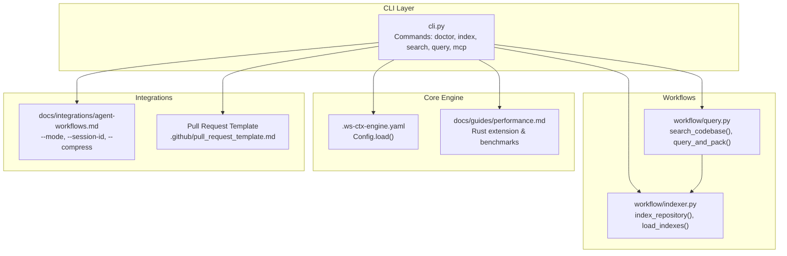
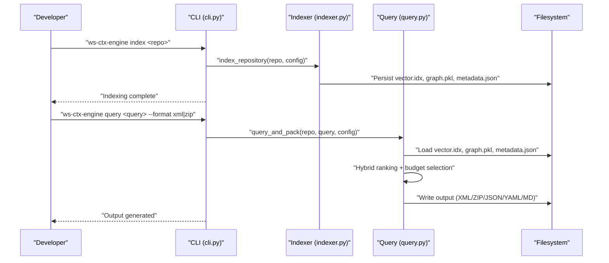
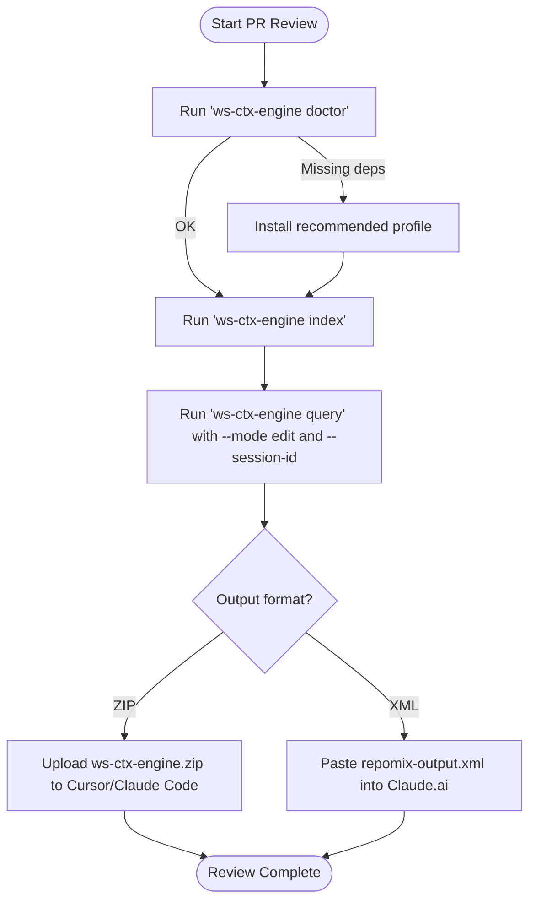
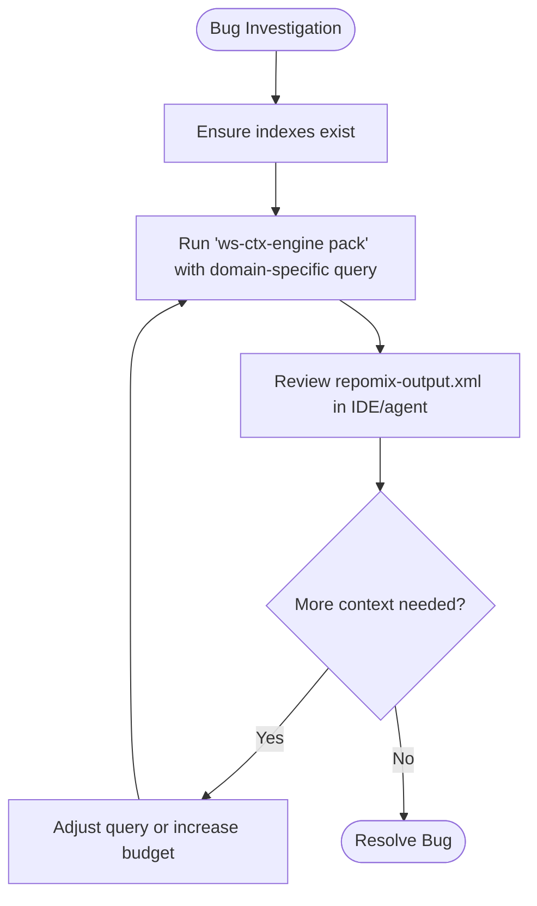
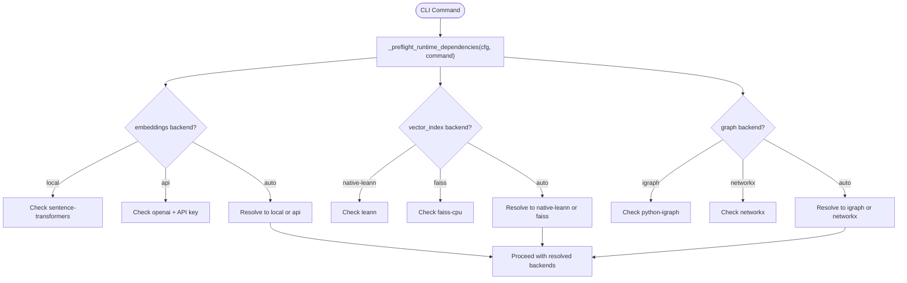

# Development Workflows

<cite>
**Referenced Files in This Document**
- [README.md](file://README.md)
- [CONTRIBUTING.md](file://CONTRIBUTING.md)
- [INSTALL.md](file://INSTALL.md)
- [.ws-ctx-engine.yaml.example](file://.ws-ctx-engine.yaml.example)
- [pyproject.toml](file://pyproject.toml)
- [src/ws_ctx_engine/cli/cli.py](file://src/ws_ctx_engine/cli/cli.py)
- [src/ws_ctx_engine/workflow/indexer.py](file://src/ws_ctx_engine/workflow/indexer.py)
- [src/ws_ctx_engine/workflow/query.py](file://src/ws_ctx_engine/workflow/query.py)
- [docs/integrations/agent-workflows.md](file://docs/integrations/agent-workflows.md)
- [docs/guides/performance.md](file://docs/guides/performance.md)
- [docs/reference/config.md](file://docs/reference/config.md)
- [.github/pull_request_template.md](file://.github/pull_request_template.md)
</cite>

## Table of Contents
1. [Introduction](#introduction)
2. [Project Structure](#project-structure)
3. [Core Components](#core-components)
4. [Architecture Overview](#architecture-overview)
5. [Detailed Component Analysis](#detailed-component-analysis)
6. [Dependency Analysis](#dependency-analysis)
7. [Performance Considerations](#performance-considerations)
8. [Troubleshooting Guide](#troubleshooting-guide)
9. [Conclusion](#conclusion)
10. [Appendices](#appendices)

## Introduction
This document provides end-to-end development workflow examples for integrating ws-ctx-engine into daily engineering practices. It covers pull request review processes, bug investigation procedures, onboarding new team members, and technical debt analysis. For each scenario, you will find step-by-step instructions, expected outputs, decision points, and configuration guidance tailored to different project types, team sizes, and development methodologies. Integration patterns with popular development tools, IDEs, and CI/CD pipelines are documented alongside customization options, performance considerations, and scalability patterns.

## Project Structure
The repository is organized around a CLI-first design with modular workflows:
- CLI entrypoints define commands for indexing, searching, querying, and packaging context.
- Workflow modules encapsulate the index and query phases, including retrieval, budgeting, and output packing.
- Configuration is managed via a YAML file with strong defaults and validation.
- Integrations and guides document agent workflows, performance tuning, and configuration reference.

**Diagram sources**
- [src/ws_ctx_engine/cli/cli.py:27-120](file://src/ws_ctx_engine/cli/cli.py#L27-L120)
- [src/ws_ctx_engine/workflow/indexer.py:72-120](file://src/ws_ctx_engine/workflow/indexer.py#L72-L120)
- [src/ws_ctx_engine/workflow/query.py:158-228](file://src/ws_ctx_engine/workflow/query.py#L158-L228)
- [.ws-ctx-engine.yaml.example:1-60](file://.ws-ctx-engine.yaml.example#L1-L60)
- [docs/integrations/agent-workflows.md:1-40](file://docs/integrations/agent-workflows.md#L1-L40)
- [.github/pull_request_template.md:1-60](file://.github/pull_request_template.md#L1-L60)

**Section sources**
- [README.md:118-186](file://README.md#L118-L186)
- [pyproject.toml:124-129](file://pyproject.toml#L124-L129)

## Core Components
- CLI: Provides commands for dependency verification, indexing, searching, querying, and MCP server operation. It also supports agent mode and NDJSON emission for tool integrations.
- Indexer: Builds and persists vector and graph indexes, manages incremental updates, and tracks metadata for staleness detection.
- Query: Loads indexes, retrieves candidates via hybrid ranking, selects files within token budget, and packages outputs in XML, ZIP, or structured formats.
- Configuration: Centralized YAML-based configuration with validation and sensible defaults for output formats, scoring weights, filtering, backend selection, and performance tuning.
- Integrations: Agent workflows guide documents phase-aware ranking, semantic deduplication, and rule persistence for AI agents.

**Section sources**
- [src/ws_ctx_engine/cli/cli.py:405-800](file://src/ws_ctx_engine/cli/cli.py#L405-L800)
- [src/ws_ctx_engine/workflow/indexer.py:72-372](file://src/ws_ctx_engine/workflow/indexer.py#L72-L372)
- [src/ws_ctx_engine/workflow/query.py:230-617](file://src/ws_ctx_engine/workflow/query.py#L230-L617)
- [docs/reference/config.md:95-176](file://docs/reference/config.md#L95-L176)

## Architecture Overview
The system implements a two-phase pipeline:
- Index phase: Parse codebase, build vector and graph indexes, persist metadata, and optionally build a domain keyword map.
- Query phase: Load indexes, retrieve candidates with hybrid ranking, select within budget, and pack outputs.

**Diagram sources**
- [src/ws_ctx_engine/cli/cli.py:405-501](file://src/ws_ctx_engine/cli/cli.py#L405-L501)
- [src/ws_ctx_engine/workflow/indexer.py:72-120](file://src/ws_ctx_engine/workflow/indexer.py#L72-L120)
- [src/ws_ctx_engine/workflow/query.py:230-320](file://src/ws_ctx_engine/workflow/query.py#L230-L320)

## Detailed Component Analysis

### Pull Request Review Workflow
End-to-end process for PR reviews using context packs:
- Step 1: Verify dependencies and install recommended backends.
  - Command: [doctor:120-127](file://README.md#L120-L127)
  - Expected: All recommended optional dependencies present; otherwise install recommended profile.
- Step 2: Index the repository once (or incrementally).
  - Command: [index:128-135](file://README.md#L128-L135)
  - Options: [--config, --verbose, --incremental]
  - Expected: Index artifacts created under .ws-ctx-engine/.
- Step 3: Generate context pack for PR review.
  - Command: [query:140-161](file://README.md#L140-L161) or [pack:162-185](file://README.md#L162-L185)
  - Options: [--changed-files, --format zip, --budget, --mode edit, --session-id, --compress, --shuffle]
  - Expected: ZIP output with manifest and files; or XML for paste workflows.
- Step 4: Upload or paste output into the IDE/agent for review.
  - Outputs: ws-ctx-engine.zip or repomix-output.xml in output/.

Decision points:
- Use --mode edit for deep context with verbatim code.
- Use --session-id to avoid redundant content across multiple agent calls.
- Use --compress to reduce token usage for supporting files.

**Diagram sources**
- [README.md:120-185](file://README.md#L120-L185)
- [docs/integrations/agent-workflows.md:8-46](file://docs/integrations/agent-workflows.md#L8-L46)

**Section sources**
- [README.md:120-185](file://README.md#L120-L185)
- [docs/integrations/agent-workflows.md:8-46](file://docs/integrations/agent-workflows.md#L8-L46)

### Bug Investigation Procedure
Structured approach to investigating bugs using natural language queries:
- Step 1: Index repository (if not already indexed).
  - Command: [index:128-135](file://README.md#L128-L135)
- Step 2: Pack context with a focused query.
  - Command: [pack:162-185](file://README.md#L162-L185)
  - Options: [--query "<problem>", --format xml, --budget lower for targeted review]
  - Expected: repomix-output.xml with high-relevance files.
- Step 3: Analyze the output in the target IDE/agent.
  - Decision: If insufficient context, refine query or increase budget.

**Diagram sources**
- [README.md:162-185](file://README.md#L162-L185)

**Section sources**
- [README.md:162-185](file://README.md#L162-L185)

### Onboarding New Team Members
Accelerate onboarding by providing curated context packs:
- Step 1: Configure project-specific settings.
  - Copy [.ws-ctx-engine.yaml.example:1-60](file://.ws-ctx-engine.yaml.example#L1-L60) to .ws-ctx-engine.yaml and adjust include/exclude patterns, weights, and output format.
- Step 2: Generate onboarding context.
  - Command: [pack:162-185](file://README.md#L162-L185)
  - Options: [--query "project structure and entry points", --format zip, --budget appropriate for orientation]
- Step 3: Share output with new hires for guided exploration.

Customization tips:
- Increase include_tests for learning/testing workflows.
- Tune semantic_weight toward PageRank for architectural understanding.
- Use ai_rules to always include CONTRIBUTING.md, CODE_OF_CONDUCT.md, and project-specific rules.

**Section sources**
- [.ws-ctx-engine.yaml.example:207-254](file://.ws-ctx-engine.yaml.example#L207-L254)
- [docs/reference/config.md:169-176](file://docs/reference/config.md#L169-L176)

### Technical Debt Analysis
Systematic approach to identifying and triaging technical debt:
- Step 1: Index repository.
  - Command: [index:128-135](file://README.md#L128-L135)
- Step 2: Query for debt indicators.
  - Command: [query:140-161](file://README.md#L140-L161)
  - Options: [--query "legacy patterns, hardcoded values, repeated logic", --mode discovery, --compress]
- Step 3: Curate findings and prioritize remediation.
  - Output: ZIP with manifest and ranked files for offline review.

Scalability note:
- Use --incremental to keep indexes fresh without full rebuilds.
- Use --session-id to avoid redundant token usage across repeated queries.

**Section sources**
- [README.md:140-185](file://README.md#L140-L185)
- [src/ws_ctx_engine/workflow/query.py:356-366](file://src/ws_ctx_engine/workflow/query.py#L356-L366)

## Dependency Analysis
Runtime dependency resolution and fallbacks are handled centrally in the CLI:
- Dependency preflight validates availability of optional backends and auto-resolves configurations.
- Fallback chain ensures functionality across environments.

**Diagram sources**
- [src/ws_ctx_engine/cli/cli.py:256-327](file://src/ws_ctx_engine/cli/cli.py#L256-L327)

**Section sources**
- [src/ws_ctx_engine/cli/cli.py:239-327](file://src/ws_ctx_engine/cli/cli.py#L239-L327)

## Performance Considerations
- Rust extension: Optional acceleration for hot-path operations (file walking, hashing, token counting). Install and build with maturin; fallbacks are automatic.
- Incremental indexing: Rebuild only changed/deleted files to reduce index time.
- Compression and deduplication: Reduce token usage for supporting files and avoid repeating content across agent calls.
- Backend selection: Prefer primary backends (LEANN, igraph, sentence-transformers) for optimal performance; fallbacks remain functional.

**Section sources**
- [docs/guides/performance.md:1-81](file://docs/guides/performance.md#L1-L81)
- [src/ws_ctx_engine/workflow/indexer.py:139-150](file://src/ws_ctx_engine/workflow/indexer.py#L139-L150)
- [docs/integrations/agent-workflows.md:31-62](file://docs/integrations/agent-workflows.md#L31-L62)

## Troubleshooting Guide
Common issues and resolutions:
- Missing optional dependencies: Use [doctor:120-127](file://README.md#L120-L127) to diagnose and install recommended profile.
- Index staleness: Indexes are rebuilt automatically when files change; force rebuild by removing .ws-ctx-engine/ and re-indexing.
- Embedding OOM or API failures: Switch to API embeddings or reduce batch size; configure api_provider and api_key_env.
- C++ compilation errors (primary backends): Install platform build tools or switch to fast tier.

**Section sources**
- [README.md:386-428](file://README.md#L386-L428)
- [INSTALL.md:93-124](file://INSTALL.md#L93-L124)

## Conclusion
ws-ctx-engine enables efficient, scalable, and customizable development workflows across diverse teams and methodologies. By leveraging indexing, hybrid ranking, and flexible output formats, teams can accelerate PR reviews, investigate bugs, onboard new members, and analyze technical debt. The CLI, configuration, and integrations provide a robust foundation for automation and agent-assisted development.

## Appendices

### Configuration Examples by Scenario
- PR Review (balanced relevance and structure):
  - semantic_weight: 0.4, pagerank_weight: 0.6, format: zip
- Bug Investigation (semantic focus):
  - semantic_weight: 0.8, pagerank_weight: 0.2, format: xml, token_budget: lower
- Documentation Generation (core APIs):
  - Adjust include_patterns to target API and schema files.

**Section sources**
- [.ws-ctx-engine.yaml.example:210-235](file://.ws-ctx-engine.yaml.example#L210-L235)

### Integration Patterns
- IDEs and Agents:
  - Use --mode for phase-aware ranking; --session-id for semantic deduplication; --compress for token efficiency.
  - NDJSON output via --agent-mode for tool integrations.
- CI/CD:
  - Cache .ws-ctx-engine/ between runs to speed up indexing.
  - Use --incremental to minimize rebuild costs.
  - Configure token budgets aligned with LLM limits.

**Section sources**
- [docs/integrations/agent-workflows.md:8-103](file://docs/integrations/agent-workflows.md#L8-L103)
- [README.md:128-185](file://README.md#L128-L185)

### Pull Request Review Process (Template Guidance)
- Use the PR template to document changes, testing, performance impact, and checklist items.
- Include commands and expected outputs for reproducibility.

**Section sources**
- [.github/pull_request_template.md:1-139](file://.github/pull_request_template.md#L1-L139)