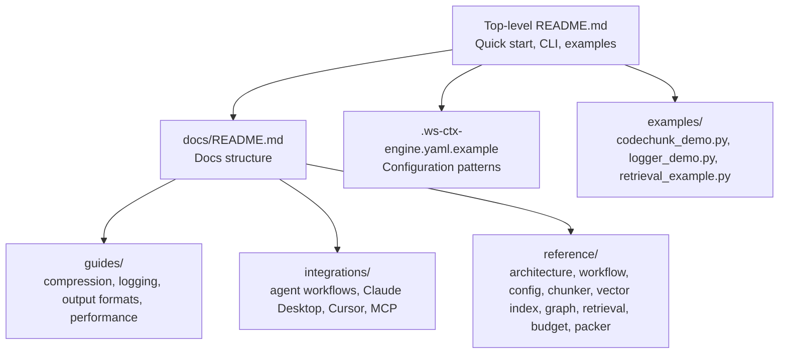
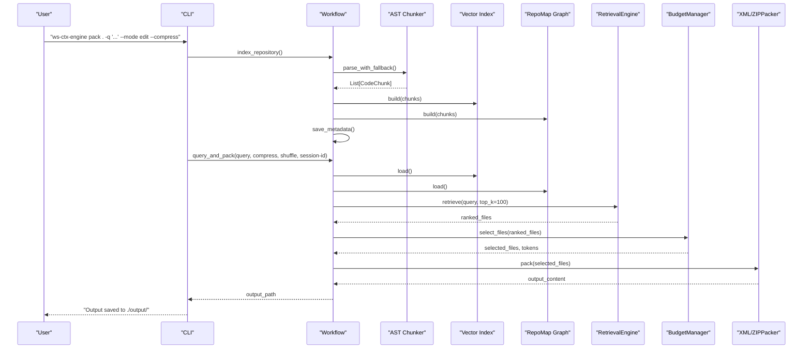
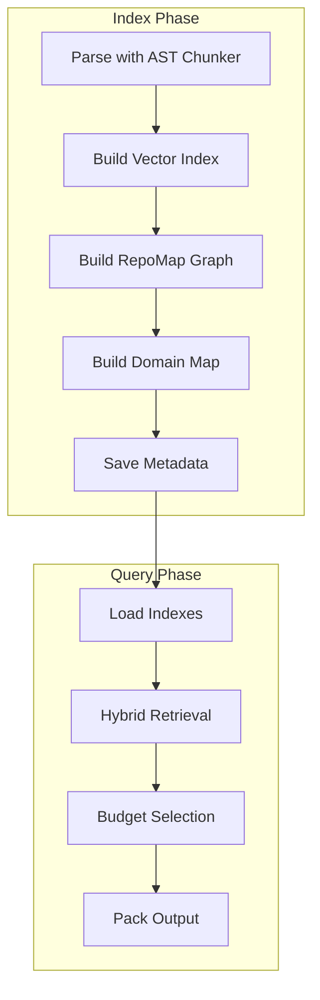
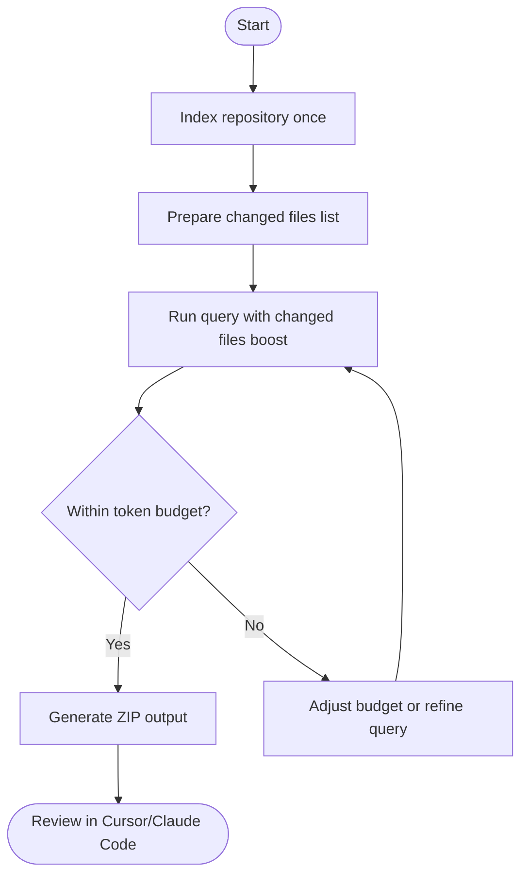
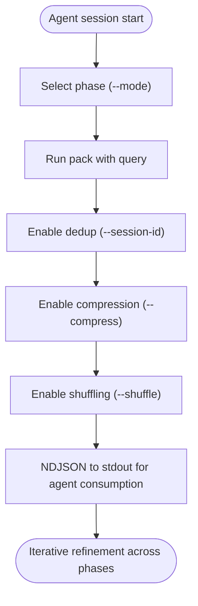
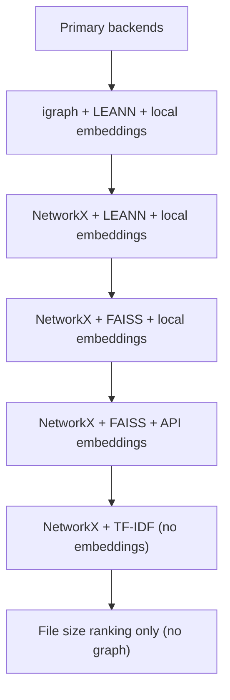

# Examples & Use Cases

<cite>
**Referenced Files in This Document**
- [README.md](file://README.md)
- [INSTALL.md](file://INSTALL.md)
- [AI_AGENTS.md](file://AI_AGENTS.md)
- [CLAUDE.md](file://CLAUDE.md)
- [docs/README.md](file://docs/README.md)
- [.ws-ctx-engine.yaml.example](file://.ws-ctx-engine.yaml.example)
- [examples/codechunk_demo.py](file://examples/codechunk_demo.py)
- [examples/logger_demo.py](file://examples/logger_demo.py)
- [examples/retrieval_example.py](file://examples/retrieval_example.py)
- [docs/guides/compression.md](file://docs/guides/compression.md)
- [docs/integrations/agent-workflows.md](file://docs/integrations/agent-workflows.md)
- [docs/integrations/claude-desktop.md](file://docs/integrations/claude-desktop.md)
- [docs/integrations/cursor.md](file://docs/integrations/cursor.md)
- [docs/reference/workflow.md](file://docs/reference/workflow.md)
- [docs/reference/config.md](file://docs/reference/config.md)
</cite>

## Table of Contents
1. [Introduction](#introduction)
2. [Project Structure](#project-structure)
3. [Core Components](#core-components)
4. [Architecture Overview](#architecture-overview)
5. [Detailed Component Analysis](#detailed-component-analysis)
6. [Dependency Analysis](#dependency-analysis)
7. [Performance Considerations](#performance-considerations)
8. [Troubleshooting Guide](#troubleshooting-guide)
9. [Conclusion](#conclusion)
10. [Appendices](#appendices)

## Introduction
This document provides comprehensive examples and use cases for ws-ctx-engine. It covers end-to-end workflows for code review, bug investigation, documentation generation, and agent-assisted development. You will find step-by-step instructions, expected outputs, configuration guidance, integration tips, best practices, and performance/scaling advice tailored to different environments and team needs.

## Project Structure
The repository organizes user-facing documentation, integration guides, and internal reference materials alongside the core engine implementation. Key areas for use cases:
- Top-level README and INSTALL guides for quick start and installation tiers
- docs/ with guides, integrations, and reference materials
- examples/ for runnable demos of core concepts
- .ws-ctx-engine.yaml.example for configuration patterns

**Diagram sources**
- [README.md:1-457](file://README.md#L1-L457)
- [docs/README.md:1-104](file://docs/README.md#L1-L104)
- [.ws-ctx-engine.yaml.example:1-254](file://.ws-ctx-engine.yaml.example#L1-L254)
- [examples/codechunk_demo.py:1-63](file://examples/codechunk_demo.py#L1-L63)
- [examples/logger_demo.py:1-36](file://examples/logger_demo.py#L1-L36)
- [examples/retrieval_example.py:1-156](file://examples/retrieval_example.py#L1-L156)

**Section sources**
- [README.md:1-457](file://README.md#L1-L457)
- [docs/README.md:1-104](file://docs/README.md#L1-L104)

## Core Components
This section highlights the components most relevant to end-to-end use cases and how they interact during indexing and querying.

- Indexing pipeline (index_repository): AST parsing → vector index → dependency graph → domain map → metadata persistence
- Query pipeline (query_and_pack): load indexes → hybrid retrieval → budget selection → pack output
- Agent-optimized features: phase-aware ranking (--mode), semantic deduplication (--session-id), compression (--compress), and context shuffling (--shuffle)

**Diagram sources**
- [docs/reference/workflow.md:269-300](file://docs/reference/workflow.md#L269-L300)
- [docs/reference/workflow.md:138-181](file://docs/reference/workflow.md#L138-L181)
- [docs/reference/workflow.md:48-87](file://docs/reference/workflow.md#L48-L87)

**Section sources**
- [docs/reference/workflow.md:1-490](file://docs/reference/workflow.md#L1-L490)

## Architecture Overview
The engine’s 6-stage pipeline is orchestrated by the Workflow module. It auto-selects backends, handles staleness, and supports multiple output formats. Agent workflows integrate seamlessly with phase-aware ranking, deduplication, compression, and shuffling.

**Diagram sources**
- [docs/reference/workflow.md:17-37](file://docs/reference/workflow.md#L17-L37)
- [docs/reference/workflow.md:89-137](file://docs/reference/workflow.md#L89-L137)
- [docs/reference/workflow.md:183-190](file://docs/reference/workflow.md#L183-L190)

**Section sources**
- [docs/reference/workflow.md:1-490](file://docs/reference/workflow.md#L1-L490)

## Detailed Component Analysis

### Code Review Workflow (Pull Request Reviews)
End-to-end scenario for reviewing changed files with context.

Steps:
1. Index the repository once (build vector index, graph, and metadata).
2. For each PR, generate context focused on changed files plus dependencies.
3. Upload the ZIP output to Cursor or Claude Code for multi-turn review.

Expected outputs:
- ZIP archive with files/ and REVIEW_CONTEXT.md manifest
- Token usage within budget; manifest lists importance scores and reading order

**Diagram sources**
- [README.md:310-323](file://README.md#L310-L323)
- [docs/reference/workflow.md:145-181](file://docs/reference/workflow.md#L145-L181)

**Section sources**
- [README.md:310-323](file://README.md#L310-L323)
- [docs/reference/workflow.md:145-181](file://docs/reference/workflow.md#L145-L181)

### Bug Investigation Procedure
Natural language search to locate relevant code for debugging.

Steps:
1. Use pack with a query describing the bug area.
2. Prefer XML output for paste workflows when pasting into Claude.ai.
3. Inspect the generated XML content for relevant files and adjust query if needed.

Expected outputs:
- repomix-output.xml (for paste) or ws-ctx-engine.zip (for upload)
- Focus on files related to database connections, timeouts, or error handling

**Section sources**
- [README.md:325-335](file://README.md#L325-L335)

### Documentation Generation Process
Select core API files and public interfaces to bootstrap documentation.

Steps:
1. Configure include_patterns to target API, models, and schemas.
2. Increase token budget for richer context.
3. Use ZIP output to preserve directory structure and manifest.

Expected outputs:
- ZIP with API-centric files and a manifest guiding documentation authors

**Section sources**
- [.ws-ctx-engine.yaml.example:226-235](file://.ws-ctx-engine.yaml.example#L226-L235)
- [README.md:337-345](file://README.md#L337-L345)

### Agent-Assisted Development Patterns
Agent workflows optimize for discovery, editing, and testing phases.

Key features:
- Phase-aware ranking (--mode discovery/edit/test)
- Semantic deduplication (--session-id)
- Compression (--compress) and shuffling (--shuffle)
- AI rule persistence (e.g., CLAUDE.md, .cursorrules)

**Diagram sources**
- [docs/integrations/agent-workflows.md:8-27](file://docs/integrations/agent-workflows.md#L8-L27)
- [docs/integrations/agent-workflows.md:31-61](file://docs/integrations/agent-workflows.md#L31-L61)
- [docs/integrations/agent-workflows.md:85-103](file://docs/integrations/agent-workflows.md#L85-L103)

**Section sources**
- [docs/integrations/agent-workflows.md:1-103](file://docs/integrations/agent-workflows.md#L1-L103)

### Onboarding New Team Members
Provide a lightweight overview to accelerate familiarization.

Steps:
1. Use discovery mode to surface directory trees and high-level signatures.
2. Include AI rule files (e.g., CLAUDE.md, CONTRIBUTING.md) to anchor expectations.
3. Keep token budget moderate for quick iteration.

Expected outputs:
- Lightweight context pack with readable summaries and rule anchors

**Section sources**
- [docs/integrations/agent-workflows.md:18-27](file://docs/integrations/agent-workflows.md#L18-L27)
- [docs/reference/config.md:327-338](file://docs/reference/config.md#L327-L338)

### Technical Debt Analysis
Target files with complex dependencies or outdated patterns.

Steps:
1. Increase PageRank weight to surface core dependencies.
2. Narrow include_patterns to specific modules or layers.
3. Use XML output for concise paste workflows.

Expected outputs:
- Ranked files emphasizing architectural bottlenecks and high-centrality modules

**Section sources**
- [.ws-ctx-engine.yaml.example:210-217](file://.ws-ctx-engine.yaml.example#L210-L217)
- [README.md:337-345](file://README.md#L337-L345)

### Knowledge Transfer
Capture institutional knowledge and conventions.

Steps:
1. Enable AI rule auto-detection and optionally add extra rule files.
2. Boost rule file scores to ensure they are always present.
3. Use ZIP output to preserve rule files alongside code.

Expected outputs:
- Context packs that consistently surface project-specific rules and standards

**Section sources**
- [docs/reference/config.md:327-338](file://docs/reference/config.md#L327-L338)
- [docs/integrations/agent-workflows.md:65-82](file://docs/integrations/agent-workflows.md#L65-L82)

## Dependency Analysis
Installation tiers and fallback strategy influence performance and reliability.

- Core: minimal dependencies for basic functionality
- All: recommended tier with primary backends (fast PageRank, local embeddings, accurate AST parsing)
- Fast: fallback-focused with FAISS and NetworkX
- Fallback ladder: graceful degradation across backends

**Diagram sources**
- [README.md:277-295](file://README.md#L277-L295)
- [INSTALL.md:3-48](file://INSTALL.md#L3-L48)

**Section sources**
- [README.md:277-295](file://README.md#L277-L295)
- [INSTALL.md:3-48](file://INSTALL.md#L3-L48)

## Performance Considerations
- Use the “All” installation tier for optimal speed and capabilities
- Enable incremental indexing to reduce rebuild time on large repos
- Tune token budget to match your LLM’s context window
- Apply compression and shuffling to reduce token usage and improve recall
- Prefer ZIP for upload workflows and XML for paste workflows

[No sources needed since this section provides general guidance]

## Troubleshooting Guide
Common issues and resolutions:
- Missing optional dependencies: install the “All” tier or configure fallback backends
- Stale index warnings: remove .ws-ctx-engine/ and re-run index
- Out-of-memory with embeddings: reduce batch size or switch to API embeddings
- Slow graph operations: prefer igraph; otherwise rely on NetworkX fallback

**Section sources**
- [README.md:386-427](file://README.md#L386-L427)
- [INSTALL.md:93-120](file://INSTALL.md#L93-L120)

## Conclusion
ws-ctx-engine streamlines context creation for code review, bug triage, documentation, and agent-assisted development. By combining semantic search, PageRank, and production-grade fallbacks, it adapts to diverse environments and workflows. Use the provided examples and configurations to tailor the engine to your team’s needs, and leverage compression, deduplication, and phase-aware ranking for optimal agent performance.

[No sources needed since this section summarizes without analyzing specific files]

## Appendices

### Configuration Examples by Use Case
- PR Review Workflow: emphasize PageRank weight and ZIP output
- Bug Investigation: emphasize semantic weight and XML output
- Documentation Generation: narrow include_patterns and increase budget
- Minimal Dependencies: force FAISS, NetworkX, and API embeddings
- Maximum Performance: use LEANN, igraph, and local embeddings on GPU

**Section sources**
- [.ws-ctx-engine.yaml.example:210-254](file://.ws-ctx-engine.yaml.example#L210-L254)

### Integration Examples
- Claude Desktop: start MCP server and configure client to connect
- Cursor: run MCP server and register server in Cursor settings
- Agent Workflows: combine --mode, --session-id, --compress, --shuffle

**Section sources**
- [docs/integrations/claude-desktop.md:1-45](file://docs/integrations/claude-desktop.md#L1-L45)
- [docs/integrations/cursor.md:1-36](file://docs/integrations/cursor.md#L1-L36)
- [docs/integrations/agent-workflows.md:1-103](file://docs/integrations/agent-workflows.md#L1-L103)

### Best Practices
- Align semantic_weight and pagerank_weight with your use case
- Respect .gitignore and define explicit include/exclude patterns
- Use AI rule files to anchor agent behavior
- Monitor index staleness and rebuild as needed
- Benchmark performance with and without compression/shuffle

**Section sources**
- [docs/reference/config.md:95-176](file://docs/reference/config.md#L95-L176)
- [docs/guides/compression.md:1-91](file://docs/guides/compression.md#L1-L91)
- [docs/reference/workflow.md:302-321](file://docs/reference/workflow.md#L302-L321)

### Comparative Examples
- XML vs ZIP: XML for paste workflows; ZIP for upload workflows
- Compression trade-offs: high relevance files keep full content; lower relevance files are compressed to reduce token usage
- Shuffling trade-offs: improves recall for start/end positions at the cost of middle content

**Section sources**
- [README.md:109-117](file://README.md#L109-L117)
- [docs/guides/compression.md:83-91](file://docs/guides/compression.md#L83-L91)

### Code-Level Walkthroughs
- CodeChunk demo: showcases token counting and metadata
- Logger demo: illustrates structured logging and fallback events
- Retrieval demo: demonstrates hybrid ranking with mock components

**Section sources**
- [examples/codechunk_demo.py:1-63](file://examples/codechunk_demo.py#L1-L63)
- [examples/logger_demo.py:1-36](file://examples/logger_demo.py#L1-L36)
- [examples/retrieval_example.py:1-156](file://examples/retrieval_example.py#L1-L156)