# Performance Optimization Examples

<cite>
**Referenced Files in This Document**
- [performance.py](file://src/ws_ctx_engine/monitoring/performance.py)
- [config.py](file://src/ws_ctx_engine/config/config.py)
- [indexer.py](file://src/ws_ctx_engine/workflow/indexer.py)
- [query.py](file://src/ws_ctx_engine/workflow/query.py)
- [budget.py](file://src/ws_ctx_engine/budget/budget.py)
- [embedding_cache.py](file://src/ws_ctx_engine/vector_index/embedding_cache.py)
- [dedup_cache.py](file://src/ws_ctx_engine/session/dedup_cache.py)
- [xml_packer.py](file://src/ws_ctx_engine/packer/xml_packer.py)
- [zip_packer.py](file://src/ws_ctx_engine/packer/zip_packer.py)
- [backend_selector.py](file://src/ws_ctx_engine/backend_selector/backend_selector.py)
- [vector_index.py](file://src/ws_ctx_engine/vector_index/vector_index.py)
- [base.py](file://src/ws_ctx_engine/chunker/base.py)
- [performance.md](file://docs/guides/performance.md)
- [test_performance_benchmarks.py](file://tests/test_performance_benchmarks.py)
- [toon_vs_alternatives.py](file://benchmarks/toon_vs_alternatives.py)
- [mcp_comprehensive_test.py](file://scripts/mcp/mcp_comprehensive_test.py)
- [mcp_stress_test.py](file://scripts/mcp/mcp_stress_test.py)
- [detailed_report_20260327_094436.json](file://test_results/mcp/comprehensive_test/detailed_report_20260327_094436.json)
- [stress_test_20260326_212315.json](file://test_results/mcp/stress_test/stress_test_20260326_212315.json)
</cite>

## Update Summary
**Changes Made**
- Added comprehensive MCP performance benchmarking framework with persistent sessions
- Integrated warm-path latency measurement with statistical analysis (average, maximum, 99th percentile)
- Enhanced performance testing with persistent MCP sessions for realistic latency measurements
- Added detailed performance metrics collection and reporting
- Updated benchmarking procedures to include MCP-specific performance testing

## Table of Contents
1. [Introduction](#introduction)
2. [Project Structure](#project-structure)
3. [Core Components](#core-components)
4. [Architecture Overview](#architecture-overview)
5. [Detailed Component Analysis](#detailed-component-analysis)
6. [Dependency Analysis](#dependency-analysis)
7. [Performance Considerations](#performance-considerations)
8. [Benchmarking Framework](#benchmarking-framework)
9. [Performance Testing with MCP](#performance-testing-with-mcp)
10. [Troubleshooting Guide](#troubleshooting-guide)
11. [Conclusion](#conclusion)
12. [Appendices](#appendices)

## Introduction
This document presents practical performance optimization examples for ws-ctx-engine, focusing on benchmarking procedures, memory usage optimization, speed improvements, configuration tuning, compression and caching strategies, backend selection guidelines, monitoring and profiling techniques, cost optimization, scalability patterns, and troubleshooting. It synthesizes real implementation details from the codebase to provide actionable guidance for different repository sizes, performance scenarios, and resource constraints.

**Updated** Added comprehensive MCP performance benchmarking framework with persistent sessions and warm-path latency measurement capabilities.

## Project Structure
The performance-critical parts of ws-ctx-engine are organized around:
- Workflow orchestration (index and query)
- Budget-aware file selection
- Vector index backends and embedding generation
- Output packing and compression
- Monitoring and metrics
- Configuration-driven tuning
- Rust acceleration for hot-path operations
- **New** MCP performance testing framework with persistent sessions

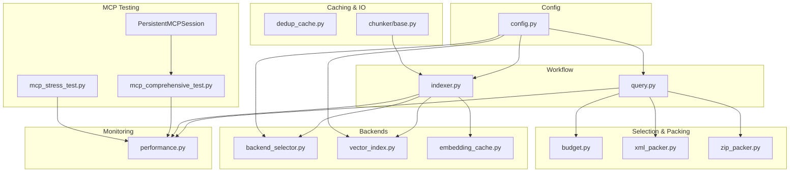

**Diagram sources**
- [indexer.py:72-371](file://src/ws_ctx_engine/workflow/indexer.py#L72-L371)
- [query.py:230-617](file://src/ws_ctx_engine/workflow/query.py#L230-L617)
- [budget.py:8-105](file://src/ws_ctx_engine/budget/budget.py#L8-L105)
- [xml_packer.py:51-239](file://src/ws_ctx_engine/packer/xml_packer.py#L51-L239)
- [zip_packer.py:17-254](file://src/ws_ctx_engine/packer/zip_packer.py#L17-L254)
- [backend_selector.py:13-191](file://src/ws_ctx_engine/backend_selector/backend_selector.py#L13-L191)
- [vector_index.py:21-800](file://src/ws_ctx_engine/vector_index/vector_index.py#L21-L800)
- [embedding_cache.py:28-127](file://src/ws_ctx_engine/vector_index/embedding_cache.py#L28-L127)
- [dedup_cache.py:35-154](file://src/ws_ctx_engine/session/dedup_cache.py#L35-L154)
- [base.py:14-25](file://src/ws_ctx_engine/chunker/base.py#L14-L25)
- [performance.py:72-263](file://src/ws_ctx_engine/monitoring/performance.py#L72-L263)
- [config.py:16-399](file://src/ws_ctx_engine/config/config.py#L16-L399)
- [mcp_comprehensive_test.py:41-143](file://scripts/mcp/mcp_comprehensive_test.py#L41-L143)

**Section sources**
- [indexer.py:72-371](file://src/ws_ctx_engine/workflow/indexer.py#L72-L371)
- [query.py:230-617](file://src/ws_ctx_engine/workflow/query.py#L230-L617)
- [config.py:16-399](file://src/ws_ctx_engine/config/config.py#L16-L399)

## Core Components
- Performance tracking: Measures indexing/query times, files processed/selected, tokens, index size, and peak memory usage.
- Budget manager: Greedy knapsack selection respecting token budgets and reserving headroom for metadata.
- Vector index backends: LEANN (primary) and FAISS (fallback), with embedding generation and caching.
- Output packers: XML and ZIP with token counting and optional compression.
- Session deduplication: Lightweight per-session file-content deduplication to reduce token usage.
- Backend selector: Centralized fallback chain for vector index, graph, and embeddings.
- Chunker and Rust acceleration: Optional Rust hot-path implementations for file walking, hashing, and token counting.
- **New** MCP performance testing framework: Persistent sessions for warm-path latency measurement with statistical analysis.

**Section sources**
- [performance.py:13-263](file://src/ws_ctx_engine/monitoring/performance.py#L13-L263)
- [budget.py:8-105](file://src/ws_ctx_engine/budget/budget.py#L8-L105)
- [vector_index.py:282-800](file://src/ws_ctx_engine/vector_index/vector_index.py#L282-L800)
- [xml_packer.py:51-239](file://src/ws_ctx_engine/packer/xml_packer.py#L51-L239)
- [zip_packer.py:17-254](file://src/ws_ctx_engine/packer/zip_packer.py#L17-L254)
- [dedup_cache.py:35-154](file://src/ws_ctx_engine/session/dedup_cache.py#L35-L154)
- [backend_selector.py:13-191](file://src/ws_ctx_engine/backend_selector/backend_selector.py#L13-L191)
- [base.py:14-25](file://src/ws_ctx_engine/chunker/base.py#L14-L25)
- [mcp_comprehensive_test.py:41-143](file://scripts/mcp/mcp_comprehensive_test.py#L41-L143)

## Architecture Overview
The system orchestrates indexing and querying with performance instrumentation and tunable backends. Incremental indexing leverages file hash comparison and embedding cache to minimize rebuild costs. Query-time selection respects token budgets and supports pre-processing (compression/dedup) for reduced output size and cost.

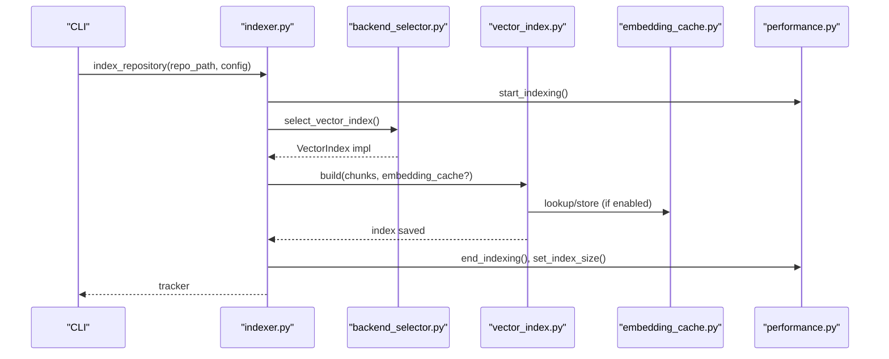

**Diagram sources**
- [indexer.py:72-371](file://src/ws_ctx_engine/workflow/indexer.py#L72-L371)
- [backend_selector.py:36-81](file://src/ws_ctx_engine/backend_selector/backend_selector.py#L36-L81)
- [vector_index.py:506-800](file://src/ws_ctx_engine/vector_index/vector_index.py#L506-L800)
- [embedding_cache.py:55-127](file://src/ws_ctx_engine/vector_index/embedding_cache.py#L55-L127)
- [performance.py:95-160](file://src/ws_ctx_engine/monitoring/performance.py#L95-L160)

## Detailed Component Analysis

### Performance Tracking and Monitoring
- Tracks total indexing/query time, files processed/selected, total tokens, index size, and peak memory usage.
- Supports phase-level timings and human-readable formatting.
- Memory tracking uses psutil when available.

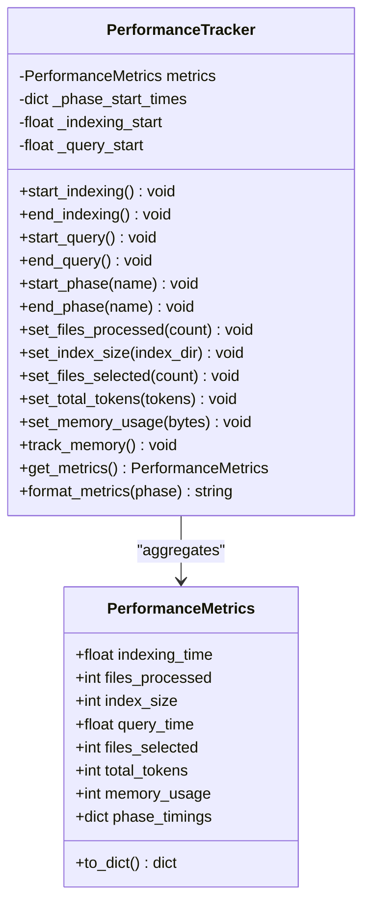

**Diagram sources**
- [performance.py:13-263](file://src/ws_ctx_engine/monitoring/performance.py#L13-L263)

**Section sources**
- [performance.py:72-263](file://src/ws_ctx_engine/monitoring/performance.py#L72-L263)

### Budget-Aware File Selection
- Implements a greedy knapsack algorithm to select files within a configurable token budget.
- Reserves ~20% of the budget for metadata/manifest and uses 80% for content.
- Reads file contents and counts tokens to enforce limits.

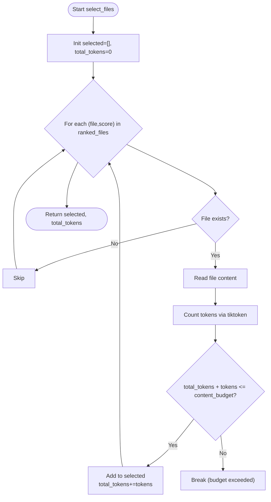

**Diagram sources**
- [budget.py:50-105](file://src/ws_ctx_engine/budget/budget.py#L50-L105)

**Section sources**
- [budget.py:8-105](file://src/ws_ctx_engine/budget/budget.py#L8-L105)

### Vector Index Backends and Embedding Generation
- LEANNIndex: Primary backend storing file-level embeddings; recomputes on-the-fly when needed.
- FAISSIndex: Fallback using IndexFlatL2 wrapped in IndexIDMap2 for incremental updates.
- EmbeddingGenerator: Local sentence-transformers with API fallback (OpenAI) and memory-aware switching.

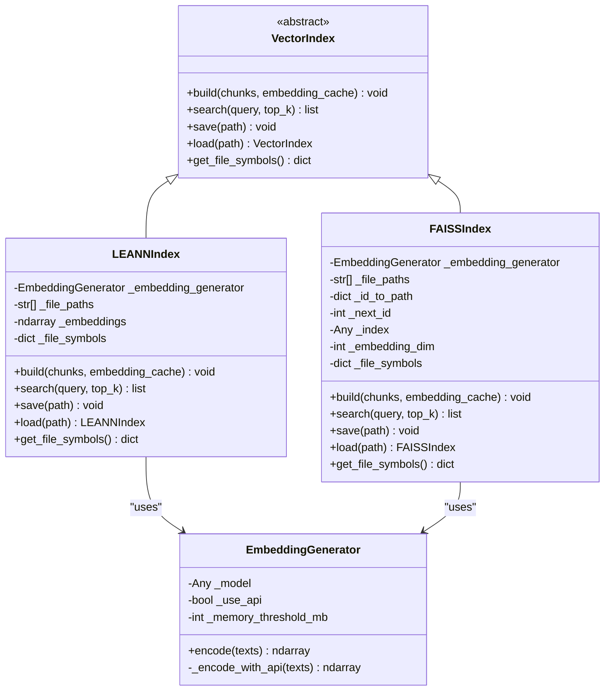

**Diagram sources**
- [vector_index.py:21-800](file://src/ws_ctx_engine/vector_index/vector_index.py#L21-L800)

**Section sources**
- [vector_index.py:282-800](file://src/ws_ctx_engine/vector_index/vector_index.py#L282-L800)

### Incremental Indexing and Embedding Cache
- Detects incremental changes by comparing stored file hashes with current disk state.
- Uses EmbeddingCache to persist content-hash → embedding mappings and avoid re-embedding unchanged files.
- Supports incremental update of FAISS index and saves/restores caches.

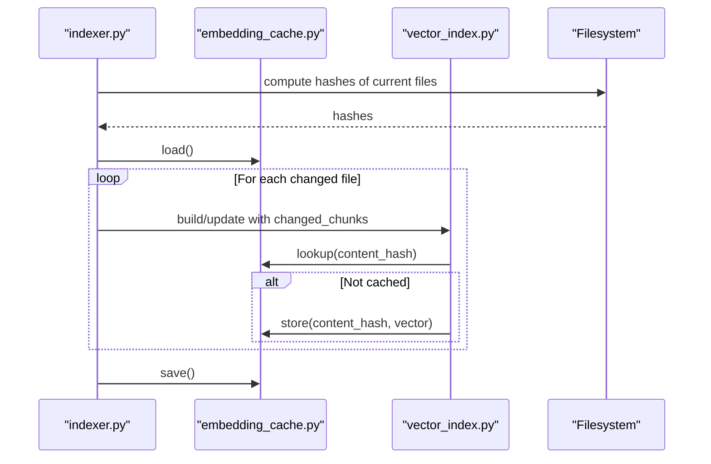

**Diagram sources**
- [indexer.py:27-69](file://src/ws_ctx_engine/workflow/indexer.py#L27-L69)
- [indexer.py:210-238](file://src/ws_ctx_engine/workflow/indexer.py#L210-L238)
- [embedding_cache.py:55-127](file://src/ws_ctx_engine/vector_index/embedding_cache.py#L55-L127)

**Section sources**
- [indexer.py:27-69](file://src/ws_ctx_engine/workflow/indexer.py#L27-L69)
- [indexer.py:210-238](file://src/ws_ctx_engine/workflow/indexer.py#L210-L238)
- [embedding_cache.py:28-127](file://src/ws_ctx_engine/vector_index/embedding_cache.py#L28-L127)

### Session-Level Deduplication
- Replaces repeated file content within a session with a compact marker to reduce tokens and cost.
- Persists a JSON cache keyed by content hash to survive separate invocations sharing the same session_id.

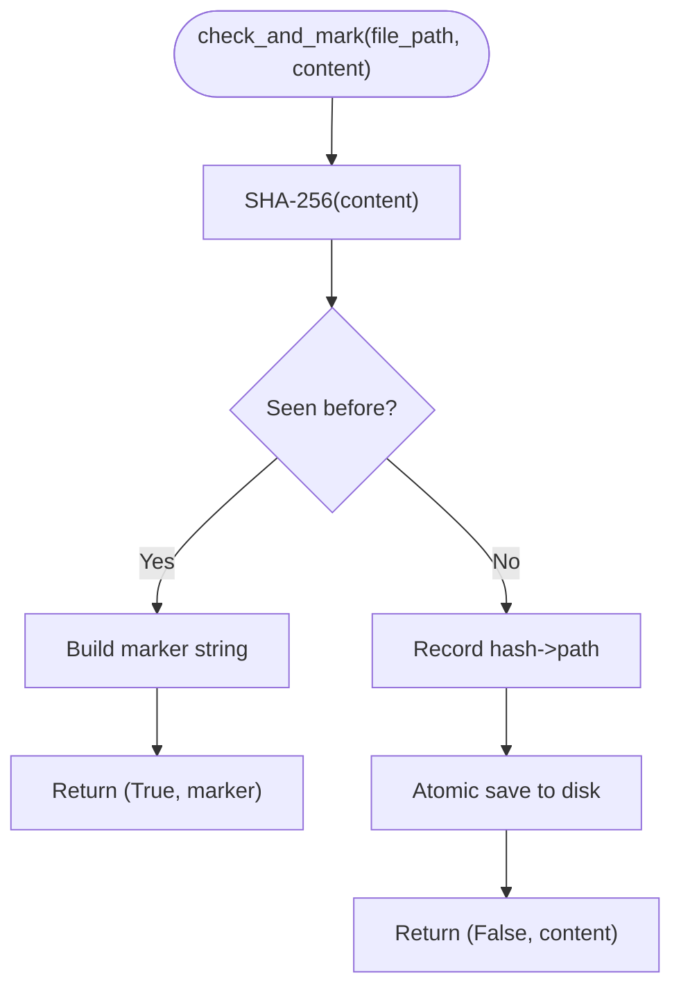

**Diagram sources**
- [dedup_cache.py:65-90](file://src/ws_ctx_engine/session/dedup_cache.py#L65-L90)
- [dedup_cache.py:119-137](file://src/ws_ctx_engine/session/dedup_cache.py#L119-L137)

**Section sources**
- [dedup_cache.py:35-154](file://src/ws_ctx_engine/session/dedup_cache.py#L35-L154)

### Output Packing and Compression
- XMLPacker: Generates XML with metadata and file entries; supports token counting and optional secret scanning.
- ZIPPacker: Creates ZIP archives with preserved directory structure and a REVIEW_CONTEXT.md manifest.
- Pre-processing pipeline in query workflow supports compression and deduplication before packing.

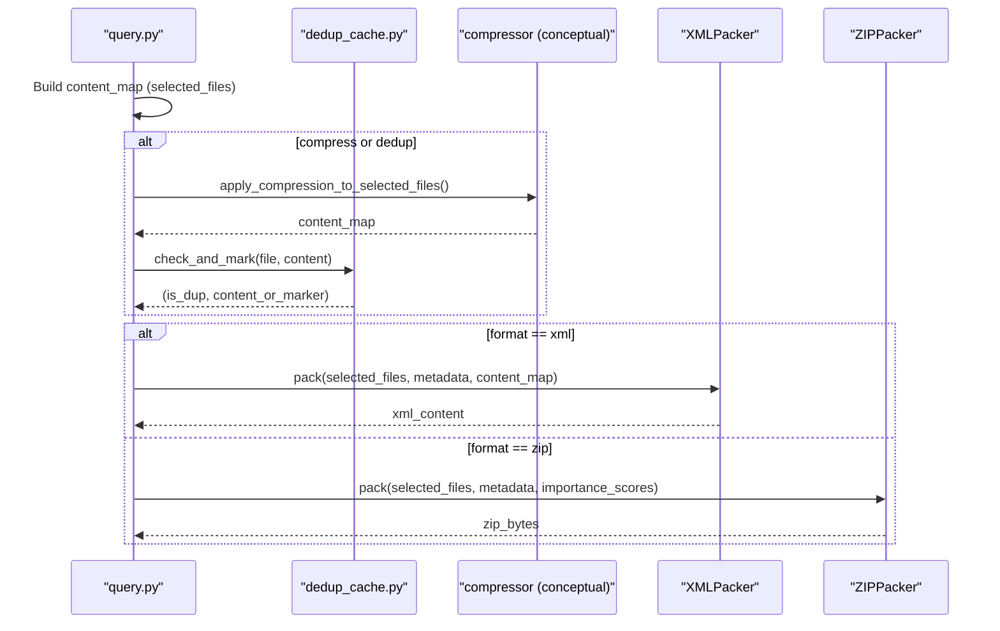

**Diagram sources**
- [query.py:427-535](file://src/ws_ctx_engine/workflow/query.py#L427-L535)
- [xml_packer.py:85-137](file://src/ws_ctx_engine/packer/xml_packer.py#L85-L137)
- [zip_packer.py:49-90](file://src/ws_ctx_engine/packer/zip_packer.py#L49-L90)

**Section sources**
- [xml_packer.py:51-239](file://src/ws_ctx_engine/packer/xml_packer.py#L51-L239)
- [zip_packer.py:17-254](file://src/ws_ctx_engine/packer/zip_packer.py#L17-L254)
- [query.py:427-535](file://src/ws_ctx_engine/workflow/query.py#L427-L535)

### Backend Selection Guidelines
- Centralized fallback chain: Optimal → Good → Acceptable → Degraded → Minimal → Fallback-only.
- Configurable per subsystem: vector_index, graph, embeddings.
- Logs current configuration and fallback level for observability.

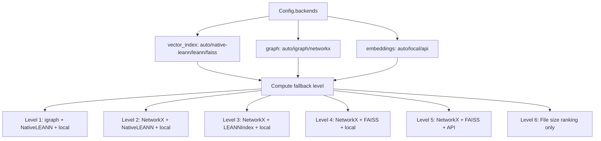

**Diagram sources**
- [backend_selector.py:13-191](file://src/ws_ctx_engine/backend_selector/backend_selector.py#L13-L191)
- [config.py:74-101](file://src/ws_ctx_engine/config/config.py#L74-L101)

**Section sources**
- [backend_selector.py:13-191](file://src/ws_ctx_engine/backend_selector/backend_selector.py#L13-L191)
- [config.py:74-101](file://src/ws_ctx_engine/config/config.py#L74-L101)

### Rust Acceleration for Hot Paths
- Optional Rust extension provides ~8–20x speedups for file walking, gitignore matching, hashing, and token counting.
- Falls back to Python implementations automatically when the extension is unavailable.

**Section sources**
- [base.py:14-25](file://src/ws_ctx_engine/chunker/base.py#L14-L25)
- [performance.md:1-81](file://docs/guides/performance.md#L1-L81)

## Dependency Analysis
Key performance dependencies and coupling:
- Workflow orchestrators depend on configuration, backend selector, and monitoring.
- Vector index backends depend on embedding generation and optional embedding cache.
- Query workflow depends on budget manager, packers, and optional pre-processing (compression/dedup).
- Rust acceleration is optional and improves file walking and related IO-heavy tasks.
- **New** MCP testing framework depends on persistent sessions and performance metrics.

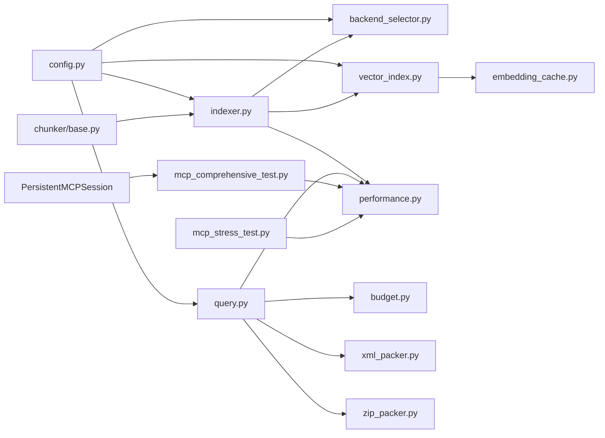

**Diagram sources**
- [config.py:16-399](file://src/ws_ctx_engine/config/config.py#L16-L399)
- [indexer.py:72-371](file://src/ws_ctx_engine/workflow/indexer.py#L72-L371)
- [query.py:230-617](file://src/ws_ctx_engine/workflow/query.py#L230-L617)
- [backend_selector.py:13-191](file://src/ws_ctx_engine/backend_selector/backend_selector.py#L13-L191)
- [vector_index.py:282-800](file://src/ws_ctx_engine/vector_index/vector_index.py#L282-L800)
- [embedding_cache.py:28-127](file://src/ws_ctx_engine/vector_index/embedding_cache.py#L28-L127)
- [budget.py:8-105](file://src/ws_ctx_engine/budget/budget.py#L8-L105)
- [xml_packer.py:51-239](file://src/ws_ctx_engine/packer/xml_packer.py#L51-L239)
- [zip_packer.py:17-254](file://src/ws_ctx_engine/packer/zip_packer.py#L17-L254)
- [base.py:14-25](file://src/ws_ctx_engine/chunker/base.py#L14-L25)
- [mcp_comprehensive_test.py:41-143](file://scripts/mcp/mcp_comprehensive_test.py#L41-L143)

**Section sources**
- [config.py:16-399](file://src/ws_ctx_engine/config/config.py#L16-L399)
- [indexer.py:72-371](file://src/ws_ctx_engine/workflow/indexer.py#L72-L371)
- [query.py:230-617](file://src/ws_ctx_engine/workflow/query.py#L230-L617)

## Performance Considerations

### Benchmarking Procedures
- Use the built-in benchmark suite to measure indexing and query performance across repository sizes and backend configurations.
- Targets:
  - Indexing: <300s for 10k files with primary backends; <600s with fallback backends.
  - Querying: <10s with primary backends; <15s with fallback backends.
- Memory tracking: Verify peak memory usage during indexing and query phases.
- **New** MCP performance testing: Use persistent sessions to measure warm-path latency with statistical analysis.

**Section sources**
- [test_performance_benchmarks.py:141-440](file://tests/test_performance_benchmarks.py#L141-L440)
- [mcp_comprehensive_test.py:612-777](file://scripts/mcp/mcp_comprehensive_test.py#L612-L777)

### Memory Usage Optimization Techniques
- Enable embedding cache to avoid re-embedding unchanged files; reduces CPU/GPU time and memory churn.
- Use session deduplication to reduce token usage and output size.
- Prefer LEANNIndex over FAISS for smaller to medium repos to minimize index storage and memory footprint.
- Monitor memory via PerformanceTracker; psutil-based tracking is available when installed.

**Section sources**
- [embedding_cache.py:55-127](file://src/ws_ctx_engine/vector_index/embedding_cache.py#L55-L127)
- [dedup_cache.py:35-154](file://src/ws_ctx_engine/session/dedup_cache.py#L35-L154)
- [vector_index.py:282-504](file://src/ws_ctx_engine/vector_index/vector_index.py#L282-L504)
- [performance.py:185-206](file://src/ws_ctx_engine/monitoring/performance.py#L185-L206)

### Speed Improvement Strategies
- Install and enable the Rust extension for file walking, hashing, and token counting to achieve 8–20x speedups.
- Use primary backends (LEANN + igraph) for optimal performance; fallback gracefully when unavailable.
- Increase token budget judiciously to include more files, balancing cost and recall.
- Use XML packing with context shuffling to improve model recall without changing content.

**Section sources**
- [performance.md:1-81](file://docs/guides/performance.md#L1-L81)
- [backend_selector.py:13-191](file://src/ws_ctx_engine/backend_selector/backend_selector.py#L13-L191)
- [xml_packer.py:18-49](file://src/ws_ctx_engine/packer/xml_packer.py#L18-L49)

### Configuration Tuning Examples
- Small repo (<1k files): Use primary backends, moderate token budget (~50k), enable embedding cache and incremental indexing.
- Medium repo (1k–10k files): Use primary backends, higher token budget (~100k), enable embedding cache and incremental indexing.
- Large repo (>10k files): Use primary backends initially; monitor memory and switch to FAISS if needed; increase batch size and consider API embeddings for very large models.

**Section sources**
- [config.py:28-101](file://src/ws_ctx_engine/config/config.py#L28-L101)
- [test_performance_benchmarks.py:172-369](file://tests/test_performance_benchmarks.py#L172-L369)

### Compression Optimization Examples
- Compress selected files before packing to reduce output size and cost.
- Combine compression with session deduplication for maximum token savings.
- Choose output format based on downstream consumption; XML with shuffling improves recall; ZIP with manifests preserves structure.

**Section sources**
- [query.py:427-535](file://src/ws_ctx_engine/workflow/query.py#L427-L535)
- [xml_packer.py:18-49](file://src/ws_ctx_engine/packer/xml_packer.py#L18-L49)
- [zip_packer.py:49-90](file://src/ws_ctx_engine/packer/zip_packer.py#L49-L90)

### Caching Strategies
- EmbeddingCache: Persist content-hash → embedding mappings to avoid re-embedding unchanged files across runs.
- SessionDeduplicationCache: Persist per-session seen content hashes to replace duplicates with markers.

**Section sources**
- [embedding_cache.py:28-127](file://src/ws_ctx_engine/vector_index/embedding_cache.py#L28-L127)
- [dedup_cache.py:35-154](file://src/ws_ctx_engine/session/dedup_cache.py#L35-L154)

### Backend Selection Guidelines
- Optimal: igraph + NativeLEANN + local embeddings.
- Degraded: FAISS + local embeddings; consider API embeddings if local memory is insufficient.
- Fallback-only: file size ranking when graph/vector backends are unavailable.

**Section sources**
- [backend_selector.py:13-191](file://src/ws_ctx_engine/backend_selector/backend_selector.py#L13-L191)

### Monitoring and Profiling Techniques
- Use PerformanceTracker to capture phase timings, files processed/selected, tokens, and peak memory.
- Enable psutil for memory tracking; otherwise, memory usage will be zero.
- Log backend configuration and fallback level to diagnose performance regressions.

**Section sources**
- [performance.py:72-263](file://src/ws_ctx_engine/monitoring/performance.py#L72-L263)
- [backend_selector.py:158-177](file://src/ws_ctx_engine/backend_selector/backend_selector.py#L158-L177)

### Cost Optimization Considerations
- Reduce token usage via session deduplication and compression.
- Tune token budget to balance recall and cost.
- Prefer local embeddings when possible; use API embeddings as a fallback.
- Choose output formats that minimize token overhead while preserving utility.

**Section sources**
- [query.py:427-535](file://src/ws_ctx_engine/workflow/query.py#L427-L535)
- [budget.py:32-49](file://src/ws_ctx_engine/budget/budget.py#L32-L49)
- [vector_index.py:96-280](file://src/ws_ctx_engine/vector_index/vector_index.py#L96-L280)

### Scalability Patterns
- Use incremental indexing to avoid full rebuilds when only a subset of files changes.
- Scale horizontally by running multiple sessions with distinct session_ids to maximize deduplication.
- Monitor index size and adjust token budget accordingly.

**Section sources**
- [indexer.py:27-69](file://src/ws_ctx_engine/workflow/indexer.py#L27-L69)
- [indexer.py:358-371](file://src/ws_ctx_engine/workflow/indexer.py#L358-L371)
- [dedup_cache.py:35-154](file://src/ws_ctx_engine/session/dedup_cache.py#L35-L154)

### Performance Troubleshooting
- If indexing is slow, verify backend selection and memory availability; consider switching to FAISS or API embeddings.
- If query latency is high, increase token budget or adjust semantic/pagerank weights.
- If memory spikes occur, enable embedding cache and reduce batch size.

**Section sources**
- [vector_index.py:130-280](file://src/ws_ctx_engine/vector_index/vector_index.py#L130-L280)
- [config.py:212-269](file://src/ws_ctx_engine/config/config.py#L212-L269)

## Benchmarking Framework

### Comprehensive Performance Testing Suite
The MCP performance testing framework provides comprehensive benchmarking capabilities with persistent sessions for realistic latency measurements.

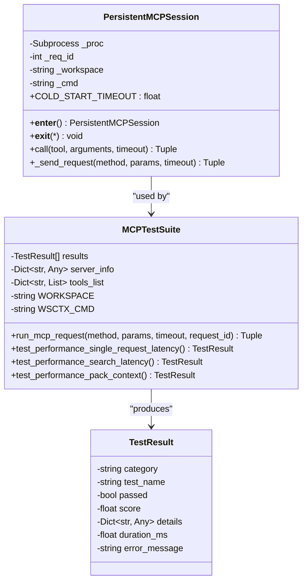

**Diagram sources**
- [mcp_comprehensive_test.py:41-143](file://scripts/mcp/mcp_comprehensive_test.py#L41-L143)
- [mcp_comprehensive_test.py:159-168](file://scripts/mcp/mcp_comprehensive_test.py#L159-L168)

**Section sources**
- [mcp_comprehensive_test.py:41-143](file://scripts/mcp/mcp_comprehensive_test.py#L41-L143)
- [mcp_comprehensive_test.py:159-168](file://scripts/mcp/mcp_comprehensive_test.py#L159-L168)

### Persistent Session Architecture
The framework maintains persistent MCP processes to simulate real-world usage patterns and measure warm-path latency.

**Updated** Added persistent session management for realistic performance testing.

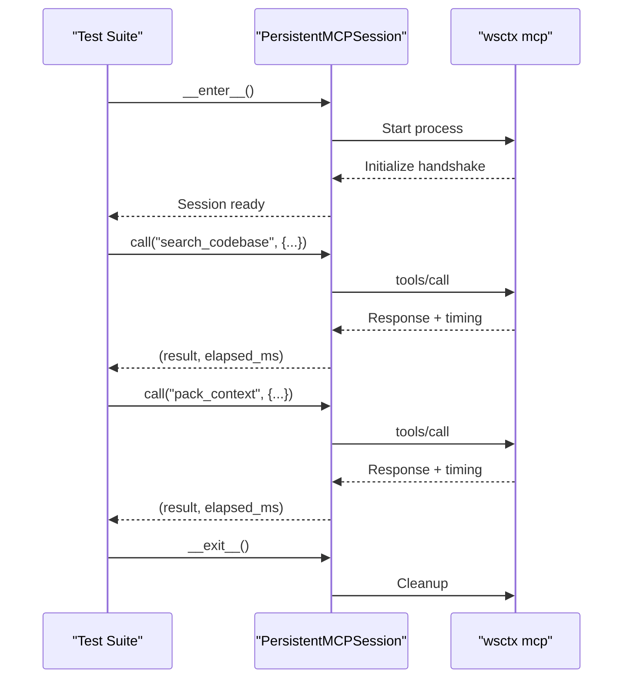

**Diagram sources**
- [mcp_comprehensive_test.py:67-94](file://scripts/mcp/mcp_comprehensive_test.py#L67-L94)
- [mcp_comprehensive_test.py:97-143](file://scripts/mcp/mcp_comprehensive_test.py#L97-L143)

### Statistical Analysis and Metrics
The framework provides comprehensive statistical analysis including average, maximum, and 99th percentile latency measurements.

**Updated** Enhanced with 99th percentile calculation for outlier detection.

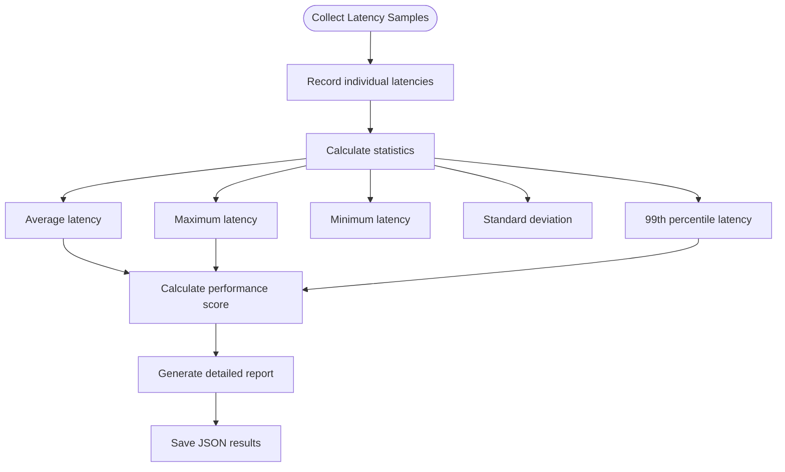

**Diagram sources**
- [mcp_comprehensive_test.py:625-631](file://scripts/mcp/mcp_comprehensive_test.py#L625-L631)
- [mcp_comprehensive_test.py:694-706](file://scripts/mcp/mcp_comprehensive_test.py#L694-L706)

**Section sources**
- [mcp_comprehensive_test.py:612-777](file://scripts/mcp/mcp_comprehensive_test.py#L612-L777)

## Performance Testing with MCP

### Single Request Latency Testing
Measures basic request performance with multiple samples for statistical reliability.

**Updated** Added comprehensive statistical analysis with average, minimum, maximum, and standard deviation calculations.

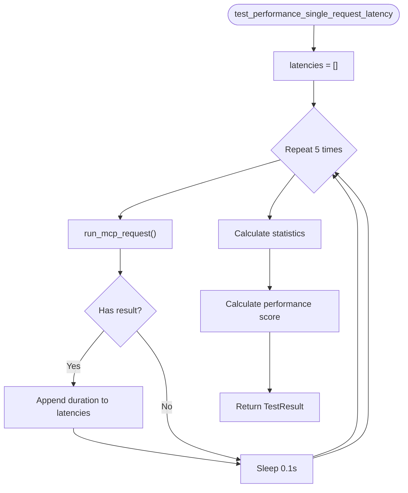

**Diagram sources**
- [mcp_comprehensive_test.py:612-649](file://scripts/mcp/mcp_comprehensive_test.py#L612-L649)

**Section sources**
- [mcp_comprehensive_test.py:612-649](file://scripts/mcp/mcp_comprehensive_test.py#L612-L649)

### Warm-Path Search Latency Testing
Measures realistic search performance using persistent sessions to eliminate cold-start overhead.

**Updated** Enhanced with 99th percentile calculation and detailed performance scoring.

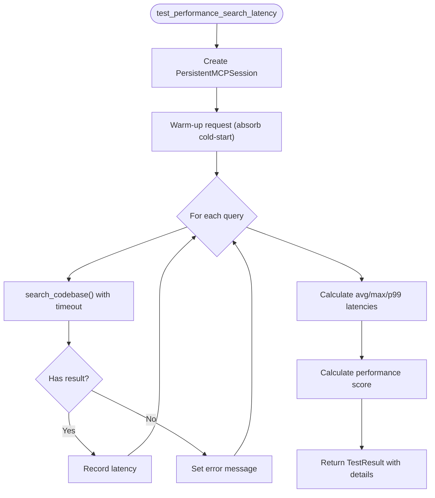

**Diagram sources**
- [mcp_comprehensive_test.py:651-724](file://scripts/mcp/mcp_comprehensive_test.py#L651-L724)

**Section sources**
- [mcp_comprehensive_test.py:651-724](file://scripts/mcp/mcp_comprehensive_test.py#L651-L724)

### Pack Context Performance Testing
Evaluates context packing performance across different output formats with I/O considerations.

**Updated** Added format-specific performance testing with relaxed thresholds due to I/O overhead.

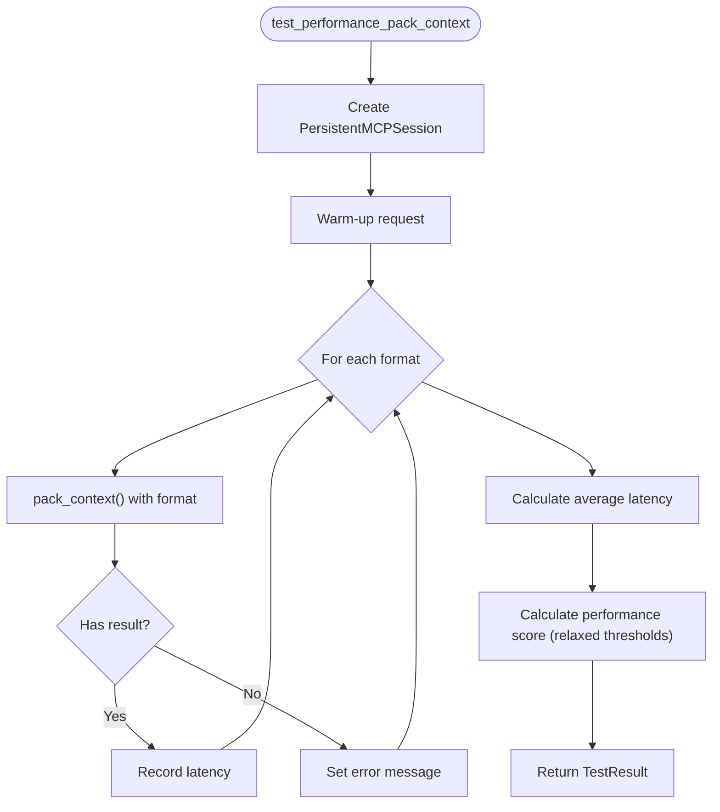

**Diagram sources**
- [mcp_comprehensive_test.py:726-777](file://scripts/mcp/mcp_comprehensive_test.py#L726-L777)

**Section sources**
- [mcp_comprehensive_test.py:726-777](file://scripts/mcp/mcp_comprehensive_test.py#L726-L777)

### Stress Testing Framework
Additional stress testing capabilities for concurrent request handling and edge case validation.

**Section sources**
- [mcp_stress_test.py:1-378](file://scripts/mcp/mcp_stress_test.py#L1-L378)

## Troubleshooting Guide
Common issues and remedies:
- Out of memory during embedding generation: Switch to API embeddings or reduce batch size.
- Slow indexing: Enable Rust extension, use primary backends, and enable embedding cache.
- Excessive token usage: Enable compression and session deduplication.
- Stale indexes: Allow auto-rebuild or manually trigger indexing.
- **New** MCP performance test failures: Check persistent session creation, verify cold-start timeouts, and validate tool availability.

**Updated** Added MCP-specific troubleshooting guidance.

**Section sources**
- [vector_index.py:130-280](file://src/ws_ctx_engine/vector_index/vector_index.py#L130-L280)
- [performance.md:1-81](file://docs/guides/performance.md#L1-L81)
- [query.py:427-535](file://src/ws_ctx_engine/workflow/query.py#L427-L535)
- [indexer.py:456-467](file://src/ws_ctx_engine/workflow/indexer.py#L456-L467)
- [mcp_comprehensive_test.py:668-692](file://scripts/mcp/mcp_comprehensive_test.py#L668-L692)

## Conclusion
By combining targeted configuration tuning, efficient backend selection, robust caching, and careful pre-processing, ws-ctx-engine achieves strong performance across diverse repository sizes and resource constraints. The comprehensive MCP performance testing framework provides realistic latency measurements with persistent sessions, enabling accurate performance benchmarking and optimization. Instrumentation and benchmarking provide continuous feedback to refine optimization strategies and maintain cost-effectiveness.

**Updated** Enhanced with comprehensive MCP performance testing capabilities for realistic latency measurements.

## Appendices

### Before/After Examples and Trade-offs
- Before: Default config with fallback backends, no embedding cache, no Rust extension.
  - Outcome: Slower indexing/query, higher memory usage, larger outputs.
- After: Primary backends, embedding cache, Rust extension, session deduplication, compression.
  - Outcome: Faster indexing/query, lower memory usage, smaller outputs, controlled cost.
- **New** MCP Performance Testing: Persistent sessions with statistical analysis.
  - Outcome: Realistic latency measurements, comprehensive performance reporting, actionable insights.

**Updated** Added MCP performance testing capabilities.

**Section sources**
- [test_performance_benchmarks.py:172-369](file://tests/test_performance_benchmarks.py#L172-L369)
- [performance.md:1-81](file://docs/guides/performance.md#L1-L81)
- [query.py:427-535](file://src/ws_ctx_engine/workflow/query.py#L427-L535)
- [mcp_comprehensive_test.py:612-777](file://scripts/mcp/mcp_comprehensive_test.py#L612-L777)

### Format Token Efficiency Comparison
- Use the TOON vs alternatives benchmark to quantify token savings across formats and choose the most efficient format for your needs.

**Section sources**
- [toon_vs_alternatives.py:126-256](file://benchmarks/toon_vs_alternatives.py#L126-L256)

### Performance Testing Results Analysis
- **Comprehensive Test Results**: Detailed JSON reports with category scores, pass rates, and performance metrics.
- **Stress Test Results**: Extended test coverage with concurrent request handling and edge case validation.
- **Statistical Analysis**: Average, maximum, minimum, standard deviation, and 99th percentile latency measurements.

**Updated** Added comprehensive performance testing result analysis capabilities.

**Section sources**
- [detailed_report_20260327_094436.json:1-573](file://test_results/mcp/comprehensive_test/detailed_report_20260327_094436.json#L1-L573)
- [stress_test_20260326_212315.json:1-800](file://test_results/mcp/stress_test/stress_test_20260326_212315.json#L1-L800)