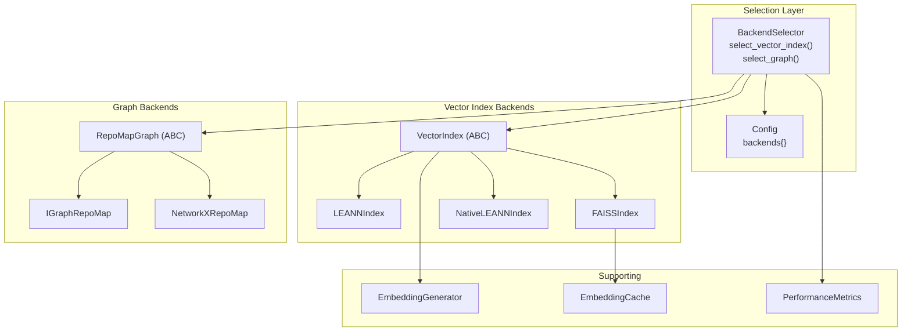
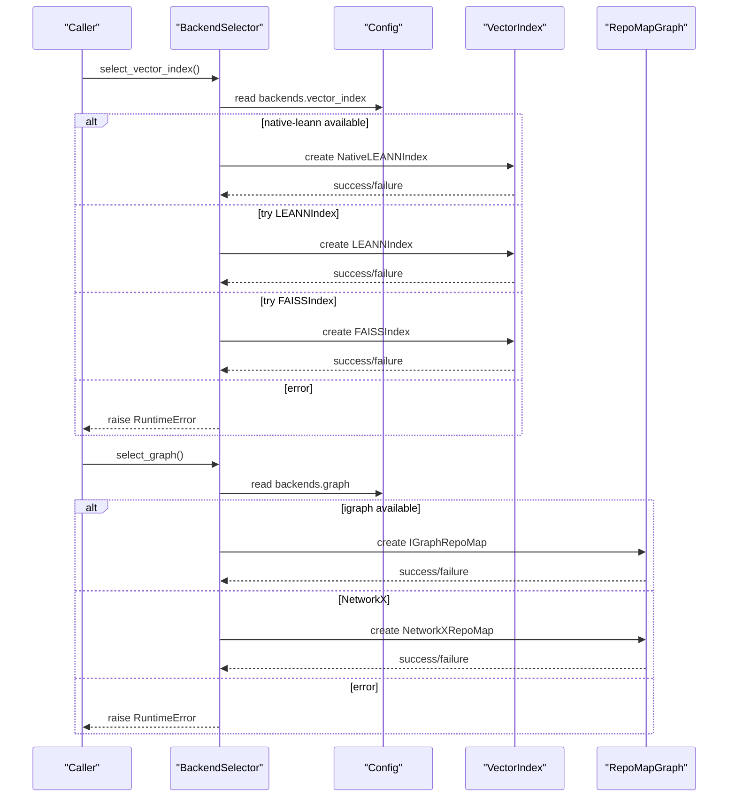
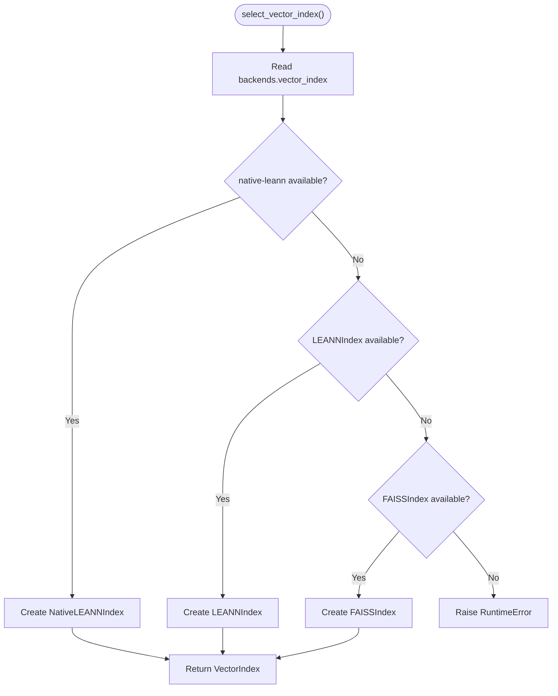
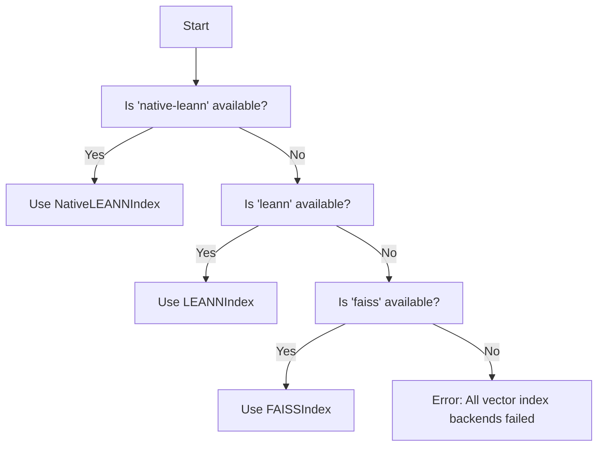
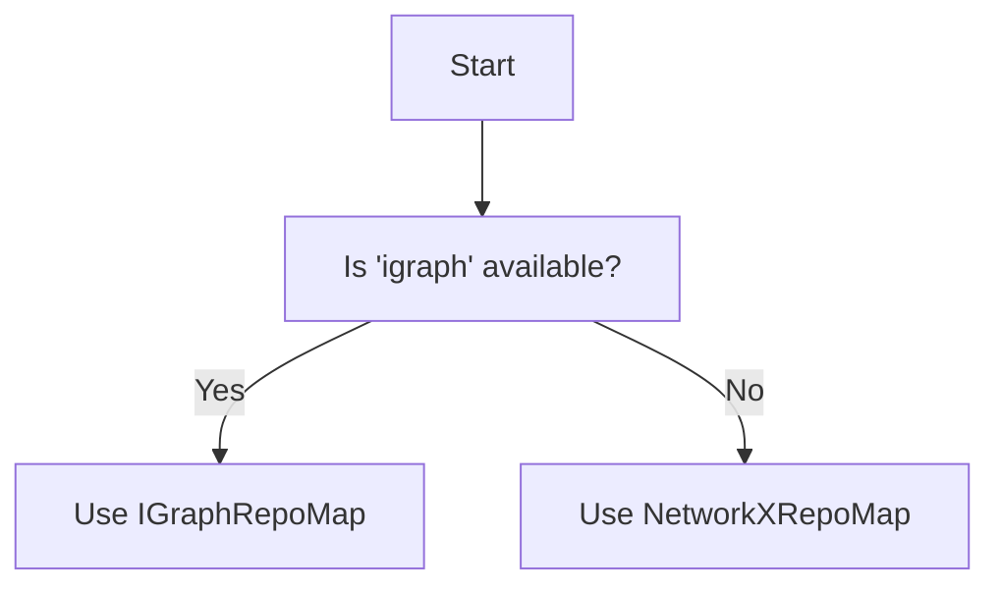
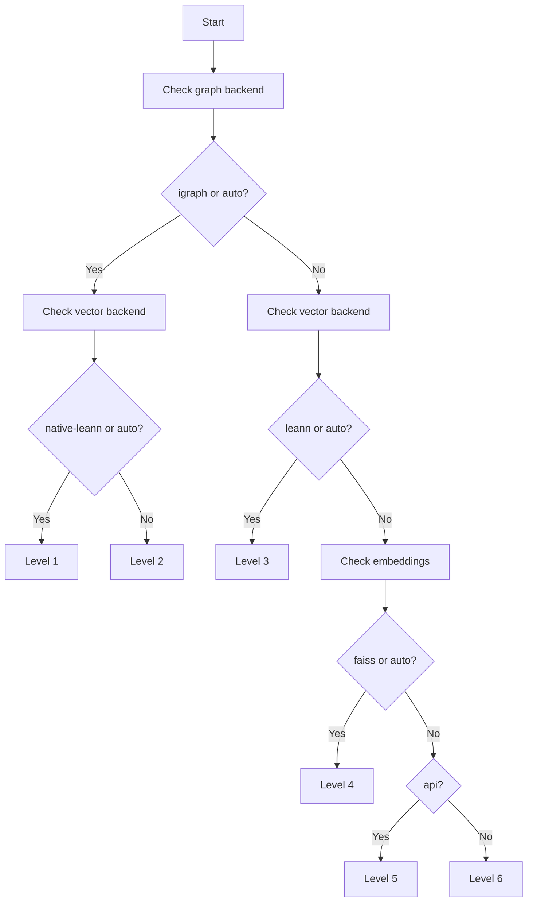
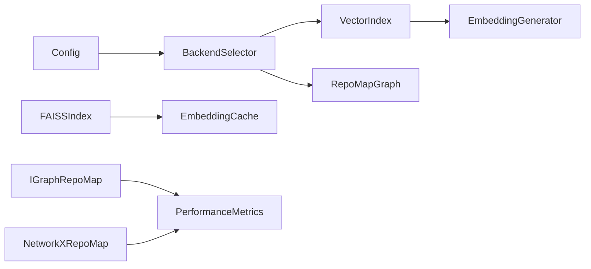

# Backend Selection Strategies

<cite>
**Referenced Files in This Document**
- [backend_selector.py](file://src/ws_ctx_engine/backend_selector/backend_selector.py)
- [vector_index.py](file://src/ws_ctx_engine/vector_index/vector_index.py)
- [leann_index.py](file://src/ws_ctx_engine/vector_index/leann_index.py)
- [graph.py](file://src/ws_ctx_engine/graph/graph.py)
- [config.py](file://src/ws_ctx_engine/config/config.py)
- [performance.py](file://src/ws_ctx_engine/monitoring/performance.py)
- [vector-index.md](file://docs/reference/vector-index.md)
- [performance.md](file://docs/guides/performance.md)
- [test_performance_benchmarks.py](file://tests/test_performance_benchmarks.py)
- [embedding_cache.py](file://src/ws_ctx_engine/vector_index/embedding_cache.py)
- [toon_vs_alternatives.py](file://benchmarks/toon_vs_alternatives.py)
</cite>

## Table of Contents
1. [Introduction](#introduction)
2. [Project Structure](#project-structure)
3. [Core Components](#core-components)
4. [Architecture Overview](#architecture-overview)
5. [Detailed Component Analysis](#detailed-component-analysis)
6. [Dependency Analysis](#dependency-analysis)
7. [Performance Considerations](#performance-considerations)
8. [Troubleshooting Guide](#troubleshooting-guide)
9. [Conclusion](#conclusion)
10. [Appendices](#appendices)

## Introduction
This document explains the backend selection strategies and performance optimization across the system’s major components: vector index backends, graph analysis backends, and chunker implementations. It details the automatic fallback chains, performance characteristics, resource requirements, and selection criteria. It also provides decision trees, performance benchmarks, and guidance for optimizing backend choices based on repository size, available resources, and performance requirements.

## Project Structure
The backend selection system centers around a central selector that orchestrates vector index, graph, and embeddings backends. Supporting modules provide concrete implementations, configuration, performance tracking, and documentation.

**Diagram sources**
- [backend_selector.py:13-191](file://src/ws_ctx_engine/backend_selector/backend_selector.py#L13-L191)
- [vector_index.py:21-800](file://src/ws_ctx_engine/vector_index/vector_index.py#L21-L800)
- [leann_index.py:20-297](file://src/ws_ctx_engine/vector_index/leann_index.py#L20-L297)
- [graph.py:19-667](file://src/ws_ctx_engine/graph/graph.py#L19-L667)
- [config.py:16-399](file://src/ws_ctx_engine/config/config.py#L16-L399)
- [performance.py:13-263](file://src/ws_ctx_engine/monitoring/performance.py#L13-L263)

**Section sources**
- [backend_selector.py:13-191](file://src/ws_ctx_engine/backend_selector/backend_selector.py#L13-L191)
- [config.py:74-81](file://src/ws_ctx_engine/config/config.py#L74-L81)

## Core Components
- BackendSelector: Central orchestrator that selects vector index, graph, and embeddings backends with graceful fallback and logs the effective configuration.
- VectorIndex family: Abstract base and concrete implementations (LEANNIndex, FAISSIndex, NativeLEANNIndex) with embedding generation and optional caching.
- Graph backends: IGraphRepoMap (fast C++ backend) and NetworkXRepoMap (pure Python fallback) with PageRank computation.
- Configuration: Centralized configuration for backends, embeddings, and performance tuning.
- Performance monitoring: Metrics collection for indexing/querying and memory usage.

**Section sources**
- [backend_selector.py:36-118](file://src/ws_ctx_engine/backend_selector/backend_selector.py#L36-L118)
- [vector_index.py:21-800](file://src/ws_ctx_engine/vector_index/vector_index.py#L21-L800)
- [graph.py:19-667](file://src/ws_ctx_engine/graph/graph.py#L19-L667)
- [config.py:74-101](file://src/ws_ctx_engine/config/config.py#L74-L101)
- [performance.py:13-263](file://src/ws_ctx_engine/monitoring/performance.py#L13-L263)

## Architecture Overview
The system implements layered fallbacks:
- Vector index: NativeLEANN (preferred), LEANNIndex, FAISSIndex.
- Graph: igraph (preferred), NetworkX (fallback), file-size ranking (last resort).
- Embeddings: local (preferred), API fallback.

**Diagram sources**
- [backend_selector.py:36-118](file://src/ws_ctx_engine/backend_selector/backend_selector.py#L36-L118)
- [vector_index.py:506-800](file://src/ws_ctx_engine/vector_index/vector_index.py#L506-L800)
- [graph.py:572-667](file://src/ws_ctx_engine/graph/graph.py#L572-L667)

## Detailed Component Analysis

### BackendSelector
- Responsibilities:
  - Select vector index backend with fallback chain.
  - Select graph backend with fallback chain.
  - Determine fallback level (1–6) based on configuration.
  - Log current configuration and reasons for fallback.
- Fallback levels:
  - 1: igraph + NativeLEANN + local embeddings (optimal).
  - 2: NetworkX + NativeLEANN + local embeddings.
  - 3: NetworkX + LEANNIndex + local embeddings.
  - 4: NetworkX + FAISS + local embeddings.
  - 5: NetworkX + FAISS + API embeddings.
  - 6: File size ranking only (no graph).
- Error handling: Propagates RuntimeError when all backends fail.

**Diagram sources**
- [backend_selector.py:36-81](file://src/ws_ctx_engine/backend_selector/backend_selector.py#L36-L81)
- [vector_index.py:506-800](file://src/ws_ctx_engine/vector_index/vector_index.py#L506-L800)

**Section sources**
- [backend_selector.py:13-191](file://src/ws_ctx_engine/backend_selector/backend_selector.py#L13-L191)

### Vector Index Backends

#### LEANNIndex (Cosine similarity, file-level embeddings)
- Implementation: Groups chunks by file, concatenates content, generates embeddings, stores dense vectors.
- Search: Cosine similarity; returns file paths and scores.
- Persistence: Pickled metadata with NumPy embeddings.
- Performance: Fast search; moderate memory usage proportional to number of files.

**Section sources**
- [vector_index.py:282-504](file://src/ws_ctx_engine/vector_index/vector_index.py#L282-L504)

#### FAISSIndex (HNSW via FAISS)
- Implementation: Uses FAISS IndexFlatL2 wrapped in IndexIDMap2 for exact search and incremental updates.
- Search: Converts query to embedding, performs FAISS search, converts distance to similarity.
- Persistence: Separate .faiss file plus pickled metadata.
- Performance: Fastest search among backends; supports incremental updates.

**Section sources**
- [vector_index.py:506-800](file://src/ws_ctx_engine/vector_index/vector_index.py#L506-L800)

#### NativeLEANNIndex (97% storage savings)
- Implementation: Uses the actual LEANN library for graph-based selective recomputation.
- Storage: Minimal metadata plus external index files; significant disk footprint reduction.
- Performance: Very fast search; minimal RAM usage.

**Section sources**
- [leann_index.py:20-297](file://src/ws_ctx_engine/vector_index/leann_index.py#L20-L297)

#### EmbeddingGenerator and EmbeddingCache
- EmbeddingGenerator: Prefers local sentence-transformers model; falls back to API on OOM or memory constraints.
- EmbeddingCache: Disk-backed cache keyed by content hash to avoid re-embedding unchanged files.

**Section sources**
- [vector_index.py:96-280](file://src/ws_ctx_engine/vector_index/vector_index.py#L96-L280)
- [embedding_cache.py:28-127](file://src/ws_ctx_engine/vector_index/embedding_cache.py#L28-L127)

### Graph Backends

#### IGraphRepoMap (Fast C++ backend)
- Implementation: Builds directed graph from symbol references; computes PageRank using igraph.
- Performance: Very fast (<1s for 10k nodes).
- Fallback: Falls back to NetworkX if igraph unavailable.

**Section sources**
- [graph.py:97-315](file://src/ws_ctx_engine/graph/graph.py#L97-L315)

#### NetworkXRepoMap (Pure Python fallback)
- Implementation: Same graph construction and PageRank computation using NetworkX.
- Performance: Slower than igraph (~<10s for 10k nodes) but more portable.
- Fallback: Used when igraph is unavailable.

**Section sources**
- [graph.py:317-570](file://src/ws_ctx_engine/graph/graph.py#L317-L570)

### Decision Trees for Backend Choice

#### Vector Index Backend Decision Tree

**Diagram sources**
- [backend_selector.py:68-80](file://src/ws_ctx_engine/backend_selector/backend_selector.py#L68-L80)
- [vector_index.py:506-800](file://src/ws_ctx_engine/vector_index/vector_index.py#L506-L800)

#### Graph Backend Decision Tree

**Diagram sources**
- [graph.py:572-621](file://src/ws_ctx_engine/graph/graph.py#L572-L621)

#### Fallback Level Determination

**Diagram sources**
- [backend_selector.py:120-157](file://src/ws_ctx_engine/backend_selector/backend_selector.py#L120-L157)

## Dependency Analysis
- BackendSelector depends on Config, vector index factory, and graph factory.
- VectorIndex implementations depend on EmbeddingGenerator and optional EmbeddingCache.
- Graph backends depend on availability of igraph or NetworkX.
- Performance monitoring integrates with the selection and indexing workflow.

**Diagram sources**
- [config.py:74-101](file://src/ws_ctx_engine/config/config.py#L74-L101)
- [backend_selector.py:26-118](file://src/ws_ctx_engine/backend_selector/backend_selector.py#L26-L118)
- [vector_index.py:96-280](file://src/ws_ctx_engine/vector_index/vector_index.py#L96-L280)
- [graph.py:97-315](file://src/ws_ctx_engine/graph/graph.py#L97-L315)
- [performance.py:13-263](file://src/ws_ctx_engine/monitoring/performance.py#L13-L263)

**Section sources**
- [backend_selector.py:26-118](file://src/ws_ctx_engine/backend_selector/backend_selector.py#L26-L118)
- [vector_index.py:96-280](file://src/ws_ctx_engine/vector_index/vector_index.py#L96-L280)
- [graph.py:97-315](file://src/ws_ctx_engine/graph/graph.py#L97-L315)

## Performance Considerations
- Vector index search latency targets (typical):
  - NativeLEANN: <10ms (1k), <50ms (10k), <200ms (100k).
  - LEANNIndex: <5ms (1k), <20ms (10k), <100ms (100k).
  - FAISSIndex (HNSW): <1ms (1k), <5ms (10k), <20ms (100k).
- Memory usage (approximate, 384-dim):
  - NativeLEANN: ~3MB (97% savings).
  - LEANNIndex: ~15MB.
  - FAISSIndex: ~20MB.
- Embedding generation:
  - Local model preferred; API fallback on memory constraints.
  - Memory threshold: 500MB minimum for local model loading.
- Rust acceleration:
  - Optional Rust extension improves file walking and related operations by 8–20x.
- Performance tracking:
  - PerformanceMetrics and PerformanceTracker capture indexing/query times, file counts, index size, tokens, and peak memory.

**Section sources**
- [vector-index.md:402-420](file://docs/reference/vector-index.md#L402-L420)
- [vector-index.md:412-419](file://docs/reference/vector-index.md#L412-L419)
- [performance.md:8-18](file://docs/guides/performance.md#L8-L18)
- [performance.py:13-263](file://src/ws_ctx_engine/monitoring/performance.py#L13-L263)

## Troubleshooting Guide
- All vector index backends failed:
  - Symptom: RuntimeError indicating failure to create any vector index backend.
  - Action: Verify availability of native LEANN, LEANNIndex, or FAISS; adjust configuration.
- All graph backends failed:
  - Symptom: RuntimeError indicating failure to create any graph backend.
  - Action: Ensure igraph or NetworkX is installed; adjust configuration.
- Low memory during embedding:
  - Symptom: Automatic fallback to API embeddings.
  - Action: Increase system memory or reduce batch size; ensure API credentials are set.
- Performance below targets:
  - Measure with PerformanceTracker; enable Rust extension; choose appropriate backends.

**Section sources**
- [backend_selector.py:78-80](file://src/ws_ctx_engine/backend_selector/backend_selector.py#L78-L80)
- [backend_selector.py:106-109](file://src/ws_ctx_engine/backend_selector/backend_selector.py#L106-L109)
- [vector_index.py:130-142](file://src/ws_ctx_engine/vector_index/vector_index.py#L130-L142)
- [test_performance_benchmarks.py:141-249](file://tests/test_performance_benchmarks.py#L141-L249)

## Conclusion
The backend selection system provides robust, layered fallbacks across vector indexing, graph analysis, and embeddings. By combining configuration-driven selection with automatic fallbacks and performance monitoring, the system adapts to diverse environments and repository scales. Choosing the optimal backend depends on repository size, available memory, and performance targets, with clear decision trees and documented trade-offs.

## Appendices

### Backend Selection Criteria and Trade-offs
- Vector index backends:
  - NativeLEANN: Best storage savings, very fast search, requires external library.
  - LEANNIndex: Balanced speed and simplicity, stores dense vectors.
  - FAISSIndex: Fastest search, supports incremental updates, larger memory footprint.
- Graph backends:
  - IGraphRepoMap: Fast PageRank computation, requires igraph.
  - NetworkXRepoMap: Portable fallback, slower but widely available.
- Embeddings:
  - Local: Preferred; API fallback on memory constraints.

**Section sources**
- [vector-index.md:295-303](file://docs/reference/vector-index.md#L295-L303)
- [graph.py:572-621](file://src/ws_ctx_engine/graph/graph.py#L572-L621)
- [vector_index.py:96-280](file://src/ws_ctx_engine/vector_index/vector_index.py#L96-L280)

### Performance Benchmarks and Targets
- Indexing:
  - Primary backends: <300s for 10k files.
  - Fallback backends: <600s for 10k files.
- Query:
  - Primary backends: <10s for 10k files.
  - Fallback backends: <15s for 10k files.
- Memory tracking:
  - Peak memory usage captured during indexing and query phases.

**Section sources**
- [test_performance_benchmarks.py:172-249](file://tests/test_performance_benchmarks.py#L172-L249)
- [test_performance_benchmarks.py:291-369](file://tests/test_performance_benchmarks.py#L291-L369)
- [performance.py:13-263](file://src/ws_ctx_engine/monitoring/performance.py#L13-L263)

### Guidance for Optimizing Backend Selection
- Small repositories (<1k files):
  - Prefer LEANNIndex or FAISSIndex for simplicity.
- Medium repositories (1k–10k files):
  - Prefer NativeLEANNIndex if storage is critical; otherwise LEANNIndex.
- Large repositories (>10k files):
  - Prefer FAISSIndex for fastest search; consider NativeLEANNIndex for storage savings.
- Resource-constrained environments:
  - Enable API embeddings fallback; reduce batch size; leverage Rust extension.
- Monitoring:
  - Use PerformanceTracker to validate targets and tune configuration.

**Section sources**
- [vector-index.md:402-420](file://docs/reference/vector-index.md#L402-L420)
- [performance.md:8-18](file://docs/guides/performance.md#L8-L18)
- [test_performance_benchmarks.py:172-249](file://tests/test_performance_benchmarks.py#L172-L249)