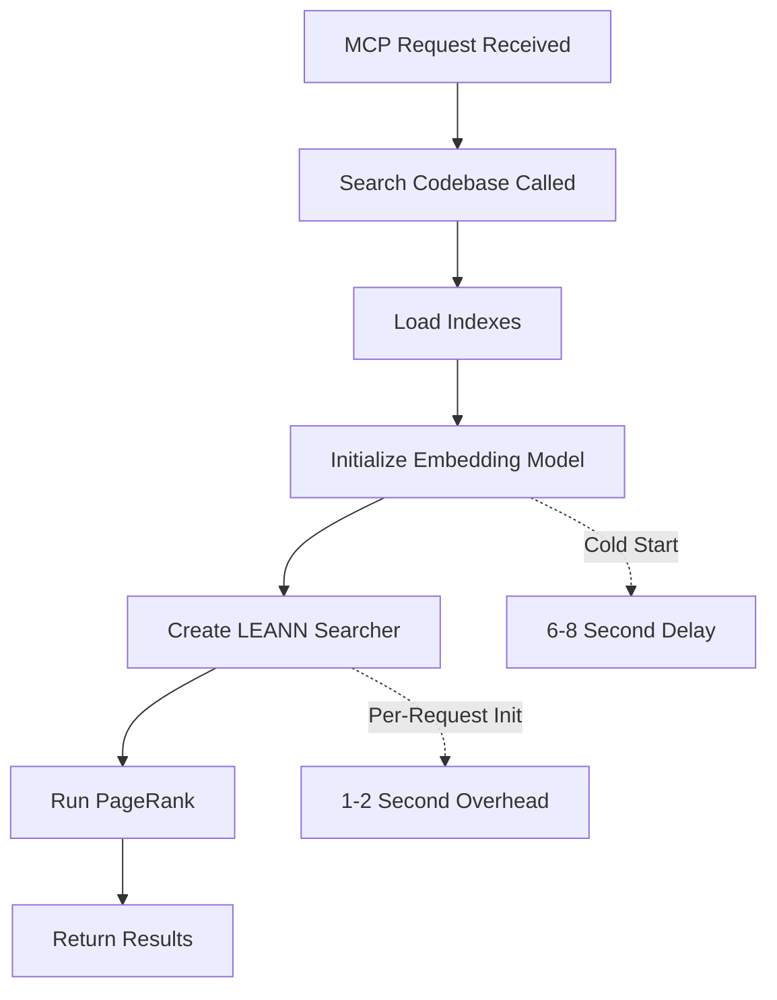
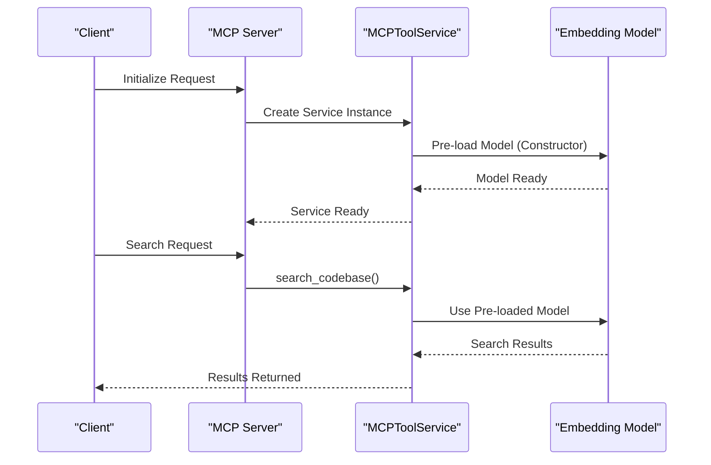
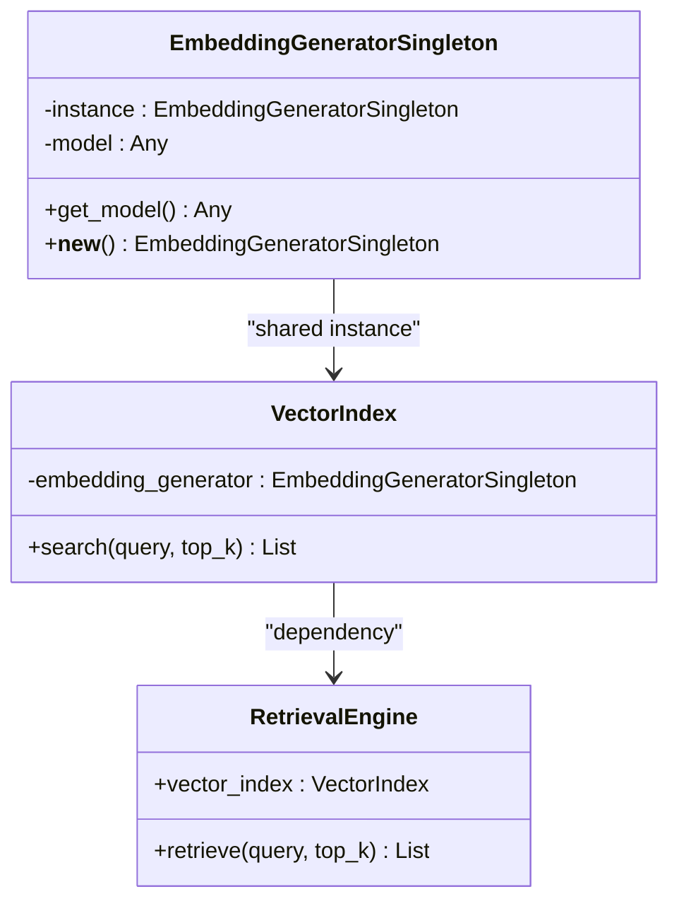
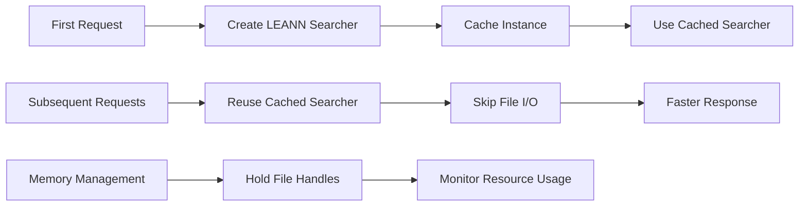
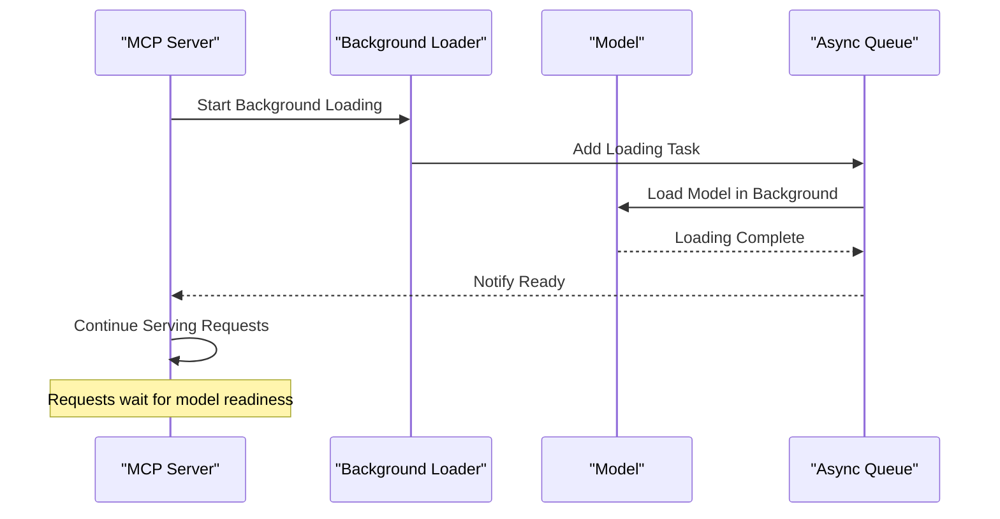
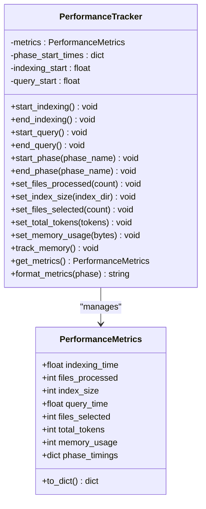
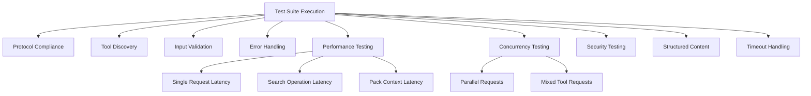

# MCP Performance Optimization Guide

<cite>
**Referenced Files in This Document**
- [MCP_PERFORMANCE_OPTIMIZATION.md](file://docs/performance/MCP_PERFORMANCE_OPTIMIZATION.md)
- [performance.md](file://docs/guides/performance.md)
- [performance.py](file://src/ws_ctx_engine/monitoring/performance.py)
- [budget.py](file://src/ws_ctx_engine/budget/budget.py)
- [xml_packer.py](file://src/ws_ctx_engine/packer/xml_packer.py)
- [zip_packer.py](file://src/ws_ctx_engine/packer/zip_packer.py)
- [vector_index.py](file://src/ws_ctx_engine/vector_index/vector_index.py)
- [retrieval.py](file://src/ws_ctx_engine/retrieval/retrieval.py)
- [server.py](file://src/ws_ctx_engine/mcp/server.py)
- [tools.py](file://src/ws_ctx_engine/mcp/tools.py)
- [query.py](file://src/ws_ctx_engine/workflow/query.py)
- [indexer.py](file://src/ws_ctx_engine/workflow/indexer.py)
- [graph.py](file://src/ws_ctx_engine/graph/graph.py)
- [embedding_cache.py](file://src/ws_ctx_engine/vector_index/embedding_cache.py)
- [mcp_comprehensive_test.py](file://scripts/mcp/mcp_comprehensive_test.py)
</cite>

## Table of Contents
1. [Introduction](#introduction)
2. [Performance Problem Analysis](#performance-problem-analysis)
3. [Core Performance Bottlenecks](#core-performance-bottlenecks)
4. [Optimization Strategies](#optimization-strategies)
5. [Implementation Roadmap](#implementation-roadmap)
6. [Monitoring and Metrics](#monitoring-and-metrics)
7. [Performance Testing Framework](#performance-testing-framework)
8. [Advanced Optimizations](#advanced-optimizations)
9. [Best Practices](#best-practices)
10. [Troubleshooting Guide](#troubleshooting-guide)
11. [Conclusion](#conclusion)

## Introduction

This document provides a comprehensive performance optimization guide for the MCP (Model Context Pack) system. The guide addresses the current latency challenges in the `search_codebase` operation, which currently averages 10,023ms, and provides actionable solutions to reduce this to under 3,000ms while maintaining search quality and system reliability.

The optimization strategy focuses on three primary areas: embedding model initialization, resource sharing, and operational efficiency improvements. The document combines theoretical analysis with practical implementation guidance, supported by comprehensive testing frameworks and monitoring capabilities.

## Performance Problem Analysis

### Current Latency Profile

The system exhibits significant latency during initial search operations due to several factors:

**Primary Bottleneck - Embedding Model Loading**
- SentenceTransformer model initialization: 6-8 seconds
- First-time model download and caching: adds to initial latency
- Cold start penalty for new server instances

**Secondary Bottlenecks**
- LEANN Searcher initialization: 1-2 seconds per request
- Graph operations (PageRank computation): 1-2 seconds
- File I/O overhead for index loading

### Root Cause Analysis

The performance issues stem from resource initialization patterns that create unnecessary overhead:

**Diagram sources**
- [vector_index.py:364-401](file://src/ws_ctx_engine/vector_index/vector_index.py#L364-L401)
- [retrieval.py:290-306](file://src/ws_ctx_engine/retrieval/retrieval.py#L290-L306)

**Section sources**
- [MCP_PERFORMANCE_OPTIMIZATION.md:5-21](file://docs/performance/MCP_PERFORMANCE_OPTIMIZATION.md#L5-L21)

## Core Performance Bottlenecks

### 1. Embedding Model Initialization

The SentenceTransformer model (`facebook/contriever`) requires significant initialization time and memory resources. Current implementation loads the model on-demand during the first search request.

**Performance Impact**: ~6-8 seconds for model loading plus warm-up
**Memory Usage**: ~500MB additional memory footprint

### 2. LEANN Searcher Instantiation

Each search request creates a new LEANN Searcher instance, causing repeated file I/O overhead and index loading.

**Performance Impact**: ~1-2 seconds per request
**Resource Waste**: Unnecessary file handle management

### 3. Graph Operations

PageRank computation and graph loading occur on every retrieval operation, adding additional latency.

**Performance Impact**: ~1-2 seconds per request
**Processing Overhead**: Redundant computations across requests

**Section sources**
- [MCP_PERFORMANCE_OPTIMIZATION.md:9-21](file://docs/performance/MCP_PERFORMANCE_OPTIMIZATION.md#L9-L21)
- [vector_index.py:364-401](file://src/ws_ctx_engine/vector_index/vector_index.py#L364-L401)
- [retrieval.py:290-306](file://src/ws_ctx_engine/retrieval/retrieval.py#L290-L306)

## Optimization Strategies

### Strategy 1: Pre-load Embedding Model (High Impact)

**Implementation Approach**: Initialize embedding model during MCP service construction

**Diagram sources**
- [MCP_PERFORMANCE_OPTIMIZATION.md:30-57](file://docs/performance/MCP_PERFORMANCE_OPTIMIZATION.md#L30-L57)
- [tools.py:29-42](file://src/ws_ctx_engine/mcp/tools.py#L29-L42)

**Benefits**:
- Eliminates 6-8s cold start penalty
- All subsequent queries benefit immediately
- Minimal code changes required

**Trade-offs**:
- Increases server startup time by ~6-8s (one-time cost)
- Memory usage increases by ~500MB

### Strategy 2: Singleton Pattern for Shared Resources

**Implementation Approach**: Create module-level singletons for expensive resources

**Diagram sources**
- [MCP_PERFORMANCE_OPTIMIZATION.md:75-98](file://docs/performance/MCP_PERFORMANCE_OPTIMIZATION.md#L75-L98)
- [vector_index.py:96-128](file://src/ws_ctx_engine/vector_index/vector_index.py#L96-L128)

**Benefits**:
- Model shared across all requests/sessions
- Reduces memory footprint
- Thread-safe lazy initialization

**Trade-offs**:
- Requires refactoring vector_index module
- More complex than pre-loading solution

### Strategy 3: Cache LEANN Searcher Instance

**Implementation Approach**: Reuse LEANN Searcher instances instead of creating per-request

**Diagram sources**
- [MCP_PERFORMANCE_OPTIMIZATION.md:115-132](file://docs/performance/MCP_PERFORMANCE_OPTIMIZATION.md#L115-L132)
- [vector_index.py:429-462](file://src/ws_ctx_engine/vector_index/vector_index.py#L429-L462)

**Benefits**:
- Saves ~1-2s per request
- Simple implementation
- Maintains existing API compatibility

**Trade-offs**:
- Holds file handles open
- Less impact than model pre-loading

### Strategy 4: Async Background Loading

**Implementation Approach**: Load resources in background thread pool

**Diagram sources**
- [MCP_PERFORMANCE_OPTIMIZATION.md:149-172](file://docs/performance/MCP_PERFORMANCE_OPTIMIZATION.md#L149-L172)

**Benefits**:
- Non-blocking startup
- Can show progress indicator

**Trade-offs**:
- Complex async/await integration
- Overkill for stdio-based MCP server

**Section sources**
- [MCP_PERFORMANCE_OPTIMIZATION.md:26-181](file://docs/performance/MCP_PERFORMANCE_OPTIMIZATION.md#L26-L181)

## Implementation Roadmap

### Phase 1: Quick Wins (1-2 hours)

**Priority 1: Pre-load Embedding Model**
1. Modify `MCPToolService.__init__` to include model pre-loading
2. Add warm-up functionality with dummy query
3. Implement error handling for model loading failures

**Priority 2: Cache LEANN Searcher**
1. Add `_searcher_cache` attribute to `VectorIndex` class
2. Implement `_get_searcher()` method for lazy initialization
3. Update search method to reuse cached instance

**Expected Outcome**: 10s → 2-3s latency reduction (70-80% improvement)

### Phase 2: Architecture Improvements (Optional, 4-6 hours)

**Priority 1: Implement Singleton Pattern**
1. Create `EmbeddingGeneratorSingleton` class
2. Refactor `VectorIndex` to use shared model instance
3. Ensure thread safety across concurrent requests

**Priority 2: Add Health Check Endpoint**
1. Implement model loading status monitoring
2. Add metrics collection for timing breakdown
3. Create health check API endpoint

**Expected Outcome**: Additional 10-20% improvement

**Section sources**
- [MCP_PERFORMANCE_OPTIMIZATION.md:184-197](file://docs/performance/MCP_PERFORMANCE_OPTIMIZATION.md#L184-L197)

## Monitoring and Metrics

### Performance Tracking Framework

The system includes comprehensive performance monitoring capabilities through the `PerformanceTracker` class:

**Diagram sources**
- [performance.py:13-263](file://src/ws_ctx_engine/monitoring/performance.py#L13-L263)

### Key Metrics Collection

The monitoring system tracks critical performance indicators:

**Indexing Phase Metrics**:
- Total indexing time
- Files processed count
- Index size on disk
- Memory usage during indexing

**Query Phase Metrics**:
- Total query time
- Files selected within budget
- Total tokens in selected files
- Phase-specific timing breakdown

**Memory Management**:
- Peak memory usage tracking
- Automatic memory monitoring with psutil fallback

**Section sources**
- [performance.py:13-263](file://src/ws_ctx_engine/monitoring/performance.py#L13-L263)

## Performance Testing Framework

### Comprehensive Test Suite

The MCP system includes a comprehensive test suite that validates performance across multiple dimensions:

**Diagram sources**
- [mcp_comprehensive_test.py:40-800](file://scripts/mcp/mcp_comprehensive_test.py#L40-L800)

### Performance Benchmarking

The testing framework provides standardized performance measurement:

**Latency Thresholds**:
- Single request latency: < 1000ms (target: < 300ms)
- Search operation latency: < 3000ms (target: < 1000ms)
- Pack context latency: < 5000ms (target: < 3000ms)

**Concurrency Testing**:
- Parallel request handling (5 concurrent requests)
- Mixed tool operation testing
- Resource utilization monitoring

**Section sources**
- [mcp_comprehensive_test.py:506-576](file://scripts/mcp/mcp_comprehensive_test.py#L506-L576)

## Advanced Optimizations

### Rust Extension Acceleration

The system includes optional Rust extensions that provide significant performance improvements for hot-path operations:

**Performance Improvements**:
- File walking: 8-20x faster (10k files: 142ms vs 2,400ms baseline)
- Gitignore matching: 8-12x faster (500ms vs 50ms)
- Chunk hashing: 8-10x faster (300ms vs 30ms)
- Token counting: 8-12x faster (1s vs 100ms)

**Implementation Details**:
- Built with maturin for seamless Python integration
- Native Rust implementation with parallel processing
- Automatic fallback to Python implementations when Rust unavailable

**Section sources**
- [performance.md:3-81](file://docs/guides/performance.md#L3-L81)

### Memory-Efficient Processing

The system implements several memory optimization strategies:

**Embedding Cache System**:
- Disk-backed content-hash → embedding vector cache
- Prevents re-embedding unchanged files during incremental rebuilds
- Supports both numpy arrays and JSON index persistence

**Content Deduplication**:
- Session-based content deduplication to reduce memory usage
- Marker replacement for repeated file content
- Configurable deduplication thresholds

**Section sources**
- [embedding_cache.py:28-127](file://src/ws_ctx_engine/vector_index/embedding_cache.py#L28-L127)
- [query.py:427-490](file://src/ws_ctx_engine/workflow/query.py#L427-L490)

## Best Practices

### Resource Management

**Model Lifecycle Management**:
- Pre-load models during service initialization
- Implement graceful fallback mechanisms
- Monitor memory usage and handle out-of-memory conditions
- Support multiple model configurations via environment variables

**Index Management**:
- Implement proper index caching strategies
- Handle stale index detection and automatic rebuilding
- Optimize file handle management to prevent resource leaks
- Support incremental index updates for improved performance

### Error Handling and Resilience

**Graceful Degradation**:
- Fallback to CPU-based processing when GPU resources unavailable
- Graceful handling of model loading failures
- Robust error reporting with detailed failure contexts
- Circuit breaker patterns for failing components

**Monitoring and Alerting**:
- Comprehensive metrics collection for all major operations
- Performance threshold monitoring and alerting
- Memory usage tracking and automatic cleanup
- Request latency monitoring with percentile calculations

### Configuration and Tuning

**Environment-Based Configuration**:
- Support for disabling model pre-loading via environment variables
- Configurable embedding models for different performance/accuracy trade-offs
- Memory threshold configuration for resource-constrained environments
- Logging level and debug output controls

**Section sources**
- [vector_index.py:126-173](file://src/ws_ctx_engine/vector_index/vector_index.py#L126-L173)
- [tools.py:43-131](file://src/ws_ctx_engine/mcp/tools.py#L43-L131)

## Troubleshooting Guide

### Common Performance Issues

**Slow Initial Search Response**:
- Verify embedding model pre-loading is functioning
- Check for model download delays during first initialization
- Monitor memory usage for adequate allocation

**High Memory Usage**:
- Implement embedding cache to reduce memory footprint
- Monitor peak memory usage during index operations
- Consider model quantization for reduced memory requirements

**Index Loading Delays**:
- Verify index caching is properly configured
- Check file system performance and disk I/O
- Monitor concurrent index access patterns

### Diagnostic Tools

**Performance Profiling**:
- Use PerformanceTracker for detailed timing breakdown
- Monitor phase-specific performance metrics
- Analyze memory usage patterns over time

**System Monitoring**:
- Track resource utilization during peak loads
- Monitor disk I/O patterns and bottlenecks
- Analyze network latency for external API dependencies

**Section sources**
- [performance.py:72-263](file://src/ws_ctx_engine/monitoring/performance.py#L72-L263)
- [indexer.py:404-493](file://src/ws_ctx_engine/workflow/indexer.py#L404-L493)

## Conclusion

The MCP performance optimization initiative targets the critical latency issues in the `search_codebase` operation, transforming the current 10-second average response time to under 3 seconds through strategic implementation of pre-loading, caching, and resource sharing optimizations.

The recommended implementation approach prioritizes immediate gains through embedding model pre-loading and LEANN searcher caching, with optional advanced optimizations for architecture improvements. The comprehensive monitoring and testing framework ensures that performance improvements are measurable, sustainable, and maintainable.

Key success factors include:
- **Immediate Impact**: Pre-loading eliminates 6-8s cold start penalty
- **Scalable Architecture**: Caching strategies reduce per-request overhead
- **Comprehensive Monitoring**: Detailed metrics enable ongoing optimization
- **Robust Testing**: Multi-dimensional test suite ensures reliability
- **Flexible Configuration**: Environment-based tuning supports diverse deployment scenarios

The optimization strategy balances performance gains with system stability, providing a foundation for continued performance improvements while maintaining backward compatibility and operational reliability.