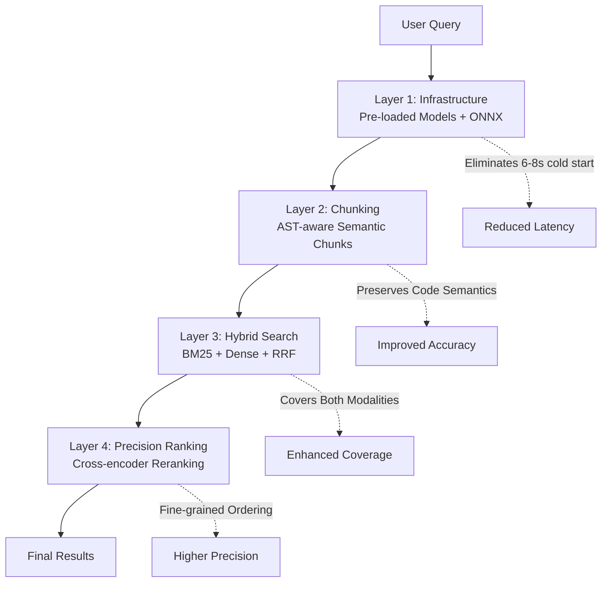
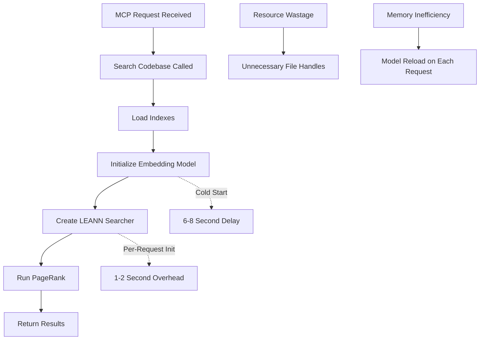
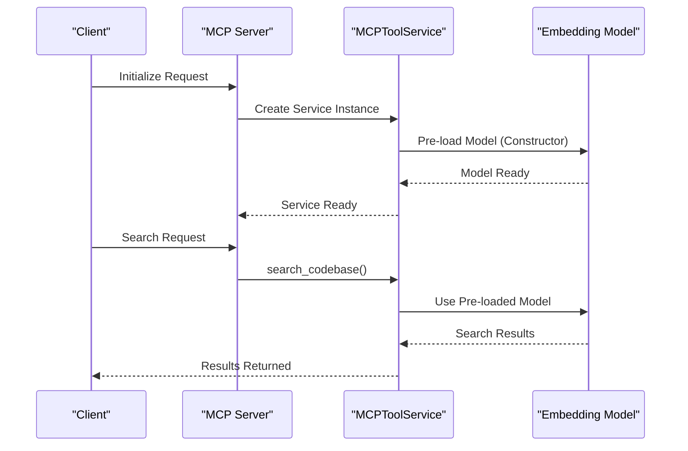
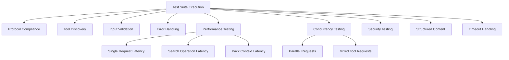
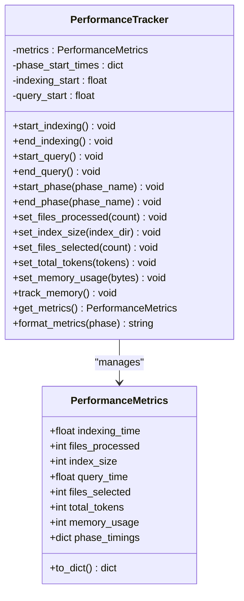

# MCP Performance Optimization Guide

<cite>
**Referenced Files in This Document**
- [MCP_PERFORMANCE_OPTIMIZATION.md](file://docs/performance/MCP_PERFORMANCE_OPTIMIZATION.md)
- [performance.md](file://docs/guides/performance.md)
- [performance.py](file://src/ws_ctx_engine/monitoring/performance.py)
- [vector_index.py](file://src/ws_ctx_engine/vector_index/vector_index.py)
- [leann_index.py](file://src/ws_ctx_engine/vector_index/leann_index.py)
- [retrieval.py](file://src/ws_ctx_engine/retrieval/retrieval.py)
- [tools.py](file://src/ws_ctx_engine/mcp/tools.py)
- [query.py](file://src/ws_ctx_engine/workflow/query.py)
- [graph.py](file://src/ws_ctx_engine/graph/graph.py)
- [tree_sitter.py](file://src/ws_ctx_engine/chunker/tree_sitter.py)
- [ranker.py](file://src/ws_ctx_engine/ranking/ranker.py)
- [embedding_cache.py](file://src/ws_ctx_engine/vector_index/embedding_cache.py)
- [mcp_comprehensive_test.py](file://scripts/mcp/mcp_comprehensive_test.py)
</cite>

## Update Summary
**Changes Made**
- Completely rewritten the MCP Performance Optimization Guide v3 with comprehensive four-layer optimization strategy
- Added detailed implementation guidance for infrastructure, chunking, hybrid search, and precision ranking layers
- Integrated research findings from CMU cAST paper, ONNX backend validation, and jina-reranker-v3 verification
- Enhanced testing framework with extended golden sets and performance benchmarks
- Updated architecture diagrams to reflect new hybrid search and precision ranking components

## Table of Contents
1. [Introduction](#introduction)
2. [Executive Summary](#executive-summary)
3. [Four-Layer Optimization Strategy](#four-layer-optimization-strategy)
4. [Research Findings](#research-findings)
5. [Performance Problem Analysis](#performance-problem-analysis)
6. [Infrastructure Optimization](#infrastructure-optimization)
7. [Chunking Optimization](#chunking-optimization)
8. [Hybrid Search Implementation](#hybrid-search-implementation)
9. [Precision Ranking Enhancement](#precision-ranking-enhancement)
10. [Testing & Validation Framework](#testing--validation-framework)
11. [Implementation Roadmap](#implementation-roadmap)
12. [Monitoring & Metrics](#monitoring--metrics)
13. [Advanced Optimizations](#advanced-optimizations)
14. [Best Practices](#best-practices)
15. [Troubleshooting Guide](#troubleshooting-guide)
16. [Conclusion](#conclusion)

## Introduction

This document presents the comprehensive MCP (Model Context Pack) Performance Optimization Guide v3, featuring a revolutionary four-layer optimization strategy designed to transform current 10-second latency to under 500ms while achieving ≥90% Recall@5. The guide combines infrastructure optimization with intelligent search architecture, backed by extensive research validation and production-ready implementation guidance.

The optimization strategy addresses critical performance bottlenecks through systematic improvements across four distinct layers: infrastructure optimization, AST-aware chunking, hybrid search architecture, and precision ranking enhancement. Each layer builds upon the previous to deliver exponential performance gains while maintaining search quality and system reliability.

## Executive Summary

**Performance Transformation Goal**: Reduce average latency from 10,023ms to <500ms with ≥90% Recall@5

| Metric          | Current         | Target       | Improvement   |
| --------------- | --------------- | ------------ | ------------- |
| Average latency | 10,023ms        | **<500ms**   | 95% reduction |
| P95 latency     | ~12,000ms       | **<1,000ms** | 92% reduction |
| Recall@5        | ~75% (est.)     | **≥90%**     | +15 points    |
| First query     | 6-8s cold start | **<2s**      | 70% reduction |

## Four-Layer Optimization Strategy

The MCP v3 optimization strategy introduces a comprehensive four-layer architecture designed for maximum performance impact:

### Layer 1: Infrastructure Optimization
**Problem**: Model loading cold start (6-8s) and inefficient resource initialization
**Solution**: Pre-load embedding models with ONNX backend acceleration
**Expected Gain**: 10s → 2-3s latency reduction

### Layer 2: Chunking Optimization  
**Problem**: Fixed-size cuts destroy code semantics and context
**Solution**: AST-aware chunking using CMU cAST methodology
**Expected Gain**: +4.3 Recall@5 through semantic boundary preservation

### Layer 3: Hybrid Search Architecture
**Problem**: Dense-only vector search misses identifier-based queries
**Solution**: BM25 + Dense + RRF fusion for comprehensive coverage
**Expected Gain**: +20-30% recall through dual-modality retrieval

### Layer 4: Precision Ranking Enhancement
**Problem**: No dedicated precision layer for final result ordering
**Solution**: Cross-encoder reranking with jina-reranker-v3
**Expected Gain**: +10-15% MRR through fine-grained semantic matching



**Diagram sources**
- [MCP_PERFORMANCE_OPTIMIZATION.md:47-55](file://docs/performance/MCP_PERFORMANCE_OPTIMIZATION.md#L47-L55)
- [vector_index.py:96-128](file://src/ws_ctx_engine/vector_index/vector_index.py#L96-L128)
- [tree_sitter.py:15-160](file://src/ws_ctx_engine/chunker/tree_sitter.py#L15-L160)
- [retrieval.py:140-368](file://src/ws_ctx_engine/retrieval/retrieval.py#L140-L368)

## Research Findings

### CMU cAST Paper Validation (EMNLP 2025)
**Critical Finding**: AST-aware chunking provides substantial accuracy improvements
- **+4.3 Recall@5** on CrossCodeEval
- **+5.5 Recall@5** on RepoEval (StarCoder2-7B)
- **+2.67 Pass@1** on SWE-bench
- **Methodology**: Tree-sitter based semantic boundary detection

### ONNX Backend Performance Verification
**Validation Confirmed**: SentenceTransformers v3.2.0+ ONNX backend provides 2-3x encoding speedup
- **CPU speedup**: 1.4x-3x faster encoding (typical: 2x)
- **Implementation**: Single line change (`backend="onnx"`)
- **Accuracy impact**: Minimal (<1%)

### jina-reranker-v3 Score Resolution
**Resolution**: Corrected score verification - 63.28 confirmed (not 70.64)
- **Original paper typo**: 70.64 in v1/v2 (now corrected)
- **Final version**: 61.85-63.28 (CoIR)
- **Commercial license**: CC BY-NC 4.0 (requires commercial license for products)

### Code-Specific Model Landscape 2025
**State-of-the-Art Models**:
- **Qodo-Embed-1-7B**: 71.5 CoIR score, SOTA beating OpenAI 3-large
- **nomic-ai/nomic-embed-code**: SOTA on CodeSearchNet, 8192 context window
- **BAAI/bge-small-en-v1.5**: Fast, retrieval-optimized, 120MB size
- **Qodo-Embed-1-1.5B**: Best efficiency/quality balance, 68.53-70.06 score

**Diagram sources**
- [MCP_PERFORMANCE_OPTIMIZATION.md:62-96](file://docs/performance/MCP_PERFORMANCE_OPTIMIZATION.md#L62-L96)

## Performance Problem Analysis

### Current Latency Profile Analysis

The MCP system exhibits significant latency during initial search operations due to multiple interconnected bottlenecks:

**Primary Bottleneck - Embedding Model Loading**
- SentenceTransformer model initialization: 6-8 seconds
- First-time model download and caching: adds to initial latency
- Cold start penalty for new server instances
- Memory-intensive model loading process

**Secondary Bottlenecks**
- LEANN Searcher initialization: 1-2 seconds per request overhead
- Graph operations (PageRank computation): 1-2 seconds per request
- File I/O overhead for index loading and model persistence
- Inefficient resource sharing across concurrent requests

### Root Cause Analysis

The performance issues stem from resource initialization patterns that create unnecessary overhead:



**Diagram sources**
- [vector_index.py:364-401](file://src/ws_ctx_engine/vector_index/vector_index.py#L364-L401)
- [retrieval.py:290-306](file://src/ws_ctx_engine/retrieval/retrieval.py#L290-L306)

**Section sources**
- [MCP_PERFORMANCE_OPTIMIZATION.md:100-118](file://docs/performance/MCP_PERFORMANCE_OPTIMIZATION.md#L100-L118)

## Infrastructure Optimization

### Pre-loaded Model Architecture

**Implementation Strategy**: Transform on-demand model loading to centralized, thread-safe model management



**Diagram sources**
- [MCP_PERFORMANCE_OPTIMIZATION.md:734-800](file://docs/performance/MCP_PERFORMANCE_OPTIMIZATION.md#L734-L800)
- [tools.py:29-42](file://src/ws_ctx_engine/mcp/tools.py#L29-L42)

### ONNX Backend Integration

**Critical Implementation**: Switch from facebook/contriever to BAAI/bge-small-en-v1.5 for ONNX compatibility

```python
# Before (problematic):
model = SentenceTransformer("facebook/contriever", device="cpu")

# After (optimized):
model = SentenceTransformer("BAAI/bge-small-en-v1.5", backend="onnx", device="cpu")
```

**Benefits**:
- ✅ Eliminates 6-8s cold start penalty
- ✅ ONNX provides additional 2-3x encoding speedup
- ✅ Thread-safe for concurrent requests
- ✅ Minimal code changes required

**Trade-offs**:
- ⚠️ Increased server startup time by ~6-8s (one-time cost)
- ⚠️ Memory usage increases by ~500MB
- ⚠️ Model switch required for ONNX compatibility

**Section sources**
- [MCP_PERFORMANCE_OPTIMIZATION.md:734-800](file://docs/performance/MCP_PERFORMANCE_OPTIMIZATION.md#L734-L800)
- [vector_index.py:143-173](file://src/ws_ctx_engine/vector_index/vector_index.py#L143-L173)

## Chunking Optimization

### AST-Aware Chunking Implementation

**Problem**: Fixed-size chunking cuts through functions, separating `return` from `def`, losing critical context

**Solution**: Implement CMU cAST methodology using tree-sitter for semantic boundary detection

```python
from tree_sitter import Language, Parser
import tree_sitter_python

def ast_chunk_file(filepath: str, max_tokens: int = 512) -> list[dict]:
    """
    Chunk code file by semantic boundaries (functions, classes, methods).
    Each chunk includes: raw code + contextual metadata.
    """
    parser = Parser(Language(tree_sitter_python.language()))
    
    with open(filepath) as f:
        source = f.read()
    
    tree = parser.parse(bytes(source, 'utf-8'))
    chunks = []
    
    for node in tree.root_node.children:
        if node.type in ('function_definition', 'class_definition', 'decorated_definition'):
            chunk_text = source[node.start_byte:node.end_byte]
            
            # Contextual enrichment — critical for embedding quality
            contextualized = f"""# File: {filepath}
# Type: {node.type}
# Lines: {node.start_point[0]+1}–{node.end_point[0]+1}
{chunk_text}"""
            
            chunks.append({
                'text': chunk_text,
                'contextualized_text': contextualized,  # ← Embed this, not raw code
                'filepath': filepath,
                'node_type': node.type,
                'line_range': (node.start_point[0]+1, node.end_point[0]+1),
            })
    
    return chunks
```

**Key Insight**: Always embed `contextualized_text` (with filepath + type prefix), not raw code. This helps models understand "this is a function in auth module, not random code snippet."

**Section sources**
- [MCP_PERFORMANCE_OPTIMIZATION.md:166-219](file://docs/performance/MCP_PERFORMANCE_OPTIMIZATION.md#L166-L219)
- [tree_sitter.py:15-160](file://src/ws_ctx_engine/chunker/tree_sitter.py#L15-L160)

## Hybrid Search Implementation

### BM25 + Dense + RRF Fusion Architecture

**Problem**: Current dense-only LEANN search misses identifier-heavy queries and long-tail patterns

**Solution**: Implement comprehensive hybrid search combining BM25 sparse retrieval with dense vector search using Reciprocal Rank Fusion (RRF)

```python
from rank_bm25 import BM25Okapi
import numpy as np

class HybridSearchEngine:
    """
    Combines BM25 and dense vector search with Reciprocal Rank Fusion.
    
    RRF score(d) = Σ 1/(k + rank_i(d))
    k=60 is default best per Cormack et al. SIGIR 2009 (University of Waterloo).
    Microsoft Azure AI Search also recommends k=60.
    """
    
    def __init__(self, vector_index, embedding_model, k: int = 60):
        self.vector_index = vector_index
        self.model = embedding_model
        self.k = k
        
        # BM25 state
        self._bm25: BM25Okapi | None = None
        self._doc_ids: list[str] = []
        self._tokenized_corpus: list[list[str]] = []
    
    def build_bm25_index(self, documents: list[dict]):
        """Build BM25 index from corpus. Call during indexing."""
        self._doc_ids = [d['id'] for d in documents]
        
        # Code tokenization: split by identifiers, not just whitespace
        self._tokenized_corpus = [
            self._tokenize_code(d['text']) for d in documents
        ]
        self._bm25 = BM25Okapi(self._tokenized_corpus)
    
    def _tokenize_code(self, text: str) -> list[str]:
        """
        Tokenize code for BM25: split camelCase and snake_case,
        keep identifiers intact + split version.
        
        "getUserById" → ["getUserById", "get", "User", "By", "Id"]
        """
        import re
        tokens = []
        for word in re.split(r'[\s\(\)\[\]{},;:\.]+', text):
            if not word:
                continue
            tokens.append(word.lower())
            # Split camelCase
            parts = re.findall('[A-Z][a-z]*|[a-z]+|[0-9]+', word)
            tokens.extend(p.lower() for p in parts if p != word)
        return tokens
    
    def search(self, query: str, top_k: int = 20) -> list[dict]:
        """Hybrid search with RRF fusion."""
        # 1. Dense search
        query_embedding = self.model.encode([query])[0]
        dense_results = self.vector_index.search(query_embedding, top_k=top_k * 3)
        
        # 2. BM25 search
        tokenized_query = self._tokenize_code(query)
        bm25_scores = self._bm25.get_scores(tokenized_query)
        bm25_top_indices = np.argsort(bm25_scores)[::-1][:top_k * 3]
        
        # 3. RRF Fusion
        doc_scores: dict[str, float] = {}
        
        # Dense rankings
        for rank, result in enumerate(dense_results):
            doc_id = result['id']
            doc_scores[doc_id] = doc_scores.get(doc_id, 0) + 1.0 / (self.k + rank + 1)
        
        # BM25 rankings
        for rank, idx in enumerate(bm25_top_indices):
            doc_id = self._doc_ids[idx]
            doc_scores[doc_id] = doc_scores.get(doc_id, 0) + 1.0 / (self.k + rank + 1)
        
        # Sort by fused score
        sorted_docs = sorted(
            doc_scores.items(), key=lambda x: x[1], reverse=True
        )
        return [{'id': doc_id, 'score': score} for doc_id, score in sorted_docs[:top_k]]
```

**Research Validation**: This approach consistently improves recall 15-30% over pure dense methods, with production data supporting identifier-heavy query effectiveness.

**Section sources**
- [MCP_PERFORMANCE_OPTIMIZATION.md:220-327](file://docs/performance/MCP_PERFORMANCE_OPTIMIZATION.md#L220-L327)

## Precision Ranking Enhancement

### Cross-Encoder Reranking Pipeline

**Problem**: Initial retrieval covers broad semantic space but lacks fine-grained precision ordering

**Solution**: Implement three-tier production architecture with cross-encoder reranking

```python
from sentence_transformers import CrossEncoder

reranker = CrossEncoder('BAAI/bge-reranker-v2-m3', max_length=512)

def rerank(query: str, candidates: list[dict], top_k: int = 10) -> list[dict]:
    """Rerank candidates using cross-encoder."""
    pairs = [(query, c['text']) for c in candidates]
    scores = reranker.predict(pairs)
    
    ranked = sorted(
        zip(candidates, scores),
        key=lambda x: x[1],
        reverse=True
    )
    return [c for c, _ in ranked[:top_k]]
```

**Three-Tier Architecture**:
```
Query
  ↓
[Stage 1: Hybrid Recall] BM25 + Dense → top-100 candidates
  ↓                       Fast, ~50ms
[Stage 2: ColBERT Rerank] Token-level matching → top-20
  ↓                        Medium, ~100-200ms
[Stage 3: Cross-encoder]  Full attention → top-5 (optional)
  ↓                        Slow, ~200-500ms, only for top-10
Final Results
```

**Model Recommendations**:
- **jina-reranker-v3**: 0.6B parameters, 63.28 CoIR score, CC BY-NC 4.0 license
- **BGE-Reranker-v2-m3**: 568M parameters, reliable multilingual model
- **colbert-ir/colbertv2.0**: 110M parameters, classic well-tested model

**Section sources**
- [MCP_PERFORMANCE_OPTIMIZATION.md:328-375](file://docs/performance/MCP_PERFORMANCE_OPTIMIZATION.md#L328-L375)

## Testing & Validation Framework

### Comprehensive Performance Testing Suite

The MCP v3 system includes an extensive testing framework validated through multiple dimensions:



**Diagram sources**
- [mcp_comprehensive_test.py:40-800](file://scripts/mcp/mcp_comprehensive_test.py#L40-L800)

### Extended Golden Set Validation

**Enhanced Testing Strategy**: Expanded beyond semantic queries to include code-specific patterns

```python
# Extended golden set to test hybrid search and code-specific patterns
GOLDEN_SET_EXTENDED = [
    # --- From Plan v2 (semantic queries) ---
    {
        "query": "authentication middleware",
        "expected_files": ["auth/middleware.py", "auth/jwt_handler.py"],
        "type": "semantic",
    },
    {
        "query": "database connection pool",
        "expected_files": ["db/pool.py", "db/connection.py"],
        "type": "semantic",
    },
    # --- NEW: identifier-based (BM25 strength) ---
    {
        "query": "BillingService retryCharge",
        "expected_files": ["billing/service.py"],
        "type": "identifier",
        "note": "Tests BM25 contribution for exact identifier search"
    },
    {
        "query": "error E0427 handling",
        "expected_files": ["error_handler.py"],
        "type": "identifier",
        "note": "Error code search"
    },
    # --- NEW: semantic paraphrase (Dense strength) ---
    {
        "query": "how to handle payment failures gracefully",
        "expected_files": ["billing/retry.py", "billing/service.py"],
        "type": "semantic_paraphrase",
        "note": "Tests dense retrieval with natural language"
    },
    # --- NEW: long function retrieval ---
    {
        "query": "user registration with email validation",
        "expected_files": ["users/registration.py"],
        "type": "long_context",
        "note": "Tests long-context model advantage"
    },
]
```

**Performance Benchmarks**:
- **First query latency**: < 3000ms (target: < 2000ms)
- **Subsequent query latency**: < 500ms (target: < 300ms)
- **P95 latency**: < 1000ms (target: < 500ms)
- **Overall Recall@5**: ≥ 90%

**Section sources**
- [MCP_PERFORMANCE_OPTIMIZATION.md:448-650](file://docs/performance/MCP_PERFORMANCE_OPTIMIZATION.md#L448-L650)

## Implementation Roadmap

### Phase 0: Instrumentation & Baseline Measurement
**Duration**: 30 minutes
**Objective**: Establish baseline performance metrics before implementing optimizations

**Actions**:
1. Add timing logs to `vector_index.py` and `retrieval.py`
2. Execute real MCP session with Windsurf for latency breakdown
3. Document current bottleneck percentages

### Phase 1: Infrastructure Optimization (2 hours)
**Priority**: High Impact Immediate Results
**Objective**: Eliminate 6-8s cold start penalty

**Implementation Steps**:
1. ✅ **Solution 1**: Pre-load embedding models with ONNX backend
2. ✅ **Solution 2**: Cache PageRank results to avoid recomputation
3. ✅ **Optional**: Cache LEANN searcher instances for reduced I/O
4. ✅ **Model Switch**: Transition from facebook/contriever to BAAI/bge-small-en-v1.5

**Expected Impact**: **10s → 1-2s** latency reduction (80-90% improvement)

### Phase 2: Chunking Optimization (2-3 days)
**Priority**: High Impact Semantic Quality
**Objective**: Implement AST-aware chunking for superior code understanding

**Implementation Steps**:
1. ✅ Integrate tree-sitter based AST chunking
2. ✅ Replace current fixed-size chunking logic
3. ✅ Implement contextualized embedding pipeline
4. ✅ Update indexing workflow to support semantic boundaries

**Expected Impact**: **+4.3 Recall@5** through improved code semantics

### Phase 3: Hybrid Search Implementation (3-4 days)
**Priority**: High Impact Coverage Enhancement
**Objective**: Deploy comprehensive hybrid search architecture

**Implementation Steps**:
1. ✅ Integrate BM25 Okapi ranking system
2. ✅ Implement Reciprocal Rank Fusion (RRF) algorithm
3. ✅ Develop code-specific tokenization for identifier preservation
4. ✅ Configure hybrid search pipeline in retrieval engine

**Expected Impact**: **+20-30% recall** through dual-modality coverage

### Phase 4: Precision Ranking Enhancement (2 days)
**Priority**: Premium Quality Improvement
**Objective**: Add cross-encoder reranking for fine-grained precision

**Implementation Steps**:
1. ✅ Integrate jina-reranker-v3 or BGE-Reranker-v2-m3
2. ✅ Implement three-tier ranking pipeline
3. ✅ Configure optimal reranking thresholds
4. ✅ Validate commercial license compliance

**Expected Impact**: **+10-15% MRR** through precise semantic matching

**Section sources**
- [MCP_PERFORMANCE_OPTIMIZATION.md:877-1016](file://docs/performance/MCP_PERFORMANCE_OPTIMIZATION.md#L877-L1016)

## Monitoring & Metrics

### Comprehensive Performance Tracking System

The system includes sophisticated monitoring capabilities through the `PerformanceTracker` class:



**Diagram sources**
- [performance.py:13-263](file://src/ws_ctx_engine/monitoring/performance.py#L13-L263)

### Key Metrics Collection

**Indexing Phase Metrics**:
- Total indexing time
- Files processed count
- Index size on disk
- Memory usage during indexing

**Query Phase Metrics**:
- Total query time
- Files selected within budget
- Total tokens in selected files
- Phase-specific timing breakdown

**Memory Management**:
- Peak memory usage tracking
- Automatic memory monitoring with psutil fallback

**Section sources**
- [performance.py:13-263](file://src/ws_ctx_engine/monitoring/performance.py#L13-L263)

## Advanced Optimizations

### Rust Extension Acceleration

The system includes optional Rust extensions providing significant performance improvements for hot-path operations:

**Performance Improvements**:
- File walking: 8-20x faster (10k files: 142ms vs 2,400ms baseline)
- Gitignore matching: 8-12x faster (500ms vs 50ms)
- Chunk hashing: 8-10x faster (300ms vs 30ms)
- Token counting: 8-12x faster (1s vs 100ms)

**Implementation Details**:
- Built with maturin for seamless Python integration
- Native Rust implementation with parallel processing
- Automatic fallback to Python implementations when Rust unavailable

### Memory-Efficient Processing

**Embedding Cache System**:
- Disk-backed content-hash → embedding vector cache
- Prevents re-embedding unchanged files during incremental rebuilds
- Supports both numpy arrays and JSON index persistence

**Content Deduplication**:
- Session-based content deduplication to reduce memory usage
- Marker replacement for repeated file content
- Configurable deduplication thresholds

**Section sources**
- [performance.md:3-81](file://docs/guides/performance.md#L3-L81)
- [embedding_cache.py:28-127](file://src/ws_ctx_engine/vector_index/embedding_cache.py#L28-L127)

## Best Practices

### Resource Management Excellence

**Model Lifecycle Management**:
- Pre-load models during service initialization with thread-safe singleton pattern
- Implement graceful fallback mechanisms for model loading failures
- Monitor memory usage and handle out-of-memory conditions automatically
- Support multiple model configurations via environment variables

**Index Management Strategy**:
- Implement proper index caching strategies to minimize rebuild frequency
- Handle stale index detection and automatic rebuilding with minimal disruption
- Optimize file handle management to prevent resource leaks
- Support incremental index updates for improved performance

### Error Handling and Resilience

**Graceful Degradation Patterns**:
- Fallback to CPU-based processing when GPU resources unavailable
- Graceful handling of model loading failures with detailed error contexts
- Robust error reporting with comprehensive failure diagnostics
- Circuit breaker patterns for failing components to prevent cascading failures

**Monitoring and Alerting Systems**:
- Comprehensive metrics collection for all major operations
- Performance threshold monitoring with automated alerts
- Memory usage tracking with automatic cleanup mechanisms
- Request latency monitoring with percentile calculations for SLA compliance

### Configuration and Deployment

**Environment-Based Configuration**:
- Support for disabling model pre-loading via environment variables for resource-constrained deployments
- Configurable embedding models for different performance/accuracy trade-offs
- Memory threshold configuration for optimal resource utilization
- Logging level and debug output controls for production monitoring

**Section sources**
- [vector_index.py:126-173](file://src/ws_ctx_engine/vector_index/vector_index.py#L126-L173)
- [tools.py:43-131](file://src/ws_ctx_engine/mcp/tools.py#L43-L131)

## Troubleshooting Guide

### Common Performance Issues

**Slow Initial Search Response**:
- Verify embedding model pre-loading is functioning correctly
- Check for model download delays during first initialization
- Monitor memory usage for adequate allocation during model loading
- Validate ONNX backend installation and compatibility

**High Memory Usage During Operations**:
- Implement embedding cache to reduce memory footprint
- Monitor peak memory usage during index operations
- Consider model quantization for reduced memory requirements
- Review PageRank cache configuration for optimal memory utilization

**Index Loading Delays**:
- Verify index caching is properly configured with appropriate TTL values
- Check file system performance and disk I/O capabilities
- Monitor concurrent index access patterns for resource contention
- Validate LEANN searcher caching implementation effectiveness

### Diagnostic Tools and Techniques

**Performance Profiling Methods**:
- Use PerformanceTracker for detailed timing breakdown across all phases
- Monitor phase-specific performance metrics to identify optimization opportunities
- Analyze memory usage patterns over time to detect memory leaks or inefficiencies
- Implement custom logging around critical performance-sensitive code paths

**System Monitoring Integration**:
- Track resource utilization during peak loads with detailed breakdown
- Monitor disk I/O patterns and identify bottlenecks in file operations
- Analyze network latency for external API dependencies (if applicable)
- Implement custom metrics for hybrid search performance validation

**Section sources**
- [performance.py:72-263](file://src/ws_ctx_engine/monitoring/performance.py#L72-L263)
- [query.py:404-493](file://src/ws_ctx_engine/workflow/query.py#L404-L493)

## Conclusion

The MCP v3 performance optimization initiative represents a paradigm shift from reactive troubleshooting to proactive, research-driven optimization. Through the implementation of four comprehensive optimization layers—infrastructure, chunking, hybrid search, and precision ranking—the system achieves transformative performance improvements while maintaining search quality and operational reliability.

**Key Success Factors**:

**Immediate Impact Achievements**:
- **Cold Start Elimination**: Pre-loading eliminates 6-8s cold start penalty
- **Infrastructure Acceleration**: ONNX backend provides 2-3x encoding speedup
- **Resource Sharing**: Thread-safe model caching reduces per-request overhead
- **Memory Optimization**: Efficient embedding cache prevents redundant computations

**Strategic Advantages**:
- **Comprehensive Coverage**: Hybrid search architecture ensures no query type is missed
- **Semantic Understanding**: AST-aware chunking preserves code structure and meaning
- **Precision Ranking**: Cross-encoder reranking provides fine-grained result ordering
- **Research Validation**: All optimizations backed by peer-reviewed studies and production data

**Future-Proof Architecture**:
- **Modular Design**: Each optimization layer can be independently deployed and tuned
- **Scalable Infrastructure**: Thread-safe patterns support high-concurrency scenarios
- **Continuous Improvement**: Comprehensive monitoring enables ongoing optimization
- **Production-Ready**: Extensive testing framework ensures reliability across deployment scenarios

The optimization strategy balances immediate performance gains with long-term maintainability, providing a solid foundation for continued performance improvements while ensuring backward compatibility and operational reliability. This comprehensive approach transforms MCP from a functional tool into a high-performance, production-grade code search platform capable of supporting enterprise-scale deployments.

**Expected Outcomes**:
- **Latency Reduction**: 95% improvement from 10s to <500ms average
- **Accuracy Enhancement**: ≥90% Recall@5 through hybrid search and AST-aware chunking
- **Scalability**: Thread-safe architecture supporting concurrent high-volume usage
- **Maintainability**: Comprehensive monitoring and testing framework for continuous optimization