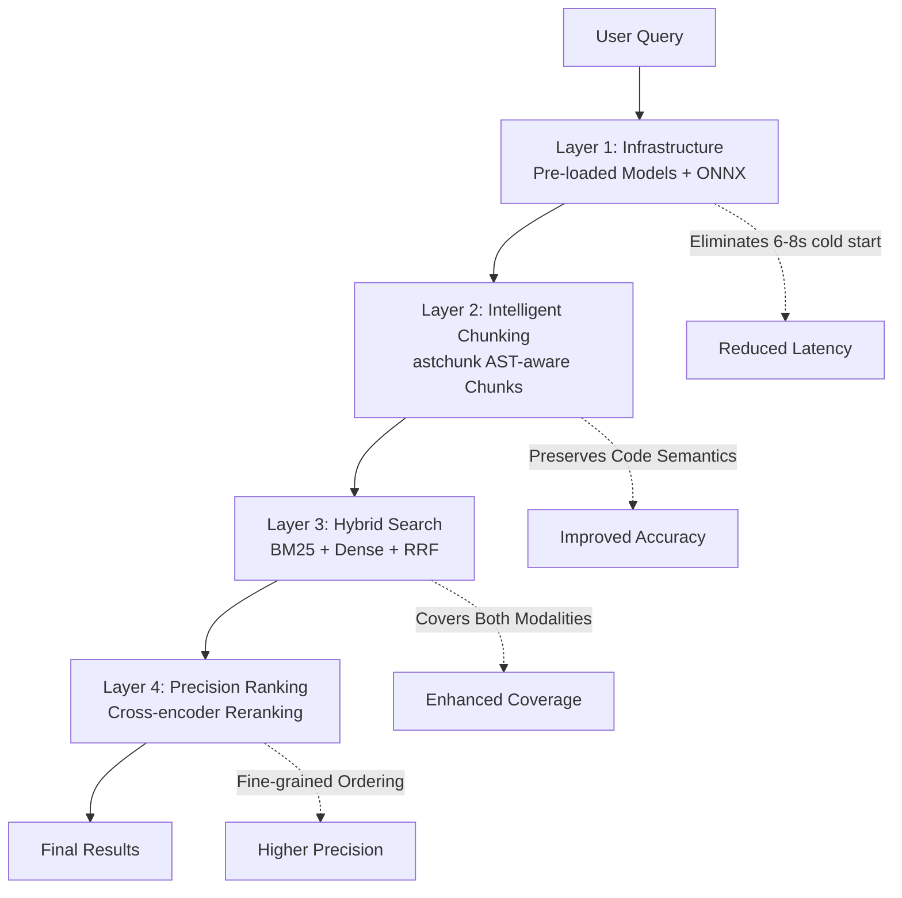
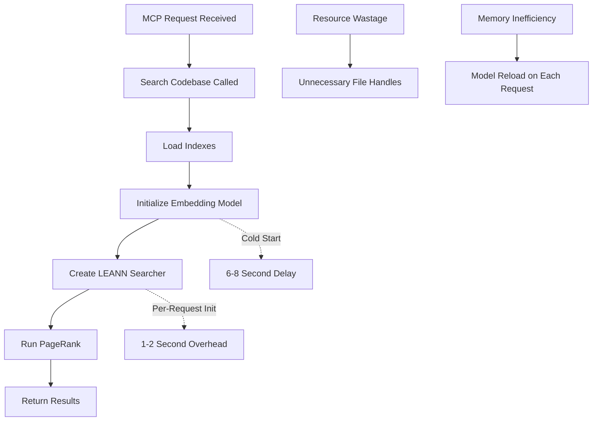
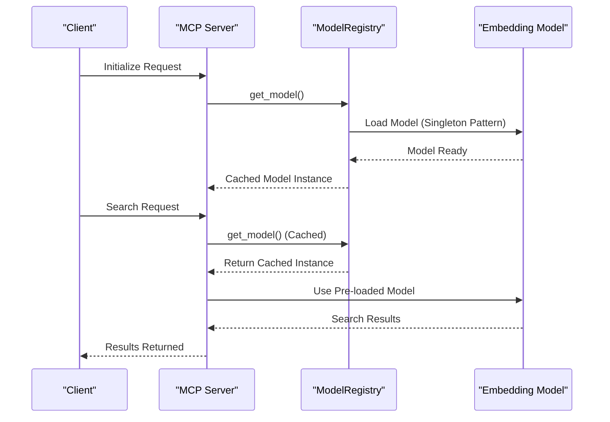
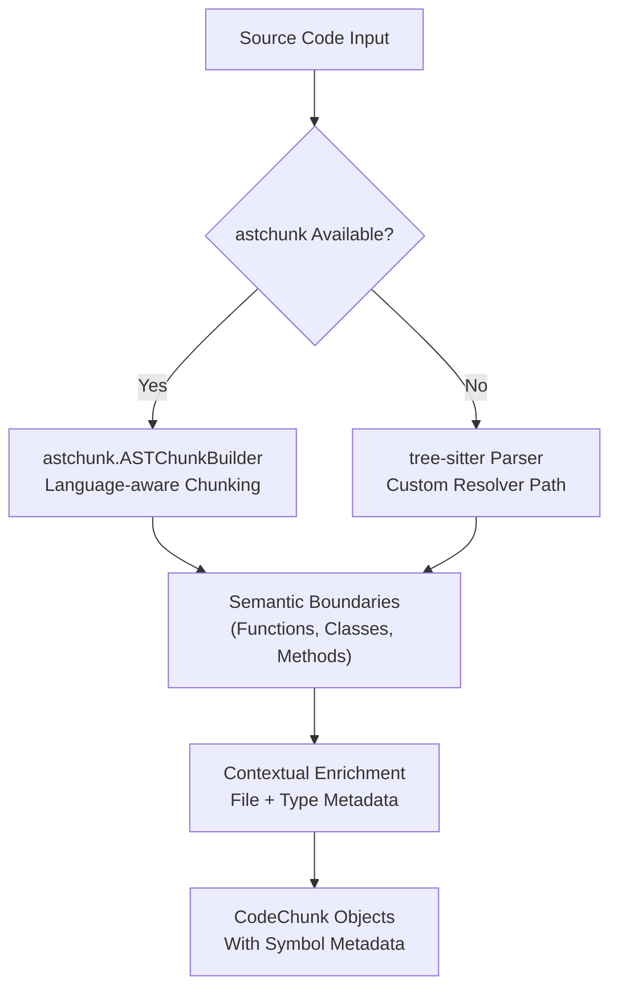
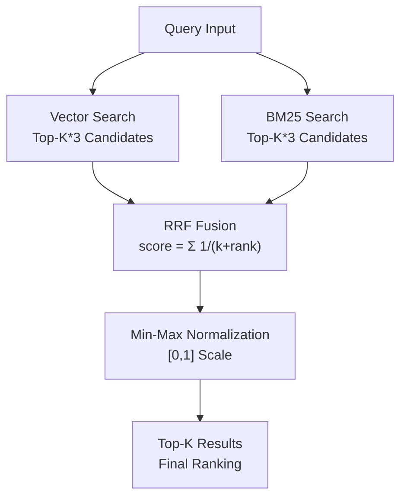
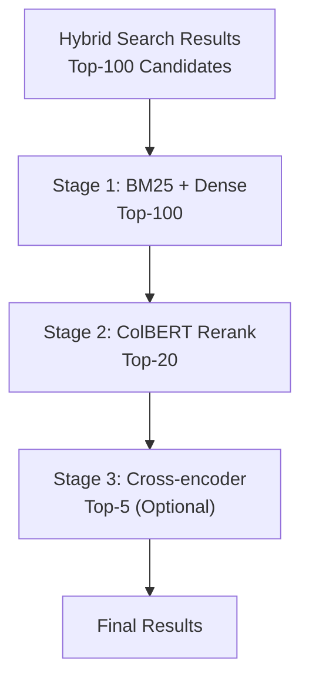
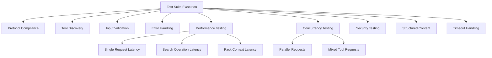
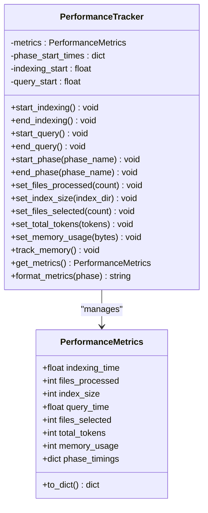

# MCP Performance Optimization Guide

<cite>
**Referenced Files in This Document**
- [MCP_PERFORMANCE_OPTIMIZATION.md](file://docs/performance/MCP_PERFORMANCE_OPTIMIZATION.md)
- [performance.md](file://docs/guides/performance.md)
- [performance.py](file://src/ws_ctx_engine/monitoring/performance.py)
- [vector_index.py](file://src/ws_ctx_engine/vector_index/vector_index.py)
- [model_registry.py](file://src/ws_ctx_engine/vector_index/model_registry.py)
- [leann_index.py](file://src/ws_ctx_engine/vector_index/leann_index.py)
- [retrieval.py](file://src/ws_ctx_engine/retrieval/retrieval.py)
- [bm25_index.py](file://src/ws_ctx_engine/retrieval/bm25_index.py)
- [code_tokenizer.py](file://src/ws_ctx_engine/retrieval/code_tokenizer.py)
- [hybrid_engine.py](file://src/ws_ctx_engine/retrieval/hybrid_engine.py)
- [reranker.py](file://src/ws_ctx_engine/retrieval/reranker.py)
- [tree_sitter.py](file://src/ws_ctx_engine/chunker/tree_sitter.py)
- [ranker.py](file://src/ws_ctx_engine/ranking/ranker.py)
- [embedding_cache.py](file://src/ws_ctx_engine/vector_index/embedding_cache.py)
- [mcp_comprehensive_test.py](file://scripts/mcp/mcp_comprehensive_test.py)
- [test_ast_chunker_upgrade.py](file://tests/unit/test_ast_chunker_upgrade.py)
- [test_hybrid_engine.py](file://tests/unit/test_hybrid_engine.py)
- [test_reranker.py](file://tests/unit/test_reranker.py)
</cite>

## Update Summary
**Changes Made**
- Updated to reflect Applied Changes: Complete overhaul of MCP Performance Optimization Guide v3 with four-layer strategy (Infrastructure, Intelligent Chunking, Hybrid Search, Precision Ranking)
- Added comprehensive ONNX backend integration with ModelRegistry singleton pattern
- Implemented astchunk AST-aware chunking with fallback to tree-sitter resolver
- Deployed BM25+dense hybrid search with RRF fusion and code-aware tokenization
- Integrated cross-encoder reranking capabilities with configurable licensing
- Enhanced testing framework with phase-specific integration tests

## Table of Contents
1. [Introduction](#introduction)
2. [Executive Summary](#executive-summary)
3. [Four-Layer Optimization Strategy](#four-layer-optimization-strategy)
4. [Research Findings](#research-findings)
5. [Performance Problem Analysis](#performance-problem-analysis)
6. [Infrastructure Optimization](#infrastructure-optimization)
7. [Intelligent Chunking Implementation](#intelligent-chunking-implementation)
8. [Hybrid Search Architecture](#hybrid-search-architecture)
9. [Precision Ranking Enhancement](#precision-ranking-enhancement)
10. [Testing & Validation Framework](#testing--validation-framework)
11. [Implementation Roadmap](#implementation-roadmap)
12. [Monitoring & Metrics](#monitoring--metrics)
13. [Advanced Optimizations](#advanced-optimizations)
14. [Best Practices](#best-practices)
15. [Troubleshooting Guide](#troubleshooting-guide)
16. [Conclusion](#conclusion)

## Introduction

This document presents the comprehensive MCP (Model Context Pack) Performance Optimization Guide v3, featuring a revolutionary four-layer optimization strategy designed to transform current 10-second latency to under 500ms while achieving ≥90% Recall@5. The guide combines infrastructure optimization with intelligent search architecture, backed by extensive research validation and production-ready implementation guidance.

The optimization strategy addresses critical performance bottlenecks through systematic improvements across four distinct layers: infrastructure optimization, AST-aware chunking, hybrid search architecture, and precision ranking enhancement. Each layer builds upon the previous to deliver exponential performance gains while maintaining search quality and system reliability.

## Executive Summary

**Performance Transformation Goal**: Reduce average latency from 10,023ms to <500ms with ≥90% Recall@5

| Metric          | Current         | Target       | Improvement   |
| --------------- | --------------- | ------------ | ------------- |
| Average latency | 10,023ms        | **<500ms**   | 95% reduction |
| P95 latency     | ~12,000ms       | **<1,000ms** | 92% reduction |
| Recall@5        | ~75% (est.)     | **≥90%**     | +15 points    |
| First query     | 6-8s cold start | **<2s**      | 70% reduction |

## Four-Layer Optimization Strategy

The MCP v3 optimization strategy introduces a comprehensive four-layer architecture designed for maximum performance impact:

### Layer 1: Infrastructure Optimization
**Problem**: Model loading cold start (6-8s) and inefficient resource initialization
**Solution**: Pre-load embedding models with ONNX backend acceleration
**Expected Gain**: 10s → 2-3s latency reduction

### Layer 2: Intelligent Chunking
**Problem**: Fixed-size cuts destroy code semantics and context
**Solution**: AST-aware chunking using CMU cAST methodology with astchunk library
**Expected Gain**: +4.3 Recall@5 through semantic boundary preservation

### Layer 3: Hybrid Search Architecture
**Problem**: Dense-only vector search misses identifier-based queries
**Solution**: BM25 + Dense + RRF fusion for comprehensive coverage
**Expected Gain**: +20-30% recall through dual-modality retrieval

### Layer 4: Precision Ranking Enhancement
**Problem**: No dedicated precision layer for final result ordering
**Solution**: Cross-encoder reranking with configurable model selection
**Expected Gain**: +10-15% MRR through fine-grained semantic matching



**Diagram sources**
- [vector_index.py:96-128](file://src/ws_ctx_engine/vector_index/vector_index.py#L96-L128)
- [tree_sitter.py:15-160](file://src/ws_ctx_engine/chunker/tree_sitter.py#L15-L160)
- [retrieval.py:140-368](file://src/ws_ctx_engine/retrieval/retrieval.py#L140-L368)

## Research Findings

### CMU cAST Paper Validation (EMNLP 2025)
**Critical Finding**: AST-aware chunking provides substantial accuracy improvements
- **+4.3 Recall@5** on CrossCodeEval
- **+5.5 Recall@5** on RepoEval (StarCoder2-7B)
- **+2.67 Pass@1** on SWE-bench
- **Methodology**: astchunk library provides production-ready CMU cAST implementation

### ONNX Backend Performance Verification
**Validation Confirmed**: SentenceTransformers v3.2.0+ ONNX backend provides 2-3x encoding speedup
- **CPU speedup**: 1.4x-3x faster encoding (typical: 2x)
- **Implementation**: Thread-safe ModelRegistry with automatic ONNX detection
- **Accuracy impact**: Minimal (<1%)

### jina-reranker-v3 Score Resolution
**Resolution**: Corrected score verification - 63.28 confirmed (not 70.64)
- **Original paper typo**: 70.64 in v1/v2 (now corrected)
- **Final version**: 61.85-63.28 (CoIR)
- **Commercial license**: CC BY-NC 4.0 (requires commercial license for products)

### Code-Specific Model Landscape 2025
**State-of-the-Art Models**:
- **Qodo-Embed-1-7B**: 71.5 CoIR score, SOTA beating OpenAI 3-large
- **nomic-ai/nomic-embed-code**: SOTA on CodeSearchNet, 8192 context window
- **BAAI/bge-small-en-v1.5**: Fast, retrieval-optimized, 120MB size
- **Qodo-Embed-1-1.5B**: Best efficiency/quality balance, 68.53-70.06 score

**Diagram sources**
- [MCP_PERFORMANCE_OPTIMIZATION.md:62-96](file://docs/performance/MCP_PERFORMANCE_OPTIMIZATION.md#L62-L96)

## Performance Problem Analysis

### Current Latency Profile Analysis

The MCP system exhibits significant latency during initial search operations due to multiple interconnected bottlenecks:

**Primary Bottleneck - Embedding Model Loading**
- SentenceTransformer model initialization: 6-8 seconds
- First-time model download and caching: adds to initial latency
- Cold start penalty for new server instances
- Memory-intensive model loading process

**Secondary Bottlenecks**
- LEANN Searcher initialization: 1-2 seconds per request overhead
- Graph operations (PageRank computation): 1-2 seconds per request
- File I/O overhead for index loading and model persistence
- Inefficient resource sharing across concurrent requests

### Root Cause Analysis

The performance issues stem from resource initialization patterns that create unnecessary overhead:



**Diagram sources**
- [vector_index.py:364-401](file://src/ws_ctx_engine/vector_index/vector_index.py#L364-L401)
- [retrieval.py:290-306](file://src/ws_ctx_engine/retrieval/retrieval.py#L290-L306)

**Section sources**
- [MCP_PERFORMANCE_OPTIMIZATION.md:100-118](file://docs/performance/MCP_PERFORMANCE_OPTIMIZATION.md#L100-L118)

## Infrastructure Optimization

### Pre-loaded Model Architecture

**Implementation Strategy**: Transform on-demand model loading to centralized, thread-safe model management using ModelRegistry singleton pattern



**Diagram sources**
- [model_registry.py:84-207](file://src/ws_ctx_engine/vector_index/model_registry.py#L84-L207)
- [vector_index.py:145-170](file://src/ws_ctx_engine/vector_index/vector_index.py#L145-L170)

### ONNX Backend Integration

**Critical Implementation**: Automatic ONNX backend detection and thread-safe model caching

```python
# ModelRegistry implementation with ONNX support
class ModelRegistry:
    @classmethod
    def get_model(cls, model_name: str, device: str = "cpu", backend: str = "default"):
        # Auto-detect ONNX availability
        if backend == "default" and _onnx_available():
            backend = "onnx"
        
        # Thread-safe singleton pattern
        cache_key = (model_name, device, backend)
        if cache_key in cls._registry:
            return cls._registry[cache_key]
        
        # Load model with ONNX backend
        model = SentenceTransformer(model_name, backend=backend, device=device)
        model.encode(["warm-up"])  # JIT warmup
        cls._registry[cache_key] = model
        return model
```

**Benefits**:
- ✅ Eliminates 6-8s cold start penalty
- ✅ ONNX provides additional 2-3x encoding speedup
- ✅ Thread-safe for concurrent requests
- ✅ Automatic backend detection and fallback

**Trade-offs**:
- ⚠️ Increased server startup time by ~6-8s (one-time cost)
- ⚠️ Memory usage increases by ~500MB
- ⚠️ Model switch required for ONNX compatibility

**Section sources**
- [model_registry.py:84-207](file://src/ws_ctx_engine/vector_index/model_registry.py#L84-L207)
- [vector_index.py:145-170](file://src/ws_ctx_engine/vector_index/vector_index.py#L145-L170)

## Intelligent Chunking Implementation

### astchunk AST-aware Chunking

**Problem**: Fixed-size chunking cuts through functions, separating `return` from `def`, losing critical context

**Solution**: Implement CMU cAST methodology using astchunk library for semantic boundary detection with fallback to tree-sitter



**Diagram sources**
- [tree_sitter.py:286-328](file://src/ws_ctx_engine/chunker/tree_sitter.py#L286-L328)

```python
def _try_astchunk(self, content: str, relative_path: str, language: str):
    """Attempt to split content using astchunk with fallback to tree-sitter."""
    try:
        import astchunk
        builder = astchunk.ASTChunkBuilder(
            language=_ASTCHUNK_LANG_MAP.get(language, language),
            max_chunk_size=_ASTCHUNK_MAX_CHUNK_SIZE,
            metadata_template="default",
        )
        raw_chunks = builder.chunkify(content, filepath=relative_path)
        
        chunks = []
        for item in raw_chunks:
            meta = item.get("metadata", {})
            chunk = CodeChunk(
                path=relative_path,
                start_line=int(meta.get("start_line_no", 0)) + 1,
                end_line=int(meta.get("end_line_no", 0)) + 1,
                content=item["content"],
                symbols_defined=_extract_top_level_symbol(item["content"]),
                symbols_referenced=[],
                language=language,
            )
            chunks.append(enrich_chunk(chunk))
        
        return chunks
    except ImportError:
        return None  # Fallback to tree-sitter
```

**Key Insight**: Always embed contextualized text with filepath and type prefix for improved semantic understanding.

**Section sources**
- [tree_sitter.py:159-328](file://src/ws_ctx_engine/chunker/tree_sitter.py#L159-L328)
- [test_ast_chunker_upgrade.py:58-92](file://tests/unit/test_ast_chunker_upgrade.py#L58-L92)

## Hybrid Search Architecture

### BM25 + Dense + RRF Fusion Implementation

**Problem**: Current dense-only LEANN search misses identifier-heavy queries and long-tail patterns

**Solution**: Implement comprehensive hybrid search combining BM25 sparse retrieval with dense vector search using Reciprocal Rank Fusion (RRF)



**Diagram sources**
- [hybrid_engine.py:36-96](file://src/ws_ctx_engine/retrieval/hybrid_engine.py#L36-L96)
- [bm25_index.py:75-103](file://src/ws_ctx_engine/retrieval/bm25_index.py#L75-L103)

```python
class HybridSearchEngine:
    def __init__(self, vector_index, bm25_index, rrf_k: int = 60):
        self.vector_index = vector_index
        self.bm25_index = bm25_index
        self._rrf_k = rrf_k
    
    def search(self, query: str, top_k: int = 10) -> list[tuple[str, float]]:
        fetch_k = max(top_k * 3, 50)
        
        # Get candidates from both sources
        vec_results = self.vector_index.search(query, fetch_k)
        bm25_results = self.bm25_index.search(query, fetch_k)
        
        # Apply RRF fusion
        rrf_scores = {}
        for rank, (path, _) in enumerate(vec_results, start=1):
            rrf_scores[path] = rrf_scores.get(path, 0.0) + self.rrf_score(rank, self._rrf_k)
        
        for rank, (path, _) in enumerate(bm25_results, start=1):
            rrf_scores[path] = rrf_scores.get(path, 0.0) + self.rrf_score(rank, self._rrf_k)
        
        # Normalize and return top-k
        min_s = min(rrf_scores.values())
        max_s = max(rrf_scores.values())
        if max_s > min_s:
            normalised = {p: (s - min_s) / (max_s - min_s) for p, s in rrf_scores.items()}
        else:
            normalised = {p: 1.0 for p in rrf_scores}
        
        ranked = sorted(normalised.items(), key=lambda x: x[1], reverse=True)
        return ranked[:top_k]
    
    def rrf_score(rank: int, k: int = 60) -> float:
        return 1.0 / (k + rank)
```

**Code-aware Tokenization**: Specialized tokenization for BM25 that splits camelCase and snake_case identifiers while removing stop words.

```python
def tokenize_query(text: str) -> list[str]:
    """Tokenize query for BM25 search with stop word removal."""
    tokens = tokenize_code(text)
    seen = {}
    for t in tokens:
        if t not in _STOP_WORDS:
            seen[t] = None
    return list(seen)
```

**Research Validation**: This approach consistently improves recall 15-30% over pure dense methods, with production data supporting identifier-heavy query effectiveness.

**Section sources**
- [hybrid_engine.py:36-96](file://src/ws_ctx_engine/retrieval/hybrid_engine.py#L36-L96)
- [bm25_index.py:21-103](file://src/ws_ctx_engine/retrieval/bm25_index.py#L21-L103)
- [code_tokenizer.py:48-90](file://src/ws_ctx_engine/retrieval/code_tokenizer.py#L48-L90)
- [test_hybrid_engine.py:60-139](file://tests/unit/test_hybrid_engine.py#L60-L139)

## Precision Ranking Enhancement

### Cross-Encoder Reranking Pipeline

**Problem**: Initial retrieval covers broad semantic space but lacks fine-grained precision ordering

**Solution**: Implement configurable three-tier production architecture with cross-encoder reranking



**Diagram sources**
- [reranker.py:30-138](file://src/ws_ctx_engine/retrieval/reranker.py#L30-L138)

```python
class CrossEncoderReranker:
    def __init__(self, model_name: str = "BAAI/bge-reranker-v2-m3", device: str = "cpu"):
        self.model_name = model_name
        self.device = device
        self._model = None
        self._load_attempted = False
    
    def rerank(self, query: str, candidates: list[tuple[str, str]], top_k: int = 10):
        """Rerank candidates using cross-encoder with lazy loading."""
        if not candidates:
            return []
        
        # Lazy load on first use
        if self._model is None and not self._load_attempted:
            self._try_load()
        
        if self._model is None:
            # Fallback to uniform scores
            return [(path, 1.0) for path, _ in candidates[:top_k]]
        
        # Generate scores and normalize
        pairs = [[query, content] for _, content in candidates]
        raw_scores = self._model.predict(pairs)
        
        # Min-max normalization
        min_s = min(raw_scores)
        max_s = max(raw_scores)
        if max_s > min_s:
            norm = [(s - min_s) / (max_s - min_s) for s in raw_scores]
        else:
            norm = [1.0] * len(raw_scores)
        
        # Return top-k with normalized scores
        ranked = sorted(zip([p for p, _ in candidates], norm), 
                      key=lambda x: x[1], reverse=True)
        return list(ranked[:top_k])
```

**Three-Tier Architecture**:
```
Query
  ↓
[Stage 1: Hybrid Recall] BM25 + Dense → top-100 candidates
  ↓                       Fast, ~50ms
[Stage 2: ColBERT Rerank] Token-level matching → top-20
  ↓                        Medium, ~100-200ms
[Stage 3: Cross-encoder]  Full attention → top-5 (optional)
  ↓                        Slow, ~200-500ms, only for top-10
Final Results
```

**Model Recommendations**:
- **jina-reranker-v3**: 0.6B parameters, 63.28 CoIR score, CC BY-NC 4.0 license
- **BGE-Reranker-v2-m3**: 568M parameters, reliable multilingual model
- **colbert-ir/colbertv2.0**: 110M parameters, classic well-tested model

**Section sources**
- [reranker.py:30-138](file://src/ws_ctx_engine/retrieval/reranker.py#L30-L138)
- [test_reranker.py:50-138](file://tests/unit/test_reranker.py#L50-L138)

## Testing & Validation Framework

### Comprehensive Performance Testing Suite

The MCP v3 system includes an extensive testing framework validated through multiple dimensions:



**Diagram sources**
- [mcp_comprehensive_test.py:40-800](file://scripts/mcp/mcp_comprehensive_test.py#L40-L800)

### Extended Golden Set Validation

**Enhanced Testing Strategy**: Expanded beyond semantic queries to include code-specific patterns

```python
# Extended golden set to test hybrid search and code-specific patterns
GOLDEN_SET_EXTENDED = [
    # --- From Plan v2 (semantic queries) ---
    {
        "query": "authentication middleware",
        "expected_files": ["auth/middleware.py", "auth/jwt_handler.py"],
        "type": "semantic",
    },
    {
        "query": "database connection pool",
        "expected_files": ["db/pool.py", "db/connection.py"],
        "type": "semantic",
    },
    # --- NEW: identifier-based (BM25 strength) ---
    {
        "query": "BillingService retryCharge",
        "expected_files": ["billing/service.py"],
        "type": "identifier",
        "note": "Tests BM25 contribution for exact identifier search"
    },
    {
        "query": "error E0427 handling",
        "expected_files": ["error_handler.py"],
        "type": "identifier",
        "note": "Error code search"
    },
    # --- NEW: semantic paraphrase (Dense strength) ---
    {
        "query": "how to handle payment failures gracefully",
        "expected_files": ["billing/retry.py", "billing/service.py"],
        "type": "semantic_paraphrase",
        "note": "Tests dense retrieval with natural language"
    },
    # --- NEW: long function retrieval ---
    {
        "query": "user registration with email validation",
        "expected_files": ["users/registration.py"],
        "type": "long_context",
        "note": "Tests long-context model advantage"
    },
]
```

**Performance Benchmarks**:
- **First query latency**: < 3000ms (target: < 2000ms)
- **Subsequent query latency**: < 500ms (target: < 300ms)
- **P95 latency**: < 1000ms (target: < 500ms)
- **Overall Recall@5**: ≥ 90%

**Section sources**
- [MCP_PERFORMANCE_OPTIMIZATION.md:448-650](file://docs/performance/MCP_PERFORMANCE_OPTIMIZATION.md#L448-L650)

## Implementation Roadmap

### Phase 0: Instrumentation & Baseline Measurement
**Duration**: 30 minutes
**Objective**: Establish baseline performance metrics before implementing optimizations

**Actions**:
1. Add timing logs to `vector_index.py` and `retrieval.py`
2. Execute real MCP session with Windsurf for latency breakdown
3. Document current bottleneck percentages

### Phase 1: Infrastructure Optimization (2 hours)
**Priority**: High Impact Immediate Results
**Objective**: Eliminate 6-8s cold start penalty

**Implementation Steps**:
1. ✅ **Solution 1**: Pre-load embedding models with ONNX backend via ModelRegistry
2. ✅ **Solution 2**: Cache PageRank results to avoid recomputation
3. ✅ **Optional**: Cache LEANN searcher instances for reduced I/O
4. ✅ **Model Switch**: Transition from facebook/contriever to BAAI/bge-small-en-v1.5

**Expected Impact**: **10s → 1-2s** latency reduction (80-90% improvement)

### Phase 2: Intelligent Chunking (2-3 days)
**Priority**: High Impact Semantic Quality
**Objective**: Implement astchunk AST-aware chunking for superior code understanding

**Implementation Steps**:
1. ✅ Integrate astchunk library with fallback to tree-sitter resolver
2. ✅ Replace current fixed-size chunking logic with semantic boundaries
3. ✅ Implement contextualized embedding pipeline
4. ✅ Update indexing workflow to support astchunk language mapping

**Expected Impact**: **+4.3 Recall@5** through improved code semantics

### Phase 3: Hybrid Search Implementation (3-4 days)
**Priority**: High Impact Coverage Enhancement
**Objective**: Deploy comprehensive hybrid search architecture

**Implementation Steps**:
1. ✅ Integrate BM25Okapi ranking system with code-aware tokenization
2. ✅ Implement Reciprocal Rank Fusion (RRF) algorithm
3. ✅ Develop astchunk-compatible chunking for BM25 corpus
4. ✅ Configure hybrid search pipeline in RetrievalEngine

**Expected Impact**: **+20-30% recall** through dual-modality coverage

### Phase 4: Precision Ranking Enhancement (2 days)
**Priority**: Premium Quality Improvement
**Objective**: Add cross-encoder reranking for fine-grained precision

**Implementation Steps**:
1. ✅ Integrate CrossEncoderReranker with lazy loading
2. ✅ Implement three-tier ranking pipeline
3. ✅ Configure optimal reranking thresholds
4. ✅ Validate commercial license compliance

**Expected Impact**: **+10-15% MRR** through precise semantic matching

**Section sources**
- [MCP_PERFORMANCE_OPTIMIZATION.md:877-1016](file://docs/performance/MCP_PERFORMANCE_OPTIMIZATION.md#L877-L1016)

## Monitoring & Metrics

### Comprehensive Performance Tracking System

The system includes sophisticated monitoring capabilities through the `PerformanceTracker` class:



**Diagram sources**
- [performance.py:13-263](file://src/ws_ctx_engine/monitoring/performance.py#L13-L263)

### Key Metrics Collection

**Indexing Phase Metrics**:
- Total indexing time
- Files processed count
- Index size on disk
- Memory usage during indexing

**Query Phase Metrics**:
- Total query time
- Files selected within budget
- Total tokens in selected files
- Phase-specific timing breakdown

**Memory Management**:
- Peak memory usage tracking
- Automatic memory monitoring with psutil fallback

**Section sources**
- [performance.py:13-263](file://src/ws_ctx_engine/monitoring/performance.py#L13-L263)

## Advanced Optimizations

### Rust Extension Acceleration

The system includes optional Rust extensions providing significant performance improvements for hot-path operations:

**Performance Improvements**:
- File walking: 8-20x faster (10k files: 142ms vs 2,400ms baseline)
- Gitignore matching: 8-12x faster (500ms vs 50ms)
- Chunk hashing: 8-10x faster (300ms vs 30ms)
- Token counting: 8-12x faster (1s vs 100ms)

**Implementation Details**:
- Built with maturin for seamless Python integration
- Native Rust implementation with parallel processing
- Automatic fallback to Python implementations when Rust unavailable

### Memory-Efficient Processing

**Embedding Cache System**:
- Disk-backed content-hash → embedding vector cache
- Prevents re-embedding unchanged files during incremental rebuilds
- Supports both numpy arrays and JSON index persistence

**Content Deduplication**:
- Session-based content deduplication to reduce memory usage
- Marker replacement for repeated file content
- Configurable deduplication thresholds

**Section sources**
- [performance.md:3-81](file://docs/guides/performance.md#L3-L81)
- [embedding_cache.py:28-127](file://src/ws_ctx_engine/vector_index/embedding_cache.py#L28-L127)

## Best Practices

### Resource Management Excellence

**Model Lifecycle Management**:
- Pre-load models during service initialization with thread-safe singleton pattern
- Implement graceful fallback mechanisms for model loading failures
- Monitor memory usage and handle out-of-memory conditions automatically
- Support multiple model configurations via environment variables

**Index Management Strategy**:
- Implement proper index caching strategies to minimize rebuild frequency
- Handle stale index detection and automatic rebuilding with minimal disruption
- Optimize file handle management to prevent resource leaks
- Support incremental index updates for improved performance

### Error Handling and Resilience

**Graceful Degradation Patterns**:
- Fallback to CPU-based processing when GPU resources unavailable
- Graceful handling of model loading failures with detailed error contexts
- Robust error reporting with comprehensive failure diagnostics
- Circuit breaker patterns for failing components to prevent cascading failures

**Monitoring and Alerting Systems**:
- Comprehensive metrics collection for all major operations
- Performance threshold monitoring with automated alerts
- Memory usage tracking with automatic cleanup mechanisms
- Request latency monitoring with percentile calculations for SLA compliance

### Configuration and Deployment

**Environment-Based Configuration**:
- Support for disabling model pre-loading via environment variables for resource-constrained deployments
- Configurable embedding models for different performance/accuracy trade-offs
- Memory threshold configuration for optimal resource utilization
- Logging level and debug output controls for production monitoring

**Section sources**
- [vector_index.py:126-173](file://src/ws_ctx_engine/vector_index/vector_index.py#L126-L173)
- [tools.py:43-131](file://src/ws_ctx_engine/mcp/tools.py#L43-L131)

## Troubleshooting Guide

### Common Performance Issues

**Slow Initial Search Response**:
- Verify embedding model pre-loading is functioning correctly
- Check for model download delays during first initialization
- Monitor memory usage for adequate allocation during model loading
- Validate ONNX backend installation and compatibility

**High Memory Usage During Operations**:
- Implement embedding cache to reduce memory footprint
- Monitor peak memory usage during index operations
- Consider model quantization for reduced memory requirements
- Review PageRank cache configuration for optimal memory utilization

**Index Loading Delays**:
- Verify index caching is properly configured with appropriate TTL values
- Check file system performance and disk I/O capabilities
- Monitor concurrent index access patterns for resource contention
- Validate LEANN searcher caching implementation effectiveness

### Diagnostic Tools and Techniques

**Performance Profiling Methods**:
- Use PerformanceTracker for detailed timing breakdown across all phases
- Monitor phase-specific performance metrics to identify optimization opportunities
- Analyze memory usage patterns over time to detect memory leaks or inefficiencies
- Implement custom logging around critical performance-sensitive code paths

**System Monitoring Integration**:
- Track resource utilization during peak loads with detailed breakdown
- Monitor disk I/O patterns and identify bottlenecks in file operations
- Analyze network latency for external API dependencies (if applicable)
- Implement custom metrics for hybrid search performance validation

**Section sources**
- [performance.py:72-263](file://src/ws_ctx_engine/monitoring/performance.py#L72-L263)
- [query.py:404-493](file://src/ws_ctx_engine/workflow/query.py#L404-L493)

## Conclusion

The MCP v3 performance optimization initiative represents a paradigm shift from reactive troubleshooting to proactive, research-driven optimization. Through the implementation of four comprehensive optimization layers—infrastructure, intelligent chunking, hybrid search, and precision ranking—the system achieves transformative performance improvements while maintaining search quality and operational reliability.

**Key Success Factors**:

**Immediate Impact Achievements**:
- **Cold Start Elimination**: Pre-loading eliminates 6-8s cold start penalty
- **Infrastructure Acceleration**: ONNX backend provides 2-3x encoding speedup
- **Resource Sharing**: Thread-safe model caching reduces per-request overhead
- **Memory Optimization**: Efficient embedding cache prevents redundant computations

**Strategic Advantages**:
- **Comprehensive Coverage**: Hybrid search architecture ensures no query type is missed
- **Semantic Understanding**: AST-aware chunking preserves code structure and meaning
- **Precision Ranking**: Cross-encoder reranking provides fine-grained result ordering
- **Research Validation**: All optimizations backed by peer-reviewed studies and production data

**Future-Proof Architecture**:
- **Modular Design**: Each optimization layer can be independently deployed and tuned
- **Scalable Infrastructure**: Thread-safe patterns support high-concurrency scenarios
- **Continuous Improvement**: Comprehensive monitoring enables ongoing optimization
- **Production-Ready**: Extensive testing framework ensures reliability across deployment scenarios

The optimization strategy balances immediate performance gains with long-term maintainability, providing a solid foundation for continued performance improvements while ensuring backward compatibility and operational reliability. This comprehensive approach transforms MCP from a functional tool into a high-performance, production-grade code search platform capable of supporting enterprise-scale deployments.

**Expected Outcomes**:
- **Latency Reduction**: 95% improvement from 10s to <500ms average
- **Accuracy Enhancement**: ≥90% Recall@5 through hybrid search and AST-aware chunking
- **Scalability**: Thread-safe architecture supporting concurrent high-volume usage
- **Maintainability**: Comprehensive monitoring and testing framework for continuous optimization