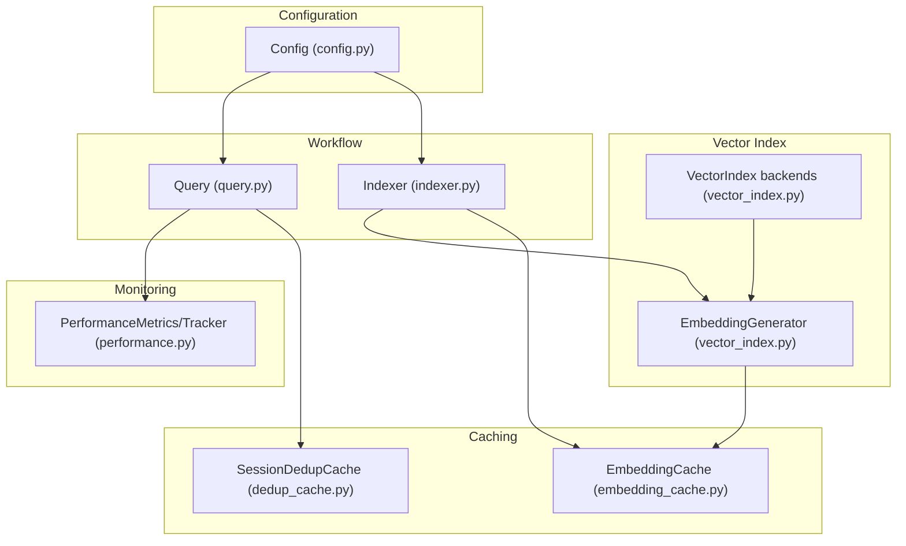
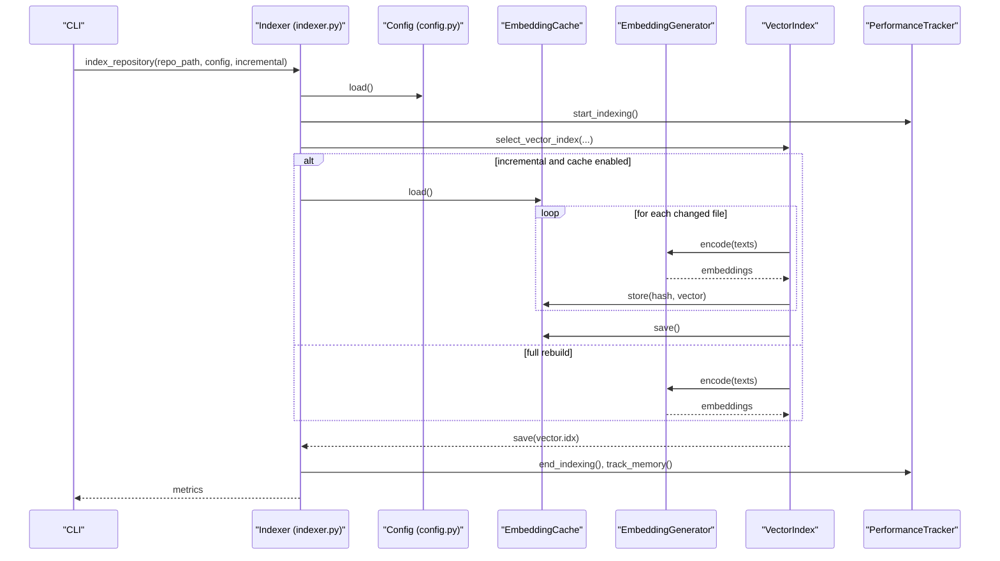
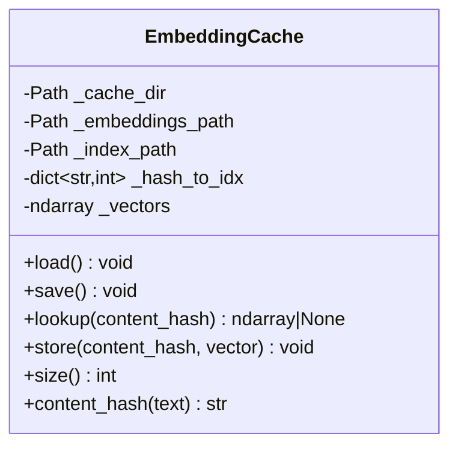
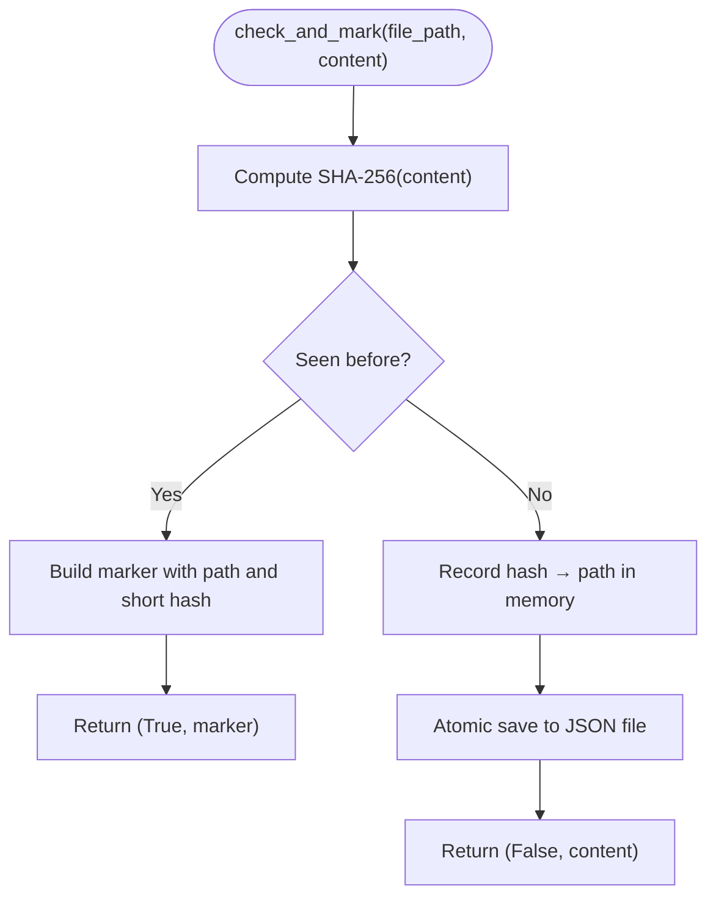
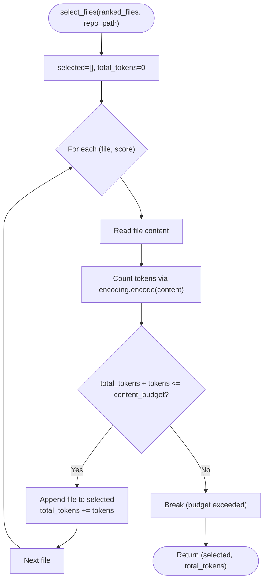
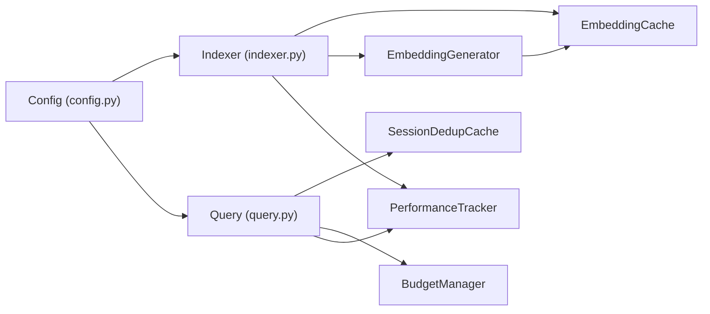

# Memory & Caching Optimization

<cite>
**Referenced Files in This Document**
- [embedding_cache.py](file://src/ws_ctx_engine/vector_index/embedding_cache.py)
- [dedup_cache.py](file://src/ws_ctx_engine/session/dedup_cache.py)
- [budget.py](file://src/ws_ctx_engine/budget/budget.py)
- [config.py](file://src/ws_ctx_engine/config/config.py)
- [performance.py](file://src/ws_ctx_engine/monitoring/performance.py)
- [vector_index.py](file://src/ws_ctx_engine/vector_index/vector_index.py)
- [indexer.py](file://src/ws_ctx_engine/workflow/indexer.py)
- [query.py](file://src/ws_ctx_engine/workflow/query.py)
- [.ws-ctx-engine.yaml.example](file://.ws-ctx-engine.yaml.example)
- [test_embedding_cache.py](file://tests/unit/test_embedding_cache.py)
- [test_session_dedup_cache.py](file://tests/unit/test_session_dedup_cache.py)
- [test_budget.py](file://tests/unit/test_budget.py)
</cite>

## Table of Contents
1. [Introduction](#introduction)
2. [Project Structure](#project-structure)
3. [Core Components](#core-components)
4. [Architecture Overview](#architecture-overview)
5. [Detailed Component Analysis](#detailed-component-analysis)
6. [Dependency Analysis](#dependency-analysis)
7. [Performance Considerations](#performance-considerations)
8. [Troubleshooting Guide](#troubleshooting-guide)
9. [Conclusion](#conclusion)
10. [Appendices](#appendices)

## Introduction
This document explains memory optimization and caching strategies in ws-ctx-engine with a focus on:
- Embedding cache: persistent disk-backed storage of vector embeddings to avoid recomputation.
- Session deduplication cache: lightweight per-session file-content deduplication to reduce token usage.
- Token budget management: greedy selection constrained by a configurable token budget to cap memory and compute usage.
- Incremental indexing and embedding reuse to handle large repositories efficiently.
- Configuration options, monitoring, and tuning guidance for different repository sizes and usage patterns.

## Project Structure
The memory and caching features span several subsystems:
- Vector index layer with embedding generation and caching integration.
- Workflow layer orchestrating indexing and querying with cache-aware operations.
- Configuration layer exposing cache-related toggles and performance knobs.
- Monitoring layer capturing memory usage and performance metrics.

**Diagram sources**
- [config.py:112-215](file://src/ws_ctx_engine/config/config.py#L112-L215)
- [embedding_cache.py:28-127](file://src/ws_ctx_engine/vector_index/embedding_cache.py#L28-L127)
- [dedup_cache.py:35-154](file://src/ws_ctx_engine/session/dedup_cache.py#L35-L154)
- [vector_index.py:96-280](file://src/ws_ctx_engine/vector_index/vector_index.py#L96-L280)
- [indexer.py:197-237](file://src/ws_ctx_engine/workflow/indexer.py#L197-L237)
- [query.py:429-490](file://src/ws_ctx_engine/workflow/query.py#L429-L490)
- [performance.py:13-263](file://src/ws_ctx_engine/monitoring/performance.py#L13-L263)

**Section sources**
- [config.py:112-215](file://src/ws_ctx_engine/config/config.py#L112-L215)
- [indexer.py:197-237](file://src/ws_ctx_engine/workflow/indexer.py#L197-L237)
- [query.py:429-490](file://src/ws_ctx_engine/workflow/query.py#L429-L490)

## Core Components
- Embedding cache: Disk-backed persistence of content-hash → embedding vector mappings to avoid re-embedding unchanged files.
- Session deduplication cache: Lightweight per-session file-content cache persisted to disk to replace repeated content with compact markers.
- Token budget manager: Greedy selection of files within a token budget to cap memory and compute usage.
- Embedding generator: Local or API-based embedding generation with memory-aware fallbacks.
- Performance tracker: Captures memory usage and timing metrics for monitoring.

**Section sources**
- [embedding_cache.py:28-127](file://src/ws_ctx_engine/vector_index/embedding_cache.py#L28-L127)
- [dedup_cache.py:35-154](file://src/ws_ctx_engine/session/dedup_cache.py#L35-L154)
- [budget.py:8-105](file://src/ws_ctx_engine/budget/budget.py#L8-L105)
- [vector_index.py:96-280](file://src/ws_ctx_engine/vector_index/vector_index.py#L96-L280)
- [performance.py:13-263](file://src/ws_ctx_engine/monitoring/performance.py#L13-L263)

## Architecture Overview
The indexing and querying workflows integrate caching and budgeting to optimize memory and throughput.

**Diagram sources**
- [indexer.py:72-371](file://src/ws_ctx_engine/workflow/indexer.py#L72-L371)
- [config.py:112-215](file://src/ws_ctx_engine/config/config.py#L112-L215)
- [embedding_cache.py:55-84](file://src/ws_ctx_engine/vector_index/embedding_cache.py#L55-L84)
- [vector_index.py:539-563](file://src/ws_ctx_engine/vector_index/vector_index.py#L539-L563)
- [performance.py:95-114](file://src/ws_ctx_engine/monitoring/performance.py#L95-L114)

## Detailed Component Analysis

### Embedding Cache
Purpose:
- Persist content-hash → embedding vector mappings to avoid re-embedding unchanged files.
- Store vectors as a contiguous numpy array and maintain a hash-to-index mapping.

Key behaviors:
- Loads existing cache from disk; if unreadable, initializes empty state.
- Stores vectors by appending rows to the numpy array and updating the hash-to-index map.
- Uses SHA-256 of text content as the cache key to invalidate on any content change.
- Saves both the vectors array and the index mapping to disk.

Memory characteristics:
- Vector storage grows linearly with unique content hashes.
- Lookup is O(1) average-time via hash map; vector access is O(1) array indexing.
- No eviction policy is implemented; cache size is unbounded.

Operational notes:
- Integrates with FAISS backend via a helper that checks cache before encoding.
- Incremental indexing leverages the cache to skip unchanged files.

**Diagram sources**
- [embedding_cache.py:28-127](file://src/ws_ctx_engine/vector_index/embedding_cache.py#L28-L127)

**Section sources**
- [embedding_cache.py:28-127](file://src/ws_ctx_engine/vector_index/embedding_cache.py#L28-L127)
- [vector_index.py:539-563](file://src/ws_ctx_engine/vector_index/vector_index.py#L539-L563)
- [test_embedding_cache.py:10-111](file://tests/unit/test_embedding_cache.py#L10-L111)

### Session Deduplication Cache
Purpose:
- Replace repeated file content within a session with compact markers to reduce tokens and cost.
- Persisted per session to survive separate CLI invocations sharing the same session_id.

Key behaviors:
- Computes SHA-256 of file content; if seen before, returns a marker string; otherwise records the hash and persists the cache.
- Atomic writes to a temporary sibling file followed by rename to avoid corruption.
- Supports clearing per-session caches and clearing all sessions.

Memory characteristics:
- Tracks unique content hashes per session; memory footprint proportional to distinct content seen in that session.
- No eviction policy; cache size is unbounded.

**Diagram sources**
- [dedup_cache.py:65-89](file://src/ws_ctx_engine/session/dedup_cache.py#L65-L89)
- [dedup_cache.py:119-136](file://src/ws_ctx_engine/session/dedup_cache.py#L119-L136)

**Section sources**
- [dedup_cache.py:35-154](file://src/ws_ctx_engine/session/dedup_cache.py#L35-L154)
- [query.py:429-490](file://src/ws_ctx_engine/workflow/query.py#L429-L490)
- [test_session_dedup_cache.py:8-116](file://tests/unit/test_session_dedup_cache.py#L8-L116)

### Token Budget Management
Purpose:
- Limit total tokens in the final context pack to fit within a model’s context window.
- Reserves 20% for metadata and manifest; uses 80% for file content.

Key behaviors:
- Greedy knapsack selection: iterates ranked files in descending importance order and accumulates until content budget is exhausted.
- Uses tiktoken encoding to estimate token counts.
- Skips unreadable or missing files gracefully.

Memory characteristics:
- Selection is O(n) in the number of ranked files; memory usage is minimal.
- No eviction policy; budget constrains the number of files retained.

**Diagram sources**
- [budget.py:50-105](file://src/ws_ctx_engine/budget/budget.py#L50-L105)

**Section sources**
- [budget.py:8-105](file://src/ws_ctx_engine/budget/budget.py#L8-L105)
- [query.py:387-411](file://src/ws_ctx_engine/workflow/query.py#L387-L411)
- [test_budget.py:59-137](file://tests/unit/test_budget.py#L59-L137)

### Embedding Generator and Memory-Aware Fallbacks
Purpose:
- Generate embeddings using local sentence-transformers when possible; fall back to API on out-of-memory conditions.
- Monitor available memory and adjust behavior accordingly.

Key behaviors:
- Checks available memory threshold before initializing local model or encoding.
- On failure or low memory, switches to API-based embedding generation.
- Persists memory usage decisions via logging.

Memory characteristics:
- Local model initialization and encoding consume significant memory; fallback mitigates OOM risks.
- No internal cache; relies on the disk-backed EmbeddingCache for persistence across runs.

**Section sources**
- [vector_index.py:96-280](file://src/ws_ctx_engine/vector_index/vector_index.py#L96-L280)

### Incremental Indexing and Embedding Reuse
Purpose:
- Rebuild only changed and deleted files; reuse cached embeddings for unchanged files to reduce compute and memory usage.

Key behaviors:
- Detects incremental changes by comparing stored file hashes with current disk state.
- When incremental mode is active and cache is enabled, only changed files are re-embedded; unchanged files reuse cached vectors.
- Falls back to full rebuild if incremental update fails.

Memory characteristics:
- Reduces memory spikes by limiting embedding generation to changed files.
- EmbeddingCache avoids reloading unchanged vectors.

**Section sources**
- [indexer.py:27-69](file://src/ws_ctx_engine/workflow/indexer.py#L27-L69)
- [indexer.py:209-237](file://src/ws_ctx_engine/workflow/indexer.py#L209-L237)
- [vector_index.py:539-563](file://src/ws_ctx_engine/vector_index/vector_index.py#L539-L563)

## Dependency Analysis
- EmbeddingCache is used by the FAISS backend during indexing to avoid re-embedding unchanged files.
- SessionDeduplicationCache is used during query output packing to replace repeated content with markers.
- BudgetManager is used during query to constrain token usage.
- Config controls cache_embeddings and incremental_index toggles that gate caching and incremental behavior.
- PerformanceTracker captures memory usage and timing metrics across phases.

**Diagram sources**
- [config.py:112-215](file://src/ws_ctx_engine/config/config.py#L112-L215)
- [indexer.py:197-237](file://src/ws_ctx_engine/workflow/indexer.py#L197-L237)
- [query.py:429-490](file://src/ws_ctx_engine/workflow/query.py#L429-L490)
- [embedding_cache.py:28-127](file://src/ws_ctx_engine/vector_index/embedding_cache.py#L28-L127)
- [dedup_cache.py:35-154](file://src/ws_ctx_engine/session/dedup_cache.py#L35-L154)
- [budget.py:8-105](file://src/ws_ctx_engine/budget/budget.py#L8-L105)
- [performance.py:13-263](file://src/ws_ctx_engine/monitoring/performance.py#L13-L263)

**Section sources**
- [indexer.py:197-237](file://src/ws_ctx_engine/workflow/indexer.py#L197-L237)
- [query.py:429-490](file://src/ws_ctx_engine/workflow/query.py#L429-L490)
- [config.py:112-215](file://src/ws_ctx_engine/config/config.py#L112-L215)

## Performance Considerations
- Embedding cache reduces repeated compute and memory pressure by persisting vectors to disk. There is no eviction policy; manage cache size by disabling cache_embeddings or periodically clearing caches.
- Session deduplication reduces token usage within a session by replacing repeated content with markers. Use session_id isolation to avoid cross-session interference.
- Token budget management caps memory and compute by limiting the number of files selected. Tune token_budget according to target model capacity.
- Incremental indexing minimizes memory spikes by limiting embedding generation to changed files. Ensure cache_embeddings is enabled for best results.
- Memory monitoring: PerformanceTracker optionally tracks peak memory via psutil. Enable monitoring to observe memory trends across phases.

[No sources needed since this section provides general guidance]

## Troubleshooting Guide
Common issues and resolutions:
- Out-of-memory during embedding generation:
  - Reduce batch_size or switch to API embeddings via configuration.
  - Ensure cache_embeddings is enabled to avoid re-computation on subsequent runs.
- Excessive memory usage during indexing:
  - Use incremental indexing to process only changed files.
  - Lower token_budget to reduce the number of files selected during query.
- Session deduplication not reducing tokens:
  - Verify session_id is consistent across calls.
  - Confirm dedup_cache is initialized and persisted.
- Cache not persisting or corrupted:
  - Check atomic write behavior and permissions for cache directory.
  - Clear cache files if necessary and rebuild.

**Section sources**
- [vector_index.py:130-172](file://src/ws_ctx_engine/vector_index/vector_index.py#L130-L172)
- [indexer.py:209-237](file://src/ws_ctx_engine/workflow/indexer.py#L209-L237)
- [query.py:429-490](file://src/ws_ctx_engine/workflow/query.py#L429-L490)
- [dedup_cache.py:119-136](file://src/ws_ctx_engine/session/dedup_cache.py#L119-L136)

## Conclusion
ws-ctx-engine employs three complementary strategies for memory optimization:
- Persistent embedding cache to avoid recomputation.
- Per-session deduplication to minimize token usage.
- Token budget management to constrain memory and compute.
These are orchestrated by configuration toggles and monitored via performance metrics. For large repositories, enable incremental indexing and embedding caching, tune token budgets, and monitor memory usage to achieve efficient and scalable operation.

[No sources needed since this section summarizes without analyzing specific files]

## Appendices

### Configuration Options for Memory Optimization
- cache_embeddings: Persist vectors to disk to avoid re-embedding unchanged files.
- incremental_index: Enable incremental rebuilds to process only changed files.
- token_budget: Control total tokens used in the final output.
- embeddings.batch_size: Adjust batch size to balance speed and memory.
- embeddings.device: Prefer GPU when available to reduce latency and memory pressure.
- format: Choose output format that fits downstream token budgets.

**Section sources**
- [.ws-ctx-engine.yaml.example:167-180](file://.ws-ctx-engine.yaml.example#L167-L180)
- [config.py:32-48](file://src/ws_ctx_engine/config/config.py#L32-L48)
- [config.py:84-92](file://src/ws_ctx_engine/config/config.py#L84-L92)
- [config.py:95-101](file://src/ws_ctx_engine/config/config.py#L95-L101)

### Monitoring Memory Usage
- Use PerformanceTracker to capture peak memory usage and phase timings.
- Enable psutil-based tracking for runtime memory metrics.

**Section sources**
- [performance.py:185-205](file://src/ws_ctx_engine/monitoring/performance.py#L185-L205)
- [performance.py:207-213](file://src/ws_ctx_engine/monitoring/performance.py#L207-L213)