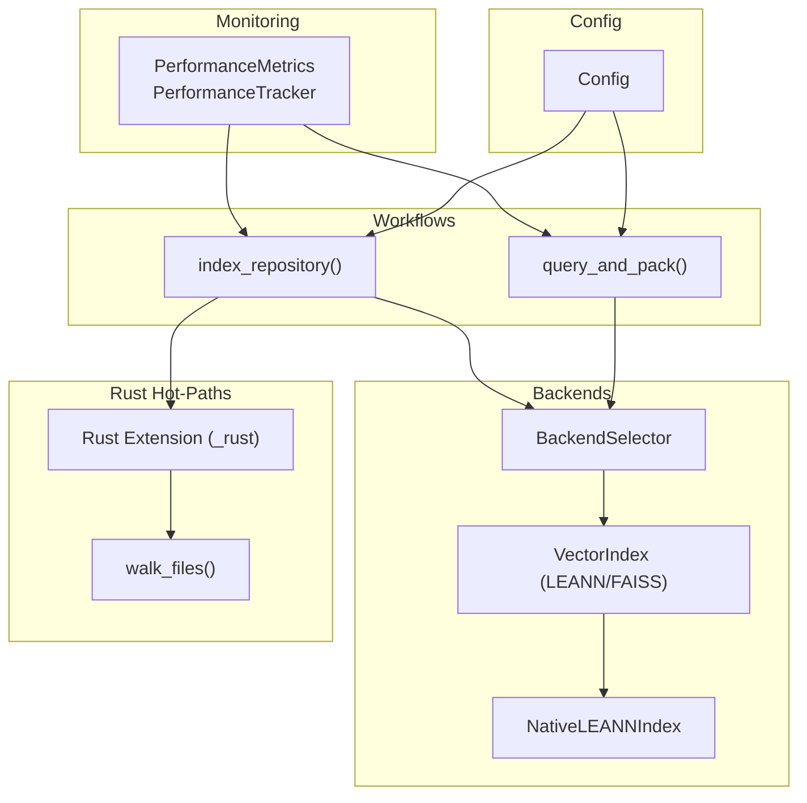
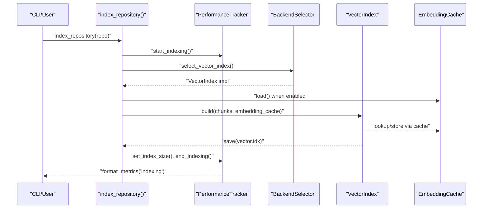
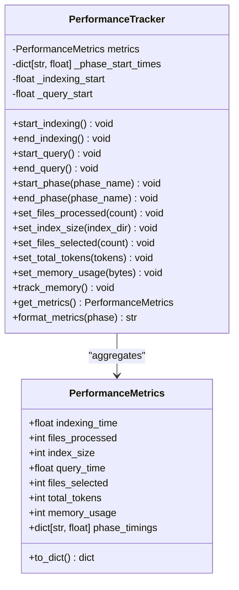
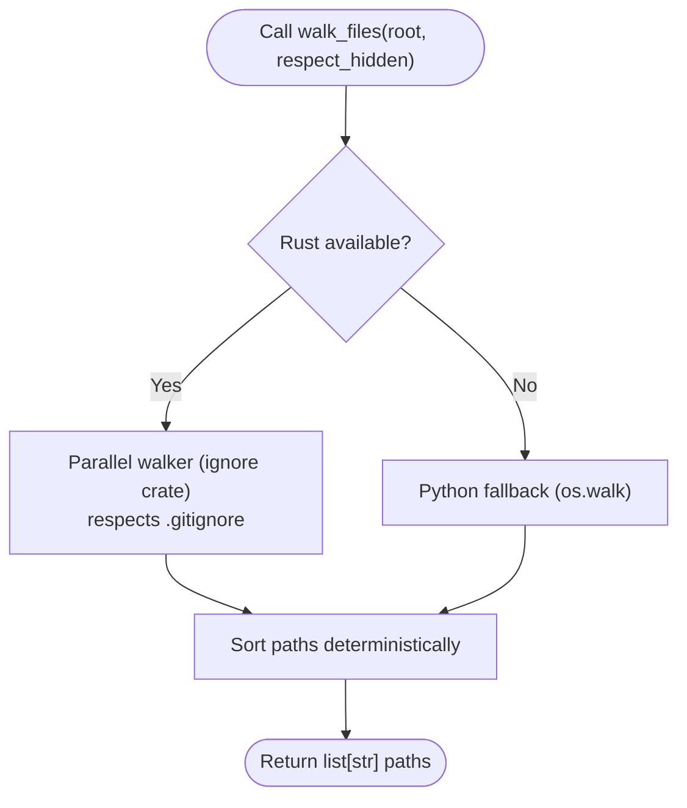
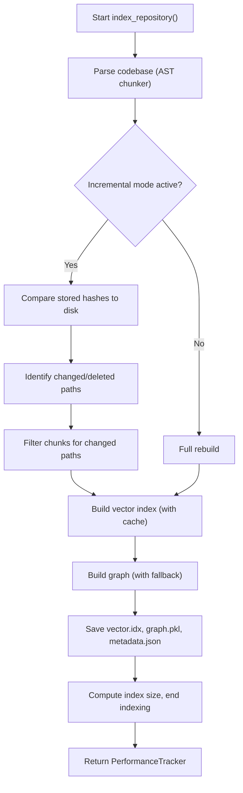
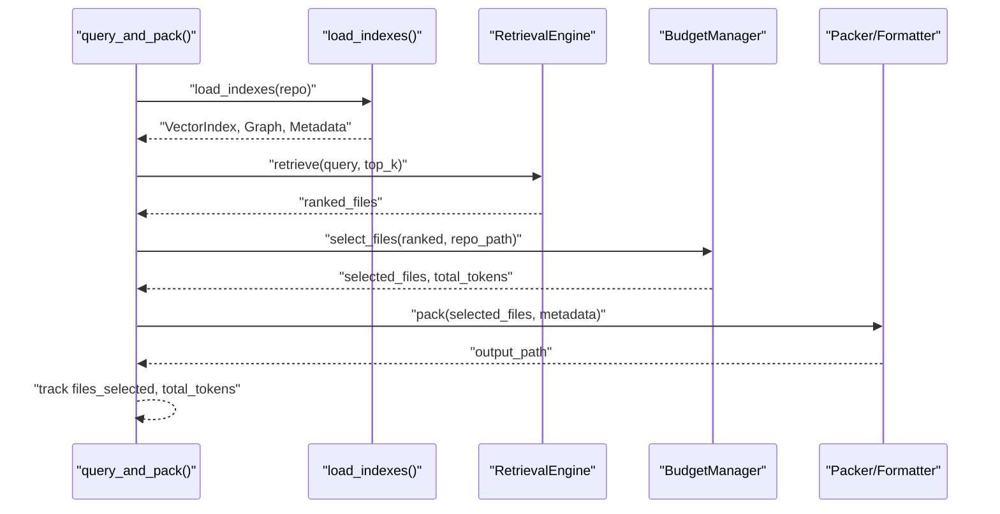
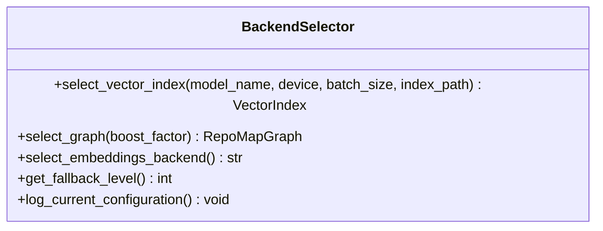
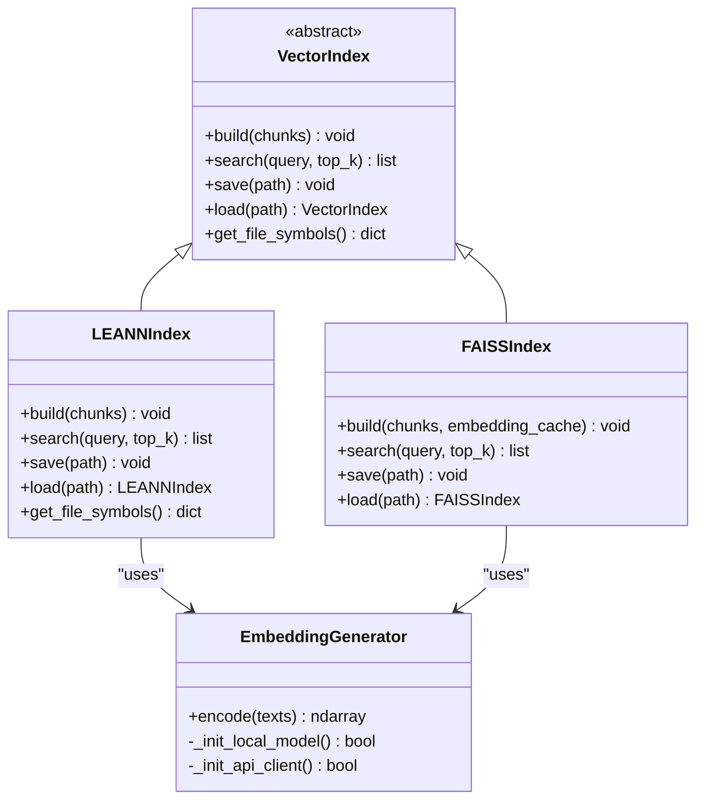
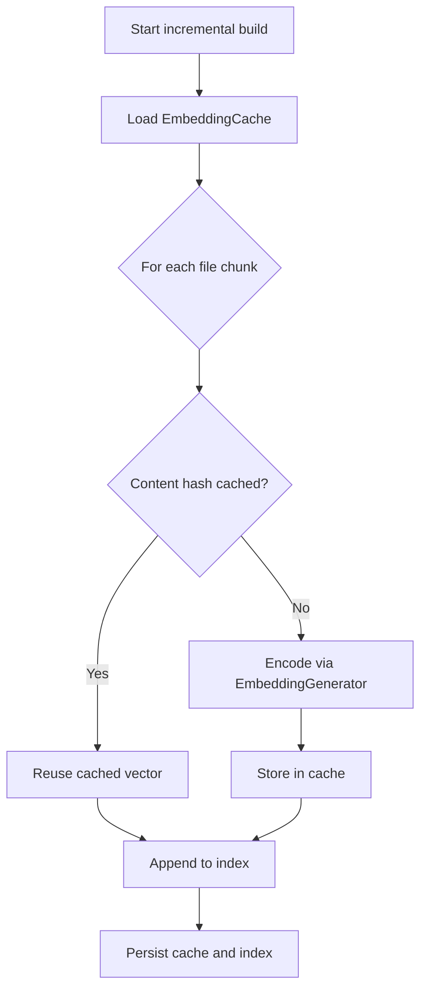
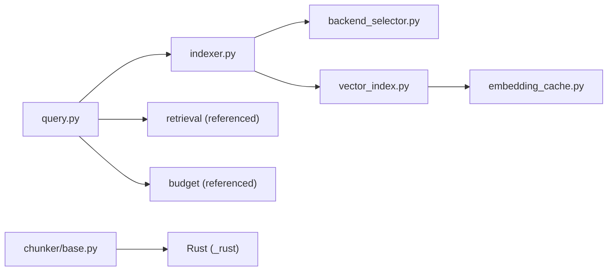

# Performance & Optimization

<cite>
**Referenced Files in This Document**
- [performance.py](file://src/ws_ctx_engine/monitoring/performance.py)
- [indexer.py](file://src/ws_ctx_engine/workflow/indexer.py)
- [query.py](file://src/ws_ctx_engine/workflow/query.py)
- [backend_selector.py](file://src/ws_ctx_engine/backend_selector/backend_selector.py)
- [vector_index.py](file://src/ws_ctx_engine/vector_index/vector_index.py)
- [leann_index.py](file://src/ws_ctx_engine/vector_index/leann_index.py)
- [embedding_cache.py](file://src/ws_ctx_engine/vector_index/embedding_cache.py)
- [config.py](file://src/ws_ctx_engine/config/config.py)
- [base.py](file://src/ws_ctx_engine/chunker/base.py)
- [Cargo.toml](file://_rust/Cargo.toml)
- [lib.rs](file://_rust/src/lib.rs)
- [walker.rs](file://_rust/src/walker.rs)
- [performance.md](file://docs/guides/performance.md)
- [test_performance_benchmarks.py](file://tests/test_performance_benchmarks.py)
- [toon_vs_alternatives.py](file://benchmarks/toon_vs_alternatives.py)
</cite>

## Update Summary
**Changes Made**
- Updated MCP-specific performance documentation references to point to the consolidated MCP Performance Optimization Guide v3
- Removed detailed MCP-specific optimization sections that have been moved to the dedicated guide
- Focused the general performance guide on broader optimization topics applicable to all users
- Maintained all core performance monitoring, benchmarking, and optimization content
- Preserved Rust extension documentation and performance targets

## Table of Contents
1. [Introduction](#introduction)
2. [Project Structure](#project-structure)
3. [Core Components](#core-components)
4. [Architecture Overview](#architecture-overview)
5. [Detailed Component Analysis](#detailed-component-analysis)
6. [Dependency Analysis](#dependency-analysis)
7. [Performance Considerations](#performance-considerations)
8. [Troubleshooting Guide](#troubleshooting-guide)
9. [Conclusion](#conclusion)
10. [Appendices](#appendices)

## Introduction
This document provides comprehensive performance and optimization guidance for ws-ctx-engine. It covers the performance monitoring system, benchmarking methodologies, the Rust extension delivering 8–20x speedup for hot-path operations, memory optimization strategies, caching mechanisms for embeddings and indices, backend selection strategies, CPU/GPU utilization, parallel processing, tuning parameters, resource allocation guidelines, scalability considerations, benchmark results, and troubleshooting.

**Important**: MCP-specific performance optimizations have been consolidated into the comprehensive MCP Performance Optimization Guide v3. This general performance guide now focuses on broader optimization topics while MCP-specific optimizations are fully documented in the dedicated guide.

## Project Structure
The performance-critical parts of the system are organized around:
- Monitoring and metrics collection
- Indexing and query workflows
- Backend selection and vector index backends
- Rust hot-path acceleration
- Configuration-driven performance controls

**Diagram sources**
- [performance.py:13-263](file://src/ws_ctx_engine/monitoring/performance.py#L13-L263)
- [indexer.py:72-493](file://src/ws_ctx_engine/workflow/indexer.py#L72-L493)
- [query.py:230-617](file://src/ws_ctx_engine/workflow/query.py#L230-L617)
- [backend_selector.py:13-191](file://src/ws_ctx_engine/backend_selector/backend_selector.py#L13-L191)
- [vector_index.py:21-800](file://src/ws_ctx_engine/vector_index/vector_index.py#L21-L800)
- [leann_index.py:20-296](file://src/ws_ctx_engine/vector_index/leann_index.py#L20-L296)
- [base.py:10-25](file://src/ws_ctx_engine/chunker/base.py#L10-L25)
- [Cargo.toml:1-25](file://_rust/Cargo.toml#L1-L25)

**Section sources**
- [performance.py:13-263](file://src/ws_ctx_engine/monitoring/performance.py#L13-L263)
- [indexer.py:72-493](file://src/ws_ctx_engine/workflow/indexer.py#L72-L493)
- [query.py:230-617](file://src/ws_ctx_engine/workflow/query.py#L230-L617)
- [backend_selector.py:13-191](file://src/ws_ctx_engine/backend_selector/backend_selector.py#L13-L191)
- [vector_index.py:21-800](file://src/ws_ctx_engine/vector_index/vector_index.py#L21-L800)
- [leann_index.py:20-296](file://src/ws_ctx_engine/vector_index/leann_index.py#L20-L296)
- [base.py:10-25](file://src/ws_ctx_engine/chunker/base.py#L10-L25)
- [Cargo.toml:1-25](file://_rust/Cargo.toml#L1-L25)

## Core Components
- Performance monitoring: Tracks indexing/query durations, files processed/index size, tokens selected, and peak memory usage.
- Workflows: Index and query phases orchestrate parsing, vector indexing, graph building, retrieval, budget selection, packing, and metadata persistence.
- Backend selection: Centralized fallback chain across vector index, graph, and embeddings backends.
- Rust hot-path: Accelerates file walking; Python fallbacks exist for hashing and token counting.
- Caching: Embedding cache avoids re-embedding unchanged content; incremental rebuilds leverage caches.
- Configuration: Tunable performance flags (e.g., embedding cache, incremental indexing) and backend preferences.

**Section sources**
- [performance.py:13-263](file://src/ws_ctx_engine/monitoring/performance.py#L13-L263)
- [indexer.py:72-493](file://src/ws_ctx_engine/workflow/indexer.py#L72-L493)
- [query.py:230-617](file://src/ws_ctx_engine/workflow/query.py#L230-L617)
- [backend_selector.py:13-191](file://src/ws_ctx_engine/backend_selector/backend_selector.py#L13-L191)
- [embedding_cache.py:28-127](file://src/ws_ctx_engine/vector_index/embedding_cache.py#L28-L127)
- [config.py:94-101](file://src/ws_ctx_engine/config/config.py#L94-L101)
- [base.py:10-25](file://src/ws_ctx_engine/chunker/base.py#L10-L25)

## Architecture Overview
The system measures performance end-to-end and applies optimizations at multiple layers:
- Hot-path acceleration via Rust for file walking.
- Incremental indexing with embedding cache and staleness detection.
- Backend selection with graceful fallbacks.
- Memory tracking and budget-aware selection.

**Diagram sources**
- [indexer.py:72-493](file://src/ws_ctx_engine/workflow/indexer.py#L72-L493)
- [backend_selector.py:36-81](file://src/ws_ctx_engine/backend_selector/backend_selector.py#L36-L81)
- [vector_index.py:536-644](file://src/ws_ctx_engine/vector_index/vector_index.py#L536-L644)
- [embedding_cache.py:55-84](file://src/ws_ctx_engine/vector_index/embedding_cache.py#L55-L84)
- [performance.py:95-114](file://src/ws_ctx_engine/monitoring/performance.py#L95-L114)

## Detailed Component Analysis

### Performance Monitoring and Metrics
- Tracks indexing and query durations, files processed, index size, files selected, total tokens, and peak memory usage.
- Supports phase-level timing and human-readable formatting.
- Memory tracking uses psutil when available; gracefully degrades when unavailable.

**Diagram sources**
- [performance.py:13-263](file://src/ws_ctx_engine/monitoring/performance.py#L13-L263)

**Section sources**
- [performance.py:13-263](file://src/ws_ctx_engine/monitoring/performance.py#L13-L263)

### Rust Hot-Path Acceleration
- The Rust extension exposes a single hot-path function: file walking with parallel traversal and .gitignore respect.
- The extension is optional; Python fallbacks are used when unavailable.
- Benchmarks indicate 8–20x speedup for file walking and 8–12x for related operations.

**Diagram sources**
- [base.py:14-25](file://src/ws_ctx_engine/chunker/base.py#L14-L25)
- [lib.rs:16-21](file://_rust/src/lib.rs#L16-L21)
- [walker.rs:16-52](file://_rust/src/walker.rs#L16-L52)
- [Cargo.toml:10-25](file://_rust/Cargo.toml#L10-L25)

**Section sources**
- [base.py:10-25](file://src/ws_ctx_engine/chunker/base.py#L10-L25)
- [lib.rs:1-22](file://_rust/src/lib.rs#L1-L22)
- [walker.rs:1-53](file://_rust/src/walker.rs#L1-L53)
- [Cargo.toml:1-25](file://_rust/Cargo.toml#L1-L25)
- [performance.md:1-81](file://docs/guides/performance.md#L1-L81)

### Indexing Workflow and Incremental Optimization
- Detects incremental changes by comparing stored file hashes to current disk state.
- Uses embedding cache to avoid re-embedding unchanged files.
- Saves metadata for staleness detection and supports domain-only rebuilds.

**Diagram sources**
- [indexer.py:27-371](file://src/ws_ctx_engine/workflow/indexer.py#L27-L371)
- [embedding_cache.py:55-84](file://src/ws_ctx_engine/vector_index/embedding_cache.py#L55-L84)

**Section sources**
- [indexer.py:27-371](file://src/ws_ctx_engine/workflow/indexer.py#L27-L371)
- [embedding_cache.py:28-127](file://src/ws_ctx_engine/vector_index/embedding_cache.py#L28-L127)

### Query Workflow and Budget-Aware Selection
- Loads indexes with auto-detection and staleness handling.
- Hybrid retrieval combines semantic and graph signals.
- Budget manager selects files within token budget and tracks total tokens.

**Diagram sources**
- [query.py:230-617](file://src/ws_ctx_engine/workflow/query.py#L230-L617)
- [indexer.py:404-493](file://src/ws_ctx_engine/workflow/indexer.py#L404-L493)

**Section sources**
- [query.py:230-617](file://src/ws_ctx_engine/workflow/query.py#L230-L617)
- [indexer.py:404-493](file://src/ws_ctx_engine/workflow/indexer.py#L404-L493)

### Backend Selection Strategies
- Centralized selector chooses backends with graceful fallback across vector index, graph, and embeddings.
- Fallback levels define optimal to minimal configurations with storage and performance trade-offs.

**Diagram sources**
- [backend_selector.py:13-191](file://src/ws_ctx_engine/backend_selector/backend_selector.py#L13-L191)

**Section sources**
- [backend_selector.py:13-191](file://src/ws_ctx_engine/backend_selector/backend_selector.py#L13-L191)

### Vector Index Backends and Storage Optimization
- LEANN-based backends provide 97% storage savings by selectively recomputing embeddings.
- FAISS-based backend offers exact brute-force search with ID mapping for incremental updates.
- EmbeddingGenerator handles local and API fallbacks with memory-aware checks.

**Diagram sources**
- [vector_index.py:21-800](file://src/ws_ctx_engine/vector_index/vector_index.py#L21-L800)

**Section sources**
- [vector_index.py:21-800](file://src/ws_ctx_engine/vector_index/vector_index.py#L21-L800)
- [leann_index.py:20-296](file://src/ws_ctx_engine/vector_index/leann_index.py#L20-L296)

### Embedding Cache and Incremental Indexing Benefits
- Disk-backed cache persists content-hash → embedding vector mappings.
- On incremental rebuilds, unchanged files reuse cached vectors; new/changed files are embedded and appended.
- Reduces embedding cost and speeds up rebuilds.

**Diagram sources**
- [embedding_cache.py:55-127](file://src/ws_ctx_engine/vector_index/embedding_cache.py#L55-L127)
- [vector_index.py:536-644](file://src/ws_ctx_engine/vector_index/vector_index.py#L536-L644)

**Section sources**
- [embedding_cache.py:28-127](file://src/ws_ctx_engine/vector_index/embedding_cache.py#L28-L127)
- [vector_index.py:536-644](file://src/ws_ctx_engine/vector_index/vector_index.py#L536-L644)

### Configuration and Tuning Parameters
- Performance flags: cache_embeddings, incremental_index, max_workers (reserved).
- Embeddings: model, device (cpu/cuda), batch_size, API provider/key.
- Backend selection: vector_index, graph, embeddings with auto/forced backends.

**Section sources**
- [config.py:94-101](file://src/ws_ctx_engine/config/config.py#L94-L101)
- [config.py:83-92](file://src/ws_ctx_engine/config/config.py#L83-L92)
- [config.py:74-81](file://src/ws_ctx_engine/config/config.py#L74-L81)

## Dependency Analysis
- The indexing workflow depends on the backend selector, vector index, and embedding cache.
- The query workflow depends on index loading, retrieval engine, budget manager, and packer/formatter.
- Rust hot-path is optional and integrates via Python fallback chain.

**Diagram sources**
- [indexer.py:14-22](file://src/ws_ctx_engine/workflow/indexer.py#L14-L22)
- [query.py:13-22](file://src/ws_ctx_engine/workflow/query.py#L13-L22)
- [base.py:10-25](file://src/ws_ctx_engine/chunker/base.py#L10-L25)

**Section sources**
- [indexer.py:14-22](file://src/ws_ctx_engine/workflow/indexer.py#L14-L22)
- [query.py:13-22](file://src/ws_ctx_engine/workflow/query.py#L13-L22)
- [base.py:10-25](file://src/ws_ctx_engine/chunker/base.py#L10-L25)

## Performance Considerations
- Hot-path acceleration: Prefer installing the Rust extension for significant gains in file walking and related operations.
- Incremental indexing: Enable cache_embeddings and incremental_index to reduce rebuild costs.
- Backend selection: Use primary backends (LEANN + igraph) for optimal performance; fallback to FAISS + NetworkX when necessary.
- Memory usage: Monitor peak memory via PerformanceTracker; local embeddings may trigger API fallback under low-memory conditions.
- Parallelization: The Rust walker uses parallel traversal; consider CPU/GPU device settings for embeddings.
- Output formats: Token counts vary by format; see format benchmarks for guidance.

## Troubleshooting Guide
- Missing Rust extension: The system falls back to Python implementations automatically; verify installation and availability.
- Low memory during embeddings: Local model initialization may be skipped or API fallback triggered; adjust device/batch size or use API embeddings.
- Stale indexes: The loader detects staleness and can auto-rebuild; disable auto-rebuild if needed.
- Slow indexing: Check backend selection, embedding cache usage, and incremental mode; verify file filters and include/exclude patterns.
- Query timeouts: Reduce top_k, adjust token budget, or switch to primary backends.

**Section sources**
- [base.py:14-25](file://src/ws_ctx_engine/chunker/base.py#L14-L25)
- [vector_index.py:128-278](file://src/ws_ctx_engine/vector_index/vector_index.py#L128-L278)
- [indexer.py:426-493](file://src/ws_ctx_engine/workflow/indexer.py#L426-L493)
- [query.py:294-323](file://src/ws_ctx_engine/workflow/query.py#L294-L323)

## Conclusion
ws-ctx-engine delivers strong performance through a combination of Rust hot-path acceleration, incremental indexing with embedding caching, backend selection with graceful fallbacks, and robust monitoring. By tuning configuration flags, selecting appropriate backends, and leveraging caching and incremental rebuilds, teams can achieve efficient indexing and querying at scale.

**MCP-Specific Optimizations**: For MCP-specific performance optimizations, refer to the comprehensive MCP Performance Optimization Guide v3, which consolidates all MCP-related performance enhancements including model loading optimization, hybrid search architecture, and advanced caching strategies.

## Appendices

### Benchmarking Methodologies and Results
- Performance targets and speedups for file walking and related operations are documented, including optional Rust extension benchmarks.
- Unit tests enforce performance targets for indexing and querying under different backend configurations.
- Format token benchmarks compare output sizes across formats using tiktoken encoding.

**Section sources**
- [performance.md:1-81](file://docs/guides/performance.md#L1-L81)
- [test_performance_benchmarks.py:141-440](file://tests/test_performance_benchmarks.py#L141-L440)
- [toon_vs_alternatives.py:1-260](file://benchmarks/toon_vs_alternatives.py#L1-L260)

### Optimization Case Studies
- File walking acceleration: Installing the Rust extension reduces file walk time from several hundred milliseconds to under 200 ms for large repositories.
- Incremental rebuilds: Embedding cache avoids re-embedding unchanged files, dramatically reducing rebuild times on large codebases.
- Backend selection: Primary backends (LEANN + igraph) meet strict latency targets; fallback backends maintain usability within acceptable bounds.

**Section sources**
- [performance.md:1-81](file://docs/guides/performance.md#L1-L81)
- [indexer.py:200-240](file://src/ws_ctx_engine/workflow/indexer.py#L200-L240)
- [test_performance_benchmarks.py:172-249](file://tests/test_performance_benchmarks.py#L172-L249)