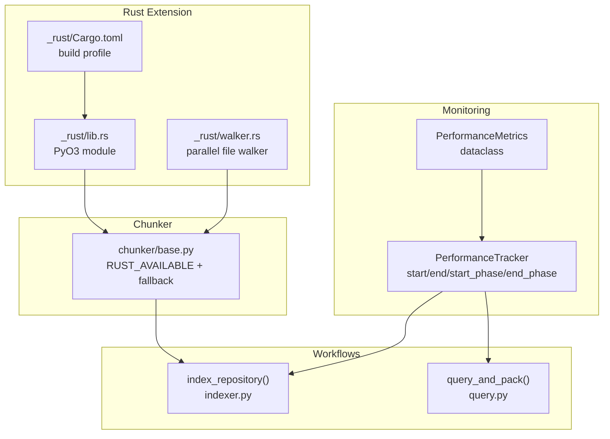
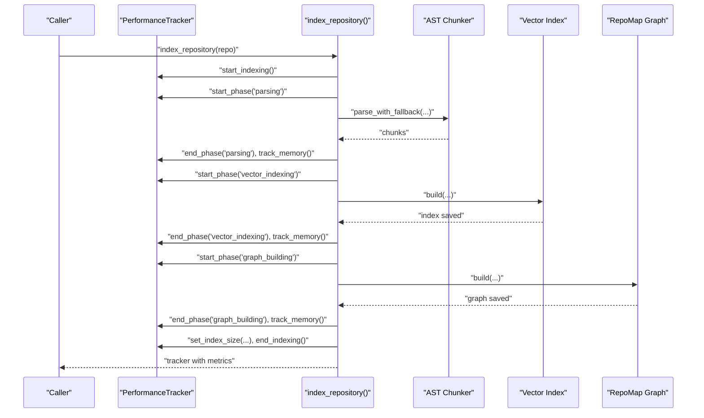
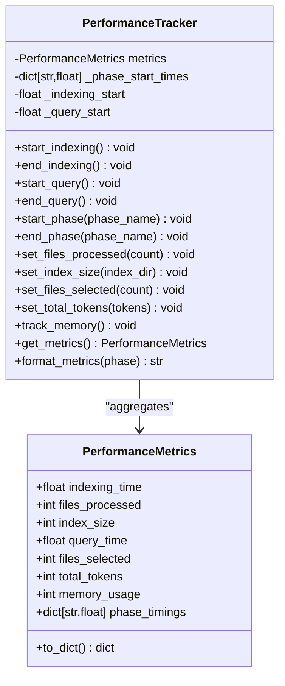
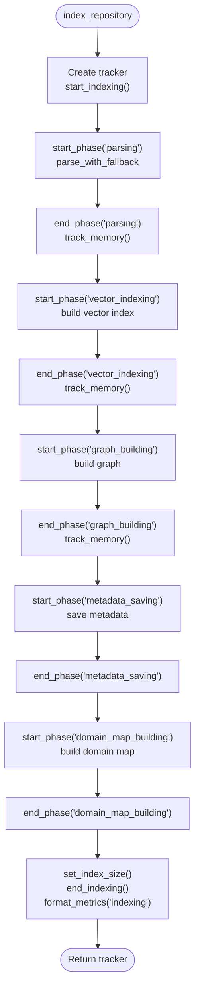
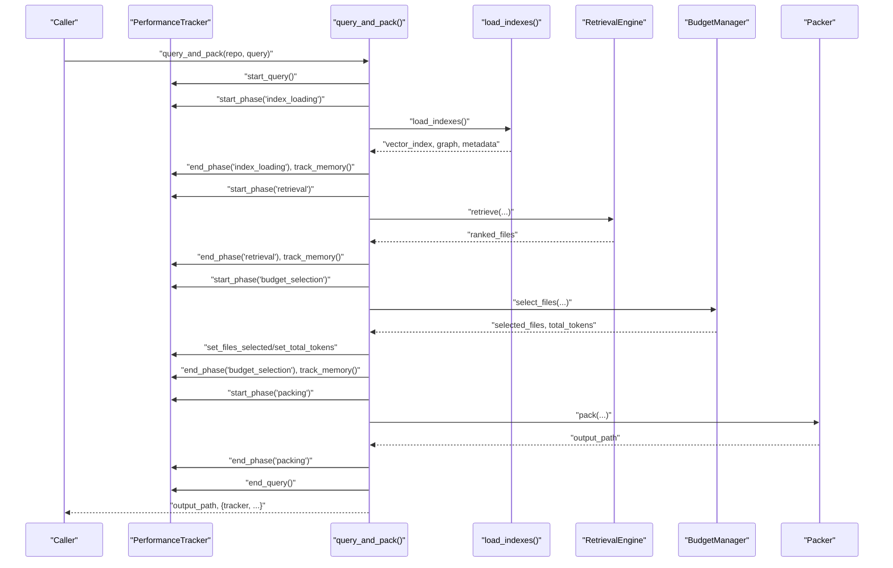
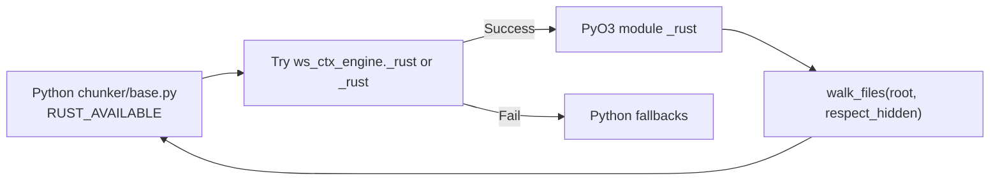
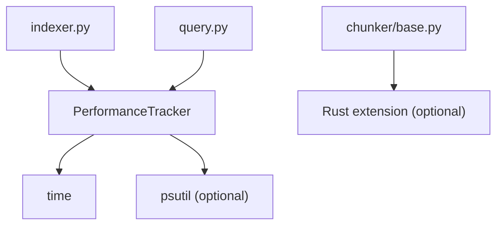

# Performance Monitoring

<cite>
**Referenced Files in This Document**
- [performance.py](file://src/ws_ctx_engine/monitoring/performance.py)
- [indexer.py](file://src/ws_ctx_engine/workflow/indexer.py)
- [query.py](file://src/ws_ctx_engine/workflow/query.py)
- [base.py](file://src/ws_ctx_engine/chunker/base.py)
- [_rust lib.rs](file://_rust/src/lib.rs)
- [_rust walker.rs](file://_rust/src/walker.rs)
- [_rust Cargo.toml](file://_rust/Cargo.toml)
- [performance.md](file://docs/guides/performance.md)
- [test_performance_benchmarks.py](file://tests/test_performance_benchmarks.py)
- [test_performance_properties.py](file://tests/property/test_performance_properties.py)
</cite>

## Table of Contents
1. [Introduction](#introduction)
2. [Project Structure](#project-structure)
3. [Core Components](#core-components)
4. [Architecture Overview](#architecture-overview)
5. [Detailed Component Analysis](#detailed-component-analysis)
6. [Dependency Analysis](#dependency-analysis)
7. [Performance Considerations](#performance-considerations)
8. [Troubleshooting Guide](#troubleshooting-guide)
9. [Conclusion](#conclusion)
10. [Appendices](#appendices)

## Introduction
This document explains the performance monitoring system in ws-ctx-engine, detailing how operation durations, memory usage, and resource utilization are measured across indexing and query phases. It covers the benchmarking methodologies used to evaluate system efficiency, including the automated benchmark suite that compares Python versus Rust implementations. You will learn how to interpret performance metrics, identify bottlenecks, and track system behavior under different workloads, along with practical examples and best practices for large-scale codebase processing.

## Project Structure
The performance monitoring system is centered around a lightweight metrics collector and tracker, integrated into the core workflows for indexing and querying. Supporting performance enhancements are provided by an optional Rust extension that accelerates hot-path operations.

**Diagram sources**
- [performance.py:13-263](file://src/ws_ctx_engine/monitoring/performance.py#L13-L263)
- [indexer.py:72-371](file://src/ws_ctx_engine/workflow/indexer.py#L72-L371)
- [query.py:230-617](file://src/ws_ctx_engine/workflow/query.py#L230-L617)
- [base.py:10-25](file://src/ws_ctx_engine/chunker/base.py#L10-L25)
- [_rust lib.rs:1-22](file://_rust/src/lib.rs#L1-L22)
- [_rust walker.rs:1-53](file://_rust/src/walker.rs#L1-L53)
- [_rust Cargo.toml:1-25](file://_rust/Cargo.toml#L1-L25)

**Section sources**
- [performance.py:1-263](file://src/ws_ctx_engine/monitoring/performance.py#L1-L263)
- [indexer.py:1-493](file://src/ws_ctx_engine/workflow/indexer.py#L1-L493)
- [query.py:1-617](file://src/ws_ctx_engine/workflow/query.py#L1-L617)
- [base.py:1-176](file://src/ws_ctx_engine/chunker/base.py#L1-L176)
- [_rust lib.rs:1-22](file://_rust/src/lib.rs#L1-L22)
- [_rust walker.rs:1-53](file://_rust/src/walker.rs#L1-L53)
- [_rust Cargo.toml:1-25](file://_rust/Cargo.toml#L1-L25)

## Core Components
- PerformanceMetrics: Stores indexing/query metrics, memory usage, and per-phase timings.
- PerformanceTracker: Tracks elapsed time for phases, aggregates metrics, and optionally tracks peak memory usage.

Key capabilities:
- Timing: Whole-phase and per-operation timing for indexing and query.
- Counts: Files processed, files selected, and total tokens.
- Storage: Index size on disk.
- Memory: Optional peak memory tracking via psutil.
- Formatting: Human-readable summaries and dictionary export for serialization.

**Section sources**
- [performance.py:13-263](file://src/ws_ctx_engine/monitoring/performance.py#L13-L263)

## Architecture Overview
The performance monitoring architecture integrates tightly with the indexing and query workflows. Workflows initialize a tracker, mark phase boundaries, and populate metrics. The Rust extension accelerates hot-path operations, reducing overall latency and memory pressure.

**Diagram sources**
- [indexer.py:72-371](file://src/ws_ctx_engine/workflow/indexer.py#L72-L371)
- [performance.py:72-214](file://src/ws_ctx_engine/monitoring/performance.py#L72-L214)

**Section sources**
- [indexer.py:72-371](file://src/ws_ctx_engine/workflow/indexer.py#L72-L371)
- [performance.py:72-214](file://src/ws_ctx_engine/monitoring/performance.py#L72-L214)

## Detailed Component Analysis

### PerformanceMetrics and PerformanceTracker
- PerformanceMetrics: Captures indexing_time, files_processed, index_size; query_time, files_selected, total_tokens; memory_usage; and phase_timings.
- PerformanceTracker: Manages lifecycle of metrics, supports start/end for whole phases and named sub-phases, updates index size, sets token and selection counts, and optionally tracks peak memory.

**Diagram sources**
- [performance.py:13-263](file://src/ws_ctx_engine/monitoring/performance.py#L13-L263)

**Section sources**
- [performance.py:13-263](file://src/ws_ctx_engine/monitoring/performance.py#L13-L263)

### Indexing Workflow Integration
- Initializes PerformanceTracker and starts the indexing phase.
- Starts and ends phases for parsing, vector indexing, graph building, metadata saving, and domain map building.
- Updates metrics for files processed, index size, and tracks memory after major steps.
- Ends indexing and logs formatted metrics.

**Diagram sources**
- [indexer.py:72-371](file://src/ws_ctx_engine/workflow/indexer.py#L72-L371)
- [performance.py:72-214](file://src/ws_ctx_engine/monitoring/performance.py#L72-L214)

**Section sources**
- [indexer.py:72-371](file://src/ws_ctx_engine/workflow/indexer.py#L72-L371)
- [performance.py:72-214](file://src/ws_ctx_engine/monitoring/performance.py#L72-L214)

### Query Workflow Integration
- Initializes PerformanceTracker and starts the query phase.
- Loads indexes, retrieves candidates, selects files within budget, and packs output.
- Records per-phase timings and tracks memory after major steps.
- Sets files_selected and total_tokens, ends query, and logs formatted metrics.

**Diagram sources**
- [query.py:230-617](file://src/ws_ctx_engine/workflow/query.py#L230-L617)
- [performance.py:72-214](file://src/ws_ctx_engine/monitoring/performance.py#L72-L214)

**Section sources**
- [query.py:230-617](file://src/ws_ctx_engine/workflow/query.py#L230-L617)
- [performance.py:72-214](file://src/ws_ctx_engine/monitoring/performance.py#L72-L214)

### Rust Extension Acceleration
- The optional Rust extension exposes a parallel file walker that respects .gitignore semantics and is significantly faster than Python’s equivalent.
- The chunker attempts to import the Rust module first, falling back to Python implementations if unavailable.
- The Rust module is built as a cdylib with release optimizations.

**Diagram sources**
- [base.py:10-25](file://src/ws_ctx_engine/chunker/base.py#L10-L25)
- [_rust lib.rs:1-22](file://_rust/src/lib.rs#L1-L22)
- [_rust walker.rs:1-53](file://_rust/src/walker.rs#L1-L53)

**Section sources**
- [base.py:10-25](file://src/ws_ctx_engine/chunker/base.py#L10-L25)
- [_rust lib.rs:1-22](file://_rust/src/lib.rs#L1-L22)
- [_rust walker.rs:1-53](file://_rust/src/walker.rs#L1-L53)
- [_rust Cargo.toml:1-25](file://_rust/Cargo.toml#L1-L25)

## Dependency Analysis
- PerformanceTracker depends on time for timing and optionally psutil for memory tracking.
- Workflows depend on PerformanceTracker to measure and report metrics.
- The chunker conditionally uses the Rust extension for file walking, improving performance and indirectly reducing memory pressure.

**Diagram sources**
- [performance.py:8-206](file://src/ws_ctx_engine/monitoring/performance.py#L8-L206)
- [indexer.py:21-116](file://src/ws_ctx_engine/workflow/indexer.py#L21-L116)
- [query.py:17-289](file://src/ws_ctx_engine/workflow/query.py#L17-L289)
- [base.py:10-25](file://src/ws_ctx_engine/chunker/base.py#L10-L25)

**Section sources**
- [performance.py:8-206](file://src/ws_ctx_engine/monitoring/performance.py#L8-L206)
- [indexer.py:21-116](file://src/ws_ctx_engine/workflow/indexer.py#L21-L116)
- [query.py:17-289](file://src/ws_ctx_engine/workflow/query.py#L17-L289)
- [base.py:10-25](file://src/ws_ctx_engine/chunker/base.py#L10-L25)

## Performance Considerations
- Use PerformanceTracker.start_phase/end_phase around major steps to capture per-phase timings and identify bottlenecks.
- Enable psutil to track peak memory usage; absence of psutil gracefully degrades to no memory tracking.
- Prefer the Rust extension for file walking to reduce indexing latency and memory footprint.
- Monitor index size growth and adjust backend configurations to maintain query performance.
- Use the benchmark suite to compare performance across backends and configurations.

[No sources needed since this section provides general guidance]

## Troubleshooting Guide
Common issues and remedies:
- Missing psutil: Memory tracking is skipped; install psutil to enable peak memory reporting.
- Empty metrics: Ensure tracker.start_indexing/start_query and end_indexing/end_query are called in workflows.
- Unexpectedly high memory usage: Investigate vector index and graph building phases; consider backend tuning or disabling embedding cache if appropriate.
- Slow indexing: Verify Rust extension availability; confirm .gitignore semantics are respected to avoid scanning ignored directories.

**Section sources**
- [performance.py:185-206](file://src/ws_ctx_engine/monitoring/performance.py#L185-L206)
- [indexer.py:114-116](file://src/ws_ctx_engine/workflow/indexer.py#L114-L116)
- [query.py:287-289](file://src/ws_ctx_engine/workflow/query.py#L287-L289)

## Conclusion
The ws-ctx-engine performance monitoring system provides precise timing, counts, storage metrics, and optional memory tracking integrated into the indexing and query workflows. The optional Rust extension accelerates hot-path operations, improving throughput and reducing latency. The automated benchmark suite enables apples-to-apples comparisons between Python and Rust implementations and across backend configurations, facilitating informed tuning and scaling decisions.

[No sources needed since this section summarizes without analyzing specific files]

## Appendices

### Benchmarking Methodology
- Automated suite: Uses fixtures to generate repositories of varying sizes and runs indexing and query operations, asserting performance targets and capturing metrics.
- Targets: Indexing and query durations for primary and fallback backends; memory usage tracking.
- Execution: Run tests marked as benchmarks to evaluate performance under realistic conditions.

**Section sources**
- [test_performance_benchmarks.py:141-440](file://tests/test_performance_benchmarks.py#L141-L440)
- [performance.md:45-81](file://docs/guides/performance.md#L45-L81)

### Practical Examples and Best Practices
- Interpreting metrics:
  - Indexing: Total time, files processed per second, index size, and per-phase timings.
  - Query: Total time, files selected, total tokens, and per-phase timings.
  - Memory: Peak memory usage when psutil is available.
- Identifying bottlenecks:
  - Compare phase_timings to locate long-running steps (parsing, vector indexing, graph building, retrieval, budget selection, packing).
- Monitoring under workloads:
  - Scale repository size and backend choices; observe index size growth and query latency.
  - Use formatted metrics output to log performance during CI runs.

**Section sources**
- [performance.py:215-263](file://src/ws_ctx_engine/monitoring/performance.py#L215-L263)
- [test_performance_properties.py:14-270](file://tests/property/test_performance_properties.py#L14-L270)