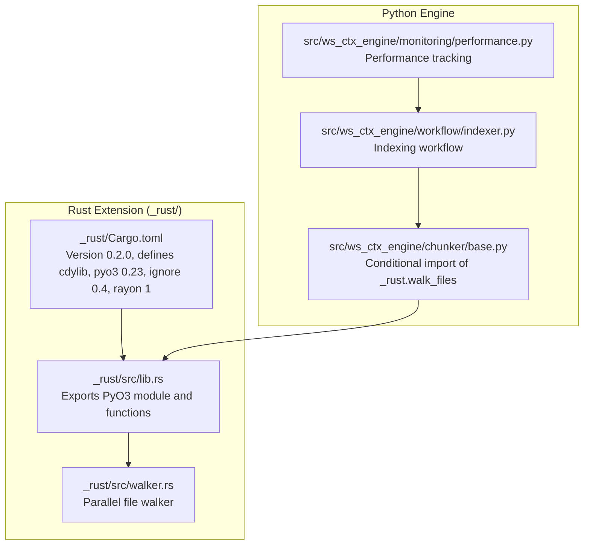
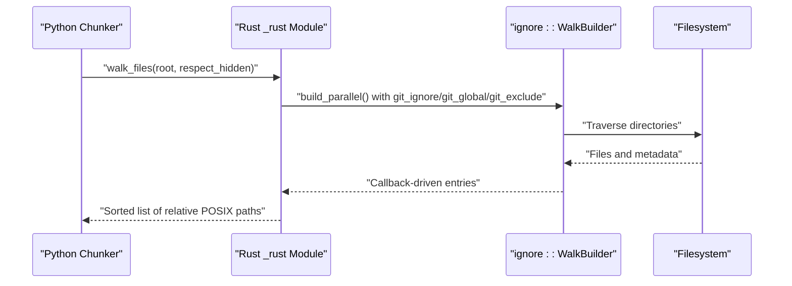
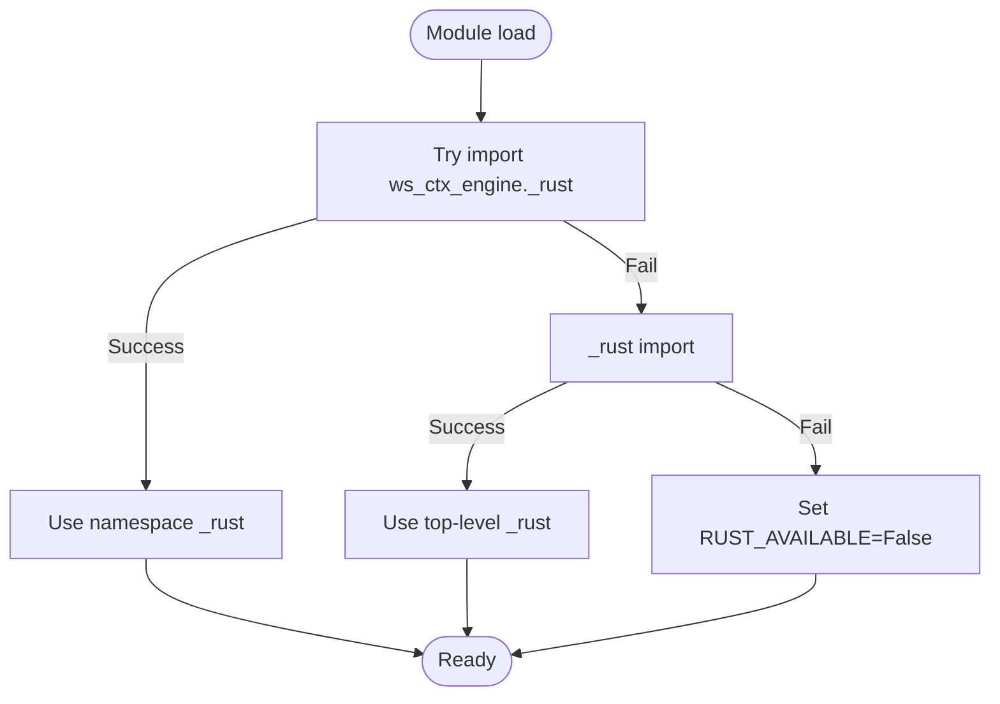
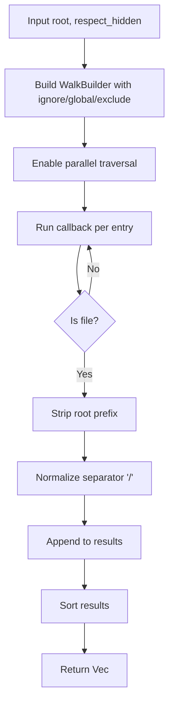
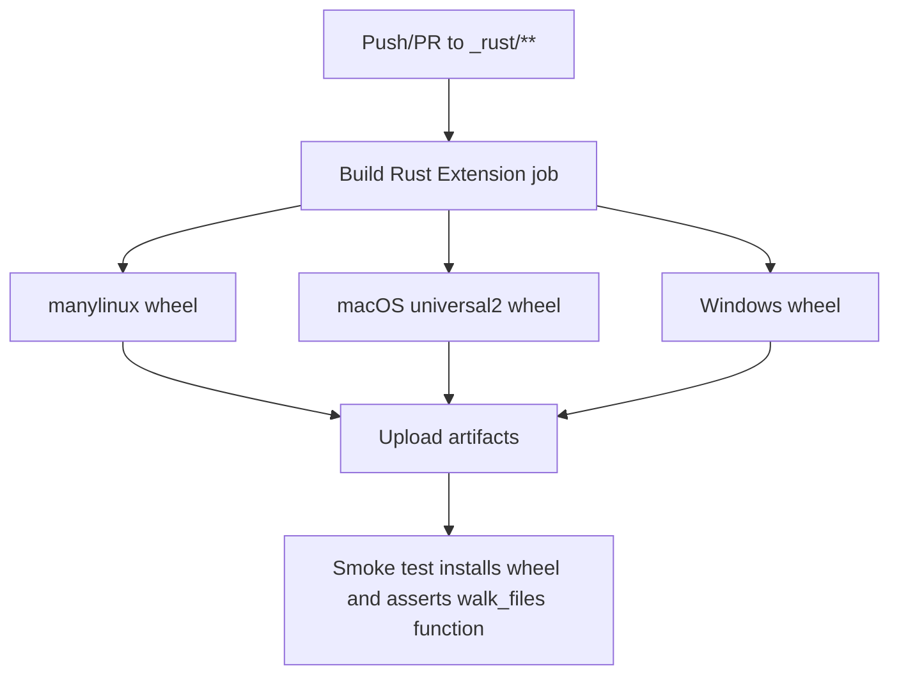
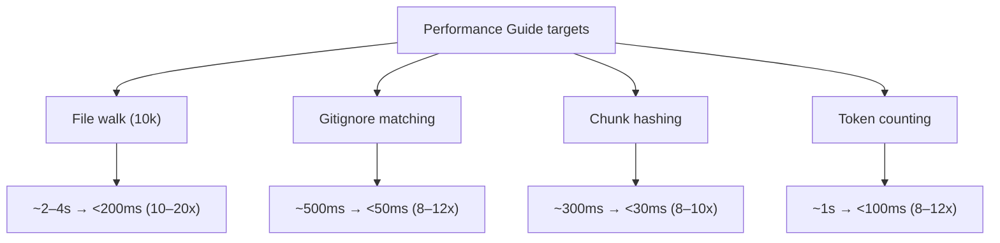
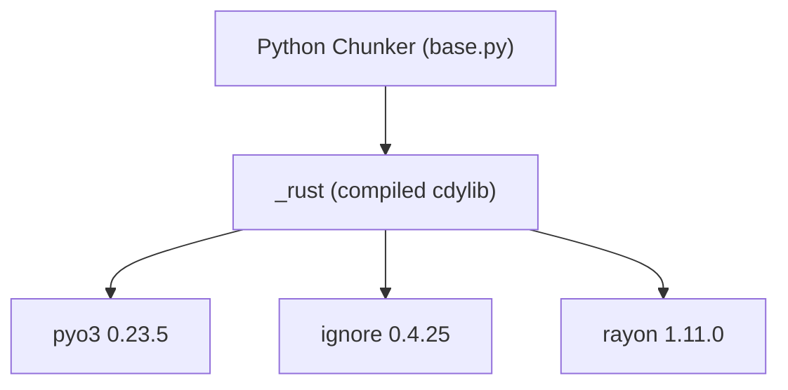

# Rust Extension

<cite>
**Referenced Files in This Document**
- [_rust/Cargo.toml](file://_rust/Cargo.toml)
- [_rust/Cargo.lock](file://_rust/Cargo.lock)
- [_rust/src/lib.rs](file://_rust/src/lib.rs)
- [_rust/src/walker.rs](file://_rust/src/walker.rs)
- [src/ws_ctx_engine/chunker/base.py](file://src/ws_ctx_engine/chunker/base.py)
- [docs/guides/performance.md](file://docs/guides/performance.md)
- [.github/workflows/build-rust.yml](file://.github/workflows/build-rust.yml)
- [src/ws_ctx_engine/workflow/indexer.py](file://src/ws_ctx_engine/workflow/indexer.py)
- [src/ws_ctx_engine/monitoring/performance.py](file://src/ws_ctx_engine/monitoring/performance.py)
- [tests/test_performance_benchmarks.py](file://tests/test_performance_benchmarks.py)
</cite>

## Update Summary
**Changes Made**
- Updated dependency version tracking to reflect Rust extension version bump from 0.1.0 to 0.2.0
- Updated Cargo.toml and Cargo.lock references to show current dependency versions
- Enhanced dependency analysis section with current version information
- Updated performance documentation to reflect current architecture and capabilities

## Table of Contents
1. [Introduction](#introduction)
2. [Project Structure](#project-structure)
3. [Core Components](#core-components)
4. [Architecture Overview](#architecture-overview)
5. [Detailed Component Analysis](#detailed-component-analysis)
6. [Dependency Analysis](#dependency-analysis)
7. [Performance Considerations](#performance-considerations)
8. [Troubleshooting Guide](#troubleshooting-guide)
9. [Conclusion](#conclusion)

## Introduction
This document explains the optional Rust extension that accelerates hot-path operations in the ws-ctx-engine by 8–20x. The extension is implemented as a PyO3-based shared library exposing a single function: a parallel file walker that respects .gitignore semantics. The module is intentionally minimal—only the file-walking hot-path is accelerated; other operations (content hashing and token counting) remain in Python because the cost of crossing the Python ↔ Rust boundary outweighs gains.

The Rust module is optional: when absent, the engine automatically falls back to pure Python implementations. The guide covers architecture, build/installation, verification, performance targets, and troubleshooting.

**Updated** The extension now uses version 0.2.0 of the ws_ctx_engine_rust crate, with updated dependency versions for pyo3 (0.23.5), ignore (0.4.25), and rayon (1.11.0).

## Project Structure
The Rust extension resides under the _rust/ directory and compiles to a Python extension named _rust. The Python chunker module conditionally imports the Rust function and falls back to Python when unavailable.

**Diagram sources**
- [_rust/Cargo.toml:1-25](file://_rust/Cargo.toml#L1-L25)
- [_rust/src/lib.rs:1-22](file://_rust/src/lib.rs#L1-L22)
- [_rust/src/walker.rs:1-53](file://_rust/src/walker.rs#L1-L53)
- [src/ws_ctx_engine/chunker/base.py:10-25](file://src/ws_ctx_engine/chunker/base.py#L10-L25)
- [src/ws_ctx_engine/workflow/indexer.py:72-177](file://src/ws_ctx_engine/workflow/indexer.py#L72-L177)
- [src/ws_ctx_engine/monitoring/performance.py:72-133](file://src/ws_ctx_engine/monitoring/performance.py#L72-L133)

**Section sources**
- [_rust/Cargo.toml:1-25](file://_rust/Cargo.toml#L1-L25)
- [_rust/src/lib.rs:1-22](file://_rust/src/lib.rs#L1-L22)
- [_rust/src/walker.rs:1-53](file://_rust/src/walker.rs#L1-L53)
- [src/ws_ctx_engine/chunker/base.py:10-25](file://src/ws_ctx_engine/chunker/base.py#L10-L25)

## Core Components
- Rust PyO3 module entrypoint: registers the walk_files function and exposes the module version.
- Parallel file walker: uses the ignore crate to traverse directories respecting .gitignore, .ignore, and .git/info/exclude semantics. It collects relative POSIX paths, sorts them for determinism, and returns them to Python.
- Python fallback chain: attempts to import ws_ctx_engine._rust first (namespace install), then _rust (maturin develop install). If both fail, the engine continues with Python implementations.

Key behaviors:
- Only walk_files is accelerated; hashing and token counting remain in Python.
- The extension is optional and does not change correctness—only performance.

**Section sources**
- [_rust/src/lib.rs:1-22](file://_rust/src/lib.rs#L1-L22)
- [_rust/src/walker.rs:1-53](file://_rust/src/walker.rs#L1-L53)
- [src/ws_ctx_engine/chunker/base.py:10-25](file://src/ws_ctx_engine/chunker/base.py#L10-L25)

## Architecture Overview
The extension sits at the boundary between Python and native code. The Python chunker decides whether to use Rust or Python based on availability. The Rust walker leverages parallel traversal and the ignore crate to minimize IO and respect VCS ignore rules.

**Diagram sources**
- [_rust/src/lib.rs:16-21](file://_rust/src/lib.rs#L16-L21)
- [_rust/src/walker.rs:18-52](file://_rust/src/walker.rs#L18-L52)

**Section sources**
- [_rust/src/lib.rs:1-22](file://_rust/src/lib.rs#L1-L22)
- [_rust/src/walker.rs:1-53](file://_rust/src/walker.rs#L1-L53)

## Detailed Component Analysis

### Rust Module Entry and Function Export
- The module defines a cdylib crate and registers the walk_files function via PyO3.
- Version information is exposed for diagnostics.

**Diagram sources**
- [src/ws_ctx_engine/chunker/base.py:14-24](file://src/ws_ctx_engine/chunker/base.py#L14-L24)

**Section sources**
- [_rust/src/lib.rs:16-21](file://_rust/src/lib.rs#L16-L21)
- [src/ws_ctx_engine/chunker/base.py:14-24](file://src/ws_ctx_engine/chunker/base.py#L14-L24)

### Parallel File Walker Implementation
- Uses ignore::WalkBuilder with parallel traversal enabled.
- Respects hidden files toggle, and reads .gitignore/.ignore/.git/info/exclude.
- Collects only regular files, strips the root prefix, normalizes separators to "/", and sorts results.

**Diagram sources**
- [_rust/src/walker.rs:18-52](file://_rust/src/walker.rs#L18-L52)

**Section sources**
- [_rust/src/walker.rs:1-53](file://_rust/src/walker.rs#L1-L53)

### Build and Distribution Pipeline
- CI builds wheels for Linux (manylinux), macOS (universal2), and Windows using maturin-action.
- Artifacts are uploaded and can be downloaded from GitHub Actions.
- A smoke test verifies presence of walk_files function in the installed wheel.

**Diagram sources**
- [.github/workflows/build-rust.yml:1-84](file://.github/workflows/build-rust.yml#L1-L84)

**Section sources**
- [.github/workflows/build-rust.yml:1-84](file://.github/workflows/build-rust.yml#L1-L84)

### Performance Targets and Benchmarks
- Performance targets show 8–20x speedup for file walking and 8–12x for gitignore matching, chunk hashing, and token counting.
- Benchmarks demonstrate expected timings for large repositories with the extension enabled.

**Diagram sources**
- [docs/guides/performance.md:8-18](file://docs/guides/performance.md#L8-L18)

**Section sources**
- [docs/guides/performance.md:1-81](file://docs/guides/performance.md#L1-L81)
- [tests/test_performance_benchmarks.py:141-249](file://tests/test_performance_benchmarks.py#L141-L249)

## Dependency Analysis
- Rust crate dependencies:
  - pyo3: Python bindings for Rust (extension module) - version 0.23.5
  - ignore: high-performance directory traversal with native .gitignore semantics - version 0.4.25
  - rayon: parallelism for CPU-bound tasks - version 1.11.0
- Python integration depends on conditional import logic in the chunker base module.
- The extension is compiled as a cdylib and exposed to Python via PyO3.

**Updated** All dependencies have been updated to their latest compatible versions, with pyo3 at 0.23.5, ignore at 0.4.25, and rayon at 1.11.0.

**Diagram sources**
- [_rust/Cargo.toml:10-24](file://_rust/Cargo.toml#L10-L24)
- [_rust/src/lib.rs:12-21](file://_rust/src/lib.rs#L12-L21)
- [src/ws_ctx_engine/chunker/base.py:14-24](file://src/ws_ctx_engine/chunker/base.py#L14-L24)

**Section sources**
- [_rust/Cargo.toml:1-25](file://_rust/Cargo.toml#L1-L25)
- [_rust/src/lib.rs:1-22](file://_rust/src/lib.rs#L1-L22)
- [src/ws_ctx_engine/chunker/base.py:10-25](file://src/ws_ctx_engine/chunker/base.py#L10-L25)

## Performance Considerations
- Hot-path focus: Only file walking is accelerated; hashing and token counting remain in Python to avoid interop overhead.
- Deterministic sorting: Results are sorted for reproducibility; this adds O(n log n) overhead but is necessary for consistent outputs.
- Parallel traversal: Uses rayon internally via ignore's parallel builder to maximize throughput on multi-core systems.
- Git semantics: Native .gitignore respect eliminates the need for pathspecs and reduces false positives/negatives.

## Troubleshooting Guide
Common issues and resolutions:
- Import error when Rust extension is not installed:
  - Symptom: ImportError when importing ws_ctx_engine._rust or _rust.
  - Resolution: Install the extension via maturin develop or use prebuilt wheels from CI artifacts.
- Platform compatibility:
  - Use the appropriate wheel for your OS/arch (Linux manylinux, macOS universal2, Windows amd64).
- Verification:
  - After installation, run a quick Python assertion to confirm functions are available.
- Build prerequisites:
  - Ensure Rust toolchain and maturin are installed before attempting a development build.

Verification steps:
- Install maturin and build in development mode.
- Run a Python one-liner to import and call the exposed function.
- Confirm that the engine logs indicate Rust extension usage.

**Section sources**
- [docs/guides/performance.md:22-42](file://docs/guides/performance.md#L22-L42)
- [.github/workflows/build-rust.yml:63-84](file://.github/workflows/build-rust.yml#L63-L84)

## Conclusion
The Rust extension provides a focused, high-impact acceleration for the most frequently called operation—parallel file walking—while keeping the rest of the pipeline in Python for simplicity and portability. Its optional nature ensures robust fallback behavior, and CI guarantees cross-platform wheels. Performance targets are validated through documented benchmarks and continuous integration smoke tests.

**Updated** The extension now operates on version 0.2.0 with updated dependency versions, maintaining the same architecture while benefiting from the latest improvements in pyo3, ignore, and rayon crates.