# Architecture Overview

<cite>
**Referenced Files in This Document**
- [__init__.py](file://src/ws_ctx_engine/__init__.py)
- [cli.py](file://src/ws_ctx_engine/cli/cli.py)
- [indexer.py](file://src/ws_ctx_engine/workflow/indexer.py)
- [query.py](file://src/ws_ctx_engine/workflow/query.py)
- [backend_selector.py](file://src/ws_ctx_engine/backend_selector/backend_selector.py)
- [tree_sitter.py](file://src/ws_ctx_engine/chunker/tree_sitter.py)
- [retrieval.py](file://src/ws_ctx_engine/retrieval/retrieval.py)
- [vector_index.py](file://src/ws_ctx_engine/vector_index/vector_index.py)
- [graph.py](file://src/ws_ctx_engine/graph/graph.py)
- [xml_packer.py](file://src/ws_ctx_engine/packer/xml_packer.py)
- [logger.py](file://src/ws_ctx_engine/logger/logger.py)
- [performance.py](file://src/ws_ctx_engine/monitoring/performance.py)
- [config.py](file://src/ws_ctx_engine/config/config.py)
- [models.py](file://src/ws_ctx_engine/models/models.py)
- [budget.py](file://src/ws_ctx_engine/budget/budget.py)
</cite>

## Table of Contents
1. [Introduction](#introduction)
2. [Project Structure](#project-structure)
3. [Core Components](#core-components)
4. [Architecture Overview](#architecture-overview)
5. [Detailed Component Analysis](#detailed-component-analysis)
6. [Dependency Analysis](#dependency-analysis)
7. [Performance Considerations](#performance-considerations)
8. [Troubleshooting Guide](#troubleshooting-guide)
9. [Conclusion](#conclusion)

## Introduction
This document describes the multi-stage pipeline architecture of ws-ctx-engine, focusing on how the CLI layer orchestrates indexing and querying workflows, how the retrieval engine combines semantic and structural signals, and how output packers generate final context packages. It explains backend selection strategies, modular design patterns (strategy, factory, and observer/logging), and cross-cutting concerns such as error handling, logging, and performance monitoring.

## Project Structure
The project is organized around a CLI-driven workflow with distinct stages:
- CLI layer: user-facing commands for indexing, searching, and querying
- Workflow layer: index and query pipelines coordinating parsing, indexing, retrieval, budgeting, and packing
- Core systems: chunking, retrieval, vector indexing, graph construction, and output packers
- Cross-cutting concerns: configuration, logging, and performance monitoring

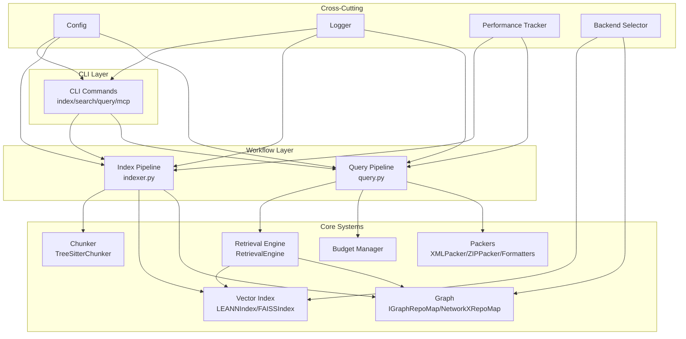

**Diagram sources**
- [cli.py:1-1656](file://src/ws_ctx_engine/cli/cli.py#L1-L1656)
- [indexer.py:1-493](file://src/ws_ctx_engine/workflow/indexer.py#L1-L493)
- [query.py:1-617](file://src/ws_ctx_engine/workflow/query.py#L1-L617)
- [backend_selector.py:1-191](file://src/ws_ctx_engine/backend_selector/backend_selector.py#L1-L191)
- [tree_sitter.py:1-160](file://src/ws_ctx_engine/chunker/tree_sitter.py#L1-L160)
- [retrieval.py:1-627](file://src/ws_ctx_engine/retrieval/retrieval.py#L1-L627)
- [vector_index.py:1-1120](file://src/ws_ctx_engine/vector_index/vector_index.py#L1-L1120)
- [graph.py:1-667](file://src/ws_ctx_engine/graph/graph.py#L1-L667)
- [xml_packer.py:1-239](file://src/ws_ctx_engine/packer/xml_packer.py#L1-L239)
- [logger.py:1-145](file://src/ws_ctx_engine/logger/logger.py#L1-L145)
- [performance.py:1-263](file://src/ws_ctx_engine/monitoring/performance.py#L1-L263)
- [config.py:1-399](file://src/ws_ctx_engine/config/config.py#L1-L399)

**Section sources**
- [cli.py:1-1656](file://src/ws_ctx_engine/cli/cli.py#L1-L1656)
- [indexer.py:1-493](file://src/ws_ctx_engine/workflow/indexer.py#L1-L493)
- [query.py:1-617](file://src/ws_ctx_engine/workflow/query.py#L1-L617)

## Core Components
- CLI layer: Provides commands for indexing, searching, querying, and MCP server operations. It validates inputs, resolves runtime dependencies, and delegates to workflow functions.
- Index pipeline: Parses codebase into chunks, builds vector and graph indexes, persists metadata, and supports incremental updates.
- Query pipeline: Loads persisted indexes, retrieves candidates via hybrid ranking, selects files within token budget, and packs output in configured format.
- Retrieval engine: Merges semantic similarity and PageRank scores, applies adaptive boosting, and normalizes results.
- Vector index: Supports multiple backends (LEANN, FAISS) with local or API embeddings and optional caching.
- Graph: Builds dependency graphs and computes PageRank using igraph or NetworkX.
- Output packers: Generate XML, ZIP, or structured text outputs with optional compression and deduplication.
- Backend selector: Centralized strategy for selecting optimal backends with graceful fallback.
- Configuration: YAML-based configuration with validation and defaults.
- Logging and performance: Structured logging and detailed performance metrics tracking.

**Section sources**
- [cli.py:1-1656](file://src/ws_ctx_engine/cli/cli.py#L1-L1656)
- [indexer.py:1-493](file://src/ws_ctx_engine/workflow/indexer.py#L1-L493)
- [query.py:1-617](file://src/ws_ctx_engine/workflow/query.py#L1-L617)
- [retrieval.py:1-627](file://src/ws_ctx_engine/retrieval/retrieval.py#L1-L627)
- [vector_index.py:1-1120](file://src/ws_ctx_engine/vector_index/vector_index.py#L1-L1120)
- [graph.py:1-667](file://src/ws_ctx_engine/graph/graph.py#L1-L667)
- [xml_packer.py:1-239](file://src/ws_ctx_engine/packer/xml_packer.py#L1-L239)
- [backend_selector.py:1-191](file://src/ws_ctx_engine/backend_selector/backend_selector.py#L1-L191)
- [config.py:1-399](file://src/ws_ctx_engine/config/config.py#L1-L399)
- [logger.py:1-145](file://src/ws_ctx_engine/logger/logger.py#L1-L145)
- [performance.py:1-263](file://src/ws_ctx_engine/monitoring/performance.py#L1-L263)

## Architecture Overview
The system follows a staged pipeline with clear separation of concerns:
- Stage 1: CLI orchestrates operations and validates configuration/runtime dependencies.
- Stage 2: Index pipeline builds semantic and structural indexes and persists metadata.
- Stage 3: Query pipeline loads indexes, performs hybrid retrieval, enforces token budget, and produces output.
- Stage 4: Output packers serialize results into the chosen format.

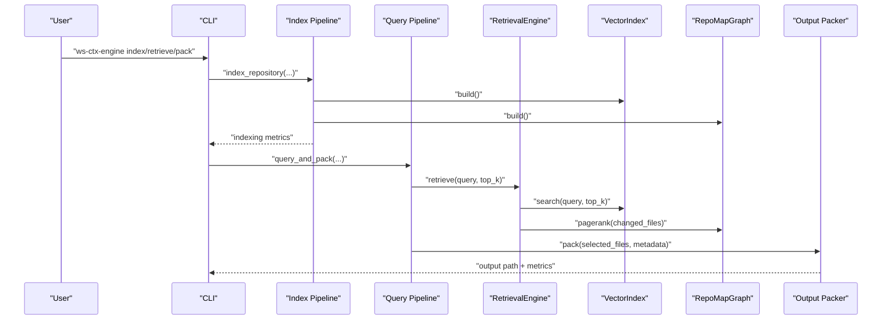

**Diagram sources**
- [cli.py:1-1656](file://src/ws_ctx_engine/cli/cli.py#L1-L1656)
- [indexer.py:1-493](file://src/ws_ctx_engine/workflow/indexer.py#L1-L493)
- [query.py:1-617](file://src/ws_ctx_engine/workflow/query.py#L1-L617)
- [retrieval.py:1-627](file://src/ws_ctx_engine/retrieval/retrieval.py#L1-L627)
- [vector_index.py:1-1120](file://src/ws_ctx_engine/vector_index/vector_index.py#L1-L1120)
- [graph.py:1-667](file://src/ws_ctx_engine/graph/graph.py#L1-L667)
- [xml_packer.py:1-239](file://src/ws_ctx_engine/packer/xml_packer.py#L1-L239)

## Detailed Component Analysis

### CLI Layer
- Responsibilities: Command routing, argument parsing, dependency preflight checks, and structured logging.
- Patterns: Factory-like resolution of runtime dependencies; observer pattern for logging; strategy-like agent-mode toggling.
- Integration points: Delegates to workflow functions; emits NDJSON in agent mode; manages quiet/verbose logging levels.

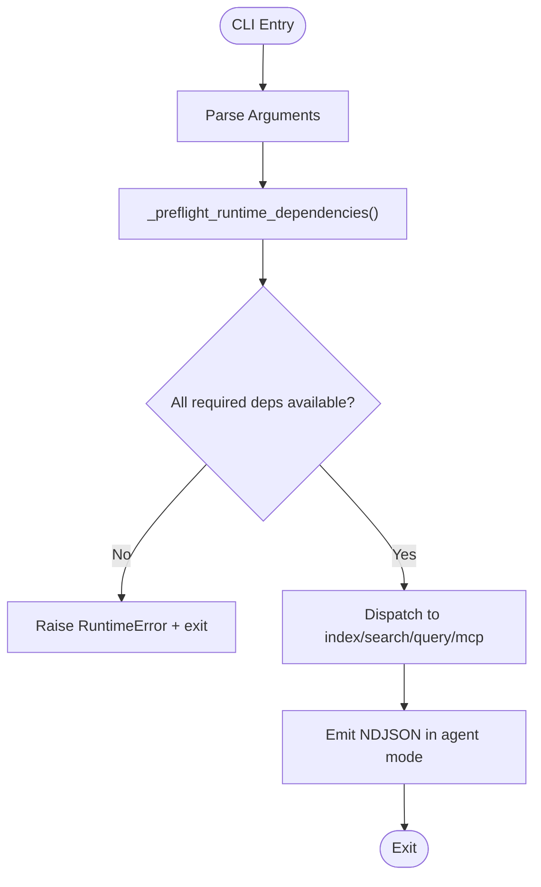

**Diagram sources**
- [cli.py:256-326](file://src/ws_ctx_engine/cli/cli.py#L256-L326)

**Section sources**
- [cli.py:1-1656](file://src/ws_ctx_engine/cli/cli.py#L1-L1656)

### Index Pipeline
- Phases: Parse codebase, build vector index, build graph, persist metadata, build domain keyword map.
- Incremental mode: Compares stored hashes to changed/deleted files and updates only affected parts.
- Backend selection: Uses BackendSelector to choose vector index and graph backends with fallback.
- Error handling: Raises descriptive errors on failures; logs with context.

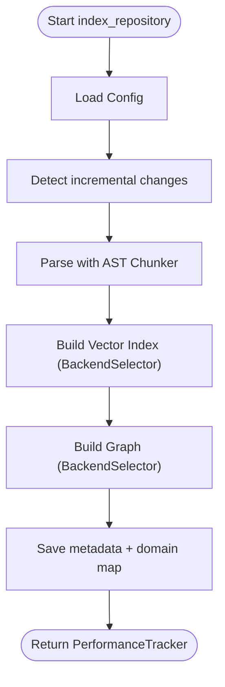

**Diagram sources**
- [indexer.py:72-371](file://src/ws_ctx_engine/workflow/indexer.py#L72-L371)
- [backend_selector.py:36-110](file://src/ws_ctx_engine/backend_selector/backend_selector.py#L36-L110)

**Section sources**
- [indexer.py:1-493](file://src/ws_ctx_engine/workflow/indexer.py#L1-L493)
- [backend_selector.py:1-191](file://src/ws_ctx_engine/backend_selector/backend_selector.py#L1-L191)

### Query Pipeline
- Phases: Load indexes, hybrid retrieval, budget selection, packing, and output generation.
- Hybrid ranking: Combines semantic similarity and PageRank with adaptive boosting and penalties.
- Budgeting: Greedy selection respecting token budget (80% content, 20% metadata).
- Packing: XML, ZIP, or structured text outputs with optional compression and deduplication.

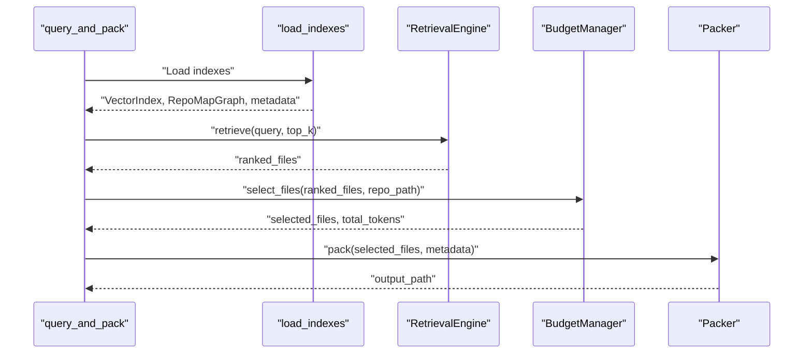

**Diagram sources**
- [query.py:230-617](file://src/ws_ctx_engine/workflow/query.py#L230-L617)
- [retrieval.py:250-368](file://src/ws_ctx_engine/retrieval/retrieval.py#L250-L368)
- [budget.py:50-105](file://src/ws_ctx_engine/budget/budget.py#L50-L105)
- [xml_packer.py:85-137](file://src/ws_ctx_engine/packer/xml_packer.py#L85-L137)

**Section sources**
- [query.py:1-617](file://src/ws_ctx_engine/workflow/query.py#L1-L617)
- [retrieval.py:1-627](file://src/ws_ctx_engine/retrieval/retrieval.py#L1-L627)
- [budget.py:1-105](file://src/ws_ctx_engine/budget/budget.py#L1-L105)
- [xml_packer.py:1-239](file://src/ws_ctx_engine/packer/xml_packer.py#L1-L239)

### Backend Selection Strategy
- Strategy pattern: Centralized BackendSelector chooses vector index, graph, and embeddings backends based on configuration and availability.
- Fallback levels: Optimal to minimal tiers depending on installed dependencies (igraph + LEANN + local embeddings to file-size ranking).
- Runtime resolution: CLI preflight checks resolve “auto” backends to concrete implementations.

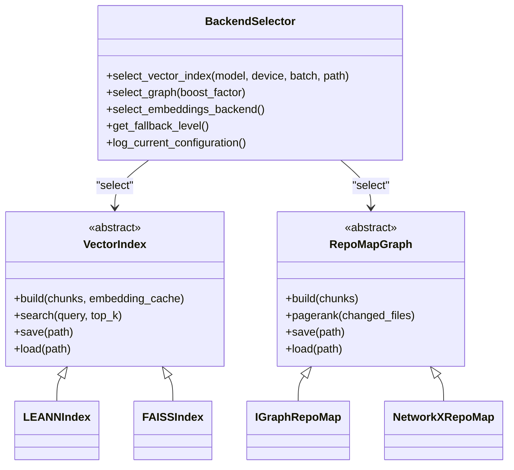

**Diagram sources**
- [backend_selector.py:13-191](file://src/ws_ctx_engine/backend_selector/backend_selector.py#L13-L191)
- [vector_index.py:21-85](file://src/ws_ctx_engine/vector_index/vector_index.py#L21-L85)
- [graph.py:19-95](file://src/ws_ctx_engine/graph/graph.py#L19-L95)

**Section sources**
- [backend_selector.py:1-191](file://src/ws_ctx_engine/backend_selector/backend_selector.py#L1-L191)
- [vector_index.py:1-1120](file://src/ws_ctx_engine/vector_index/vector_index.py#L1-L1120)
- [graph.py:1-667](file://src/ws_ctx_engine/graph/graph.py#L1-L667)

### Retrieval Engine
- Hybrid ranking: Merges normalized semantic and PageRank scores with configurable weights.
- Adaptive boosting: Symbol, path, and domain boosts vary by query classification.
- Penalties: Test file penalty reduces scores for test-related files.
- Normalization: Min-max normalization ensures scores in [0, 1].

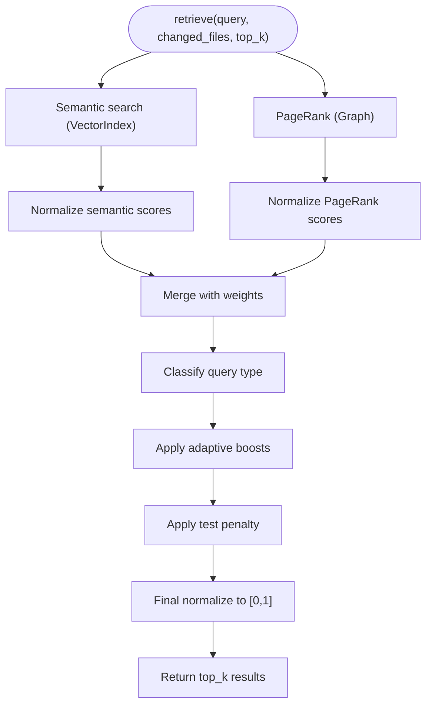

**Diagram sources**
- [retrieval.py:250-368](file://src/ws_ctx_engine/retrieval/retrieval.py#L250-L368)

**Section sources**
- [retrieval.py:1-627](file://src/ws_ctx_engine/retrieval/retrieval.py#L1-L627)

### Vector Index Backends
- LEANNIndex: Stores file-level embeddings; cosine similarity search; compact storage.
- FAISSIndex: Uses FAISS flat index wrapped in ID mapping for incremental updates; supports embedding cache.
- EmbeddingGenerator: Local sentence-transformers with API fallback; memory-aware selection.

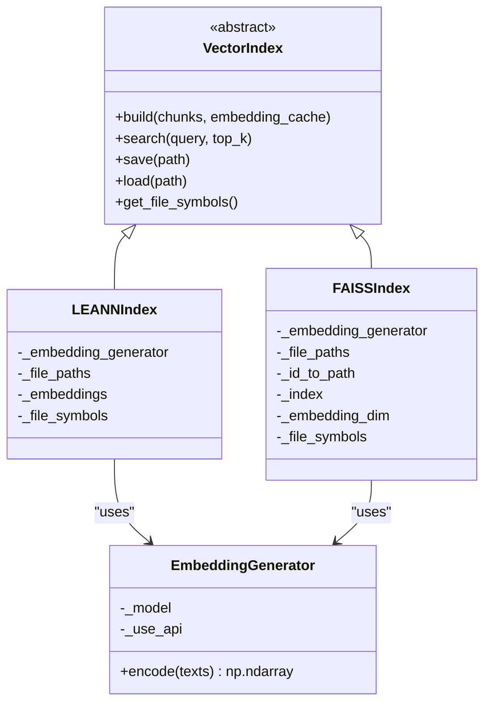

**Diagram sources**
- [vector_index.py:21-85](file://src/ws_ctx_engine/vector_index/vector_index.py#L21-L85)
- [vector_index.py:282-504](file://src/ws_ctx_engine/vector_index/vector_index.py#L282-L504)
- [vector_index.py:506-800](file://src/ws_ctx_engine/vector_index/vector_index.py#L506-L800)

**Section sources**
- [vector_index.py:1-1120](file://src/ws_ctx_engine/vector_index/vector_index.py#L1-L1120)

### Graph Construction and PageRank
- IGraphRepoMap: Fast C++ backend using python-igraph; supports boost for changed files.
- NetworkXRepoMap: Pure Python fallback; includes power iteration implementation when scipy unavailable.
- Automatic backend selection and load with fallback.

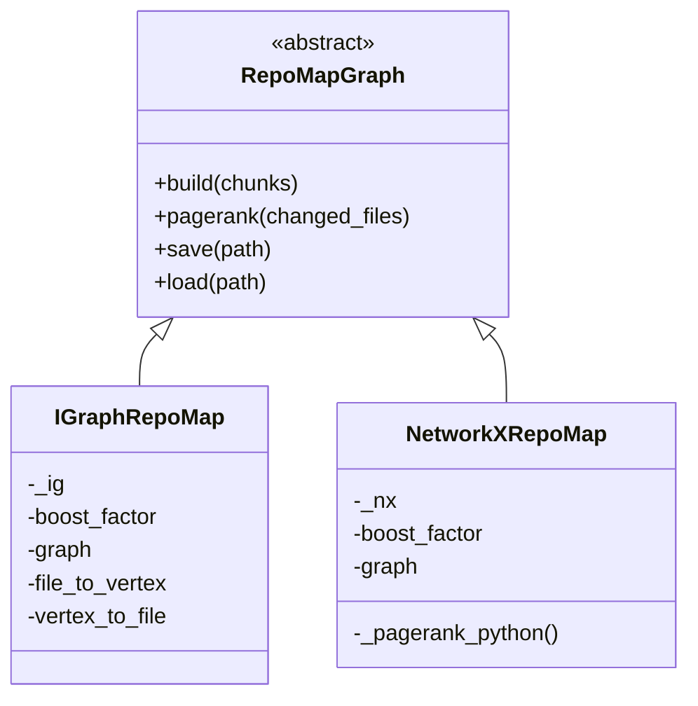

**Diagram sources**
- [graph.py:19-95](file://src/ws_ctx_engine/graph/graph.py#L19-L95)
- [graph.py:97-315](file://src/ws_ctx_engine/graph/graph.py#L97-L315)
- [graph.py:317-569](file://src/ws_ctx_engine/graph/graph.py#L317-L569)

**Section sources**
- [graph.py:1-667](file://src/ws_ctx_engine/graph/graph.py#L1-L667)

### Output Packers and Formatting
- XMLPacker: Generates XML with metadata and file entries; optional shuffling to combat “Lost in the Middle.”
- ZIPPacker: Packs files into ZIP archives.
- Formatters: JSON, YAML, Markdown, and TOON formatters for structured outputs.

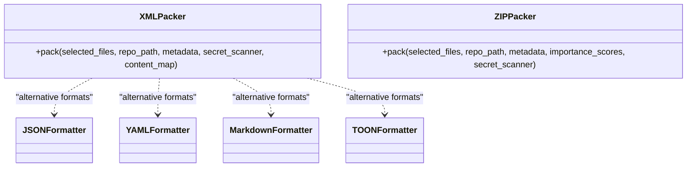

**Diagram sources**
- [xml_packer.py:51-239](file://src/ws_ctx_engine/packer/xml_packer.py#L51-L239)

**Section sources**
- [xml_packer.py:1-239](file://src/ws_ctx_engine/packer/xml_packer.py#L1-L239)

### Cross-Cutting Concerns
- Configuration: Centralized Config with validation and defaults; loaded from YAML.
- Logging: Structured logging with console and file handlers; fallback logging and phase metrics.
- Performance: PerformanceTracker records timings, file counts, index sizes, tokens, and memory usage.

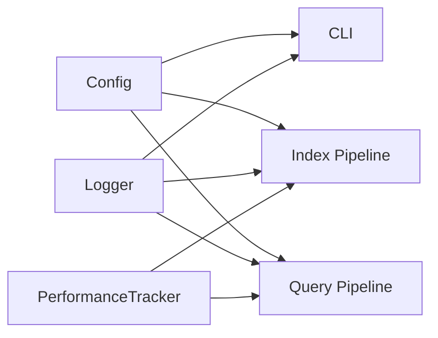

**Diagram sources**
- [config.py:16-399](file://src/ws_ctx_engine/config/config.py#L16-L399)
- [logger.py:13-145](file://src/ws_ctx_engine/logger/logger.py#L13-L145)
- [performance.py:72-263](file://src/ws_ctx_engine/monitoring/performance.py#L72-L263)

**Section sources**
- [config.py:1-399](file://src/ws_ctx_engine/config/config.py#L1-L399)
- [logger.py:1-145](file://src/ws_ctx_engine/logger/logger.py#L1-L145)
- [performance.py:1-263](file://src/ws_ctx_engine/monitoring/performance.py#L1-L263)

## Dependency Analysis
- CLI depends on workflow functions and runtime dependency checks.
- Index pipeline depends on chunker, vector index, graph, and metadata persistence.
- Query pipeline depends on retrieval engine, budget manager, and packers.
- Retrieval engine depends on vector index and graph.
- Vector index and graph implementations depend on third-party libraries (tree-sitter, igraph, networkx, faiss, sentence-transformers).
- BackendSelector centralizes backend selection and provides fallback logic.

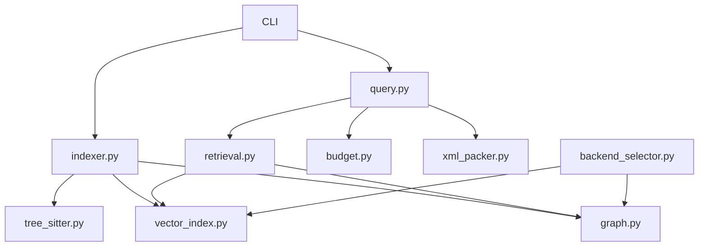

**Diagram sources**
- [cli.py:1-1656](file://src/ws_ctx_engine/cli/cli.py#L1-L1656)
- [indexer.py:1-493](file://src/ws_ctx_engine/workflow/indexer.py#L1-L493)
- [query.py:1-617](file://src/ws_ctx_engine/workflow/query.py#L1-L617)
- [backend_selector.py:1-191](file://src/ws_ctx_engine/backend_selector/backend_selector.py#L1-L191)
- [tree_sitter.py:1-160](file://src/ws_ctx_engine/chunker/tree_sitter.py#L1-L160)
- [retrieval.py:1-627](file://src/ws_ctx_engine/retrieval/retrieval.py#L1-L627)
- [vector_index.py:1-1120](file://src/ws_ctx_engine/vector_index/vector_index.py#L1-L1120)
- [graph.py:1-667](file://src/ws_ctx_engine/graph/graph.py#L1-L667)
- [xml_packer.py:1-239](file://src/ws_ctx_engine/packer/xml_packer.py#L1-L239)
- [budget.py:1-105](file://src/ws_ctx_engine/budget/budget.py#L1-L105)

**Section sources**
- [__init__.py:1-33](file://src/ws_ctx_engine/__init__.py#L1-L33)
- [cli.py:1-1656](file://src/ws_ctx_engine/cli/cli.py#L1-L1656)
- [indexer.py:1-493](file://src/ws_ctx_engine/workflow/indexer.py#L1-L493)
- [query.py:1-617](file://src/ws_ctx_engine/workflow/query.py#L1-L617)

## Performance Considerations
- Backend selection prioritizes optimal configurations (e.g., igraph + LEANN + local embeddings) and degrades gracefully.
- Incremental indexing minimizes rebuild costs by updating only changed files and leveraging embedding caches.
- Memory-aware embedding generation switches to API fallback when low memory is detected.
- PerformanceTracker captures phase timings, index sizes, and peak memory usage for diagnostics.

[No sources needed since this section provides general guidance]

## Troubleshooting Guide
- Dependency preflight: CLI validates runtime dependencies and suggests installation steps; errors are raised with actionable messages.
- Logging: Structured logs include timestamps, levels, and messages; fallback events are logged with component, primary, and fallback details.
- Error handling: Workflows wrap operations with try/except blocks, log context, and raise descriptive exceptions.

**Section sources**
- [cli.py:239-326](file://src/ws_ctx_engine/cli/cli.py#L239-L326)
- [logger.py:64-109](file://src/ws_ctx_engine/logger/logger.py#L64-L109)
- [indexer.py:174-253](file://src/ws_ctx_engine/workflow/indexer.py#L174-L253)
- [query.py:316-322](file://src/ws_ctx_engine/workflow/query.py#L316-L322)

## Conclusion
ws-ctx-engine’s architecture cleanly separates concerns across CLI, indexing, querying, retrieval, and output stages. The strategy-based backend selector, factory-style creation of components, and observer-style logging and performance tracking provide robustness, configurability, and observability. The hybrid retrieval engine balances semantic and structural signals, while budget-aware selection and flexible output packers deliver practical context packages tailored to downstream LLM consumption.