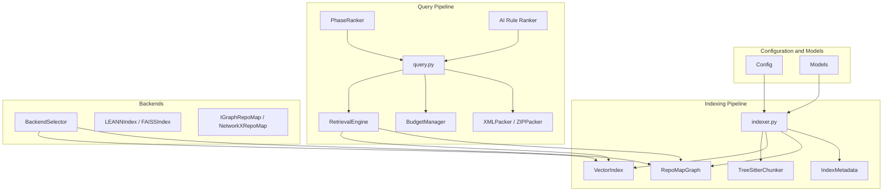
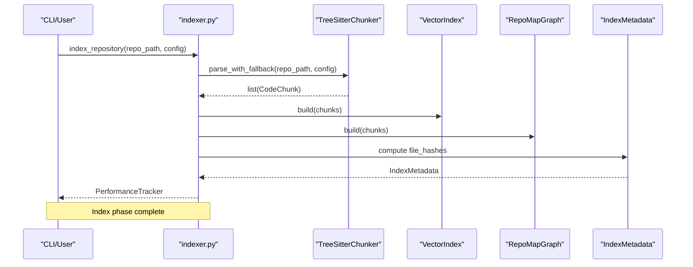
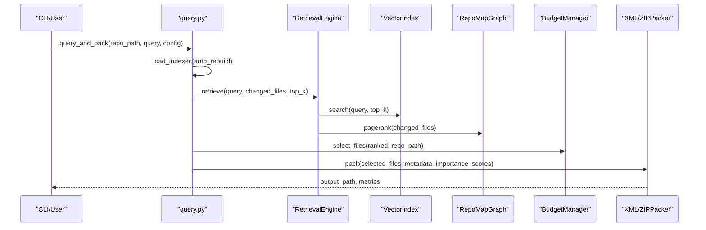
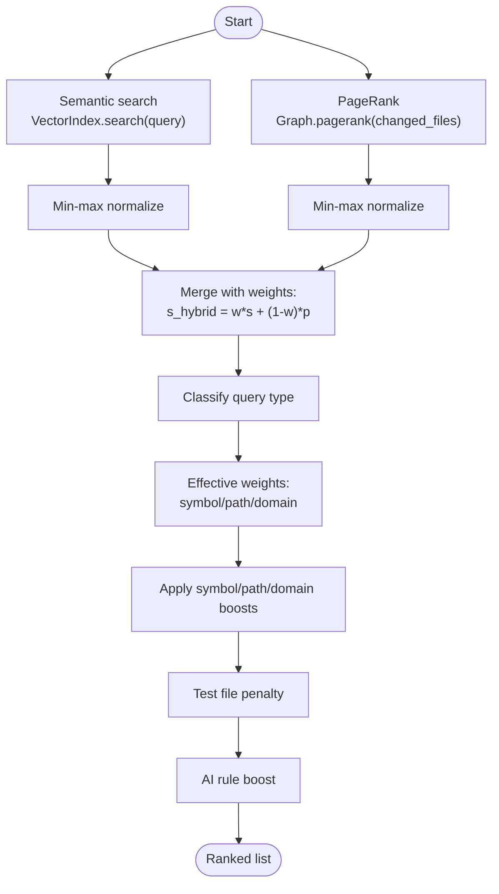
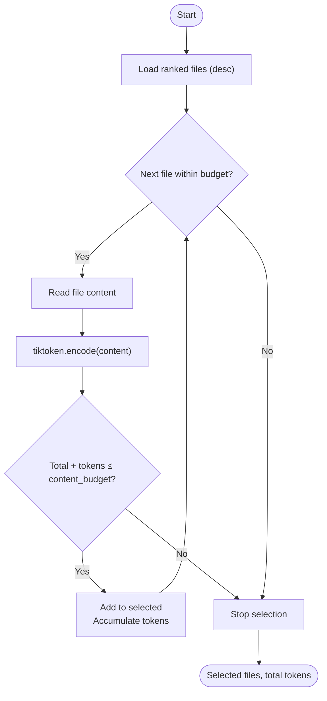
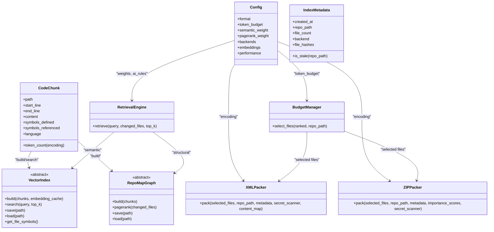
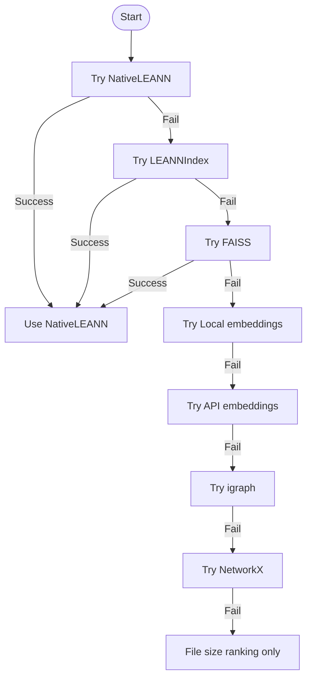
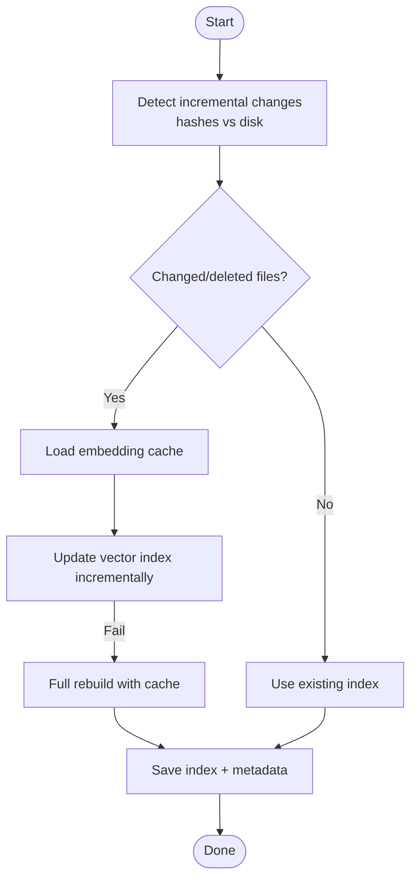
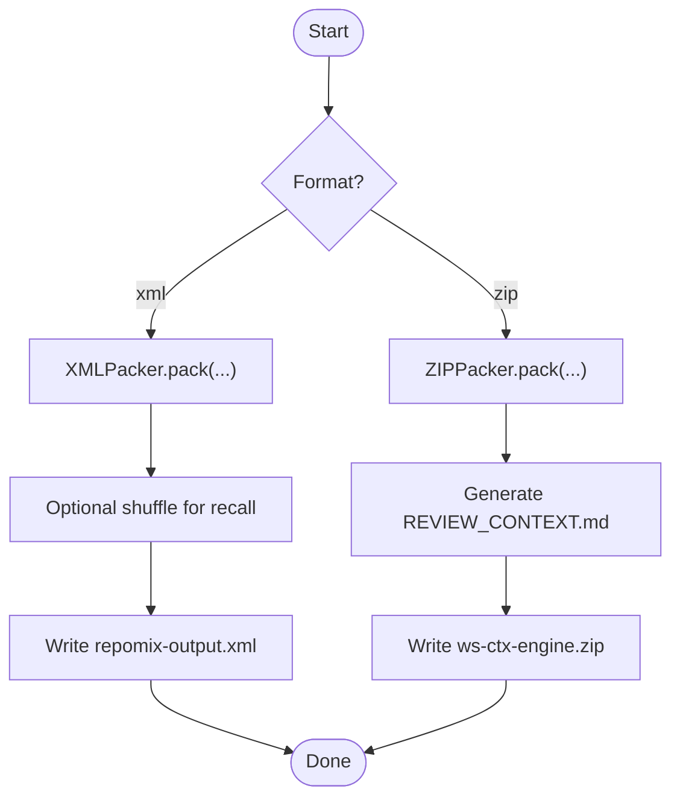
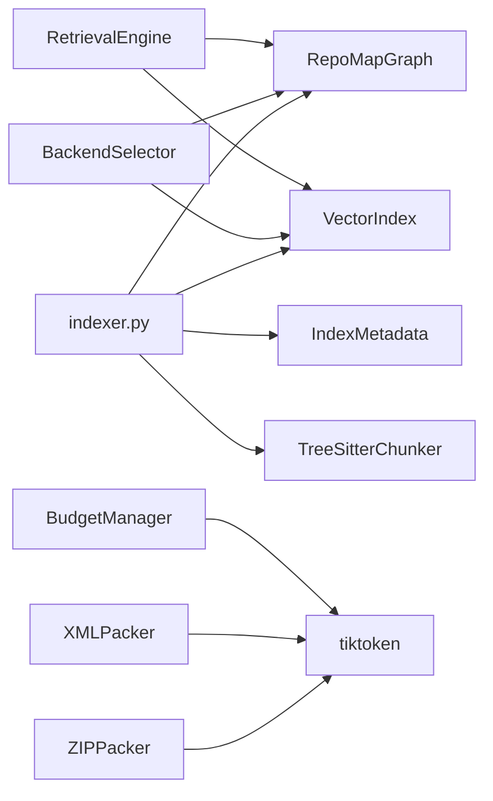

# Core Concepts

<cite>
**Referenced Files in This Document**
- [__init__.py](file://src/ws_ctx_engine/__init__.py)
- [config.py](file://src/ws_ctx_engine/config/config.py)
- [models.py](file://src/ws_ctx_engine/models/models.py)
- [budget.py](file://src/ws_ctx_engine/budget/budget.py)
- [retrieval.py](file://src/ws_ctx_engine/retrieval/retrieval.py)
- [phase_ranker.py](file://src/ws_ctx_engine/ranking/phase_ranker.py)
- [ranker.py](file://src/ws_ctx_engine/ranking/ranker.py)
- [vector_index.py](file://src/ws_ctx_engine/vector_index/vector_index.py)
- [graph.py](file://src/ws_ctx_engine/graph/graph.py)
- [backend_selector.py](file://src/ws_ctx_engine/backend_selector/backend_selector.py)
- [indexer.py](file://src/ws_ctx_engine/workflow/indexer.py)
- [query.py](file://src/ws_ctx_engine/workflow/query.py)
- [xml_packer.py](file://src/ws_ctx_engine/packer/xml_packer.py)
- [zip_packer.py](file://src/ws_ctx_engine/packer/zip_packer.py)
- [tree_sitter.py](file://src/ws_ctx_engine/chunker/tree_sitter.py)
- [base.py](file://src/ws_ctx_engine/chunker/base.py)
</cite>

## Table of Contents
1. [Introduction](#introduction)
2. [Project Structure](#project-structure)
3. [Core Components](#core-components)
4. [Architecture Overview](#architecture-overview)
5. [Detailed Component Analysis](#detailed-component-analysis)
6. [Dependency Analysis](#dependency-analysis)
7. [Performance Considerations](#performance-considerations)
8. [Troubleshooting Guide](#troubleshooting-guide)
9. [Conclusion](#conclusion)
10. [Appendices](#appendices)

## Introduction
This document explains the fundamental concepts behind ws-ctx-engine, focusing on:
- The hybrid ranking methodology that fuses semantic search with structural PageRank analysis
- Token budget management using tiktoken for precise LLM context window optimization
- The multi-stage pipeline from AST parsing through output generation
- The fallback strategy system ensuring production reliability
- Incremental indexing and its performance benefits
- Dual output formats (XML and ZIP) and their advantages
- Practical usage scenarios such as code review and bug investigation

## Project Structure
At a high level, ws-ctx-engine organizes functionality into cohesive subsystems:
- Configuration and models define runtime settings and shared data structures
- Indexing pipeline builds persistent artifacts (vector index, graph, metadata)
- Query pipeline retrieves, ranks, budgets, and packs results
- Ranking utilities adjust scores by phase, AI rule persistence, and domain signals
- Packaging utilities emit XML or ZIP outputs with metadata and manifests
- Backend selector coordinates robust fallback across vector index, graph, and embeddings

**Diagram sources**
- [indexer.py:72-371](file://src/ws_ctx_engine/workflow/indexer.py#L72-L371)
- [query.py:230-617](file://src/ws_ctx_engine/workflow/query.py#L230-L617)
- [retrieval.py:140-368](file://src/ws_ctx_engine/retrieval/retrieval.py#L140-L368)
- [budget.py:8-104](file://src/ws_ctx_engine/budget/budget.py#L8-L104)
- [xml_packer.py:51-137](file://src/ws_ctx_engine/packer/xml_packer.py#L51-L137)
- [zip_packer.py:17-90](file://src/ws_ctx_engine/packer/zip_packer.py#L17-L90)
- [backend_selector.py:13-110](file://src/ws_ctx_engine/backend_selector/backend_selector.py#L13-L110)
- [vector_index.py:21-85](file://src/ws_ctx_engine/vector_index/vector_index.py#L21-L85)
- [graph.py:19-94](file://src/ws_ctx_engine/graph/graph.py#L19-L94)

**Section sources**
- [__init__.py:1-33](file://src/ws_ctx_engine/__init__.py#L1-L33)
- [config.py:16-399](file://src/ws_ctx_engine/config/config.py#L16-L399)
- [models.py:10-152](file://src/ws_ctx_engine/models/models.py#L10-L152)

## Core Components
- Configuration: Centralized settings for output format, token budget, scoring weights, backend selection, and performance toggles
- Models: Typed data structures for code chunks and index metadata
- Indexing: AST parsing, vector index building, graph construction, and metadata persistence
- Query: Hybrid retrieval, phase-aware weighting, budget selection, and output packing
- Ranking: AI rule persistence, phase-aware weights, and domain/path/symbol boosting
- Packaging: XML and ZIP outputs with metadata and optional manifests
- Backends: Automatic fallback across vector index, graph, and embeddings

**Section sources**
- [config.py:16-399](file://src/ws_ctx_engine/config/config.py#L16-L399)
- [models.py:10-152](file://src/ws_ctx_engine/models/models.py#L10-L152)
- [indexer.py:72-371](file://src/ws_ctx_engine/workflow/indexer.py#L72-L371)
- [query.py:230-617](file://src/ws_ctx_engine/workflow/query.py#L230-L617)
- [retrieval.py:140-368](file://src/ws_ctx_engine/retrieval/retrieval.py#L140-L368)
- [phase_ranker.py:25-138](file://src/ws_ctx_engine/ranking/phase_ranker.py#L25-L138)
- [ranker.py:28-86](file://src/ws_ctx_engine/ranking/ranker.py#L28-L86)
- [xml_packer.py:51-137](file://src/ws_ctx_engine/packer/xml_packer.py#L51-L137)
- [zip_packer.py:17-90](file://src/ws_ctx_engine/packer/zip_packer.py#L17-L90)
- [backend_selector.py:13-110](file://src/ws_ctx_engine/backend_selector/backend_selector.py#L13-L110)

## Architecture Overview
The system implements a two-phase workflow:
- Index phase: Parses code, builds vector index and graph, persists metadata for staleness detection
- Query phase: Loads indexes, retrieves candidates with hybrid ranking, selects within token budget, and packs output

**Diagram sources**
- [indexer.py:72-371](file://src/ws_ctx_engine/workflow/indexer.py#L72-L371)
- [tree_sitter.py:57-89](file://src/ws_ctx_engine/chunker/tree_sitter.py#L57-L89)
- [vector_index.py:282-428](file://src/ws_ctx_engine/vector_index/vector_index.py#L282-L428)
- [graph.py:97-186](file://src/ws_ctx_engine/graph/graph.py#L97-L186)
- [models.py:87-152](file://src/ws_ctx_engine/models/models.py#L87-L152)

**Diagram sources**
- [query.py:230-617](file://src/ws_ctx_engine/workflow/query.py#L230-L617)
- [retrieval.py:250-368](file://src/ws_ctx_engine/retrieval/retrieval.py#L250-L368)
- [budget.py:50-104](file://src/ws_ctx_engine/budget/budget.py#L50-L104)
- [xml_packer.py:85-137](file://src/ws_ctx_engine/packer/xml_packer.py#L85-L137)
- [zip_packer.py:49-90](file://src/ws_ctx_engine/packer/zip_packer.py#L49-L90)

## Detailed Component Analysis

### Hybrid Ranking Methodology
Hybrid ranking combines semantic similarity and structural PageRank:
- Base scores are min-max normalized and merged using configurable weights
- Additional signals enhance relevance:
  - Symbol exact match boost
  - Path keyword match boost
  - Domain directory boost
  - Test file penalty
- AI rule persistence ensures critical project rule files are always prioritized
- Phase-aware weighting tailors scoring to agent phases (discovery, edit, test)

Mathematical formulation outline:
- Normalized semantic similarity: s_norm
- Normalized PageRank: p_norm
- Base hybrid score: s_hybrid = w_semantic · s_norm + w_pagerank · p_norm
- Query-type adaptive boosting: effective weights (symbol, path, domain) vary by query classification
- Final score: s_final = normalize(Base hybrid ± symbol/path/domain boosts ∓ test penalty)
- AI rule boost: if file is an AI rule file, score += boost; then re-sort

**Diagram sources**
- [retrieval.py:250-368](file://src/ws_ctx_engine/retrieval/retrieval.py#L250-L368)
- [ranker.py:28-86](file://src/ws_ctx_engine/ranking/ranker.py#L28-L86)
- [phase_ranker.py:96-122](file://src/ws_ctx_engine/ranking/phase_ranker.py#L96-L122)

**Section sources**
- [retrieval.py:140-368](file://src/ws_ctx_engine/retrieval/retrieval.py#L140-L368)
- [ranker.py:28-86](file://src/ws_ctx_engine/ranking/ranker.py#L28-L86)
- [phase_ranker.py:25-138](file://src/ws_ctx_engine/ranking/phase_ranker.py#L25-L138)

### Token Budget Management with tiktoken
Token budget management ensures outputs fit within LLM context windows:
- BudgetManager reserves a fixed percentage for metadata and uses the remainder for file content
- Greedy knapsack selection accumulates files in descending order of importance until content budget is exhausted
- tiktoken encoding is used to count tokens precisely for each file

**Diagram sources**
- [budget.py:50-104](file://src/ws_ctx_engine/budget/budget.py#L50-L104)

**Section sources**
- [budget.py:8-104](file://src/ws_ctx_engine/budget/budget.py#L8-L104)
- [models.py:60-84](file://src/ws_ctx_engine/models/models.py#L60-L84)

### Multi-Stage Pipeline Architecture
The pipeline proceeds through distinct stages:
1. Index phase
   - AST parsing with Tree-Sitter and fallbacks
   - Vector index construction (LEANN or FAISS)
   - Graph construction (PageRank)
   - Metadata persistence for staleness detection
2. Query phase
   - Load indexes with auto-rebuild on staleness
   - Hybrid retrieval with ranking signals
   - Budget selection
   - Output packing (XML or ZIP)

**Diagram sources**
- [config.py:16-399](file://src/ws_ctx_engine/config/config.py#L16-L399)
- [models.py:10-152](file://src/ws_ctx_engine/models/models.py#L10-L152)
- [vector_index.py:21-84](file://src/ws_ctx_engine/vector_index/vector_index.py#L21-L84)
- [graph.py:19-94](file://src/ws_ctx_engine/graph/graph.py#L19-L94)
- [retrieval.py:140-368](file://src/ws_ctx_engine/retrieval/retrieval.py#L140-L368)
- [budget.py:8-104](file://src/ws_ctx_engine/budget/budget.py#L8-L104)
- [xml_packer.py:51-137](file://src/ws_ctx_engine/packer/xml_packer.py#L51-L137)
- [zip_packer.py:17-90](file://src/ws_ctx_engine/packer/zip_packer.py#L17-L90)

**Section sources**
- [indexer.py:72-371](file://src/ws_ctx_engine/workflow/indexer.py#L72-L371)
- [query.py:230-617](file://src/ws_ctx_engine/workflow/query.py#L230-L617)
- [tree_sitter.py:57-89](file://src/ws_ctx_engine/chunker/tree_sitter.py#L57-L89)
- [base.py:41-176](file://src/ws_ctx_engine/chunker/base.py#L41-L176)

### Fallback Strategy System
The fallback system ensures production reliability by gracefully degrading capabilities:
- BackendSelector orchestrates fallback chains across vector index, graph, and embeddings
- Vector index backends: NativeLEANN → LEANNIndex → FAISS
- Graph backends: igraph → NetworkX → minimal fallback
- Embeddings backends: local → API
- Logging captures fallback events and reasons

**Diagram sources**
- [backend_selector.py:13-110](file://src/ws_ctx_engine/backend_selector/backend_selector.py#L13-L110)
- [vector_index.py:282-428](file://src/ws_ctx_engine/vector_index/vector_index.py#L282-L428)
- [graph.py:572-621](file://src/ws_ctx_engine/graph/graph.py#L572-L621)

**Section sources**
- [backend_selector.py:13-191](file://src/ws_ctx_engine/backend_selector/backend_selector.py#L13-L191)
- [vector_index.py:96-280](file://src/ws_ctx_engine/vector_index/vector_index.py#L96-L280)
- [graph.py:572-667](file://src/ws_ctx_engine/graph/graph.py#L572-L667)

### Incremental Indexing
Incremental indexing optimizes performance for repeated queries:
- Detects changed and deleted files by comparing stored hashes against current disk state
- Applies embedding cache to avoid re-embedding unchanged files during full rebuilds
- Updates vector index incrementally when supported; otherwise falls back to full rebuild
- Persists metadata enabling staleness detection and auto-rebuild

**Diagram sources**
- [indexer.py:27-69](file://src/ws_ctx_engine/workflow/indexer.py#L27-L69)
- [indexer.py:200-234](file://src/ws_ctx_engine/workflow/indexer.py#L200-L234)
- [indexer.py:374-401](file://src/ws_ctx_engine/workflow/indexer.py#L374-L401)
- [models.py:108-151](file://src/ws_ctx_engine/models/models.py#L108-L151)

**Section sources**
- [indexer.py:27-69](file://src/ws_ctx_engine/workflow/indexer.py#L27-L69)
- [indexer.py:200-234](file://src/ws_ctx_engine/workflow/indexer.py#L200-L234)
- [indexer.py:374-401](file://src/ws_ctx_engine/workflow/indexer.py#L374-L401)
- [models.py:108-151](file://src/ws_ctx_engine/models/models.py#L108-L151)

### Dual Output Formats
Two output formats serve different workflows:
- XML (paste workflows)
  - Repomix-style XML with metadata and file contents
  - Optional context shuffling to improve model recall by placing top-ranked files at both ends
  - Suitable for direct pasting into chat UIs
- ZIP (upload workflows)
  - ZIP archive preserving directory structure under files/
  - REVIEW_CONTEXT.md manifest with repository metadata, included files, importance scores, and suggested reading order
  - Ideal for uploading to platforms requiring structured archives

**Diagram sources**
- [xml_packer.py:51-137](file://src/ws_ctx_engine/packer/xml_packer.py#L51-L137)
- [zip_packer.py:17-90](file://src/ws_ctx_engine/packer/zip_packer.py#L17-L90)
- [query.py:413-587](file://src/ws_ctx_engine/workflow/query.py#L413-L587)

**Section sources**
- [xml_packer.py:51-239](file://src/ws_ctx_engine/packer/xml_packer.py#L51-L239)
- [zip_packer.py:17-254](file://src/ws_ctx_engine/packer/zip_packer.py#L17-L254)
- [query.py:413-587](file://src/ws_ctx_engine/workflow/query.py#L413-L587)

### Practical Examples
- Code review
  - Use XML output for quick paste into review UIs; leverage context shuffling to improve recall
  - Optionally enable compression and session deduplication to reduce token usage
- Bug investigation
  - Use ZIP output with REVIEW_CONTEXT.md for structured upload and reproducibility
  - Apply phase-aware ranking (e.g., edit mode) to emphasize verbatim code and related definitions
  - Provide changed_files to boost PageRank scores for files likely involved in the issue

**Section sources**
- [phase_ranker.py:96-122](file://src/ws_ctx_engine/ranking/phase_ranker.py#L96-L122)
- [xml_packer.py:18-49](file://src/ws_ctx_engine/packer/xml_packer.py#L18-L49)
- [zip_packer.py:133-254](file://src/ws_ctx_engine/packer/zip_packer.py#L133-L254)
- [query.py:413-587](file://src/ws_ctx_engine/workflow/query.py#L413-L587)

## Dependency Analysis
Key dependencies and relationships:
- RetrievalEngine depends on VectorIndex and RepoMapGraph
- BudgetManager depends on tiktoken encoding and file system
- XMLPacker and ZIPPacker depend on tiktoken and file system
- BackendSelector centralizes fallback across vector index and graph
- Indexer coordinates parsing, indexing, graph building, and metadata persistence

**Diagram sources**
- [retrieval.py:140-368](file://src/ws_ctx_engine/retrieval/retrieval.py#L140-L368)
- [budget.py:8-104](file://src/ws_ctx_engine/budget/budget.py#L8-L104)
- [xml_packer.py:75-83](file://src/ws_ctx_engine/packer/xml_packer.py#L75-L83)
- [zip_packer.py:39-47](file://src/ws_ctx_engine/packer/zip_packer.py#L39-L47)
- [backend_selector.py:13-110](file://src/ws_ctx_engine/backend_selector/backend_selector.py#L13-L110)
- [indexer.py:72-371](file://src/ws_ctx_engine/workflow/indexer.py#L72-L371)

**Section sources**
- [retrieval.py:140-368](file://src/ws_ctx_engine/retrieval/retrieval.py#L140-L368)
- [budget.py:8-104](file://src/ws_ctx_engine/budget/budget.py#L8-L104)
- [xml_packer.py:75-83](file://src/ws_ctx_engine/packer/xml_packer.py#L75-L83)
- [zip_packer.py:39-47](file://src/ws_ctx_engine/packer/zip_packer.py#L39-L47)
- [backend_selector.py:13-110](file://src/ws_ctx_engine/backend_selector/backend_selector.py#L13-L110)
- [indexer.py:72-371](file://src/ws_ctx_engine/workflow/indexer.py#L72-L371)

## Performance Considerations
- Incremental indexing minimizes rebuild costs by updating only changed files and leveraging embedding caches
- Token budget management prevents oversized outputs and reduces latency
- Phase-aware ranking tailors scoring to agent phases, reducing irrelevant context
- Backend fallback ensures degraded performance remains usable
- Rust-accelerated file walking and embedding generation further optimize throughput

[No sources needed since this section provides general guidance]

## Troubleshooting Guide
Common issues and remedies:
- Index staleness
  - Symptom: Stale indexes trigger rebuild
  - Action: Run indexing again; ensure metadata is present and hashes match
- Backend unavailability
  - Symptom: ImportError for igraph or FAISS
  - Action: Install required packages; BackendSelector will fall back to available backends
- Out-of-memory during embeddings
  - Symptom: MemoryError during local model initialization or encoding
  - Action: BackendSelector switches to API embeddings automatically
- Empty or insufficient results
  - Symptom: No files selected within budget
  - Action: Increase token budget, adjust weights, or relax filters

**Section sources**
- [indexer.py:404-492](file://src/ws_ctx_engine/workflow/indexer.py#L404-L492)
- [backend_selector.py:13-110](file://src/ws_ctx_engine/backend_selector/backend_selector.py#L13-L110)
- [vector_index.py:130-280](file://src/ws_ctx_engine/vector_index/vector_index.py#L130-L280)
- [query.py:316-322](file://src/ws_ctx_engine/workflow/query.py#L316-L322)

## Conclusion
ws-ctx-engine integrates semantic and structural ranking with precise token budgeting to deliver optimized context for LLMs. Its robust fallback system, incremental indexing, and dual output formats support reliable, efficient workflows across diverse use cases like code review and bug investigation.

[No sources needed since this section summarizes without analyzing specific files]

## Appendices

### Mathematical Formulation Summary
- Base hybrid score: s_hybrid = w · s_norm + (1 − w) · p_norm
- Query classification determines effective boosting weights for symbol/path/domain
- Final score normalization ensures [0, 1] range
- AI rule boost adds a constant to ensure critical files are prioritized

**Section sources**
- [retrieval.py:250-368](file://src/ws_ctx_engine/retrieval/retrieval.py#L250-L368)
- [ranker.py:28-86](file://src/ws_ctx_engine/ranking/ranker.py#L28-L86)